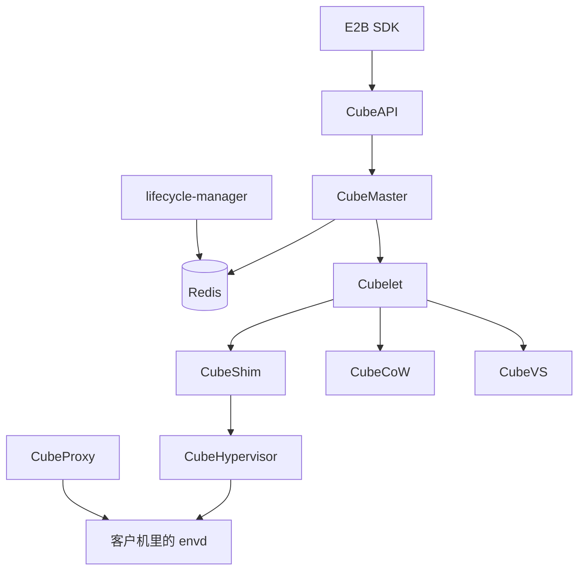

# CubeSandbox：面向 AI Agent 的微虚拟机沙箱

CubeSandbox 是腾讯云在 2026 年开源的微虚拟机沙箱。每台沙箱一份自己的 Linux 内核，监视器是基于 RustVMM 的 CubeHypervisor。创建从已经烤在本机磁盘上的内存镜像和 rootfs 恢复：磁盘用 XFS 的一次 `FICLONE` 共享 extent，内存用 `mmap(MAP_PRIVATE)` 把没写过的页留在页缓存里。

仓库是 [TencentCloud/CubeSandbox](https://github.com/TencentCloud/CubeSandbox)，协议 Apache-2.0，文档在 [cubesandbox.com](https://cubesandbox.com/zh/)。对外接口兼容 [E2B](https://e2b.dev/) SDK。计算节点要 KVM。x86_64 是最初的路径，0.5.0 起 ARM64 也走完整编译。没有裸金属时，普通云服务器可以走 PVM；官方把裸金属标成性能更好的部署。延迟和内存数字来自项目自己的基准和工程文章。

它把隔离级别定死在微虚拟机上。DSec 让训练任务在预热容器、容器、Firecracker、QEMU 里选。OpenSandbox 让创建请求选 runc、gVisor、Kata，或者 FastSandbox 的 Firecracker 模板。AgentENV 也是每台沙箱一台 Firecracker，但磁盘和内存快照都是 OverlayBD 层。CubeSandbox 的共享发生在文件系统 extent 和页缓存上，监视器不是 Firecracker。

## 一次创建经过谁

控制面不在本地记账。CubeAPI 用 Rust 和 Axum 把兼容 E2B 的 REST 转成内部 gRPC，鉴权可以接到外部回调。CubeMaster 用 Go 看资源、选一台 Cubelet，把创建、销毁、暂停、恢复发下去，再把生命周期事件写进 Redis。架构说明把 Redis 写成沙箱元数据、事件、代理路由和协调锁的共享状态。CubeAPI 和 CubeMaster 自己不落账本，所以这两类进程可以多副本横着加。

AgentENV 的沙箱到节点的绑定放在 Scheduler 进程内存里，调度器重启后要等心跳才能再转发。DSec 把所属节点编进沙箱 ID，入口不存这张表。CubeSandbox 把表放在 Redis 里，CubeAPI 和代理都来读它。

进沙箱内部服务的流量由 CubeProxy 转发。它基于 OpenResty，按 Redis 里的路由表找目标。主机名是 `端口-沙箱ID.域名`；不做泛解析时，用路径 `/sandbox/<沙箱ID>/...`。旁边的 cube-lifecycle-manager 订阅生命周期事件。空闲超时后它可以暂停沙箱；下一次请求打到已暂停的沙箱，恢复插进这条转发路径。Web 控制台默认开在 `:12088`。0.7.0 把节点运维拆到 CubeOps，创建和调度仍由 CubeMaster 承担。

| 组件 | 放在哪 | 管什么 |
| --- | --- | --- |
| CubeAPI | 控制面，Rust | REST 网关，转成内部 gRPC |
| CubeMaster | 控制面，Go | 选节点，下发创建、暂停、恢复、销毁 |
| Redis | 控制面 | 元数据、事件、路由、锁 |
| CubeProxy | 入口，OpenResty | 按主机名或路径把流量送进沙箱 |
| cube-lifecycle-manager | 控制面旁路，Go | 空闲暂停，请求到达时触发恢复 |
| Cubelet | 每台计算节点，Go | 这台机器上沙箱从创建到销毁 |
| CubeShim | 节点，Rust | containerd Shim v2，摆好 rootfs、内存文件和内核 |
| CubeHypervisor | 节点，Rust | RustVMM + KVM。vCPU、内存、virtio 设备、暂停和快照 |
| CubeCoW | 节点，Rust | XFS reflink 上的卷、快照、克隆 |
| CubeVS | 节点内核，eBPF | 每沙箱的 NAT、连接跟踪、出站策略 |
| CubeEgress | 节点，OpenResty | HTTP/HTTPS 过滤、注入密钥、写审计 |

节点上，Cubelet 管生命周期，拉镜像走 containerd，卷操作走 CubeCoW。CubeShim 站在“containerd 眼中的一个容器”和“实际的微虚拟机”之间，通过 vsock 和客户机通信。CubeHypervisor 管 virtio 块设备、网络、vsock 和文件系统，跑在收紧过的 seccomp 白名单里。项目致谢了 Cloud Hypervisor、Kata Containers、virtiofsd 和 containerd-shim-rs，并写明部分组件按自己的运行模型改过。

客户机里听命令的是 envd，默认端口 `49983`，`/health` 在可以接执行和文件请求时返回 204。`run_code` 还依赖镜像里的 Jupyter，端口 `49999`。只跑自己的 Web 服务、不用这些 SDK 能力时，镜像可以不装 envd，探针改指向应用自己的健康检查。AgentENV 把 envd 放进客户机，常常就是 PID 1。OpenSandbox 的对应进程叫 execd，默认端口 44772，协议是另一份。DSec 把通道拆成 Aether 和每个 shell 会话一个 Chronus。CubeSandbox 走的是 E2B 这条 envd。

## 模板是烤好的快照，创建是本机克隆

OCI 镜像不直接当沙箱跑。它提供根文件系统、入口命令和环境变量。Buildkit 把镜像展开成微虚拟机用的 rootfs，再启动一台临时虚拟机，等配置好的 HTTP 探针返回 2xx，才冻结当时的文件系统和内存，登记成模板。探针返回得太早，快照里的服务可能还在初始化；一直不成功，构建会超时。同一个镜像可以按 CPU、内存、网络和启动命令做成不同模板。从一台正在跑的沙箱提交，则把提交那一刻的文件和内存一起收进新模板。模板就绪之后，由它创建出来的沙箱，在创建调用返回时，被探测的那个端口就已经能提供服务。只暴露、没有被探测的端口没有这层保证。

云知声写在官方博客上的 rollout 把分发说具体了：CubeMaster 把烤好的 rootfs 推到各计算节点，节点在本地再跑一次虚拟机，留下内存快照。创建时克隆的是这份已经在本机磁盘上的副本，关键路径上不访问网络。每台计算节点都要有足够的本地盘。他们也写到，`/data/cubelet` 必须是打开了 reflink 的 XFS，否则 CubeCoW 拒绝启动。单节点软件设计上限他们写成 3000 个存活沙箱，并把这次本地克隆对应到官方所说的约 60 毫秒冷启动。那是他们的压测叙述，不是后面 BMI5 表的复测。

0.7.0 起，暂停后的内存和文件系统可以落到 S3，从而在 A 节点暂停、在 B 节点恢复，或在已经同步过的节点上用同一份快照再拉起一台。这是预览，默认用内置 MinIO。同一次发布里还有 CubeS3lvol：SPDK 做以 S3 为后端的写时复制块设备，本机先写、再异步上传，靠本地 WAL 和 journal 保证崩溃后能恢复。毫秒级创建仍是本地 reflink。S3 解决的是状态跨过单机磁盘。AgentENV 的分叉明确不能换机器，因为共享的是这台机器的页缓存。OpenSandbox 的 FastSandbox 恢复可以落到另一台 Fastlet，但那条路径留在制品库里的是检查点，客户端还得重新解析端点。

## 磁盘是一次 ioctl，快照之间没有父子链

虚拟机的状态是磁盘加内存，两边要一起拍、一起还原。磁盘放在 XFS 的 reflink 上。一次快照的核心是 `FICLONE`：新文件和旧文件共享同一批物理 extent，只改元数据。XFS 用 inode 里的 B+ 树（BMBT）记逻辑偏移到物理块，extent 上的 shared 标志表示这块被多个文件引用。全局还有一棵引用计数树。`FICLONE` 之后共享块的引用计数至少是 2；降回 1 时，这块重新变成独占，写入不必再分裂。谁先写某一块，文件系统才把那一块复制成写入者私有的。快照文件的映射和物理块不变。

裸 reflink 只解决快。CubeCoW 在上面加了三件工程上的事。

快照是扁平的。所有快照的 `origin_volume` 记的是最终祖先卷，快照文件也放在祖先卷的目录下。文件系统视角里，它们和主卷是平级文件，各自有独立的块映射。删除中间一份就是 `unlink` 一个普通文件，引用计数由 XFS 减一，其他快照不用跟着改。标准 reflink 可以做“快照的快照”，CubeCoW 不沿着那条链去找父快照。

磁盘就是账本。卷名单等于扫 `volumes/`，快照名单等于扫卷目录再去掉主文件，大小和时间戳来自 `stat` 和 `mtime`。引擎启动时 `scan_and_rebuild_index()` 重建内存索引。主文件在，就登记成卷。目录空了，删掉。主文件没了但还有子文件，恢复子快照、不登记卷。零字节的快照文件删掉，那是崩溃时 `FICLONE` 没做完。不另写一份容易和磁盘分叉的账本。

卷名和快照名共用一个全局命名空间，写锁里原子占名。一次快照在引擎层就是占名、一次 `FICLONE`、落下目录项。AgentENV 的暂停是把可写层封存成新的只读层，再打开一层空的可写层，历史是一叠段映射。CubeSandbox 的历史是同一目录里的一堆文件，共享关系在 XFS 的引用计数里，不在层文件的索引里。

0.6.0 另加了 Volume。它的生命周期和单台沙箱分开，可以挂到不同沙箱上，后端用插件扩展。这是数据盘。上面说的是整台虚拟机的根文件系统加内存。

## 内存快照认的是匿名页，长跑再认 soft-dirty

生产路径上的虚拟机几乎都从一份内存镜像恢复：创建来自模板，克隆来自临时快照，回滚来自目标快照。监视器不用 `read()` 把镜像灌进一段匿名内存。它用 `mmap(MAP_PRIVATE)` 把文件映射到客户机地址空间，这一步只建映射。客户机读到某一页，内核才从页缓存填进来，这一页仍是文件页，同一份镜像上的多台虚拟机可以共享。客户机第一次写某一页，内核把它复制成这个进程私有的匿名页。

于是“自这次恢复以来写过的页”可以直接从 `/proc/<pid>/pagemap` 读。每条记录 8 字节。bit 63 是这一页是否在场，bit 61 是不是匿名页。增量模式只写 present 并且匿名的页。没写到的偏移靠 reflink 继续指向上一份镜像，所以只写一部分仍然是一份完整布局。没有那份廉价的基线文件，增量就拼不回整份内存。

短命沙箱用这个集合够了。长跑的沙箱上，匿名页只增不减，下一次快照会把自启动以来写过的页再写一遍，两次快照之间真正改过的可能只有几十 MiB。soft-dirty 在这上面再滤一层。内核在页表项里记“上次清标记之后又写过”，pagemap 的 bit 55 把它暴露给用户态。要写入的页是在场、匿名、并且 soft-dirty。清标记是往 `/proc/<pid>/clear_refs` 写 4：内核扫页表，把标记清掉，并把对应页表项改成只读。之后再写，会走写保护缺页，标记重新置上。

客户机必须已经暂停。顺序是读 pagemap、写出脏页、再清标记、然后恢复。清标记如果放在写出之前，写出这段时间里的写入会丢。内核给新建页表项的 soft-dirty 默认是 1，所以第一次 soft-dirty 快照自动等于“全部匿名页”，写完再清，下一次才是真增量。内核不支持时退回匿名页，再不行退回整份内存。节点按 soft-dirty、pagemap 匿名页、全量这条链降级，基础快照被删或断链也不会让操作失败，只是快照变大。

`clear_refs` 要扫整张页表。客户机内存到数 GiB 时，这篇 2026 年 6 月的原理文章把开销写成数百毫秒，并且之后的写入会多一次写保护缺页。他们不在虚拟机刚恢复时付这笔钱，那会卡住第一次进用户态。第一次清标记推迟到第一次快照写完之后，开销落在调用方已经在等的那次快照上。

AgentENV 的内存快照是另一条路。Firecracker 先做状态差异，节点用 `process_vm_readv` 把脏页读出来，写成一层 OverlayBD，恢复时多台沙箱共用一块只读 ublk，写过才变成匿名页。userfaultfd 那条实现留在仓库里，当前构建不用。DSec 的 microVM 用 virtio-pmem 和 DAX 让只读根文件系统不要在客户机里再缓存一份，DAMON 加 balloon 回收空闲页。CubeSandbox 减掉的重复，是同一份内存镜像上还没被这台虚拟机写过的页。三套共享的对象不一样。

克隆没有单独的 RPC。2026 年 6 月的原理文章把它写成三步旧操作：先对源沙箱打一份快照，再按这份快照创建 N 台，最后尽力删掉临时快照。`concurrency` 只并行中间的 N 次创建。任一子任务失败，已经建出来的克隆会被销毁，调用方拿到的要么是 N 台，要么是异常。源虚拟机在打这份临时快照时会暂停再恢复，文章里这个窗口通常不到 100 毫秒，回来仍是原来的进程和原来的映射。磁盘上 N 份 rootfs 共享同一批 extent；内存镜像也共享。谁先写，谁分裂。AgentENV 的分叉也是源沙箱短暂停一下，但子沙箱直接继承这台机器上的层和映射，公开文档写一次最多 16 个，不能换节点。

## 三个 eBPF 程序盖住报文，密钥留在宿主机

每个沙箱一块 TAP，没有 Linux Bridge，也没有一张随沙箱数量变长的 iptables 链。CubeVS 用三个 eBPF 程序：

| 程序 | 挂在哪 | 做什么 |
| --- | --- | --- |
| `from_cube` | 每块 TAP 的 TC ingress | 策略、DNS 学习、SNAT、代答 ARP |
| `from_world` | 宿主机网卡的 TC ingress | 按会话做反向 NAT，或按端口映射转入 |
| `from_envoy` | `cube-dev` 的 TC egress | 把代理回包和健康检查送回客户机 |

沙箱内部地址固定成 `169.254.68.6`，网关是 `169.254.68.5`。这条链路上没有真实网关主机，`from_cube` 直接代答 ARP。出公网时源地址换成宿主机 SNAT 池里的地址，端口从 30000 起。同一沙箱的连接落在同一个 SNAT 地址上。回包靠两张会话表对上五元组。TCP 状态参照内核连接跟踪，已建立的连接可以留几个小时，半开连接几分钟内回收。

出站策略按沙箱分开。允许列表优先于拒绝列表，都没有命中则放行。把 `0.0.0.0/0` 放进拒绝列表，再逐条允许，就是默认不出网。发往 `10.0.0.0/8`、`127.0.0.0/8`、`169.254.0.0/16`、`172.16.0.0/12`、`192.168.0.0/16` 的报文都会丢掉，策略写不掉这条。域名规则不事先解析：沙箱自己查 DNS 时，程序记下允许的域名，等响应里的 A 记录回来，再把 IP 写进允许列表，过期时间用 DNS TTL。没配域名规则的沙箱不走这段。

AgentENV 给每个沙箱一个网络命名空间，用 iptables 链做策略。域名放行时把 TCP 80 和 443 拐进本命名空间的代理，只看 SNI 和 Host，不拆 TLS。CubeSandbox 的 L4 在 eBPF 里学 DNS。要改请求头，再上到 CubeEgress。

eBPF 在出站 SYN 上打标记，iptables 用 TPROXY 把报文送进本机 OpenResty。代理按 SNI、Host、方法、路径决定放行或拒绝，没命中默认拒绝。需要看明文时，它用自己的根 CA 现场签发叶子证书。这张根证书在做模板时已经放进客户机的系统 CA，客户机里的 TLS 栈信任这次代理。注入规则在转发前加上 `Authorization`，密钥留在宿主机。审计是本机 JSONL，一次放行、拒绝或注入记一行。安全代理文档提醒，明文 HTTP 上的注入有 DNS 劫持风险，注入应限定在 HTTPS。OpenSandbox 的 egress 边车在 `dns+nft` 模式里做同样的中间人。AgentENV 的代理做不到这件事，密钥如果要进沙箱，还是会进客户机。

宿主机端口切开了。`10000`–`19999` 给宿主机临时端口，`20000`–`29999` 给 CubeProxy 访问沙箱，`30000` 以上给出站 SNAT。用户声明要暴露的端口，由运行时在中间这段里分配，创建响应里带回映射。

## 暂停把 CPU 还回去，配额默认还占着

状态大致是运行、暂停中、已暂停、恢复中、已销毁。空闲超时由 `timeout` 决定，单位秒；不传则看 CubeMaster 的 `default_timeout_insec`，仓库默认是不因空闲回收。超时之后默认销毁。`on_timeout=pause` 把空闲改成暂停：CPU 和内存交回去，进程内存、寄存器、文件系统改动留在快照里。面向外部的 TCP 会断，恢复后由应用自己重连。

`auto_resume` 打开时，下一次打到这个沙箱的 HTTP、执行代码或读写文件会先把它拉起来。生命周期文档把典型恢复写成亚秒到一秒。自动恢复失败，代理返回 503 和 `Retry-After`；沙箱已经销毁则返回 410。手动 `kill` 丢掉暂停快照。暂停本身不取消空闲销毁：默认策略下，暂停太久仍会被杀掉。

调度配额默认仍把暂停沙箱算成占着 CPU 和内存。`paused_resource_release_ratio` 默认是 0，恢复因此总有配额。调到 0 和 1 之间，会按比例把配额还给调度器，恢复时再做一次准入；节点放不下就返回 409。磁盘和沙箱个数不受这个比例影响。配了 S3 后端时，调度器可以改到别的兼容节点上恢复。Helm 和 Terraform 里，lifecycle manager 默认两个温备副本。Redis 租约选出一个做空闲扫描，沙箱级别的锁把跨副本的暂停和恢复串起来。

DSec 的容器暂停是 `docker pause` 之后再 reclaim 匿名页和文件页，免得几千台冻住的沙箱把内存占满。AgentENV 的暂停把脏页收成增量层，Firecracker 进程可以停掉。OpenSandbox 在 Kubernetes 上的默认暂停是把根文件系统提交成 OCI 镜像再删掉 Pod，进程内存不在这张镜像里，除非工作负载另外走 QEMU 的 vmstate。CubeSandbox 的暂停留的是内存镜像加 reflink 卷，恢复的是同一套虚拟机状态。

## 公开过的数字要分开引用

README 把单并发冷启动写成 60 毫秒以内，不超过 32 GB 规格的额外内存开销写成 5 MB 以内，更大规格会略高。脚注里另一组裸金属数字是：单并发 60 毫秒，50 并发平均 67 毫秒，P95 90 毫秒，P99 137 毫秒。

2026 年 6 月 1 日的基准在腾讯云 BMI5 上测：96 个逻辑核，375 GiB 内存，数据盘是打开 reflink 的 XFS，沙箱 2 vCPU / 2 GiB，官方代码沙箱镜像，统计前有热身。从 `POST /sandboxes` 到 `running`：

| 并发 | 平均 | p95 | 吞吐 |
| --- | --- | --- | --- |
| 1 | 47.8 ms | 57.4 ms | 17.9 个/秒 |
| 10 | 88.7 ms | 116.9 ms | 101.4 个/秒 |
| 20 | 98.1 ms | 175.8 ms | 180.9 个/秒 |
| 50 | 276.1 ms | 508.4 ms | 147.6 个/秒 |

同一份报告里，1000 个这种空载沙箱全部创建成功，总内存大约 25 GiB，单台均摊从约 21 MB 缓升到约 26 MB。2 GiB 的规格在空载时不会占满，页等写入才分配，再叠加同一模板上的页共享。README 的 5 MB 量的是运行时额外开销。约 25 MB 量的是空载沙箱实际驻留。脏页变多、磁盘变慢，快照会变慢。

检查点方面，脏页约 7 MB 的新沙箱，串行打一份快照大约 50 毫秒；打快照再回滚到自己，单次大约 82 毫秒。暂停在这份 6 月 1 日的报告里按整份匿名内存来写，2 GiB 规格大约 558 毫秒，报告把只写脏页写成当时的计划。6 月 25 日的原理文章写的是增量页和 soft-dirty 已经在 v0.3.0 的快照路径上。两篇量的操作不一样，不要合成一个暂停耗时。

## 和另外几套对着看

| 设计轴 | CubeSandbox | 另外几套 |
| --- | --- | --- |
| 隔离 | 每台沙箱一台 RustVMM 微虚拟机 | AgentENV、FastSandbox 用 Firecracker。DSec 按任务选后端。OpenSandbox 容器还能选 runc、gVisor、Kata |
| 客人里谁听命令 | envd，49983 | AgentENV 也是 envd。OpenSandbox 是 execd，44772。DSec 是 Aether 加 Chronus |
| 磁盘共享 | XFS `FICLONE`，快照扁平，账本就是目录 | AgentENV 用 LSMT 段映射。DSec 容器用 EROFS，数据在 3FS |
| 内存共享 | `MAP_PRIVATE` 加 pagemap。长跑再滤 bit 55 | AgentENV 共用只读内存 ublk。DSec 用 virtio-pmem 共享只读镜像的页缓存 |
| 分叉 | 快照加 N 次创建，源沙箱短暂停。本地克隆不跨机；S3 跨机是预览 | AgentENV 同机最多 16 个。DSec 论文没有这个原语 |
| 出站 | eBPF 学 DNS。CubeEgress 可以中间人注入密钥 | AgentENV 只看 SNI，不改请求头。OpenSandbox 的边车可以注入 |
| 路由状态 | Redis。控制面进程可以多副本 | AgentENV 的绑定在 Scheduler 内存里。DSec 把节点编进沙箱 ID |

CubeSandbox 把“启动要跟上调用”和“同一份状态要分出几条路”做在本机 XFS 和页缓存上，把密钥挡在 CubeEgress 外面。读快照时可以跟 AgentENV 的层文件对照，两边都是写时才复制，复制的粒度一个是 extent，一个是段映射。读调度和跨机恢复时要分开：毫秒级路径假设模板已经在这台机器的盘上。

## 参考

- 腾讯云，[CubeSandbox 仓库](https://github.com/TencentCloud/CubeSandbox) 与 [中文 README](https://github.com/TencentCloud/CubeSandbox/blob/master/README_zh.md)。冷启动和内存开销的产品口径。
- [架构概览](https://cubesandbox.com/zh/architecture/overview)。控制面、数据面、CubeCoW 的克隆关系。
- [CubeVS 网络模型](https://cubesandbox.com/zh/architecture/network)。三个 eBPF 程序、会话跟踪、端口分段。
- [沙箱生命周期](https://cubesandbox.com/zh/guide/lifecycle)。自动暂停、恢复、暂停配额比例。
- [模板概览](https://cubesandbox.com/zh/guide/templates)。探针何时表示就绪。
- [安全代理](https://cubesandbox.com/zh/guide/security-proxy)。凭证注入和审计。
- sionli，[几十 GiB 快照秒回、克隆“零拷贝”](https://cubesandbox.com/zh/blog/posts/2026-06-25-cubesandbox-snapshot-clone-rollback-deep-dive)，2026-06-25。reflink、pagemap、soft-dirty。
- coolli，[核心操作性能基准测试报告](https://cubesandbox.com/zh/blog/posts/2026-06-01-cubesandbox-perf-benchmark)，2026-06-01。BMI5 上的创建、密度、快照与当时的暂停。
- [v0.5.0 更新说明](https://cubesandbox.com/zh/changelog/v0.5.0)，2026-07-03。自动暂停恢复、ARM64。
- [v0.7.0：沙箱跨机流动](https://cubesandbox.com/zh/blog/posts/2026-08-28-cubesandbox-v0.7.0-release)，2026-08-28。S3 跨节点暂停恢复，CubeOps。
- 云知声，[RL rollout 场景下的密度边界压测](https://cubesandbox.com/zh/blog/posts/2026-09-01-unisound-rl-rollout)，2026-09-01。模板分发到节点本地，XFS reflink 的部署约束。
