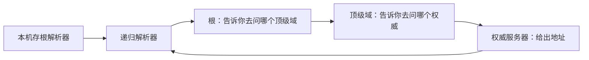

# DNSSEC：为什么给互联网的电话簿加一个签名如此困难？

互联网上几乎每次连接都要先问一句：这个名字对应哪台机器。1983 年 Paul Mockapetris 用域名系统替换掉那份越来越长的主机清单，1987 年 11 月的 RFC 1034 和 RFC 1035 把查询、委托和缓存写成了今天仍在用的骨架。它设计成公开、可缓存、用很小的 UDP 包就能回答。谁都能问，回答也没有签名。

DNSSEC 要补的是后一半：这份电话簿上的每一条记录，都能沿一根链核对到根区的一把公钥。它不把查询藏起来，也不把答案加密。签名、父区里的摘要、递归解析器上的信任锚，以及签错之后整站在验证者那里消失，才是它花了几十年的原因。根区到 2010 年 7 月 15 日才开始用真钥匙签名。第一次更换这把钥匙，从 2017 年推迟到 2018 年 10 月 11 日。

## 电话簿原来是一个文件

早期的名字和地址写在一份主机表里，由网络信息中心维护，各机器定期取走。机器一多，这份表的分发和冲突就盖过了查表本身。Mockapetris 把它拆成一棵树。根在最上面，下面是顶级域，再下面是各个组织自己的区。每一级只回答自己那一层，然后告诉你下一级该去问谁。

一个区是一份连续的权威数据，由这个区的管理员签字发布，虽然那时候还没有密码学上的签字。区和域不完全重合。`example.com` 可以自己当权威，也可以把 `shop.example.com` 委托给另一组服务器。委托靠 NS 记录：父区写下子区的服务器名字。若这名字落在子区里面，比如 `ns1.example.com` 为 `example.com` 服务，查询者还没进子区，就不知道这台服务器的地址。父区得把地址一并附上，叫胶水记录。没有胶水，解析会绕回自己，问不到底。

常见记录各管一件事。A 和 AAAA 是地址。MX 是邮件该交给谁。CNAME 是别名，一个已经是别名的名字上不能再放别的数据，很多看似奇怪的故障从这里来。PTR 把地址指回名字。TXT 后来被拿去放各种策略，从邮件验证到站点所有权。SOA 写着这个区的序列号和几档时间，其中包括否定答案可以缓存多久。

权威服务器只对自己的区负责。递归解析器替本机把整棵树问完，并把答案按 TTL 记住。家里的路由器、公司的解析器、运营商的解析器，都是递归这一侧。本机上的存根解析器通常只把问题转交给其中一台，自己不从根开始爬。

## 一次查询要问好几台服务器

解析器手里先有根服务器的地址。根的名字是 `a.root-servers.net` 到 `m.root-servers.net` 这十三个标识。每一标识后面是任播：世界各地很多台机器共用一个地址，路由把查询送到近的那台。十三个名字覆盖的是这许多台机器。

递归解析器问根：`www.example.com` 的地址在哪。根不回答地址，它回答 `.com` 的 NS。解析器再问 `.com`，得到 `example.com` 的 NS，往往还带着胶水里的地址。最后问权威服务器，才拿到 A 或 AAAA。这三跳是迭代。用户看到的是递归解析器的一次回答。

答案进缓存。TTL 之内，同样的名字不再爬树。TTL 短，变更生效快，查询也更密，内容分发和负载均衡就靠短 TTL 把用户引到不同地址。TTL 长，根和顶级域比较轻松，改了记录却要等旧答案过期。否定答案也能缓存，不然不存在的名字会把权威服务器打满。

传输从一开始就偏小。查询和应答走 UDP 的 53 端口。早期实现把 UDP 应答限制在 512 字节，放不下就置上截断位，解析器改走 TCP。DNSSEC 的签名经常超过 512 字节，所以部署依赖 EDNS：在查询里声明自己能收更大的 UDP。中间盒若丢掉带 EDNS 的包、丢掉分片，或者不让 53 端口的 TCP 通过，签名区在一部分网络上就会答不上来。协议在 1987 年按小包设计，二十年后的签名把这条假设撑破了。

## 缓存让它快，也让假答案活得够久

UDP 上的应答没有会话。解析器靠查询里的 16 位事务号，加上自己的地址和端口，判断这个包是不是刚才那一问的回答。事务号只有六万多种。源端口若固定，比如一直用 53，攻击者猜中一次组合就能把伪造的记录送进缓存。缓存会按攻击者写的 TTL 把假地址发给后来的用户。

2008 年 7 月，Dan Kaminsky 把这件事做成了可以规模化的缓存投毒。ISC 在 7 月 8 日的通告里写，事务号只有 16 位，弱点在协议上，不在某一家的实现。他在 8 月 7 日的 Black Hat 上公开细节，编号 CVE-2008-1447。办法是不停查询目标域下的随机名字，让解析器向权威服务器发出大量问询，同时灌入猜中了事务号的假应答。假应答若抢在真应答前面到达，缓存里的 NS 或地址就被换掉。ISC 的判断写在同一份通告里：DNSSEC 才是彻底的办法。当时做不到全球部署，所以 BIND 先把查询的源端口随机化，把攻击者要猜的空间从事务号扩大到端口加事务号。RFC 5452 把这类措施写成建议。随机端口提高了成本，没有改变“猜对了就被缓存相信”这件事。

放大攻击走的是另一头。查询很小，应答可以很大，尤其带上签名以后。攻击者伪造源地址，让权威服务器或开放的递归解析器把大包打向受害者。电话簿越完整、记录越长，就越适合被拿去灌别人的带宽。签名提高了真实性的上限，也提高了单次应答的体积。

还有一件 DNSSEC 不管的事。查询的名字沿路都是明文：递归解析器看得见，路径上听得见 UDP 的人也看得见。后来的 DNS over TLS、DNS over HTTPS 把传输加密，解决的是谁看见了你在查什么。它们不证明应答来自那个区的持有者。两件事常被说成“把 DNS 做安全”。一个是隐藏问题，一个是给答案签名。

## 签名盖在一组记录上

1999 年的 RFC 2535 已经试图给 DNS 做签名，部署时撞上了操作问题。父区要持有子区的密钥，密钥一换，父区就得跟着改，区越大越转不动。2005 年 3 月的 RFC 4033、4034 和 4035 改成现在这套，一般叫 DNSSEC bis。父区不存放子区的整把公钥，只存放一个摘要。

区的管理员用私钥给一组同类记录签名，签名放在 RRSIG 里。公钥放在本区的 DNSKEY 里。通常分成两把：密钥签名密钥 KSK 比较长寿，用来签 DNSKEY 这组记录；区签名密钥 ZSK 换得勤，用来签地址、NS、MX 这些日常数据。父区的 DS 记录放着子区 KSK 的摘要。验证者从信任的那一把往下走：根的 KSK 签过根的 DNSKEY，其中的 ZSK 签过顶级域的 DS，顶级域的钥匙再签下一级的 DS，直到签到你要的那条地址。

名字不存在也得能证明。否则攻击者可以丢掉真应答，解析器分不清“确实没有”和“被人抽走了”。NSEC 指向区内字典序的下一个名字，签名盖住这段空隙。副作用是可以把整个区的名字顺着链枚举出来。NSEC3 改成对名字做哈希再排序，枚举变贵，区的管理员多了一套盐和迭代次数要管。

验证发生在递归解析器上的时候最多。它配置了根的信任锚，也就是那把 KSK 或它的摘要。验证通过，应答可以带上 AD 位。验证失败时，查询者得到失败。没有 DS 的区是“未签名”，验证器放行。有 DS 但签名对不上、过期、或者算法不符，是“伪造”，验证器拒绝。站长配错时，不验证的用户仍能打开网站，验证的用户看到的是解析失败。故障只出现在一部分人那里，排查就慢。

签名有生效时间和过期时间。解析器或权威服务器的时钟偏了，一条本来有效的签名会变成伪造。注册商那里的 DS 若和本区的 KSK 对不上，从这一级往下全部失败。恢复要改对数据，再等父区的 DS 和缓存里的旧摘要过期。电话簿原来的哲学是尽量给一个答案。验证打开之后，签错的答案比没有签名更糟糕，因为协议要求把它丢掉。

| 记录 | 验证者用它做什么 |
| --- | --- |
| DNSKEY | 读取这个区公布的公钥 |
| RRSIG | 核对一组记录是否由对应私钥签过，以及是否还在有效期内 |
| DS | 在父区核对子区 KSK 的摘要，把信任交到下一级 |
| NSEC 或 NSEC3 | 确认某个名字或某类记录确实不在这个区里 |

## 2010 年先签一套故意验不过的根

没有根上的信任锚，每个验证器都得自己找一套起点，链在半路就断了。所以根区签名是整件事的开关，也是最不能出错的一次操作。

根的职责是拆开的。ICANN 作为 IANA 职能的运营者保管 KSK，私钥放在硬件安全模块里，使用要办密钥仪式，多名密钥官员到场。Verisign 运营根区的日常发布，拿 ZSK 签区内容，再把待签的密钥材料交给持有 KSK 的一方签回。换一把天天在用的 ZSK，是这条流水线里的常规步骤。换 KSK，是换全世界验证器被写进配置或随软件发行的那把锚。

正式签名之前，根先进入一段故意无法验证的状态，缩写 DURZ。区是签过的，用来测量签名把应答撑到多大、会不会压垮根服务器和中间网络，但公布的信任锚对不上这些钥匙，没有人会把这段当成生产信任链。IANA 的项目记录写着，切到生产钥匙的窗口在 2010 年 7 月 15 日 19:30 到 23:30 UTC。实际切换在当天 20:50 UTC，第一份完整生产签名的根区序列号是 2010071501。KSK 于 6 月 16 日在弗吉尼亚州库尔佩珀的密钥仪式上生成，7 月 12 日在加利福尼亚州埃尔塞贡多启用。这把钥匙的 key tag 是 19036，算法是 RSA/SHA-256。信任锚从这一天起公布在 IANA。

根签好，只说明链的起点存在。顶级域还得把自己的 DS 送进根，二级域名再把 DS 送进顶级域。哪一级没送，链就停在那里，下面的签名对验证器来说仍是一座孤岛。很多域名直到今天也没有 DS。验证器对它们保持“未签名”的放行。链是随 DS 逐级接上的，没有一个全网同时打开的日子。

## 2018 年那次轮换推迟了一年

钥匙不能永远用下去。算法会老，持有仪式和硬件模块的人也要能证明自己换得动。根的第一把 KSK 从 2010 年用到 2018 年。新钥匙 KSK-2017 在 2016 年 10 月 27 日于库尔佩珀生成，key tag 20326，2017 年 2 月 2 日进入生产流程，开始出现在根的 DNSKEY 里，并由旧钥匙签名。

解析器若实现了 RFC 5011，会观察这把新钥匙是否被旧钥匙持续签着。观察期量级是 30 天，之后可以自己把新锚加进本地信任集。没有实现这条自动更新、又不会随软件更新信任锚的解析器，旧钥匙一停止签名就会把所有验证失败掉。失败是全局的：根验不过，下面的签名链没有起点。

原定的切换日是 2017 年 10 月 11 日。RFC 8145 让解析器可以向根报告自己持有哪些信任锚。收回来的信号表明，仍有相当一批验证解析器只有 2010 年的那把。ICANN 把轮换推迟一年。ICANN 的事后说明写，推迟是因为数据表明不少运营商和接入商的解析器还没准备好。2018 年 10 月 11 日，根区改由新 KSK 签名。旧钥匙的信任摘要在 IANA 的公布数据里写到 2019 年 1 月 11 日截止。

这次轮换没有改算法，仍是 2048 位的 RSA/SHA-256。算法一起换会更难：验证器必须会新算法，区里还得在一段时间内同时满足新旧算法的签名要求。2018 年先证明“同一算法下换一把锚”这件事全世界做得动。

Verisign 在 2026 年的轮换说明里写，下一次计划于 2026 年 10 月 11 日让根的 DNSKEY 只由新的 KSK-2024 签名，key tag 38696。仍靠 5011 或软件更新拿到新锚的解析器会跟着走。只剩旧锚的，会从那天起验证失败。和 2017 年相同的约束还在：测量到的“谁持有哪把锚”并不干净，信号里有噪声，运营商仍可能落后于仪式的日程。

困难从 1987 年就埋下了。电话簿要快，所以答案进缓存，包要小，匹配一个 16 位的事务号就接受。它要能委托，所以每一级只对自己负责，父区只存一条去下一级的指针。签名必须沿着这些指针走，指针上的摘要错一个比特，整枝子树在验证器里消失。钥匙又不能焊死，焊死了就换不了被所有人信任的那一把。2010 年的签名和 2018 年的轮换，都是在这三件事同时成立的时候，给全球的缓存换一个它们愿意相信的起点。

## 参考

- Paul Mockapetris，[RFC 1034](https://www.rfc-editor.org/rfc/rfc1034) 与 [RFC 1035](https://www.rfc-editor.org/rfc/rfc1035)，1987 年 11 月。域名的委托、缓存，以及查询和资源记录的格式。两份文件取代 1983 年的 RFC 882 和 RFC 883。
- ISC，[CVE-2008-1447 通告](https://kb.isc.org/docs/aa-00924)，2008 年 7 月 8 日。事务号只有 16 位，Kaminsky 的投毒，以及“DNSSEC 才是彻底办法、先做源端口随机化”的判断。细节在 2008 年 8 月 7 日的 Black Hat 上公开。
- [RFC 5452](https://www.rfc-editor.org/rfc/rfc5452)。用不可预测的源端口等措施，提高伪造应答的成本。
- [RFC 4033](https://www.rfc-editor.org/rfc/rfc4033)、[RFC 4034](https://www.rfc-editor.org/rfc/rfc4034)、[RFC 4035](https://www.rfc-editor.org/rfc/rfc4035)，2005 年 3 月。现行 DNSSEC：RRSIG、DNSKEY、DS，以及验证器如何处理未签名和伪造。
- IANA，[根区 DNSSEC 启动记录](https://www.iana.org/archive/root-dnssec-launch/launch-status-updates)。DURZ，以及 2010 年 7 月 15 日 20:50 UTC 的生产签名，序列号 2010071501。
- [RFC 9718](https://www.rfc-editor.org/rfc/rfc9718)。根信任锚的公布格式。KSK-2010 的 key tag 19036，有效期记到 2019-01-11；KSK-2017 的 key tag 20326。
- [RFC 5011](https://www.rfc-editor.org/rfc/rfc5011)。验证器如何在观察期之后自动接受由旧钥匙签过的新信任锚。
- ICANN，[Root Zone Algorithm Rollover Study](https://www.icann.org/en/system/files/files/root-zone-algorithm-rollover-study-23may24-en.pdf)。2017 年 10 月 11 日的轮换因解析器未就绪而推迟，实际完成于 2018 年 10 月 11 日。
- ISC，[KSK-2010 退役通知](https://kb.isc.org/docs/aa-01529)。2018 年 10 月 11 日由 key tag 20326 的新钥匙签名，以及只持有旧锚的解析器会验证失败。
- Verisign，[2024–2026 根区 KSK 轮换](https://blog.verisign.com/security/2024-2026-root-zone-ksk-rollover-updates-observations/)。2026 年 10 月 11 日计划改由 KSK-2024 单独签名，key tag 38696。
