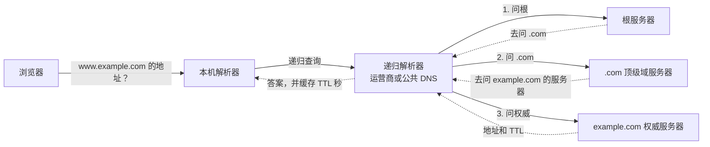

# DNS：从 HOSTS.TXT 到全球域名系统

1983 年，如果你想把一台新机器接进 ARPANET，得先打一个电话。电话打到加州门洛帕克的斯坦福研究所（SRI），那里的网络信息中心（NIC）替整个网络登记主机名和地址。Paul Mockapetris 后来回忆这件事时说，问题在于“SRI 圣诞节那一周放假，平时下班也回家”（[Internet Hall of Fame 的采访](https://www.internethalloffame.org/2012/07/23/why-does-net-still-work-christmas-paul-mockapetris/)）。换句话说，1983 年的互联网，晚上六点以后和圣诞假期里是没法给新机器起名字的。

Mockapetris 就是那个让这件事不再需要打电话的人。他设计的域名系统（DNS）今天每秒回答着数以亿计的查询，从浏览器打开网页、手机收推送，到云服务之间互相调用，几乎每一次网络连接都从一次 DNS 查询开始。可它的骨架仍然是 1983 年那一版：一棵分层的名字树，一层一层往下委派；到处都是缓存，靠一个叫 TTL 的数字决定信多久；查询跑在 UDP 的 53 端口上，最早每个包不能超过 512 字节；“替你跑腿问答案的递归服务器”和“真正掌握答案的权威服务器”是两种不同的角色。

这篇文章想把这四十多年串起来讲一遍：一张共享的文本文件怎样撑不住了，一个研究生怎样“自己干”出了 DNS，域名怎样变成了钱，缓存怎样被人下毒，DNSSEC 这把锁为什么造了二十年还没人爱用，DNS 又怎样在隐私的名义下被塞进 HTTPS。最后回头看，今天的 DNS 身上还背着哪些 1983 年的行李。

## 一张所有人共享的文本文件（1971–1983）

ARPANET 刚接通的那几年，网上只有几十台主机。负责接口消息处理机（IMP）的 BBN 公司给新主机分配端口时，顺口问一句对方想叫什么名字，然后把名字记在一张状态表里。1971 年，MITRE 的 Peggy Karp 提议给主机名定一个标准格式，讨论的结果是由 SRI 的 NIC 来当官方的主机名登记处（[Feinler 的回忆](https://www.bortzmeyer.org/files/HistoryoftheTLDs.pdf)）。

可这张官方名单一开始是给人看的，不是给机器读的。每个站点都自己抄一份，改成适合自家操作系统的格式。1973 年 12 月，施乐 PARC 的 Peter Deutsch 实在受不了了，写了 [RFC 606](https://www.rfc-editor.org/rfc/rfc606.txt)，标题就叫“Host Names On-line”：

> 既然我们终于有了一份官方的主机名单，是时候结束这种荒唐的局面了：网络上每个站点都得自己维护一份不同的、通常还是过时的主机列表。

他举例说，自己能登上的四台 TENEX 机器，每一台上的名字和地址对应关系都不一样，没有一份是完整的，而且每一份都和官方名单有出入。他提议由 NIC 维护一个任何人都能在线读取的文本文件，格式随便定一个，“希望没人在乎到要抗议。（这在网络的历史上从来没成功过，但还是值得一试。）”

三个月后，NIC 的 Mike Kudlick 和 Elizabeth “Jake” Feinler 在 [RFC 627](https://www.rfc-editor.org/info/rfc627/) 里宣布：官方主机名的 ASCII 文本文件已经放在 OFFICE-1 这台机器上，路径是 `<NETINFO>HOSTS.TXT`，每周更新一次，各个主机自己用 FTP 来取。这就是 HOSTS.TXT，今天每台电脑上那个 `/etc/hosts` 的祖先。

Feinler 从 1974 年起主持 NIC 十五年。她后来在计算机历史博物馆的口述历史里说，NIC 当年就是“史前的 Google”，谁不知道该去哪里问，就来问 NIC；中心有一排电话热线，操作员早上五点就上班，好赶上东海岸的上班时间（[Feinler 口述历史](https://archive.computerhistory.org/resources/access/text/2013/05/102702199-05-01-acc.pdf)）。到 1982 年，主机表换了新格式，写在 [RFC 810](https://www.rfc-editor.org/info/rfc810/) 里，取法也写得很清楚：连上 SRI-NIC（10.0.0.73），用户名 `ANONYMOUS`，口令 `GUEST`，`get <NETINFO>HOSTS.TXT`。

这套办法在网上只有几百台大型分时主机时运转得不错。麻烦来自网络自身的变化。Mockapetris 在 1988 年回顾 DNS 的论文里把问题说得很准：ARPANET 从“连接少数大型分时系统的一张网”，变成了“连接许多局域网的骨干之一”，局域网里挤满了工作站。主机的数量从“大约等于机构的数量”变成了“大约等于用户的数量”。这直接反映在 HOSTS.TXT 的大小、修改频率和被下载的次数上，而三者相乘，总的资源消耗远远超过线性增长（[Mockapetris 与 Dunlap，SIGCOMM 1988](https://www.cs.cornell.edu/people/egs/615/mockapetris.pdf)）。

还有一个问题不是技术上的。各个机构已经在自己管理局域网的地址和网关了，可要让一台新机器被全网看见，还得等 SRI 改文件。名字也只能是扁平的：全网只能有一台叫 `VENERA` 的机器。1982 年 NIC 自己在 [RFC 811](https://datatracker.ietf.org/doc/rfc811/) 里也承认，集中维护一个全局主机数据库只是“通往去中心化、分布式名字服务路上的一个过渡方案”。

## 五份提案和一个“自己干”的研究生（1982–1983）

分层命名的想法那几年已经在很多份文件里出现过：Jon Postel 1979 年的 IEN 116、David Mills 的 [RFC 799](https://www.rfc-editor.org/rfc/rfc799)、Su 和 Postel 的 [RFC 819](https://www.rfc-editor.org/rfc/rfc819)、Su 的 [RFC 830](https://www.rfc-editor.org/rfc/rfc830)。[RFC 1034](https://www.rfc-editor.org/rfc/rfc1034) 在回顾这段历史时总结，这些提案各不相同，但有一条共同的线：名字空间分层，层次大致对应组织结构，用 `.` 来分隔层级。

1983 年的一天，Postel 走进南加州大学信息科学研究所（ISI）一间办公室，找到在他手下工作的 Mockapetris，请他在大约五份提案之间找一个折中方案。Mockapetris 接下了活，然后基本没管那五份提案。“我就自己干自己的，”他后来说，“他们都觉得我没怎么用他们的东西。等他们反应过来，事情已经定了。”（[Internet Hall of Fame](https://www.internethalloffame.org/2012/07/23/why-does-net-still-work-christmas-paul-mockapetris/)）

他不是没看过现成的系统。1988 年的论文里专门讲了为什么不直接拿来用：Postel 的 IEN 116 太局限，只管主机；施乐的 Grapevine 和 Clearinghouse 是当时最精巧的名字服务，但它们重度依赖复制、很少用缓存、层级数固定，放进 DARPA 互联网那种“异构而且常常混乱”的环境里未必合适，而且搬过来就得连带搬施乐的整套协议栈。

新设计的出发点很朴素：至少要能提供 HOSTS.TXT 里的所有信息；数据库要能分布式维护；名字、标签、附加数据都不要有明显的大小限制；要能在尽可能多的环境里互通；性能要“过得去”。为了“精简”，他有意砍掉了很多数据库该有的功能，比如带原子性和备份的动态更新，理由是功能太全的系统会被社区视为太复杂而不被接受。

1983 年 6 月 23 日，第一次 DNS 测试在 ISI 成功（[USC 的二十周年报道](https://viterbischool.usc.edu/news/2003/06/isi-marks-20th-anniversary-of-domain-name-system/)）。11 月，Mockapetris 一个人署名的 [RFC 882](https://www.rfc-editor.org/rfc/rfc882) 和 [RFC 883](https://www.rfc-editor.org/rfc/rfc883) 发布，Postel 同时发了过渡计划 [RFC 881](https://www.rfc-editor.org/rfc/rfc881)。第一个 DNS 服务器也是 Mockapetris 写的，跑在 DEC 的 TOPS-20 上，名字叫 JEEVES，是它把第一批根服务器跑了起来（[ACM 对 Mockapetris 的介绍](https://awards.acm.org/award_winners/mockapetris_3342151)，[JEEVES 源代码存档](https://www.hactrn.net/hacks/jeeves/)）。

后来整个 DNS 的几个核心概念，这时都已经在了。

**分层的名字空间和委派。** 名字是一棵树，树根是一个空标签，往下是 `EDU`，再往下是 `ISI`，再往下是 `VENERA`，写出来就是 `VENERA.ISI.EDU`。树可以在任意两个相连的节点之间切开，切下来的一块叫一个区（zone）。一个机构想要自己的名字空间，就去“说服”上一级在它的区里插入几条记录，标出一个分界；从此这棵子树怎么长、要不要再往下分，都不必再征求上级同意。论文里的例子是 ISI.EDU：它就是这样说服了 EDU 的主人，在 EDU 和 ISI.EDU 之间划了一条线。这就是委派，DNS 能扩展到今天几亿个域名，靠的就是这一条。

**缓存和 TTL。** 每条资源记录都带一个以秒为单位的“生存时间”，谁拿到了这条记录都可以在这段时间里直接复用，不必再问。TTL 由数据的主人来定：定短了，改动生效快但查询多；定长了，流量小，还能在服务器宕机时靠缓存撑一阵。RFC 1034 把这种取舍说得很直白：可用性比即时更新和一致性更重要，更新是“慢慢渗透”出去的，网络出问题时，通常的做法是先相信旧信息。

**解析器和两种查询方式。** 用户程序不直接和名字服务器说话，而是调用一个叫解析器（resolver）的系统例程。名字服务器遇到自己答不了的问题有两种做法：替客户去别的服务器追问到底，叫递归；或者告诉客户“你去问那台”，让客户自己追，叫迭代。RFC 1034 写得很清楚：“对于数据报风格的访问，更倾向于迭代方式。域名系统要求实现迭代方式，递归方式是可选的。”论文里又补了一句：很多时候，把解析的工作集中到机构里一两台专门的服务器上会更有用，大家共享缓存，PC 这种能力弱的机器也不用自带完整的解析器。这句话里，已经能看见后来“递归解析器”和“权威服务器”分家的影子。

**数据报。** 查询默认走 UDP，[RFC 1035](https://www.rfc-editor.org/rfc/rfc1035) 规定 UDP 消息“不超过 512 字节”，服务器端口是 53；区传送这种需要可靠性的大块数据才走 TCP。Mockapetris 在 1988 年把“选择数据报”列为成功之一，理由是互联网的性能出乎意料地差，用 TCP 反而更慢，而且“大约 512 字节的限制事实上不成问题”。这句话后来会反复被人翻出来。

**附加段。** 服务器回答问题时，可以顺手把它猜你下一步会问的东西塞进同一个包里。比如根服务器告诉你某个域的名字服务器叫什么，就顺便附上它的地址。论文说，实验表明这一招把查询流量砍掉了一半。十四年后，这个贴心的设计会被一个前拖车司机拿来劫持整个 InterNIC。

今天一次最常见的查询，大致是这样走的：

## .arpa 惹来的电话，.bus 变成了 .com（1983–1985）

树有了，树顶上挂什么，却是一件政治问题。

过渡开始时，DARPA 和国防通信局（DCA）决定先在主机表里每个现有主机名后面统一加上 `.arpa`，当作试验。Feinler 回忆，很多站点对此很不高兴，它们和 ARPA 这个机构没有直接关系，凭什么名字里要带它；NIC 和 DCA 接了很多投诉电话。更麻烦的是，一宣布要有分层命名，就有人找上门来，坚持自己的机构或部门理应拿到一个顶级域。DCA 那边倾向于把国防数据网（DDN）整个变成一个顶级域，把名字统统从 `.arpa` 改成 `.mil`（[Feinler，Host Tables, Top Level Domain Names and the Origin of Dot Com](https://www.bortzmeyer.org/files/HistoryoftheTLDs.pdf)）。

Feinler 觉得，如果真按机构来分顶级域，就打开了一个“谁有资格当顶级域”的潘多拉盒子；网上很多主机也根本不是军方的，加 `.mil` 和加 `.arpa` 一样招人烦。1982 年 10 月，她给 DCA 的技术负责人 Tom Harris 写了一封备忘录，建议顶级域按通用类别来分，`.mil` 只是其中之一，另外再加 `.edu`、`.gov`、`.org`、`.com`：谁想要名字，就自己挑一个最贴切的类别，每个类别下面的社区再按自己的习惯往下组织。Harris 同意了。这份清单年底交给了 Postel，后来写进了 1984 年 10 月的 [RFC 920](https://www.rfc-editor.org/rfc/rfc920)。

`.com` 本身差点不叫 `.com`。Feinler 回忆，当时网上几乎没有真正的商业站点，互联网还是政府网络，加一个“商业”类别只是为了让通用分类显得完整。她和 Ken Harrenstien、David Roode、Mary Stahl 开会讨论过 `.bus`（business）和 `.com`（commercial），她自己更喜欢 `.bus`。可那时候有好几种硬件的名字也以“bus”结尾。Harrenstien 在给 NIC 写 DNS 服务器的时候，觉得 `.com` 更好，顺手就改了。Feinler 在文章里写：“谁知道 `.com` 后来会变成什么！！！”

1985 年 3 月 15 日，马萨诸塞州的 Lisp 机器厂商 Symbolics 注册了 `symbolics.com`，这是第一个 `.com` 域名。那一整年只有六个 `.com` 注册：symbolics、bbn、think、mcc、dec、northrop。苹果到 1987 年才注册了自己的名字，微软等到了 1991 年（[Wired](https://www.wired.com/2010/03/0315-symbolics-first-dotcom/)，[EDN](https://www.edn.com/1st-com-domain-name-is-registered-march-15-1985/)）。

这段时间 DCA 内部人事动荡，Harris 突发心脏病去世，新来的人有的觉得 DNS 只是个实验，不适合军用网络；有的觉得 OSI 协议迟早会赢；Feinler 说甚至有人建议把主机表列为机密。为了把 DCA 和 DARPA 两边拉到一起，她和 Postel 大约在 1985 年在华盛顿组织了一次会。她在文章里记下了一个小插曲：NIC 的软件架构师 Harrenstien 平时穿 T 恤和跑鞋，她坚持让他这天穿正式点。结果进电梯一看，Postel 照旧是登山靴配伐木工格子衬衫，其他人也差不多，只有 Harrenstien 一个人西装革履，被大家调侃是要去参加婚礼还是葬礼。会开了一整天，吵得很凶，最后同意合并成一个工作组。散会下电梯时没人说话，直到 Harrenstien 开口：“好吧，我很高兴今天是婚礼，不是葬礼。”

## 伯克利的四个研究生（1984–1994）

JEEVES 只能跑在 TOPS-20 上，而 Unix 工作站正在铺满校园。1984 年，加州大学伯克利分校的四个研究生 Douglas Terry、Mark Painter、David Riggle 和周松年，在 DARPA 的资助下写出了 Unix 上的 DNS 服务器，技术报告的标题是 *The Berkeley Internet Name Domain Server*（[伯克利技术报告](https://www2.eecs.berkeley.edu/Pubs/TechRpts/1984/5957.html)）。这就是 BIND。后来 DEC 借调到伯克利的 Kevin Dunlap 维护了两年，1988 年 DEC 的 Paul Vixie 接手，1994 年 Vixie 和 Rick Adams、Carl Malamud 成立了互联网软件联盟（ISC），专门给 BIND 找一个长期的家（[ISC 的 BIND 历史](https://www.isc.org/bindhistory/)）。直到今天，BIND 仍然是世界上用得最多的 DNS 服务器之一。

伯克利也成了第一个把全部网络应用都只押在 DNS 上的机构。1988 年的论文里记录了这段并不轻松的迁移：1985 年春天，校园里开始装只靠名字服务器解析的机器；秋天，通往 DARPA 互联网的两个邮件网关也改成依赖 DNS，这意味着全校都得改用域名风格的邮件地址。“即使是伯克利这样老练的用户群体，教会他们新的地址形式也是一项大工程。”最大的抱怨是旧邮件地址作废，其次是新系统一开始没有简写和搜索规则。但需求摆在那里：1986 年 1 月伯克利有 267 台主机，1987 年 2 月变成 1002 台，1988 年 3 月是 1991 台，平均每个工作日新增三台。

到 1987 年底，HOSTS.TXT 里大约还有 5500 个主机名，DNS 里能查到的已经超过两万。同年 11 月，Mockapetris 发布了修订版的 [RFC 1034](https://www.rfc-editor.org/rfc/rfc1034) 和 [RFC 1035](https://www.rfc-editor.org/rfc/rfc1035)，今天所有 DNS 实现仍然以它们为基础。

## 根服务器：从四台机器到十三个字母（1984–1997）

树根也需要有人来服务。1984 年，Postel 和 Mockapetris 在 ISI 的一台 PDP-10 上架起了第一台根服务器，跑的是 JEEVES。1985 年 ISI 又加了一台，SRI 的 NIC 加了一台，美国陆军弹道研究实验室（BRL）也自愿架了一台，理由之一是万一 MILNET 要和 ARPANET 断开，军网也还有根可用，那是第一台跑 BIND 的根服务器。到 1985 年，一共四台（[RSSAC023，根服务器系统史](https://itp.cdn.icann.org/en/files/root-server-system-advisory-committee-rssac-publications/rssac-023-17jun20-en.pdf)）。

1988 年的论文给这些早期的根拍了一张快照：七台根服务器，三台 TOPS-20 跑 JEEVES，四台 Unix 跑 BIND；每台的典型负载“大约每秒一个查询”。更有意思的是，负载的涨落与用户增长关系不大，更多取决于软件版本：有一次某个流行的 DNS 软件发了一个坏版本，平均负载在很长一段时间里涨到平常的五倍多。作者估计，只要各家解析器别那么激进地重传、把缓存做好，根服务器一半的流量都可以省掉。

还有一个意外是“否定回答”。DNS 有两种否定：名字不存在，或者名字存在但没有你要的那种数据。设计者以为这种回答会很少，结果根服务器上它们占了 20% 到 60%：旧式主机名、UUCP 邮件地址，都被程序拿来当域名查。更糟的是搜索列表这种“方便用户”的功能，一个打错的名字会被依次补上几个后缀去试，产生好几次失败查询。论文的结论是：“任何依赖缓存获得性能的命名系统，可能也需要缓存否定结果。”否定缓存十年后才在 [RFC 2308](https://www.rfc-editor.org/rfc/rfc2308) 里正式标准化。

论文里还有几条教训，今天读来仍然扎心：

> 系统的文档用了一些在叙述里很好解释的例子。映射到一小时的示例 TTL 值总是被照抄；写着“这个值应该是几天”的正文却被忽略了。写文档时应当永远假设：读者只看例子。

另一处写到，有个管理员把 TTL 和数据两列填反了，结果一条错误数据带着“好几年”的 TTL 被分发了出去。还有一句更一般的话，几乎可以当作整个 DNS 后来命运的预言：“从系统里删掉一个功能，往往比加一个新功能难得多。”

1991 年 7 月，北欧大学网络 NORDUnet 的 `nic.nordu.net` 成为第一台美国以外的根服务器。到 1993 年 4 月，根服务器已经多到出了问题：解析器启动时要向根要一份完整的根服务器名单（叫 priming），这份回答快要装不进 512 字节了。当时的根服务器名字五花八门，`NS.INTERNIC.NET`、`NS1.ISI.EDU`、`TERP.UMD.EDU`、`NS.NIC.DDN.MIL`，每个都要在包里完整写一遍。Bill Manning 和 Paul Vixie 想出的办法是改名：把所有根服务器都改名到 `root-servers.net` 下面，按字母排序。DNS 报文里有名字压缩，重复出现的后缀可以用一个两字节的指针代替，名字统一之后，`root-servers.net` 在包里只需要写一次。Postel 同意了，1995 年开始改名（[RSSAC023](https://itp.cdn.icann.org/en/files/root-server-system-advisory-committee-rssac-publications/rssac-023-17jun20-en.pdf)）。1997 年，J、K、L、M 四台加入，K 去了伦敦，M 去了日本的 WIDE 项目，总数定格在 13 个（[RSSAC FAQ](https://www.icann.org/en/rssac/faq)）。

“全世界只有 13 台根服务器”这个说法就是这么来的。它早就不是事实了：2002 年起，根服务器运营者开始用任播（anycast），同一个 IP 地址从世界各地的许多站点同时宣告，查询自动落到最近的那一个。今天 13 个名字背后是一千五百多个实例。但字母仍然只有 13 个，因为它们是 1990 年代那个 512 字节的包量出来的。

## 域名变成了钱（1991–1998）

1991 年，国防部把 NIC 的合同转给了 GSI 公司，GSI 又转包给了一家叫 Network Solutions（NSI）的小公司。1993 年，美国国家科学基金会（NSF）把非军用域名的注册交给 NSI，和 AT&T、General Atomics 一起挂上 InterNIC 的牌子。那时注册域名是免费的，费用由政府出，每个月不过两三百个申请（[Wired，1998](https://www.wired.com/1998/04/kashpureff/)）。

然后 Web 来了。1995 年 9 月 13 日，NSF 和 NSI 签了合作协议第 4 号修订：从第二天零点起，注册一个 `.com`、`.net`、`.org` 域名收 100 美元，管两年，之后每年 50 美元；其中 30% 放进一个“互联网知识基础设施基金”（[修订原文](https://archive.icann.org/en/nsi/coopagmt-amend4-13sep95.htm)）。到 1998 年 1 月，这个基金已经攒下 4600 万美元（[Wired](https://www.wired.com/1998/04/kashpureff/)），还被人告上法院，说它是一种没有经过国会授权的税（[Thomas v. Network Solutions](https://openjurist.org/2/fsupp2d/22/thomas-v-network-solutions-inc-2486448)）。这时 NSI 已经注册了一百多万个域名，每天还要新增三千多个，一家独占着互联网最值钱的命名空间。

不是所有人都服气。西雅图有个叫 Eugene Kashpureff 的人，1995 年 6 月之前还在开拖车。他在一个商人俱乐部里看了一次互联网演示，他说自己“就在那天从拖车的前座上下来了”，回家路上买了一本《Internet Starter Kit for Windows》，当天下午就开通了账号。1996 年愚人节，他和合伙人办起了 AlterNIC，一套“另类根服务器”：它既能解析官方的所有顶级域，又额外加上了 `.xxx`、`.med`、`.ltd` 这些新顶级域。他说高峰时互联网上有 3% 的机器在用他们的根（[Wired](https://www.wired.com/1998/04/kashpureff/)）。

1997 年 7 月，为了“抗议” NSI 的垄断，Kashpureff 干了一件更出格的事。他利用当时 BIND 的一个弱点：服务器回答问题时附带的“附加段”信息，接收方会不加分辨地放进缓存。他让一些名字服务器来问他控制的域名，在回答的附加段里夹带一条“`www.internic.net` 的地址是某某”，指向他自己的服务器。于是全世界不少人想去 InterNIC 注册域名时，都被送到了 AlterNIC 的网站。美国司法部后来的起诉材料说，他给这项计划起名叫“DNS 风暴行动”，前后花了一年打磨；7 月 10 日到 14 日、21 日到 24 日，成千上万的用户被劫持（[司法部公告](https://webharvest.gov/peth04/20041016010223/http:/cybercrime.gov/kashpurepr.htm)）。7 月 21 日 NSI 起诉了他，他在网上公开道歉、和解之后去了加拿大。10 月 31 日，加拿大皇家骑警在多伦多逮捕了他（[NANOG 邮件列表](https://seclists.org/nanog/1997/Oct/564)），1998 年 3 月他认罪。

这是缓存污染第一次在全世界面前表演。讽刺的是，他利用的正是 Mockapetris 在论文里列为“成功”的那个附加段。

同一年，美国政府开始琢磨怎样把域名管理从政府合同里剥离出来，交给一个私营机构。1998 年 1 月 28 日，就在白宫顾问 Ira Magaziner 准备发布方案的时候，Postel 给根服务器的运营者发了一封邮件：请你们今后不要再从 NSI 的 A 根拉取根区数据，改从 IANA 自己的服务器 `DNSROOT.IANA.ORG` 拉，内容完全一样，这是一次“根区传输验证测试”（[邮件存档](https://elists.isoc.org/pipermail/internet-history/2002-November/000373.html)）。大约一半的根服务器照做了。据《纽约时报》说，要不是东京根的志愿管理员拿着邮件去问了 NSI 的工程师一个问题，这件事可能根本没人注意（[NYT](https://archive.nytimes.com/www.nytimes.com/library/cyber/week/020598domain.html)）。

消息传开后，有人说这是“劫持”。Magaziner 对美联社说，“我们觉得时机有点微妙。他说，‘是的，那不是做这件事的好时机。’……我会给他一点宽容。”（[Wired](https://www.wired.com/1998/02/fallout-over-unsanctioned-dns-test/)）2 月 3 日，Postel 通知大家切回 NSI。这次“测试”让所有人意识到，整个互联网的根可以被一个人的一封邮件挪动，这加快了 ICANN 的成立（[ISOC 的 IANA 时间线](https://www.internetsociety.org/wp-content/uploads/2016/05/IANA_Timeline_20170117.pdf)）。

1998 年 9 月 30 日，ICANN 在加州注册成立。两周后的 10 月 16 日，Postel 因心脏手术并发症去世，终年 55 岁。他没能看到 ICANN 的第一次董事会。美国政府对 IANA 职能的合同，一直到 2016 年 10 月 1 日才正式到期（[ICANN 公告](https://www.icann.org/en/announcements/details/stewardship-of-iana-functions-transitions-to-global-internet-community-as-contract-with-us-government-ends-1-10-2016-en)）。

## 缓存污染：一个被藏了五年的漏洞（1989–2008）

Kashpureff 用的手法，安全圈其实早就知道。

伯克利的 CSRG 在 1989 年就发现了一个问题：当时的 `rlogin` 和 `rsh` 靠主机名来决定信不信任对方，它们拿对方的 IP 去反查名字，查到什么就信什么。可反向解析那棵树是由对方网络的管理员控制的，他想让自己的 IP 反查出一个受信任的名字，改一行就行。伯克利的补救是再正向查一遍，看这个名字是否真的指向这个 IP。AT&T 贝尔实验室的 Steve Bellovin 和 Tsutomu Shimomura 各自独立发现，这还不够：正反两种查询的回答，都可以通过污染缓存来伪造（[DNSSEC 历史项目](https://www.dnssec-deployment.org/history/)）。

Bellovin 写好了论文（他本人的说法是 1990 年，ISOC 的历史项目记作 1993 年），但决定不发表，只把稿子交给了 CERT，还和 Shimomura、CERT 以及政府的人在华盛顿开过几次会。大家都看得出，彻底的办法是给 DNS 加数字签名，可 CPU 成本、包的大小、RSA 专利、出口管制，以及修改协议本身的难度，每一条都让人却步。于是这个漏洞被捂了好几年。1995 年初，Bellovin 在一个被定过罪的黑客的公开 FTP 站点上看到了自己那篇论文，再保密已经没有意义，他把它投给了当年的 USENIX 安全研讨会，标题是《利用域名系统闯入系统》（[论文摘要](https://www.usenix.org/legacy/publications/library/proceedings/security95/bellovin.html)）。摘要第一句提到，这个漏洞“最早是 P.V. Mockapetris 注意到的”。同一届会上，Vixie 发了一篇配套论文，介绍 BIND 怎样加固，其中一条是把查询的事务 ID 改成随机数。

此后十几年，攻防大致是这样一个来回。最早，攻击者可以在回答里直接夹带和问题无关的记录，比如 Kashpureff 那样；解析器开始执行“辖区检查”（bailiwick），只接受回答者有权管辖的那部分数据。攻击者转而抢答：在真正的回答回来之前，伪造一个带正确事务 ID 的回答送过去。事务 ID 只有 16 位，六万五千多种可能；于是 TTL 意外地成了防线，因为一旦真答案进了缓存，攻击者就得等它过期才能再试一次。

纽约大学的 Daniel J. Bernstein 很早就觉得 16 位太少。1999 年 12 月，他写的 dnscache 在第一个版本里就把每次查询的 UDP 源端口也随机化了，攻击者要同时猜中端口和 ID，接近 32 位。他后来在自己的网站上不无得意地写，据他所知，从 1999 年 12 月到 2008 年 7 月，除了他的软件和 2006 年跟进的 PowerDNS，互联网上所有别的 DNS 软件，都能被不到十万个包的盲目攻击打中（[DNS forgery](https://cr.yp.to/djbdns/forgery.html)）。

2008 年初，IOActive 的研究员 Dan Kaminsky 在琢磨一个和安全无关的问题：怎样让内容分发更灵活。他想出一个绕过 TTL、让服务器每次都拿到最新答案的“小花招”，和朋友闲聊之后才意识到，这个花招能把整个 DNS 的安全打穿。他写了一点代码验证，“看到它跑通的那一刻，我的胃一沉”（[MIT Technology Review](https://www.technologyreview.com/2008/10/20/126595/the-flaw-at-the-heart-of-the-internet/)）。

思路其实不复杂。以前攻击者抢答 `www.google.com`，猜错一次，真答案就进了缓存，下一次要等 TTL 过期。Kaminsky 换了个问题：让受害的解析器去查 `1.google.com`、`2.google.com`、`3.google.com`……这些名字根本不存在，缓存里永远没有，每一次都是新的一轮抢答。他伪造的回答里不给这些假名字的地址，而是在权威段和附加段里宣称“`google.com` 的名字服务器是某某，它的地址是某某”，而这完全在辖区检查允许的范围之内。只要有一次猜中，整个 `google.com` 就归他了。TTL 这道意外的防线被彻底绕开，Kaminsky 说他的测试最快十秒就能得手。

他打电话给 Vixie。Vixie 后来说，一般人报告问题，总得画白板、写一两份文档，“这次他花了 20 秒讲清楚问题，又花了 20 秒回答我的反对意见。然后我说：‘Dan，我是在用一部不安全的手机跟你通话。请你以后再也不要对任何人在不安全的手机上说你刚才说的话。’”

2008 年 3 月，十六位 DNS 研究者和厂商代表秘密聚到微软园区。Kaminsky 说，安排得又急又保密，“有人坐在飞往微软的飞机上，还不知道漏洞是什么”。他们选了一个能快速部署、又不会暴露问题本质的补丁：源端口随机化，也就是 Bernstein 九年前就做了的事。7 月 8 日，几乎所有 DNS 厂商同时发布补丁，Kaminsky 开了记者会，请同行在 8 月 6 日他在 Black Hat 大会上公布细节之前，不要公开猜测（[DNS-OARC 时间线](https://www.dns-oarc.net/node/107)）。

安全圈很多人不买账。不给细节就要全世界打补丁，这违反了披露的惯例，有人怀疑他只是把一个老漏洞换了个说法来博名声。Matasano 的创始人 Thomas Ptacek 就在推特上公开表示怀疑，直到 Kaminsky 私下把细节讲给他听，他才改了口。7 月 21 日，德国研究员 Halvar Flake 在博客上公开猜测漏洞原理，大体猜对了；混乱之中，Matasano 网站上一篇预先写好、准备等细节公开后再发的详细解释被提前挂了出来，虽然很快撤下，但已经被人转贴到了各处（[Wired](https://www.wired.com/2008/07/details-of-dns/)）。Kaminsky 在博客上贴出一句话：“打补丁。今天。现在。对，加个班。”他后来说：“补丁发布了十三天，漏洞都没有公开，这是前所未有的。我本来想要三十天，但我拿到了十三天。”几天之内，Metasploit 发布了攻击模块，AT&T 的一台服务器被污染，用户打开 Google 首页看到的是塞满攻击者广告的假页面。

8 月 6 日，拉斯维加斯凯撒宫的会场提前半小时就开始涌进人来，座位很快就没了。Kaminsky 的奶奶为这场演讲烤了 250 块饼干，远远不够分。他走上讲台，第一句话是：“外面人好多。我的天。”他说，到 8 月初，已经有超过 1.2 亿宽带用户受到了保护，但网上仍有三到四成的名字服务器没打补丁。当天晚些时候，一群安全研究者把 Pwnie 奖的“最被炒作漏洞”颁给了他，副标题是“搞定媒体奖”。Kaminsky 上台只说了两句话：“有的人发现漏洞，有的人让漏洞被修好。我很高兴属于后一种。”然后抓着那只金色玩具小马的粉色鬃毛，沿着长长的过道走出了会场。

这些对策后来汇总成了 [RFC 5452](https://www.rfc-editor.org/rfc/rfc5452)。但源端口随机化本质上仍然是“让攻击者更难猜”，不是“让攻击者没法骗”。2020 年，加州大学河滨分校和清华大学的研究者在 CCS 上发表了 SAD DNS：Linux 为了防止被用作反射攻击，给出站的 ICMP 错误消息设了一个全局限速，而这个共享的计数器恰好成了侧信道，让攻击者能一个个探出解析器正在用的源端口。他们测到 35% 的开放解析器、14 个公共解析器里的 12 个都能被打（[SAD DNS](https://www.saddns.net/)，[论文](https://www.cs.ucr.edu/~zhiyunq/pub/ccs20%5Fdns%5Fpoisoning.pdf)）。缓存污染在 2008 年被“修好”，十二年后又回来了。

## 另一种谎言：由谁来说（2003–2010）

伪造 DNS 回答的，不一定是攻击者。

2003 年 9 月 15 日，接手 NSI 注册局业务的 VeriSign 在 `.com` 和 `.net` 两个顶级域里加了一条通配记录。以前查一个不存在的 `.com` 域名，会得到标准的“名字不存在”错误（RCODE 3）；从这天起，你会得到一个 VeriSign 服务器的地址，打开是一个带付费广告的搜索页，这项服务叫 Site Finder。依赖“名字不存在”来判断拼写错误和垃圾邮件的程序一下子全乱了套。ICANN 在 9 月 19 日请 VeriSign 暂停，VeriSign 拒绝，说这样做“为时过早”；10 月 3 日，ICANN 下了最后通牒：10 月 4 日太平洋时间下午六点之前恢复原状，否则强制执行合同。VeriSign 照办了（[ICANN SSAC 报告](https://itp.cdn.icann.org/en/files/security-and-stability-advisory-committee-ssac-reports/report-redirection-com-net-09jul04-en.pdf)）。可许多运营商后来在自己的递归解析器上干了同样的事，把打错的网址导向广告页，这种做法在很多地方一直延续了下来。

还有一种谎言是审查。在中国，防火长城会在网络路径上监听 DNS 查询，一旦看到被封锁的域名，就抢在真答案之前注入一个伪造的回答。因为 DNS 默认走明文 UDP，谁先到信谁，这种注入根本不需要碰到任何一台 DNS 服务器。

2010 年 3 月 24 日，智利运营商 VTR 的工程师发现一件怪事：向 I 根服务器查询 `www.facebook.com`，有时得到的不是“去问 .com”，而是一个莫名其妙的 IP 地址，`8.7.198.45`。智利 `.cl` 的 DNS 管理员 Mauricio Vergara 把这件事贴到了 DNS-OARC 的运营者邮件列表上，Twitter 和 YouTube 也有同样的问题，而出问题的那个 I 根节点位于中国（[原帖](https://lists.dns-oarc.net/pipermail/dns-operations/2010-March/005263.html)，[NIC Chile 的说明](https://www.nic.cl/anuncios/20100329-rootI-eng.html)）。原来，I 根的运营者、瑞典的 Netnod 在北京放了一个任播节点，由于路由的原因，一部分智利和美国的查询被引到了这个节点，途中经过了防火长城，于是在墙外的人也收到了墙内的伪造答案。Netnod 声明他们的服务器只会原样提供 IANA 的根区，然后撤掉了北京节点的路由宣告（[Netnod 的声明](https://lists.dns-oarc.net/pipermail/dns-operations/2010-March/005346.html)）。

这件事把任播和明文 DNS 的一个组合风险摆在了所有人面前：你以为自己在问全世界公用的根，实际上你的包走到了哪里、被谁改过，你根本不知道。如果根区当时已经签名、解析器会验证，那个伪造的地址会当场露馅。那一年，根区正好要签名了。

## DNSSEC：一把锁，造了二十年（1993–2018）

给 DNS 加签名的工作，其实早在 Bellovin 的论文公开之前就开始了。1993 年，一个设计小组在休斯敦开会，定下了后来 DNSSEC 的基本框架：DNS 数据是“公开的”，所以不管保密；也不管对客户端做身份认证；只提供两样东西，数据完整性和数据来源认证；还必须和不安全的 DNS 共存（[RFC 3833](https://www.rfc-editor.org/rfc/rfc3833)）。第一版规范 [RFC 2065](https://www.rfc-editor.org/rfc/rfc2065) 在 1997 年发布，1999 年修订成 [RFC 2535](https://www.rfc-editor.org/rfc/rfc2535)。有意思的是，IETF 直到 2004 年才发布一份正式的 DNS 威胁分析，作者在里面自嘲：在开始设计防御协议十年之后才发表威胁分析，看起来有点奇怪，“但迟做总比不做好”。

RFC 2535 在纸面上看起来已经可以部署了，一到真实世界就碰了壁。2000 年，第一批真实部署试验开始，瑞典的 `.se` 注册局想给自己的区签名，却发现了隐私和扩展性问题（[DNSSEC 历史项目](https://www.dnssec-deployment.org/history/)）。按照 RFC 2535，子区的密钥要由父区签名，签好的密钥放在子区里，这意味着子区每换一次钥匙，都得和父区来回沟通一次；对于没签名的子区，父区还得存一条“空密钥”记录来说明“它没签名”，用一整组签过名的记录来表达一个比特的信息。`.com` 这种有几千万个子区的大区根本扛不住。更让人头疼的是，测量显示互联网上 10% 到 30% 的委派，父区和子区里写的名字服务器本来就对不上（[RFC 3658](https://www.rfc-editor.org/rfc/rfc3658)）。

于是协议推倒重来。2003 年 12 月的 [RFC 3658](https://www.rfc-editor.org/rfc/rfc3658) 引入了 DS 记录：父区不再替子区的钥匙签名，只存一条子区钥匙的摘要，这被称作“类型码滚动”，而且和 RFC 2535 不兼容。2005 年 3 月，整套协议重写为 [RFC 4033](https://www.rfc-editor.org/rfc/rfc4033)、4034、4035，也就是今天的 DNSSEC。

证明“一个名字不存在”又是另一道难题。签名只能签存在的东西，DNSSEC 的办法是 NSEC 记录：把区里所有名字排好序，签一条“从 `a` 到 `c` 之间没有别的名字”。可这样一来，任何人都可以顺着 NSEC 链一条条走下去，把整个区里的名字全部列出来，这叫“区遍历”。很多注册局出于隐私和商业原因不愿意这样。2008 年的 [RFC 5155](https://www.rfc-editor.org/rfc/rfc5155) 发明了 NSEC3，把名字先做哈希再排序。批评者 Thomas Ptacek 后来挖苦它是“DNS 的口令文件”：哈希过的名字照样可以离线暴力破解。

从 1993 年算起十五年，DNSSEC 一直是“马上就能部署”。真正推了它一把的是 Kaminsky。2010 年 6 月 16 日，ICANN 在弗吉尼亚州卡尔佩珀一座高安全等级的数据中心里举行了第一次根区密钥仪式，生成了根区的密钥签名密钥 KSK-2010（[ICANN 公告](https://www.icann.org/en/announcements/details/icanns-first-dnssec-key-ceremony-for-the-root-zone-7-6-2010-en)，[仪式材料](http://www.iana.org/dnssec/ceremonies/1)）。仪式有剧本、有审计、全程录像。参与者里有一批来自世界各地的“受信任社区代表”，他们都不隶属于 ICANN、VeriSign 或美国商务部。其中的“加密官”每人保管一把保险箱的实体钥匙，箱子里是激活硬件安全模块的智能卡，没有七人中至少三人到场，ICANN 既不能生成新钥匙，也不能签名。另一批“恢复密钥持有人”各自保管一片备份密钥，ICANN 的说明是：“如果两个密钥管理设施都掉进了海里”，七人中的五人带着智能卡，就能在一台新设备里重建根密钥（[IETF 78 上的报告](https://www.iana.org/archive/root-dnssec-launch/files/rootsign-ietf78-update.pdf)）。当年的名单里有 Vint Cerf，也有 Dan Kaminsky。

2010 年 7 月 15 日 UTC 20:50，第一份正式签名的根区（SOA 序列号 2010071501）开始在根服务器上提供服务（[IANA 的上线记录](https://www.iana.org/archive/root-dnssec-launch/launch-status-updates)）。

钥匙总要换的。KSK-2010 本该在 2017 年 10 月 11 日换成新的 KSK-2017。就在几周前，一个新协议 [RFC 8145](https://www.rfc-editor.org/rfc/rfc8145) 开始起作用：它让验证解析器在查询里悄悄报告自己信任哪把根密钥。VeriSign 从 A 根和 J 根收集的数据显示，数量惊人的解析器仍然只认旧钥匙 KSK-2010。更让人没底的是，ISC 报告新版 BIND 有个实现问题，一些根本没开验证的实例也在上报；NLnet Labs 则发现，Unbound 的某些用户即使配置正确，到换钥那天也可能拿不到新钥匙。谁也说不清换钥之后会有多少人断网。ICANN 在 9 月 27 日宣布推迟（[推迟说明](https://www.icann.org/en/system/files/files/root-ksk-roll-postponed-17oct17-en.pdf)）。又花了一年收集数据、征求意见，2018 年 10 月 11 日 UTC 16:00，根密钥终于换了，影响比所有人预想的都小（[ICANN](https://www.icann.org/en/blogs/details/the-recent-ksk-rollover-summary-and-next-steps-30-10-2018-en)）。换一把钥匙，从计划到完成用了三年。

DNSSEC 的争议从来没停过。2015 年 1 月，Ptacek 发表了一篇长文《反对 DNSSEC》，开篇就是：“互联网上所有安全的密码学，都假设从名字到 IP 的 DNS 查询是不安全的。……只要 TLS 配置得当，DNSSEC 什么也没增加。”他还说 DNSSEC 是一套“由政府控制的 PKI”，因为信任链的顶端是美国政府监管下的根区；协议在 1998、2000、2001、2003、2004、2005 年一改再改，却仍然带着当年“认为严肃的密码学对 DNS 服务器来说太昂贵”时的基因（[Against DNSSEC](https://sockpuppet.org/blog/2015/01/15/against-dnssec/)）。支持者则认为，DNS 越来越多地被用来发布密钥和策略，比如给 TLS 证书钉扎用的 DANE（[RFC 6698](https://www.rfc-editor.org/rfc/rfc6698)），没有签名的 DNS 撑不起这些用途。

真正让运维人员对 DNSSEC 心存畏惧的，是它出错时的样子。没签名的 DNS 出错，通常是某个名字解析错了；签了名的 DNS 出错，是整个域名从验证解析器的世界里消失。2021 年 9 月 30 日，Slack 为了满足美国联邦 FedRAMP 认证的要求，第三次尝试给 `slack.com` 开启 DNSSEC。先是亚马逊 Route 53 的一个 bug：对带通配符的记录，它返回的 NSEC 回答漏掉了“这里其实有 A 记录”的标志位，客户端先查 AAAA 再查 A，激进使用否定缓存的解析器就以为什么都没有。Slack 急忙从注册商那里撤掉 DS 记录、关掉签名，以为这样就能回滚；可 `.com` 让解析器把 DS 记录缓存 24 小时，缓存里还留着“slack.com 是签过名的”这条信息，签名却没了，所有验证解析器都开始返回 SERVFAIL。唯一的办法是等，等满 24 小时（[Slack 工程博客](https://slack.engineering/what-happened-during-slacks-dnssec-rollout/)）。

2024 年 2 月，德国 ATHENE 研究中心公布了 KeyTrap。DNSSEC 为了保证可用性，遵循了“发送时保守，接收时宽容”的 Postel 原则：服务器会把所有相关的钥匙和签名都发过来，解析器则被要求尝试每一种组合，直到找到能验证的那一对。攻击者只要构造一个塞满冲突钥匙和签名的区，一个包就能让解析器的 CPU 指令数暴涨两百万倍，某些实现会被卡住长达 16 个小时。主要厂商把它称作“迄今发现的对 DNS 最严重的攻击”（[KeyTrap](https://www.athene-center.de/en/keytrap)，[ISC 的说明](https://www.isc.org/blogs/2024-bind-security-release/)）。为了防伪造而加上的签名，本身变成了拒绝服务的武器。

## 放大器与僵尸网络（2002–2016）

DNS 用 UDP，一个小小的查询可以换来一个大得多的回答，而 UDP 的源地址又很容易伪造。这两件事放在一起，DNS 就成了一台现成的流量放大器。

2002 年 10 月 21 日，13 台根服务器同时遭到分布式拒绝服务攻击，持续了一个多小时。据 Vixie 等三位根服务器运营者事后的报告，每台根挨了 50 到 100 Mbps 的流量，合计大约 900 Mbps，混着 ICMP、TCP SYN、TCP 分片和 UDP（[CAIDA 的分析](https://www.caida.org/projects/dns/oct02dos/)）。《华盛顿邮报》称之为“迄今最大、最复杂的攻击”（[DNSO 邮件列表转载](http://dnso.dnso.org/clubpublic/ga-full/Arc11/msg02481.html)）。据 RSSAC 当年 11 月的会议记录，攻击期间 F 根收到的流量里只有 2% 是正常查询（[RSSAC 会议记录](https://www.icann.org/en/rssac/meetings/documents/atlanta-georgia-usa-16-11-2002-en)）。按今天的标准，这点流量微不足道，而且因为缓存的存在，普通用户几乎没察觉。但它让根服务器运营者下定决心推任播：同一年，F 根成为第一个在国际上做任播的根服务器（[RSSAC023](https://itp.cdn.icann.org/en/files/root-server-system-advisory-committee-rssac-publications/rssac-023-17jun20-en.pdf)）。

2013 年 3 月，反垃圾邮件组织 Spamhaus 遭到攻击，攻击者伪造 Spamhaus 的地址，向全世界成千上万台“开放解析器”发送小查询，这些对任何人都有求必应的递归服务器把大得多的回答砸向受害者。替 Spamhaus 扛攻击的 Cloudflare 写了一篇博客，标题叫《差点搞垮互联网的 DDoS》，说一家一级运营商告诉他们看到了超过 300 Gbps 的相关流量；同一周，Open Resolver Project 公布了网上 2170 万个开放解析器的完整名单（[Cloudflare](https://blog.cloudflare.com/the-ddos-that-almost-broke-the-internet/)）。APNIC 的 Geoff Huston 对这个标题不太买账，他写道：“我不确定这次攻击是否‘差点搞垮互联网’”，但承认它确实很严重（[RIPE Labs](https://labs.ripe.net/author/gih/a-question-of-dns-protocols/)）。

2016 年 10 月 21 日，美国东海岸的上午，Twitter、Netflix、GitHub、Reddit、Spotify、《纽约时报》接连打不开。它们本身都没坏，坏的是它们共同使用的 DNS 服务商 Dyn。攻击来自 Mirai 僵尸网络，由摄像头、家用路由器这些被攻陷的物联网设备组成，一天打了三波。Dyn 事后说，恶意终端最多约十万个，但各地递归解析器为了刷新缓存而疯狂重试，制造了正常流量十到二十倍的“重试风暴”，让攻击看起来比实际大得多（[Dyn 的分析](https://postmortem.io/incidents/dyn--2016-10-21--managed-dns-ddos-mirai-attack/)）。Cloudflare 后来的分析更让人哭笑不得：这个 Mirai 变种的其他目标全是游戏平台，那些知名网站的瘫痪，很可能只是“一场玩家之间战争的壮观附带损伤”（[GovInfoSecurity](https://www.govinfosecurity.com/guilty-plea-in-2016-dyn-ddos-attack-a-15567)）。这一天，很多公司第一次意识到，自己的网站活着没用，DNS 死了，用户就找不到你。

## 隐私：谁在看你查了什么（2009–2020）

DNSSEC 管的是“答案有没有被改过”，从一开始就明确不管“查询有没有被人看见”。1993 年那次休斯敦会议定下的原则是：DNS 数据是公开的。

2013 年斯诺登的披露之后，IETF 把大规模监控当成了一种攻击。2015 年，法国的 Stéphane Bortzmeyer 写了 [RFC 7626](https://www.rfc-editor.org/rfc/rfc7626)《DNS 隐私考量》，里面有一句被反复引用的话：

> 匿名戒酒会的网站是公开的；你访问它这件事，不应该是公开的。

DNS 查询恰恰把“你访问了它”这件事明文广播了出去。你的每一次查询，家里的路由器、运营商的递归服务器、路径上的任何设备都看得见；递归服务器去问根和顶级域时，还会把完整的名字告诉它们。接下来几年，补丁一块块打上：2016 年的 [RFC 7816](https://www.rfc-editor.org/rfc/rfc7816) 提出查询名最小化，问根的时候只问 `com`，不再把 `www.example.com` 整个交出去；同年 5 月的 [RFC 7858](https://www.rfc-editor.org/rfc/rfc7858) 定义了 DNS over TLS（DoT），在 853 端口上把客户端到递归解析器这一段加密。

与此同时，谁来当你的递归解析器，也在悄悄改变。1983 年的设计里，递归是可选的，后来它成了运营商的标配。2009 年 12 月 3 日，Google 推出了公共 DNS `8.8.8.8`（[Google 开发者博客](https://developers.googleblog.com/introducing-google-public-dns-a-new-dns-resolver-from-google/)）。2018 年，Cloudflare 想做一个公共解析器，找上了亚太地区互联网注册机构 APNIC：APNIC 手里有 `1.1.1.1` 这个地址，可太多人把它随手填进各种系统里当测试地址，只要一宣告路由，垃圾流量就会把普通网络冲垮。双方一拍即合，Cloudflare 用自己的网络帮 APNIC 接收和研究这些垃圾流量，换来在这个好记的地址上提供解析服务。上线日期挑的是 4 月 1 日，因为 `1.1.1.1` 有四个 1（[Cloudflare](https://blog.cloudflare.com/announcing-1111/)）。

2018 年 10 月，Paul Hoffman 和 Mozilla 的 Patrick McManus 署名的 [RFC 8484](https://www.rfc-editor.org/rfc/rfc8484) 发布：DNS over HTTPS，DoH。DNS 查询被包成普通的 HTTPS 请求，走 443 端口，和网页流量混在一起，从网络上根本分不出来。这正是它的设计目的，也正是它招骂的原因。

骂得最凶的是写了多年 BIND、起草了 EDNS 的 Paul Vixie。RFC 8484 发布的那个星期五，他在推特上写：“RFC 8484 对互联网安全来说是一场灾难。抱歉扫了你们的兴。疯子接管了疯人院。”（[The Register](https://www.theregister.com/2018/10/23/paul_vixie_slaps_doh_as_dns_privacy_feature_becomes_a_standard/)）他在推特上还说：“DoH 是对企业网和其他私有网络的越顶绕行。DNS 是控制平面的一部分，网络运营者必须能监控和过滤它。用 DoT，永远别用 DoH。”（[APNIC 博客](https://blog.apnic.net/2020/01/09/what-is-the-dns-anyway/)）他的逻辑是：DoT 有自己的端口，网管看得见、管得住；DoH 混在 443 里，企业的安全策略、家长控制、恶意域名拦截，统统被浏览器绕过。支持者的回答恰好相反：正因为 853 端口一眼就能认出来、一封就封，DoH 才必须藏进 443。

2019 年 7 月，英国互联网服务提供商协会（ISPA）把 Mozilla 列入当年“互联网恶棍”奖的提名，理由是它打算推行的 DoH“会绕过英国的过滤义务和家长控制，破坏英国的互联网安全标准”。同一栏的另外两个提名，一个是欧盟版权指令第 13 条，一个是特朗普总统。提名一出，全世界的技术圈一片哗然，Mozilla 回应说自己“感到意外和失望”（[TechCrunch](https://techcrunch.com/2019/07/05/isp-group-mozilla-internet-villain-dns-privacy/)）。颁奖典礼前夕，ISPA 撤回了对 Mozilla 的提名，连“恶棍”这个类别当年也整个取消了（[ISPreview](https://www.ispreview.co.uk/index.php/2019/07/ispa-pulls-uk-internet-villain-category-over-mozilla-doh-fallout.html)）。

2020 年 2 月 25 日，Firefox 开始对美国用户默认启用 DoH，默认把查询发给 Cloudflare，用户也可以改选 NextDNS，两者都是 Mozilla“受信任递归解析器”计划的成员（[Mozilla](https://blog.mozilla.org/en/firefox/firefox-continues-push-to-bring-dns-over-https-by-default-for-us-users/)，[Mozilla 的政策说明](https://blog.mozilla.org/netpolicy/2020/02/25/the-facts-mozillas-dns-over-https-doh/)）。作为对网络运营者的让步，本地网络可以通过一个“金丝雀域名”告诉浏览器：这里请别绕过我（[APNIC 博客](https://blog.apnic.net/2020/01/09/what-is-the-dns-anyway/)）。

这场争论的另一面是集中化。加密挡住了路上的偷看者，却没有让查询消失，只是换了一个人看：以前是你的运营商，现在是浏览器厂商选定的那几家大公司。之后的 DNS over QUIC（[RFC 9250](https://www.rfc-editor.org/rfc/rfc9250)）和 Oblivious DoH（[RFC 9230](https://www.rfc-editor.org/rfc/rfc9230)）都在试图回答这个问题，后者用一个中继把“谁在问”和“问了什么”拆给两家不同的机构。1983 年那个“可选的递归”，四十年后成了整个 DNS 隐私之争的焦点。

## 今天的 DNS：还背着 1983 年的行李

回到开头说的那几样东西。它们没有一样被真正替换掉，只是被一层层地打补丁、绕开、包起来。

**UDP 和 512 字节。** Mockapetris 在 1988 年说“512 字节的限制不成问题”。十一年后，DNSSEC 的签名和 IPv6 地址让回答越来越大，Vixie 写了 EDNS0（[RFC 2671](https://www.rfc-editor.org/rfc/rfc2671)），让客户端在查询里声明“我能接收更大的 UDP 包”。可扩展机制本身又带来了新的兼容问题：一批防火墙和老旧的权威服务器看到带 EDNS 的查询就不回应，解析器只好学会“超时了就去掉 EDNS 再试一次”，这种绕路在各家软件里积累了二十年。2019 年 2 月 1 日，主要的 DNS 软件厂商和公共解析器约好了同一天删除这些绕路代码，这就是第一次“DNS Flag Day”：从此对 EDNS 查询毫无反应的服务器，一律当作死掉处理（[DNS Flag Day 2019](https://dns-violations.github.io/dnsflagday/2019/)）。2020 年的第二次 Flag Day 解决 IP 分片：大 UDP 包被分片后常常在路上丢失，也是伪造攻击的温床，于是大家把默认的 EDNS 缓冲区统一设成 1232 字节，也就是 IPv6 最小 MTU 1280 减去 48 字节的头部，更大的回答一律退到 TCP（[DNS Flag Day 2020](http://www.dnsflagday.net/2020/index.html)，[RFC 7766](https://www.rfc-editor.org/rfc/rfc7766)）。13 个根服务器字母，也是那个 512 字节留下的化石。

**53 端口。** 一个固定的、明文的、人人都认得的端口，让 DNS 成了最容易被拦截、注入、改写和统计的协议。运营商在这里做广告劫持，防火长城在这里注入假答案，企业在这里做安全过滤。DoT 另开了 853 端口，结果因为太好认，同样容易被封；DoH 干脆躲进 443。今天的 DNS 加密之争，很大程度上是一场“要不要继续让 53 端口可见”的争论。

**缓存和 TTL。** 缓存是 DNS 能扩展到今天的原因，也是它最难预料的地方。Kaminsky 的攻击本质上是绕过了 TTL；Slack 的故障是被一条 24 小时的 DS 缓存困住；2021 年 10 月 4 日 Facebook 的全球大故障里，Facebook 的 DNS 服务器发现自己连不上数据中心，就按设计撤回了自己的 BGP 路由宣告，结果它们明明还活着，全世界却找不到它们，公共解析器们开始返回并缓存 SERVFAIL（[Facebook 工程博客](https://engineering.fb.com/2021/10/05/networking-traffic/outage-details/)，[Cloudflare](https://blog.cloudflare.com/october-2021-facebook-outage/)）。2025 年 10 月 19 日深夜，AWS 北弗吉尼亚区域的 DynamoDB 负责管理 DNS 的自动化系统里，一个潜伏的竞态条件把 `dynamodb.us-east-1.amazonaws.com` 的记录清成了空，依赖它的大量 AWS 服务随之瘫痪。AWS 的事后报告里有一句很 DNS 的话：凌晨 2:25 所有 DNS 信息恢复后，客户是“随着缓存的 DNS 记录过期，在 2:25 到 2:40 之间”陆续连上的（[AWS 事后报告](https://aws.amazon.com/message/101925/)）。修好了，还得等 TTL。IETF 后来专门写了 [RFC 8767](https://www.rfc-editor.org/rfc/rfc8767)，允许解析器在权威服务器联系不上时，继续提供已经过期的旧答案，这正是 RFC 1034 那句“通常的做法是先相信旧信息”的现代版本。

**递归和权威分离。** 1987 年的规范要求实现迭代、允许递归，建议把解析集中到机构里的专门服务器上。这一个架构选择决定了后来几乎所有的故事：递归解析器因为替很多人缓存，成了缓存污染最值钱的目标；因为对谁都有求必应，成了 DDoS 放大器；因为能看到所有人的查询，成了隐私之争的中心；因为能改写答案，成了广告劫持和审查的工具；因为越来越集中到几家公共服务商手里，又成了新的单点。Mockapetris 在 1988 年写过一句话：“允许提供服务的实现结构有所不同是个好主意；允许提供的服务本身有所不同，就会带来麻烦。”

**越来越重的骆驼。** 2018 年 3 月，PowerDNS 的创始人 Bert Hubert 在 IETF 101 上临时加了一个报告，原定标题是《DNS 骆驼，或者说：这个协议还能加多少功能才会被压垮》。他统计了一下，描述 DNS 的 RFC 至少有 185 份，打印出来 2781 页，比两本《C++ 程序设计语言》还厚；新功能之间开始互相打架，比如 DNAME 和 DNSSEC 本是两个独立的功能，放在一起就得特殊处理（[APNIC 博客](https://blog.apnic.net/2018/03/29/the-dns-camel/)）。“DNS 骆驼”从此成了这个圈子的口头禅。可骆驼背上还在加东西：2023 年的 [RFC 9460](https://www.rfc-editor.org/rfc/rfc9460) 定义了 HTTPS 和 SVCB 记录，DNS 开始告诉浏览器该用 HTTP/3、该用哪把 ECH 公钥去加密 TLS 握手。这个当年只为替代一个文本文件而生的系统，如今正在承担为别的协议分发密钥和配置的职责。

运维圈里流传着一首三行俳句，大意是：“不是 DNS 的问题。/ 不可能是 DNS 的问题。/ 就是 DNS 的问题。”

## 尾声

1988 年，Mockapetris 在论文结尾问了自己一个问题：“DNS 是个好主意吗？”他承认，改进 HOSTS.TXT 也许能把换代推迟几年；DNS 到那时为止也还没有减轻整个社区的管理负担。但他认为，把功能分布出去的需求是“不可阻挡的”。他列出的几条“如果早知道就好了”的建议里，有两条今天读来格外应景：缓存可以在异构环境里工作，但要连否定结果一起缓存；以及，整个社区不会一起转向新服务，有的人留在旧的，有的人换到新的，有的人两边都支持，“不幸的后果是，每加一个新功能，所有功能都变得更复杂”。

四十年后，那张需要打电话才能改的文本文件早就没了，今天在圣诞节的午夜也能给一台新机器起名字。可 1983 年的那几个决定：UDP、53 端口、一棵从根往下委派的树、到处都是的缓存、可选的递归，仍然一个不少地留在每一次查询里。后来的一切，DNSSEC、源端口随机化、EDNS、任播、DoT、DoH，都是在不改变这些东西的前提下，想办法让它们更安全、更快、更私密。DNS 的历史，大半是一部往一艘不能进港的船上加装新设备的历史。

## 时间线速览

| 年份 | 事件 |
| --- | --- |
| 1973 | Peter Deutsch 在 RFC 606 里提议由 NIC 维护一份机器可读的在线主机表 |
| 1974 | HOSTS.TXT 在 SRI 的 NIC 上线，每周更新，各主机自行 FTP 获取 |
| 1982 | 新版主机表格式（RFC 810）；Feinler 提议按通用类别划分顶级域 |
| 1983 | Postel 请 Mockapetris 设计名字系统；6 月 23 日首次测试；RFC 881/882/883 发布；JEEVES |
| 1984 | 伯克利四名研究生写出 BIND；ISI 架起第一台根服务器；RFC 920 定下顶级域 |
| 1985 | 四台根服务器；symbolics.com 成为第一个 .com；伯克利全面切换到 DNS |
| 1987 | RFC 1034/1035 发布；HOSTS.TXT 约 5500 个名字，DNS 里超过两万 |
| 1988 | Mockapetris 与 Dunlap 在 SIGCOMM 发表 DNS 回顾；Vixie 接手 BIND |
| 1990 | Bellovin 写成缓存污染论文，秘而不发 |
| 1991 | NORDUnet 成为第一台美国以外的根服务器；NSI 接手 NIC |
| 1993 | 休斯敦 DNSSEC 设计会议；NSI 负责 InterNIC 注册 |
| 1994 | ISC 成立 |
| 1995 | Bellovin 论文公开；根服务器改名到 root-servers.net；NSI 开始收费 |
| 1996 | AlterNIC 在愚人节上线 |
| 1997 | J 到 M 根加入，总数 13；RFC 2065；Kashpureff 劫持 InterNIC 并在多伦多被捕 |
| 1998 | Postel 的“根区测试”；ICANN 成立；Postel 去世 |
| 1999 | RFC 2535；EDNS0（RFC 2671）；Bernstein 的 dnscache 引入源端口随机化 |
| 2002 | 根服务器遭 DDoS；F 根开始国际任播 |
| 2003 | VeriSign Site Finder 上线又被迫下线；DS 记录（RFC 3658） |
| 2005 | DNSSEC 重写为 RFC 4033–4035 |
| 2008 | Kaminsky 漏洞与多厂商联合补丁；NSEC3（RFC 5155） |
| 2009 | Google Public DNS 上线 |
| 2010 | I 根北京节点把防火长城的假答案泄露到智利；根区签名 |
| 2013 | Spamhaus 遭 DNS 放大攻击 |
| 2015 | 《反对 DNSSEC》；RFC 7626 DNS 隐私考量 |
| 2016 | DoT（RFC 7858）；查询名最小化；Dyn 被 Mirai 攻击；IANA 管理权移交 |
| 2017 | 根密钥轮换因 RFC 8145 数据推迟 |
| 2018 | 1.1.1.1 上线；“DNS 骆驼”；DoH（RFC 8484）；根密钥首次轮换完成 |
| 2019 | 第一次 DNS Flag Day；ISPA 提名 Mozilla 为“互联网恶棍”后撤回 |
| 2020 | Firefox 在美国默认启用 DoH；SAD DNS；DNS Flag Day 2020 统一 1232 字节 |
| 2021 | Slack DNSSEC 故障；Facebook 全球宕机 |
| 2022 | DNS over QUIC（RFC 9250）；Oblivious DoH（RFC 9230） |
| 2023 | HTTPS/SVCB 记录（RFC 9460） |
| 2024 | KeyTrap |
| 2025 | AWS us-east-1 因 DynamoDB 的 DNS 记录被清空而大面积故障 |

## 延伸阅读

正文里的链接都指向原始出处，下面几份值得从头读一遍：

- Paul Mockapetris、Kevin Dunlap，[Development of the Domain Name System](https://www.cs.cornell.edu/people/egs/615/mockapetris.pdf)，SIGCOMM 1988。设计者本人写的“惊喜、成功与缺陷”，短而坦诚。
- Elizabeth Feinler，[Host Tables, Top Level Domain Names, and the Origin of Dot Com](https://www.bortzmeyer.org/files/HistoryoftheTLDs.pdf)，2010。HOSTS.TXT、`.arpa` 风波和 `.com` 的来历。
- 计算机历史博物馆，[Elizabeth (Jake) Feinler 口述历史](https://archive.computerhistory.org/resources/access/text/2013/05/102702199-05-01-acc.pdf)。
- RSSAC，[RSSAC023v2: History of the Root Server System](https://itp.cdn.icann.org/en/files/root-server-system-advisory-committee-rssac-publications/rssac-023-17jun20-en.pdf)，2020。每一个根服务器字母的来龙去脉。
- [RFC 1034](https://www.rfc-editor.org/rfc/rfc1034) 第 2 节。DNS 的设计目标和使用假设，四十年后仍然是理解它的最好入口。
- Steven Bellovin，[Using the Domain Name System for System Break-ins](https://www.usenix.org/legacy/publications/library/proceedings/security95/bellovin.html)，USENIX Security 1995。论文结尾的后记讲了它为什么晚发了五年。
- Erica Naone，[The Flaw at the Heart of the Internet](https://www.technologyreview.com/2008/10/20/126595/the-flaw-at-the-heart-of-the-internet/)，MIT Technology Review，2008。Kaminsky 漏洞从发现到公开的全过程。
- Daniel J. Bernstein，[DNS forgery](https://cr.yp.to/djbdns/forgery.html)。一个很早就把源端口随机化做进软件的人的视角。
- Wired，[Whose Internet Is It, Anyway?](https://www.wired.com/1998/04/kashpureff/)，1998。Kashpureff、AlterNIC 和 1990 年代末的根服务器之争。
- Internet Society，[DNSSEC History Project](https://www.dnssec-deployment.org/history/)。DNSSEC 从设计到部署的一手材料汇编。
- Thomas Ptacek，[Against DNSSEC](https://sockpuppet.org/blog/2015/01/15/against-dnssec/)，2015，以及他的[问答补充](https://sockpuppet.org/stuff/dnssec-qa.html)。最有代表性的反对意见。
- Slack Engineering，[The Case of the Recursive Resolvers](https://slack.engineering/what-happened-during-slacks-dnssec-rollout/)，2021。DNSSEC 出错时是什么样子。
- Bert Hubert，[The DNS Camel](https://blog.apnic.net/2018/03/29/the-dns-camel/)，2018。
- [RFC 7626](https://www.rfc-editor.org/rfc/rfc7626)，DNS 隐私考量，2015。
