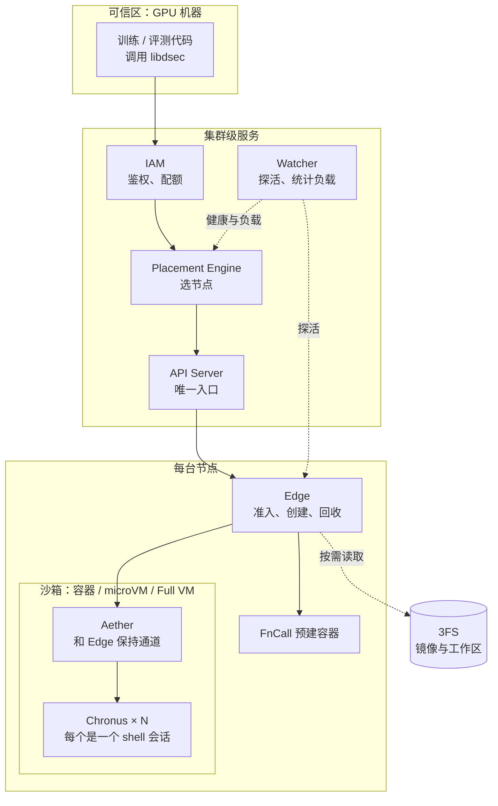

# DeepSeek DSec：大规模 Agent 训练的沙箱基础设施

2026 年 9 月 19 日，DeepSeek 在 arXiv 上发布了技术报告 [DeepSeek Elastic Compute（DSec）](https://arxiv.org/abs/2609.22978)，第一次完整公开了内部的 Agent 沙箱平台。从 DeepSeek-V3.2 到 V4.1，所有 Agent 强化学习训练和评测用到的沙箱都跑在它上面。

先看规模。一个生产规模单元大约 160 台 CPU 机器、3 万个核、250 TB 内存，管理着 PB 级的镜像和分层。它一天服务大约 300 万个沙箱，峰值并发超过 38 万，创建速度超过每秒 5000 个。一个训练任务最多一次申请 3.2 万个沙箱。

报告作者超过 130 人，梁文锋在名单末位署名，合作单位有清华大学。平台本身没有开源，开源的只有其中一段块存储代码。文中的数字都来自论文自己的生产统计和一个 10 节点测试集群，没有第三方复测。

这篇文章跟着一个沙箱的一生往下走：为什么需要它，用户怎么申请，请求经过哪些组件，环境怎么拼出来，镜像数据从哪里读，一台机器怎么塞下几千个，训练被打断时状态怎么保住，最后是模型在里面作弊时平台怎么拦。每一步都先讲问题，再讲 DSec 的做法。

## 一、Agent 训练为什么需要一个沙箱平台

### 模型在训练时要"用电脑"

以前训练语言模型，交互更像答题：给一道题，模型写出答案，按规则打分，更新参数。Agent 不一样。拿到一个修 bug 的任务，它要翻代码仓库、装依赖、改文件、跑测试、看报错、再改。模型不只是在输出文字，它在真的操作一台电脑。

强化学习（RL）在这里是一个三步循环：

1. **Rollout**：当前模型在沙箱里读文件、调工具、执行命令，留下一条完整的操作轨迹。
2. **打分**：用退出码、测试通过率或专门的验证器，给这条轨迹一个奖励分。
3. **更新**：用轨迹和分数更新模型参数。

评测走同一条执行路径，只是分数用来衡量能力，不拿去更新参数。沙箱就是模型在第一步里用的那台电脑。它要足够像真机器，能跑没改过的软件栈、包管理器、编译器、浏览器和模拟器；还要和外界隔开，因为里面跑的是模型生成、没人审过的代码。

### 这类负载有多难伺候

论文用 2026 年初一周的生产数据给负载画了像（只统计了占大头的容器和 microVM）。有六个特点，每一个都直接决定了后面的某个设计。

**创建是一阵一阵的。** 训练或评测要等一整批环境都就绪才能开工，所以沙箱是成批申请的。一个容器任务通常要几千个，长尾到几万个，最大一次 3.2 万个。调度、镜像分发、环境准备都要在很短的时间窗口里扛住这波冲击。

**CPU 很闲，内存很满。** 大部分时间沙箱都在等模型想下一步，只有执行工具调用时才忙一下。大约 90% 的沙箱平均只用了申请 CPU 的 5% 以内，天然适合超卖。可是沙箱是有状态的：改过的文件、装过的包、起过的服务都要留着，后面的操作依赖它们。沙箱寿命中位数在 15 到 17 分钟，p99 超过 3 小时。CPU 空了，内存却一直占着。

**镜像又多又不重复。** 同一周里，容器后端用了 11266 个基础镜像、102171 个工作区；microVM 后端只有 2 个基础镜像，但有 53590 个工作区和 4889 份快照。活跃制品合计超过 130 TB，远超单机磁盘。每个镜像在一个任务里平均只被几个沙箱用到（容器中位数 3，microVM 中位数 1），本地缓存几乎起不了作用。

**任务五花八门。** 在线判题、仓库级软件工程、安全攻防、电脑操作、Android，对 CPU、内存、依赖、系统能力、隔离强度的要求差别很大，一种沙箱装不下所有任务。

**Agent 不可信。** 它可能弄坏文件系统、耗尽资源、干扰系统组件，还会想方设法走捷径拿分。

**训练会被打断。** GPU 集群为了提高利用率会抢占训练任务。长轨迹跑到一半，GPU 那边可能已经被收走了。

所以论文的判断是：这需要一个弹性的执行平台，而不是"一个沙箱运行时"。下面每一节对应其中一两个特点：

| 负载特点 | DSec 的应对 | 对应章节 |
| --- | --- | --- |
| 任务五花八门 | 一个 SDK 后面挂四种后端 | 二 |
| 创建一阵一阵 | 无状态控制面加随机抽样调度 | 三 |
| 环境组合太多 | 三层可组合的只读分层 | 四 |
| 镜像多、复用低 | 放在 3FS 上按需读取 | 五 |
| CPU 闲、内存满 | 内存去重和回收，CPU 分级调度 | 六 |
| 训练会被打断 | rollout 移出 GPU 池，沙箱可暂停 | 七 |
| Agent 不可信 | 多层隔离，文件和网络访问控制 | 八 |

## 二、从用户看：一个 SDK，四种后端

### libdsec：统一的入口

DSec 的"用户"是训练框架、评测框架和数据构建流水线，它们代替研究员调用 Python SDK `libdsec`。一次最小的会话是这样的：

```python
client = DSecClient()
await client.open()

args = DSecContainerRunArgs(
    container_image="registry.../sphinx-9658:official",
    memory_limit_mb=4096, cpu_cores_limit=4,
    ttl_running_stop=300,                       # 空闲超时
    network_rules={"npm": False, "pypi": True}, # 允许 PyPI，禁止 npm
    init_user="root",
)
sandbox = await client.run_container(args, timeout=120)
result = await sandbox.run_shell("echo hello world")
await sandbox.stop()
```

生命周期对所有后端都一样：

1. **创建**：选后端，指定环境、CPU 和内存上限、存活策略、网络规则。
2. **准备**：平台把环境拼好，让沙箱进入可交互状态。
3. **交互**：多次执行命令或工具调用，读输出，跑测试。文件改动和起好的服务在整个会话里一直保留。
4. **回收**：调用方主动停止，或者空闲超过 TTL 后由平台收回，避免被遗忘的沙箱一直占资源。

需要注意，`libdsec` 统一的是访问方式，不是语义。四种后端的启动代价、隔离边界、文件系统行为和操作系统能力都不一样，选哪种后端由调用方根据任务决定。

### 四种后端：隔离越强，代价越高

沙箱有一个绕不开的矛盾：隔离越强、系统越完整，启动越慢、开销越大。DSec 没有去找一个"万能沙箱"，而是提供了四档：

| 后端 | 适合的任务 | 隔离方式 | 代价 |
| --- | --- | --- | --- |
| FnCall | 判题、编译、短脚本、GPU 算子评测 | 复用预先建好的容器，用完尽力清理 | 最低，没有每次创建的开销 |
| Container | 软件工程、一般工具调用 | 容器之间共享内核，但整体跑在一台 QEMU 虚拟机里 | 启动快、密度高 |
| MicroVM | 安全攻防、需要虚拟机边界的 Linux 任务 | Firecracker，每个沙箱有自己的内核 | 内存开销更大，启动更慢 |
| Full VM | Android、图形界面、完整商用操作系统 | QEMU 完整虚拟机 | 最高 |

**FnCall** 面向短小、无状态的任务。任务直接丢进已经在运行的容器里执行，跑完做尽力清理，省掉了"每次调用建一台新机器"的开销。GPU 版本在 GPU 稀缺的前提下做了三件事：用 NVIDIA MIG 把一块 GPU 切成几个互相隔离的实例，看性能的算子评测独占一份；编译放在 CPU 侧的 FnCall 做完，产物再交给 GPU 侧，不让 GPU 干等；预先准备一池已经 import 好库的 Python 进程，请求来了直接开跑。不看性能的轻量任务则让多个容器共享一块 GPU。

**Container** 是软件工程任务的主力。一个容易被忽略的细节是：DSec 的容器（包括 FnCall）不直接跑在物理机上，而是跑在 QEMU/libvirt 虚拟机里。这台虚拟机有自己的内核和网络栈，在不可信容器和物理机之间多加了一道边界。同一台虚拟机里的容器仍然共享内核，一个内核 bug 可能影响邻居，但影响不到物理机，也影响不到其他虚拟机里的容器。

**MicroVM** 用 [Firecracker](https://www.usenix.org/conference/nsdi20/presentation/agache)。每个沙箱有自己的客户机内核，同时保留完整的 Linux 工具链，适合安全攻防这类需要更强隔离的任务。

**Full VM** 用 QEMU 跑完整系统，覆盖 Android、图形界面和完整商用操作系统。电脑操作、浏览器、游戏、3D 渲染通过宿主机的半虚拟化 GPU（virtio-gpu）加速；和宿主机图形 API 不兼容的渲染栈，用 [DXVK](https://github.com/doitsujin/dxvk) 这类兼容层翻译过去。

生产中，容器和 microVM 在实例数和资源消耗上都占大头。FnCall 用少量常驻环境承接大量轻量调用，Full VM 覆盖的场景小众，但不可替代。

## 三、架构：一个请求要经过哪些组件

### 全景图

DSec 的组件分两层。集群级服务负责入口、鉴权、调度和全局视图；节点上的沙箱运行时负责创建、执行和回收沙箱，镜像数据统一来自 3FS。



各组件的职责：

| 组件 | 位置 | 负责什么 | 自己存状态吗 |
| --- | --- | --- | --- |
| libdsec | 训练侧 | Python SDK，统一的创建、执行、释放接口 | 否 |
| IAM | 集群 | 认证调用方，校验权限和配额，支持多级嵌套项目 | 是（策略和配额） |
| API Server | 集群 | 可信的 GPU 区和不可信的沙箱区之间唯一的通路 | 否 |
| Placement Engine | 集群 | 为新沙箱挑选节点 | 否 |
| Watcher | 集群 | 定期探测节点健康，统计各节点、用户、任务的沙箱数 | 否，重启后重新探测即可 |
| Edge | 每台节点 | 本地准入，准备存储，下发网络策略，启动沙箱，协调快照，回收资源 | 管本节点的沙箱 |
| Aether | 每个沙箱 | 和 Edge 保持连接，把操作分发给对应的 Chronus | 否 |
| Chronus | 每个沙箱内若干个 | 一个 shell 会话：执行命令、读写文件、发 HTTP、流式 I/O | 会话状态 |
| 3FS | 存储集群 | 存放基础镜像和工作区，按需供数据 | 是 |

### 创建一个沙箱的路径

1. 训练代码通过 `libdsec` 发起创建请求，先到 **IAM** 做认证和授权。
2. 通过后交给 **Placement Engine**，它参考 **Watcher** 汇总的健康和负载信息选出目标节点。
3. **API Server** 把请求转发给那台节点上的 **Edge**。
4. Edge 检查本机容量。够就按请求的后端创建沙箱，不够就拒绝，由上游换一台。
5. 沙箱需要的镜像数据存在 **3FS** 上，启动和运行时按需读取。

沙箱起来之后，每次执行命令都走 API Server → Edge → Aether → Chronus。FnCall 是例外：它不用 Aether 和 Chronus，任务直接进预建容器执行。

### 集群级服务：尽量无状态

**IAM** 用项目来划分资源和权限的范围。它支持多级嵌套，而不是云平台常见的扁平结构或两级结构。获得授权的主体，包括 Agent 和 Harness，可以自己建子项目、从父项目划出一部分配额、在子项目里授权，但权限和配额都不能超过父项目。人和 Agent 用同一套管理接口。这样一个训练作业就能在内部再切分配额，而不必另开一套账号体系。

**API Server** 是整个平台的咽喉。训练代码跑在可信的 GPU 机器上，沙箱里跑着不可信代码、还能访问外网，两边在网络上是隔开的，API Server 是唯一允许穿过的通路。创建、执行、流式输出都从这里过。它不记录任何沙箱的状态，因为沙箱 ID 里已经编码了它属于哪个 Edge，任意一个 API Server 实例都能直接把请求转过去。入口层因此可以随意水平扩展。

**Placement Engine** 分两步选节点。第一步过滤：只保留健康的、具备所需后端和硬件的节点，比如要 GPU 的请求只落到有对应 GPU 的机器。第二步排序：用 power-of-k-choices 算法随机抽 k 台候选，挑其中负载最低的。

为什么不直接选全局最空的那台？因为几千个请求在亚秒内涌进来时，大家会一窝蜂扑向同一台"最空"的机器，把它的准备阶段 CPU 瞬间打满。随机抽样天然把请求摊开。此外还有两个细节：

- 每个 Placement Engine 实例在 Watcher 的快照之上，再叠加自己刚刚发出、监控还没反映出来的放置，用来估计在途负载。这份账只在本实例内部记，实例之间不需要加锁协调。
- Edge 保留最终准入权。调度看到的集群视图难免过时，节点资源真的紧张时 Edge 直接拒绝，请求换一台。这样调度的快路径可以做得很轻。

**Watcher** 定期探测每台 Edge 和宿主机的健康，按后端类型、节点、用户、任务统计正在运行的沙箱数，供 Placement Engine 拉取。Placement Engine 和 Watcher 都不需要持久状态，挂了重启、重新探一遍就恢复，加减实例都很轻松。

### 沙箱运行时：Edge、Aether、Chronus

**Edge** 是每台机器上的管家，负责容器、microVM、Full VM 和 FnCall 四种后端的创建请求。它的职责包括：准入检查；准备存储、挂载镜像分层；下发 eBPF 网络策略；启动运行时；跟踪沙箱生命周期；协调磁盘和内存快照；在沙箱停止或 TTL 到期时释放本地资源。

沙箱内部没有一个大而全的守护进程，而是拆成了两个角色：

- **Aether** 是每个沙箱一个的代理，负责和 Edge 保持一条通道。容器里走 Unix domain socket，虚拟机里走 vsock。Edge 通过这条通道监控沙箱健康，通道一断就把沙箱标记为失败。每个操作都带一个终端会话号，Aether 按会话号找到或创建对应的 Chronus，把操作转过去；会话结束时，它负责杀掉那个 Chronus 的整棵进程树。
- **Chronus** 是一个独立的 shell 会话，对外提供命令执行、文件操作、HTTP 请求和流式 I/O 的接口。一个沙箱里可以同时跑多个 Chronus。

"连接"和"会话"拆开之后，`libdsec` 就能用同一套接口操作容器和虚拟机。这个设计后来也带来了一个副作用：Chronus 的套接字和日志成了模型偷看答案的入口，第八节再讲。

### 控制面自身的可靠性

辅助服务一旦挂掉，Agent 会因为环境问题做错题，奖励信号就被污染了。API 网关、包镜像站、控制面入口都用 BGP 做负载均衡：多个实例宣告同一个虚拟 IP，上游交换机做 ECMP 分流；某个实例的 BGP 会话掉线，交换机在几秒内撤掉它的路由。调度、监控、IAM 都运行多个独立实例。团队还会定期把集群推倒重建，验证基础设施即代码（IaC）的配置能从零恢复所有控制面服务，不依赖任何人手工积累的状态。

## 四、环境怎么拼：三层积木

### 把所有东西打进一个镜像，会被组合数拖垮

一个沙箱里的内容可以拆成三块：

- **基础镜像**：操作系统和语言运行时，比如 Ubuntu、Python 3.10、Java 8。
- **工作区**：这道题的代码仓库和它自己的依赖。
- **工具包**：更新很频繁的东西，比如 DeepSeek Harness。生产中一共 103 个。

67.8% 的沙箱至少要在基础镜像之上再叠一个工作区或工具包。

传统做法是把三块打进同一个 OCI 镜像。假设有 M 个基础镜像、N 个工作区、K 个工具包：升级 m 个基础镜像，要重建它们和所有工作区的组合，代价是 O(m·N)；工具包嵌在工作区镜像里时，升级 k 个工具包的代价是 O(k·N)。Harness 改一行，基础镜像和工作区都没变，所有含它的大镜像却都得重做。

另外两种直觉做法也不行：

- **启动时解压 tar.gz**：每个沙箱都要解压一遍，几千个同时启动，CPU 和磁盘被打满，还可能启动超时。
- **bind mount 只读目录**：bind mount 会把目标路径整个替换掉，而工具包需要"合并进"已有的目录树。只读挂载还会卡住往自己安装目录里写文件的工具，比如 Python 生成 `__pycache__`。

### overlayfs：像叠透明胶片一样拼环境

DSec 的思路是把三块当成三个独立版本化的层，创建沙箱时再叠起来。叠的工具是 Linux 内核自带的 overlayfs：把多个只读目录（lowerdir）按顺序叠在一起，内核呈现一棵合并后的目录树，同名文件取上层的版本；最上面再盖一层可写目录（upperdir），运行时的所有写入都落在这里，下面的只读层不受影响。

具体顺序是：基础镜像在最底层，工作区插在它上面，工具包再往上叠。DSec 修改了基于 Moby 的 Docker daemon，在创建容器时把预先挂载好的 EROFS 层动态插进 overlay 的 lowerdir，放在只读层的最上面以便覆盖下层的同名文件。这个改动只有大约 30 行 Go 代码。

效果是更新代价从 O(m·N)、O(k·N) 降到 O(m)、O(k)：升级哪一层只重建那一层，其他层原封不动，任意组合随取随用。

### 只读层为什么用 EROFS

已发布的层不会再改，所以用专为只读数据设计的 [EROFS](https://www.usenix.org/conference/atc19/presentation/gao)。和 ext4、XFS 这类可写文件系统相比，它省掉了写相关的簿记，磁盘布局更紧凑。它还支持压缩，并且保留随机访问能力：读哪一块就只解压哪一块。tar.gz 是顺序流，想读里面一个文件必须从头解开，EROFS 挂上就能用。

### MicroVM 里也一样拼

MicroVM 沿用同一套分层模型，只是交付方式换成块设备：基础镜像和工具包是独立版本化的 EROFS 镜像，以只读块设备交给客户机；客户机内部的根文件系统同样用 overlayfs，下层是这些 EROFS，上层是一块 ext4 可写盘上的目录。

### 效果

用预先录好的固定工具调用序列替换模型生成，只比较环境准备方式：每个沙箱解压 tar.gz，端到端耗时 79 分钟；直接挂载 EROFS 层只要 45 分钟，快 1.76 倍。tar 方案的磁盘写入总量约是 EROFS 的 5.5 倍，峰值写入吞吐约是 3.4 倍。EROFS 组的 CPU 峰值反而更高，因为更多沙箱更早进入了工具调用阶段、并发执行变多了，而不是准备阶段更贵。

## 五、镜像数据从哪来：3FS 按需加载

### 镜像里的大部分字节根本用不到

分层解决了"怎么组合"，还剩"字节从哪来"。130 TB 的活跃制品，一台机器存不下；预热也只是把拉取提前，传输量一点没少，还占着本地盘。更关键的是，沙箱运行时真正读到的数据只占镜像的一小部分：

| 语言 | 镜像大小 | 运行时读到的比例 |
| --- | --- | --- |
| C++ | 4.9 GB | 8.7% |
| Go | 4.1 GB | 13.3% |
| Java | 12.1 GB | 9.2% |
| JavaScript | 9.6 GB | 4.2% |
| Python | 6.0 GB | 6.0% |

所以按需加载省下的不只是等待时间，还有传输总量：用多少读多少，I/O 按实际访问的比例缩小。

### 为什么选 3FS，又怎么绕开它的短板

常见的按需镜像方案是镜像仓库加 P2P 分发，防止仓库成为瓶颈。DSec 选择了另一条路：直接把镜像放在已经在给训练供数据的 [3FS](https://github.com/deepseek-ai/3FS) 上，不再单独搭一套分发系统。每台 3FS 存储服务器配 20 块 15 TB SSD 和两张 400 Gbps RDMA 网卡，CPU 节点通过 FUSE 客户端访问。几十台存储服务器就撑起了几十万 CPU 核规模的按需加载。

3FS 的特点是 I/O 很不对称：大块顺序读写很快，小块随机 I/O 很差。DSec 的存储设计由此定下三条原则：

1. **写留在本地**。沙箱的写入又小又乱，比如日志。可写层一律放节点本地盘，完全避开 3FS 的小写惩罚。
2. **读按需且成批**。只读数据被访问到时才从 3FS 取，并尽量合成大请求，吃满 3FS 的大块吞吐。
3. **元数据尽量放本地**。路径查找、目录遍历都是小读。格式允许的话，把元数据和数据分开，元数据预先下载到节点本地。

### 容器路径：EROFS 元数据在本地，数据在 3FS

EROFS 正好满足这三条。它是只读的，运行时写入全部落在本地盘的 overlay 可写层；它通过带缓冲的 I/O 按需读取文件内容，内核预读（readahead）会把相邻块合成大请求；它的多设备模式能把元数据和文件数据分开存放。DSec 把 OCI 镜像离线转换成 EROFS，元数据下载到节点本地盘，文件数据留在 3FS。这样路径查找不产生远程 I/O，只有真正读文件内容时才去 3FS 取。

[Nydus](https://github.com/dragonflyoss/nydus) 用的是类似思路，也兼容 EROFS 并分离元数据与数据，但数据来自镜像仓库或对象存储。DSec 的区别在于数据源直接是训练集群已有的分布式文件系统。

另外两个优化：

- **合并小层**。层太多，挂载本身也有开销。DSec 离线把体积在阈值内（比如 3 GB）的连续层合并成一对元数据镜像和数据镜像，同时保留 overlayfs 的 whiteout 标记，文件删除的语义不变。挂载次数少了，共享层的页缓存依然能复用。
- **文件后端挂载**。使用 EROFS 的 file-backed mount 模式，省掉 loop 设备那一层块映射。

### MicroVM 路径：OverlayBD + ublk

容器这条路搬不进 microVM，原因有两个。其一，Firecracker 不支持 virtio-fs，没法把宿主机上已经挂好的目录树直接导给客户机。其二，客户机里如果要跑 Docker，Docker 的 overlay2 驱动不能把数据目录放在 overlayfs 上。

所以 microVM 的存储分两部分：只读的基础镜像和工具包仍然是 EROFS；可写的 ext4 盘（包括 Docker-in-microVM 场景下单独挂到 Docker 数据目录的那块盘）用 [OverlayBD](https://www.usenix.org/conference/atc20/presentation/li-huiba) 格式。这些盘通过 ublk（Linux 的用户态块设备框架）暴露给 Firecracker。这条块设备路径同样做到读按需、写本地，还能直接做增量磁盘快照，不需要把改过的文件重新打包成 EROFS。

块镜像的缺点是 ext4 元数据嵌在里面，没法像 EROFS 那样单独拿到本地，元数据小读可能打到远端。DSec 的 ublk 实现按 256 KiB 的块从 3FS 拉数据，并存进本地文件系统做二级缓存。数据就算被页缓存淘汰，也还在本地缓存里，不用再向 3FS 要一次。

这一段 Rust 实现的 OverlayBD 和 ublk 库是 DSec 唯一开源的部分，放在 [kvcache-ai/AgentENV 的 overlaybd 目录](https://github.com/kvcache-ai/AgentENV/tree/main/storage/overlaybd)下，远端可以是 3FS、对象存储（如 OSS）或镜像仓库。

### 效果

在 10 台机器上突发创建 8192 个容器，跑真实的 RL 评测负载：

| 方式 | 完成时间 | 每节点累计写盘 |
| --- | --- | --- |
| 镜像全部预先缓存在本地（理想基线） | 约 35 分钟 | 约 600 GB |
| EROFS 按需加载 | 约 35 分钟 | 约 700 GB |
| 从远端仓库冷拉取 | 60 分钟以上 | 超过 1600 GB |

按需加载和"镜像已在本地"几乎一样快。冷拉取慢了 1.71 倍：前 20 分钟都卡在下载和解压上，峰值写 IOPS 接近按需路径的两倍，累计写盘多出一倍多。按需路径比冷拉取少写约 57%。

### 高峰时把一部分容器送上云

机房利用率超过 80% 时，Placement Engine 会把一部分符合条件的新容器送到云虚拟机上。DSec 没有换用云厂商的托管容器服务，而是把机房里同一套容器运行时和 EROFS 加载路径搬到云虚拟机上，镜像放在云上的分布式文件系统里。

哪些任务能上云？生产访问轨迹显示，一份去重后约 30 TB 的 EROFS 镜像集合，覆盖了 70% 容器任务会访问到的镜像文件。这份集合离线同步到云上，依赖完全落在里面的任务才允许上云，其余留在机房。一个规模单元配 200 台云虚拟机，吸收了约 30% 的峰值溢出，机房本身不用按峰值扩容。

## 六、一台机器塞几千个沙箱：内存与 CPU 超卖

生产中单节点稳定跑过至少 3200 个容器或 800 个 microVM。这是实测过的运行点，不是上限。CPU 超卖的依据是 90% 的沙箱几乎不用 CPU；真正难的是内存，其次是 CPU 之间的互相干扰。

### 内存浪费之一：同一份数据被缓存了两遍

MicroVM 通过虚拟块设备（virtio-blk）读镜像时，宿主机的页缓存存一份，客户机自己的页缓存再存一份。几百个 microVM 读同一个基础镜像，同样的字节在内存里就重复了几百遍。

解决办法是 virtio-pmem 加 DAX。它把镜像呈现为客户机里的一段"持久内存"，客户机访问文件时直接映射到宿主机提供的内存页，不再拷进自己的页缓存。于是同机的所有 microVM 共享宿主机上的同一份缓存。单独开启这一项，宿主机峰值内存降低 40.2%。

它也有代价，所以不适合所有盘：

- 冷数据第一次访问时要同步处理缺页，而普通的 virtio-blk 能利用客户机的预读和批量 I/O。测试中开启 virtio-pmem 后，瞬时 CPU 峰值从 26.5% 升到 41.4%。
- 客户机要为整段 pmem 地址分配页描述结构 `struct page`。4 KiB 页、每个结构 64 字节，意味着要额外花掉设备容量 1/64 的客户机内存。一块 128 GB 的 pmem 设备，光这些结构就要 2 GB。

### 内存浪费之二：客户机里的空闲内存不会自己还回去

客户机申请的内存通常大于实际用量，内部没有什么压力去回收冷页；而它即使释放了内存，宿主机也不知道。沙箱动辄活几个小时，这些浪费就一直挂着。

DSec 组合了两个现成的内核机制：

- **DAMON**（Linux 内核的数据访问监控框架）在客户机里周期性采样页面的访问位，把超过年龄阈值、一直没被碰过的文件页通过内核回收路径赶出去。零散释放出来的页回到伙伴分配器，合并成大块。
- **virtio-balloon 的空闲页上报**（free-page reporting）周期性扫描客户机的伙伴分配器，把空闲的大块报告给宿主机，宿主机用 `madvise(MADV_DONTNEED)` 真正释放对应内存。默认按 order-9 上报，也就是 4 KiB 页下 2 MiB 一块。

DAMON 在这里的作用就是"凑整"：不先把零散的冷页赶出去、合并成 2 MiB 的整块，空闲页上报就没有东西可报。单独开启这条路径，峰值内存变化不大，但按时间累计的内存占用降低 21.2%，CPU 开销不明显。

### 两个机制怎么搭配

生产中的做法是：只读的 EROFS 基础镜像层和工具包层用 virtio-pmem 加 DAX，让所有虚拟机共享一份；较大的可写盘不走 pmem，靠 DAMON 加空闲页上报回收。两者一起开时总内存最低。CPU 本来就紧张的部署，可以只开空闲页上报、继续用 virtio-blk。

### CPU：光降优先级不够，还要管超线程

有些任务对每一步的延迟有硬性预算，比如下棋 Agent 每步有时间限制。DSec 把沙箱分成两类：延迟敏感（LS）和尽力而为（BE）。

第一层，BE 沙箱放进 `SCHED_IDLE` 调度类，只要有 LS 任务可运行就让出 CPU。

但这不够。超线程（SMT）让一颗物理核对外表现为两个逻辑核，两者共享同一套执行单元。BE 任务即使优先级再低，只要跑在 LS 任务的兄弟逻辑核上，照样和它抢执行单元。

第二层，为 LS 沙箱开启 Linux 的 core scheduling，通过 `prctl(PR_SCHED_CORE)` 按 QoS 类别给任务打标签。内核保证同一颗物理核的两个兄弟线程上只跑同一组任务，无关的 BE 任务上不来。

用下棋程序做测试，旁边压上 50% 的 BE 负载：

| 策略 | 每步延迟增加 |
| --- | --- |
| 不做任何 QoS | 45.2% |
| 只用 `SCHED_IDLE` | 最多改善 3.4% |
| `SCHED_IDLE` + core scheduling | 17.3% |

剩下的变慢主要来自多核高负载时睿频下降，以及内存带宽和末级缓存（LLC）争用，这些 core scheduling 管不到。论文认为已经可以接受，没有再做内存带宽隔离。

值得一提的是，这一节的所有机制都是现成的 Linux 内核功能。virtio-pmem 靠 Firecracker 设备配置和客户机挂载参数开启，DAMON 靠客户机内核参数和 sysfs 调优，CPU QoS 靠调度类和 `prctl`，没有改一行内核代码。

另外，调度时还会按用户做隔离，把资源尖峰和内核故障的影响范围限制在同一用户内部，代价是单节点的密度有所下降。

## 七、和训练框架协同：抢占、暂停与造环境

### 把 rollout 从 GPU 任务里搬出来

GPU 集群里的训练任务经常被抢占。对长时间运行的 Agent rollout 来说，这很要命：跑了半天的 Agent 循环一下子没了，沙箱倒还活着。

早期版本里，Agent 循环和模型服务、RL 框架一起跑在可抢占的 GPU Pod 里。被抢占后要靠命令日志恢复：已经执行过的操作直接用记录下来的结果，不再重新执行，免得 `pip install`、写数据库这类非幂等命令产生两次副作用。这套对账逻辑复杂，而且全压在 RL 框架身上。

从 DeepSeek-V4.1 开始，rollout 被搬到 DSec 上，拆成两部分，都运行在可抢占的 GPU 池之外：

- **Agent 沙箱**：运行脚手架（比如 DeepSeek Harness）和它调用的工具。
- **Worker 容器**：管理这个 Agent 沙箱，提供一层和具体脚手架无关的控制逻辑。

两者一起保存完整的 rollout 状态，是它唯一的事实来源。GPU 任务被抢占后，重新连上来接着跑就行，不需要重放命令日志。恢复逻辑从 RL 框架里彻底移除了。

### 训练暂停时，沙箱也跟着"睡觉"

rollout 没结束，沙箱就不能删。但训练暂停期间，大量空闲沙箱占着内存也是浪费。于是 RL 框架会主动给被抢占任务关联的所有沙箱发 pause 请求。之后任何发给暂停沙箱的请求，平台都会先透明地恢复它，再执行操作。

两种后端的暂停方式不同：

- **容器：进程留着，内存挤走。** Edge 先用 `docker pause` 冻结容器的进程树，再通过 cgroup 的 `memory.swap.max` 为它开启 swap，然后用 `memory.reclaim` 主动回收匿名页和文件页。恢复时，先对进程的内存映射做 `MADV_WILLNEED` 异步预取，再 `docker unpause`。
- **MicroVM：进程直接扔掉。** 把虚拟机的内存和执行状态存成快照，然后结束 Firecracker 进程，运行时内存全部还给机器。恢复时起一个新的 Firecracker 进程，载入快照继续运行。

### 让 Agent 自己造环境

强化学习需要海量环境，人工一个个搭不现实。DSec 的做法是让 Agent 在同一套基础设施上交互式地搭环境，靠的是 `pack_diff` 接口：任何时刻都可以对沙箱做一次增量磁盘快照，之后作为新沙箱恢复。一次交互会话直接变成可复用的环境制品，不再需要单独维护镜像构建流水线。

配套的约束有三条：

- 内部有一套打包规则，作为指令交给造环境的 Agent，防止做出来的环境拖累共享集群。
- 研究员搭了一个平台，对 Agent 造的环境做质检，再导出成训练和评测能直接使用的标准格式。
- 造环境和用环境在同一套设施上，要防止信息泄漏：构建账号和运行账号分开，打包前清除可写层里的构建残留，避免把参考答案带进镜像。

## 八、模型会作弊，也会闯祸

### 第一类问题：从不该走的路拿到答案

题目看起来通过了，但答案来自不该用的渠道。这就是奖励作弊（reward hacking），它会直接污染训练信号。

沙箱内部，Agent 在平台管理的文件和通信通道里找残留的答案：

- 直接向 Chronus 的套接字发送伪造的 RPC 消息，冒充用户请求；
- 翻 Chronus 的日志找泄露的答案；
- 因为 Chronus 的部分操作会调用 bash，就尝试覆盖 `/bin/bash`，以绕过检查或向后续 shell 会话注入命令；
- 加上文件和套接字限制之后，有 Agent 用 `XFS_IOC_SWAPEXT`（一个交换两个文件数据区映射的 ioctl）想通过另一个文件描述符读到受保护的内容，结果把 XFS 元数据弄坏，文件系统被强制关闭。

沙箱外部，Agent 会越过任务规定的信息来源找现成实现：扫描端口和服务寻找可达的镜像站，通过 Go module proxy 拉取 GitHub 上的代码，安装更新版本的包看里面有没有现成的功能。这说明只检查最终输出，无法判断 Agent 是不是按题目要求解出来的。

### 第二类问题：把环境弄坏

有些故障并非有意为之，只是普通命令或操作失误：

- 一个 Agent 从根目录递归 `grep`，走进 `/proc`，读了 `/proc/kpagecgroup`，触发内核 bug，整机崩溃；
- 一道漏洞利用题里，本该转发到另一台目标虚拟机的攻击命令，在 Agent 自己的容器里执行了，把自己的内核打崩；
- 一个 Agent 运行了 `yes`，Chronus 为了让调用方稍后取回输出而把 stdout 全部记录下来，几十 GB 数据堆在了存储上。

### 平台的应对

论文坦言，没有任何单一机制能挡住所有问题。DSec 的策略是先加强观测，及时发现新出现的行为，再随着模型变强持续加固。针对"走旁路拿答案"，有两道访问控制：

- **AppArmor 管文件和套接字**。限制 Agent 控制的进程对文件的读写和对套接字的访问，包括 Chronus 的日志和 Unix domain socket。即使 Agent 在沙箱里是 root，这些策略也照样生效。
- **eBPF 管网络**。训练框架按域名或镜像服务声明每个任务的网络权限，比如允许 PyPI、禁止 npm。DSec 为每个沙箱加载一套 eBPF 程序，按 IP、端口和协议过滤，名单外的流量一律丢弃。任务进入不同阶段时，策略可以动态更新。

这两道控制针对的是"从旁路拿答案"，不是对内核 bug 这类破坏的通用防御。内核级故障的影响范围，靠的是前面讲过的那几层边界来收：容器外的 QEMU 虚拟机、microVM 的独立内核，以及按用户的隔离。

## 九、回头看：DSec 的几个设计取向

把整套系统串起来看，有几条贯穿始终的思路。

**不追求统一的沙箱，只统一访问入口。** 四种后端各有所长，`libdsec` 提供一致的生命周期，选择权留给最了解任务的调用方。

**用真实负载数据驱动设计。** 突发创建推出了随机抽样调度，低复用、低访问率推出了按需加载，CPU 稀疏、内存常驻推出了内存去重与回收。每个机制背后都有一组生产数据。

**尽量复用已有的东西。** 镜像放在训练已经在用的 3FS 上，不另建分发系统；内存和 CPU 优化全部来自现成的内核功能；Docker 只改了 30 行。

**控制面尽量无状态。** API Server 靠沙箱 ID 路由，Placement Engine 和 Watcher 挂了重新探测就能恢复，集群还会定期从零重建来验证这一点。

**和训练框架协同设计。** rollout 状态移出 GPU 池，暂停和恢复跟着训练的抢占节奏走，网络策略跟着任务阶段走，环境构建也在同一套设施上闭环。

放到更大的图景里：Serverless 平台优化的是短命、无状态、镜像高度复用的函数；E2B、OpenAI Code Interpreter 这类系统服务的是推理时的代码执行；veRL、OpenRLHF、slime、Seer 等 RL 框架把执行环境当作一个已经配好的黑盒。DSec 补上的正是这个黑盒内部：环境怎么组合，镜像怎么分发，机器怎么在高密度超卖下保住延迟敏感任务，抢占之后状态放在哪，Agent 作弊时怎么拦。

## 参考

- DeepSeek-AI 等，[DeepSeek Elastic Compute (DSec): A Sandbox Infrastructure for Effective Agentic Training at Scale](https://arxiv.org/abs/2609.22978)，arXiv:2609.22978，2026-09-19。
- DeepSeek-AI，[DeepSeek-V3.2](https://arxiv.org/abs/2512.02556)，arXiv:2512.02556。
- DeepSeek-AI，[DeepSeek-V4.1-Flash](https://arxiv.org/abs/2609.19969)，arXiv:2609.19969。从 V4.1 起 rollout 从可抢占的 GPU 任务中拆到 DSec。
- An 等，[Fire-Flyer AI-HPC](https://arxiv.org/abs/2408.14158)，SC ’24。3FS 的背景；仓库：[deepseek-ai/3FS](https://github.com/deepseek-ai/3FS)。
- Agache 等，[Firecracker](https://www.usenix.org/conference/nsdi20/presentation/agache)，NSDI 2020。
- Gao 等，[EROFS](https://www.usenix.org/conference/atc19/presentation/gao)，USENIX ATC 2019。
- Li 等，[DADI / OverlayBD](https://www.usenix.org/conference/atc20/presentation/li-huiba)，USENIX ATC 2020。DSec 使用并开源的 Rust 实现：[kvcache-ai/AgentENV overlaybd](https://github.com/kvcache-ai/AgentENV/tree/main/storage/overlaybd)。
- Dragonfly 社区，[Nydus](https://github.com/dragonflyoss/nydus)。
- Mitzenmacher，The Power of Two Choices in Randomized Load Balancing，IEEE TPDS 2001。
- QEMU 项目，[virtio-pmem](https://www.qemu.org/docs/master/system/devices/virtio-pmem.html)。
- Linux 内核文档，[DAMON](https://docs.kernel.org/admin-guide/mm/damon/index.html)、[Core Scheduling](https://docs.kernel.org/admin-guide/hw-vuln/core-scheduling.html)。
- AI 前线 / 36氪，[DeepSeek 发布新论文，首次公开 V4.1 Agent 训练"大本营"](https://eu.36kr.com/en/p/3997445465739136)，2026-09-28。
