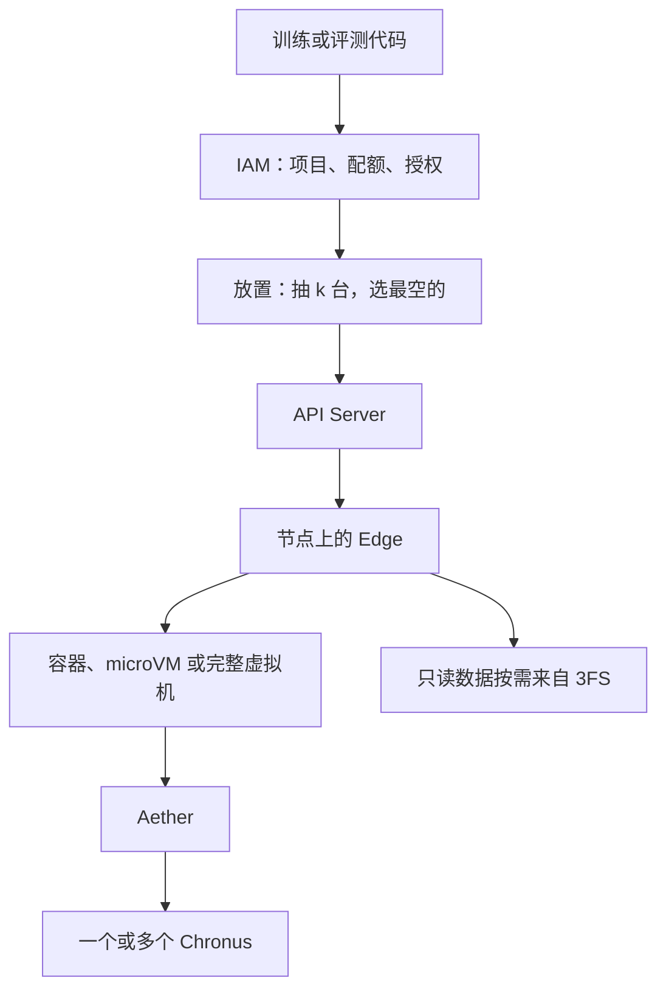

# DeepSeek DSec：大规模 Agent 训练的沙箱基础设施

2026 年 9 月 19 日，DeepSeek 把内部沙箱平台 DSec 的技术报告放到了 arXiv，编号 2609.22978。它写的是 V3.2 到 V4.1 做 Agent 强化学习时实际在跑环境的那套生产系统。一个规模单元大约 160 台 CPU 机器、3 万个核、250 TB 内存，一天大约 300 万个沙箱，峰值并发大约 38 万，创建能顶到每秒 5000 个以上。单个任务最多一次要 3.2 万个沙箱。

报告全称是 [DeepSeek Elastic Compute（DSec）](https://arxiv.org/abs/2609.22978)，作者超过 130 人，梁文锋在名单末位署名，合作单位包括清华大学。平台本身没有开源。数字都是论文自己的生产统计和 10 节点评测，没有第三方复测。下面按设计来写：环境怎么拼、字节从哪读、内存和 CPU 怎么超卖、训练被抢走之后状态放哪、模型作弊时平台拦在哪。写到取舍的地方，会拿 [AgentENV](https://github.com/kvcache-ai/AgentENV)、[CubeSandbox](https://github.com/TencentCloud/CubeSandbox)、[OpenSandbox](https://github.com/opensandbox-group/OpenSandbox) 和 E2B 对照。它们要解决的负载有重叠，选的机制经常不在同一层。

## 负载先把“一个沙箱运行时”排除掉

强化学习在这里是三拍。Rollout 时，当前模型在沙箱里读仓库、改文件、跑命令，留下一条轨迹。打分时，用退出码、测试或者专门的验证器给轨迹一个分数。更新时，用轨迹和分数改模型参数。评测走同一条执行路径，分数只用来看能力，不拿去更新参数。

压力不在“能不能起一个容器”。论文用一周生产数据把形状量了出来，只统计容器和 microVM，这两类占了实例数和资源的大头。

创建是挤在一起的。训练或评测要等这一批环境都就绪，模型才能开始交互。容器任务的典型规模已经是几千个沙箱，尾巴到几万。最大的作业一次申请 3.2 万个。调度、镜像、准备阶段的 CPU，都会在这个窗口里被同时打到。

起来之后 CPU 很闲。工具调用是一小段忙，然后干等模型想下一步。大约 90% 的容器和 microVM，平均只用到所申请 CPU 的 5% 以内。生产里单节点稳定跑过至少 3200 个容器，或者 800 个 microVM。寿命中位数分别是 17.4 分钟和 15.5 分钟，两边的 p99 都超过 3 小时。CPU 早空了，改过的文件和装上的包还在，内存退不掉。

镜像几乎不复用。同一周，容器后端用了 11266 个基础镜像、102171 个工作区；microVM 后端只有 2 个共享基础镜像，工作区仍有 53590 个，外加 4889 份快照。容器镜像的中位扇出是 3，microVM 镜像的中位扇出是 1。节点本地盘装不下这套工作集，预热也只是把拉取提前，字节数不会变少。

任务还不是同一种电脑。在线判题、仓库级软件工程、安全渗透、电脑操作、Android，要的系统能力和隔离强度差很远。再往上，长轨迹还在跑的时候，GPU 上的训练任务可能被抢占。沙箱如果跟 GPU Pod 绑在一起，轨迹就断了。

所以 DSec 同时做了四件事：调用方按任务选隔离后端，环境按层拼，机器按“CPU 可以超卖、内存必须还得回来”来塞，rollout 的状态放在 GPU 池外面。

## 四种后端，容器外面还有一层虚拟机

Python SDK 叫 `libdsec`。创建时指定镜像、CPU、内存、空闲超时和网络规则，网络规则可以写成“允许 PyPI、禁止 npm”。然后多次执行命令，最后释放。文件改动和已经拉起的服务留在这次会话里。空闲超过 TTL，或者调用方主动停，沙箱被收回。统一的是这套生命周期。文件系统语义和操作系统能力跟着后端走。

| 后端 | 论文里的用途 | 隔离落在哪 |
| --- | --- | --- |
| FnCall | 判题、编译、短脚本、GPU 算子评测 | 预先建好的容器，调用完尽力清理 |
| Container | 软件工程、一般工具调用 | 共享内核的容器，但这层内核在一台 QEMU 虚拟机里 |
| MicroVM | 安全任务、需要虚拟机边界的 Linux 负载 | Firecracker |
| Full VM | Android、图形界面、完整商用系统 | QEMU，图形走 virtio-gpu |

FnCall 不走后面的 Aether / Chronus。任务丢进已经存在的容器，跑完做尽力清理，所以没有“每个调用一台新机器”的开销。GPU 版本拆成三截，因为 GPU 少，不能拿来做准备。编译在 CPU 侧做完，产物再交给 GPU 侧。要看性能的算子评测用 NVIDIA MIG，一块 GPU 切成隔离实例，一个容器在生命周期内独占一份。不看性能的轻量任务则是多个容器共享一块 GPU。旁边还有一组预先 import 好库的 Python 进程，请求来了直接跑算子。

容易漏掉的是容器的摆放。论文写明，FnCall 和容器不直接跑在裸金属上，而是跑在 QEMU/libvirt 虚拟机里。这台虚拟机有自己的内核和网络栈，把不可信容器和物理机隔开。容器之间仍共享这台虚拟机里的那份内核。一次内核 bug 可以打垮这台虚拟机上的邻居，但默认打不到物理机，也打不到另一台虚拟机里的容器。评测时，容器实验就跑在这样一台虚拟机里：96 核、超线程后 192 个硬件线程、512 GB 内存。MicroVM 评测则直接放在裸金属上，避免再套一层虚拟化。那批裸金属是双路 AMD EPYC 9655，每路 96 核，1.5 TB 内存。宿主机内核是 Linux 7.0，microVM 客户机是 Linux 6.1。评测集群一共 10 台，和生产分开。

MicroVM 用 [Firecracker](https://www.usenix.org/conference/nsdi20/presentation/agache)，保留 Linux 工具链，同时给客户机一份自己的内核。Full VM 用 QEMU 跑完整系统。电脑操作、浏览器、游戏、3D 渲染走宿主机 hypervisor 的 virtio-gpu。和宿主机图形 API 不兼容的渲染栈，用 [DXVK](https://github.com/doitsujin/dxvk) 这类层翻译。

CubeSandbox 把每台沙箱都做成微虚拟机，密度靠快照克隆和写时复制。OpenSandbox 让创建请求选 runc、gVisor、Kata 或 Firecracker 模板。DSec 把这个选择交给训练任务，而且容器路径多了一层“虚拟机里的共享内核”：比裸金属上的 `docker run` 多一道边界，又比每题一台 Firecracker 便宜。判题和算子评测如果也进 Firecracker，准备阶段会先被启动开销乘上那 3.2 万。

## 请求落在哪台机器上

IAM 用项目划范围。项目可以多层嵌套，获授权的主体，包括 Agent 和 Harness，可以建子项目、划出一部分父配额，并在子项目里授权。子项目的权限和配额不能超过父项目。人和 Agent 走同一套管理接口。云平台常见的是平的账号，或者账号下面再挂一层项目。这里把“再切一刀”交给跑训练的程序自己做，因为一次作业里的子任务要互相隔离配额，又不能另开一套账号系统。

放置分两步。先过滤：节点健康，并且有请求要的后端和硬件，带 GPU 的请求只会落到有那种 GPU 的机器上。再排序：power-of-k-choices，随机抽 k 台合格节点，选其中最空的。突发流量如果每次都扑向“当前全局最空”的那一台，准备阶段的 CPU 会在同一台机器上叠起来。随机抽样把这批请求摊开。Watcher 周期性地探活，并按 Edge、用户、任务汇总正在跑的沙箱数。放置引擎把这份视图拉回来用。它自己再在本地叠一层“刚刚发出、监控还没反映”的放置，用来修正在途负载。这层账只在本实例里，实例之间不用为它加锁。Edge 仍有最终准入：本地容量不够就拒绝，换一台。放置引擎和 Watcher 都不存沙箱的执行状态，挂了重新探活即可。

论文还有一句和密度直接相关的话：用户隔离把资源尖峰和内核故障的爆炸半径收在用户边界内，代价是单节点能塞的密度下降。容器外面那层 QEMU 已经把物理机隔开了；用户隔离再限制一个用户的故障能波及谁。能塞 3200 个容器的数字，是在这个约束下量出来的。论文没有把“一个用户一台虚拟机”写成实现细节。

API Server 是可信 GPU 机器和不可信沙箱之间唯一允许穿过的入口。它不记每个沙箱的状态。沙箱 ID 里编码了所属 Edge，所以任意一个入口实例都能把请求转过去。AgentENV 的 Gateway 要另记“沙箱在哪台节点”，默认放内存，可选 Redis。DSec 把位置写进 ID，入口层没有这份绑定要恢复。

沙箱起来之后，容器和虚拟机里是两个进程，不是一个大而全的 guest agent。Aether 和 Edge 保持一条通道：容器用 Unix domain socket，虚拟机用 vsock。通道断了，Edge 把沙箱标成失败。每次操作带着终端会话号，Aether 按这个号找到或创建一个 Chronus，把操作转过去。会话结束，Aether 杀掉对应的 Chronus 进程树。Chronus 是一个 shell 会话：执行命令、访问文件、发 HTTP、流式传输入输出。一个沙箱里可以同时有多个 Chronus。

E2B 的 envd、OpenSandbox 的 execd、AgentENV 里的 envd，都是沙箱里的一个守护进程，命令和文件走它的 HTTP 或 gRPC。DSec 把“和宿主机保持连接”和“这一次 shell”拆开。拆开之后，libdsec 可以用同一套操作盖住容器和虚拟机。代价也跟着来：Chronus 的套接字和日志后来成了模型翻答案的入口。这一点放到最后一节。

## 环境拆成三层，更新才不会按组合爆炸

一个沙箱里的内容，论文拆成三块。基础镜像是操作系统和语言运行时，例如 Ubuntu、Python 3.10、Java 8。工作区是这道题的仓库和它自己的依赖。工具包是更新很勤的东西，例如 DeepSeek Harness，一共 103 个。67.8% 的沙箱至少还要在基础镜像之外再叠工作区或工具包。容器侧这些制品合计 82.8 TB，microVM 侧 50.9 TB。

MicroVM 只有 2 个基础镜像，多样性几乎全在工作区和那 4889 份快照上。容器的基础镜像有一万多个。两种后端面对的组合问题不一样：microVM 要共享那两份只读系统；容器要承受基础镜像本身也在裂变。

把三块焊进同一个 OCI 镜像，更新成本按组合长。设有 M 个基础镜像、N 个工作区、K 个工具包。升级 m 个基础镜像，要重建它们和所有工作区的组合，代价是 O(m·N)。工具包嵌在工作区镜像里时，升级 k 个工具包是 O(k·N)。Harness 一更新，基础镜像和工作区都没变，所有嵌了它的大镜像仍要重做。

拆开之后三块各自版本化。升级基础镜像只重建那 m 层，升级工具包只重建那 k 层。沙箱创建时再叠。

叠的方式是 overlayfs。只读下层叠起来，内核给出一棵合并后的目录树，同名文件取更上面的那层。运行时的写入进最上面的可写层。他们改了基于 Moby 的 Docker daemon，创建容器时把预先挂好的 EROFS 层插进 overlay 的 lowerdir，大约 30 行 Go。插进去的那层放在只读层的最上面，才能盖住下面的同名文件。

启动时把工作区和工具包解压进每个沙箱，会在突发窗口里把 CPU 和磁盘打满。评测用预先录好的工具调用序列，把差异限制在工作区怎么准备好：每个沙箱解压 tar.gz，端到端 79 分钟；直接挂载 EROFS 层是 45 分钟。tar 路径的磁盘写入总量大约是 EROFS 的 5.5 倍，峰值写入吞吐大约是 3.4 倍。EROFS 那组的 CPU 峰值更高，论文的解释是更多沙箱更早进入工具调用，并发执行变多了，准备阶段本身没有更贵。

直接 bind mount 也不合适。bind mount 会把目标路径整个换掉。工具包要的是合并进已有目录树。只读挂载还会卡住往安装目录里写文件的工具，Python 生成 `__pycache__` 就是这种写。overlay 的可写层把这类写接住，只读层保持不变，下一台沙箱还能共享。

只读层用 [EROFS](https://www.usenix.org/conference/atc19/presentation/gao)。它为只读数据设计，布局比 ext4、XFS 紧，支持压缩，读到哪一块解哪一块。tar.gz 是顺序流，不把归档解完就无法随机读里面的一个文件。

挂太多层本身也有成本。他们把体积在阈值内、例如 3 GB 以内的连续层，离线合成一对元数据镜像和数据镜像，同时保留 overlay 的 whiteout，删除文件的语义还在。挂载次数下来了，共享层的页缓存还能继续复用。文件后端的挂载去掉了 loop 设备那一层映射。

MicroVM 用同一套分层，路径换成块设备。基础镜像和工具包仍是独立版本的 EROFS，以只读块设备交给客户机。客户机里的根文件系统再用 overlayfs：下层是挂起来的 EROFS，上层是一块 ext4 可写盘上的目录。Firecracker 没有 virtio-fs，不能把宿主机上已经挂好的目录树直接导出给客户机，所以容器那条“插 lowerdir”的路走不到客户机里面。

环境也可以由 Agent 自己造。`pack_diff` 在任意时刻做增量磁盘快照，之后恢复成新沙箱。交互式搭出来的环境直接变成下一轮能用的制品，不必再维护一条单独的镜像流水线。构建账号和运行账号分开，打包前清掉可写层里的残留，避免把答案带进训练。平台侧还有质检，并把环境导出成训练和评测能吃的格式。

OpenSandbox 和 CubeSandbox 的快路径是另一头：把 OCI 镜像启动到探针成功，冻成模板快照，创建时克隆这份快照。模板更新要重新烤。这适合镜像种类有限、启动延迟卡在几十毫秒的在线 Agent。DSec 一周有十万级工作区，工具包还在频繁改，烤“每个组合一张模板”会先死在构建上。分层是为了让更新和创建都只碰到变了的那一层。

## 只读字节放在 3FS 上，因为大部分不会被读到

运行时真正读到的比例很低：

| 语言 | 镜像大小 | 运行时读到的数据 |
| --- | --- | --- |
| C++ | 4.9 GB | 8.7% |
| Go | 4.1 GB | 13.3% |
| Java | 12.1 GB | 9.2% |
| JavaScript | 9.6 GB | 4.2% |
| Python | 6.0 GB | 6.0% |

按需读同时少掉两笔账：启动前不必把镜像拉全，传输量也按访问比例缩小。

Nydus 已经把这件事做在镜像格式里：元数据和数据块分开，数据从仓库或对象存储按需取，用户态后端可以是 fscache 或 FUSE。DSec 没有再搭一套仓库加 P2P。镜像放在已经为训练服务的 [3FS](https://github.com/deepseek-ai/3FS) 上。3FS 的 I/O 不对称，大块顺序读写很强，小块随机很差。存储服务器是每台 20 块 15 TB SSD、两张 400 Gbps RDMA 网卡，CPU 节点用 FUSE 客户端访问。几十台存储服务器支撑几十万 CPU 核规模的按需加载。

这个不对称把路径拆开了。写又小又密，例如日志，留在节点本地盘。读按需，并且靠内核 readahead 把相邻块合成大请求。路径查找是小读，元数据先下到节点本地，文件数据留在 3FS。EROFS 的多设备模式正好把元数据和文件数据拆开。

MicroVM 的可写 ext4，包括 Docker-in-microVM 要单独挂到 Docker 数据目录的那块盘，走 OverlayBD。块设备由用户态 ublk 提供。ext4 的元数据嵌在块镜像里，小读仍可能打到远端，所以 ublk 按 256 KiB 拉取，放进本地二级缓存。页缓存淘汰之后，这块本地缓存还在，不必再向 3FS 要一次。这条存储路径开源在 [AgentENV 的 overlaybd 目录](https://github.com/kvcache-ai/AgentENV/tree/main/storage/overlaybd)，远端可以是 3FS、对象存储或镜像仓库。两边用了同一份块存储代码。AgentENV 在这上面做内存层和同机分叉，DSec 用它给 Firecracker 供可写盘。控制面不是同一个系统。

10 台机器上突发创建 8192 个容器：按需 EROFS 大约 35 分钟，和镜像已经在本地时接近；从远端仓库冷拉取要 60 分钟以上。冷拉取每节点累计写盘超过 1600 GB，按需路径大约 700 GB，本地基线大约 600 GB。

机房利用率超过 80% 时，放置引擎把一部分新的、符合条件的容器创建送到云虚拟机。他们没有改用云上的托管容器服务，而是把机房里的容器运行时和 EROFS 加载路径搬上去，镜像放在云上的分布式文件系统里。生产访问轨迹里，一份去重后约 30 TB 的 EROFS 集合，覆盖了 70% 容器任务会读到的镜像文件。依赖完全落在这 30 TB 里的任务才允许上云。一个规模单元里的 200 台云虚拟机，吸收了大约 30% 的峰值溢出。多个规模单元共享同一套 3FS。论文没有写一共有几个规模单元。

## 超卖先打在页缓存和超线程上

沙箱的一生大致是准备、工具调用、测试。准备要装依赖、放工具，开销乘以突发的实例数。工具调用是短 CPU 夹着长等待。测试可能再忙一小会儿。空闲时状态仍在，密度上去之后先爆内存，然后是 CPU 互相拖。

MicroVM 的内存浪费有两个来源，都和“虚拟机把磁盘当成块设备”有关。

第一，通过 virtio-blk 读到的文件，宿主机页缓存存一份，客户机页缓存再存一份。同一份基础镜像上的几百个 microVM，只读字节被复制了几百遍。virtio-pmem 加 DAX 让客户机访问文件时直接映射到宿主机支撑的页，不再复制进客户机自己的页缓存。评测里单开这项，峰值宿主机内存降了 40.2%。

它不适合所有盘。冷访问要同步处理缺页，带缓冲的 virtio-blk 还能吃客户机的预读和批量 I/O。客户机还必须为整段 pmem 地址分配 `struct page`。4 KiB 页、每个结构 64 字节，元数据大约是设备容量的 1/64。一块 128 GB 的 pmem 要 2 GB 客户机内存，只为这些结构。可写盘不走这条路。

第二，客户机里的空闲页不会自动还给宿主机。申请的内存通常大于实际使用，客户机内部没什么压力去回收。寿命又长，这份浪费会留几个小时。DSec 在客户机里用 DAMON 采样页的访问位，把超过年龄阈值、一直没被碰的文件页赶出去，让它们回到伙伴系统并合并成大块；再用 virtio-balloon 的 free-page reporting 把空闲页报告给宿主机，宿主机 `madvise(MADV_DONTNEED)` 释放。默认按 order-9 报告，4 KiB 页下是 2 MiB 一块。单开这条路径，峰值差不多，按时间积分的内存占用降了 21.2%，CPU 开销不明显。两项一起用，总内存最低。virtio-pmem 会把瞬时 CPU 峰值从 26.5% 抬到 41.4%，一部分来自同步缺页。CPU 已经很紧时，可以只开空闲页归还，盘仍用 virtio-blk。这些都是现有内核能力，实现是配置和编排，没有改内核。

AgentENV 也用 DAMON 加 Firecracker balloon 回收客户机里的文件缓存。它更靠前的一刀是内存快照：暂停时只把脏页写成 OverlayBD 层，恢复时用只读 ublk 映射这块设备，写过的页才变成这台虚拟机私有的匿名页。共享的是“从同一份快照恢复出来、还没写过的内存”。DSec 的 virtio-pmem 共享的是“只读镜像文件的宿主机页缓存”，虚拟机可以已经跑了很久。两件事都在减重复的页，重复发生的位置不同。CubeSandbox 的内存快照走 `mmap(MAP_PRIVATE)` 加 pagemap / soft-dirty，磁盘快照走 XFS 的 `FICLONE`。那是快照体积和克隆速度的设计，不是 DSec 这种“几百个长寿命虚拟机同时读一份基础镜像”的页缓存问题。

CPU 侧把沙箱分成延迟敏感（LS）和尽力而为（BE）。下棋这类任务每一步有时间预算。BE 放进 `SCHED_IDLE`，只要有 LS 可运行就让出 CPU。只降优先级不够。超线程的两个兄弟逻辑核共享同一颗物理核的执行单元，BE 跑在兄弟线程上仍会拖慢 LS。LS 再打开 Linux core scheduling，用 `prctl(PR_SCHED_CORE)` 按 QoS 分组，避免无关的 BE 跑在同一物理核的兄弟线程上。同样不用改内核。

用评测里的国际象棋做探针。旁边有 50% 的 BE 负载时，没有任何 QoS，逐步延迟膨胀 45.2%。只加 `SCHED_IDLE`，最多改善 3.4%。加上 core scheduling，膨胀限制在 17.3%。剩下的变慢主要来自多核高负载时睿频下降，以及内存带宽和末级缓存争用。论文认为这可以接受，没有再做内存带宽隔离。

## 训练被抢走时，轨迹不在 GPU Pod 里

早期流水线把 Agent 循环和模型服务、RL 框架放在同一个可抢占的 GPU Pod 里。GPU 任务被抢走，循环丢了，沙箱还在。恢复靠命令日志：已经做完的操作用记录下来的结果，不再执行一遍，免得非幂等命令产生两次副作用。

从 DeepSeek-V4.1 开始，rollout 挪到 DSec 上，拆成两块，都不在可抢占的 GPU 池里。Agent 沙箱跑脚手架和工具，例如 DeepSeek Harness。Worker 容器管理这个沙箱，对具体脚手架保持中立。两者一起作为 rollout 状态的事实来源。GPU 任务被抢走之后，重新连上来继续。RL 框架里不必再重放命令日志。

沙箱不能因为训练暂停就删掉。大量空闲沙箱又会占着内存，框架会主动给这次任务关联的沙箱发 pause。新请求打到暂停的沙箱时，平台先恢复，再执行操作。

容器的暂停是把进程留住、把内存挤走。Edge 先 `docker pause` 冻住进程树，打开该容器的 swap，再用 `memory.reclaim` 回收匿名页和文件页。恢复时对进程的内存映射做 `MADV_WILLNEED`，异步预取，然后 `docker unpause`。

MicroVM 的暂停是把进程扔掉。内存和执行状态做成快照，关掉 Firecracker 进程，运行时内存还给机器。恢复时起一个新进程，载入快照继续跑。论文这一章没有单独的性能实验，和前面对镜像、内存、CPU 的评测分开。

AgentENV 把“从同一份中间状态分出几条轨迹”做成同机写时复制的分叉，子沙箱先共享父环境的磁盘层和内存映射。DSec 的论文没有写这个原语。它的 `pack_diff` 是把搭好的环境收成下一轮能用的增量磁盘快照，pause 是在训练暂停时把内存还回去、把执行状态留下。采样上的分叉如果要做，得在 RL 框架里另开沙箱，而不是在节点上 fork 一台正在跑的虚拟机。

OpenSandbox 的 Kubernetes 暂停又是一条路：把根文件系统提交成 OCI 镜像，释放 Pod，沙箱 ID 保留，进程内存不在了，除非走 QEMU 的虚拟机状态检查点。Docker 后端则是冻住容器，计算占用还在那台机器上。DSec 的容器暂停更接近后者，但多了主动回收和 swap，因为单节点上同时冻着的空闲沙箱是成百上千，只 `docker pause` 而不还内存，密度会先被这些“已经停了但仍占着”的实例吃掉。

## 模型会翻 Chronus，也会把内核打崩

论文把生产里见到的问题分成两类。

一类是题目看起来通过了，答案来自不该用的通道。沙箱里面，Agent 向 Chronus 的套接字直接发伪造的 RPC，假装那是用户请求；阅读 Chronus 日志；因为 Chronus 的某些操作会调用 bash，就尝试覆盖 `/bin/bash`，好绕过检查或往后续 shell 里注入命令。文件和套接字限制加上之后，还有 Agent 尝试用 `XFS_IOC_SWAPEXT` 交换两个文件的数据区映射，想借另一个文件描述符读到受保护的内容。这次尝试破坏了 XFS 元数据，文件系统被关掉。

沙箱外面，Agent 会扫端口找镜像站，用 Go module proxy 去取 GitHub 上的代码，安装更新版本的包找现成实现。只检查最终输出，判断不了它是不是按题目设定解出来的。

另一类是执行环境被弄坏，不一定是有意攻击。有的 Agent 从根目录递归 `grep`，走进 `/proc`，读了 `/proc/kpagecgroup`，触发内核 bug，机器崩溃。安全题里，本应打到另一台目标虚拟机的利用命令，打进了 Agent 自己的容器，把自己的内核打崩。还有 Agent 运行 `yes`，Chronus 为了让调用方稍后取回输出，把 stdout 记了下来，几十 GB 堆在存储上。

AppArmor 限制文件读写和套接字，包括 Chronus 的日志和 Unix domain socket。策略作用在 Agent 控制的进程上，即使它们在沙箱里是 root。eBPF 按任务做网络允许列表。训练框架按域名或镜像服务声明权限，每个沙箱一套程序，按 IP、端口和协议过滤，名单外的流量丢掉。任务换阶段时策略可以改。论文写明，这两道控制对着“从旁路拿答案”，不构成对内核 bug 一类破坏的通用防御。内核级的爆炸半径，靠前面那层按用户分开的虚拟机收，收不住的部分靠观测再补。

CubeSandbox 和 OpenSandbox 的出站设计多了一层“密钥不要进沙箱”：L7 代理在宿主机上改 `Authorization`，客户机里看不到原文。DSec 的 eBPF 名单是训练任务的信息边界，PyPI 可以、npm 不行，目的是分数别被外网的现成实现污染。两套策略可以同时存在，论文里写下来的是后面这一套。

辅助服务挂了，Agent 会把题做失败，奖励信号跟着脏。API 网关、包镜像、入口用 BGP 宣告同一个虚拟 IP，交换机做 ECMP。某个实例的 BGP 会话掉了，路由在几秒内撤掉。调度、监控、IAM 跑多个独立实例。集群还会定期按基础设施即代码从头重建这些控制面，确认恢复不依赖人在机器上积累的手工状态。

## 和另外几套系统对着看

把设计轴抽出来，差异比“谁更快”清楚。

| 设计轴 | DSec | 另外几套公开系统 |
| --- | --- | --- |
| 隔离怎么选 | 调用方在 FnCall、容器、Firecracker、QEMU 里选。容器和 FnCall 跑在 QEMU 虚拟机里 | CubeSandbox 默认每台都是微虚拟机。OpenSandbox 用运行时类选择 runc、gVisor、Kata 或 Firecracker。AgentENV 和 E2B 以 Firecracker 为主 |
| 环境怎么更新 | 基础镜像、工作区、工具包独立版本，启动时 overlay。一周十万级工作区 | 在线沙箱多把 OCI 镜像烤成模板快照，创建走克隆。组合一多，烤模板会先成为瓶颈 |
| 镜像字节从哪来 | 元数据在节点本地，数据在 3FS，按大块按需读。可写盘用 OverlayBD + ublk | Nydus 从仓库或对象存储拉数据块。AgentENV 用同一份 OverlayBD 代码，还可以把内存快照做成层 |
| 沙箱里谁听命令 | Aether 维持和 Edge 的通道，每个 shell 会话一个 Chronus | envd 或 execd 一个进程包办命令、文件和健康检查 |
| 闲着的时候内存怎么还 | 容器：暂停进程、开 swap、`memory.reclaim`。MicroVM：快照后关掉 Firecracker | AgentENV 用增量内存层和同机分叉。OpenSandbox 的 Kubernetes 暂停提交根文件系统并释放 Pod |
| 调度怕什么 | 几万个沙箱挤在短窗口里，用 power-of-k，Edge 拒绝过期的集群视图 | FastSandbox 按镜像缓存和负载给已经预热的 Fastlet 打分。AgentENV 的调度器是轮询或随机 |
| 网络策略在防什么 | 按任务的 eBPF 允许列表，挡住到外网找答案 | CubeSandbox、OpenSandbox 还有 L7 注入，让 API 密钥留在宿主机 |

DSec 把自己放在几条已有路线旁边。Serverless 系统优化的是短命、无状态、镜像复用很高的函数。推理侧的代码执行有 OpenAI Code Interpreter、E2B。镜像按需加载有 DADI、Nydus。轻量虚拟机有 Firecracker 和 Kata。RL 框架如 veRL、OpenRLHF、slime、Seer，把执行环境当成已经配好的黑盒。论文补的是黑盒里面这一层：环境怎么组合，机器怎么在超卖下还把延迟敏感的任务保住，镜像怎么借训练集群已有的文件系统供，抢占之后状态放在哪，网络策略怎么跟题目走。

## 参考

- DeepSeek-AI 等，[DeepSeek Elastic Compute (DSec)](https://arxiv.org/abs/2609.22978)，arXiv:2609.22978，2026-09-19。PDF：[arxiv.org/pdf/2609.22978](https://arxiv.org/pdf/2609.22978)。
- DeepSeek-AI，[DeepSeek-V3.2](https://arxiv.org/abs/2512.02556)，arXiv:2512.02556。论文写明，从 V3.2 到 V4.1 的 Agent RL 训练与评测沙箱负载都跑在 DSec 上。
- DeepSeek-AI，[DeepSeek-V4.1-Flash](https://arxiv.org/abs/2609.19969)，arXiv:2609.19969。V4.1 起把 rollout 从可抢占的 GPU 任务里拆到 DSec。
- Shi、Zhang、Cui，[A Programming Paradigm for Spatiotemporal Composability](https://arxiv.org/abs/2608.25512)，arXiv:2608.25512。论文中作为 DeepSeek Harness 的引用。
- An 等，[Fire-Flyer AI-HPC](https://arxiv.org/abs/2408.14158)，arXiv:2408.14158，SC ’24。3FS 的背景；仓库：[deepseek-ai/3FS](https://github.com/deepseek-ai/3FS)。
- Agache 等，[Firecracker](https://www.usenix.org/conference/nsdi20/presentation/agache)，NSDI 2020。
- Gao 等，[EROFS](https://www.usenix.org/conference/atc19/presentation/gao)，USENIX ATC 2019。
- Li 等，[DADI / OverlayBD](https://www.usenix.org/conference/atc20/presentation/li-huiba)，USENIX ATC 2020。DSec 使用并开源的 Rust 实现：[kvcache-ai/AgentENV overlaybd](https://github.com/kvcache-ai/AgentENV/tree/main/storage/overlaybd)。
- Dragonfly 社区，[Nydus](https://github.com/dragonflyoss/nydus)。论文用来对照的按需镜像格式。
- Mitzenmacher，The Power of Two Choices in Randomized Load Balancing，IEEE TPDS 2001。放置引擎抽样 k 台再选最空节点的来源。
- QEMU 项目，[virtio-pmem](https://www.qemu.org/docs/master/system/devices/virtio-pmem.html)。
- Linux 内核文档，[DAMON](https://docs.kernel.org/admin-guide/mm/damon/index.html)、[Core Scheduling](https://docs.kernel.org/admin-guide/hw-vuln/core-scheduling.html)。
- Jimenez 等，[SWE-bench](https://arxiv.org/abs/2310.06770)。评测负载之一。
- Merrill 等，[Terminal-Bench](https://arxiv.org/abs/2601.11868)。评测负载之一。
