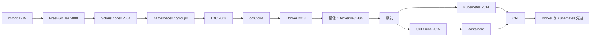
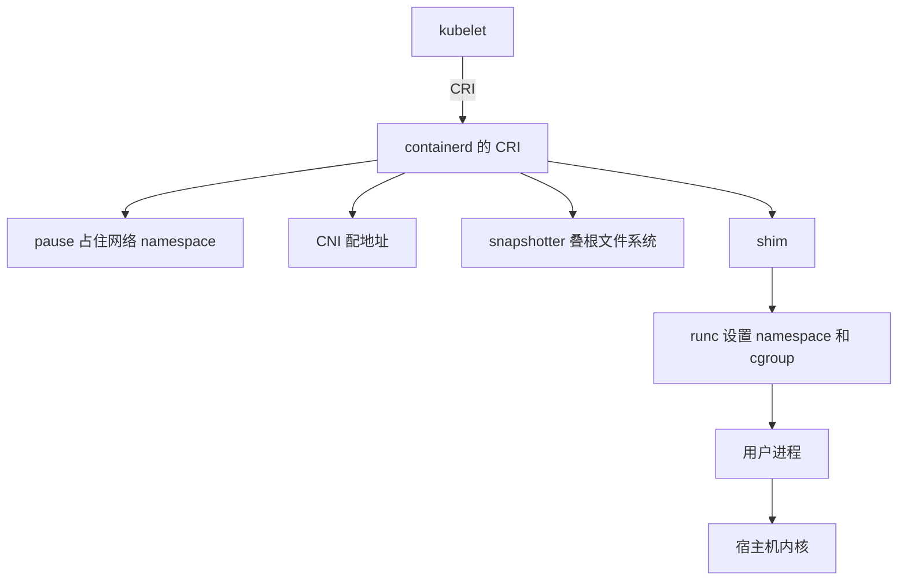

# Docker 与容器：从 chroot 到 Kubernetes，一只鲸鱼怎样改写了软件交付

2013 年 3 月 15 日，加利福尼亚圣克拉拉。Solomon Hykes 报了一个五分钟的闪电演讲，题目叫《The future of Linux Containers》。他以为台下大概三十个人。没人告诉他，PyCon 的闪电演讲是个大事。他走上台，下面坐了大约九百人（[Hykes 后来对 Business Insider 的回忆](https://www.businessinsider.com/docker-a-hugely-important-startup-2014-11)）。

他先道歉：这是他们第一次在办公室外演示，可能会当场炸掉。然后敲了几行命令。一个叫 Docker 的小守护进程从注册表里拉来一份文件系统，在里面跑 `echo hello world`。观众看到的不是内核标志，是一件更朴素的事：一份应用，连同它的库、配置和入口命令，被装进一个可以搬来搬去的箱子里。演讲视频至今还在（[The future of Linux Containers](https://www.youtube.com/watch?v=wW9CAH9nSLs)）。Docker 官方后来把这一天当成生日（[Nine Years YOUNG](https://www.docker.com/blog/docker-nine-years-young/)）。

台下很多人第一次听说 Linux 容器。台上这个人知道，自己演示的东西几乎没有一项是新发明。换根目录的系统调用已经三十四年了。FreeBSD 把进程关进 jail 十三年了。Sun 把类似的东西叫 Zone，还顺手给整个品类起了名字：container。Linux 内核用了十年来把隔离拆成一组互不相关的零件。Google 在自己的机房里用这些零件调度了将近十年。Hykes 的公司 dotCloud 自己也已经用它们跑了好几年的 PaaS。

新的是包装。他把零件收成一条人能记住的命令，再配上一套可以推、可以拉、可以分层复用的镜像。那一年 PaaS 没做成最重要的事，把 PaaS 底下那一层做成了。两年后 Google 把调度那一层开源出来，叫 Kubernetes。又过了几年，Docker 在编排上认输，把运行时拆开捐给基金会，公司本身也卖掉一半。今天你敲 `docker run`，底下已经不是 2013 年那个单体守护进程；镜像格式也不再归任何一家公司。可箱子这个单位留下来了。

这篇按时间顺序讲这个故事。技术细节放在它们登场的地方：先看 Unix 怎样一次只挡住一条路径，再看各家怎样把笼子越做越完整，然后是 Linux 为什么把同一件事拆成零件、Docker 怎样把零件变成产品，以及 Kubernetes 怎样把产品再拆开。一路上有命名的玩笑、一份被删掉的宣言、一场关于“是不是又一个 chroot”的嘲笑，还有一只被社区投票命名的鲸鱼。

## 1979：一次换根

Unix 第七版在 1979 年带来一批新系统调用，其中有一个叫 `chroot`：把当前进程及其子进程眼里的根目录，换成一棵子树。进了这棵树，进程按路径就走不出去。Bell Labs 当初拿它来测试发行和构建：把自己关进即将发布的目录树里，确认这棵树自给自足，不必依赖外面的头文件和工具（[Version 7 Unix](https://en.wikipedia.org/wiki/Version_7_Unix)，[chroot](https://en.wikipedia.org/wiki/Chroot)）。

后来流传一个更具体的版本：Bill Joy 在 1982 年 3 月 18 日把它加进 4.2BSD，好在 `/4.2BSD` 构建目录里编系统。这个日期来自 Marshall Kirk McKusick 对 SCCS 日志的回忆，被维基百科沿用了很多年。FreeBSD 的 Warner Losh 后来对着源码对了一遍：`chroot` 在 V7 里已经是系统调用 61，BSD 各版只是把同一段代码搬来搬去。Joy 没有发明它，他只是在 BSD 的文件树里挪过位置（[Whither chroot?](http://bsdimp.blogspot.com/2020/06/whither-chroot.html)）。

`chroot` 挡的是路径，不是权限。进程号还是全局的，网络还是全局的，设备节点还在，root 仍然是 root。一个常见的逃法是：先打开一个指向外面的目录文件描述符，或者在 jail 里再建一次 `chroot`，然后 `chdir("..")` 往上爬。手册后来写得很直白：超级用户可以用这种方式离开所谓的 chroot jail。它从来不是安全边界，只是一个构建和测试的便利。

可“jail”这个词已经贴上来了。1991 年，贝尔实验室的 Bill Cheswick 要对付一个荷兰入侵者，对方自称 Berferd。Cheswick 手头没有备用机器，就用 `chroot` 搭了一间假机房：拿走 `ps`、`who`、`netstat`，布置一批看起来诱人的文件，把会话日志留下来。他管这间屋子叫 Jail，也叫 roach motel，蟑螂旅馆：进去容易，出来难。本地的 Unix 高手告诉他，这东西并不完美，但只要拿掉编译器和若干程序，逃出去就很难。Berferd 在里面转了一圈，没怎么起疑。Cheswick 把这件事写成了[《An Evening with Berferd》](https://cheswick.com/ches/papers/berferd.pdf)。容器史前史里，“把入侵者关进一棵假的根目录”比“把客户的网站关进一棵假的根目录”还早几年。

## 2000：把万能的 root 关起来

真正把 jail 做成内核设施的，是 FreeBSD。

1990 年代末，托管商要把互不信任的客户塞进同一台机器。Unix 的安全模型很简单：你要么是 root，要么不是。给客户一个“虚拟主机”，就等于把一台机器上的超级用户能力交出去。细粒度的访问控制能补这个洞，但管理成本和实现复杂度一起涨。Poul-Henning Kamp 和 Robert Watson 选了另一条路：不要把 root 的能力拆细，而把 root 的作用域缩小。jail 里的 root 仍是 root，可它碰不到 jail 外的进程、文件和网络。论文题目就叫这个意思：[《Jails: Confining the omnipotent root》](https://papers.freebsd.org/2000/phk-jails/)。2000 年 5 月他们在荷兰马斯特里赫特的 SANE 会议上宣读，代码进了 FreeBSD 4.0。赞助来自一家叫 ServeTheWeb 的托管公司。

jail 在 `chroot` 上面加了三道墙：进程看不见外面的进程，网络栈被限制在指定地址上，特权操作的范围被裁到这个分区里。管理员仍用熟悉的 Unix 模型，只是“这台机器”变小了。最典型的客户是 ISP：一台物理服务器租给许多站点，每个站点有自己的 root 密码，重启自己的环境，不影响邻居。

同一时期，Linux 上走的是另一条路。1999 年 11 月，SWsoft 的 Alexander Tormasov 从新加坡回来，向 Sergey Beloussov 提出三件事：一组带命名空间隔离的进程、一套能共享代码和内存的文件系统、以及资源隔离。他们当时不叫容器，叫 Virtual Environment。2000 年夏天公开测试，一台机器上已经能跑出五千个环境。2002 年产品以 Virtuozzo 的名字上市。2005 年内核部分以 OpenVZ 的名字按 GPL 放出（[OpenVZ 项目史](https://wiki.openvz.org/History)）。并行的还有 Linux-VServer：Herbert Pötzl 等人从 2001 年起用安全上下文做资源分区，学术论文后来把它和 Solaris 10、Virtuozzo 并列，当作“容器式操作系统虚拟化”的代表，用来对比当时正热的 Xen 和 VMware（[2007 年的 VServer 论文](https://mirrors.sandino.net/vserver/doc/vserver-paper.pdf)）。

这些项目有一个共同的麻烦：它们带着大量内核补丁。LWN 在 2006 年写过，OpenVZ 一家就声称跑着三十万个虚拟环境，需求很真实；可内核社区不想为每一家的补丁开一个口子，容器这边必须先坐下来，把能共用的机制做成主线能收的形状（[Containers and lightweight virtualization](https://lwn.net/Articles/179361/)）。Linux 后来的 namespaces 和 cgroups，很大一部分就是这场“先标准化、再进主线”的产物。OpenVZ 团队自己也承认，上游内核不收他们的内核态 checkpoint/restore，他们只好改到用户态去做，这就是后来的 CRIU。Andrew Morton 和 Linus 当时的反应，被他们自己写成一句话：“Some crazy russians.”（[OpenVZ 十周年回顾](https://wiki.openvz.org/Leaflet)）

## 2004：Sun 给这个东西起了名字

2004 年 2 月 25 日，Sun 的工程师在新闻组上发了一封“Hello world”：Solaris Express 02/04 带来一种把单个 Solaris 实例切成多个隔离应用环境的办法，叫 zones。每个 zone 可以单独管理、跑独立的应用。一个 zone 里的进程发不了信号给另一个 zone，就算两边的 uid 碰巧相同。路由表、运行级别、大部分物理设备，普通 zone 碰不到。全权在 global zone 手里（[Introducing Solaris Zones](https://www.filibeto.org/~aduritz/truetrue/solaris10/zones-intro.html)）。

市场部给它套上了当时 Sun 的网格品牌：N1 Grid Containers，等于 Solaris 10 的资源管理加上 Zones。内部还用过一个更硬的代号，Project Kevlar。Sun 的人说，一台机器平均大约跑 20 个 zone，理论上可以到四千；每个 zone 有自己的 IP，看起来像一台独立的机器。工程师 Andy Tucker 承认，想法有一部分来自 FreeBSD 的 Jails（[Internet News 对 Tucker 的采访](https://www.internetnews.com/developer/sun-aggressive-on-open-source-solaris/)）。2004 年 11 月的 USENIX LISA 上有正式论文，2005 年 Solaris 10 正式发布。

container 这个词从此有了商业含义：不是虚拟机，是共享内核上的隔离环境。虚拟机模拟一整台电脑，每台一份内核；zone 和 jail 共享内核，省的是内存、启动时间和密度。Sun 的营销口径很直白：数据中心里机器平均只用了大约百分之十的容量，分区是为了把闲置的 CPU 卖出去。

Linux 这时还没有等价物。它有的是一组正在往主线里挤的零件。

## 2002–2013：Linux 把笼子拆成零件

2002 年，2.4.19 内核带上了第一种 namespace。Al Viro 做的是挂载命名空间：进程可以有自己的挂载表，`mount` 和 `umount` 不再改全局的那一份。标志位叫 `CLONE_NEWNS`，New Namespace。因为是第一种，名字里没写 mount，这个省略后来成了历史文物（[Linux namespaces](https://en.wikipedia.org/wiki/Linux_namespaces)，[LWN 的 namespaces 综述](https://lwn.net/Articles/531114/)）。

其余几种是一个一个加上来的：

| 种类 | 标志 | 大致就绪 | 它隔开的是什么 |
| --- | --- | --- | --- |
| mount | `CLONE_NEWNS` | 2.4.19（2002） | 挂载表 |
| UTS | `CLONE_NEWUTS` | 2.6.19（2006） | 主机名和 NIS 域名 |
| IPC | `CLONE_NEWIPC` | 2.6.19（2006） | System V IPC 和 POSIX 消息队列 |
| PID | `CLONE_NEWPID` | 2.6.24（2008） | 进程号。容器里可以有自己的 PID 1 |
| network | `CLONE_NEWNET` | 约 2.6.29（2009） | 网卡、地址、路由、端口 |
| user | `CLONE_NEWUSER` | 3.8（2013 年 2 月） | uid/gid。里面的 root 可以是外面的普通用户 |
| cgroup | `CLONE_NEWCGROUP` | 4.6（2016） | 进程看到的 cgroup 文件系统 |

没有一个系统调用叫“创建容器”。用户态做的是：`clone` 时带上一组 `CLONE_NEW*`，把进程写进某个 cgroup，`pivot_root` 换根，丢掉不需要的 capability，装上 seccomp，最后 `exec` 用户的程序。调度它的仍是宿主机内核。容器里 `uname -r` 打出来的，是底下那台 Linux 的版本。

PID namespace 的意义超出了“数字可以重复”。容器里终于可以有自己的 1 号进程，收养孤儿、收割僵尸，看起来像一台小机器。网络 namespace 让两套环境可以各开一个 80 端口。user namespace 最晚，也最关键：Eric Biederman 等人做了多年，到 3.8 才算完整。它让“无特权容器”在纸面上成立——里面 uid 0，外面只是普通用户。功能进了内核，发行版默认配置却长期不敢开，漏洞和缺角够多。rootless 要到多年以后才变成 Docker 和 Podman 的一种正式跑法。Docker 公开演示，几乎就在 3.8 发布的同一个春天。

资源限制是另一条线。Google 要把上万个任务塞进同一台 Linux，不能让一个任务把内存吃光。2006 年 Rohit Seth 先送了一套基于 configfs 的容器补丁。Paul Menage 接着把 cpusets 里已经成熟的进程分组代码抽出来，做成通用框架，最初仍叫 process containers（[Generic Process Containers](https://lwn.net/Articles/205575/)）。2007 年秋天改名。Menage 在补丁说明里写，最近讨论认为“container”太泛，这套代码只是容器方案的一部分，远不是全部，所以改叫 control groups，简称 cgroups（[Rename Task Containers to Control Groups](https://lwn.net/Articles/250280/)）。Jonathan Corbet 在 [Notes from a container](https://lwn.net/Articles/256389/) 里记下了这次更名，以及它随 2.6.24 进主线的事实。2.6.24 是 2008 年 1 月发布的。

cgroup 不改变进程看见的世界，只决定这个组能用多少 CPU、多少内存、多少进程。管理接口是一个虚拟文件系统：建目录就是建组，把 PID 写进 `tasks` 文件就把进程放进去。systemd 后来拿它给服务记账，容器运行时拿它给箱子限额，两边抢的是同一种内核对象。

把这些零件收成一个用户态对象的，是 LXC。IBM 的 Daniel Lezcano 在 2008 年 8 月提交了初始版本，10 月 10 日在内核邮件列表上宣布这套用户态工具（[container userspace tools](https://lkml.indiana.edu/0810.1/0956.html)）。README 写得很清楚：内核这边用 cgroup 管资源、用 namespace 做隔离，LXC 的目标是给内核开发者一个好用的试验台，尤其是当时还在推进的 checkpoint/restart，同时也能拿来跑虚拟专用服务器或隔离的 bash。它是库加命令行，不需要守护进程。Canonical 后来接手维护，再在上面做出面向系统容器的 LXD。LXC 比 Docker 早五年，Docker 的第一版执行还委托给它（[LXC and LXD: a different container story](https://lwn.net/Articles/907613/)）。

零件齐了，产品还没有。缺的不是隔离，是一份可以搬动的文件系统，加上一条普通人愿意敲的命令。

## 2003–2013：Google 已经在用，只是不对外说

Linux 社区还在为补丁该不该进主线吵架的时候，Google 已经把容器当成机房的基本单位。

大约 2003 到 2004 年，Google 做出了第一套统一的容器管理系统，内部叫 Borg，名字来自《星际迷航》里那个集体意识的种族。它要在成千上万台机器上跑几十万个作业，把面向用户的服务和吃 CPU 的批处理混在一起，把利用率压上去。后来又有了 Omega。Google 给内核贡献过不少容器相关的代码，cgroup 那条线就是从它的机房里长出来的（[Borg, Omega, and Kubernetes](https://queue.acm.org/detail.cfm?id=2898444)）。

对外，这件事几乎不谈。2013 年夏天，Craig McLuckie、Joe Beda 和 Brendan Burns 走进 Urs Hölzle 的房间，提议做一个开源的容器管理系统。McLuckie 后来记下了对方的反应，大意是：所以你们想做一套对外的 Borg 任务调度器。这是我们最重要的竞争优势之一。我们对外提都不提。然后你们还想把它开源？（[How Kubernetes came to be](https://cloud.google.com/blog/products/containers-kubernetes/from-google-to-the-world-the-kubernetes-origin-story)）

提案一开始没通过。转折发生在一趟班车上。McLuckie 坐到 Eric Brewer 旁边，有一整段不被打断的时间把道理讲完。Brendan Burns 后来说，他们看到 Docker 把单个容器做成人人能用的东西，认定开源的集群调度不只是有用，而是不可避免。内部代号沿用 Borg 梗，叫 Project Seven of Nine，七号九号，取自《星际迷航：航海家号》里那个从 Borg 集体里走出来、变得友善的角色。三个月后他们有了原型。Kubernetes 的 logo 是一个七角的舵轮，就是为了记住这个名字（[GeekWire 对命名的采访](https://www.geekwire.com/2016/ever-come-kooky-kubernetes-name-heptio/)）。

2013 年 10 月，Google 还把内部容器栈的一部分开源了，项目名是 lmctfy，Let Me Contain That For You。它基于 cgroup，允许应用自己感知容器、再建子容器。不到两年，Google 宣布不再积极开发，核心概念往 Docker 的 libcontainer 里搬（[lmctfy README](https://github.com/google/lmctfy)）。这是一个信号：连 Google 都觉得，对外的那一层，不必再自己做一套。

## 2008–2013：PaaS 底下那一层

Hykes 的故事比闪电演讲早五年。他后来对外说，2008 年在母亲巴黎的地下室里开始做这件事，当时觉得大概只有少数几个人会在意（[Business Insider](https://www.businessinsider.com/docker-a-hugely-important-startup-2014-11)）。2010 年公司以 dotCloud 的名字进了 Y Combinator，卖的是多语言 PaaS：你把应用交上去，平台在同一台机器上替很多客户起服务。

底下的引擎一开始是一份 Python 脚本，用 OpenVZ，后来换成 LXC，文件系统用 AUFS。AUFS 是联合挂载：多层只读的文件系统叠在一起，最上面加一层可写的。读的时候往下穿透到没改过的层；改一个已有文件，通常先把整个文件复制到上层再改。所以“改了几个字节”可能多占一份文件的空间。对 PaaS 来说这很合适：基础镜像大家共享，每个应用只保存自己改过的那一层。AUFS 从未进入内核主线，Ubuntu 带着它，Red Hat 的政策是上游优先，不收这段补丁。这个分歧几年后会变成 Docker 在企业发行版上的第一块石头（[Red Hat 对存储驱动的回顾](https://developers.redhat.com/blog/2014/09/30/overview-storage-scalability-docker)）。

到 2012 年底，这份引擎已经拆成大约十个 Python 组件，周围还有大约一百个微服务。团队决定重写，项目代号 Docker。2013 年 3 月，他们把它按 Apache 2.0 开源，并在 PyCon 上提前看了一眼（[2016 年 PyCon 教程讲义里的时间线](https://pycon-archive.python.org/2016/site_media/media/tutorial_handouts/DockerSlides.pdf)）。dotCloud 的 PaaS 没能打赢 Heroku，2014 年这块业务被卖掉。公司改名 Docker, Inc.。

早期 README 里有一份[《Standard Container manifesto》](https://github.com/moby/moby/commit/0db56e6c519b19ec16c6fbd12e3cee7dfa6018c5)。它把软件箱子直接比成航运集装箱：无论里面是越南咖啡粉还是玛莎拉蒂零件，吊装、堆叠、上锁、装卸的动作都一样。标准容器也应该内容无关：启动、停止、复制、做快照、上传下载、打标签，不因里面是 Postgres 还是 Java 构建产物而改变。这份宣言后来被删掉，删掉本身会变成一场争吵的证据。

## 2013：Docker 真正卖掉的是什么

先把故事停一下，看清楚 PyCon 上那几条命令背后多出来的东西。LXC 已经能起一个隔离的进程。Docker 多出来的是三件可以搬动的东西：镜像、配方、仓库。

镜像是一层层只读的文件系统变更，加上一份配置：入口命令、环境变量、暴露的端口、工作目录。每一层有一个按内容计算的摘要。两个镜像如果从同一份基础系统长出来，公共的层在磁盘上只存一份，在网络上也只拉一次。这就是联合挂载在分发上的意义。容器跑起来时，在只读层上面再加一层可写的。数据库不该放在这层里，重启或换机器，可写层就没了。持久的东西走卷，或者走镜像外的数据库。

配方是 Dockerfile。一份文本，从上到下：从哪个基础镜像开始，装哪些包，拷哪些文件，最后进程听哪个端口、跑哪条命令。它把“这台机器是怎么装出来的”从口头知识和 wiki 页面，收成可以进版本库的文件。同一份 Dockerfile 在开发笔记本上能 build，在 CI 里也能 build，产出的摘要应当一样。做不到完全可复现的地方很多，`apt-get` 的时间、基础镜像的浮动标签，都会让层的哈希变掉。可方向已经变了：环境不再是一台被手工喂了三年的服务器，而是一份可以重建的清单。

仓库是 Registry。按 HTTP 存这些层，按名字和标签取。Docker 自己跑的那份后来叫 Docker Hub。`docker pull ubuntu` 能成立，是因为有一个默认的中心，大家把常用的基础系统推上去。中心一旦成为默认，它就既是便利，也是单点：速率、审查、商业条款，以后都会变成政策。

执行那一层，2013 年还委托给 LXC。2014 年 3 月 10 日的 Docker 0.9 换了默认。Hykes 在[发布说明](https://www.docker.com/blog/docker-0-9-introducing-execution-drivers-and-libcontainer/)里写，他们做了一个纯 Go 的库 libcontainer，直接操作 namespace、cgroup、capability、AppArmor、网卡和防火墙规则，不再依赖 LXC 这个用户态包。LXC 在不同发行版上的行为不完全一样，Docker 要的是一个库，能在 Go 里精确控制，并且行为一致。libcontainer 就是后来的 runc。同一篇文章还画了一张很大的饼：执行驱动接口理论上可以接 OpenVZ、systemd-nspawn、BSD Jails、Solaris Zones，甚至老式 chroot。这些驱动大多数没有真正成为产品。许诺的可插拔，和后来社区指责的单体化，从一开始就并排写在同一份公告里。

Logo 是另一场小竞赛。dotCloud 改名时，设计师 Thatcher 在 99designs 上办了一次征集，印尼设计师 Ricky Asamanis 画的那只蓝鲸鱼赢了：背上叠着几排集装箱，半沉在水里，尾巴上扬（[Hykes 在 Kubelist 播客里的回忆](https://www.heavybit.com/library/podcasts/the-kubelist-podcast/ep-36-the-docker-story-with-solomon-hykes)）。2013 年 9 月社区投票给它起名字，411 票，选中的是 Moby Dock（[Call me Moby Dock](https://www.docker.com/blog/call-me-moby-dock/)）。航运集装箱的比喻，从此有了一张脸。

## 2013–2014：爆发

开源之后的十五个月，速度很快。Ubuntu 把它收进 14.04。Red Hat 宣布 RHEL 7 会带上它。CoreOS 做了一个几乎只为跑容器而存在的发行版。微软开始谈 Windows 上的容器。Hykes 原计划小范围找朋友看，结果变成行业默认话题。

嘲笑也来得很快。懂内核的人说，这不就是个带了 cgroup 的 chroot 吗，LXC 早就有了。这话在技术上不算错。Docker 没发明隔离，它发明的是一种分发单位。虚拟机社区则从另一个方向看：共享内核谈不上隔离，一个内核漏洞就能从箱子里走到宿主机。这两种批评以后会反复出现，并且都对。Docker 的回答不是“我们更安全”，而是“我们更好搬”。Build, Ship, Run 这三件事，针对的是把应用从开发笔记本搬到测试、再搬到生产时，环境每次都不一样的那个老问题。

2014 年 6 月 9 日，第一届 DockerCon 在旧金山开幕。Docker 1.0 发布，公司宣布可以提供企业支持，并正式推出 Docker Hub（[TechCrunch 的现场报道](https://techcrunch.com/2014/06/09/docker-inc-launches-release-1-0-dockercon14/)）。同一周，Google 的 Eric Brewer 在 DockerCon 的主题演讲里宣布了 Kubernetes，并在博客上写了一篇配套文章：基于 Google 自己跑 Linux 容器的经验，他们知道在互联网规模上调度容器有多重要；内部用 Omega，外面的人需要更瘦的东西，所以开源一个容器管理器，希腊语里是舵手、船上的舵工（[An update on container support on Google Cloud Platform](https://opensource.googleblog.com/2014/06/an-update-on-container-support-on.html)，[Kubernetes 十年回顾](https://kubernetes.io/blog/2024/06/06/10-years-of-kubernetes/)）。第一笔提交在 6 月 6 日，Joe Beda 推上去，250 个文件，四万七千行。Google 同时放出了 cAdvisor，并提名工程师进入 Docker 的治理结构。表面上，这是拥抱。实际上，调度这一层 Google 不打算交给 Docker 公司。

一个月后，Docker 买下了伦敦的两人公司 Orchard Labs。他们的产品 Fig 用一份 YAML 描述一组容器之间的关系，一条命令把应用需要的进程、网络和存储一起拉起来。Docker 看中的是这个，不是 Orchard 的托管服务。后者很快停掉。Fig 后来改名 Docker Compose。Ben Firshman 和 Aanand Prasad 留在伦敦，成了 Docker 的欧洲据点（[收购公告](https://devops.com/docker-acquires-orchard-extend-platform-leadership/)）。公司一边说自己是可组合的单元，一边开始把生态收进自己的产品线。InfoQ 当时的评论已经点破了这层：[Docker has begun the digestion of its own ecosystem](https://www.infoq.com/news/2014/07/docker-acquires-orchard/)。

## 2014 年 12 月：宣言被撕掉

CoreOS 曾经是 Docker 最紧密的伙伴之一。CTO Brandon Philips 是 Docker 的重要贡献者，还坐在治理委员会里。CoreOS 自己的发行版几乎是为 Docker 容器准备的。

2014 年 12 月 1 日，CEO Alex Polvi 发文宣布自研运行时 Rocket，后来改名 rkt。文章写得很冲。他说 2013 年 Docker 仓库里那份标准容器宣言是一声集合令，他们立刻跟上；但事情没有按“一个可组合的简单部件”发展。Docker 正在变成一个平台：建镜像、跑镜像、上传下载、启动云服务器、做集群，以后还要做 overlay 网络，全部编译进一个主要以 root 跑着的巨大二进制。那份宣言被删掉了。从安全和可组合性看，一切都经过一个中心守护进程的模型是从根本上坏掉的，要修就得重写（[CoreOS 原文，存档](https://web.archive.org/web/20190401013449/coreos.com/blog/rocket.html)，[LWN 的报道](https://lwn.net/Articles/624349/)）。

rkt 按一份新的 App Container 规范（appc）跑，镜像叫 ACI，可以签名，可以通过 BitTorrent 之类的渠道分发。进程模型是命令行，不是守护进程。CoreOS 同时说自己会继续支持 Docker。这是一种很特别的决裂：一边继续装 Docker，一边另起一套标准。

Hykes 在 Hacker News 上亲自回了（[原帖](https://news.ycombinator.com/item?id=8683705)）。他说了三件事：竞争总是好的；面向应用和开发者的接口必须标准化，而且要狠，防止碎片化；Docker 的原则是 batteries included but removable，电池附带，但可以拆走。默认实现要够好，覆盖百分之八十的情况，同时允许换掉。他承认镜像格式确实该有更好的规范，也承认应该能单独使用运行时或单独使用打包系统。他觉得这些事更该在人人已经在用的 Docker 上做，而不是再分叉一套。他记得曾经当面找他们帮过忙。

“batteries included but removable”后来成了 Docker 公司最常引用的自我辩解。2014 年 12 月宣布 Swarm 时，Hykes 又说了一遍：目标不是做出一个包办所有人的集群方案，而是给一个开箱即用、足够甜的默认实现，然后让你把后端换成自己喜欢的那个（[The Register](https://www.theregister.com/2014/12/04/docker_orchestration_services/)）。批评者看到的是另一面：默认实现一旦够甜，可拆走就变成了理论上的。守护进程以 root 跑、API 不稳定、范围不断扩大，这些抱怨并没有因为一句座右铭消失。

## 2015：把箱子交出去

分叉的压力起了作用。2015 年 6 月 22 日，Docker、CoreOS、Google、红帽、IBM、微软、亚马逊等二十多家在 Linux 基金会下成立 Open Container Project，很快改名 Open Container Initiative。Docker 捐出当时的容器格式和运行时实现 runC，也就是 libcontainer 换了个名字。appc 的维护者 Brandon Philips 和红帽的 Vincent Batts 进入维护组。LWN 写得很客气：表面上是制定标准，幕后显然也是在缝合 Docker 和 CoreOS 之间那道裂口（[The Open Container Project is born](https://lwn.net/Articles/649194/)，[OCI 概述](https://opencontainers.org/about/overview/)）。

OCI 最后留下三份规范：镜像长什么样，注册表怎么传，运行时拿到一个 bundle 之后怎么把进程拉起来。bundle 不是注册表里的镜像，是一个 `config.json` 加上它指向的根文件系统。拉取、解包、叠层，不归 runc。runc 把 namespace 和 cgroup 设完、`exec` 掉用户程序之后就可以退出。活着的是用户进程。所以在宿主机上找不到一个一直叫 runc 的进程，并不表示容器没在用 runc。

appc 到 2016 年底不再积极开发。CoreOS 后来被红帽收购，rkt 停了。格式之争的赢家是 OCI。这不是 Docker 赢了 CoreOS，是两边都把“箱子长什么样”交了出去。

一个月后的 7 月 21 日，Kubernetes 发 1.0。Google 同时宣布，把它捐给 Linux 基金会新成立的分支 Cloud Native Computing Foundation。CNCF 的起始项目就是 Kubernetes。红帽从很早就是主要贡献者。Google 有 Borg 的经验，红帽有把软件送进企业发行版的经验。编排这一层的中心，从一开始就没有设在 Docker 公司里。

## 2015–2017：一个守护进程包办一切的代价

Docker 早期是一个进程。它拉镜像、管网络、建容器，还握住容器的标准输入输出。守护进程一重启，这些管子断了，容器跟着没。用户抱怨的就是这个：升级引擎，等于把上面的服务重启一遍。

2015 年 12 月，Docker 拆出 containerd，一个专门管 runc 的守护进程。2016 年 4 月 13 日的 Engine 1.11 把这套做成默认。官方说明写得很直：引擎现在建在 containerd 和 runc 上，引擎重启时容器可以继续跑（[Docker Engine 1.11 与 runc](https://www.docker.com/blog/docker-engine-1-11-runc/)）。做到这一点的是 shim。容器旁边有一个小进程，握住标准输入输出，负责收割退出的子进程。dockerd 或 containerd 挂了，shim 还在，容器的 PID 1 还在。管理进程再起来，通过 shim 把状态接回去。

这次拆分还有一层用意。执行器换成别人写的，只要它按同一份 OCI 规范读 bundle，Docker 引擎不用改。后来 gVisor 的 `runsc`、Kata 的运行时，都是从这道缝里插进去的。

Kubernetes 这边也在拆。早期 kubelet 直接调用 Docker。Docker 的 API 是给人用的：镜像名、端口映射、容器名。Kubernetes 要的是另一组动作：先建一个 Pod 沙箱，再在沙箱里起业务容器，沙箱死了整组一起收。每接一种新运行时，就要改 kubelet 的代码。2016 年 12 月，Kubernetes 1.5 引入 CRI，一套 gRPC（[Introducing CRI](https://kubernetes.io/blog/2016/12/container-runtime-interface-cri-in-kubernetes/)）。kubelet 当客户端。当时是 alpha，默认仍走老路径。内置了一个 dockershim，替 Docker 把 CRI 翻译成 Docker API，因为 Docker 引擎自己不说 CRI。维护者后来承认，这层垫片从来不是永久方案。

红帽做了 CRI-O，只实现 Kubernetes 要的那一截：镜像、存储、一个 OCI 运行时、监控。它不打算成为第二个 Docker。containerd 后来自己带了 CRI 插件，kubelet 可以跳过 dockerd。节点上少一个守护进程，也少一层翻译。

编排产品上，Docker 押的是 Swarm。2016 年的 Swarm mode 把集群能力做进了引擎，`docker stack deploy` 能读 Compose 文件。卖点是简单：同一条命令行，从单机到集群。Kubernetes 更重，概念更多，Pod、Service、Ingress、Controller，每一层都要学。2016 到 2017 年，市场上的故事是“Swarm 简单、Kubernetes 强大，胜负未分”。云厂商、红帽、CoreOS、VMware 却已经把发行版和托管服务压在 Kubernetes 上。简单是给开发者的，订单是给调度器的。

2017 年 4 月的 DockerCon 上，Hykes 宣布 Moby Project：把 Docker 的开源组装从产品里分开，类比 Fedora 和 RHEL。本意是让社区贡献的边界变清楚。效果是许多人搞不清自己装的到底叫 Docker 还是 Moby，GitHub 仓库从 docker/docker 改成 moby/moby，星标还在，名字已经漂了（[What is Docker’s Moby Project?](https://www.linux.com/news/what-dockers-moby-project/)）。

2017 年 10 月 17 日，哥本哈根，DockerCon EU。Hykes 在主题演讲里说，下一个版本的 Docker 将同时支持两个编排器，Swarm 和 Kubernetes。台下鼓掌。他强调：不是分叉，不是包装，不是半吊子的 shim，是完整的 Kubernetes 坐在完整的 Swarm 旁边（[eWeek](https://www.eweek.com/enterprise-apps/docker-opens-up-to-support-kubernetes-container-orchestration/)，[RedMonk 的评论](https://redmonk.com/jgovernor/docker-gets-pragmatic-embraces-kubernetes/)）。会后他说，编排会变成商品，真正还重要的只剩两个，时间长了没人会在乎谁赢。这句话后半句很快就被证伪。人们非常在乎。Kubernetes 赢了。

同月稍早，containerd 被 CNCF 接收为孵化项目。Hykes 的口径是：让它容易嵌进更高层的系统，加速跨项目合作（[containerd joins CNCF](https://www.cncf.io/announcements/2017/03/29/containerd-joins-cloud-native-computing-foundation/)）。Docker 公司把运行时交出去，把编排让出来，手里还剩下开发者体验、Hub，以及一份正在转向企业订阅的生意。

## 2018–2019：创始人离开，公司一分为二

2018 年 3 月 28 日，Hykes 34 岁生日。他发了一篇[《Au revoir》](https://www.docker.com/blog/au-revoir/)，宣布不再参与日常运营，留在董事会，做股东，做“高维护成本的 Docker 用户”。他说创始人离开通常被写成戏剧，这次 sadly 没那么热闹。公司已经在新 CEO Steve Singh 手里变成一门企业生意。他的下一份工作是帮公司找一个更懂大型企业的 CTO，然后别挡路。

同一年，红帽把 Podman 从 CRI-O 的调试工具里独立出来。Daniel Walsh 写过为什么需要它：管理员在 Kubernetes 节点上排障时，过去只能靠 Docker CLI 看“引擎眼里”的世界；CRI-O 若是卡住了，这条路也断。Podman 不经过守护进程，命令直接操作存储和 OCI 运行时，进程是它的子进程，不是某个 root 服务的客户（[Introducing podman](https://medium.com/cri-o/introducing-kpod-f06109b96374)，[Reintroduction of Podman](https://projectatomic.io/blog/2018/02/reintroduction-podman/)）。2019 年 1 月的 1.0 把 Docker 兼容的命令行、rootless 和 pod 作为卖点。CoreOS 在 2014 年骂过的那个中心守护进程模型，红帽用 Unix 的 fork/exec 传统给了一条退路。

2019 年 2 月，runc 的漏洞 CVE-2019-5736 提醒所有人，共享内核的边界有多薄。容器里的 root 可以打开 `/proc/self/exe`。在 runc 还没 `exec` 完的窗口里，这个路径指向宿主机上的 runc 二进制。容器里把它覆盖掉，下一次宿主机上任何人跑 runc，跑的就是被换过的程序。修补是让 runc 先把自己复制到内存文件再执行，使 `/proc/self/exe` 不再指向磁盘上的那个二进制。隔离从内核退回到“路径碰巧没指错”的时候，容器里的 root 就不只是容器里的 root。

2019 年 11 月 13 日，Mirantis 买下 Docker 的企业平台业务：引擎的企业版、Trusted Registry、Universal Control Plane、大约三百名员工、大约七百五十家企业客户。条款保密。Docker 公司留下 Desktop 和 Hub，转向开发者工具（[Mirantis 收购公告](https://www.mirantis.com/company/press-center/company-news/mirantis-acquires-docker-enterprise/)）。六年前那个要把整个软件交付栈收进一家公司的计划，在商业上走到了头。企业那一头跟 Kubernetes 走了；开发者这一头，`docker build` 和那只鲸鱼还在。

## 2020–2022：Kubernetes 拆掉最后一根焊线

2020 年 11 月，Docker Hub 开始限制拉取次数。未登录用户每六小时 100 次，免费登录用户 200 次。Hub 当时号称七百万用户、每月超过一百亿次拉取。一家已经卖掉企业业务的公司，养不起无限的公共 CDN（[Nigel Poulton 的说明](https://www.nigelpoulton.com/post/container-registries-state-of-the-union)）。CI 流水线里那些匿名的 `docker pull`，突然变成了故障。云厂商发通告，让大家改用自己的镜像仓库，或者至少登录。默认中心变成了计费点。这件事在技术上不惊人，在心理上很像一次醒来：2013 年那个“谁都可以推、谁都可以拉”的广场，从来不是公共基础设施，只是一家公司的产品。

2020 年 12 月，Kubernetes 1.20 宣布弃用 dockershim。社区的即时理解是“Kubernetes 不用 Docker 了”。镜像其实无关。Docker 打出来的镜像只要符合 OCI，containerd 和 CRI-O 都能跑。删掉的是 kubelet 里那段专门迁就 Docker 引擎的代码。维护者在事后的回顾里承认，当时没把“引擎”和“镜像”说清楚，恐慌有一部分是自己造成的（[Dockershim: The Historical Context](https://kubernetes.io/blog/2022/05/03/dockershim-historical-context/)）。2022 年 5 月，1.24 拿掉 dockershim。还想用 Docker 引擎当节点运行时的，用外部的 cri-dockerd，那是 Docker 和 Mirantis 把同一段代码接在进程外面继续维护。

到这里，用户最初指定的那条线走完了：

一次 Pod 启动，在今天的 containerd 节点上，已经看不到 dockerd：

人在开发机上看到的仍是 2013 年那条命令。生产节点上跑的，是 2016 年拆开、2017 年捐出去、2022 年彻底焊开的那套。

## 还没吵完的那些问题

共享内核这件事，从 Cheswick 的蟑螂旅馆到 CVE-2019-5736，没有变过。容器不是虚拟机。它更快、更密、启动像起一个进程，代价是攻击面是整份宿主机内核。user namespace、seccomp、capability 丢掉、AppArmor 或 SELinux，都是在这个前提下加厚的窗帘。窗帘不是墙。需要墙的地方，后来出现了 gVisor 这种拦截系统调用的用户态内核，以及 Kata、Firecracker 这种轻量虚拟机。它们接在 OCI 那道缝上，说明 2015 年把运行时标准化，比当时看起来更有用。

镜像供应链是另一场持续的火灾。`latest` 标签会动。基础镜像里的系统库会过期。Hub 上曾经出现过挖矿镜像、后门镜像，名字起得像官方。签名和策略一直有，Notary、后来的 Sigstore 和各云厂商的准入控制器，用的人比该用的人少。Dockerfile 让构建变得可检查，并不自动让产物可信。2013 年那套“先推到公共仓库再说”的便利，和后来软件供应的严肃性，从一开始就拧着。

还有一层用词上的混乱，至今还在。Docker 是一种工具。OCI 镜像是一种格式。containerd 是一种节点上的管理进程。runc 是一次启动。Kubernetes 是一种调度。人们口头上都说“跑在 Docker 里”，可能指其中任何一层。2020 年 dockershim 的恐慌，就是这层混乱的一次集中发作。CoreOS 在 2014 年要求的那件事——不要把一种实现的名字当成整个品类的名字——花了六年才勉强分开。

Docker Desktop 后来对大型商业组织收费，Hub 继续收紧匿名拉取。开发者工具做成生意，并不丢人。丢人的是 2014 年那种口气：整个软件交付栈会收进一家公司、一种守护进程、一条命令行。社区用 OCI、CNCF、Podman、CRI-O 和无数个兼容镜像的仓库，把这个口气顶了回去。Hykes 自己的那句 batteries included but removable，最后是社区替他把电池拆走的。

## 尾声

航运集装箱改写的不是船，是码头、起重机、火车和海关的接口。Docker 改写的也不是内核。namespaces 和 cgroups 在它出现之前就在，虚拟机在它出现之后也还在。它改写的是开发者脑子里那份“一份应用该怎样打包、怎样交给别人跑”的默认假设。

这个假设能成立，是因为前面四十年有人把根目录换掉、把 root 关进 jail、把 zone 做成产品、把 Linux 的隔离拆成可以组合的零件。Docker 赶上的是零件刚好齐、PaaS 刚好证明同一台机器上能塞许多客户、而 Google 刚好愿意把调度经验写成开源软件的那个窗口。Hykes 在九百人面前敲的那几行命令，是窗口的形状，不是窗口的原因。

编排之争他输了。箱子这个单位他赢了。今天生产环境里调度箱子的是 Kubernetes，节点上执行的是 containerd 或 CRI-O 加一个 OCI 运行时，开发笔记本上很多人仍然先写 Dockerfile，仍然先敲 `docker compose up`。三种角色不再属于同一家公司，甚至不再属于同一个基金会。这大概是这份技术史里最干净的结局：标准落在箱子上，产品落在各自该在的层上。

至于那只鲸鱼，它还在。背上的集装箱比 2013 年画的那几只要多，也要标准得多。

## 参考

- Warner Losh，[Whither chroot?](http://bsdimp.blogspot.com/2020/06/whither-chroot.html)，2020。纠正“Bill Joy 发明 chroot”的说法，对 V7 与 BSD 源码的核对。
- [chroot](https://en.wikipedia.org/wiki/Chroot)，[Version 7 Unix](https://en.wikipedia.org/wiki/Version_7_Unix)。
- Bill Cheswick，[An Evening with Berferd](https://cheswick.com/ches/papers/berferd.pdf)，1992。chroot jail / roach motel。
- Poul-Henning Kamp、Robert N. M. Watson，[Jails: Confining the omnipotent root](https://papers.freebsd.org/2000/phk-jails/)，SANE 2000。论文 PDF：[phk.freebsd.dk](https://phk.freebsd.dk/pubs/sane2000-jail.pdf)。
- [OpenVZ History](https://wiki.openvz.org/History)，[十周年 Leaflet](https://wiki.openvz.org/Leaflet)。Virtuozzo 1999 年起的时间线，以及 CRIU 的“crazy russians”。
- LWN，[Containers and lightweight virtualization](https://lwn.net/Articles/179361/)，2006。主线内核为什么不肯直接收各家容器补丁。
- Linux-VServer 论文，[Container-based Operating System Virtualization](https://mirrors.sandino.net/vserver/doc/vserver-paper.pdf)，2007。
- [Introducing Solaris Zones](https://www.filibeto.org/~aduritz/truetrue/solaris10/zones-intro.html)，2004-02-25。Solaris Express 上的宣布。
- Internet News，[Sun 'Aggressive' on Open Source Solaris](https://www.internetnews.com/developer/sun-aggressive-on-open-source-solaris/)。Andy Tucker 谈 Zones 与 FreeBSD Jails 的关系、Project Kevlar。
- InfoWorld，[Sun to boost partitioning in Solaris 10](https://www.infoworld.com/article/2202151/sun-to-boost-partitioning-in-solaris-10.html)，2004-02。N1 Grid Containers。
- LWN，[Namespaces in operation, part 1](https://lwn.net/Articles/531114/)，Michael Kerrisk，2013。七种 namespace 的时间与用途。
- [Linux namespaces](https://en.wikipedia.org/wiki/Linux_namespaces)。
- Paul Menage，[Generic Process Containers](https://lwn.net/Articles/205575/)，2006-10；[Rename Task Containers to Control Groups](https://lwn.net/Articles/250280/)，2007-09。
- Jonathan Corbet，[Notes from a container](https://lwn.net/Articles/256389/)，2007-10。cgroup 更名并进入 2.6.24。
- [cgroups(7)](https://man7.org/linux/man-pages/man7/cgroups.7.html)。
- Daniel Lezcano，[container userspace tools](https://lkml.indiana.edu/0810.1/0956.html)，LKML，2008-10-10。LXC 的公开宣布。
- LWN，[LXC and LXD: a different container story](https://lwn.net/Articles/907613/)，2022。
- Brendan Burns 等，[Borg, Omega, and Kubernetes](https://queue.acm.org/detail.cfm?id=2898444)，ACM Queue，2016。
- Craig McLuckie，[How Kubernetes came to be](https://cloud.google.com/blog/products/containers-kubernetes/from-google-to-the-world-the-kubernetes-origin-story)，2016-07-22。Urs Hölzle 的会议、班车上的 Eric Brewer、Project Seven of Nine。
- GeekWire，[How did they ever come up with that kooky Kubernetes name?](https://www.geekwire.com/2016/ever-come-kooky-kubernetes-name-heptio/)，2016。
- [google/lmctfy](https://github.com/google/lmctfy)。Let Me Contain That For You，以及迁往 libcontainer 的声明。
- Business Insider，[Docker: a Hugely Important Startup](https://www.businessinsider.com/docker-a-hugely-important-startup-2014-11)，2014。PyCon 原以为三十人、现场九百人；巴黎地下室。
- [The future of Linux Containers](https://www.youtube.com/watch?v=wW9CAH9nSLs)，PyCon 2013 闪电演讲。
- Docker，[Nine Years YOUNG](https://www.docker.com/blog/docker-nine-years-young/)，2022-03-15。
- Jérôme Petazzoni 等，[Introduction to Docker](https://pycon-archive.python.org/2016/site_media/media/tutorial_handouts/DockerSlides.pdf)，PyCon 2016。dotCloud 引擎从 Python 脚本到 Docker 代号的内部史。
- [Standard Container manifesto](https://github.com/moby/moby/commit/0db56e6c519b19ec16c6fbd12e3cee7dfa6018c5)，早期 README。
- Solomon Hykes，[Docker 0.9: Introducing Execution Drivers and libcontainer](https://www.docker.com/blog/docker-0-9-introducing-execution-drivers-and-libcontainer/)，2014-03-10。
- Victor Coisne，[Call me Moby Dock](https://www.docker.com/blog/call-me-moby-dock/)，2013-10-25。
- [The Kubelist Podcast: The Docker Story with Solomon Hykes](https://www.heavybit.com/library/podcasts/the-kubelist-podcast/ep-36-the-docker-story-with-solomon-hykes)。鲸鱼 logo 的 99designs 征集。
- TechCrunch，[Docker 1.0 and Docker Hub at DockerCon](https://techcrunch.com/2014/06/09/docker-inc-launches-release-1-0-dockercon14/)，2014-06-09。
- Eric Brewer，[An update on container support on Google Cloud Platform](https://opensource.googleblog.com/2014/06/an-update-on-container-support-on.html)，2014-06-10。Kubernetes 的公开宣布。
- Kubernetes，[10 Years of Kubernetes](https://kubernetes.io/blog/2024/06/06/10-years-of-kubernetes/)，2024-06-06。首笔提交与 DockerCon 主题演讲。
- [Docker acquires Orchard](https://devops.com/docker-acquires-orchard-extend-platform-leadership/)，2014-07-23；InfoQ，[Docker Acquires Orchard Labs](https://www.infoq.com/news/2014/07/docker-acquires-orchard/)。
- Red Hat Developer，[Overview of storage scalability in Docker](https://developers.redhat.com/blog/2014/09/30/overview-storage-scalability-docker)，2014-09-30。AUFS 不进主线，OverlayFS 的位置。
- OverlayFS 自 Linux 3.18 进入主线；Docker 后来的 `overlay` / `overlay2` 驱动说明见 [storagedriver 文档](https://docs.docker.com/storage/storagedriver/overlayfs-driver/)。
- Alex Polvi，[CoreOS is building a container runtime, rkt](https://web.archive.org/web/20190401013449/coreos.com/blog/rocket.html)，2014-12。
- LWN，[The Rocket containerization system](https://lwn.net/Articles/624349/)，2014-12。
- Solomon Hykes 在 HN 上的回应，[I created Docker. I have exactly 3 things to say](https://news.ycombinator.com/item?id=8683705)，2014-12。batteries included but removable。
- The Register，[Docker grabs conductor's baton](https://www.theregister.com/2014/12/04/docker_orchestration_services/)，2014-12-04。Swarm 与可拆电池。
- Docker，[Open Container Project](https://www.docker.com/blog/open-container-project-foundation/)；[OCI Overview](https://opencontainers.org/about/overview/)。
- LWN，[The Open Container Project is born](https://lwn.net/Articles/649194/)，2015-06。
- Docker，[Docker Engine 1.11, runc](https://www.docker.com/blog/docker-engine-1-11-runc/)，2016-04。
- Kubernetes，[Introducing CRI](https://kubernetes.io/blog/2016/12/container-runtime-interface-cri-in-kubernetes/)，2016-12。
- Linux.com，[What is Docker’s Moby Project?](https://www.linux.com/news/what-dockers-moby-project/)，2017-05。
- CNCF，[containerd joins the CNCF](https://www.cncf.io/announcements/2017/03/29/containerd-joins-cloud-native-computing-foundation/)，2017-03-29。
- eWeek，[Docker Enterprise Opens Up to Support Kubernetes](https://www.eweek.com/enterprise-apps/docker-opens-up-to-support-kubernetes-container-orchestration/)；RedMonk，[Docker gets pragmatic, embraces Kubernetes](https://redmonk.com/jgovernor/docker-gets-pragmatic-embraces-kubernetes/)，2017-10。
- Solomon Hykes，[Au revoir](https://www.docker.com/blog/au-revoir/)，2018-03-28。
- Daniel Walsh，[Introducing podman](https://medium.com/cri-o/introducing-kpod-f06109b96374)；Project Atomic，[Reintroduction of Podman](https://projectatomic.io/blog/2018/02/reintroduction-podman/)，2018-02。
- Aleksa Sarai，[CVE-2019-5736: runc container breakout](https://www.openwall.com/lists/oss-security/2019/02/11/2)，oss-security，2019-02-11。
- Mirantis，[Acquires Docker Enterprise Platform Business](https://www.mirantis.com/company/press-center/company-news/mirantis-acquires-docker-enterprise/)，2019-11-13。
- Nigel Poulton，[Container registries: State of the Union](https://www.nigelpoulton.com/post/container-registries-state-of-the-union)。Hub 速率限制。
- Kubernetes，[Dockershim: The Historical Context](https://kubernetes.io/blog/2022/05/03/dockershim-historical-context/)，2022-05-03。
