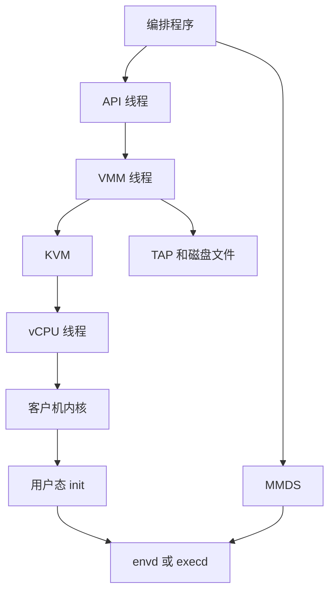

# Firecracker：microVM、guest agent 与 envd

Firecracker 是亚马逊用 Rust 写的虚拟机监视器。一个进程只包一台 microVM，客户机有自己的内核。AWS Lambda 和 Fargate 用它把互不信任的代码隔开。后来的 Agent 沙箱沿用了这套监视器，又在客户机里另放了一个听命令的进程：E2B 和 AgentENV 叫 envd，OpenSandbox 叫 execd。Firecracker 的发布物里没有这个进程。

仓库在 [firecracker-microvm/firecracker](https://github.com/firecracker-microvm/firecracker)，协议 Apache-2.0。设计说明是 [design.md](https://github.com/firecracker-microvm/firecracker/blob/main/docs/design.md)，论文是 NSDI 2020 的 [Firecracker](https://www.usenix.org/conference/nsdi20/presentation/agache)。Kata Containers 也可以把它接成容器下面的那一层虚拟化。下面的启动时间和内存开销来自它自己的规格，测量条件写在数字旁边。

读到“用 Firecracker 起一个带 envd 的 microVM”，对应的是三件不同的东西。microVM 是那台已经跑起来的虚拟机，有自己的内核、内存和根文件系统。Firecracker 是宿主机上把它打开的那个进程，业界叫 VMM。envd 是客户机开机之后里面的一个普通用户态服务，负责执行命令和碰文件。关机、快照、网络隔离不由它做。

## 一个进程里有三条线程

生产环境里，Firecracker 应通过自带的 jailer 拉起。jailer 先建好 cgroup 和 chroot，丢掉多余权限，再 exec 成 Firecracker。之后这个进程只能碰到别人放进监狱目录、或通过文件描述符递进来的内核镜像、磁盘文件和套接字。

进程里固定有一条 API 线程、一条 VMM 线程，以及每个 vCPU 一条线程。API 线程跑 HTTP 服务，听在 Unix 套接字上，不在客户机执行指令的快路径上。编排程序用它设 vCPU 和内存、挂磁盘、挂网卡、写元数据、加 vsock，最后调用 InstanceStart。它到不了客户机里的 shell。想执行 `pip install`，不能对这个套接字发一条命令。

vCPU 线程由 KVM 创建，主循环是 `KVM_RUN`。客户机代码直接在硬件虚拟化扩展上跑，Intel VT-x、AMD-V 或 ARM 的对应机制负责把特权操作陷进来。同步的端口 I/O 和内存映射 I/O 在这些线程上碰设备模型。客户机代码一开始跑，这些线程就按不可信代码来围。

设备模拟集中在 VMM 线程的一个 epoll 循环里。virtio 网卡、virtio 块设备、vsock、串口、MMDS，以及限速，都在这条线程上转。客户机往 virtio 队列里放描述符，VMM 线程把数据拷到宿主机的 TAP 或磁盘文件上。暂停之后，这条线程不再轮询设备，只处理 API，直到恢复。所以暂停中的 microVM，vCPU 和设备模型都不在跑。

限速用两个令牌桶，一个管每秒操作次数，一个管带宽。网卡和每块盘可以分别配进、出方向。桶的大小、每次 I/O 的花费、补充速率和突发都走 API。多台 microVM 挤在同一台机器上时，公平靠的是这里，加上 jailer 设的 cgroup CPU 配额。设计文档还建议用 cpuset 把一台 microVM 钉在一组核上，避免它在 NUMA 节点之间迁来迁去。

vCPU 数量上限是 32，默认 1 个 vCPU、128 MiB 内存。CPU 和内存可以超量订阅，超额多少由使用者按负载的相关性自己定。同时能跑多少台，文档写成只受机器上的 CPU 和内存限制。最小内核、单核、128 MiB 时，每个物理核每秒可以稳定地创建并销毁 5 台；36 个物理核大约是每秒 180 台。这是创建再拆掉的速率，不是 180 台同时在跑业务。

## 设备表裁得很短

QEMU 模拟传统网卡、PCI 总线和一大堆遗留硬件，客户机里的驱动和监视器里的设备模型都多。Firecracker 只留沙箱用得上的几样：virtio 网卡，背后是宿主机 TAP；virtio 块设备，背后是一个已经格式化好的文件，文件系统必须是客户机内核认识的；virtio-vsock；串口；一块 i8042，只用来让客户机发重启信号；可选的熵设备和 pmem。KVM 自己还向客户机露出中断控制器和可编程间隔定时器。virtio-PCI 热插拔在文档里仍是开发者预览，不能当成已经能在运行中随意加盘的稳定接口。

网卡的 IP、NAT 和防火墙不在 Firecracker 里。设计文档写明，它不做任何出网过滤。从客户机出去的流量一律当成不可信，要在宿主机上滤。拷贝到 TAP 的那一下会过令牌桶，那是限速，不是策略。AgentENV 给每个沙箱一个网络命名空间，用 iptables 做策略。CubeSandbox 用 eBPF 挂在 TAP 上。OpenSandbox 的 FastSandbox 把策略放在 Pod 网络命名空间的转发链上。三家都是自己补上 Firecracker 故意留空的那一层。

没有 virtio-fs。客户机看不到宿主机目录，只能看到块设备。AgentENV 因此把根文件系统做成 ublk 上的 OverlayBD，在客户机里再用 overlayfs。DSec 的 microVM 同样把只读的 EROFS 做成块设备，可写层是 ext4。CubeSandbox 的监视器不是 Firecracker，是基于 RustVMM 的 CubeHypervisor，设备列表里包含文件系统，可以走 virtio-fs 这一类通道。选 Firecracker，就是接受“进客户机的只有块和网卡”。

可选的 pmem 让客户机把一段宿主机上的文件映射成持久内存。DSec 的 microVM 用 virtio-pmem 加 DAX，让只读镜像不要在客户机页缓存里再存一份。Firecracker 提供这块设备，不规定上面必须怎么用。AgentENV 的内存快照走的是另一条路：只读 ublk 当 Firecracker 的内存文件后端，写时才变成匿名页。那是编排程序和 Firecracker 快照接口的组合，不是 pmem。

CPU 模板用来决定向客户机暴露哪些处理器信息，可以选静态模板，也可以自定。时钟方面，x86_64 上有 kvm-clock 和 tsc，Linux 5.10 及以后在 tsc 稳定时默认用 tsc；aarch64 上是架构系统计数器。生产构建不把串口暴露给外面。串口里可能有客户机数据，宿主机不该看见。日志和指标各走一根命名管道。指标在启动时打一次，之后每 60 秒一次，panic 时再打。

## 围住 VMM 的是 seccomp，围住客户机流量的是宿主机

隔离叠了几层。最里面，客户机代码跑在 KVM 上，和隔壁 microVM 的内核不是同一份。容器共享宿主机内核，一个内核漏洞可以打到邻居。microVM 里的内核漏洞默认打不到隔壁那台客户机的内核，也打不到宿主机内核，除非再穿过 KVM 和 VMM。

VMM 自己也被当成要围起来的进程。seccomp 按线程安装，在任何客户机代码执行之前就限制 Firecracker 能用的系统调用，默认只留它干活必需的那一组。jailer 把它放进 chroot 和 cgroup，并降成非特权进程。这层围的是“VMM 被攻破之后还能碰宿主机的什么”，不是客户机里的应用策略。

出网仍然要宿主机做。Firecracker 的威胁模型把 guest 的网络字节拷到 TAP 就结束了。Agent 沙箱如果只跑官方 jailer、不再加网络策略，客户机里的程序就能按 TAP 所在网络能到的地方出去。DSec 的论文把每沙箱的出站收成 eBPF 允许列表。那是编排层的设计，不在 Firecracker 仓库里。

## API、MMDS、vsock 不能互相代替

编排程序准备的材料通常是：一份 Linux 内核、一个根文件系统文件、一张 TAP，以及可选的 vsock 套接字。三条通道各管一段。

Firecracker 的 HTTP API 只跟 VMM 说话。开关虚拟机、换磁盘后端、做快照，都在这里。

MMDS 是放在 Firecracker 进程里的一小段 JSON。宿主机用 API 写入，客户机通过一块被指定的网卡去读。默认地址 `169.254.169.254`，和云主机实例元数据同一习惯。发往这个地址的 ARP 和 TCP 被设备模型截下，不会进 TAP。版本 1 是直接 GET，已经标成弃用。版本 2 先 PUT 换一个短期令牌，再在请求头里带上。没写入内容时，读请求得到 NotFound。快照会保存 MMDS 的配置，数据本身不跟着走，恢复之后要由编排程序再写一次。

E2B 用它传递沙箱身份和 envd 访问令牌的校验值。AgentENV 用它传递沙箱和快照身份。envd 启动后自己去读。这是只读配置，不是执行通道。

vsock 是给客户机里那个代理用的字节管道。virtio-vsock 在用户态实现，不走宿主机内核的 vhost。客户机里的进程用 `AF_VSOCK` 听一个端口。宿主机要连进去，先连配置好的 Unix 套接字，第一行写成 `CONNECT 端口号`，之后是双向字节流。客户机反过来连出时，宿主机要在 `套接字路径_端口` 上先听着。每台虚拟机有一个 32 位的 CID，用来在 vsock 地址里区分客户机。

有了 vsock，执行命令可以不给客户机一张能路由的网卡。网卡仍然可以另挂，那是沙箱里的程序访问外网的数据通路。快照恢复时，当时开着的 vsock 连接会被关掉，客户机里已经在 listen 的套接字还在。磁盘文件、TAP 和 vsock 的宿主机套接字都要由编排程序在新进程里重新备好。OpenSandbox 的 Firecracker 节点故意不把 `vhost-vsock` 挂进容器，因为这套设备本来就不靠它。

## envd 是使用方放进去的，不是 VMM 的一部分

QEMU 世界里有 qemu-guest-agent，通过 virtio 串口或 vsock 做冻结文件系统、读客户机信息。Firecracker 把客户机里的功能尽量拿掉，于是“谁来执行命令”要由镜像自己带。这个进程是普通的 Linux 程序。

E2B 的 envd 用 Go 写成。systemd 很早把它拉起，默认听 49983，HTTP 和 Connect RPC 都走这个端口。进程接口负责启动、列出、接上已有进程，转发标准输入输出和信号，也可以开伪终端。文件接口负责查看、列举、创建、移动、删除和监听变更。`/health` 用来判断这台虚拟机能不能接请求。`/init` 在启动或恢复之后由编排程序调用，把环境变量、访问令牌和元数据推进来，令牌要和 MMDS 里的校验值对上。它还会扫描客户机里新打开的端口，接到沙箱的对外地址上。升级路径允许在不换 PID 的情况下把二进制换掉，因为这个进程死了，外面的 SDK 就失去操作这台虚拟机的手。

模板因此是：根文件系统里已经有 envd，等 `/health` 成功，再拍快照。之后的创建从这份“envd 已经在听”的内存和磁盘恢复。CubeSandbox 的模板探针默认也是 `49983` 上的 `/health`，返回 204 表示可以接命令。只跑自己的 Web 服务时，他们的文档允许镜像里不放 envd，探针改打应用自己的检查。CubeSandbox 的监视器不是 Firecracker，envd 这个角色仍在。

AgentENV 把 envd 放成客户机里的 PID 1。它执行命令、碰文件，还负责拉起其余进程。宿主机通过 vsock，或者通过代理过的网络访问它。和 E2B“systemd 拉起、自己不是 init”的摆法不同，对外仍是宿主机不进 shell，只调这个进程的 API。

OpenSandbox 的 execd 默认端口 44772，协议是另一份。Docker 里它是放进去的二进制，Kubernetes 里可以是 init 容器，FastSandbox 的黄金镜像里已经烤好。池化复用时，它在打开 API 之前先换上这一次分配的身份。DSec 不使用 envd。客户机里是 Aether 维持和节点的通道，每个 shell 会话再起一个 Chronus。

这些代理的边界就是它们自己的接口。它们能启动进程、读写有权限的文件。它们不能代替 KVM，也不能代替宿主机防火墙。客户机里的代码如果能摸到令牌，就能冒充编排程序去调这组 API。令牌从 MMDS 进来之后放在哪，要收着。

## 快照把开机从创建路径上拿掉

快照保存两类 Firecracker 自己握着的状态：客户机内存，以及 KVM 和设备模型里的硬件状态。磁盘文件由使用者管理。拍的时候它不会替你把磁盘刷盘。结果是内存文件、虚拟机状态文件，加上原来的磁盘。

加载用 `mmap(MAP_PRIVATE)` 把内存文件映射进来。页在客户机真正访问时才从文件读入。写过的页变成这块虚拟机私有的匿名内存，没写过的页可以和从同一份快照拉起的其他虚拟机一起留在页缓存里。代价是这份内存文件在虚拟机活着的整段时间都要留在磁盘上。全新启动用的是匿名内存。从快照恢复才走这条按需映射。

API 的顺序是：虚拟机已经启动之后才能 Pause、Resume、CreateSnapshot。LoadSnapshot 只能在新进程还没启动客户机之前调用。全量快照会把客户机内存整份写出去，并且把页都缺页进来。差分快照仍是开发者预览。官方建议在客户机内核已经启动完成后再拍。恢复时 Firecracker 更新 VMGenID 并注入一次中断，让客户机知道自己是从快照里醒来的。内核还在很早的启动阶段时，这个中断可能没人处理，虚拟机会崩。Linux 从 5.18 起在带 ACPI 的系统上支持 VMGenID。

网络连接不保证在换了一个 Firecracker 进程之后还在。克隆出来的沙箱要自己处理 IP 和连接重建。状态文件带一个 64 位 CRC，用来发现意外损坏。磁盘和内存文件的加密、鉴权，文档要求由宿主一侧自己做。Firecracker 把快照文件视为可信输入。

AgentENV 在这套接口之上又做了增量内存层：向 Firecracker 要脏页范围，用 `process_vm_readv` 读出来写成 OverlayBD，恢复时把只读块设备交给内存后端。CubeSandbox 的快照不走 Firecracker 的文件格式，它用 XFS 的 `FICLONE` 克隆磁盘，用 pagemap 挑匿名页写内存镜像。两边都想少拷没改过的页，拷贝发生的位置不同。

从 InstanceStart 返回，到客户机里的 `/sbin/init` 开始跑，[规格](https://github.com/firecracker-microvm/firecracker/blob/main/SPECIFICATION.md)的上限是 125 毫秒。测量关掉了串口，用的是最小内核和根文件系统。这 125 毫秒结束在 init，不包括 systemd 拉起 envd，也不包括业务进程就绪。OpenSandbox 的 Firecracker 集成页另有一组真机数字：从 InstanceStart 到第一次响应大约 1.6 秒，其中内核启动大约 1.0 秒。他们 README 里“预热池大约 80 毫秒”量的是池已经热之后的接纳。三组数字阶段不同，不能合成一个冷启动时间。沙箱产品把“创建很快”做在快照上：等 envd 健康之后先拍下来，真正的创建变成恢复。

VMM 线程的内存开销，在 1 个 vCPU、128 MiB 客户机内存、配套裁剪内核上，不超过 5 MiB。这个数不含客户机那 128 MiB，也不含 MMDS 里的数据。vsock 连接一多，可以超过 5 MiB。它量的是 Firecracker 进程自己的管理结构。同一份规格还写了只算计算的客户机 CPU 性能要高于同等裸金属的 95%，并注明集成测试尚未接上。引用时把这条和前两条分开。

## 和另外几套对着看

| 设计轴 | Firecracker | 另外几套 |
| --- | --- | --- |
| 一台虚拟机是什么 | 一个进程，API、VMM、vCPU 三条线 | QEMU 也是一进程一台虚拟机，设备模型大得多。CubeSandbox 的 CubeHypervisor 基于 RustVMM，不是这个仓库 |
| 客户机里谁听命令 | 发布物里没有。使用方自己放 envd、execd 或 Chronus | QEMU 有 qemu-guest-agent。Kata 的 agent 负责容器生命周期 |
| 进客户机的存储 | virtio 块设备，背后是文件。没有 virtio-fs | CubeHypervisor 可以走文件系统设备。DSec 容器用的是 overlayfs，不是这层 |
| 出网 | 拷到 TAP 并限速。不过滤 | 沙箱平台在宿主机上另做 iptables、eBPF 或边车 |
| 身份怎么给客户机 | MMDS，`169.254.169.254`。快照不带走数据 | AgentENV、E2B 用它传令牌。执行仍走 vsock 或客户机里的 HTTP |
| 快照 | `MAP_PRIVATE` 按需加载。差分仍是预览。文件在虚拟机活着时不能删 | AgentENV 在上面再叠内存层。CubeSandbox 用 reflink 和 pagemap |
| 开机到能跑代码 | 规格是 125 毫秒到 `/sbin/init`。envd 就绪不在这条里 | 沙箱把“能跑代码”做成快照恢复，而不是每次冷引导 |

Firecracker 把多租户隔离做在 KVM 和一份很短的设备表上，把启动时间压到 init。命令、文件、健康检查是客户机里另一个进程的事。沙箱平台如果只说“我们用了 Firecracker”，还没有说明客人代理是谁、磁盘是文件还是分层块设备、出网滤在哪。那三层决定一台沙箱实际能被怎么操作，也决定 125 毫秒之后还要再等什么。

## 参考

- 亚马逊，[Firecracker 仓库](https://github.com/firecracker-microvm/firecracker) 与 [README](https://github.com/firecracker-microvm/firecracker/blob/main/README.md)。
- [设计文档](https://github.com/firecracker-microvm/firecracker/blob/main/docs/design.md)。线程、epoll 设备循环、令牌桶、jailer、每核创建速率。
- [SPECIFICATION.md](https://github.com/firecracker-microvm/firecracker/blob/main/SPECIFICATION.md)。125 毫秒到 init，5 MiB 的测量条件。
- Agache 等，[Firecracker](https://www.usenix.org/conference/nsdi20/presentation/agache)，NSDI 2020。
- [vsock](https://github.com/firecracker-microvm/firecracker/blob/main/docs/vsock.md)。`CONNECT 端口号` 和客户机 `AF_VSOCK`。
- [MMDS](https://github.com/firecracker-microvm/firecracker/blob/main/docs/mmds/mmds-user-guide.md)。V1 与 V2，快照不带走数据仓库。
- [快照](https://github.com/firecracker-microvm/firecracker/blob/main/docs/snapshotting/snapshot-support.md)。`MAP_PRIVATE`、差分预览、VMGenID。
- E2B，[基础设施架构](https://github.com/e2b-dev/infra/blob/main/docs/ARCHITECTURE.md)。envd 在 49983 上的进程、文件和 `/init`。
