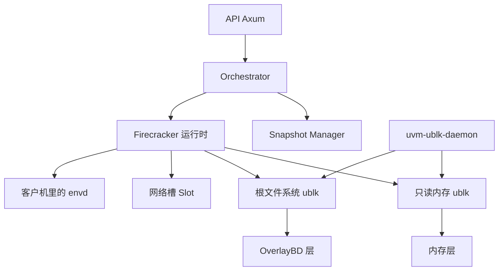

# Kimi AgentENV：大规模 Agent 训练的执行环境

2026 年 7 月，月之暗面、清华 MADSys 和 KVCache.ai 把 AgentENV 开源了。Kimi K3 的 Agent 后训练用它跑可暂停、可分叉的 Firecracker 微虚拟机，每台沙箱一份自己的内核，空闲时把内存还回去，同一份做到一半的状态可以在一台机器上再开出最多 16 条路。

仓库在 [kvcache-ai/AgentENV](https://github.com/kvcache-ai/AgentENV)，介绍文章是 [AgentENV 开源介绍](https://kvcache.ai/blog/agentenv-open-sourced/)，文档在 [kvcache-ai.github.io/AgentENV](https://kvcache-ai.github.io/AgentENV/latest/)。Kimi 在 [K3 开放日](https://www.kimi.com/news/kimi-k3-open-source) 把它和 MoonEP、FlashKDA 放在同一批训练基础设施里。创建、命令、文件走兼容 [E2B](https://e2b.dev/) 的 HTTP API，现有 SDK 把地址指过来就能用。密度做在存储上：根文件系统和内存快照都是一叠只读层加一层可写层，经 Linux 的 ublk 变成虚拟机能挂的块设备。同一份快照上还没写过的页，留在宿主机页缓存里给多台虚拟机共用。分叉不能换机器。规模和延迟取自官方博客和 README，两处口径不完全一样，写在数字旁边。

## 训练要的四件事，它只把虚拟机这条做透

一次尝试要一台能改文件的电脑。模型读代码、装包、起服务，下一步命令依赖上一步留下的文件。奖励如果只看最终输出，模型会去翻不该看的日志，或者到外网把答案取回来。环境种类很多，镜像总量可以超过一台机器的磁盘。大多数时间虚拟机在等模型生成下一句，CPU 是空的，内存和改过的磁盘还占着。树搜索和多轨迹采样还要从同一份做到一半的状态再开几条路。

DSec 把这四件事拆进四种后端：短调用走预热容器，仓库任务走容器，不可信代码走 Firecracker，Android 和图形走 QEMU。AgentENV 没有这套选择。调用方拿到的始终是微虚拟机，换隔离级别要换系统。换来的是一条路径上的快照和分叉：暂停、恢复、从运行中的沙箱再克隆，都落在同一套层文件上。OpenSandbox 的 FastSandbox 也跑 Firecracker，但创建打分看的是镜像是否已经在 Fastlet 上；AgentENV 的调度器是轮询或随机，热数据靠节点本地缓存和可选的 P2P，不靠调度器知道“这台机器上有没有这份层”。

## 一台机器上，谁在管沙箱

节点是一个 Rust 进程，入口在 `src/bin/server.rs`，需要 `/dev/kvm`。默认虚拟化模式是 KVM。x86_64 上可以改成 PVM：宿主机加载 `kvm_pvm`，AgentENV 仍通过 `/dev/kvm` 建虚拟机，用的是另一套 Firecracker 和客户机内核。快照记下捕获时的模式。KVM 上拍的快照不能在 PVM 节点上恢复，反过来也不行。PVM 下内存快照的脏页跟踪默认关掉，文档写明这个组合没有测过。Kubernetes 上运行时是特权 DaemonSet，每台宿主机一个 Pod，才能用 KVM、网络命名空间和本机缓存。同一台机器上的 Pod 必须是同一种模式。

进程里按目录拆开：

| 组件 | 代码 | 管什么 |
| --- | --- | --- |
| API | `src/api/` | Axum。E2B 形状的 HTTP，以及把流量反代进沙箱 |
| Orchestrator | `src/orchestrator/` | 沙箱状态机、超时回收、暂停状态在重启后还在 |
| Firecracker 运行时 | `src/sandbox/firecracker/` | 拉起虚拟机、套网络槽、跟客户机里的 envd 说话 |
| 块设备 | `storage/overlaybd/`、`storage/ublk/`、`storage/ublk-daemon/` | 层文件、ublk 设备、给 Firecracker 的磁盘和内存后端 |
| 快照 | `src/snapshot/` | 把一次提交写成可再启动的制品，放到本机、对象存储或共享文件系统 |
| 模板构建 | `src/template/` | 在临时沙箱里执行构建步骤，就绪后把状态收成模板 |
| P2P | `src/p2p/` | 可选。节点之间按内容要字节，调度器不转发文件 |
| 可观测 | `src/observability/` | 节点身份、宿主机用量、心跳里带上的沙箱名单 |

Orchestrator 是状态机。创建中、运行中，然后可以进入暂停、做持久快照或分叉；暂停之后是已暂停，再恢复回运行；也可以销毁。公开文档里的状态还包括 Snapshotting 和 Forking：做完持久快照或分叉，源沙箱回到运行。创建、暂停、恢复、删除、分叉成功后会广播生命周期事件。过期沙箱由后台按约 1 秒的间隔扫描回收。暂停过的沙箱记在本机目录里，节点重启后以暂停状态装回。数据面请求打到一台没在跑的沙箱时，如果打开了自动恢复，会先把它拉起来，并把剩余存活时间至少补到配置的下限，默认 300 秒。

客户机里听命令的是 envd，代码在 `thirdparty/envd/`，来自 E2B 那条线：执行命令、读写文件、和进程打交道、报告健康。宿主机通过 Firecracker 的 MMDS 把沙箱和快照身份放在 `169.254.169.254`。DSec 把这件事拆成两个进程，Aether 维持和节点的通道，每个 shell 会话一个 Chronus。AgentENV 没有这层拆分。一个 envd 包办会话。模型如果要翻内部通道，翻的是 envd 和 MMDS，不是另一套自研 RPC。

节点外还可以挂一个 HTTP 扩展。启动前、从快照恢复前、停止前回调它。启动钩子能追加内核参数，也能拿到这个沙箱的网络命名空间路径。除了停止钩子，钩子失败会导致对应操作失败。没配地址时这套逻辑不跑。

恢复的热路径上有两级池。`[pool.firecracker]` 预先准备“网络槽加已经拉起的 Firecracker 进程”。命中时把槽、进程和工作目录交给这次恢复，省掉现场 fork 进程和等 API 套接字。`[pool.block]` 是 ublk 守护进程里的 OverlayBD 设备池。块设备跟镜像和尺寸绑在一起，补池是异步的，不能像网络槽那样先做一批通用的放着。

## 控制面是两个 Go 进程，账本在内存里

多机时，仓库 `services/` 里还有 Gateway 和 Scheduler，跟节点二进制分开编译。单机可以只跑节点。

Gateway 默认听 8080，是 HTTP 反向代理。新建沙箱时用 gRPC 调 Scheduler 的 `Schedule`，成功后 `RecordAssignment` 记下沙箱在哪台节点。暂停、查询这类控制请求按 URL 里的沙箱 ID 做 `LookupNode`。进沙箱内部服务的流量不从 URL 路径猜，靠请求头 `x-agentenv-sandbox-id` 或 `e2b-sandbox-id`，或者主机名 `{端口}-{沙箱 ID}.域名`。主机名要单独配置域名，沙箱 ID 还得塞进 63 字符的 DNS 标签。没有这些路由信息时，Gateway 会把列出沙箱、列出节点这类读请求在集群上拼起来。

Scheduler 默认听 9090。放置策略是轮询或随机，没有“这台机器上已经有这份镜像”的打分。节点发现可以是静态名单，也可以监视 Kubernetes 里 headless Service 的 EndpointSlice，只收就绪的 DaemonSet Pod。节点心跳带上正在跑的沙箱名单、资源，以及可选的 P2P 地址。Scheduler 把这份名单当成该节点的事实来源：心跳里没了的沙箱，绑定就删掉。`binding_ttl` 只管路由信息还能信多久，不管沙箱自己的超时。

绑定放在 Scheduler 进程的内存里。重启之后，要等新的创建和下一轮心跳才能补齐。文档把这写成当前限制：Kubernetes 能动态更新可调度节点，绑定本身没有副本。DSec 把所属节点编进沙箱 ID，入口不存这份表。AgentENV 的 ID 没有这个编码，所以 Gateway 必须另有一张表，表丢了，已经在跑的沙箱要等心跳才重新可路由。

P2P 的目录也不在 Scheduler 里。心跳只上报一个不透明的端点。Scheduler 的 `ListP2pPeers` 把同集群、同后端的端点交出去。字节传输在节点之间，用 iroh。一个制品键对应一个逻辑制品，查找先看本机目录，再按发现顺序问对等节点。拉到之后，本机也会尽力对外广告，让后面的节点不必都回源。对象存储上的固定快照文件会先试 P2P，失败再读对象存储。已经在本机文件系统上的快照不再绕 P2P。发布失败不会把已经提交成功的快照回滚掉。关掉 P2P 时，查找返回空，拉取直接失败，功能停在那里，不影响本机路径。

## 磁盘是 LSMT，写只追加在最上一层

镜像如果每次都拉全再解压，突发创建会先打满磁盘和网络，而且任务往往只读到镜像里的一小部分。AgentENV 把根文件系统做成层叠的块设备，读到哪一块再取哪一块。

层格式是 [OverlayBD](https://www.usenix.org/conference/atc20/presentation/li-huiba) 这一路的 LSMT，实现在 `storage/overlaybd/`。每一层有头尾，魔数是 `LSMT`，加上 UUID、标志、索引和数据的偏移。索引是一组 16 字节的段映射：虚拟偏移、长度、层内物理偏移、是否为零洞、层标签。只读层压在下面，可以压缩；唯一的可写层在最上面。读的时候从最上面向下找，第一层有这段映射的就用它。写只追加到可写层，索引先改在内存里，sync 时刷下去。已经发布的只读层不被改。

压缩是 zstd，级别 3，带随机访问用的跳表和 CRC32C。不用把整层解开才能读一个块。后端可以换：本机文件走 io_uring，可选 `O_DIRECT`；OCI 仓库是 `registryfs_v2`，读的时候按范围要数据；还有 tar。已经是 OverlayBD 的镜像不必先把数据块下载完。普通 OCI tar 会先取清单，再逐层转成本地层文件。本地盘是有上限的热缓存，冷的丢掉，所以集群上的镜像总量可以大于任意一台机器的磁盘。私有仓库沿用 Docker 的登录配置，生成出来的层配置带同一份凭据。

这些层要变成客户机里的 `/dev/vda`，中间是 ublk。内核分配设备号，控制设备是 `/dev/ublkcN`，块设备是 `/dev/ublkbN`。每个队列一条线程，自己一把 io_uring。内核把 I/O 描述符放在 mmap 的数组里，用户态异步做完再完成。内核 6.8 以上可以走稀疏缓冲表，少一次拷贝。

所有设备放在一个长期进程 `uvm-ublk-daemon` 里，节点通过 Unix 套接字让它创建、释放、改大小、快照时重新叠层。远程读取不跟某个设备的运行时绑在一起。opendal 和 reqwest 会把连接任务钉在当时轮询它们的运行时上，设备拆掉时那个运行时也拆掉，还在用的连接会一起没。所以远程 I/O 放到 `ImageService` 专用的运行时上，默认 4 个 worker，由配置 `remote_io_workers` 打开。设备运行时只负责本机队列。节点进程不管 io_uring，它只拿着守护进程的客户端。

暂停磁盘的原语是 `create_snapshot_and_restack`。当前可写层封存，变成新的只读层，再打开一个空的可写层。快照记住的是相对上一份又改了哪些块。同一份模板拉起的多台虚拟机，在改写之前共享那些只读层。额外磁盘走同一套设备生命周期，只读和可写的差别是上面有没有可写层。

DSec 的容器镜像走的是另一条路：EROFS 元数据在节点本地，文件数据在 3FS，用 overlayfs 把基础镜像、工作区、工具包叠成目录树。Firecracker 没有 virtio-fs，DSec 的 microVM 可写盘才改用 OverlayBD 加 ublk。论文写明，这套 Rust 实现和 ublk 库在 AgentENV 仓库的 `storage/overlaybd`。两边共用的是块存储代码。DSec 的控制面、四种后端和 3FS 布局不在这个仓库里。

CubeSandbox 的磁盘快照是 XFS 上的 `FICLONE`，一份快照一次 ioctl，共享的是文件系统 extent。AgentENV 的共享发生在层文件的段映射里，虚拟机看到的始终是一块盘。两种都是写时才复制，复制的粒度不一样：一边是 XFS 的 extent，一边是 LSMT 里的一段虚拟块。

## 内存也是一层层的，分叉不能跨机器

暂停如果把整份客户机内存写盘，空闲环境就不便宜。AgentENV 的做法是：Firecracker 先做一份只含状态差异的快照。节点向它询问哪些范围是脏的或仍然存在，用 `process_vm_readv` 把这些页读出来，直接写成一层 OverlayBD。更早的内存层叠在下面。下一层只覆盖这一次改过的范围。

恢复时不把整份内存读进匿名内存。这些层做成一个只读的 ublk 设备，交给 Firecracker 当作文件后端。Firecracker 把设备映射进来，某一页第一次被写，才复制成这台虚拟机私有的匿名页，底层设备保持只读。从同一份快照启动的多台沙箱共用这一个内存设备，引用计数管生命周期。干净页留在宿主机页缓存里。写过的页和正在用的匿名内存才各自占一份。

仓库里还有 `storage/uffd-core/`，用 userfaultfd 在缺页时填内存。当前构建不包含它，文档写成留作参考。E2B 的编排器仍用 userfaultfd 从模板的内存文件供页。AgentENV 把这条路换成了块设备，这样内存快照和磁盘快照用同一套层和同一个 ublk 守护进程。

客户机里堆积的文件缓存靠 DAMON 回收，再用 Firecracker 的 balloon 把空闲页还给宿主机。DSec 的 microVM 也用 DAMON 加 balloon，另外用 virtio-pmem 和 DAX 让只读镜像不要在客户机里再缓存一份。AgentENV 没有写 virtio-pmem。它减掉的重复，是“很多虚拟机从同一份内存快照恢复、还没写过的那些页”。DSec 减掉的重复，是“很多虚拟机同时读同一份只读根文件系统”。长寿命、各自已经跑了很久的虚拟机，后一个问题更大；从同一模板成批拉起、很快分叉的虚拟机，前一个问题更大。

分叉用的是同一套写时复制。源沙箱先短暂暂停，抓一份克隆，然后继续跑。子沙箱在同一节点上继承文件系统、内存和资源配置，谁先改，谁才得到自己的那一页或那一块。公开文档写一次最多 16 个。官方博客把这个对应到多轨迹采样和树搜索。分叉不能换机器，因为共享的是这台机器的页缓存和层文件。DSec 的论文没有这个原语。它的 `pack_diff` 是把搭好的环境收成下一轮的增量磁盘快照，暂停是为了在训练被抢占时把内存还回去。要并行试几条路，得再创建沙箱，而不是在节点上 fork。

## 每个沙箱一个网络槽，80 和 443 可以拐进代理

每个运行中的沙箱有自己的网络命名空间。Firecracker 用 TAP 接进这个命名空间，命名空间再用一对 veth 接回宿主机。客户机里的地址是 `169.254.0.21`，TAP 一侧是 `169.254.0.22`。veth 从 `10.12.0.0/16` 里按槽切 `/31`。宿主机用来访问这台虚拟机的地址在另一段 `10.11.0.0/16`。这些内部网段在用户策略之前就被拒绝，一台沙箱不能去撞另一个槽的地址，即使用户策略写成允许所有出站。

建命名空间必须在专用线程里做。网络命名空间是线程局部的，`unshare` 不能跟别的请求共用线程。槽可以回到暖池：命名空间和基线规则留着，下一任租户再换用户链。全局的宿主机 iptables 只装一套，按 veth 名前缀匹配。客户机发起的新连接不能打到宿主机上的任意服务；已经建立的、宿主机自己发起的连接可以回来。

出站策略在命名空间里的 `AGENTENV-USER-EGRESS`。允许的 CIDR 在前，拒绝的在后，基础策略是拒绝时再加一条 `0.0.0.0/0`。内部网段和配置里的永远拒绝，不在这条用户链里，换策略换不掉。

域名规则不在 eBPF 里学 DNS。需要按域名拦的时候，命名空间把 TCP 80 和 443 重定向到本命名空间里的 `0.0.0.0:15000`。每个命名空间自己听这个端口，固定端口不会在宿主机上撞车。代理读 `SO_ORIGINAL_DST` 拿回原来的目的地址，从 HTTP Host 或 TLS ClientHello 的 SNI 里取域名，把解析交给留在宿主机网络命名空间里的一个 DNS 线程，再按策略挑一个允许的 IPv4。它不拆 TLS，也不改 HTTP 头。缓冲的开头最多 64 KiB，然后双向转发。

这和 CubeSandbox 的 CubeEgress 不一样。CubeEgress 用自己的根 CA 做中间人，可以在转发前加上 `Authorization`，密钥不进客户机。AgentENV 的代理只看 SNI 和 Host，决定这条连接能不能走。密钥如果要进沙箱，还是会进客户机。域名允许列表要同时带上 `denyOut: ["0.0.0.0/0"]`，否则空的主机名还能从默认放行走掉。策略替换是一整批 `iptables-restore`。已经接上的连接拿的是接受那一刻的策略副本，不会被中途掐掉。

## 模板、快照，以及那些数字

`aenv pull` 把一个 OCI 镜像收成模板。更专门的环境用类似 Dockerfile 的 `RUN`、`ENV`、`WORKDIR`。构建器从基础环境拉起一台临时沙箱，在里面执行这些步骤，就绪检查通过后暂停，把当时的状态提交成新模板。仓库里还有一条 BuildKit 路径，文档单独写在 `buildkit-template-builds.md`，给的是构建图，不是另一套运行时。

`aenv snapshot create` 把当前内存和文件系统的增量收成一份可以再启动的快照。清单记录的是逻辑内容：元数据、根文件系统各层、挂上去的磁盘各层。`vm_state.bin` 这类固定文件的路径由布局约定推导，不在清单里各写一遍。快照可以放本机、S3 兼容的对象存储，或共享文件系统。兼容的根文件系统增量也可以推回原来的 OCI 仓库。

官方博客看了高负载期间 70 台节点、大约 22.5 万个环境。申请量除以宿主机实际用量：CPU 平均 27.9 倍，最低 14.5 倍；内存平均 9.6 倍，最低 5.7 倍。一台 128 核、512 GB 的机器，在每个环境 2 vCPU / 4 GB 或 4 vCPU / 8 GB 时，测到过同时稳定跑 400 个。生产集群到过大约 3 万个。同一篇文章把基于模板的启动或恢复写成低至 49 毫秒，创建快照低至 133 毫秒，并发分叉摊到每个立刻能跑的子环境低至 122 毫秒。README 更紧：基于快照的启动或恢复在 50 毫秒内，暂停在 100 毫秒内，增量快照在 100 毫秒内。两处都是项目自己的测量，条件不同，不能合成一个数。

成本估算也在那篇介绍里，而且排除了容器。300 个环境，每个 4 vCPU、8 GB，放 720 小时，按他们观测到的最低申请/用量比折到一台包月云主机，大约 1.53 万元一个月。对照里按申请量计费的几种沙箱是这个数的 8.8 倍到 31.7 倍。价格取 2026 年 7 月 26 日的公开报价，1 美元按 6.773 人民币。环境有多忙、写了多少页，账单就变。

## 和另外几套对着看

| 设计轴 | AgentENV | 另外几套 |
| --- | --- | --- |
| 隔离 | 只有 Firecracker。PVM 是没有嵌套虚拟化时的 KVM 接口，快照不能混用 | DSec 在 FnCall、容器、Firecracker、QEMU 里选。OpenSandbox 用运行时类选 runc、gVisor、Kata 或 Firecracker |
| 客人里谁听命令 | 一份 envd，身份经 MMDS | DSec 是 Aether 加每个会话一个 Chronus。OpenSandbox 是 execd，默认端口 44772 |
| 磁盘共享 | LSMT 段映射，ublk 呈现为一块盘 | CubeSandbox 用 XFS `FICLONE`。DSec 容器用 EROFS 加 overlayfs，数据在 3FS |
| 内存共享 | 同一份快照共用一个只读内存 ublk，写时变成匿名页。uffd 路径不在当前构建里 | E2B 用 userfaultfd。DSec 用 virtio-pmem 共享只读镜像的页缓存 |
| 分叉 | 同机，源沙箱短暂停一下，最多 16 个。跨节点做不到 | DSec 论文没有这个原语。OpenSandbox 的暂停是提交根文件系统并释放 Pod |
| 调度 | 轮询或随机。镜像在不在本机，不参与打分 | DSec 抽样 k 台再选最空的。FastSandbox 先看镜像缓存 |
| 出站 | 命名空间里的 iptables，80/443 可按 SNI 放行。不改请求头 | CubeSandbox、OpenSandbox 的 L7 代理能注入密钥 |
| 路由状态 | Gateway 靠 Scheduler 内存里的绑定，重启后等心跳 | DSec 把节点编进沙箱 ID，入口无状态 |

AgentENV 把“同一份中间状态要试多条路”和“空闲环境要便宜”做在层文件和页缓存上，并且把 E2B 的 API 和 envd 接了进来。它没有 DSec 那种按任务换后端、也没有 CubeSandbox 那种把密钥留在宿主机上的中间人。读 `storage/overlaybd` 时可以跟 DSec 的 microVM 磁盘放在一起；读调度、配额和训练被抢占之后状态放哪，要分开。

## 参考

- KVCache.AI，[AgentENV: When LLMs Learn to Get the Job Done](https://kvcache.ai/blog/agentenv-open-sourced/)，2026-07-27。规模、延迟和成本估算。
- 月之暗面，[Kimi K3 开放日](https://www.kimi.com/news/kimi-k3-open-source)，2026-07-27。
- [kvcache-ai/AgentENV](https://github.com/kvcache-ai/AgentENV)。
- [架构](https://github.com/kvcache-ai/AgentENV/blob/main/docs/src/internals/architecture.md)。节点子系统、LSMT、ublk 守护进程、内存快照、Gateway 和 Scheduler。
- [网络](https://github.com/kvcache-ai/AgentENV/blob/main/docs/src/internals/networking.md)。槽、地址规划、iptables 顺序、不拆 TLS 的出站代理。
- [P2P](https://github.com/kvcache-ai/AgentENV/blob/main/docs/src/internals/p2p-design.md)。iroh 传字节，Scheduler 只存端点。
- [沙箱概念](https://kvcache-ai.github.io/AgentENV/concepts/sandboxes.html)。状态机，以及一次分叉最多 16 个。
- [PVM 部署](https://kvcache-ai.github.io/AgentENV/dev/deployment/pvm.html)。快照不能跨 KVM 和 PVM 恢复。
- Agache 等，[Firecracker](https://www.usenix.org/conference/nsdi20/presentation/agache)，NSDI 2020。
- Li 等，[DADI / OverlayBD](https://www.usenix.org/conference/atc20/presentation/li-huiba)，USENIX ATC 2020。
- Linux 内核文档，[ublk](https://docs.kernel.org/block/ublk.html)。
- [E2B](https://e2b.dev/)。API 形状和 envd 的来源。
- DeepSeek-AI 等，[DSec](https://arxiv.org/abs/2609.22978)，arXiv:2609.22978。写明 OverlayBD 的 Rust 实现位于 AgentENV 仓库。
