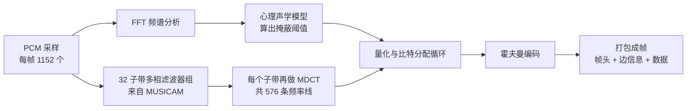

# MP3：一个输掉了标准之争的格式，怎样改写了整个音乐产业

1995 年春天，德国埃尔朗根，弗劳恩霍夫集成电路研究所（Fraunhofer IIS）走廊尽头的一间小会议室里，一个欧洲广播标准工作组正在开会，决定一小段数字广播频率该用哪种音频压缩格式。会议室太小，Karlheinz Brandenburg 的同事们只能在门外的走廊里来回踱步。

Brandenburg 带来了一份 50 页的装订材料，里面有图表、有双盲听音测试的数据，还有一条曲线，证明过去五年处理器速度的增长一直跑在网络带宽前面，所以一个“算起来复杂一点、但省带宽”的格式才是对未来的正确押注。对手是飞利浦支持的 MUSICAM 阵营，他们发了一份两页纸的材料，内容只有一句话的意思：我们的格式简单。

讨论持续了五个小时。最后飞利浦的代表站起来说，两个并存的标准只会带来恐惧、不确定和怀疑，标准的意义就在于只有一个，“不要破坏系统的稳定”。工作组投票，放弃了 Brandenburg 的格式。据记者 Stephen Witt 后来的统计，这是这个格式在标准竞争中连续第七次输给对手，它在当时几乎被判了死刑，用 Witt 的话说，它成了音频界的 Betamax（见 Witt《How Music Got Free》第一章，另可参考[作者在 WBUR 的访谈](https://www.wbur.org/hereandnow/2015/07/06/witt-how-music-got-free)）。

这个输掉了所有比赛的格式，叫 MPEG-1 Audio Layer III。几个月后，研究所内部投票，给它定了一个三个字母的文件扩展名：`.mp3`。

四年后，一个大学新生用它写出了 Napster，美国唱片业在接下来的十五年里收入腰斩。又过了十八年，它的最后一项专利到期，被媒体误报为“死亡”。今天，你手机里的播客、车载 U 盘里的歌、无数网站上的音效，仍然是这三个字母。

这篇文章按时间顺序讲这个格式的故事：一位教授想用电话线传音乐，被专利局告知“不可能”；一个博士生为了证明专利局是对的，结果证明了它是错的；一首清唱的纽约咖啡馆小曲怎样把压缩算法折磨了好几年；一场标准委员会里的政治博弈；一张被盗的信用卡和一个写着“感谢弗劳恩霍夫”的压缩包；一个北卡罗来纳州 CD 工厂里的流水线工人怎样用皮带扣藏起了两千张唱片；以及唱片公司、专利、开源社区、苹果和流媒体之间延续了二十年的争吵。

## 序章：一秒钟 141 万个比特（1970s–1982）

先算一笔账。

1982 年上市的 CD 用的是最朴素的数字音频表示法，叫线性脉冲编码调制（PCM）：每秒对声波采样 44,100 次，每次用 16 个比特记录振幅，左右两个声道。所以一秒钟的立体声音乐需要：

```text
44,100 次/秒 × 16 比特 × 2 声道 = 1,411,200 比特/秒 ≈ 1411 kbit/s
```

一首四分钟的歌大约 42MB。1990 年代中期，一台家用电脑的硬盘通常只有 500MB 到 1GB，装十几首歌就满了；拨号上网的调制解调器最快 28.8 kbit/s，下载一首歌要三个多小时（[MP3](https://en.wikipedia.org/wiki/MP3)）。

德国当时正在铺设一种叫 ISDN 的数字电话线，一条线路的速率是 64 kbit/s，两条绑在一起是 128 kbit/s。要让 CD 音质的音乐通过 ISDN 实时传过去，得把数据压缩到原来的十二分之一左右。

1970 年代，埃尔朗根-纽伦堡大学的教授 Dieter Seitzer 一直在研究怎样通过电话线传输高质量的语音。随着 ISDN 和光纤出现，语音编码显得不那么紧迫了，他的研究组转向了音乐（[Fraunhofer 官方时间线](https://www.mp3-history.com/en/timeline.html)）。他有一个念念不忘的设想，叫“数字点唱机”：用户通过电话线连到一台中央服务器，想听什么歌就点什么歌，服务器把音乐实时送过来。这基本上就是今天的 Spotify，只是早了三十年（[Karlheinz Brandenburg](https://en.wikipedia.org/wiki/Karlheinz_Brandenburg)）。

Seitzer 为这个设想申请了专利。德国专利局驳回了申请，理由是：这是不可能的，“我们不能给不可能的东西授予专利”（[NPR 对 Brandenburg 的访谈](https://text.npr.org/134622940)）。

Brandenburg 后来回忆：“你不应该对一个知道自己在干什么的德国教授说这种话。”Seitzer 开始找一个博士生来啃这个题目。1982 年，刚拿到数学学位的 Brandenburg 接了下来。他坦白说，自己当时对这个领域了解得足够多，所以相信专利局是对的：“我想，好吧，我就做点分析，证明为什么这件事不可能，拿个博士学位，然后去做点真正有用的事。”（[Internet History Podcast 访谈](https://www.internethistorypodcast.com/2015/07/on-the-20th-birthday-of-the-mp3-an-interview-with-the-father-of-the-mp3-karlheinz-brandenburg/)）

## 第一幕：耳朵会骗人（1894–1989）

### 被掩盖的声音

要把音乐压缩十二倍又不让人听出来，不能靠 ZIP 那样的无损压缩。音乐信号几乎没有冗余，无损压缩最多只能压到一半左右。唯一的出路是扔掉一部分信息，而且扔掉的必须是人耳本来就听不到的那部分。

人耳听不到的东西比想象中多得多。研究这件事的学问叫心理声学（psychoacoustics）。1894 年，美国物理学家 Alfred Mayer 就报告过，一个音可以被另一个频率更低的音盖住，让人完全听不见。1933 年，贝尔实验室的 Harvey Fletcher 和 Wilden Munson 测出了著名的“等响曲线”，表明人耳对不同频率的灵敏度差别极大：对 2 到 5 kHz 最敏感，对很低和很高的频率迟钝得多，在安静环境下，低于某个响度的声音根本听不见，这条线叫“绝对听阈”。1960 到 70 年代，德国声学家 Eberhard Zwicker 系统研究了“临界频带”：耳蜗像一排并列的滤波器，同一个频带里的声音会互相干扰（[MP3](https://en.wikipedia.org/wiki/MP3)，[Psychoacoustics](https://en.wikipedia.org/wiki/Psychoacoustics)）。

这些研究归结起来就是“掩蔽效应”（masking），它有两种：

**频率掩蔽**：一个响的音会把附近频率上较轻的音盖住。一辆卡车从身边开过，你就听不见旁边人的低语，即使那低语的声波还原原本本地进了你的耳朵。

**时间掩蔽**：一个响亮的声音出现之后的几十毫秒里，耳朵对其他声音的灵敏度会下降；甚至在响声到来之前的几毫秒，也存在一小段“预掩蔽”。

把这些规律写成数学模型，就叫心理声学模型。编码器拿到一段音乐，先算出此刻每个频带里“多大的噪声会被盖住听不见”，这条线叫掩蔽阈值。然后给每个频带分配比特：信号远高于阈值的地方多给比特、记得精确；阈值以下的部分可以粗粗地记，甚至干脆不记。量化带来的误差本质上是噪声，只要把噪声藏在掩蔽阈值下面，耳朵就察觉不到。这种思路叫感知编码（perceptual coding）。

Brandenburg 后来这样描述自己在博士期间的突破：“1986 年初，我想到了一种和领域里其他人不一样的做法……这个想法进了 1986 年的第一项专利，今天在 MP3 里还能找到。”他把信号先变换到频域，再用心理声学模型灵活地决定每个频率该用多少比特，“一方面得到了效率，一方面得到了灵活性，可以更好地适应人类听觉系统的特性”（[NPR](https://text.npr.org/134622940)）。

### 不是一个人的发明

感知编码并不是 Brandenburg 首创的。贝尔实验室的 Bishnu Atal 和 Manfred Schroeder 在 1978 年就提出了利用人耳掩蔽特性的语音编码器；1988 年 IEEE 的一期专刊收录了大量这类研究（[MP3](https://en.wikipedia.org/wiki/MP3)）。MP3 的直系祖先有两个：Brandenburg 的 OCF（频域最优编码），和 AT&T 贝尔实验室 James Johnston（大家叫他 JJ）的 PXFM（感知变换编码）。Johnston 提出了一个关键概念叫“感知熵”，用来估算一段音乐在人耳听来到底含有多少必须保留的信息。1989 到 1990 年，Brandenburg 到新泽西的贝尔实验室做博士后，两人合作把各自的方法合并起来。

1987 年，埃尔朗根大学和弗劳恩霍夫集成电路研究所结成研究联盟，参加了欧盟资助的 EUREKA 147 数字音频广播（DAB）项目。团队用多块数字信号处理器（DSP）搭了一套实时编解码硬件，第一次能够实时压缩音乐。在此之前，这些算法只能在计算机上模拟，压缩一小段音频就要跑好几个小时，只能拿很少的音乐素材测试。那一年的团队合影里有 Harald Popp、Stefan Krägeloh、Hartmut Schott、Bernhard Grill、Heinz Gerhäuser、Ernst Eberlein、Karlheinz Brandenburg 和 Thomas Sporer（[Fraunhofer 官方时间线](https://www.mp3-history.com/en/timeline.html)）。

1989 年 Brandenburg 完成博士论文，OCF 已经具备了后来 MP3 的许多特征：高频率分辨率的滤波器组、非均匀量化、霍夫曼编码。Grill 主导写出了它的实时软件。在 64 kbit/s 下，它第一次做到了用电话线实时传输质量不错的音乐。Seitzer 当年被驳回的专利，被他的学生做成了。

它的第一个客户在大西洋对岸：波士顿的基督教科学箴言出版协会（Christian Science Publishing Society），用它传输自己的广播节目。

## 第二幕：一首让算法崩溃的清唱（1988–1991）

### 走廊里的收音机

1988 年前后，Brandenburg 觉得算法已经接近完美。然后他听到了一首歌。

关于他是怎么听到这首歌的，流传着两个版本。流传最广的那个来自 2000 年《Business 2.0》杂志的一篇报道，Brandenburg 在里面说：“我正准备微调我的压缩算法……走廊那头的收音机里在放《Tom's Diner》。我整个人像触了电。我知道这副温暖的清唱嗓音几乎不可能被压缩。”（[Hilmar Schmundt 的原文](https://schmundt.wordpress.com/2012/06/04/ich-bin-ein-paradigm-shifter-karlheinz-brandenburg-the-inventor-of-mp3-and-his-muse-suzanne-vega/)）

在后来更平实的访谈里，他的说法是：“我当时在写博士论文，读到一本高保真杂志，发现他们用这首歌测试音箱。我就想，好，看看这首歌对我的系统、对 MP3 会怎么样。结果是，在别的音乐听起来都挺好的比特率下，Suzanne Vega 的声音难听极了。”（[Tom's Diner](https://en.wikipedia.org/wiki/Tom%27s_Diner)）

《Tom's Diner》是纽约创作歌手 Suzanne Vega 在 1981 或 1982 年写的。歌里的“Tom's Diner”是曼哈顿百老汇和西 112 街拐角的一家小餐馆，她在附近的巴纳德学院读书时常去那里，后来这家店因为情景喜剧《宋飞正传》而出名。歌词写一个下雨的早晨，叙述者坐在餐馆里喝咖啡、翻报纸，看到一则“一个演员喝着酒死去”的新闻。Vega 后来确认那是 1981 年 11 月 16 日被发现去世的演员威廉·霍尔登，歌迷据此推算出了她写这首歌的日子，把它叫作“Tom's Diner 日”。1987 年，这首歌作为清唱版收在她的专辑《Solitude Standing》的开头，没有任何伴奏，只有一个人的声音和一点点房间混响。

### 为什么偏偏是这首歌

这首歌几乎是感知编码的最坏情况。Brandenburg 在 2011 年对 NPR 说：“它的录音方式是 Suzanne Vega 站在中间，有一点点环境声，没有别的乐器，对于我们 1988 年的系统来说真的是最坏的情况。别的东西听起来都还行，Suzanne Vega 的声音被毁了。”（[NPR](https://text.npr.org/134622940)）

原因不难理解。掩蔽效应要起作用，得有“响的东西”来盖住量化噪声。一首摇滚乐里，吉他、鼓、贝斯把整个频谱塞得满满当当，编码器有大量地方可以藏噪声。一个人清唱就不同了：大部分频带是空的，安静的背景下任何一点噪声都无处可藏。人声又是人耳最熟悉、最挑剔的声音，一点点失真就会让人觉得“不对劲”。

维基百科的 MP3 词条还提到一个更微妙的问题：这首歌的左右两个声道几乎一样，但不完全一样。在这种情况下，人耳会利用双耳之间的细微差别把原本被掩蔽的噪声“解除掩蔽”，听得一清二楚，心理声学里叫双耳掩蔽级差。编码器如果没有识别出这种情况，就会按单耳的掩蔽阈值去藏噪声，结果藏不住（[MP3](https://en.wikipedia.org/wiki/MP3)）。

Brandenburg 和 JJ Johnston 一起改进心理声学模型和编码方法，一遍又一遍地用这首歌测试。“最后我们完善了系统，Suzanne Vega 的声音就变得容易了，但为了让她的声音保持完全的保真度，我们费了很大的功夫……我估计这些年我听这首歌听了 500 到 1000 遍。其实我现在还是喜欢它。”（[NPR](https://text.npr.org/134622940)）

它不是唯一的测试曲目。Brandenburg 那一代编码研究者都依赖欧洲广播联盟（EBU）编的一张 SQAM 参考 CD，里面有钢片琴、三角铁、手风琴、响板这类对编码器极其刁钻的片段（[MP3](https://en.wikipedia.org/wiki/MP3)）。据 Witt 书中记载，Grill 在 1990 年德国统一前后迷上了拿蝎子乐队的《Wind of Change》来测算法。但《Tom's Diner》的故事最动人，Vega 也因此得了一个绰号：“MP3 之母”。

### “MP3 之母”自己怎么说

Vega 本人是很晚才知道这件事的。2008 年，她在《纽约时报》的专栏里写道：2000 年的一天，她送女儿去幼儿园，一位不太熟的爸爸走过来说：“恭喜你成了 MP3 之母！”她完全不知道对方在说什么，对方告诉她，这周有本叫《Business 2.0》的杂志这么叫她（[Suzanne Vega, Tom's Essay](https://archive.nytimes.com/opinionator.blogs.nytimes.com/2008/09/23/toms-essay/)）。

2007 年，弗劳恩霍夫请她到埃尔朗根访问。负责媒体的女士迎接她时说：“MP3 之母回到了 MP3 的家！”Vega 在文章里吐槽，这话的隐含意思是她要来见 MP3 的各位“父亲”了。在新闻发布会上，工程师们先给她放原版的《Tom's Diner》，再放早期 MP3 压出来的各种版本，“听起来怪异又可怕”，最后放最终的“干净”版本。

“看到了吗？”一位工程师得意地说，“现在 MP3 能完美地重现它了。一模一样！”

“其实，在我听来 MP3 版本的高音好像多了一点？它没有原版那么温暖，也许低音少了一点点？”Vega 说。

对方一脸震惊：“不，Vega 小姐，它是一模一样的。”

“大家都知道 MP3 压缩会损失一些温暖感，”她坚持道，“这就是为什么有人收藏黑胶……”话说到一半，她突然意识到自己正当着满屋子德国媒体、在 MP3 的发源地说这话。

“不，Vega 小姐。请考虑一下黑箱理论！黑箱理论说，进入黑箱的东西保持不变！进去什么样，出来就什么样！什么都不会留下，什么也不会增加！”

Vega 在文章结尾说自己不再争辩了。这段对话其实点出了感知编码最核心、也最容易引起争论的一点：MP3 从来不是“一模一样”，它只是赌你听不出区别。

2015 年，作曲家 Ryan Maguire 做了一个叫“MP3 中的幽灵”（The Ghost in the MP3）的项目：把《Tom's Diner》的原始录音和 MP3 版本逐个时频点相减，得到的差值恰恰就是被编码器扔掉的那部分声音。他用这些“残渣”重新编排，做成一首叫《moDernisT》的曲子，名字是“Tom's Diner”的字母重排。听起来像一段幽灵般断断续续的歌声（[The Ghost in the MP3](https://www.theghostinthemp3.com/theghostinthemp3.html)）。

## 第三幕：标准委员会里的战争（1988–1995）

### 十四份提案

1988 年，国际标准化组织（ISO）和国际电工委员会（IEC）成立了一个工作组，叫运动图像专家组（Moving Picture Experts Group），简称 MPEG。发起人是意大利电信研究中心 CSELT 的 Leonardo Chiariglione。他最初的目标是把视频装进 CD-ROM，而视频总得配声音，于是 MPEG 下面有了一个音频小组，由汉诺威大学的 Hans-Georg Musmann 教授主持（[NPR](https://text.npr.org/134622940)，[MP3](https://en.wikipedia.org/wiki/MP3)）。

1988 年 12 月，MPEG 公开征集音频编码标准。1989 年 6 月，一共收到 14 份提案。MPEG 鼓励相似的提案合并，最后剩下四个阵营：

- **ASPEC**：弗劳恩霍夫、AT&T、法国电信研究院 CNET 和汤姆逊（Thomson）的联合方案，建立在 OCF 和 PXFM 之上，压缩效率最高。
- **MUSICAM**：飞利浦、德国广播技术研究所 IRT、法国 CCETT 和松下的联合方案，基于把频谱切成 32 个子带的滤波器组，算法简单、抗误码能力强，本来就是为数字广播设计的。
- **ATAC**：富士通、JVC、NEC 和索尼。
- **SB-ADPCM**：日本 NTT 和英国电信。

真正的对决在前两者之间。ASPEC 在音质测试中胜出，但被认为太复杂，难以用当时的芯片实现。MUSICAM 音质稍逊，却简单得多。

据 Witt 书中描述，MUSICAM 背后的飞利浦正是 CD 专利的持有者，靠 CD 授权赚得盆满钵满，而且早在 1990 年 CD 销量刚刚超过黑胶的时候，就已经在盘算怎样控制 CD 的下一代接班人。Brandenburg 的论点则是：他的方法音质更好、数据更少，只是计算量大，而计算能力每 24 个月左右就翻一番，带宽的提升却要挖开城市街道、换掉几千英里的电缆，所以标准应该优先节省带宽，而不是节省计算（[Witt 书摘](https://www.linkedin.com/pulse/how-music-got-free-what-happens-when-entire-commits-same-malhotra)）。

### 三层

1991 年，MPEG 给出了一个折中方案：不选一个，而是定义一个包含三个“层”（Layer）的家族。弗劳恩霍夫的官方历史是这样写的：第一层是 MUSICAM 的低复杂度变体，第二层是优化过的 MUSICAM，第三层基于 ASPEC（[Fraunhofer 官方时间线](https://www.mp3-history.com/en/timeline.html)）。

这个方案的代价落在了第三层身上。为了和前两层兼容，比如使用同样的帧结构、帧头格式和采样率，第三层必须把 MUSICAM 的 32 子带多相滤波器组也装进来，然后再在每个子带后面接一个自己的变换。Witt 在书里用极其刻薄的语言描述这件事：这是一个“坏疽般的专有技术”，会让算法复杂度加倍而音质毫无提升，更糟的是飞利浦对这段代码握有专利，等于让主要竞争对手在弗劳恩霍夫的项目里占了一份经济利益。Brandenburg 经过漫长而激烈的内部讨论才接受，因为没有 MPEG 的背书就没有出路。据 Witt 记述，Brandenburg、Grill 和 Johnston 都怀疑飞利浦在幕后游说，Johnston 还嘲笑这个三层方案是 MPEG 眼看自己偏爱的一方要输才临时改的规则。他们用了同一个词来形容这种现象：“政治”。MPEG 否认存在任何偏袒，MUSICAM 的研究者对这种指责也很愤慨（[Witt 书摘](https://www.linkedin.com/pulse/how-music-got-free-what-happens-when-entire-commits-same-malhotra)）。

技术上，这个“混合滤波器组”确实成了 MP3 与生俱来的毛病，下面会讲到。但也有人不同意 Witt 那种正邪分明的叙事：一篇书评指出，Layer III 并不是 Layer II 的改进版，而是它技术上更优秀、却在产业支持的政治游戏中落败的竞争者；即便没有后来的偶然，MP2 这类有损压缩格式也很可能扮演差不多的角色（[Rocknerd 书评](https://rocknerd.co.uk/2016/09/13/book-review-stephen-witt-how-music-got-free-2015/)）。

从 ASPEC 到最终的 MP3，还加上了 Jürgen Herre 开发的联合立体声编码。1991 年 12 月，MPEG-1 的技术工作完成。整份标准 1992 年定稿，1993 年以 ISO/IEC 11172-3 的编号正式出版。第三层的目标是：用 128 kbit/s 达到第二层用 192 kbit/s 才能达到的音质，也就是不到每采样 2 比特就接近 CD 音质（[MP3](https://en.wikipedia.org/wiki/MP3)）。

### 零比七

接下来几年，MP3 输掉了几乎每一场比赛。数字广播 DAB 选了第二层；交互式 CD-ROM 选了第二层；VCD 选了第二层；数字录音带选了第二层；高清电视的伴音也选了第二层。1995 年初，家用 DVD 的音轨之争又输了。据 Witt 统计，一连六场全败，没有任何一个标准选择 MP3。工程师圈子里对 MP3 的评价只有一句：“太复杂”（[Witt 书摘](https://www.linkedin.com/pulse/how-music-got-free-what-happens-when-entire-commits-same-malhotra)）。Brandenburg 在 NPR 的访谈里也证实：“早期大多数人，尤其是大型消费电子公司的人，认为第二层是个好的折中，第三层太复杂，没有实际用处。所以第一批应用都去了第二层阵营。”（[NPR](https://text.npr.org/134622940)）

研究所的预算官员开始问一些难堪的问题：为什么你们一场标准竞争都没赢过？为什么你们的客户不到一百个？能不能把几个工程师借给别的项目？德国纳税人为什么要往这个点子里砸几百万马克？

MP3 并非完全没有用处。它的第一个真正的应用，恰恰是 Seitzer 最初的设想：通过 ISDN 电话线传音乐。弗劳恩霍夫做了一批 19 英寸的机架式 ASPEC 编解码设备卖给广播电台，让它们在演播室之间传送语音和音乐。1992 年法国阿尔贝维尔冬奥会，德国所有私营电台都用这套设备转播。美国克利夫兰的 Telos Systems 公司也用它把体育比赛现场的声音通过 ISDN 传回演播室（[Fraunhofer 官方时间线](https://www.mp3-history.com/en/timeline.html)，[NPR](https://text.npr.org/134622940)）。Witt 书里提到，1991 年初他们的第一台 25 磅重的商用机架卖给了统一后的柏林的公交候车亭。这些都是小生意。

然后就是开头那场 1995 年春天的会议，第七次失败。Witt 写道，Grill 靠墙站在拥挤的会议室里，想站出来反驳，又怕一开口就控制不住情绪，最终一言不发，这件事让他耿耿于怀了很多年。Brandenburg 事后召集团队打气，说那些搞“标准”的人又犯了一次错误；他有一整夹的双盲测试数据证明自己的技术更好，“总得找到一个愿意听的人”。

他们找到的“愿意听的人”，是互联网。

## 第四幕：三个字母和一张被盗的信用卡（1994–1997）

### 7 月 14 日

1994 年，弗劳恩霍夫在埃尔朗根开了一次内部战略会。Brandenburg 回忆：“有人说，‘我们有一个机会窗口，可以让 MPEG Layer III 成为互联网音频的标准’，但我觉得我们当时根本不知道这意味着什么。”（[NPR](https://text.npr.org/134622940)）

1994 年 7 月 7 日，弗劳恩霍夫发布了第一个 MP3 软件编码器，叫 `l3enc`，一个在 DOS 下运行的命令行程序。当时压出来的文件扩展名还是 `.bit`（[MP3](https://en.wikipedia.org/wiki/MP3)）。

1995 年，团队需要给自家所有软件统一一个文件扩展名。研究所内部发了一封投票邮件，大家一致选了 `.mp3`。那天是 1995 年 7 月 14 日，法国国庆日。Brandenburg 说：“所以它真的有一个生日，在 7 月。”弗劳恩霍夫至今还保存着那封内部邮件，2005 年十周年时还专门开了个派对（[NPR](https://text.npr.org/134622940)，[Fraunhofer：.mp3 三十周年](https://www.iis.fraunhofer.de/en/magazin/panorama/2025/30-years-of-mp3.html)）。

1995 年 9 月 9 日，他们推出了 WinPlay3，第一个能在 PC 上实时播放 MP3 的软件，作为共享软件在网上卖。当时一台主流 PC 刚刚够用来实时解码 MP3，这正是 Brandenburg 在标准会议上预言的那条曲线：处理器追上来了。

同一年，互联网地下音乐档案馆（IUMA）已经在网上分发独立乐队的音乐，先用 MP2，后来换成 MP3（[MP3](https://en.wikipedia.org/wiki/MP3)）。

### “感谢弗劳恩霍夫”

弗劳恩霍夫的商业模式本来很清楚：编码器贵，卖给专业用户和厂商；解码器便宜，甚至免费，让尽可能多的人能播放。只要生产 MP3 的工具掌握在付费客户手里，专利收入就有保障。

这个模式很快被一个人打破了。Brandenburg 在 2011 年的访谈里讲了他所知道的版本：“一个澳大利亚学生从德国一家小公司买了专业级的——从我们的角度看是专业级的——MP3 编码软件，用的是一个来自台湾的被盗信用卡号。他研究了这个软件，发现我们用了一些微软的内部接口……他把所有东西打成一个压缩包，传到了一个美国大学的 FTP 站点上，附了一个说明文件，写着‘这是免费软件，感谢弗劳恩霍夫’。”（[NPR](https://text.npr.org/134622940)）

弗劳恩霍夫官方时间线把这件事记在 1996 年：研究所开始在网上销售 MP3 软件，“不久之后，一个澳大利亚学生用盗来的信用卡号买下软件并公开发布，被盗的软件迅速传遍全世界”（[Fraunhofer 官方时间线](https://www.mp3-history.com/en/timeline.html)）。还有一种说法把这位黑客叫作 SoloH，说他在埃尔朗根大学的服务器上找到了 MPEG 参考实现 dist10 的源代码，加上图形界面后放到了网上（[MP3](https://en.wikipedia.org/wiki/MP3)）。几个版本的细节对不太上，但结局一样。

“他把我们的商业模式送人了，”Brandenburg 说，“我们完全笑不出来。我们试图追查他，告诉所有人‘这是被盗的软件，不要传播’，但‘昂贵的编码器加便宜的解码器’这个商业模式已经完了。从那时起，我们降低了编码器的价格。”

他在另一次访谈里说得更直接：“这样一来，我们的商业模式就站不住了。”（[EASTSIDE HEROES 报道](https://www.eastsideheroes.de/daily/kx3s9vtgndez7h4pchqi1hzuufm4vx)）但也正是这次失控，让 MP3 成了事实标准。

### Metallica 的第一首盗版 MP3

软件盗版圈子，也就是自称“the Scene”的地下组织，从 1980 年代起就在交换破解软件，后来扩展到杂志、图片甚至字体。据《纽约客》报道，1996 年，一个网名 NetFraCk 的成员创立了世界上第一个 MP3 盗版组织，叫 Compress 'Da Audio（CDA）。1996 年 8 月 10 日，CDA 在 IRC 上发布了这个圈子第一首“正式”盗版的 MP3：Metallica 的《Until It Sleeps》。几周之内，就出现了一批竞争对手和几千首盗版歌曲（[The New Yorker, The Man Who Broke the Music Business](https://www.newyorker.com/magazine/2015/04/27/the-man-who-broke-the-music-business)）。

四年后，起诉 Napster 冲在最前面的乐队，正是 Metallica。

Brandenburg 说：“大概是在 97 年，我有一种感觉：雪崩已经开始了，没人能再停下来。”（[NPR](https://text.npr.org/134622940)）

## 第五幕：MP3 里面到底发生了什么

在讲它怎样席卷世界之前，值得停下来看一眼这个格式内部。它的很多“怪脾气”，都是那场标准之争留下的伤疤。

### 编码器的流水线

一个 MP3 编码器大致做这几件事：



**分帧**：音频被切成一帧一帧，MPEG-1 的每帧包含 1152 个采样，分成两个各 576 个采样的“颗粒”（granule）（[MP3](https://en.wikipedia.org/wiki/MP3)）。

**混合滤波器组**：每个颗粒先经过从 MUSICAM 继承来的 32 子带多相滤波器组，再对每个子带做一次改进离散余弦变换（MDCT），最后得到 576 条频率线。这就是被迫合并的产物：两套滤波器串联在一起。它们的冲激响应叠加后，在时间和频率分辨率上都达不到最优；两级之间还会产生混叠，需要专门的补偿步骤，补偿又在频域里引入了额外的能量要编码，降低了效率。后来 MP3 的继任者 AAC 干脆扔掉了多相滤波器组，只用纯 MDCT，效率显著提高（[MP3](https://en.wikipedia.org/wiki/MP3)，[Advanced Audio Coding](https://en.wikipedia.org/wiki/Advanced_Audio_Coding)）。

**心理声学模型**：同时，编码器对同一段音频做一次快速傅里叶变换，交给心理声学模型，算出这一刻每个频带能容忍多大的噪声。

**量化循环**：编码器在给定的比特预算下，反复调整每个频带的量化精度，尽量让量化噪声待在掩蔽阈值以下，然后用霍夫曼编码把结果压紧。

**打包**：每一帧前面有一个帧头，以 12 个全为 1 的同步比特开头，后面跟着版本、层、比特率、采样率等字段。

值得注意的是，MPEG 标准只严格规定了解码器该怎么做，即给定一个 MP3 文件，解码出来的声音在数学上是确定的；编码器怎么分析、怎么分配比特，标准里只给了参考示例。这意味着不同编码器压出来的文件，同样是 128 kbit/s，音质可以天差地别。早期一次公开听音测试里，两个编码器在 128 kbit/s 下，一个在五分制里得了 3.66 分，另一个只得了 2.22 分（[MP3](https://en.wikipedia.org/wiki/MP3)）。

### 几个与生俱来的毛病

**预回声（pre-echo）**：MP3 用 576 个采样的长窗口换取频率分辨率。如果窗口里突然出现一个尖锐的瞬态，比如响板、鼓点，量化噪声会被摊到整个窗口上，包括瞬态发生之前的那段安静时间。时间掩蔽只能盖住响声之后的噪声和响声之前极短的一段，于是你会在鼓点之前听到一小片“沙沙”的嘶声。MP3 的对策是遇到瞬态时切换成三个 192 采样的短块，但混合滤波器组的结构让这个问题比纯 MDCT 的格式更严重（[MP3](https://en.wikipedia.org/wiki/MP3)）。

**16 kHz 以上的尴尬**：MP3 的比例因子频带在大约 16 kHz 以上没有第 21 号频带（sfb21），编码器只能在“这部分表示得不准确”和“浪费下面所有频带的效率”之间二选一。很多编码器干脆在 16 kHz 附近一刀切掉高频，这也是为什么在频谱图上一眼就能认出 MP3。

**不能无缝播放**：标准没有规定编解码器的总延迟，每个文件开头和结尾都会多出一小段静音。现场专辑、古典乐这种一首接一首不间断的音乐，用 MP3 播放时每首歌之间都会有个小停顿。后来 LAME 编码器在文件里写入额外的元数据，支持它的播放器才能做到无缝播放。

**没有标签**：MP3 标准本身不定义元数据格式。歌名、歌手、专辑这些信息靠后来社区自发形成的 ID3 标签来存，最初的 ID3v1 只是在文件末尾硬塞 128 个字节，歌名最多 30 个字符（[MP3](https://en.wikipedia.org/wiki/MP3)）。中文用户对此应该印象深刻：ID3v1 没有规定字符编码，同一首歌在不同系统上显示成一片乱码，是二十年前电脑用户的日常。

还有一个小笑话：MPEG 标准允许的最高比特率是 320 kbit/s，但由于规范里的一个疏忽，在 CD 常用的 44.1 kHz 采样率下，320 kbit/s 的帧其实会超过标准允许的最大帧长。严格合规的最高比特率只有 256 kbit/s。几乎所有播放器都照放不误。

### 比特蓄水池和 VBR

MP3 也有一些超前的设计。比如“比特蓄水池”：一帧如果比较简单、用不完分配给它的比特，可以把剩下的空间留给后面复杂的帧用。即使是恒定比特率（CBR）的文件，实际每帧的有效比特率也可以浮动。标准也从一开始就支持可变比特率（VBR）：安静或简单的段落用低比特率，复杂的段落用高比特率。只是早期的编码器都只会 CBR，一些早期的解码器遇到 VBR 文件还会出错（[MP3](https://en.wikipedia.org/wiki/MP3)）。

## 第六幕：它真的鞭打了那头羊驼（1997–1999）

### Winamp

1996 年，一个叫 Justin Frankel 的少年进了犹他大学读计算机，两个季度后就退学了。几个月后，他发布了一个 Windows 上的 MP3 播放器，叫 WinAMP。它的解码引擎是从克罗地亚程序员 Tomislav Uzelac 那里授权来的 AMP 引擎（[Justin Frankel](https://en.wikipedia.org/wiki/Justin_Frankel)，[Winamp](https://en.wikipedia.org/wiki/Winamp)）。

1997 年的 Winamp 1.0 很快有了三百万次下载。1998 年初 Frankel 正式成立 Nullsoft 公司，Winamp 从免费软件变成 10 美元的共享软件。付钱并不能多得任何功能，可那一年 Nullsoft 每个月能收到大约十万美元的纸质支票。1.91 版的安装包里附带了一个著名的示范文件 `DEMO.MP3`，里面一个声音喊着：“Winamp, it really whips the llama's ass”（Winamp，它真的鞭打了那头羊驼的屁股）。羊驼 Mike 从此成了公司吉祥物（[Winamp](https://en.wikipedia.org/wiki/Winamp)）。

Winamp 的可换皮肤、可视化插件、播放列表，定义了一代人对“电脑放音乐”的想象。到 2000 年它有 2500 万注册用户，2001 年达到 6000 万。弗劳恩霍夫早就决定不去追究免费软件作者，Brandenburg 说，Winamp 后来也交了专利费（[NPR](https://text.npr.org/134622940)）。1999 年 6 月，美国在线（AOL）以 8000 万美元股票收购了 Nullsoft，Frankel 分到的股份价值约 5900 万美元，那年他才二十出头。

### 1998 年：随身听、网站和律师

1998 年是 MP3 从电脑里走出来的一年。

那年春天，韩国世韩信息系统公司（SaeHan）在韩国推出了 MPMan F10，这是世界上第一款量产的便携式 MP3 播放器，32MB 闪存，大约能装 6 首歌。几个月后，1998 年 9 月 15 日，美国 Diamond Multimedia 公司发布了 Rio PMP300：一副扑克牌大小，32MB 内存，一节 AA 电池能放 8 到 12 小时，通过电脑的并口传歌，售价 200 美元，在 128 kbit/s 下能装大约半小时的音乐（[Rio PMP300](https://en.wikipedia.org/wiki/Rio_PMP300)，[Portable media player](https://en.wikipedia.org/wiki/Portable_media_player)）。弗劳恩霍夫自己其实在 1994 年就和德国 Micronas 公司合作做出了单芯片 MP3 解码器，以及一台没有任何活动部件的 MP3 播放器原型，只能存一分钟左右的音乐（[Fraunhofer 官方时间线](https://www.mp3-history.com/en/timeline.html)）。

Rio 还没正式发货，美国唱片业协会（RIAA）就在 1998 年 10 月 8 日起诉，要求法院禁止销售。RIAA 的依据是 1992 年的《家庭录音法》（Audio Home Recording Act）：这部法律是 DAT 数字录音带出现时，唱片业游说国会通过的，要求所有“数字音频录音设备”都必须内置一套叫 SCMS 的防复制系统，并按设备和空白介质缴纳版税（[Audio Home Recording Act](https://en.wikipedia.org/wiki/Audio_Home_Recording_Act)）。RIAA 认为 Rio 没有 SCMS，违法。

法院先发了临时禁令，但要求 RIAA 缴纳 50 万美元保证金，10 月 26 日又驳回了禁令申请。1999 年第九巡回上诉法院裁定，Rio 不属于这部法律定义的“数字音频录音设备”，因为它不能直接从 CD 之类的“数字音乐录音”复制，只能从电脑硬盘拷贝，而电脑不在这部法律的管辖范围内。判决书里还有一段后来被反复引用的话：Rio 只是把用户硬盘上已有的文件“空间转移”（space-shift）到随身设备上，这是典型的非商业个人使用，就像 1984 年最高法院在索尼录像机案里认可的“时间转移”（[RIAA v. Diamond Multimedia](https://en.wikipedia.org/wiki/RIAA_v._Diamond_Multimedia)）。官司打完，Diamond 卖出了 20 万台 Rio。

同一时期，1997 年 12 月，Michael Robertson 买下了域名 MP3.com。他发现搜索引擎上有大量人在搜“mp3”，于是做了一个网站，让独立音乐人免费上传自己的作品。上线第一天就有一万八千名独立访客。1999 年 7 月 21 日 MP3.com 上市，募资超过 3.7 亿美元，是当时规模最大的科技公司 IPO，股价当天从 28 美元冲到 105 美元（[MP3.com](https://en.wikipedia.org/wiki/MP3.com)）。

MP3.com 的麻烦来自 2000 年 1 月上线的 My.MP3.com：用户把自己买的 CD 放进光驱“验证”一下，就可以在任何联网的地方在线收听这张专辑。为此 MP3.com 自己买了几万张 CD，翻录后存在服务器上。以环球唱片为首的十一家唱片公司起诉。法官 Jed Rakoff 在判决里写道：“网络空间通信的复杂奇迹也许会带来困难的法律问题，但这个案子不是。”他驳回了 MP3.com 的“空间转移”抗辩，认为在服务器上制作副本需要版权方授权。MP3.com 最终赔偿了超过 1.5 亿美元，被维旺迪环球收购（[UMG Recordings v. MP3.com](https://en.wikipedia.org/wiki/UMG_Recordings,_Inc._v._MP3.com,_Inc.)）。

### 弗劳恩霍夫的信

1998 年 9 月，弗劳恩霍夫给一批 MP3 软件开发者发了一封信，说“分发和/或销售解码器和/或编码器”都需要获得许可：“未经许可的产品侵犯了弗劳恩霍夫和汤姆逊的专利权。要制造、销售或分发使用 [MPEG Layer-3] 标准、因而使用我们专利的产品，你需要从我们这里获得这些专利的许可。”（[MP3](https://en.wikipedia.org/wiki/MP3)）

这封信在开源社区引起了两个长远的反应。

一个是 LAME。1998 年年中，Mike Cheng 在另一个编码器的源代码上打了一套补丁，取名 LAME，是“LAME Ain't an MP3 Encoder”（LAME 不是 MP3 编码器）的递归缩写，因为最初的版本本身确实不能独立生成 MP3。后来他改为基于 dist10 参考代码重写，Mark Taylor 等人加入后大幅改进了心理声学模型（[LAME](https://en.wikipedia.org/wiki/LAME)）。LAME 项目的立场是：源代码只是“对如何实现一个 MP3 编码器的描述”，不是产品，所以只发布源代码，不提供编译好的程序，用户要么自己编译，要么从别处下载别人编好的版本。很多开源软件不敢捆绑 LAME，只能让用户自己去下载一个 `lame_enc.dll` 放进来，Audacity 就是这样过了很多年。讽刺的是，这个“不是 MP3 编码器”的编码器，后来成了公认音质最好的 MP3 编码器，在 2000 年代的公开盲听测试里，128 kbit/s 下常常与 AAC 打成平手。

另一个是 Vorbis。程序员 Chris Montgomery 从 1993 年就在做音频压缩，这封信让他的项目加速推进。他和 Xiph.Org 的同事从头设计了一个不受已知专利约束的格式，名字取自特里·普拉切特“碟形世界”小说里的角色 Exquisitor Vorbis，封装格式 Ogg 的名字则来自一个老游戏的黑话。Vorbis 格式 2000 年 5 月冻结，参考实现 1.0 版 2002 年 7 月发布（[Vorbis](https://en.wikipedia.org/wiki/Vorbis)）。技术上它比 MP3 更好，却从来没能撼动 MP3 的地位。它的后继者 Opus 如今在网络通话里无处不在。

## 第七幕：Napster（1999–2001）

### 一个宿舍里的程序

1999 年 6 月 1 日，波士顿东北大学的新生 Shawn Fanning 发布了一个程序的测试版，几百个同校学生很快就用它交换起音乐来。程序的名字来自他高中时的外号“Nappy”，因为他有一头卷发。联合创始人是 Sean Parker，就是后来 Facebook 的第一任总裁（[Shawn Fanning](https://en.wikipedia.org/wiki/Shawn_Fanning)，[Napster](https://en.wikipedia.org/wiki/Napster)）。

Napster 的设计简单得惊人：每个用户电脑上的 MP3 文件列表上传到 Napster 的中央服务器，建成一个大索引；你搜索一首歌，服务器告诉你谁有，然后你直接从对方的电脑下载。在此之前，找 MP3 要去 IRC 频道、FTP 站点、Usenet 新闻组，每一个都需要一点技术功底；Napster 只需要一个搜索框。它专门针对 MP3，还有一个意外的好处：绝版老歌、未发行的录音、演唱会私录，都能在别人的硬盘上找到。

大学宿舍的网络首先被挤爆。一些学校的对外网络流量里，MP3 传输占了高达 61%，很多学校在还没考虑版权问题之前，就因为带宽而封掉了 Napster（[Napster](https://en.wikipedia.org/wiki/Napster)）。经过验证的 Napster 用户数在 2001 年 2 月达到峰值 2640 万，非官方估计的注册用户数高达八千万。

### “I Disappear”

1999 年 12 月，以 A&M 唱片为首的十八家唱片公司通过 RIAA 起诉 Napster，指控它构成辅助侵权和替代侵权。

2000 年初，Metallica 发现一首还没发行的新歌《I Disappear》（原定收在《碟中谍 2》原声带里）的小样竟然出现在电台里。他们追查到源头：Napster 上不仅有这首歌，还有乐队的全部作品，任人免费下载。2000 年 4 月 13 日，Metallica 起诉 Napster，指控其侵犯版权并违反反敲诈勒索法（RICO），要求至少 1000 万美元赔偿，按每首歌 10 万美元计算（[Metallica v. Napster](https://en.wikipedia.org/wiki/Metallica_v._Napster,_Inc.)）。

乐队雇了一家叫 NetPD 的公司监控 Napster，整理出一份 335,435 名涉嫌分享乐队歌曲的用户名单，打印出来有六万页，送到了 Napster 的办公室。Napster 因此封禁了三十多万个账号，但很快就有人写出小工具，改一下 Windows 注册表就能换个名字重新登录。一个月后，Dr. Dre 也提起了类似诉讼。2000 年 7 月 11 日，Metallica 的鼓手 Lars Ulrich 到美国参议院司法委员会作证。

Metallica 在歌迷中的形象一落千丈，被骂“贪婪”“背叛”。2000 年的 MTV 音乐录影带大奖上，Fanning 作为颁奖嘉宾登台，身上穿着一件 Metallica 的 T 恤，背景音乐是 Metallica 的《For Whom the Bell Tolls》（丧钟为谁而鸣）。主持人问他衣服是哪来的，他说：“一个朋友分享给我的。”镜头切到台下的 Lars Ulrich，他摆出一副无聊的表情（[Shawn Fanning](https://en.wikipedia.org/wiki/Shawn_Fanning)）。同年 10 月，Fanning 登上了《时代》周刊封面。

并不是所有音乐人都站在唱片公司一边。2000 年 10 月，Radiohead 的专辑《Kid A》在正式发行三周前就出现在 Napster 上，结果它成了这支乐队第一张登上美国排行榜榜首的专辑，这场泄露被认为刺激了销量。Public Enemy 的 Chuck D、Dave Matthews 都公开支持 Napster（[Napster](https://en.wikipedia.org/wiki/Napster)）。

### 关闭

2000 年 7 月，联邦地区法官 Marilyn Hall Patel 发出初步禁令，要求 Napster 阻止受版权保护音乐的分享；两天后第九巡回上诉法院紧急暂缓执行。2001 年 2 月，上诉法院基本维持了原判。同月，Napster 向唱片公司提出，在未来五年内支付 10 亿美元和解，靠改成订阅制来筹钱，被拒绝了（[A&M Records v. Napster](https://en.wikipedia.org/wiki/A%26M_Records,_Inc._v._Napster,_Inc.)）。

Napster 的致命弱点正是它的便利之处：中央索引服务器。法院可以命令它监控自己的网络，收到通知后屏蔽侵权文件；而只要关掉那几台服务器，整个网络就消失了。2001 年 7 月初，Napster 关闭了整个网络，此后再也没有以原来的形态重开。同月它与 Metallica 和 Dr. Dre 和解。2002 年 6 月申请破产，年底其品牌和知识产权以 530 万美元卖给了 Roxio（[Napster](https://en.wikipedia.org/wiki/Napster)）。

唱片业赢了官司，却发现自己在打一场打不完的仗。

## 第八幕：去中心化，和一条流水线（2000–2007）

### 没有服务器可关

2000 年 3 月 14 日，已经是 AOL 员工的 Justin Frankel 和同事 Tom Pepper，在没有告诉 AOL 的情况下，用 Nullsoft 的公司服务器发布了一个叫 Gnutella 的点对点程序。它和 Napster 的关键区别是：没有中央索引服务器，搜索请求在用户之间一跳一跳地传递。AOL 那时正在和时代华纳合并，而时代华纳是起诉 Napster 的原告之一。AOL 当天就命令撤下 Gnutella，但几千人已经下载了它，源代码随后流出。一旦网络建立起来，就没有任何人能关掉它。后来的 LimeWire、BearShare、Morpheus 都建立在 Gnutella 之上（[Justin Frankel](https://en.wikipedia.org/wiki/Justin_Frankel)）。

2001 年 3 月，Kazaa 出现了。它由爱沙尼亚程序员（包括后来参与创办 Skype 的 Jaan Tallinn）开发，卖给了瑞典的 Niklas Zennström 和丹麦的 Janus Friis，两人后来创办了 Skype。Kazaa 捆绑了大量广告软件，官方客户端之外流行着一个去掉广告的 Kazaa Lite。它经历了荷兰、美国、澳大利亚多地的诉讼，2006 年 7 月与唱片公司和电影公司和解，同意支付 1 亿美元（[Kazaa](https://en.wikipedia.org/wiki/Kazaa)）。2005 年，美国最高法院在米高梅诉 Grokster 案中确立了“引诱侵权”原则；2010 年 10 月 26 日，联邦法官 Kimba Wood 对 LimeWire 发出禁令，基本关停了它（[LimeWire](https://en.wikipedia.org/wiki/LimeWire)）。然后是 BitTorrent，然后是海盗湾。

### 起诉十二岁的女孩

打不死平台，唱片业转向了用户。2003 年 9 月 8 日，RIAA 宣布对 261 名个人文件分享者提起诉讼。被告之一是纽约一位住在公屋、和单亲妈妈生活在一起的 12 岁女孩 Brianna LaHara，被指控在 Kazaa 上分享了一千多首歌。第二天她就和解了，公开道歉并支付 2000 美元，折合每首歌约 2 美元（[CNN](https://www.cnn.com/2003/TECH/internet/09/09/music.swap.settlement/)，[EFF, RIAA v. The People](https://w2.eff.org/IP/P2P/riaa_at_four.pdf)）。同一批被告里还有一位 71 岁的德州老爷爷。后来还有一位被起诉的祖母根本不会用那个软件，她只有一台苹果电脑，而 Kazaa 当时根本没有 Mac 版。

此后五年，RIAA 起诉了三万多人，绝大多数人以每人三千多美元和解。唯一一个坚持打到庭审的是明尼苏达州的单亲妈妈 Jammie Thomas-Rasset。2007 年第一次审判，陪审团判她赔偿 22.2 万美元；重审后，2009 年的陪审团把金额提高到 192 万美元，即她被指控分享的 24 首歌每首 8 万美元。案子经过三次审判和多次上诉，2013 年最高法院拒绝受理，最终金额回到 22.2 万美元。RIAA 在庭审前曾提出以三五千美元和解，被她拒绝（[CBS News](https://www.cbsnews.com/news/file-sharing-mom-fined-19-million/)，[Trade group efforts against file sharing](https://en.wikipedia.org/wiki/Trade_group_efforts_against_file_sharing)）。RIAA 在 2008 年停止了大规模起诉个人，转而与网络服务商合作。这场运动对唱片业的公众形象是一场灾难。

### 皮带扣

大多数人以为，网上那些盗版 MP3 来自世界各地无数散落的上传者。Stephen Witt 调查后发现，事实并非如此：绝大多数新专辑的首发盗版，都来自少数几个组织严密的“发布组”，而最厉害的那个叫 Rabid Neurosis（RNS）。RNS 的头号货源，是北卡罗来纳州金斯山一家 CD 压制厂里的一个流水线工人（[The New Yorker](https://www.newyorker.com/magazine/2015/04/27/the-man-who-broke-the-music-business)）。

他叫 Dell Glover，1994 年以临时工身份进了宝丽金（PolyGram）的 CD 工厂，时薪十美元，负责把装好盒的 CD 喂进收缩包装机。宝丽金当时是飞利浦的子公司，就是那个在标准委员会里一路压着 MP3 打的飞利浦。1998 年宝丽金被并入环球音乐，这家工厂开始压制 Jay-Z、Eminem、Dr. Dre 这些当红说唱歌手的专辑。

工厂有严格的安检：随机搜身、金属探测棒、不许带笔记本电脑、紧急出口一推就响警报。但 Glover 发现了几个漏洞。每班结束时，多出来的 CD 会扔进废料箱，送去粉碎机销毁，而粉碎机不留任何记录，24 张扔进去 23 张，会计永远不会知道。一个员工可以在去粉碎机的路上把一张碟包进脱下来的手术手套里，藏在机器某处，下班时取回来塞进裤腰，把皮带勒紧到憋尿，再让那个巨大的牛仔皮带扣挡在碟片前面。北卡的小镇人人都戴这种夸张的皮带扣，扣子一定会让金属探测棒响起来，但保安从来不会要人把它摘下来。

据《纽约客》报道，从 2001 年起，Glover 就成了世界上头号的未发行专辑泄露者。他本人说自己从不亲自夹带，而是花钱或用电影拷贝，找低薪临时工替他带出来，交接地点在远离工厂的加油站和便利店。他在自己电脑上用 RNS 头目 Kali 寄来的软件把 CD 翻成 MP3，加密传给 Kali，由 Kali 按圈子里严苛的技术标准打包，发布到只有少数人能登录的“顶级站点”，几个小时后就流到 Kazaa 和 LimeWire 上。2002 年 5 月，《The Eminem Show》在正式发行前 25 天就被他泄露出去，Eminem 被迫提前发行。到 2006 年底，他泄露了将近两千张 CD。

2007 年 9 月，FBI 在工厂停车场逮捕了他。司法部的量刑文件称：“RNS 是历史上最无孔不入、最臭名昭著的互联网盗版组织。”十一年里，RNS 泄露了两万多张专辑。Glover 服刑三个月。Kali 本人，一个住在洛杉矶郊区、和母亲同住的 29 岁 IT 员工，2010 年 3 月被陪审团判无罪。FBI 搜查 Glover 的家时带走了他的电脑、刻录塔和 PlayStation，却把那个装满几百张原版 CD 的旅行袋留在了衣柜里，就算作为证据，它们也一文不值了。

### 数字版权管理的失败

唱片业也试过从技术上堵住这个口子。1998 年底，唱片公司和科技公司成立了“安全数字音乐计划”（SDMI），要制定一套防复制的数字音乐标准，弗劳恩霍夫也参加了（[Fraunhofer 官方时间线](https://www.mp3-history.com/en/timeline.html)）。Brandenburg 回忆，他当时建议这个组织首先要追求技术上的互操作性：“如果我们不能为一个受保护的格式实现互操作，那么最后唯一能幸存的格式就是没有复制保护的格式，而这正是后来发生的事。”（[NPR](https://text.npr.org/134622940)）

2000 年 9 月，SDMI 发起了一场“公开挑战赛”，邀请公众在三周内尝试破解它的几种水印技术。普林斯顿大学教授 Edward Felten 的团队接受挑战，成功去掉了水印。2001 年 4 月他们准备在学术会议上发表论文时，RIAA 和 SDMI 发来律师函，警告发表可能违反《数字千年版权法》（DMCA）。团队被迫在最后一刻撤回论文，随后在电子前哨基金会（EFF）的支持下起诉 RIAA，要求法院确认他们有发表研究的言论自由。RIAA 表示不会追究，法院以不存在实际争议为由驳回了诉讼，论文最终在当年 8 月的 USENIX 安全会议上发表（[EFF 新闻稿](https://www.eff.org/press/releases/princeton-scientists-sue-over-squelched-research)，[论文](https://www.usenix.org/legacy/publications/library/proceedings/sec01/craver.pdf)）。SDMI 在 2001 年后就悄无声息了。

## 第九幕：装进口袋的一千首歌（2001–2009）

2001 年 10 月 23 日，苹果发布了 iPod：一块 5GB 的硬盘，一个转盘，史蒂夫·乔布斯说它能“把一千首歌装进你的口袋”（[iPod](https://en.wikipedia.org/wiki/IPod)）。它不是第一款 MP3 播放器，甚至不是第一款硬盘式 MP3 播放器，但它让 MP3 播放器第一次成了大众消费品。它能播放 MP3，也能播放苹果力推的 AAC 格式。

AAC 是 MP3 的正统继承人，由弗劳恩霍夫、AT&T、杜比和索尼等共同开发，1997 年作为 MPEG-2 的一部分标准化。它扔掉了 MP3 那套被迫继承的混合滤波器组，只用纯 MDCT，在同样比特率下音质明显更好（[Advanced Audio Coding](https://en.wikipedia.org/wiki/Advanced_Audio_Coding)）。

2003 年 4 月 28 日，苹果开张了 iTunes 音乐商店：每首歌 99 美分，AAC 格式，128 kbit/s，加上苹果的 FairPlay 数字版权管理，只能在最多五台授权电脑和不限数量的 iPod 上播放（[iTunes Store](https://en.wikipedia.org/wiki/ITunes_Store)）。唱片公司之所以同意，是因为苹果承诺了 DRM；消费者之所以接受，是因为它比盗版方便。这是 Napster 之后合法数字音乐第一次真正成立。

但 DRM 本身成了新的争议焦点：你在 iTunes 买的歌只能在 iPod 上听，在微软或 RealNetworks 的商店买的歌不能在 iPod 上听。2007 年 2 月 6 日，乔布斯在苹果网站上发表了一封罕见的公开信《关于音乐的思考》（Thoughts on Music）。他列出三个选项：维持现状、把 FairPlay 授权给别人，或者彻底废除 DRM。他说授权 DRM 意味着把秘密告诉很多公司的很多人，“历史告诉我们，这些秘密不可避免地会泄露”；而废除 DRM“显然是对消费者最好的选择，苹果会毫不犹豫地拥抱它。如果四大唱片公司愿意不附加 DRM 地授权音乐，我们就会在 iTunes 商店只卖无 DRM 的音乐”（[Thoughts on Music 存档](https://web.archive.org/web/20070207234839/http:/www.apple.com/hotnews/thoughtsonmusic/)）。有人认为这是在把 DRM 的锅甩回给唱片公司。不管怎样，2009 年 1 月，iTunes 商店宣布所有音乐去掉 DRM。

在那之前，亚马逊的 MP3 商店已经在 2007 年开始卖不带 DRM 的 MP3。MP3 这个曾被当作盗版代名词的格式，成了合法音乐商店的卖点。

索尼是最后一个坚持的大厂。它的随身听长期只支持自家从 MiniDisc 继承来的 ATRAC 格式，在批评和低于预期的销量之后，2004 年才首次给随身听加上原生 MP3 支持（[MP3](https://en.wikipedia.org/wiki/MP3)）。

### 数字的代价

1999 年，也就是 Napster 诞生那年，美国唱片业的零售总收入达到 146 亿美元的历史峰值。到 2014 年，这个数字跌到 69.7 亿美元，不到一半。同一年，流媒体收入（18.7 亿美元）第一次超过了 CD 收入（18.5 亿美元）（[Music Business Worldwide](https://www.musicbusinessworldwide.com/streaming-income-overtakes-cd-sales-in-the-us/)，[RIAA 2014 年数据](https://www.riaa.com/wp-content/uploads/2015/09/2013-2014_RIAA_YearEndShipmentData.pdf)）。收入下跌有多少应该归咎于盗版、多少归咎于“把专辑拆成单曲卖”、多少归咎于别的娱乐抢走了时间，经济学家至今还在争论。

Brandenburg 对此的态度相当复杂。他说：“当我们发现人们用我们的技术在网上未经授权地分发音乐时，那绝对不是我们的本意……我不认为音乐产业做的每件事都对，但我认为我们应该尊重艺术家和所有参与者的劳动，他们得到报酬是公平的。”他也说，他们很早就试图告诉唱片业要适应，“如果我们回看这十五年，他们最终还是适应了，但太慢了，而且犯了一些战略错误”（[NPR](https://text.npr.org/134622940)）。

2008 年 10 月，Spotify 在几个欧洲国家上线。它的创始人 Daniel Ek 从一开始就把它定位为“盗版的合法替代品”（[Spotify](https://en.wikipedia.org/wiki/Spotify)）。Seitzer 在 1970 年代设想、被专利局判为“不可能”的那台“数字点唱机”，三十年后终于成了现实。只是它最终用的不是 MP3，而是 Vorbis 和 AAC。

## 第十幕：专利、诉讼和一次误报的死亡（1998–2017）

### 一个格式能赚多少钱

MP3 在流行的同时，也成了一台印钞机。弗劳恩霍夫和汤姆逊（后改名 Technicolor）在 1995 年建立了联合授权计划，每一台 MP3 播放器、每一个带 MP3 编码功能的商业软件，都要交专利费。仅 2005 年一年，Technicolor 代管的 MP3 授权就给弗劳恩霍夫带来了大约 1 亿欧元的收入（[MP3](https://en.wikipedia.org/wiki/MP3)）。弗劳恩霍夫说，这笔钱在专利有效期内累计达到数亿欧元，让集成电路研究所成了整个弗劳恩霍夫协会最大的研究所，研究所又把其中约 6000 万欧元再投入到研究中（[Fraunhofer：.mp3 三十周年](https://www.iis.fraunhofer.de/en/magazin/panorama/2025/30-years-of-mp3.html)，[Fraunhofer 官方时间线](https://www.mp3-history.com/en/timeline.html)）。

Brandenburg 在一次访谈里为专利制度辩护：“专利其实是一份与社会的契约。”他甚至说，自己导师当年被驳回专利是件好事，因为专利制度应该检验一个想法是否真能实现（[4iP Council 访谈](https://www.4ipcouncil.com/features/mp3-digital-audio-coding)）。

但 MP3 的专利版图远比“弗劳恩霍夫加汤姆逊”复杂。MPEG 音频是十几家机构共同的成果，每一家都可能握有相关专利，这在软件专利合法的国家里造成了长期的不确定性：你永远不知道做一个 MP3 产品到底要向谁交钱。

- 意大利的 Sisvel 公司管理着另一批 MPEG 音频专利。2006 年 9 月，在柏林的 IFA 消费电子展上，德国官员根据 Sisvel 申请的禁令，当场查抄了闪迪（SanDisk）展台上的 MP3 播放器。禁令后来被柏林一位法官撤销，同一天又被同一法院的另一位法官恢复，一位评论者形容这是“把专利界的狂野西部带到了德国”。
- 2007 年 2 月，一家叫 Texas MP3 Technologies 的公司在专利诉讼的圣地德州东区法院起诉苹果、三星和闪迪，三家在 2009 年全部和解。
- 最戏剧性的是阿尔卡特朗讯诉微软案。阿尔卡特朗讯声称从 AT&T 贝尔实验室继承了几项 MP3 相关专利，2007 年 2 月 23 日，圣地亚哥的陪审团判微软赔偿 15.2 亿美元。法院随后推翻了这一判决：其中一项专利微软并未侵犯，另一项专利阿尔卡特朗讯根本不是唯一所有人，它由 AT&T 和弗劳恩霍夫共有，而弗劳恩霍夫早已授权给了微软。2008 年上诉维持（[MP3](https://en.wikipedia.org/wiki/MP3)）。

对 Linux 发行版来说，MP3 专利是一个长期的尴尬。Fedora 这类严格遵守专利法的发行版多年来默认不能播放 MP3，用户只能去第三方软件源装“非官方”的解码器。

### “MP3 已死”

MP3 标准的技术内容在 1991 年 12 月 6 日以 ISO 委员会草案的形式公开。在大多数国家，专利必须在技术公开之前申请，有效期二十年，所以到 2012 年底，欧盟等地的 MP3 核心专利都已到期。美国的情况更复杂：1995 年 6 月 8 日之前申请的专利，有效期是“授权后 17 年”和“优先权日后 20 年”中较晚的那个，加上一些审查拖得很久的“潜水艇专利”，美国的 MP3 相关专利一直拖到 2017 年。2017 年 4 月 16 日，Technicolor 持有的美国专利 6,009,399 到期，这被普遍视为 MP3 在美国彻底摆脱专利的日子（[MP3](https://en.wikipedia.org/wiki/MP3)）。

2017 年 4 月 23 日，Technicolor 和弗劳恩霍夫宣布终止 MP3 授权计划。弗劳恩霍夫官网上的声明措辞平和，感谢所有被授权方“让 mp3 成为过去二十年里全世界事实上的音频编解码器”，并顺带指出，如今的流媒体和广播大多使用更现代的 AAC 系列（[Fraunhofer IIS mp3 页面](https://www.iis.fraunhofer.de/en/ff/amm/consumer-electronics/mp3.html)）。

几周后，一大批媒体，包括 NPR，把这条消息改写成了“MP3 已死”“MP3 被它的发明者正式杀死”。开发者 Marco Arment 写了一篇很快流传开来的反驳文章：MP3 一点也没死，只是最后的已知专利到期了；弗劳恩霍夫终止授权，是因为专利没了，没东西可授权了。“直到几周前，还从来没有一种音频格式同时满足体积足够小、软硬件广泛支持、不受专利限制……MP3 被所有东西、在所有地方支持，现在又没有了专利。它足够应付几乎任何用途，而在它席卷世界二十多年后，它终于自由了。”（[Marco Arment, “MP3 is dead” missed the real, much better story](https://marco.org/2017/05/15/mp3-isnt-dead)）Witt 也对 Vice 说：“就连弗劳恩霍夫也没说这个格式死了。”（[Vice](https://www.vice.com/en/article/mp3-is-not-dead/)）

专利到期后，Fedora 很快开始默认支持 MP3 的播放和编码。Audacity 直接把 LAME 打包了进去（[LAME](https://en.wikipedia.org/wiki/LAME)）。

## 第十一幕：听得出来吗？

MP3 的整个故事，始终伴随着一个争论不休的问题：它到底损失了多少？

在 MP3 刚流行的年代，128 kbit/s 是事实上的默认值，因为它是 CD 数据率的十一分之一，一首歌三四兆，正好是那个年代硬盘和网速能承受的大小。很多老乐迷至今对 128 kbit/s 的 MP3 嗤之以鼻：镲片发虚、混响发飘、高频一刀切掉。随着硬盘和带宽增长，192、256、320 kbit/s 越来越普遍。以 HydrogenAudio 论坛为代表的一批发烧友用 ABX 双盲测试反复验证，得出的主流结论是，对大多数人和大多数音乐，LAME 的高质量 VBR 设置已经“透明”，也就是在盲测中和原始 CD 无法区分。

2009 年，斯坦福大学音乐教授 Jonathan Berger 讲了一个让发烧友心碎的发现。他每年都给新入学的学生做听音测试，把不同压缩格式和未压缩的 CD 音频随机混在一起让他们打分。他原本以为 128 kbit/s 的 MP3 会垫底，结果在摇滚乐片段里，学生们偏偏最喜欢 128 kbit/s 的 MP3，而且连续六年，这种偏好还在逐年上升，尤其是在镲片、铜管这类高能量的声音上。Berger 认为，学生们喜欢的是 MP3 带来的那种“嘶嘶声”（sizzle），因为这就是他们从小听惯的声音（[Stereophile](https://stereophile.com/content/just-shoot-me)，[Daring Fireball 转述](https://daringfireball.net/linked/2009/03/09/sizzle)）。这不是严格的科学研究，却很能说明一件事：MP3 的瑕疵本身，已经成了一代人耳朵里“音乐应该有的样子”。

这正是 Vega 在埃尔朗根和工程师争论的那件事。工程师说“进去什么样出来就什么样”，歌手说“少了一点温暖”。双方其实都没错：对于绝大多数人、在绝大多数场合下，你听不出区别；而那些被扔掉的声音确实存在，Maguire 把它们捡回来，拼成了一首幽灵般的歌。

## 尾声：点唱机

2026 年 4 月 12 日，Dieter Seitzer 在埃尔朗根去世，享年 92 岁。弗劳恩霍夫集成电路研究所的执行所长 Bernhard Grill，就是 1995 年那场会议上靠墙站着、一言不发的那个年轻人，在悼词里说：“对我来说，Dieter Seitzer 是一位先驱，没有他，就没有弗劳恩霍夫集成电路研究所，也没有 mp3。他很早就有了用电话线传输音乐的想法。被驳回的研究申请和专利申请从来没有让他气馁。”（[FAU 讣告](https://www.fau.eu/2026/04/news/mp3-pioneer-and-founding-director-of-fraunhofer-iis-has-passed-away/)）

回头看 MP3 的故事，它几乎每一步都不是被“计划”出来的。它在标准委员会里输掉了所有比赛，被迫背上了一套竞争对手的滤波器组；它的商业模式被一张盗来的信用卡摧毁；它的第一批大规模用户是盗版者；它最有名的编码器宣称自己“不是 MP3 编码器”；它最出名的播放器用一句关于羊驼的粗话做广告。它的胜利不是因为它最好，AAC、Vorbis、Opus 都比它好，而是因为它在正确的时间出现在了正确的地方：处理器刚刚快到能实时解码它，硬盘刚刚大到能装下几百首，网速刚刚快到能在一顿饭的时间下完一首歌，而它恰好是那个时刻唯一一个“足够好”又“到处都能拿到”的格式。Brandenburg 自己的总结是：“在 90 年代末的某个时刻，MP3 在技术上是最好的系统，同时又是每个人都能拿到的。这让它早早成了技术标准。”（[NPR](https://text.npr.org/134622940)）

它引发的争论，几乎预演了此后二十多年互联网上关于知识产权的所有争论：平台该不该为用户的行为负责（Napster、Kazaa、LimeWire），个人复制算不算合理使用（Rio 的“空间转移”，My.MP3.com 的“虚拟空间转移”），技术保护措施能不能起作用（SDMI、FairPlay），研究者有没有公开破解的自由（Felten），专利应不应该覆盖一个国际标准（弗劳恩霍夫的信、LAME、Vorbis），以及最终，便利是不是比一切都重要。Brandenburg 在 1999 年告诉唱片业的那句话，后来被证明是最准确的预言：“可用性和便利是最重要的因素。”

今天几乎没有人再特意去“下载 MP3”了。音乐在 Spotify 和 Apple Music 的服务器上，用的是 AAC 和 Vorbis。可 MP3 并没有消失：绝大多数播客仍以 MP3 发布，无数网站和游戏的音效是 MP3，车载音响和老人机认的第一种格式仍然是 MP3。它不再是那个让唱片业恐慌的东西，而成了像 JPEG 一样的基础设施：没人讨论它，因为它就在那里，而且现在，它是免费的。

至于 Suzanne Vega，她在 2008 年那篇文章的最后放弃了和工程师争辩“温暖”的问题。Brandenburg 则说，他后来在现场听了 Vega 唱这首歌：“真是令人惊讶，和 CD 上一模一样。就像帷幕拉开了一样，因为我知道她唱这首歌的每一个小细节，而她现在还是那样唱。”（[NPR](https://text.npr.org/134622940)）

## 时间线速览

| 年份 | 事件 |
| --- | --- |
| 1894 | Alfred Mayer 报告一个音可以掩盖另一个音 |
| 1933 | Fletcher 和 Munson 在贝尔实验室测出等响曲线 |
| 1970s | Seitzer 在埃尔朗根研究通过电话线传输语音和音乐 |
| 1981–1982 | Suzanne Vega 写下《Tom's Diner》；CD 上市 |
| 1982 | Seitzer 的“数字点唱机”专利被驳回；Brandenburg 开始读博 |
| 1986 | Brandenburg 的第一项核心专利 |
| 1987 | 弗劳恩霍夫加入 EUREKA 147 DAB 项目，实现实时音频编码；《Tom's Diner》清唱版收入《Solitude Standing》 |
| 1988 | MPEG 成立并征集音频标准；Brandenburg 用《Tom's Diner》发现算法缺陷 |
| 1989 | 14 份提案合并为四个阵营；Brandenburg 完成博士论文 |
| 1991 | MPEG 定义 Layer I/II/III；12 月技术工作完成 |
| 1992 | 标准定稿；阿尔贝维尔冬奥会用 ASPEC 转播 |
| 1993 | ISO/IEC 11172-3 出版 |
| 1994 | 首个 MP3 软件编码器 l3enc 发布 |
| 1995 | 7 月 14 日定名 `.mp3`；WinPlay3 发布；最后一场标准竞争落败 |
| 1996 | 被盗的编码器在网上流传；首个 MP3 盗版组织 CDA 发布 Metallica 的歌 |
| 1997 | Winamp 发布；MP3.com 成立 |
| 1998 | MPMan 与 Rio 上市；RIAA 起诉 Diamond；弗劳恩霍夫发出专利授权信；LAME 诞生 |
| 1999 | Napster 上线；AOL 收购 Nullsoft；MP3.com 上市；Rio 案二审胜诉；SDMI 成立 |
| 2000 | Metallica 起诉 Napster；Gnutella 发布；My.MP3.com 败诉；SDMI 挑战赛 |
| 2001 | Napster 关闭；Kazaa 出现；iPod 发布；Felten 论文风波 |
| 2002 | Vorbis 1.0 发布；Napster 破产 |
| 2003 | iTunes 音乐商店开张；RIAA 开始起诉个人用户 |
| 2004 | 索尼随身听开始支持 MP3 |
| 2006 | Kazaa 和解；IFA 展会查抄闪迪 MP3 播放器 |
| 2007 | Vega 访问弗劳恩霍夫；乔布斯发表《关于音乐的思考》；阿尔卡特朗讯诉微软案；Dell Glover 被捕 |
| 2008 | Spotify 上线 |
| 2009 | iTunes 商店去除 DRM；Thomas-Rasset 案判赔 192 万美元 |
| 2010 | LimeWire 被关停 |
| 2012 | 欧洲等地的 MP3 核心专利到期 |
| 2014 | 美国流媒体收入首次超过 CD |
| 2015 | Maguire 发布《moDernisT》 |
| 2017 | 美国最后的 MP3 专利到期；授权计划终止；“MP3 已死”误报 |
| 2025 | `.mp3` 扩展名三十周年 |
| 2026 | Dieter Seitzer 去世 |

## 延伸阅读

正文里的链接都指向原始出处，下面几份值得从头读一遍：

- Stephen Witt，《How Music Got Free》，2015。把弗劳恩霍夫团队、唱片业高管 Doug Morris 和 Dell Glover 三条线交织在一起，是讲 MP3 故事最好读的一本书。作者在 [WBUR 的访谈](https://www.wbur.org/hereandnow/2015/07/06/witt-how-music-got-free)是很好的入门，书中 Glover 那条线的精华版刊登在[《纽约客》](https://www.newyorker.com/magazine/2015/04/27/the-man-who-broke-the-music-business)。也可以对照这篇持保留意见的[书评](https://rocknerd.co.uk/2016/09/13/book-review-stephen-witt-how-music-got-free-2015/)一起读。
- NPR，[The MP3: A History Of Innovation And Betrayal](https://text.npr.org/134622940)，2011。Brandenburg 按年份口述整个历史，很多一手说法出自这里。
- Suzanne Vega，[Tom's Essay](https://archive.nytimes.com/opinionator.blogs.nytimes.com/2008/09/23/toms-essay/)，《纽约时报》，2008。歌手本人讲这首歌的来历、DNA 混音版的故事，以及她在埃尔朗根听到的“黑箱理论”。
- 弗劳恩霍夫 IIS，[mp3 官方历史时间线](https://www.mp3-history.com/en/timeline.html)，以及 [.mp3 三十周年专题](https://www.iis.fraunhofer.de/en/magazin/panorama/2025/30-years-of-mp3.html)。
- Internet History Podcast，[对 Brandenburg 的访谈](https://www.internethistorypodcast.com/2015/07/on-the-20th-birthday-of-the-mp3-an-interview-with-the-father-of-the-mp3-karlheinz-brandenburg/)，2015。
- Marco Arment，[“MP3 is dead” missed the real, much better story](https://marco.org/2017/05/15/mp3-isnt-dead)，2017。
- EFF，[RIAA v. The People: Four Years Later](https://w2.eff.org/IP/P2P/riaa_at_four.pdf)。唱片业起诉个人用户运动的完整记录。
- Ryan Maguire，[The Ghost in the MP3](https://www.theghostinthemp3.com/theghostinthemp3.html)。可以亲耳听一听 MP3 扔掉的是什么。
- 维基百科的 [MP3](https://en.wikipedia.org/wiki/MP3) 词条技术部分写得相当扎实，专利一节尤其详细。
- Jonathan Sterne，《MP3: The Meaning of a Format》，杜克大学出版社，2012。从声音研究的角度讨论这个格式意味着什么的学术专著。
