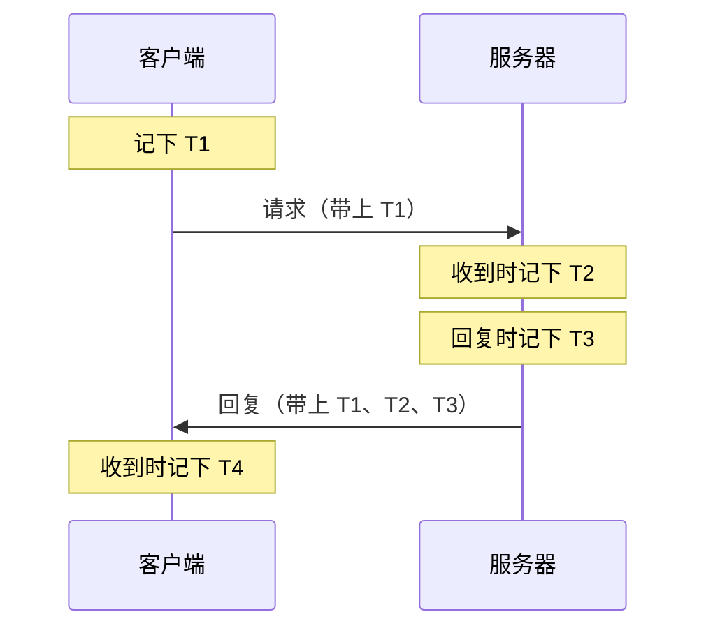
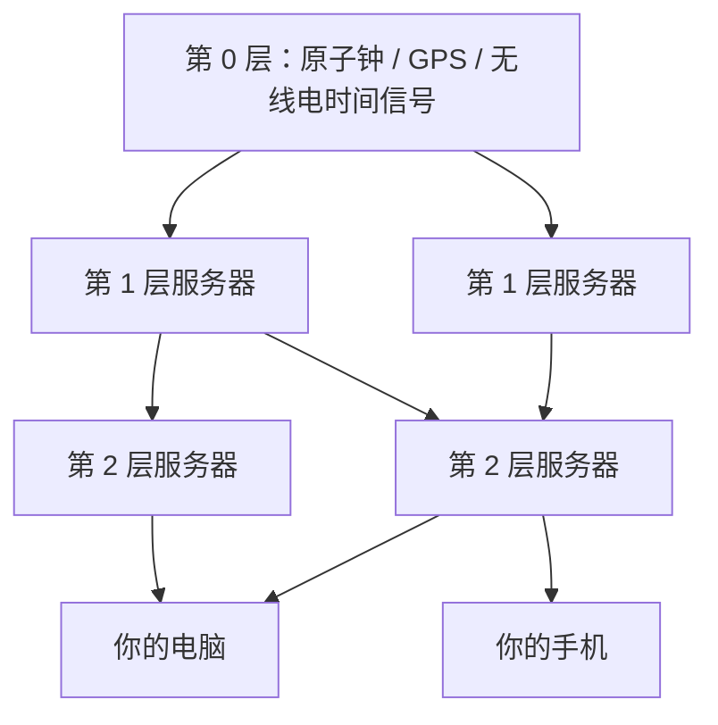

# NTP：是谁在替整个互联网校准时间？

《纽约客》的记者 Nate Hopper 曾去特拉华州郊区拜访一位八十多岁的老人。他们坐在厨房里聊天，隔壁房间不时传来自动报时的声音。老人已经完全失明，手腕上戴着一块会说话的手表，手表靠接收科罗拉多州的无线电信号对时。可他家厨房里，烤箱上的钟和微波炉上的钟对不上。老人叫 David Mills，全世界的电脑、手机、路由器能对上同一个时间，很大程度上要归功于他四十年前开始写的一个协议。给整个互联网校准时间的人，没法让自家厨房里的两只钟走到一起（[《纽约客》：The Thorny Problem of Keeping the Internet's Time](https://www.newyorker.com/tech/annals-of-technology/the-thorny-problem-of-keeping-the-internets-time)）。

这个协议叫网络时间协议（Network Time Protocol，NTP）。今天你的手机开机后几秒钟就知道现在几点，服务器日志里的时间能按先后排好，HTTPS 证书能判断自己有没有过期，靠的基本都是它。美国国家标准与技术研究院（NIST）的授时服务在 2016 年就要每天回答大约 160 亿次时间请求（[NIST](https://www.nist.gov/news-events/news/2016/03/nists-internet-time-service-serves-world)），一个全靠志愿者维持的 NTP Pool 项目说自己在为“数以亿计的系统”提供时间（[ntppool.org](https://www.ntppool.org/en/)）。可它的骨架仍然是 1985 年那一版：跑在 UDP 的 123 端口上，一次问答交换四个时间戳，时间从 1900 年 1 月 1 日开始数秒，服务器按“层”（stratum）一级一级往下传时间，而且默认不做任何认证。

这篇文章想把这四十多年串起来讲一遍：一个在卫星公司当“小领主”的工程师怎样开始给网络对时，一个协议怎样学会在一群说谎的钟里挑出说真话的，“北京时间”为什么产生在陕西临潼，几十万台路由器怎样把一所大学的时间服务器当成了靶子，一个志愿者项目怎样撑起了全世界的公共授时，时间服务器怎样变成了 DDoS 炮台，一个几乎只靠一个人维护的项目怎样在缺钱和分叉里挣扎，每隔几年多出来的那一秒为什么总能让一批网站宕机，以及 2036 年会发生什么。

## 没有共同时间的网络（1977–1985）

1977 年，Mills 加入了通信卫星公司（COMSAT）。他后来形容那里的实验室是一个“沙盒”，上面对他们的要求就一句话：“做点好事。”（[《纽约客》](https://www.newyorker.com/tech/annals-of-technology/the-thorny-problem-of-keeping-the-internets-time)）他在马里兰大学时就开始写一套跑在 DEC PDP-11 上的系统，起了个 Mills 式的名字，叫 Fuzzball；到了 COMSAT，他拿着国防部给 ARPANET 的经费，继续用 Fuzzball 做互联网的路由实验。在此之前，他在爱丁堡大学写过解码短波电台和电报信号的程序，还纯粹出于好玩，研究过电网里的时钟在炎热的夏天会漂移几秒，漂多少又取决于电网烧的是煤还是靠水电。

Mills 天生爱给东西起古怪的名字，也天生爱折腾。他从小患青光眼，视力一直很差；高中老师曾对他说“你永远上不了大学”，他后来在密歇根大学一口气读到了博士（[密歇根大学的悼文](https://eecs.engin.umich.edu/stories/remembering-alum-david-mills-who-brought-the-internet-into-perfect-time)）。他在马里兰大学没拿到终身教职，事后说那是“发生在我身上最好的事”，因为这样他才去了 COMSAT（[《纽约客》](https://www.newyorker.com/tech/annals-of-technology/the-thorny-problem-of-keeping-the-internets-time)）。

Fuzzball 在早期互联网上的名声有点像一群到处乱跑的小动物。BBN 的 Jack Haverty 后来回忆，自治系统（autonomous system）这个今天仍然支撑着全球路由的概念，“不是 Dave 发明的，但是他逼出来的”：Fuzzball 的种种胡闹，迫使他和 Eric Rosen 设计出自治系统和外部网关协议（EGP），好把 BBN 运营的互联网核心和“四处劫掠的 Fuzzies”隔开（[IEEE Internet Computing 的悼文](https://www.computer.org/csdl/magazine/ic/2024/02/10508277/1Wp1SDsJOQE)）。1986 年，美国国家科学基金会的第一代 56 kbps 骨干网 NSFNET，用的正是六台 Fuzzball。

时间问题就是在这些路由器之间冒出来的。Mills 在回忆录里说，NTP 的根可以追溯到 1979 年纽约的全国计算机大会（NCC 79）：那可能是互联网服务第一次通过一条跨大西洋卫星链路公开亮相，网络时间同步技术在那次演示里就已经用上了（[Mills：A Brief History of NTP Time](https://www.eecis.udel.edu/~mills/database/papers/history.pdf)）。每台电脑里都有一块石英晶振在数时间，可晶振会随温度漂移，一天差上几秒是常事；两台机器各数各的，用不了多久就对不上了。

1981 年 4 月，Mills 发布了 [RFC 778](https://www.rfc-editor.org/rfc/rfc778)，“DCNET 互联网时钟服务”，用 ICMP 的时间戳报文在 Fuzzball 组成的 DCNET 里对时。同年，他在 COMSAT 给一台 Fuzzball 接上了 Spectracom 的 WWVB 接收机，直接收听美国国家标准局从科罗拉多发出的无线电时间信号。DARPA 后来买了四台这样的接收机，其中一台如今在波士顿的计算机博物馆里（[Mills 回忆录](https://www.eecis.udel.edu/~mills/database/papers/history.pdf)）。这套时间同步后来被塞进 Fuzzball 的路由协议 Hello（[RFC 891](https://www.rfc-editor.org/rfc/rfc891)），一跑就是很多年。顺带一提，今天人人都在用的 `ping` 也和他有关：1983 年 7 月，美国陆军弹道研究实验室的 Mike Muuss 在挪威的一次 DARPA 会议上，听 Mills 随口讲起他在 Fuzzball 上用计时的 ICMP 回显报文测量路径延迟。那年 12 月，Muuss 碰上实验室网络的怪毛病，想起了这番话，一个晚上写出了 `ping`，发现内核不支持，又顺手把内核支持也写了，天亮前就跑通了。名字取自声呐的回声；后来流传的缩写“Packet InterNet Groper”，据说是 Mills 给配上的（[Muuss：The Story of the PING Program](https://web.archive.org/web/20010107114600/ftp.arl.army.mil/~mike/ping.html)）。

同一时期还有另一条线。1983 年 5 月，Jon Postel 和 Ken Harrenstien 发布了 [RFC 868](https://www.rfc-editor.org/rfc/rfc868)，定义了一个极其简单的时间协议：连上 37 端口，服务器回你一个 32 位整数，表示从 1900 年 1 月 1 日零点起过了多少秒。RFC 里轻描淡写地写了一句：

> 这个基准可以一直用到 2036 年。

1900 这个起点，后来被 NTP 原样继承了下来。那句“用到 2036 年”，要等半个世纪以后才有人认真对待。我们放到文章最后再说。

还有一件同时代的事值得一提。1978 年，Leslie Lamport 发表了[《Time, Clocks, and the Ordering of Events in a Distributed System》](https://lamport.azurewebsites.net/pubs/time-clocks.pdf)。他的论点几乎和 Mills 的工作方向相反：在分布式系统里，你不能指望物理时钟告诉你事件的先后，真正要紧的是“谁先于谁发生”这种因果关系，可以用逻辑时钟来表示。这篇论文后来成了分布式系统的奠基文献。于是从一开始，计算机世界里就有两条路：一条想办法让所有机器的钟尽量一致，一条干脆绕开物理时钟。四十年后，Google 的 Spanner 数据库会把这两条路重新接到一起。

## 四个时间戳，和一群说谎的钟（1985–1992）

1985 年 9 月，Mills 发布了 [RFC 958](https://www.rfc-editor.org/rfc/rfc958)，第一次用上了“Network Time Protocol”这个名字，后来被称作 NTPv0。同年，马里兰大学的 Louis Mamakos 和 Michael Petry 写出了第一个 Unix 实现。Mills 同时发了两份实验报告，[RFC 956](https://www.rfc-editor.org/rfc/rfc956) 和 [RFC 957](https://www.rfc-editor.org/rfc/rfc957)，记录他们在真实网络上测到的东西：以太网上能对到几十毫秒；跨大西洋的链路上误差能压到 100 毫秒以内，可延迟的抖动超过一秒（[Mills 回忆录](https://www.eecis.udel.edu/~mills/database/papers/history.pdf)）。

RFC 958 里的核心算法，一直原封不动地活到了今天的 NTPv4。客户端发出请求时记下自己的时间 T1，服务器收到时记下 T2，回复时记下 T3，客户端收到回复时记下 T4：



有了这四个数，就能算出两件事：

```text
往返延迟  δ = (T4 − T1) − (T3 − T2)
时钟偏差  θ = ((T2 − T1) + (T3 − T4)) / 2
```

这里藏着一个基本假设：去程和回程花的时间一样长。如果不一样，偏差就会算错，而且从两端都看不出来。这是 NTP 永远绕不过去的物理限制，也是后来很多精度问题和攻击的根源。

RFC 958 还有一句话，今天读来格外醒目：

> NTP 不提供对等方发现、获取或认证的机制。数据完整性由 IP 和 UDP 的校验和提供。

也就是说，谁回你一个包，你就信谁。在 1985 年那张彼此都认识的研究网络上，这不是问题。

接下来几年，协议一版接一版地长。1988 年的 [RFC 1059](https://www.rfc-editor.org/rfc/rfc1059) 是 NTPv1，第一次完整描述了客户端和服务器的算法。1989 年的 [RFC 1119](https://www.rfc-editor.org/rfc/rfc1119) 是 NTPv2，加入了控制报文和对称密钥认证；它是第一份用 PostScript 格式发布的 RFC，Mills 自嘲说那是“历史上最不受欢迎的一份文件”，因为几乎没人能打开它。多伦多大学的 Dennis Ferguson 这时写出了新的 Unix 实现，也就是后来 `ntpd` 的前身（[Mills 回忆录](https://www.eecis.udel.edu/~mills/database/papers/history.pdf)）。

NTPv2 发布后，DEC 的数字时间服务（DTSS）团队跟 Mills 吵了一架。DTSS 背后有一个数学上更干净的算法，来自 Keith Marzullo 1984 年在斯坦福的博士论文：如果每个时间源都给出一个“真实时间一定落在这个区间里”的范围，那么大多数区间重叠的那一段，就是真实时间最可能在的地方。DTSS 的人批评 NTP 的选钟过程缺乏形式化的正确性证明。Mills 的回应很干脆，他在回忆录里写道：“秉承互联网偷好点子的优良传统”，他把 Marzullo 算法改造成 NTP 的交集算法，放进了下一版（[Mills 回忆录](https://www.eecis.udel.edu/~mills/database/papers/history.pdf)）。

这就是 NTP 最有意思的地方。它从一开始就假设有些钟会说谎：服务器可能坏了，GPS 接收机可能丢了信号，网络可能突然拥堵。Mills 给这两类钟起了名字，说真话的叫 truechimer，说谎的叫 falseticker。NTP 客户端通常同时问好几台服务器，先用交集算法把 falseticker 剔出去，再从剩下的里面挑出最好的几台来合成时间，最后用一个锁相环式的“时钟纪律”算法慢慢调整本地时钟的频率，而不是一下子把时间拨过去。Vint Cerf 形容 Mills 这套东西是“黑魔法”（[《纽约客》](https://www.newyorker.com/tech/annals-of-technology/the-thorny-problem-of-keeping-the-internets-time)）。Mills 的命名癖好也贯穿了整个代码：用来过滤偶发尖峰的叫“爆米花尖峰抑制器”（popcorn spike suppressor），对付单向拥堵的叫“huff-n'-puff 过滤器”。

1992 年，113 页的 [RFC 1305](https://www.rfc-editor.org/rfc/rfc1305) 定义了 NTPv3。层级结构这时已经定型：直接连着原子钟、GPS 或无线电接收机的服务器是第 1 层，向它们对时的是第 2 层，依此类推，最多到 15 层；第 16 层表示“没有同步”。同年还出现了一个简化版，简单网络时间协议 SNTP（[RFC 1361](https://www.rfc-editor.org/rfc/rfc1361)，后来是 [RFC 2030](https://www.rfc-editor.org/rfc/rfc2030) 和 [RFC 4330](https://www.rfc-editor.org/rfc/rfc4330)），报文格式和 NTP 一样，但省掉了所有复杂的过滤和选择算法，只问一台服务器、拿到时间就用。这个“简化版”后来会被塞进无数廉价设备，惹出一连串麻烦。



认证这件事，在这个阶段撞上了冷战时期的出口管制。NTPv2 的对称密钥认证用的是 DES，而 DES 在美国的武器出口条例（ITAR）下算“军需品”。Mills 在回忆录里记下了当时的办法：DES 的代码本身被加密后放在分发包里，你得证明自己是美国或加拿大居民，才能拿到解密密钥。后来干脆发两套分发包，其中一套是不含 DES 的“政治正确版”；Mamakos 把认证改成了用 MD5（[Mills 回忆录](https://www.eecis.udel.edu/~mills/database/papers/history.pdf)）。

到 1990 年代，NTP 已经跑遍了全世界。Mills 喜欢说：“NTP 上的太阳永不落下。”1997 年他们做过一次调查，找到了超过 38,000 个 NTP 服务器和客户端，其中一个客户端藏在一台打印服务器里。Mills 写道：“下一个大概会在闹钟里找到。”（[Mills 回忆录](https://www.eecis.udel.edu/~mills/database/papers/history.pdf)）他说对了，只是没想到会以那样的方式。

## 时间从哪里来：原子钟、电台和“北京时间”

NTP 只负责把时间传下去。时间本身，得从别处来。

第 1 层服务器之上，是各国的国家时间实验室。它们维护着一组原子钟，产生本国的协调世界时 UTC(k)，再通过卫星互相比对，由国际计量局（BIPM）加权平均出国际原子时（TAI）和 UTC。美国有两家：NIST 和美国海军天文台（USNO）。NIST 在科罗拉多州的柯林斯堡有 WWV 短波台和 WWVB 长波台，就是 Mills 当年接收的那个信号；Mills 晚年手腕上那块会说话的手表，对时用的也是它。1993 年，NIST 的 Judah Levine 提议并写了软件，开办了互联网授时服务。到 2016 年，它每天要回答约 160 亿次请求，其中两台服务器在四周内见到了 3.16 亿个不同的 IP 地址，NIST 估计这至少是当时互联网上 8.5% 的设备（[NIST 新闻稿](https://www.nist.gov/news-events/news/2016/03/nists-internet-time-service-serves-world)，[Levine 等人的论文](https://tf.nist.gov/general/pdf/2818.pdf)）。

中国的标准时间，产生在一个很多人意想不到的地方。“刚才最后一响是北京时间××点整”，这句话里的北京时间，是由陕西西安临潼区骊山脚下的中国科学院国家授时中心产生和保持的（[中国科学院：国家授时中心发展纪实](https://lssf01.cas.cn/lssf/xwhd/cmsm/200910/t20091026_4508645.html)）。

它的来历和冷战、远洋航行、航天都有关系。1966 年 3 月，中国科学院决定在陕西关中筹建授时台，工程代号“326 工程”；同年 11 月 19 日，国家科委批复建设陕西天文台，最后选址在关中平原东北部的蒲城县，位置靠近中国大陆的中部，便于信号覆盖全国。经周恩来总理批准，短波授时台 1970 年 12 月 15 日开始试播，呼号 BPM；1973 年为远洋授时扩建，发射机从 4 台增加到 13 台；1981 年经国务院批准正式发播。为了满足航天测控对微秒级时间的需求，1973 年又批准建设长波授时台 BPL，工程代号“3262 工程”，1983 年大功率长波台开始授时，1986 年通过国家鉴定。长波台让中国陆基无线电授时的精度从毫秒级提高到了微秒级（[国家授时中心发展纪实](https://lssf01.cas.cn/lssf/xwhd/cmsm/200910/t20091026_4508645.html)，[国家授时中心简介](https://ntsc.cas.cn/dwgk/zxjj/)）。

1980 年代初，陕西天文台把时间基准和研究机构迁到临潼，蒲城成了专管发射的二部；2001 年，陕西天文台更名为国家授时中心。它维护的原子时 TA(NTSC) 和协调世界时 UTC(NTSC)，就是通常所说的中国标准时间，并参与国际原子时的计算。按中国科学院 2009 年的介绍，那时的时间基准由 19 台铯原子钟和 4 台氢原子钟组成，与国际 UTC 的偏差保持在 ±20 纳秒以内（[国家授时中心发展纪实](https://lssf01.cas.cn/lssf/xwhd/cmsm/200910/t20091026_4508645.html)）。今天，它也对外提供 NTP 服务，和阿里云、腾讯云等公司的时间服务器一起，承担着国内相当一部分设备的对时（[NTP Pool 论坛上一位中国运营者的描述](https://community.ntppool.org/t/the-issue-of-ntp-requests-exceeding-bandwidth-load/3588)）。

原子钟、电台和卫星听起来无比可靠，但源头出错的事一再发生，而且每一次都会顺着 NTP 的层级一路往下传。

2012 年 11 月 19 日，USNO 的一部分 NTP 服务器在大约 51 分钟里报出的年份是 2000 年。很多企业的 Windows 域控制器照单全收，时钟一下子倒退了 12 年，随后 Active Directory 开始把大量对象当作过期的“墓碑”处理，复制大面积出错。微软事后发布修复说明，给管理员的建议里有一句“别逞英雄”（[SANS ISC](https://isc.sans.edu/diary/14548)，[iTnews](https://www.itnews.com.au/news/microsoft-posts-fix-to-windows-server-year-2000-rollback-324399)）。

2016 年 1 月 26 日，美国空军在让一颗老旧的 GPS 卫星 SVN-23 退役时，给在轨的 15 颗卫星上传了错误的 UTC 修正参数，GPS 广播的 UTC 时间偏了约 13 微秒。13 微秒对人毫无意义，但对依赖 GPS 定时的电信基站和广播网络来说足够触发告警：欧美多地的电信设备告警了大约 12 个小时，英国 BBC 的部分数字广播也受到影响。最早公开报告这个问题的，是 NIST（[NIST 的事件分析](https://tf.nist.gov/general/pdf/2886.pdf)，[BBC](https://www.bbc.com/news/technology-35491962)）。

2025 年 12 月 17 日，科罗拉多州博尔德遭遇强风，NIST 园区断电，备用发电机两天后也出了故障，部分原子钟失去了参考，UTC(NIST) 偏了大约 4.8 微秒。NIST 的 Jeff Sherman 在授时服务的邮件列表里通报了情况，之后几家媒体报道时都引用了同一句话：“时间没有坏。”（[NIST 邮件列表](https://groups.google.com/a/list.nist.gov/g/internet-time-service/c/o0dDDcr1a8I)，[NPR](https://www.npr.org/2025/12/21/nx-s1-5651317/colorado-us-official-time-microseconds-nist-clocks)）对普通用户确实没坏，NTP 本身的误差比这大得多；但它提醒人们，全世界的“标准时间”也只是几栋楼里的一组机器，也会停电。

## 公地悲剧：写死在固件里的地址（2002–2006）

1990 年代末，Mills 在特拉华大学维护着一份公开的 NTP 服务器名单，列出了哪些大学和研究机构愿意免费对外授时。这份名单在研究网络的时代运转良好，直到互联网变成了消费品。

最早公开的一起滥用事件发生在 2002 年 10 月的都柏林圣三一学院。系统管理员 David Malone 发现学院的 Web 服务器被成千上万台 Windows 机器反复请求首页，查了很久才找到元凶：一款叫 Tardis 的共享软件，有一个“通过 HTTP 对时”的模式，读取网页响应头里的日期字段来校准时钟。Tardis 的作者当年扫描了公共 NTP 服务器名单，找出同时开着 Web 服务的主机，把它们写进软件里。圣三一学院那台机器十年前当过公共 NTP 服务器，因为一个误会直到 2000 年才从名单里撤下来。Malone 最后的办法是给 Tardis 返回一个极小的页面，外加一个假日期：1999 年 12 月 31 日 23:59:59。客户端发现时间离谱，大多换了别的服务器（[Malone：Unwanted HTTP: Who Has the Time?](https://www.usenix.org/system/files/login/articles/900/malone.pdf)）。

2003 年 1 月 21 日，Mills 在新闻组发了一封题为“Public servers abuse”的邮件：一家国家实验室要求把自己的服务器从公共名单上撤下，因为被滥用得太厉害了（[LWN 对 NTP Pool 历史的回顾](https://lwn.net/Articles/701222/)）。几天之内，一个叫 Adrian von Bidder 的志愿者想出了一个办法：与其让所有人都盯着名单上那几十台服务器，不如把愿意帮忙的服务器都登记到一个 DNS 名字下面，用轮询的方式把请求摊开。他先在自己的域名下建了 `time.fortytwo.ch`，第二天就改名成了 `pool.ntp.org`（[Linux Journal，2005](https://www.linuxjournal.com/article/8412)）。这就是 NTP Pool 项目的开始，下一节再细讲。

然而更大的麻烦已经在路上了。2003 年 5 月 14 日早上八点左右，威斯康星大学麦迪逊分校的公共时间服务器 `ntp1.cs.wisc.edu` 开始收到异常多的请求，而且越来越多。负责网络的 Dave Plonka 起初以为是 DDoS 攻击，在网络边界上封堵，可流量不但没有像攻击那样消退，反而持续增长，到 6 月已经超过每秒 25 万个包、150 Mbps（[Plonka：Flawed Routers Flood University of Wisconsin Internet Time Server](https://pages.cs.wisc.edu/~plonka/netgear-sntp/)）。

追查下来，源头是 Netgear 的四款家用路由器：DG814、HR314、MR814 和 RP614。它们内置的 SNTP 客户端有两个致命缺陷：一是把威斯康星大学服务器的 IP 地址直接写死在固件里；二是如果没收到回复，就每秒重试一次，永不放弃。更糟的是，这些请求都从固定的源端口 23457 发出，而大学的防火墙一封堵，路由器收不到回复，就会更起劲地每秒重发。这样的路由器一共卖出了 707,147 台。

Plonka 在报告里写了很多耐人寻味的细节。他联系 Netgear 的技术支持，石沉大海，最后只好去猜高管的邮箱地址。有人建议他干脆返回一个错误的时间，让用户发现问题，他拒绝了，理由是那等于故意伤害无辜的用户。他估计这批路由器的“半衰期”大约是五年，也就是说学校得做好长期承受这股流量的准备。事情最后以合作告终：Netgear 发布了新固件，改为查询自家服务器、十分钟一次、失败五次就放弃，并向威斯康星大学捐了 37.5 万美元（[维基百科：NTP server misuse and abuse](https://en.wikipedia.org/wiki/NTP_server_misuse_and_abuse)）。可大多数用户从来不升级路由器固件。十三年后的 2016 年，Plonka 发表了一篇后续论文，发现那些有缺陷的客户端仍然在向学校发请求（[Plonka，2016](https://pages.cs.wisc.edu/~plonka/pubs/IoTSU_2016_paper_25.pdf)）。

几乎同一时间，澳大利亚联邦科学与工业研究组织（CSIRO）也发现，SMC 的约 85,000 台路由器把他们的服务器写死在了固件里。

最有戏剧性的一次发生在丹麦。Poul-Henning Kamp 是 FreeBSD 的核心开发者，写过大量内核代码，也是时间爱好者。他自费运营着 `GPS.dix.dk`，那是当时丹麦唯一公开的第 1 层 NTP 服务器，托管在丹麦互联网交换中心（DIX），原本每年 27,000 丹麦克朗的托管费被免掉了。2005 年，他发现服务器 75% 到 90% 的流量来自 D-Link 的路由器，它们的固件里写死了一长串第 1 层服务器的地址，除了他的服务器，至少还有 43 台明确不允许这类未经许可的使用。DIX 开始要求他每年支付 54,000 克朗。2005 年 11 月他联系 D-Link，对方的法务反过来指控他敲诈。2006 年 4 月 7 日，Kamp 发表了一封公开信，给这种行为起了一个名字：“NTP 破坏行为”（NTP vandalism）（[Kamp 的公开信](https://people.freebsd.org/~phk/dlink/)，[镜像](https://net127.com/2006/04/07/open-letter-to-d-link-about-their-ntp-vandalism/)）。

公开信在技术圈迅速传开。据《Computerworld》报道，那时 D-Link 的设备每天向他发约 300 万个包（[Computerworld](https://www.computerworld.com/article/1593301/time-geek-hopeful-of-deal-with-d-link.html)）。不到三周，4 月 27 日，双方宣布和解，D-Link 在声明里说自己“致力于做一个良好的企业公民和网络公民”。丹麦媒体后来报道，Kamp 拿到了约 20 万丹麦克朗的赔偿（[Computerworld 丹麦版](https://www.computerworld.dk/art/33590/dansk-it-mand-faar-200-000-kr-i-dix-erstatning)）。

这些事件最终改变了协议本身。Mills 对“一个人在掐住整个互联网的脖子”这种指责非常恼火，他在 NTPv4 里加进了一种反制手段，叫“死亡之吻”（Kiss-o'-Death，KoD）：服务器可以回一个特殊的包，告诉客户端“你问得太频繁了，走开”（[《纽约客》](https://www.newyorker.com/tech/annals-of-technology/the-thorny-problem-of-keeping-the-internets-time)）。2006 年 1 月发布的 SNTP 规范 [RFC 4330](https://www.rfc-editor.org/rfc/rfc4330) 写进了 KoD，还专门加了一节，标题就叫“做一个良好的网络公民”（On Being a Good Network Citizen）：不要把服务器地址写死，不要频繁重试，收到 KoD 必须停下来。后来的 [RFC 8633](https://www.rfc-editor.org/rfc/rfc8633) 把这些经验整理成了 NTP 的最佳实践。

苏黎世联邦理工学院（ETH）的 `swisstime.ethz.ch` 则是另一种结局：在每天承受超过 20 GB 的流量多年之后，它在 2012 年限制访问，2013 年干脆关闭了公共服务（[维基百科](https://en.wikipedia.org/wiki/NTP_server_misuse_and_abuse)）。

## 志愿者的池子（2005–2026）

von Bidder 的 `pool.ntp.org` 背后的想法很简单：志愿者把自己的服务器登记进来，项目持续监测每台服务器的准确度和可达性，然后用 DNS 把请求分散到健康的服务器上。你只要在配置里写 `pool.ntp.org`，每次解析得到的都是几台不同的服务器；再细一点，可以写 `cn.pool.ntp.org` 或 `asia.pool.ntp.org`，拿到离你近的那一批。

2005 年 7 月 24 日，von Bidder 把项目交给了 Ask Bjørn Hansen，当时池子里有 363 台服务器（[交接公告](https://news.ntppool.org/2005/07/new-project-maintainer/)，[新闻组邮件](https://groups.google.com/g/comp.protocols.time.ntp/c/zUhqeCtA9iA)）。Hansen 一直维护到今天。2006 年起，项目为设备厂商开设了专门的“厂商区域”，比如 `debian.pool.ntp.org`、`android.pool.ntp.org`，这样厂商既不用写死任何人的地址，项目也能在出事时找到对应的人（[厂商须知](https://www.ntppool.org/en/vendors.html)）。到 2016 年，池子里有约 3,700 台服务器，但仍有 158 个国家区域一台服务器都没有；2011 年的一次估算认为，池子服务着 500 万到 1,500 万个客户端（[LWN](https://lwn.net/Articles/701222/)）。到今天，池子里有 6,000 多台服务器，服务着数以亿计的系统，托管和带宽主要靠 Equinix、NetActuate 等公司赞助（[ntppool.org](https://www.ntppool.org/en/)）。

池子的另一面，是一部持续不断的“被误伤史”。

2016 年 12 月 13 日，Snapchat 发布了一个 iOS 版本，里面用到的开源库 ios-ntp 有一个毛病：它把一组 pool 主机名解析出来之后，向解析到的每一个 IP 地址都发请求，一次同步就是三十多个包。Snapchat 的用户量让这个毛病迅速放大，一些国家区域的流量暴涨到平时的二十倍左右，不少志愿者的服务器被压垮，自动掉出了池子，剩下的服务器承受的压力更大，又有更多掉出去。社区在 12 月 19 日定位到了问题，第二天修复就提交了；Snap 的首席安全官 Jad Boutros 出面道歉，公司还在澳大利亚和巴西的区域里加了自己的服务器（[NTP Pool 社区](https://community.ntppool.org/t/recent-ntp-pool-traffic-increase/18)，[事件总结](https://community.ntppool.org/t/excessive-ntp-query-event-december-2016/46)，[LWN](https://lwn.net/Articles/709874/)）。英国科技媒体 The Register 的标题一如既往地夸张：“Snapchat 的一个代码错误差点毁掉互联网的全部时间”（[The Register](https://www.theregister.com/software/2016/12/21/snapchat-coding-error-nearly-destroys-all-of-time-for-the-internet/1359021)）。

同一个月，在 NANOG 邮件列表上还有一段小插曲。有人讨论公共时间服务该由谁来负责，NTP 参考实现的维护者 Harlan Stenn 说，时间“确实”是由受监管的机构管理的，而且“围绕‘时间’没有任何收入来源”。Hansen 回了一句：“NTF 和 NTP Pool 有什么关系？……NTP Pool 是由志愿者运营的。”（[NANOG，2016 年 12 月](https://seclists.org/nanog/2016/Dec/304)）写协议的人、写参考实现的人、运营公共服务器的人，从来就不是同一拨人，也不总是一条心。

2016 到 2017 年，TP-Link 的一批无线扩展器又重演了 Netgear 的故事：它们每 5 秒向日本福冈大学的 NTP 服务器发一次请求，外加 5 次 DNS 查询，单台设备每月就能产生约 715 MB 的流量。福冈大学的公共服务器后来也关了（[维基百科](https://en.wikipedia.org/wiki/NTP_server_misuse_and_abuse)）。

和中国读者关系最近的，是池子里的中国区。2024 年 11 月，一位中国的服务器运营者在社区论坛发帖求助：他的服务器带宽只有 3 Mbps，在池子里设置了 512 Kbps 的速率上限，可实际涌进来的 NTP 流量峰值超过了 180 Mbps，服务商甚至以为他在遭受 DDoS。他在帖子里解释了原因：中国有数以亿计的智能设备默认把 NTP 服务器设成 `pool.ntp.org`，可中国区只有几百台志愿者服务器；国内带宽又极贵，阿里云上 100 Mbps 的独享带宽每月要七千多元，个人几乎不可能长期承担（[NTP Pool 社区](https://community.ntppool.org/t/the-issue-of-ntp-requests-exceeding-bandwidth-load/3588)）。社区里的人把这种情况称作“服务不足的区域”（under-served zone）：客户端和服务器的比例严重失衡，加进来的服务器很快被压垮、掉线，剩下的更难撑住。

同年秋天，俄罗斯区也塌了。Yandex 的智能音箱等设备大量使用 `ru.pool.ntp.org`，俄罗斯区的可用服务器从一百二三十台掉到只剩九台左右，有人报告自己家里的路由器每秒收到一两百万个包。这次事件的结局相对体面：Yandex 贡献了自己的服务器，并换用了专属的厂商区域（[NTP Pool 社区：Collapse of Russia country zone](https://community.ntppool.org/t/collapse-of-russia-country-zone/3607)）。

二十多年过去，这个故事的结构一直没变：设备厂商把别人的免费服务写进自己的产品里，出货量一大，账单就落到了志愿者头上。

## 当时间变成数据库的一部分（1985–2020）

对大多数人来说，时间差个几十毫秒无关紧要。可对计算机系统来说，时间早就不只是“现在几点了”。

1980 年代 MIT 设计 Kerberos 认证协议时，就要求客户端和服务器的时钟差不能太大，默认是五分钟，超过了票据就会被拒绝，以防止旧的认证消息被重放。后来的 HTTPS 证书、DNSSEC 签名、OAuth 令牌、各种一次性验证码，都有“有效期”这个概念，而有效期能不能判断对，取决于本机时钟准不准。

分布式系统对时间的依赖更深。日志要按时间排序，缓存要按时间过期，分布式锁的租约要按时间续期，数据库要靠时间戳判断两次写入谁先谁后。一旦时钟往回跳，或者两台机器的钟差得太远，这些逻辑就可能悄悄出错：同一把锁被两个人同时持有，新写入的数据被旧数据覆盖。

2012 年，Google 在 OSDI 上发表了 Spanner 数据库的论文，第一次把这两条路接到了一起（[Corbett 等，OSDI 2012](https://www.usenix.org/conference/osdi12/technical-sessions/presentation/corbett)）。Spanner 的 TrueTime 接口不返回一个时间点，而是返回一个区间：“真实时间一定落在 [最早, 最晚] 之间。”这和 Marzullo 算法的思路一脉相承。为了让这个区间尽量窄，Google 在每个数据中心都放了 GPS 接收机和原子钟，把不确定性控制在几毫秒以内。提交一笔事务时，Spanner 会故意等上这个不确定区间那么长的时间再返回，这样就能保证事务的时间戳顺序和真实发生的先后一致。Lamport 说不能依赖物理时钟，Spanner 的回答是：可以，只要你确切知道自己的钟有多不准。

这种需求一路推高了对精度的要求。2020 年，Meta 公开了自己把内部时间服务从 `ntpd` 换成 chrony 的经过，精度从大约 10 毫秒提高到了约 100 微秒（[Meta Engineering，2020](https://engineering.fb.com/2020/03/18/production-engineering/ntp-service/)）。再往上，金融交易、5G 基站、电力系统用的是 IEEE 1588 精确时间协议（PTP），靠网卡和交换机的硬件时间戳做到亚微秒级。NTP 并没有被取代，它仍然负责大多数机器“大致准确”的时间；但在数据中心里，“大致”的标准已经从秒变成了微秒。

也正是分布式系统，让一件原本只有天文学家关心的事，变成了工程师的噩梦。

## 多出来的那一秒：闰秒（1972–2035）

原子钟的秒是恒定的，地球的自转却不是。潮汐摩擦让地球慢慢变慢，地核和地幔的运动、冰川融化又会让它时快时慢。为了让原子时和太阳的东升西落不至于越差越远，从 1972 年起，国际上规定在 UTC 和天文时间 UT1 的差距接近 0.9 秒时，插入一个“闰秒”：那一天的最后一分钟有 61 秒，时钟会显示 23:59:60。到 2016 年底为止，一共插入了 27 次，全是正闰秒，而且每次只提前约半年通知。

对软件来说，23:59:60 是一个不应该存在的时刻。Unix 时间假定每天恰好 86,400 秒，大多数系统的做法是在闰秒时把时钟往回拨一秒，于是同一个时间戳会出现两次。NTP 本身会提前在报文里设置闰秒标志，但每个操作系统内核、每个应用怎么处理这一秒，全凭各自的实现。Mills 在回忆录里说，NTP 对闰秒的处理，最好用“弹球机”来理解（[Mills 回忆录](https://www.eecis.udel.edu/~mills/database/papers/history.pdf)）。

Google 最早吃到苦头。2005 年的闰秒让他们的一些系统出了问题。2008 年，他们发明了一种办法，叫“闰秒涂抹”（leap smear）：不在午夜插入一整秒，而是修改内部的 NTP 服务器，在闰秒前后很长一段时间里让时钟稍微走慢一点，把这一秒悄悄“抹”开。这样所有机器都不会看到 23:59:60，也不会看到时间倒退。2011 年，Google 在官方博客上公开了这个做法（[Google 官方博客，2011](https://googleblog.blogspot.com/2011/09/time-technology-and-leaping-seconds.html)）。

2012 年 6 月 30 日的闰秒，是很多工程师第一次真正意识到这一秒的破坏力。Linux 内核在处理闰秒时有一个 bug：插入闰秒后，内核的高精度定时器会提前触发，大量依赖 futex 等待的程序陷入了空转，CPU 占用率瞬间飙升。基于 Java 的软件受害最深。Reddit 的 Cassandra 集群宕机，Mozilla 的 Hadoop 集群出问题，Gawker、LinkedIn、Yelp、FourSquare 都受到影响；澳大利亚航空使用的 Amadeus 订票系统瘫痪了两个多小时（[Wired](https://www.wired.com/2012/07/leap-second-glitch-explained/)，[《卫报》](http://www.theguardian.com/technology/2012/jul/02/leap-second-amadeus-qantas-reddit)）。有人在内核邮件列表里报告了问题（[LKML](https://lists.openwall.net/linux-kernel/2012/07/01/6)），维护时间子系统的 John Stultz 很快定位并提交了修复（[Stultz 的补丁](https://lkml.iu.edu/1207.0/02318.html)）。当时流传最广的临时解决办法，是在服务器上手动执行一次 `date -s "$(date)"`，把时间重新设一遍。

有了 2012 年的教训，2015 年 6 月 30 日那一次，各方如临大敌。纳斯达克等美国股票交易场所提前半小时结束了当天的盘后交易（[Nasdaq 通知](https://www.nasdaqtrader.com/TraderNews.aspx?id=ETA2015-68)），洲际交易所（ICE）把原定在闰秒前后一小时内发生的开盘等市场状态切换全部推迟（[ICE 通知](https://www.ice.com/publicdocs/futures_us/exchange_notices/LeapSecondNotice4-28-2015.pdf)）。即便如此，网络监测公司 Dyn 的 Doug Madory 还是观察到，闰秒发生时有 2,000 多个网络出现了短暂的路由中断，其中约一半在巴西；BGP 更新在 30 秒里冲到了约 80 万条，持续了大约五分钟。MikroTik 和思科的部分路由器被认为是主要原因（[Wired](https://www.wired.com/2015/07/leap-second-causes-sporadic-outages-across-internet/)，[Computerworld](https://www.computerworld.com/article/1638591/leap-second-causes-internet-hiccup.html)）。

2016 年 12 月 31 日，Cloudflare 中招了。他们用 Go 写的 DNS 服务器 RRDNS 需要测量上游服务器的响应时间，做法是用两次 `time.Now()` 相减。闰秒让系统时间往回退了一秒，相减得到了一个负数，这个负数被传进 `rand.Int63n()`，而这个函数遇到非正数参数会直接 panic。结果 Cloudflare 大约 0.2% 的 DNS 查询和不到 1% 的 HTTP 请求受到影响，直到 UTC 时间早上 6:45 才全部修复。Cloudflare 的事后报告把这件事称为“程序员对时间的一个误解”：他们以为时间只会往前走（[Cloudflare 事后报告](https://blog.cloudflare.com/how-and-why-the-leap-second-affected-cloudflare-dns/)）。这件事也推动了 Go 语言在 1.9 版本给 `time.Time` 加入单调时钟读数，让计算时间差不再受系统时钟跳变的影响（[Go 的设计提案](https://github.com/golang/proposal/blob/master/design/12914-monotonic.md)）。

那年 11 月 30 日，Google 把自己的时间服务器以 `time.google.com` 的名义对公众开放，默认提供涂抹过的时间：闰秒前后各十小时，时钟走慢约 0.0014%（[Google Cloud 博客](https://cloud.google.com/blog/products/gcp/making-every-leap-second-count-with-our-new-public-ntp-servers)）。Google 同时反复提醒：不要把涂抹和不涂抹的服务器混在一起用，因为闰秒期间它们会差出最多半秒，NTP 客户端会以为其中一方在说谎。后来 Google 提出了一个“标准涂抹”：从闰秒当天中午到次日中午，24 小时线性涂抹，AWS 也采用了同样的方案（[Google：Leap Smear](https://developers.google.com/time/smear)）。

涂抹在工程上很实用，在时间计量界却争议很大。它意味着在长达一天的时间里，这些服务器故意给出和官方 UTC 不一致的时间。NIST 的 Judah Levine 对此的评价很不客气：这些公司“都该不吃晚饭就被赶去睡觉”（[《纽约客》](https://www.newyorker.com/tech/annals-of-technology/the-thorny-problem-of-keeping-the-internets-time)）。

争论最终上升到了国际层面。国际电信联盟（ITU）早在 2012 年和 2015 年就讨论过废除闰秒，都没能达成一致。2022 年 7 月，Meta 的工程师发文，标题就叫“是时候把闰秒留在过去了”（[Meta Engineering，2022](https://engineering.fb.com/2022/07/25/production-engineering/its-time-to-leave-the-leap-second-in-the-past/)）。同年 11 月，第 27 届国际计量大会（CGPM）通过第 4 号决议：最迟在 2035 年前，大幅放宽 UT1 与 UTC 之间的允许差值，实际上就是停止插入闰秒（[CGPM 2022 第 4 号决议](https://www.bipm.org/en/cgpm-2022/resolution-4)）。俄罗斯因为 GLONASS 卫星导航系统的设计里包含了闰秒，曾希望推迟到 2040 年，2035 年是妥协的结果。

就在人们讨论废除闰秒的时候，地球又出了新题目。近几年地球自转意外加快，UTC 反而开始跑得比地球慢，人类可能第一次需要一个“负闰秒”：删掉一秒，一分钟只有 59 秒。从来没有哪个系统真正测试过这种情况。加州大学圣地亚哥分校的地球物理学家 Duncan Agnew 在 2024 年 3 月的《自然》上发表论文，估计负闰秒可能在 2029 年前后变得必要，而两极冰盖融化减缓了地球自转的加速，把这个时间点推迟了大约三年（[Agnew，Nature 2024](https://www.nature.com/articles/s41586-024-07170-0)）。

写这篇文章的时候，这件事正走到最后一步。2026 年 10 月 13 日到 15 日，第 28 届国际计量大会将在凡尔赛召开，议程上的 C 号决议草案提议：从 2027 年 5 月 20 日起，UTC 成为连续时间尺度，不再插入闰秒，UT1 与 UTC 的差值上限放宽到 3,600 秒（[CGPM 2026](https://www.bipm.org/en/cgpm-2026)，[C 号决议草案](https://www.bipm.org/documents/d/guest/cgpm-2026-draft-resolution-c-en)，[Markus Kuhn 整理的闰秒资料](https://www.cl.cam.ac.uk/~mgk25/time/leap/)）。如果通过，2016 年 12 月 31 日那一次，大概就是人类历史上最后一个闰秒了。

## monlist：时间服务器变成了炮台（2013–2014）

2013 年 12 月 30 日，一个自称“DERP Trolling”的团体接连打垮了《英雄联盟》、EA、暴雪的战网和 Steam 上的《Dota 2》服务器。他们的目标似乎是一位叫 PhantomL0rd 的游戏主播：只要他在直播里玩哪个游戏，那个游戏的服务器就被打下线。当天稍晚，有人冒充报警，警察冲进了这位主播的家里。这种恶作剧在美国叫“swatting”，攻击者说自己只是“为了好玩”（[BBC](https://www.bbc.com/news/technology-25559048)，[Kotaku](https://kotaku.com/hackers-claim-takedown-of-battle-net-league-of-legends-1491906080)）。

攻击者用的武器，是全世界的 NTP 服务器（[Ars Technica](https://arstechnica.com/information-technology/2014/01/dos-attacks-that-took-down-big-game-sites-abused-webs-time-synch-protocol/)）。

老版本的 `ntpd` 有一个调试用的命令，叫 `monlist`，是 NTP 私有控制协议（mode 7）的一部分，本意是让管理员查看最近有哪些客户端来过。向服务器发一个很小的 `monlist` 请求，它会把最近 600 个客户端的地址全部返回，回应的数据量是请求的几十到几百倍。更要命的是，NTP 跑在 UDP 上，请求的源地址可以随便伪造。攻击者只要把源地址填成受害者的 IP，再向成千上万台开着 `monlist` 的服务器发请求，所有的回应就会一起涌向受害者。这种手法叫“反射放大攻击”。

2014 年 1 月 13 日，美国计算机应急响应小组（US-CERT）发布了针对 CVE-2013-5211 的警报，建议管理员升级到 4.2.7 或以上版本，或者在配置里加上 `restrict default noquery` 关掉查询（[US-CERT TA14-013A](https://www.cisa.gov/news-events/alerts/2014/01/13/ntp-amplification-attacks-using-cve-2013-5211)）。但放大器还在，攻击反而越来越大。

2014 年 2 月 10 日，Cloudflare 的一个客户遭到了接近 400 Gbps 的 NTP 放大攻击，是当时有记录以来最大的 DDoS 之一。CEO Matthew Prince 三天后发文披露了细节：攻击者只用了分布在 1,298 个网络上的 4,529 台 NTP 服务器，放大倍数约 206 倍。作为对比，一年前 Spamhaus 遭受的 300 Gbps DNS 放大攻击，用了 30,956 台开放 DNS 解析器。攻击的一部分来源恰恰是法国的托管商 OVH，而 OVH 同时也是这类攻击的受害者。Prince 在文章里写：“我个人很想和当初添加 MONLIST 命令的那个人聊聊。”文章最后他还留了一句：“如果你觉得 NTP 已经够糟了，等着看 SNMP 吧，它的放大倍数能到 650 倍。”（[Cloudflare](https://blog.cloudflare.com/technical-details-behind-a-400gbps-ntp-amplification-ddos-attack/)）

学术界随后做了完整的统计。密歇根大学的 Jakub Czyz 等人在 IMC 2014 上发表的论文《驯服 800 磅的大猩猩》发现，四个月前 NTP 还只占全球互联网流量的 0.001%，到 2014 年 2 月中旬已经涨到约 1%；他们探测到的放大器总共有 220 万个不同的 IP，其中有少数“超级放大器”，对一个小小的探测包能回上 GB 的数据，最大的一台在一天的采样里回了超过 136 GB。受害者有 43.7 万个 IP，挨了至少 3 万亿个包、总量超过 1 PB。讽刺的是，研究者能还原出受害者名单，靠的正是 `monlist` 返回的那些客户端列表。好消息是，在社区的集中清理下，放大器从 1 月初的约 140 万个降到了 4 月 18 日的约 11 万个，减少了 92%（[Czyz 等，IMC 2014](https://mdbailey.ece.illinois.edu/publications/imc14-ddos.pdf)）。

对 NTP 的维护者来说，这件事最刺痛的地方在于：修复早就有了。2014 年 2 月 14 日，Harlan Stenn 在 NTF 的网站上发文说，禁用 `monlist` 的改动早在 2010 年 4 月 24 日就进了代码库，只是大量服务器从来不升级。他写道，这是 NTP 二十多年来第一次被大规模滥用，然后话锋一转，提到了钱：“目前没有人拿钱干这个活。还没有。”他问读者：“让你的电脑有正确的时间，对你来说值不值一年一美元？”（[NTF：NTP and the Winter of 2013 Network DRDoS Attacks](https://www.nwtime.org/news/ntp-winter-2013-network-drdos-attacks/)）

## 守夜人的账单，和一次分叉（2011–2017）

Harlan Stenn 1956 年出生。1990 年代中期，Mills 把发布新版本的工作交给了他；那时 Stenn 在一家保险公司上班，职责主要是系统出故障时有人在场，于是他把大部分工作时间都花在了 NTP 上。又过了十年，他得到 Mills 的同意，全面接管了参考实现。两人经常吵架，合作了几十年，却从没见过面，全靠 Mills 的文档和电话（[《纽约客》](https://www.newyorker.com/tech/annals-of-technology/the-thorny-problem-of-keeping-the-internets-time)）。Mills 从 1986 年起在特拉华大学当了二十二年教授，写协议、写论文；Stenn 在俄勒冈州的一个小镇上处理 bug、合并补丁、回答邮件。他说自己有时也看不懂 NTP 里最复杂的那些函数，称 Mills 是“超级天才”。

NTP 项目有一个在开源世界里很常见的问题：几乎所有人都在用它，几乎没有人为它付钱。Mills 本人是典型的“仁慈独裁者”，一位老合作者说他“不肯容忍傻瓜”。Poul-Henning Kamp 1990 年代末刚认识他时，觉得他像一个“快活的老精灵，满肚子智慧和有趣的故事”，但越接近协议核心的算法，他越难被说服：“跟 Dave 打交道，你得爬一座很陡的山。”光拿出一个能修好问题的补丁不够，Mills 想要的是证明（[《纽约客》](https://www.newyorker.com/tech/annals-of-technology/the-thorny-problem-of-keeping-the-internets-time)）。Mills 自己也不讳言。2005 年，他在 NTP 邮件列表里写道：“大多数人认为我有点像个老顽固，我先为自己的缺点道个歉。”老顽固（curmudgeon）这个词还被他拼错了。紧接着他又说，这只“猴子”的设计背后有“真正重要的原则”。

2011 年，Stenn 成立了网络时间基金会（Network Time Foundation，NTF），想给项目找一个稳定的资金来源。基金会的英文名里特意省掉了“The”，颇有 Mills 的风格。据《纽约客》2022 年的报道，基金会每年靠捐款筹到大约 30 万美元，用来支付兼职人员的薪水，以及 Stenn 自己的网费、电费和买菜钱；66 岁的 Stenn 说，他已经花光了自己的退休储蓄。

2014 年 4 月的 Heartbleed 漏洞让整个行业意识到，OpenSSL 这种关键基础设施背后只有寥寥几个没拿钱的人。Linux 基金会随即成立了核心基础设施计划（CII），开始资助这类项目，NTP 也在名单上。2015 年 3 月，《InformationWeek》的 Charles Babcock 写了一篇报道，标题是“NTP 的命运系于‘时间老人’一身”。文章里的 Stenn 59 岁，住在俄勒冈州的塔伦特，过去三年半里每周工作超过 100 小时；CII 每月给他 7,000 美元，而他说如果到 4 月还筹不到更多钱，就只能去找一份正经工作了。企业赞助者只有六家。他讲了一个故事：苹果曾在他推迟发布一个补丁后找上门来，他顺势请苹果捐点钱。他说：“人人都爱我们……然后说，‘我们不给开源项目捐钱。’”（[InformationWeek，2015 年 3 月](https://www.informationweek.com/it-leadership/ntp-s-fate-hinges-on-father-time-)）报道发出后，72 位读者一共捐了 4,104 美元（[InformationWeek 后续](https://www.informationweek.com/it-infrastructure/ntp-needs-money-is-a-foundation-the-answer-)），Linux 基金会随后把对他的资助续了一年（[InformationWeek](https://www.informationweek.com/it-infrastructure/linux-foundation-funds-ntp-s-father-time-)）。

就在这个时候，另一拨人决定自己动手。2015 年 6 月，互联网民权教育研究所（ICEI）的 Susan Sons 和开源运动的老将 Eric S. Raymond 从 NTP 的代码库分叉出了 NTPsec。按 Raymond 的说法，他们是“非常不情愿地”分叉的（[Raymond：NTPsec: a Secure, Hardened NTP Implementation](https://www.linuxjournal.com/content/ntpsec-secure-hardened-ntp-implementation)）。

两边对发生了什么，说法几乎完全相反。2017 年 2 月，LWN 的 Bruce Byfield 写了一篇《NTP 世界的裂痕》，把双方的话都摆了出来（[LWN：A rift in the NTP world](https://lwn.net/Articles/713901/)）。Sons 在 OSCON 上做过一场题为“拯救时间”的演讲，说她接触 NTP 时发现项目丢了构建服务器的 root 密码，代码落后了十六年，开发者“比我父亲还老，早该退休了”，她当时的感觉是“如果我不修好它，互联网就要塌了”。Stenn 的回应是，root 密码的说法“完全是捏造”，而且“拯救和提供帮助是两回事”。

争议里最实际的一条，是版本控制系统。NTP 当时还在用商业软件 BitKeeper，这在 2015 年已经很少见了，也让外人很难参与。Raymond 说，把代码历史从 BitKeeper 迁移到 Git 花了他十周，还得先改写 Andrew Tridgell 当年逆向 BitKeeper 时写的 SourcePuller 工具；BitKeeper 在 2016 年 5 月开源，他评价说“太晚了”。这件事本身就有一段前史：2005 年 Tridgell 逆向 BitKeeper，导致 Linux 内核失去了 BitKeeper 的免费授权，Linus Torvalds 才一怒之下写出了 Git。

NTPsec 的做法是大刀阔斧地删代码。他们引用圣埃克苏佩里的话作为座右铭：完美不是无可增加，而是无可删减。mode 7 控制协议、Autokey 认证、SNMP 支持、为老式 Unix 准备的各种兼容层，统统被删掉；构建系统从 autoconf 换成了 waf。Sons 说代码从约 22.7 万行减到了约 7.4 万行，后来披露的漏洞里有一半以上 NTPsec 天然免疫。Raymond 在文章里称赞 Mills “曾是一位杰出的系统架构师”，也说这些删减需要“外科手术般的勇气”（[Linux Journal](https://www.linuxjournal.com/content/ntpsec-secure-hardened-ntp-implementation)）。

Stenn 则认为这种做法对基础设施是危险的。他在 LWN 的文章里说：“这不是一个民主的过程，这是一个科学的过程。”又说：“‘创造性破坏’……是提供互联网核心基础设施的一种可怕方式。”

分叉的另一个后果，是两边在争同一笔钱。2016 年 9 月，NTPsec 失去了 CII 的资助。2017 年，Mozilla 的开源安全基金和 CII 请安全公司 Cure53 对三个 NTP 实现做了审计：`ntpd`、NTPsec，以及第三个一直在旁边默默发展的 chrony。结果出人意料：chrony 只被发现两个低危问题，审计报告称它的代码“出奇地优雅”，是“明显的赢家”（[Linux 基金会](https://www.linuxfoundation.org/blog/blog/cii-audit-identifies-secure-ntp-implementation)，[LWN](https://lwn.net/Articles/735211/)）。NTPsec 在 2017 年 10 月发布了 1.0 版本，一直维护到今天。

chrony 的故事几乎是这场争吵的反面。它没有从 `ntpd` 的代码分叉，而是从零写起的，最初由 Richard Curnow 为不常联网的 Linux 机器编写，更看重用更少的数据更快地把时钟对准，那些很少有人用的工作模式干脆不做。后来它由捷克开发者 Miroslav Lichvar 在红帽长期维护。Stenn 称 Lichvar 是个“巫师”，另一位社区成员的评价是：“他极其安静，没人认识他。”他对 IETF 里 NTP 工作组的描述也很低调：只是“一群通常很难达成共识的普通人”（[《纽约客》](https://www.newyorker.com/tech/annals-of-technology/the-thorny-problem-of-keeping-the-internets-time)）。红帽从 RHEL 7 开始默认使用 chrony，到 RHEL 8 干脆移除了 `ntpd`（[Red Hat Bugzilla](https://bugzilla.redhat.com/show_bug.cgi?id=1417031)）。Meta 在 2020 年也换到了 chrony。Ubuntu 25.10 用带 NTS 的 chrony 替代了原来的 systemd-timesyncd（[Ubuntu 博客](https://ubuntu.com/blog/ubuntu-25-10-security-updates)）；到了 2026 年 3 月，Canonical 又宣布计划把用 Rust 写的 ntpd-rs 作为未来版本的默认时间服务，Let's Encrypt 早在 2024 年就已经在生产环境里用上了它（[Ubuntu 社区公告](https://discourse.ubuntu.com/t/ntpd-rs-its-about-time/79154)）。

Mills 的参考实现仍然在 NTF 的维护下，Stenn 也还在。IETF 里制定 NTPv5 的小组靠共识做决定，而 Stenn 在《纽约客》的采访里说：“我的目标不是建立共识，我的目标是做出质量最好的计时软件。”Mills 晚年在社区里的影响力已经很小了。2020 年秋天，他把一篇重新思考 NTP 基本原则的论文发给工作组，几个月都没收到像样的回应。他对此并不意外：“我被当成一个老古董。我二十几岁当教授时，学生觉得我是他们中的一员；接下来二十年，我是他们的父亲，是个坏人；再接下来二十年，我是个可以被无视的老头。”（[《纽约客》](https://www.newyorker.com/tech/annals-of-technology/the-thorny-problem-of-keeping-the-internets-time)）NIST 在 2016 年的一项统计显示，仍有约一半的客户端在使用早就过时的 NTPv3（[NTF](https://www.nwtime.org/news/outdated_versions_of_ntp_leaving_users_vulnerable/)）。

## 默认不设防：时间的安全与信任（1985–2026）

回到 RFC 958 里那句话：“NTP 不提供认证。”四十年来，这个缺口一直没有完全补上。

NTPv2 起有了对称密钥认证，可对称密钥的问题在于怎么把密钥交给成千上万个客户端。Cloudflare 在 2019 年的一篇博客里提到，NIST 当时为认证 NTP 分发密钥的方式，是美国邮政寄信或者传真（[Cloudflare：Secure Time](https://blog.cloudflare.com/secure-time/)）。NTPv4 设计了一套基于公钥的方案 Autokey（[RFC 5906](https://www.rfc-editor.org/rfc/rfc5906)），可它后来被证明存在严重缺陷，几乎没人部署。

时间和安全之间还有一个先有鸡还是先有蛋的问题。Mills 在回忆录里写：安全的计时需要安全的密码学手段，而安全的密码学手段又需要可靠的有效期判断（[Mills 回忆录](https://www.eecis.udel.edu/~mills/database/papers/history.pdf)）。说白了，要验证 HTTPS 证书有没有过期，你得先知道现在几点；可要安全地知道现在几点，你又得先能验证证书。

2015 年，波士顿大学的 Aanchal Malhotra、Isaac Cohen、Erik Brakke 和 Sharon Goldberg 把 NTP 的攻击面系统地梳理了一遍，论文在 2016 年的 NDSS 上发表（[Attacking the Network Time Protocol](https://www.cs.bu.edu/~goldbe/papers/NTPattacks.html)）。最讽刺的一个攻击用的正是 KoD：因为 KoD 包没有认证，攻击者不需要站在中间，只要伪造一个“你问得太频繁了”的包，就能让客户端停止对时，停几天甚至几年都有可能（CVE-2015-7704）。他们还演示了如何利用 IP 分片让客户端的时间偏移。他们讨论的后果包括：让 HTTPS 客户端接受已经过期或被吊销的证书，让 DNSSEC 缓存失效，干扰比特币节点。几乎同时，西班牙研究者 Jose Selvi 发布了一个叫 Delorean 的工具，名字取自《回到未来》里的时间机器，专门用来伪造 NTP 回应（[Ars Technica](https://arstechnica.com/information-technology/2015/10/new-attacks-on-network-time-protocol-can-defeat-https-and-create-chaos/)）。

Malhotra 后来加入了 Cloudflare。2019 年 6 月，Cloudflare 上线了 `time.cloudflare.com`，支持一种新的认证机制：网络时间安全（Network Time Security，NTS）。她在博客里讲了自己为什么关心这件事：研究 RPKI 的安全性时，她发现只要把受害者的时钟往回拨，一个本该失败的攻击就能成功（[Cloudflare](https://blog.cloudflare.com/secure-time/)）。NTS 的思路是先用 TLS 握手（默认在 4460 端口）交换密钥，再用这些密钥给后续的 NTP 包做认证，服务器不需要为每个客户端保存状态。2020 年 9 月，NTS 正式发布为 [RFC 8915](https://www.rfc-editor.org/rfc/rfc8915)。不过鸡和蛋的问题仍在：TLS 握手本身要验证证书，一台刚开机、时钟停在 1970 年的树莓派（它没有带电池的实时时钟），第一次就过不了这一关。Ubuntu 在默认启用 NTS 时，社区里就有人提出了这个问题（[Ubuntu 社区](https://discourse.ubuntu.com/t/ntpd-rs-its-about-time/79154)）。

另一条路是 Google 的 Roughtime。2016 年，Adam Langley 等人设计了这个协议，它不追求毫秒级精度，只追求“大致正确、而且可证明”：服务器对时间签名，客户端可以把多台服务器的回应串成一条链，一旦某台服务器撒谎，就能拿出密码学证据（[Roughtime](https://roughtime.googlesource.com/roughtime/+/master/README.md)，[Cloudflare](https://blog.cloudflare.com/roughtime/)）。它取代的是之前的 tlsdate，一个从 TLS 握手里读取服务器时间的工具。Google 当时的数据很能说明问题：Chrome 里约四分之一的证书错误是用户的时钟不对造成的，有 6.7% 的时钟慢了一天以上（[Wired](https://www.wired.com/story/clouldflare-google-roughtime-sync-clocks-security/)）。Roughtime 至今仍在 IETF 走标准化流程（[IETF 草案](https://datatracker.ietf.org/doc/draft-ietf-ntp-roughtime/)）。

tlsdate 的思路，后来在 Windows 身上闹出了一个大乌龙。2016 年起，Windows 引入了一个叫“安全时间播种”（Secure Time Seeding）的功能，在没有可靠时间源时，从 TLS 握手里的时间字段推算当前时间。可 OpenSSL 早在 2014 年就把这个字段改成了随机数，以减少指纹追踪。2023 年 8 月，Ars Technica 报道了一连串怪事：一位挪威工程师的服务器时间突然跳了 55 天，导致电话号码迁移系统出错，“孩子们打不通父母的电话”；另一位管理员看到服务器的时间变成了 2159 年。微软的 Ryan Ries 早年在一篇介绍这个功能的博客里写过一句俏皮话：时间问题“迟早会（眨眼）咬你一口”（[Ars Technica，2023](https://arstechnica.com/security/2023/08/windows-feature-that-resets-system-clocks-based-on-random-data-is-wreaking-havoc/)）。

时间的源头本身，也成了国家间对抗的目标。2025 年 10 月 19 日，中国国家安全部披露，美国国家安全局（NSA）长期对国家授时中心实施网络攻击：据通报，2022 年 3 月起，攻击者利用某境外品牌手机短信服务的漏洞，控制了授时中心十余名工作人员的手机；2023 年 4 月起，利用窃取的登录凭证入侵内部网络；2023 年 8 月到 2024 年 6 月间，先后使用了 42 款网络攻击武器，企图渗透高精度地基授时系统，攻击大多选在北京时间深夜到凌晨进行。这是中国官方的指控和归因，美方没有公开回应技术细节（[央视新闻](https://news.cctv.cn/2025/10/19/ARTIaZSx9eSNSZJnzggQKZYR251019.shtml)，[CNCERT 技术报告](https://www.cert.org.cn/publish/main/49/2025/20251019142622914870997/20251019142622914870997_.html)，[新华网](https://www.news.cn/politics/20251019/fde66a9e067642cb843bc0b25b20ef5d/c.html)）。无论细节如何，这件事说明了一点：当通信、电力、金融和导航都依赖同一个时间基准时，这个基准本身就成了关键基础设施。

## 2036：一个 1983 年埋下的数字

最后说回 RFC 868 里那句“这个基准可以一直用到 2036 年”。

NTP 的时间戳是 64 位：前 32 位是从 1900 年 1 月 1 日起的秒数，后 32 位是秒的小数部分，分辨率约 232 皮秒。32 位无符号整数最多能数到约 43 亿秒，也就是 136 年。所以，在 UTC 时间 2036 年 2 月 7 日 06:28:16，这个秒数会从最大值回绕到 0。

这和有名的 2038 年问题是一类事。Unix 时间从 1970 年开始数秒，用的是 32 位有符号整数，会在 2038 年 1 月 19 日溢出。NTP 的起点更早，却因为用了无符号数，反而早两年到期。

NTP 的设计者早就想到了这一点。SNTP 规范 [RFC 4330](https://www.rfc-editor.org/rfc/rfc4330) 给了一个简单的约定：看秒数的最高位。自 1968 年以来这一位一直是 1；如果收到的时间戳最高位是 1，就按 1900 年起算，表示 1968 到 2036 年之间的时间；如果是 0，就认为已经过了回绕点，按 2036 年 2 月 7 日 06:28:16 起算，这样能一直用到 2104 年。

2010 年的 NTPv4 规范 [RFC 5905](https://www.rfc-editor.org/rfc/rfc5905) 则引入了“纪元”（era）的概念：从 1900 年开始的第一个 136 年是第 0 纪元，2036 年 2 月 7 日开始第 1 纪元。它还定义了一个 128 位的日期格式，包含 32 位的纪元编号和 32 位的纪元内偏移。问题在于，纪元编号并不在 NTP 报文里传输，RFC 5905 写得很清楚：纪元“无法由 NTP 直接产生”。客户端只能靠自己的时钟来判断现在大概是哪个纪元，前提是它的时钟和真实时间的差距不超过 68 年；如果实现里用的是 64 位整数运算，这个安全范围还要缩小到 34 年。

这就是那些没有实时时钟电池的设备真正的隐患。一台树莓派、一台路由器或者一个物联网设备开机时，时钟可能停在 1970 年，也可能停在固件编译的那一天。到了 2036 年以后，如果它离真实时间太远，而软件又没有正确处理纪元，它就可能把收到的时间算到 1900 年去。好在不少现代实现已经会拿软件的编译时间或文件系统里留下的时间作为下限，来帮助判断当前处在哪个纪元。

正在制定中的 NTPv5 把这个问题彻底解决了。按照 Lichvar 和 Tal Mizrahi 维护的最新草案，NTPv5 的报文里会直接交换纪元编号，把无歧义的时间范围从 136 年扩展到大约 35,000 年。同一份草案还引入了“时间尺度”字段，服务器可以明确声明自己给的是 UTC、TAI、UT1，还是涂抹过的 UTC，Google 当年那个“别混用”的警告，终于有了协议层面的答案。NTPv5 只保留客户端和服务器模式，而且刻意不再规定具体的时钟过滤和选择算法，把这些留给各个实现（[draft-ietf-ntp-ntpv5](https://datatracker.ietf.org/doc/draft-ietf-ntp-ntpv5/)）。它还是一份草案，而它要取代的 NTPv4，已经用了十六年。

## 尾声

2024 年 1 月 17 日，David Mills 在特拉华州纽瓦克去世，享年 85 岁（[《华盛顿邮报》](https://www.washingtonpost.com/obituaries/2024/01/26/david-mills-network-time-protocol-internet-obituary/)，[特拉华大学](https://www.udel.edu/udaily/2024/march/in-memoriam-david-mills-network-time-protocol/)）。他写过 28 份 RFC，2013 年获得了 IEEE 互联网奖。在回忆录里，他把 NTP 称作“互联网上运行时间最长、持续不断运转的分布式应用”；他把计时这件事比作业余无线电，是一种可以玩一辈子的爱好（[Mills 回忆录](https://www.eecis.udel.edu/~mills/database/papers/history.pdf)）。《纽约客》的记者拜访他时，他还在修改那篇没人回应的论文，而且担心找不到人帮他编辑，也不指望社区里有多少人会读。记者问他，那为什么还要写。他的回答借用了登山家那句老话：“因为它就在那里。我喜欢把自己做的东西改得更好。”

回头看，今天的 NTP 身上还背着不少 1980 年代的行李：从 1900 年开始数的秒，那个 2036 年要回绕的 32 位字段，默认不认证的 UDP 报文，还有“谁回我一个包我就信谁”的初始假设。它也留下了一些当年谁都没想到的东西：一个靠志愿者撑了二十多年的公共服务器池子，一套在一群说谎的钟里挑出真话的算法，以及一个开源世界里反复出现的问题：大家都在用的东西，到底该由谁来养。

也许 2026 年 10 月的凡尔赛会议之后，闰秒将成为历史；也许 NTPv5 终有一天会发布，把纪元编号直接写进报文里。但总会有一台路由器把某个志愿者的地址写死在固件里，总会有一个程序员以为时间只会往前走，也总会有几个没见过面的人，在世界的不同角落，替所有人把钟对准。

## 时间线速览

| 年份 | 事件 |
| --- | --- |
| 1966 | 中国科学院启动“326 工程”，筹建陕西天文台 |
| 1970 | 中国 BPM 短波授时台试播 |
| 1972 | 开始实行闰秒 |
| 1977 | Mills 加入 COMSAT |
| 1978 | Lamport 发表逻辑时钟论文 |
| 1979 | NCC 79 跨大西洋卫星演示，NTP 的技术源头 |
| 1981 | RFC 778 DCNET 时钟服务；Fuzzball 接上第一台 WWVB 无线电时钟；BPM 正式发播 |
| 1983 | RFC 868 时间协议，以 1900 年为起点，“可以用到 2036 年”；Muuss 写出 `ping`；BPL 长波授时台开始授时 |
| 1985 | RFC 958，NTP 诞生；马里兰大学写出第一个 Unix 实现 |
| 1986 | 六台 Fuzzball 组成第一代 NSFNET 骨干网；Mills 到特拉华大学任教；BPL 通过国家鉴定 |
| 1988 | NTPv1（RFC 1059） |
| 1989 | NTPv2（RFC 1119）；与 DEC DTSS 的争论 |
| 1992 | NTPv3（RFC 1305）；SNTP（RFC 1361） |
| 1993 | NIST 开办互联网授时服务 |
| 2001 | 陕西天文台更名为中国科学院国家授时中心 |
| 2002 | Tardis 软件滥用都柏林圣三一学院的 Web 服务器 |
| 2003 | Mills 发文抱怨公共服务器被滥用；NTP Pool 诞生；Netgear 路由器淹没威斯康星大学 |
| 2005 | Ask Bjørn Hansen 接手 NTP Pool；Google 首次遭遇闰秒问题 |
| 2006 | Kamp 发表致 D-Link 公开信并和解；RFC 4330 引入 KoD |
| 2008 | Google 发明闰秒涂抹 |
| 2010 | NTPv4（RFC 5905）引入纪元概念；`monlist` 的修复进入代码库 |
| 2011 | Stenn 成立网络时间基金会 |
| 2012 | 闰秒导致 Reddit、澳航等宕机；USNO 服务器报出 2000 年；Spanner 论文发表 |
| 2013–2014 | `monlist` 放大攻击；DERP 攻击游戏服务器；Cloudflare 遭 400 Gbps 攻击 |
| 2015 | 《InformationWeek》报道 Stenn 的困境；NTPsec 分叉；闰秒导致 2,000 多个网络短暂中断；BU 团队发表 NTP 攻击研究 |
| 2016 | GPS 13 微秒异常；Roughtime；Snapchat 冲击 NTP Pool；Google 公共 NTP 上线；最后一次闰秒导致 Cloudflare DNS 故障 |
| 2017 | Cure53 审计，chrony 胜出；NTPsec 1.0；LWN《NTP 世界的裂痕》 |
| 2019 | Cloudflare 上线支持 NTS 的公共时间服务 |
| 2020 | NTS 成为 RFC 8915；Meta 换用 chrony |
| 2022 | CGPM 决定 2035 年前停止闰秒；《纽约客》报道 Mills |
| 2023 | Windows 安全时间播种引发时钟乱跳 |
| 2024 | Mills 去世；《自然》论文预测负闰秒；NTP Pool 俄罗斯区崩溃，中国区运营者求助 |
| 2025 | NIST 博尔德断电，UTC(NIST) 偏移约 4.8 微秒；中国披露 NSA 攻击国家授时中心；Ubuntu 25.10 默认启用 NTS |
| 2026 | Canonical 宣布计划默认使用 ntpd-rs；NTPv5 草案持续推进；10 月 CGPM 表决取消闰秒 |
| 2036 | 2 月 7 日 06:28:16 UTC，NTP 第 0 纪元结束 |

## 延伸阅读

正文里的链接都指向原始出处，下面几份值得从头读一遍：

- David Mills，[A Brief History of NTP Time: Confessions of an Internet Timekeeper](https://www.eecis.udel.edu/~mills/database/papers/history.pdf)。设计者本人写的 NTP 史，充满了 Mills 式的双关和怪词。
- Nate Hopper，[The Thorny Problem of Keeping the Internet's Time](https://www.newyorker.com/tech/annals-of-technology/the-thorny-problem-of-keeping-the-internets-time)，《纽约客》，2022。Mills、Stenn、Lichvar 和闰秒之争，写得最有人情味的一篇。
- [RFC 958](https://www.rfc-editor.org/rfc/rfc958) 和 [RFC 5905](https://www.rfc-editor.org/rfc/rfc5905)。一个是起点，一个是现行标准，对照着读能看出四十年里改了什么、没改什么。
- Dave Plonka，[Flawed Routers Flood University of Wisconsin Internet Time Server](https://pages.cs.wisc.edu/~plonka/netgear-sntp/)。Netgear 事件的完整技术报告，也是一份如何冷静处理厂商事故的范本。
- Poul-Henning Kamp，[Open letter to D-Link about their NTP vandalism](https://people.freebsd.org/~phk/dlink/)，2006。
- LWN，[The NTP Pool Project](https://lwn.net/Articles/701222/)，2016。NTP Pool 的来历和运作方式。
- Matthew Prince，[Technical Details Behind a 400Gbps NTP Amplification DDoS Attack](https://blog.cloudflare.com/technical-details-behind-a-400gbps-ntp-amplification-ddos-attack/)，2014。
- Czyz 等，[Taming the 800 Pound Gorilla: The Rise and Decline of NTP DDoS Attacks](https://mdbailey.ece.illinois.edu/publications/imc14-ddos.pdf)，IMC 2014。
- Bruce Byfield，[A rift in the NTP world](https://lwn.net/Articles/713901/)，LWN，2017，以及 Eric S. Raymond 的 [NTPsec: a Secure, Hardened NTP Implementation](https://www.linuxjournal.com/content/ntpsec-secure-hardened-ntp-implementation)。分叉双方的说法对照着读。
- Charles Babcock，[NTP's Fate Hinges On 'Father Time'](https://www.informationweek.com/it-leadership/ntp-s-fate-hinges-on-father-time-)，InformationWeek，2015。一个人维护基础设施是什么样子。
- Cloudflare，[How and why the leap second affected Cloudflare DNS](https://blog.cloudflare.com/how-and-why-the-leap-second-affected-cloudflare-dns/)，2017。闰秒故障最清晰的一份事后复盘。
- Google，[Leap Smear](https://developers.google.com/time/smear)。各种涂抹方案的对比。
- Malhotra 等，[Attacking the Network Time Protocol](https://www.cs.bu.edu/~goldbe/papers/NTPattacks.html)，NDSS 2016，以及 Cloudflare 的 [Secure Time](https://blog.cloudflare.com/secure-time/)。NTP 安全问题和 NTS 的来龙去脉。
- 中国科学院，[钦若昊天 敬授民时：国家授时中心发展纪实](https://lssf01.cas.cn/lssf/xwhd/cmsm/200910/t20091026_4508645.html)。“北京时间”是怎么来的。
- BIPM，[第 28 届国际计量大会](https://www.bipm.org/en/cgpm-2026) 与 Markus Kuhn 整理的[闰秒资料](https://www.cl.cam.ac.uk/~mgk25/time/leap/)。闰秒存废的最新进展。
- [draft-ietf-ntp-ntpv5](https://datatracker.ietf.org/doc/draft-ietf-ntp-ntpv5/)。NTP 的下一个版本长什么样。
