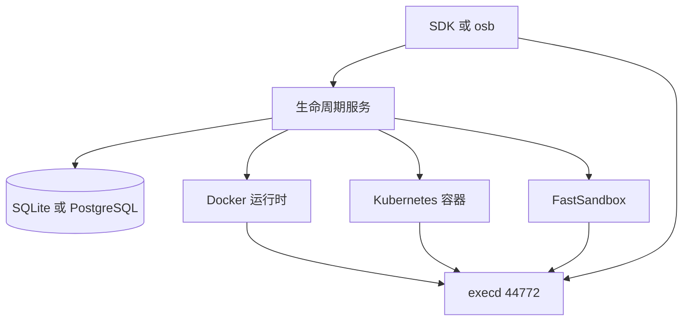

# OpenSandbox：给 Agent 用的统一沙箱平台

OpenSandbox 是阿里巴巴开源的沙箱平台。调用方只看到两份合同：控制面管创建、续期、暂停和删除，沙箱里面的 execd 管命令、文件、终端和代码解释器。底下可以是本机 Docker，也可以是 Kubernetes 上的容器；带模板 ID 的请求再转到 FastSandbox，在预热好的 Fastlet 里跑容器或 Firecracker。

协议是 Apache-2.0，仓库现在在 [opensandbox-group/OpenSandbox](https://github.com/opensandbox-group/OpenSandbox)，Java 包名仍是 `com.alibaba.opensandbox`。架构说明在 [docs/architecture](https://github.com/opensandbox-group/OpenSandbox/blob/main/docs/architecture/index.md)，两份合同写成公开的 OpenAPI。Python、TypeScript、Java/Kotlin、C#、Go 各有一份 SDK，另外有命令行 `osb` 和 MCP。换 Docker 还是 Kubernetes，客户端继续用同一组方法。文中的耗时来自仓库 README 和架构文档里的测量，条件写在数字旁边。

隔离强度是创建时另选的。容器可以跑在普通 runc 上，也可以换成 gVisor 或 Kata。要独立内核时，走 FastSandbox 的 Firecracker 模板。execd 自己还可以再收一层：丢掉多余能力、加上系统调用拒绝名单和 Landlock，或者用 bubblewrap 给单次命令一个私有命名空间。每一层报告自己是生效、降级还是当前环境不支持。CubeSandbox 和 AgentENV 把隔离定死在微虚拟机上，调用方换不了内核边界。DSec 把选择交给训练任务，而且容器跑在一台 QEMU 虚拟机里，邻居共享的是那台虚拟机的内核。OpenSandbox 把选择留在创建参数和池的运行时配置上，SDK 不跟着换。

## 生命周期和执行是两条路

控制面是 `server/` 里的 FastAPI 服务，默认用 API Key。`POST /v1/sandboxes` 在这里校验，交给当前配置的运行时，接口马上返回。客户端再轮询 `GET /v1/sandboxes/{id}`，直到 Running 或 Failed。失败时状态里带 `reason` 和 `message`。

命令和文件不经过这条编排路径。客户端先向控制面要 execd 的地址，再直接调 execd。地址可能是 Docker 映射出来的主机端口，可能是 Kubernetes 入口网关，也可以是控制面自己的反向代理 `/sandboxes/{id}/proxy/{port}`。代理同时支持 HTTP 和 WebSocket。

服务端自己的账本默认是本机 SQLite，路径 `~/.opensandbox/opensandbox.db`，也可以换成 PostgreSQL。它记下快照元数据和 FastSandbox 的模板目录。沙箱的真实进程和文件不在这个库里。

`runtime.type` 只有 `docker` 和 `kubernetes` 两个值。Kubernetes 模式下，带 `templateId` 的创建走 FastSandbox，沙箱 ID 以 `fsb-` 开头；带镜像或 `snapshotId` 的创建走容器工作负载。已有沙箱的后续操作按这个前缀分流，客户端不用再登记这台属于哪个后端。

## Docker 和 BatchSandbox：池在请求之前就在

Docker 运行时直接跟本机守护进程说话。它拉镜像，按 CPU、内存、GPU、seccomp、AppArmor 建容器，再从配置的 execd 镜像里把二进制放进容器，在用户入口之前装上启动脚本。网络可以是 host、bridge 或自定义网络。非 host 模式下，它给 execd 和用户端口分配主机端口。请求里带了出站策略，并且网络模式允许时，再挂一个 egress 边车，主容器跑在边车的网络命名空间里。暂停在这里是冻住容器：先冻沙箱容器，再冻边车；恢复时顺序反过来。进程还在这台机器上，内存也还在。另有一套公开快照 API，把容器提交成本机 OCI 镜像，再用这张镜像开新沙箱。那是一台新沙箱，沙箱 ID 换了。

Kubernetes 上默认的工作负载是 BatchSandbox。一个对象可以声明多份相同沙箱，也可以用分片补丁让每一份的镜像、环境变量或资源不一样。Pool 事先养着一批已经 Ready 的 Pod。分配就是从这批里领一个，不用再走一轮调度。缓冲数量用 `bufferMin` 和 `bufferMax` 夹住，整个池再用 `poolMin` 和 `poolMax` 封顶。还回去的 Pod 默认删掉重建，避免上一任的文件留到下一任；也可以改成原地重启，或原样复用。

池里的 Pod 在请求到来之前就已经存在，所以入口命令和环境变量是分配之后再投递的任务。卷和出站策略要写在池模板里，不能按这次请求临时加。任务模板是可选的：没有模板就只是分配；有模板时，每份副本跑一段进程，`preStart` 失败就不会进入主进程，`postStop` 在结束时做清理。强化学习里“同一批环境、每份输入不同”落在分片任务上。

也可以把工作负载提供方换成 kubernetes-sigs/agent-sandbox。控制器说明自己补的是批量语义和任务编排。控制器文档里有一组开启池化之后的交付对比：100 台沙箱，BatchSandbox 总时间 0.92 秒；作为对照的 agent-sandbox，在并发 1、10、50 时分别是 76.4 秒、23.2 秒和 33.9 秒。这一节没有写机器型号，引用时把它当成该文档自己的对比。

## FastSandbox：接纳进已经存在的槽

FastSandbox 接的是仓库外的 [fast-sandbox](https://github.com/opensandbox-group/fast-sandbox)。OpenSandbox 这边的适配器通过 gRPC 发创建、更新、过期和端点解析，协议是 FastPath v2，端口 9090。持久状态在 Kubernetes 的 `sandbox.fast.io` 自定义资源上。FastPath 挂了，协调器按这些资源把中断的操作做完。

容量单位是池。`SandboxPool` 定死运行时配置和每台沙箱的资源形状，池里所有沙箱共用这一份。Fastlet 是预先拉起的 Pod，一个 Fastlet 里放多台沙箱。网络槽在沙箱进来之前就备好：网络命名空间、veth、伪装。`maxSandboxesPerPod` 限制密度。`warmImages` 里的制品预先拉好，并且不受普通缓存淘汰，就绪不用等这次拉取。改 Fastlet 上的基础设施会编成新的修订，新沙箱进新修订，已经接纳的沙箱留在原来那一版上。

创建时 FastPath 在内存里给候选 Fastlet 打分：镜像缓存优先，然后是负载，再用稳定哈希打破平局，接着原子地领一个槽。Sandbox 资源先完整写下意图、初始策略和所属的池，运行时再启动。中途失败由协调器补上。出站在 `sandbox.data-plane-ready` 之前保持拒绝，避免留下一台策略还没装上、网络已经通了的沙箱。AgentENV 的调度器是轮询或随机，镜像在不在本机不参与打分，热数据靠节点缓存和可选的 P2P。DSec 先筛健康和硬件，再抽样几台挑最空的。FastSandbox 把“这台 Fastlet 上有没有这份镜像”放在打分的第一位。

模板在请求之前做成黄金镜像，里面已经包含客户机接线和 execd。请求只表达用哪份模板、跑什么入口。入口是投进沙箱的任务，不写进 Pod，所以同一批预热的 Fastlet 可以服务不同模板。

节点之间用 DART 传镜像块，块大小 4 MiB，路径是本地缓存、对等节点、再源站。文档写每个块在集群里大致只从源站取一次。每个节点有自己的状态目录，一台机器的缓存不能满足另一台的拉取，块还是要走对等节点。对等节点通过 headless Service 发现，守护进程要先看到完整名单再开始拉，这样第二台节点的第一次创建吃的是第一台节点上的块。每台节点分别计 cache、peer、origin。

Firecracker 模板跑在带 `/dev/kvm` 的节点上。控制面不直接拉虚拟机。每台节点的 runtime-agent 通过本机 Unix 套接字 `/run/fast-sandbox/firecracker/runtime.sock` 管生命周期，就绪回答里同时带 `dartUp`。节点自己检查内核不低于 5.10、cgroup v2、XFS 打开 reflink、`/dev/kvm`、`/dev/net/tun`，以及默认 10 GiB 空闲磁盘、2 GiB 空闲内存。通过之后才给自己打上 `sandbox.fast.io/kvm=true`。池只把 Fastlet 放到打过标签的节点上。默认带的 Firecracker 是 v1.16.1。根文件系统副本靠 reflink，探测失败就拒绝把节点标成可调度。文档另写，关掉 XFS 会退回整份拷贝；那是配置选择，热路径上不会在探测失败之后悄悄整份复制。`vhost-vsock` 故意不挂进容器。快照内存的暂存用 `/dev/shm`，要大于容器默认的那点共享内存。

一台 Fastlet 的网络命名空间里，可以并排跑多台微虚拟机，旁边一个共享的 egress。每台虚拟机有自己的 veth 和网关地址，例如 `10.30.0.5` 对 `10.30.0.1`。共用一个网关时，宿主机 `arp_ignore=1` 会让第二台的 ARP 没有应答，流量出不了客户机。客户机流量从 Pod 看来是网桥上的二层，权威策略在 Pod 网络命名空间的转发链上，不在容器自己的 OUTPUT。客户机在这个命名空间里没有 `NET_ADMIN`。顺序是先建网络命名空间，再 `SET_BINDING`（此时默认拒绝），数据面就绪之后流量才按这台沙箱自己的策略走。

README 把预热过的 Firecracker 池写成常数时间接纳、启动大约 80 毫秒。Firecracker 集成页另有一组真机数字：从 `InstanceStart` 到第一次响应大约 1.6 秒，其中内核启动大约 1.0 秒。两处量的阶段不一样。80 毫秒说的是池已经热、接纳本身。1.6 秒说的是 Firecracker 从开始实例到客户机第一次应答，内核引导占了其中大约一秒。CubeSandbox 的创建测的是从 HTTP 创建到沙箱进入 running，BMI5 上单并发平均 47.8 毫秒，那是从本机内存快照恢复，不是引导内核。三组数字不能放进同一列。

沙箱丢了 Fastlet 之后怎么处理，写在自定义资源上。默认是失联 60 秒后等人工恢复。`resetRevision` 用来故意重置并重新调度。

## execd 是沙箱里唯一对外的进程

execd 用 Go 和 Gin 提供 HTTP API，默认端口 44772，规格在 `specs/execd-api.yaml`。访问用请求头 `X-EXECD-ACCESS-TOKEN`。Docker 里它是放进去的二进制，Kubernetes 里可以是 init 容器，FastSandbox 的黄金镜像里已经烤好。它还在 `/proxy/{port}` 上做一层反向代理，这样一个暴露出去的主机端口可以打到沙箱里的其他端口。

命令有两种写法。走 shell 时可以有管道和重定向。走 argv 时不做 shell 解析，空字符串和特殊字符原样保留。前台执行用 SSE 把输出流出来。后台执行立刻返回，再查状态和增量日志；已经结束的后台输出保留 24 小时，还在跑的命令不会被清掉。镜像里有 Bash 就用 Bash，最小镜像退回 `sh`，退回之后命令得写成 `sh` 能跑的。Windows 沙箱也在规格里：环境变量名不区分大小写，批处理必须走 shell 写法。

交互终端是 WebSocket 上的 PTY。同一时刻一个持有者能打字，任意多个观察者只能看。观察者先拿到已经打出来的内容，再跟上实时输出。代码解释器用沙箱里的 Jupyter，execd 把内核消息翻译成自己的流式事件。官方镜像在 [opensandbox-group/sandbox-images](https://github.com/opensandbox-group/sandbox-images)，带 Python、Java、Node.js、Go 和对应内核。语言版本由镜像和 `PYTHON_VERSION` 这类环境变量决定。

池化复用时，平台在分配那一刻把沙箱 ID、环境变量、令牌和生命周期钩子交给 execd。execd 在把 API 打开之前原子地换上这一份，上一任的身份留在进程里的窗口被关掉。它可以当 init：回收孤儿进程，把信号转给用户入口，并把退出码交回运行时，这样 Terminated 和 Failed 对得上用户进程的结果。

单次命令还可以再进一个 bubblewrap 命名空间。挂载是显式的，写入只允许落在解析之后的路径白名单里，符号链接不能把写入指到名单外面。会话创建时会报告当前环境支持到哪一步。平台配置的生命周期钩子以可信代码在沙箱里跑，文档把它写成便利功能，不把它算进安全边界。可选的 eBPF 审计记 exec、网络连接和权限变化，范围是这台沙箱自己的 cgroup。

AgentENV 和 CubeSandbox 的客户机代理都是 envd。DSec 把“和节点保持通道”和“跑一个 shell”拆成 Aether 和 Chronus，一个沙箱里可以有多个 Chronus。OpenSandbox 用一个 execd 包办命令、文件、终端和 Jupyter。隔离级别在创建时已经选完，execd 是这层边界里面的进程。

## 进出网络，以及暂停留下什么

进沙箱的流量由入口组件转发，面向 Kubernetes 的 HTTP 和 WebSocket。三种找法：请求头 `OpenSandbox-Ingress-To`、路径里带沙箱 ID 和端口、泛域名。BatchSandbox 的端点写在注解 `sandbox.opensandbox.io/endpoints` 上。FastSandbox 的路由由入口去问 FastPath。`secureAccess` 用于走入口网关的 Kubernetes 沙箱：控制面签发端点要用的请求头，网关配了签名密钥时还可以用签过名的路由令牌。

出容器的流量用 egress 边车。规则可以按域名允许或拒绝，支持通配。`dns` 模式滤 DNS。`dns+nft` 再把解析出来的 IP 和网段写进 nftables。凭证保险库在后一种模式里做 TLS 中间人：密钥留在宿主机管理的绑定里，命中规则的 HTTPS 请求在转发前被加上认证头。运行中可以用边车上的 `/policy` 查看和修改规则。Kubernetes 上，主容器丢掉 `NET_ADMIN`，只有边车改网络规则。CubeSandbox 的 CubeEgress 用同一类中间人，根 CA 在做模板时放进客户机。AgentENV 的出站代理不拆 TLS，只按 SNI 决定放行。

FastSandbox 不用每台沙箱一个边车。一个 Fastlet 上的共享 egress 按沙箱主体分开策略，策略通过 FastPath 的动作下发。适配器目前拒绝在这条路径上打开 `credentialProxy`，也拒绝挂载卷。要注入密钥，还是走容器那边的边车。

可选的续期在访问发生时延长 TTL。触发点可以是控制面代理上的请求，也可以是入口经 Redis 报上来的访问。单台沙箱用创建参数 `extensions["access.renew.extend.seconds"]` 打开。

公开快照和暂停是两件事。快照 API 留下一份以后能用来新建沙箱的镜像：Docker 提交到本机镜像，Kubernetes 上限于 BatchSandbox，由 `SandboxSnapshot` 在源节点把根文件系统提交并推到 OCI 仓库。用 `snapshotId` 创建的是一台新沙箱。

暂停要保住原来的沙箱 ID，并尽量把算力还回去。对外都是 `POST /v1/sandboxes/{id}/pause` 和 `resume`，状态经过 Pausing、Paused、Resuming。

Docker 冻住容器进程。计算占用还在这台机器上，恢复是解冻，进程内存还在。

BatchSandbox 把根文件系统提交成 OCI 镜像，再释放 Pod 和池里的名额。恢复时改写同一份 BatchSandbox 的模板，用最新镜像重新创建。目前只支持 `replicas` 为 1，因为内部快照只记了一个源 Pod，控制器会拒绝其他副本数。每一轮暂停产生新标签，形如 `<仓库>/<沙箱名>-<容器名>:snap-genN`，下次恢复用最新的一份。删掉 `SandboxSnapshot` 会清 Kubernetes 上的提交任务，已经推到仓库里的镜像不会跟着删。这条路径留下的是文件系统。进程内存不在 OCI 镜像里。配了 QEMU 快照约定的工作负载改走虚拟机状态检查点：恢复的是 QEMU 进程和客户机内存，外层其他进程要重新拉起。gVisor 自己的检查点需要另一套后端，不走这次根文件系统提交。

FastSandbox 把检查点放进制品库，释放 Fastlet 名额。恢复可能落到另一台 Fastlet，客户端要重新解析端点。

DSec 的容器暂停是冻住之后再 reclaim，为的是几千台空闲沙箱不要继续占内存，恢复时还是原来的容器。AgentENV 和 CubeSandbox 的暂停把客户机内存收成可以恢复的快照，进程可以停掉，写过的页还在。OpenSandbox 的三种暂停对外一个接口，磁盘上留下的东西要看运行时：Docker 留的是冻住的容器，Kubernetes 容器默认留的是镜像仓库里的根文件系统，FastSandbox 留的是可以换 Fastlet 的检查点。

## 和另外几套对着看

| 设计轴 | OpenSandbox | 另外几套 |
| --- | --- | --- |
| 隔离怎么选 | 创建参数和池配置：runc、gVisor、Kata，或 Firecracker 模板 | CubeSandbox、AgentENV 固定微虚拟机。DSec 按任务选四种后端 |
| 客人里谁听命令 | execd，44772。池化时先换身份再打开 API | envd。DSec 是 Aether 加每个会话一个 Chronus |
| 创建热路径 | 容器池领一个已经 Ready 的 Pod。FastSandbox 按镜像缓存打分，领一个预备好的网络槽 | CubeSandbox 从本机快照克隆。AgentENV 调度不看镜像是否在本机 |
| 镜像怎么到节点 | DART，4 MiB 一块，缓存、对等节点、再源站 | AgentENV 按需读 OverlayBD，可选 iroh。DSec 容器按需读 3FS 上的 EROFS |
| 暂停留下什么 | Docker 冻住进程。BatchSandbox 默认只提交根文件系统。FastSandbox 检查点可换节点 | CubeSandbox、AgentENV 留下可恢复的内存快照。DSec 容器暂停后还 reclaim |
| 密钥 | 容器边车可以中间人注入。FastSandbox 适配器目前拒绝 `credentialProxy` | CubeSandbox 的 CubeEgress 注入。AgentENV 不改请求头 |
| 账本 | SQLite 或 PostgreSQL，只记快照和模板目录 | CubeSandbox 用 Redis 记路由。AgentENV 的绑定在 Scheduler 内存里 |

OpenSandbox 把“调用方不要跟着运行时换代码”做在两份合同上，把“批量创建不要等调度”做在请求之前就存在的 Pod 和 Fastlet 上。读 execd 时可以跟 envd 放在一起，它们都是边界里面的那个进程。读暂停时要先问运行时：同一组 pause / resume，恢复出来的机器里，进程还在不在，取决于底下提交的是冻住的容器、一张 OCI 根文件系统，还是一份可以换节点的检查点。

## 参考

- OpenSandbox，[仓库 README](https://github.com/opensandbox-group/OpenSandbox/blob/main/README.md)。平台定位，以及大约 80 毫秒的 Firecracker 池启动口径。
- [架构总览](https://github.com/opensandbox-group/OpenSandbox/blob/main/docs/architecture/index.md)。生命周期和执行两条路径。
- [生命周期 OpenAPI](https://github.com/opensandbox-group/OpenSandbox/blob/main/specs/sandbox-lifecycle.yml)。
- [execd](https://github.com/opensandbox-group/OpenSandbox/blob/main/docs/architecture/data-plane/execd.md)。端口、命令、PTY、分配时换身份。
- [Kubernetes 控制器](https://github.com/opensandbox-group/OpenSandbox/blob/main/docs/architecture/control-plane/operator.md)。BatchSandbox、Pool，以及 100 台沙箱的交付对比。
- [暂停与恢复](https://github.com/opensandbox-group/OpenSandbox/blob/main/docs/guides/pause-resume.md)。根文件系统提交成镜像，进程内存不在这张镜像里。
- [Fast Sandbox 调度](https://github.com/opensandbox-group/OpenSandbox/blob/main/docs/architecture/fast-sandbox/scheduling.md)。打分、先写完整的 Sandbox 资源、数据面就绪前拒绝出站。
- [Firecracker 支持](https://github.com/opensandbox-group/OpenSandbox/blob/main/docs/architecture/fast-sandbox/firecracker.md)。每台虚拟机一个网关，以及 InstanceStart 到首次响应大约 1.6 秒。
- fast-sandbox，[平台仓库](https://github.com/opensandbox-group/fast-sandbox)。
