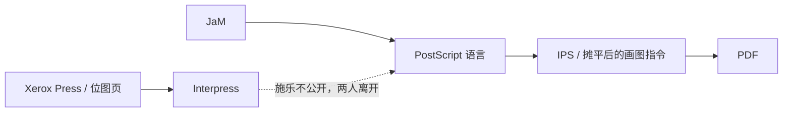

# PDF：一张逃出打印机的纸，怎样成了全世界的文件格式

1985 年 1 月 23 日，苹果年度股东大会。Steve Jobs 准备在台上演示一台新打印机：Apple LaserWriter。打印机里跑的不是苹果自己的软件，而是一家成立才两年、员工还坐不满一间餐厅的小公司写的页面描述语言，叫 PostScript。Jobs 看中了一份演示文件：一张几乎可以乱真的美国国税局税表，由 PostScript 的作者 John Warnock 亲手写出来。

问题是，这份文件打出来要两分半钟。Jobs 喜欢这张税表，但他说：“John，我能讲，可我没法讲两分半钟等一张纸出来。”Warnock 连夜写了一个小程序，把 PostScript 里所有循环、子程序和计算都“摊平”，只留下真正画线、填色、放字的指令。文件变大了，打印时间掉到 14 秒。Jobs 拿着它上了台（[沃顿商学院对 Warnock 的访谈](https://knowledge.wharton.upenn.edu/article/adobe-acrobat-at-20-successes-second-guesses-and-a-few-miscues/)）。

那个把程序摊平的小技巧，六年后被 Warnock 写进一份内部备忘录。备忘录的项目代号叫 Camelot。做出来的东西，不叫税表，叫 Portable Document Format。今天你打开的几乎每一份合同、论文、说明书、机票和报税单，都还活在那 14 秒里。

这篇按时间顺序讲这个格式的故事。技术细节放在它们登场的地方：先看激光打印机怎样把办公室变成印厂，再停下来把“固定版式的预览和打印”拆开，看它为什么比听上去难一个数量级，然后才是桌面出版、字体战争、一份差点被董事会砍掉的格式、互联网插件时代、开放标准、电子签名。最后打开一份真实的 PDF，看它里面怎么组织，再算算这份“看起来永远一样”的文件到今天还没还清的债。

## 序章：无纸办公的反面（1969–1979）

1975 年，《商业周刊》预言过一个“无纸办公室”。施乐自己的帕洛阿尔托研究中心（PARC）正是为“未来办公室”建的。同一座楼里，Gary Starkweather 却在做一件几乎相反的事：让电脑把任意图像打到纸上。

1960 年代末，Starkweather 在纽约韦伯斯特的施乐工厂里想用激光直接在复印机硒鼓上写字。上司不支持，他在 1971 年转到 PARC，把一台 Xerox 7000 复印机改成了扫描激光输出终端（SLOT）。1977 年前后，这套技术长成了 Xerox 9700：每秒两页、300 dpi、可以双面，成了施乐历史上最赚钱的产品之一，年销售额超过十亿美元（[美国发明家名人堂](https://www.invent.org/inductees/gary-k-starkweather)，[Xerox 9700](https://en.wikipedia.org/wiki/Xerox_9700)）。

激光打印机没有消灭纸。它把纸变得便宜、快、人人都能印。无纸办公的预言落空了，纸的消耗反而爆炸。办公室从来没有这么像一座小印刷厂。缺的不是墨粉，是一种语言：电脑怎么告诉打印机，这一页上的字、线、图，到底该长什么样。

## 第一幕：PARC 里的两个人（1972–1982）

Charles “Chuck” Geschke 1972 年从卡内基梅隆拿到计算机科学博士，加入刚开张的 PARC。John Warnock 在犹他大学跟 David Evans 和 Ivan Sutherland 做过计算机图形，后来在 Evans & Sutherland 工作。1978 年，Geschke 筹建新的成像科学实验室，同事 William Newman 对他说：“你真该跟 John Warnock 谈谈。”两人吃了一顿午饭，Warnock 8 月入职（两人合写的[《Founding and Growing Adobe Systems》](https://gwern.net/doc/design/typography/2019-warnock.pdf)）。

PARC 当时已经像从未来寄来的展厅。每人一台 Alto：位图屏幕、鼠标、2.5 MB 硬盘，以太网连着文件服务器和激光打印机。上面跑着所见即所得的文字编辑器 Bravo、电子邮件 Laurel、绘图软件 Draw。IBM PC 要到 1982 年才上市。Warnock 的任务是做一个与设备无关的图形模型：同一套描述，既能画在不同分辨率的屏幕上，也能打到不同分辨率、黑白或彩色的激光打印机上。

他和 Martin Newell、Doug Wyatt 写了一种解释型语言，叫 JaM，John and Martin 的缩写。它的祖先是 Warnock 在 Evans & Sutherland 时参与过的 Design System：后缀式、基于栈，一条条读令牌、立刻执行。JaM 后来会变成 PostScript。

大约同时，施乐决定把 Alto 做成商品，叫 Xerox Star。Star 的人给 Geschke 打了个电话：“我们需要打印，但不知道怎么做。”实验室进入“crash mode”。接下来将近一年，Geschke、Warnock 和 Bob Sproull、Butler Lampson、Brian Reid、Jerry Mendelson 用 Alto 上的电子邮件远程开会，写出了施乐的标准打印协议 Interpress。团队分散在帕洛阿尔托、洛杉矶、费城和匹兹堡。

Interpress 是一份声明式的能力目录：列出一页纸上能出现什么，再配上参数。它很严谨，也很重。施乐管理层花了两年才被说服采用，随后宣布：在第一台支持 Interpress 的打印机出货之前，协议不得公开。那台打印机预计还要七年。

Warnock 后来对计算机历史博物馆说，那是压断骆驼脊背的最后一根稻草。工程师希望自己的东西被用起来。他飞回盐湖城找老师 Dave Evans，Evans 把他介绍给风险投资人 Bill Hambrecht。Hambrecht 的反应很私人：如果你们能把金融印刷厂挤出市场，我愿意当一笔“报复投资”。1982 年秋，Hambrecht & Quist 同意两年提供 250 万美元，后一半看里程碑。11 月两人从施乐辞职，12 月 2 日成立 Adobe Systems，公司名取自洛斯阿尔托斯他们家后院那条 Adobe Creek（[IEEE 原文](https://gwern.net/doc/design/typography/2019-warnock.pdf)，[Warnock 的《The Origins of PostScript》](https://gwern.net/doc/design/typography/2018-warnock.pdf)）。

## 第二幕：乔布斯打电话来了（1982–1985）

最初的商业计划并不是卖一种语言。他们想做整套高端文档系统：工作站加激光打印机，把 PARC 里那套“写、排、印”搬出施乐。当时能用的机器是 Sun、Apollo 和 DEC，激光打印机一台要一万三千美元以上。他们从 PARC 挖来 Bill Paxton、Doug Brotz、Ed Taft，以及两名做控制器板的电子工程师。

技术方向很快定了，而且和 Interpress 相反。过去大多数打印协议都是声明式的，像一份菜单。PostScript 被做成一门完整的编程语言：有控制流、有数学、有图形操作符，解释器只假定输出是光栅设备，不假定分辨率和颜色深度。Warnock 喜欢这个赌：语言比菜单更灵活，以后要加能力，不必改协议，写一段程序就行。后来的网页世界里，HTML 像菜单，Canvas 加 JavaScript 像语言。他们选了后一条。

图形引擎的核心叫 Reducer：把任意可能自交的轮廓切成不重叠的梯形，再填到光栅上。最早用浮点，Warnock 写的测试程序 Death Star 能把它打崩。Doug Brotz 改成精确整数运算，从此不再出那种几何错误。字体不用位图，用三次贝塞尔曲线描述轮廓，任意字号、任意角度都能画。PARC 当年的主流看法是：300 dpi 上要好看，每个字号都得手调位图。Adobe 的答案是：用数学表示字形，再把曲线微微扭到栅格上，这就是后来 Type 1 字体的 hinting（[IEEE 原文](https://gwern.net/doc/design/typography/2019-warnock.pdf)）。

大约半年后，他们在 300 dpi 激光打印机上打出第一页：纸的左下角一个一英寸的黑方块。

公司刚开张，DEC 的 Gordon Bell 就上门了。他不要整套出版系统，只要能驱动即将上市的激光打印机的软件。一个月后，1983 年 5 月，Steve Jobs 打来电话。苹果还没发布的 Macintosh 只有点阵打印机，Jobs 知道正经办公环境不会接受那种质量。他打算用佳能新出的廉价引擎做一台桌面激光打印机，缺的是协议。

Jobs 看完 Adobe 在做什么，提出用 500 万美元买下整家公司。他们拒绝了，自己也还没想清楚手里是什么。董事长 Q. T. Wiles 听完说了一句后来被 Warnock 反复引用的话：商业计划只用来融资；有人愿为另一件事付钱，那才是你的生意。苹果没有买公司，而是预付 150 万美元版税，再投 100 万美元买下大约 20% 的股份。两边的工程师开始给佳能引擎设计控制板。这就是 LaserWriter 的起点。

还有两道门槛。高端印刷市场要有照排机支持 PostScript，还要有体面的字库。顾问 Jonathan Seybold 让他们去找有百年历史的 Allied Linotype。总裁 Wolfgang Kummer 把 Times 和 Helvetica 所在的 Mergenthaler 字库授权给了 Adobe，并同意一起做第一台 PostScript 照排机 Linotype 100。1985 年 1 月 LaserWriter 发布时，有一张照片：Kummer、Warnock、Geschke 三个人在纽约对着镜头笑（[IEEE 原文](https://gwern.net/doc/design/typography/2019-warnock.pdf)）。

LaserWriter 标价 6995 美元，1985 年 3 月上市。它和同年 7 月上市、售价 495 美元的 Aldus PageMaker，以及已经有了图形界面的 Macintosh，被后人称为桌面出版的三件套。PageMaker 的作者 Paul Brainerd 给这件事起了名字：desktop publishing（[MULTIMEDIAMAN 的回顾](https://multimediaman.blog/tag/aldus-pagemaker/)）。

几个月后 Jobs 被赶出苹果，创办 NeXT，很快又来授权 PostScript。再往后，IBM 授权了，惠普也授权了。Adobe 的收入从 1986 年的 1600 万美元跳到 1988 年的 8300 万美元，同年上市。PostScript 成了计算机打印的事实标准。

## 第三幕：把印刷厂搬上桌面（1985–1988）

传统印刷是封闭行业。买了哪家的照排机，就只能用哪家的字，换设备等于换一套家当。PostScript 把软件、打印机和字库拆开了：同一份文件可以在便宜的桌面机上校对，再送到高端照排机上出片，字形不必锁死在某一台机器里。Agfa、Monotype、Berthold 陆续把字库转成 PostScript。Adobe 自己也在 Sumner Stone 手下建了 Adobe Type Library，Robert Slimbach、Carol Twombly 这些人后来写出的字体，到今天还在用。

日本是另一场仗。激光打印机的设计和制造，日本当时是世界领先，汉字又是字体技术的极限考场。Adobe 先去找市场第一的写研（Shaken），谈了几次没有进展；转而去找大阪的森泽（Morisawa）。森泽答应一起做日文 PostScript 照排机，并授权整套日文字库。今天森泽是日本最大的字库公司，写研反过来成了第二（[IEEE 原文](https://gwern.net/doc/design/typography/2019-warnock.pdf)）。

图形艺术还停在画板、针管笔、即刻贴字母和美工刀上。Warnock 的妻子 Marva 是平面设计师，常把她在工作里撞上的难题带回家，Warnock 就在 PARC 的激光打印机上试。1987 年 Adobe 发布 Illustrator，第一个认真对待“精确控制”的绘图软件，作者是 Mike Schuster。1989 年他们又赌了一把当时几乎还不存在的市场：数字摄影。工业光魔的 Tom 和 John Knoll 在 512 KB 内存的 Macintosh 上写出了 Photoshop。Warnock 对董事会说，头几年也许一年只能卖两百套，“但如果我们信这个，以后会有一个大市场。”

同一时期，Jobs 的 NeXT 把 PostScript 从打印机请上了屏幕，做成 Display PostScript。思路漂亮：屏幕和纸用同一种语言。可它太重了。1990 年的办公室电脑，多数还是 640K 的 286、386，跑不起一个完整的 PostScript 解释器。Warnock 后来在 Camelot 备忘录里写：Display PostScript 是长期正确的方向，对今天绝大多数机器却帮不上忙（[Camelot 备忘录](https://knowledge.wharton.upenn.edu/wp-content/uploads/2022/03/warnock_camelot1991.pdf)）。

纸上的革命完成了。下一场，是让文件不必再变成纸。在讲 Camelot 之前，先停下来回答一个问题：“屏幕上看到什么，打出来就是什么”，为什么这么难？

## 插叙：为什么“看到的就是打出来的”这么难

1990 年，想把一份排好版的文件交给别人，让对方在屏幕上看到的、打印机印出来的都和你这边一样，只有三种办法，每一种都有硬伤。

**寄原文件**，比如 Word 文档。对方的电脑会把整篇文章重新排一遍。排版是一次计算：软件按栏宽和每个字的宽度，决定一行在哪里断、一页在哪里结束。只要对方的字体和你的差一点，结果就变了，合同的签名栏可能从第 3 页跑到第 4 页。

**寄图片**，也就是传真的做法。一页信纸按 300 dpi 黑白扫描，大约 1 MB：

```text
8.5 英寸 × 300 × 11 英寸 × 300 ÷ 8 位 ≈ 1.05 MB
```

这在 1990 年的电话线上要传好几分钟。图片放大就糊，里面的文字也没法搜索。

**寄 PostScript**。它能精确描述一页纸，而且不依赖设备，看起来最接近答案。可它是一段程序，要从头跑完才知道有几页，没法直接翻到第 17 页；对方打印机里没有你用的字体，就会拿别的字顶替；而且打开它，等于在对方的机器上运行你写的代码。

要看懂 PDF 最后怎么解决，得先看这件事到底难在哪。可以拆成四块。

### 尺子：每台设备的像素大小不一样

1990 年前后，Mac 屏幕每英寸大约 72 个像素，LaserWriter 每英寸 300 个点，印刷厂的照排机每英寸 2540 个点。同一个一英寸的正方形，在这三台设备上分别是 72、300 和 2540 个像素宽。

PostScript 的做法是定一把不随设备变化的尺子：1 点等于 1/72 英寸，一张 A4 纸是 595 × 842 点。文件里所有位置都用这把尺子写，到了具体设备上，再换算成那台设备的像素（[Inside LaserWriter](https://mirrors.apple2.org.za/www.bitsavers.org/pdf/apple/printers/laserwriter/Inside_Laserwriter_Preliminary.pdf)，Warnock 和 Wyatt 1982 年的 [SIGGRAPH 论文](https://dl.acm.org/doi/10.1145/965145.801297)）。

麻烦在于换算经常除不尽：300 ÷ 72 ≈ 4.17。早期 Mac 的打印驱动对图形和位图用了两套换算比例，同样是 72 像素的方块，画出来的印成 300 个点宽，贴进去的位图只有 288 个点，差了 4%（[MacTech，1987](http://preserve.mactech.com/articles/mactech/Vol.03/03.03/PrinterSleuth/index.html)）。屏幕上对齐的两样东西，纸上就错开了。

Warnock 后来批评 HTML，说的就是这把尺子。网页里的“像素”随屏幕走，所以他说：“你没法在 HTML 里画出一个一英寸的正方形。”

### 字：换一种字体，整页都会重排

每个字有多宽，都记在字体文件里。Times 字体的小写 `i`，宽度是字号的 0.278 倍。假如换成一种平均每个字宽 2% 的字体，一行 60 个字母就会多出一个字母的宽度，行尾的单词被挤到下一行，后面每一行、每一页都跟着往后推。

所以要让版式不变，字体必须跟着文件走。Adobe 当年给开发者的说明写得很直接：屏幕上用的字体宽度，必须和打印机里的字体完全一致，否则屏幕上的断行和打出来的对不上（[Supporting Fonts in the PostScript Language Environment](https://adobe-type-tools.github.io/font-tech-notes/pdfs/5075.Fonts_In_PS.pdf)）。

字体还有第二个麻烦。小字号时，一根笔画在屏幕上可能只有一两个像素宽。直接把字形按比例缩小，笔画会落在两个像素之间，要么整根消失，要么 `m` 的三根竖画粗细不一。Adobe 的办法是在字体里标出哪些笔画必须一样粗、基线和字母高度在哪里，缩小时先把这些位置挪到最近的像素格上，再把字画出来。这叫 hinting，是 Type 1 字体当年保密的核心（[Warnock 的原文](https://gwern.net/doc/design/typography/2012-warnock.pdf)）。屏幕和打印机的像素格不同，挪法也不同，所以同一个字在屏幕上和纸上，边缘永远不会一模一样。

中文和日文还要再难一层：一套字有上万个字形，整套塞进文件太大，只能挑出文中用到的那些字嵌进去。

### 画：把曲线变成点，既要计算也要内存

文件里写的是曲线和坐标，屏幕和打印机要的是一个个点。这一步叫光栅化：算出曲线围住了哪些像素，再把它们涂上颜色。

一页信纸在 300 dpi 下是 1 MB 出头的点阵。初代 LaserWriter 一共只有 1.5 MB 内存，还要装下 PostScript 解释器和字体，整页点阵放不下，只好少印一圈，纸的四周留出将近半英寸的空白（[Apple Technote PR 04](https://preterhuman.net/macstuff/technotes/pr/pr_04.html)）。所以 PostScript 只能在打印机里运行：电脑把程序发过去，打印机自己画。

屏幕预览则是在另一台机器上，用另一种分辨率，把同一页再画一遍。1990 年大多数办公电脑只有 640 KB 内存，跑不动完整的 PostScript。NeXT 那种“屏幕和打印机用同一个解释器”的方案，在这些机器上用不起来。

### 颜色：屏幕发光，纸张反光

屏幕用红、绿、蓝三种光混出颜色，纸上用青、品红、黄、黑四种墨叠出颜色。两者能表现的颜色范围不同，同一个“正红”在屏幕上和纸上本来就不一样，两台显示器之间也会有差别。印刷行业后来要求 PDF 写明颜色该按什么标准解释（ICC 色彩配置文件），就是为了让这一块尽量可控。

### PDF 的办法：保存“已经排好的结果”

把一页纸从编辑到印出来，可以分成三步：

- ① **排版**：决定每一行在哪断、每一页在哪结束
- ② **摆放**：记下每个字、每条线、每张图放在页面的哪个坐标
- ③ **画出**：按具体的屏幕或打印机，把摆好的内容变成像素

三种老办法卡在不同的地方。原文件保存的是第 ① 步之前的内容，换一台电脑就重新排一遍。图片保存的是第 ③ 步之后的结果，只适合那一台设备。PostScript 保存的是一段能算出第 ② 步的程序，得先跑完才知道结果。

PDF 保存的是第 ② 步本身。生成 PDF 时，排版已经做完：每个字放在哪个坐标、用哪个字体的哪个字形，全部写死，字体也一起装进文件。打开 PDF 的程序不再重新排版，只做第 ③ 步。

所以同一份 PDF，在不同阅读器和打印机上，字的边缘和颜色会有细微差别，但断行、分页和尺寸不会变。当年 Gartner 批评 Acrobat“不能编辑”，可对一份合同来说，不会被对方电脑重新排版，恰恰是它最有价值的地方。文章后面会打开一份真实的 PDF，看这“第 ② 步”在文件里具体长什么样。

这四块里，最先引发公开冲突的是字体。

## 第四幕：字体战争（1989–1996）

PostScript 的语言规范是公开的，谁都可以授权解释器做打印机。Adobe 真正锁住的是 Type 1 字体格式：三次贝塞尔轮廓加上一套不公开的 hinting 秘方。Type 3 是开放的，但印出来没那么好看。想做高端字，就得跟 Adobe 谈。到 1980 年代末，桌面出版已经离不开 PostScript，Adobe 几乎可以按自己的意愿定价。

1989 年 9 月，苹果的 Jean-Louis Gassée 想给即将推出的廉价 Mac 买一个更便宜的 PostScript，Adobe 拒绝了。Gassée 和微软一拍即合：苹果拿出代号 Royal 的屏幕字体技术，后来叫 TrueType；微软拿出买来的 PostScript 克隆 TrueImage。9 月 19 日合同签字，20 日在旧金山 Seybold 桌面出版大会上，Bill Gates 和 John Sculley 上台宣布：TrueType 会成为新标准。

Warnock 随后上台。据在场记录，他称这是“最大的一堆垃圾和胡言乱语”，几乎含着泪说：“这些人卖给你们的是蛇油。”几天后，苹果卖掉了持有的全部 Adobe 股票，套现 8900 万美元。分手是公开的（[AppleInsider 的回顾](https://appleinsider.com/articles/10/05/14/adobe_apple_war_on_flash_reminiscent_of_postscript_struggle)，[Greg Hitchcock 的三十年回顾](https://www.linkedin.com/pulse/thirty-years-truetype-fonts-greg-hitchcock)，[华盛顿大学的 Font Wars 论文](https://courses.cs.washington.edu/courses/csep590a/06au/projects/font-wars.pdf)）。

Adobe 的反击有两招。1990 年 3 月，它公布了保密多年的 Type 1 规范；年中推出 Adobe Type Manager（ATM），让 Type 1 字体在屏幕上也能平滑缩放，不必再等一台 PostScript 打印机。ATM 宣布的时候产品还没做完。与此同时，市面上出现了二十多家 PostScript 克隆。Warnock 后来对沃顿说，据他所知没有一家真正成功，微软那台打印机“生产了一台，卖出了零台”（[沃顿访谈](https://knowledge.wharton.upenn.edu/article/adobe-co-founder-john-warnock-on-the-competitive-advantages-of-aesthetics-and-the-right-technology/)）。

战争在用户那边留下的是分裂：同一份文件，Mac 上用 TrueType，印刷厂要 Type 1，屏幕上一套，纸上另一套。业余字库涌进来，专业设计师站队。1996 年，微软和 Adobe 握手，把 TrueType 和 Type 1 装进同一个壳，叫 OpenType。二次曲线和三次曲线都可以住在里面，再加 Unicode 和复杂文字的替换规则。字体战争打了七年，和局比任何一方的全胜都更像今天的世界（[OpenType](https://en.wikipedia.org/wiki/OpenType)）。

PDF 后来能“到哪都长得一样”，很大一部分本事来自这场战争逼出来的东西：把字体嵌进文件，而不是指望对方机器上碰巧装着同一套字。Camelot 备忘录里已经写明：IPS 文件必须自包含，只嵌入真正用到的那些字形。否则“复杂的字体替换方案”会继续让文件在路上走样。

## 第五幕：卡美洛（1990–1993）

1990 年，局域网开始普及，有人把 PostScript 文件当文档在网上传来传去。插叙里说的问题，这时全都冒了出来。文件里常常缺字体，对方打印机拿别的字顶上，版式就变了；PostScript 又是程序，不跑完不知道有几页，打开它等于运行别人的代码。Warnock 想起六年前那张税表：把程序摊平，只留下“在哪儿画什么”的摆放结果。1990 年 8 月，他把这个想法写成内部备忘录《The Camelot Project》（[备忘录全文](https://knowledge.wharton.upenn.edu/wp-content/uploads/2022/03/warnock_camelot1991.pdf)）。

开头一段现在读起来像预言：

> 大多数程序都能打到各种各样的打印机上，却没有一种通用的办法，把这些印出来的信息在电子世界里传递和观看。传真机让我们能把图像变成远端的纸，但质量差、带宽高、又和设备绑在一起。产业急需一种办法，让文档穿过不同的机器、操作系统和网络，在任何显示器上能看，在任何现代打印机上能印。如果这个问题能解决，人们工作的基本方式就会改变。

技术核心是 PostScript 一个不常被用到的性质：操作符的语义可以重定义。把 `moveto`、`lineto` 改成“把参数和自己的名字写进另一个文件”，跑一遍原来的程序，得到的就是一份没有循环、没有条件、没有计算的派生文件。Warnock 把这叫 rebinding。新语言当时的名字是 Interchange PostScript，简称 IPS。每个 IPS 文件仍是合法的 PostScript，能在 PostScript 打印机上印，但读它不需要完整的解释器。每一页独立，可以从中间抽出几页，不必先执行前面所有页。

他在备忘录里写的应用场景，几乎就是后来的 PDF 生活：用电子邮件寄完整的图文报纸和手册；中央文档库远程按需打印，省下数百万美元的库存；百科全书、地图、维修手册刻在 CD-ROM 上带着阅读器走；全文检索；整座图书馆电子归档，因为文件是自包含的，到哪都能印。

1990 年 6 月已有第一版原型，都在 Mac 上。8 月 Warnock 要去见 IBM，需要 Windows 版。Adobe 当时几乎是一家 Mac 公司。他在走廊里撞上 Bob Wulff，对方是少有的 Windows 程序员。Warnock 说只要帮忙几个星期。Wulff 连轴转了两三天做出演示。几个星期变成了二十年（[Adobe 官方回忆](https://blog.adobe.com/en/publish/2015/06/18/who-created-pdf)，[沃顿访谈](https://knowledge.wharton.upenn.edu/article/adobe-acrobat-at-20-successes-second-guesses-and-a-few-miscues/)）。

1991 年秋，山景城 B 栋餐厅里举行了全公司演示。Wulff 后来说，那时候整个公司还能塞进一间餐厅。他们演示了在屏幕上打开文件，还给每人发了一件 T 恤。项目代号从 Camelot 改成 Carousel。老 Macintosh 上 PDF 的四字母类型码到今天仍是 `CARO`。1992 年 COMDEX 上第一版亮相，拿了 Best of COMDEX。Kodak 已经注册了 Carousel 这个名字，产品改称 Acrobat：开发组觉得这个词有技巧和力量的意思。1993 年 6 月 15 日正式上市，华尔街日报登了八版广告。Adobe 还把 PDF 规范印成了一本书（[rgbcmyk 的 PDF 史](https://rgbcmyk.com.ar/en/history-of-pdf/)）。

套件分三块：Acrobat Exchange 看、改、印；Acrobat Distiller 把 PostScript 蒸成 PDF；Acrobat Reader 只看和印。Wulff 后来强调一个被低估的决定：规范从第一天就公开，没有用专利卡住读写。“和 Type 1、Flash 那些后来才公开的东西比，这是一件极大的事。”任何应用只要会“打印”，就能变成 PDF，不必求每个软件厂商改程序（[沃顿访谈](https://knowledge.wharton.upenn.edu/article/adobe-acrobat-at-20-successes-second-guesses-and-a-few-miscues/)）。

## 第六幕：没人懂（1993–1996）

上市之后，没人懂。

Warnock 带团队做路演。Gartner 的人说：这东西不能编辑，有什么用？为什么不直接寄 Lotus 文件？去波基普西见 IBM，他把跨平台、从任意应用生成便携文档讲完，对面一排空白的脸。他自己事后的感想是：“这世界能有多蠢？”Wulff 想的是：收入再不涨，我要丢饭碗了（[沃顿访谈](https://knowledge.wharton.upenn.edu/article/adobe-acrobat-at-20-successes-second-guesses-and-a-few-miscues/)）。

价格也帮了倒忙。Reader 零售 50 美元，五百套以上 35 美元；Exchange 195 美元；Distiller 个人版 695 美元，网络版 2495 美元（[UPI 1993 年 6 月 15 日的报道](https://www.upi.com/Archives/1993/06/15/Adobe-debuts-software-to-simplify-paperwork/5945740116800/)）。对手 Envoy、Common Ground、Farallon Replica 都提供免费阅读器。Common Ground 还能把阅读器塞进文件里，对方不用预装任何东西。拨号调制解调器下，一份带图的 PDF 下载时间以分钟计。Adobe 董事会一度想砍掉这个项目。Photoshop 那边的人问：我们在赚钱，凭什么把钱花在 Acrobat 上？Warnock 的回答是：“我绝对相信这是对人类的救赎，我们必须坚持。”产品亏了大约四年（[维基“History of PDF”](https://en.wikipedia.org/wiki/History_of_PDF)，[沃顿访谈](https://knowledge.wharton.upenn.edu/article/adobe-acrobat-at-20-successes-second-guesses-and-a-few-miscues/)）。

公司内部也有人骂。营销副总裁 Linda Clarke 有一晚被测试版折磨得在办公室里咒骂，Warnock 走进去，对着她把愿景讲了一整晚（Pamela Pfiffner《Inside the Publishing Revolution》，见 [rgbcmyk](https://rgbcmyk.com.ar/en/history-of-pdf/)）。

真正懂的人很少，但很急。美国疾病控制与预防中心是最早、也最狂热的用户之一，他们的说法是：把这些文件发到所有现场办公室，能救多少人。纽约时报拿它做船上版 Times Fax。国税局喜欢它——又回到了那张税表。1994 年万维网爆发，人们突然说：哦，可以用 Acrobat 寄文件。Wulff 补了一句：你当然不能用当时的 HTML（[沃顿访谈](https://knowledge.wharton.upenn.edu/article/adobe-acrobat-at-20-successes-second-guesses-and-a-few-miscues/)）。

1994 年秋天，Acrobat 2.0 发布，Reader 改为免费。董事会问：你们要把阅读器送人？Geschke 后来说，送软件在当时几乎是禁忌，“但很明显，这是获得市场渗透的唯一办法。微软可以假定人人都有 Word。我们不能假定人人都会买 Reader。”Wulff 记得，等决定做完，它已经是显而易见的事：Mosaic 免费，对手的阅读器免费，浏览器免费（[Driving Adobe](https://knowledge.wharton.upenn.edu/article/driving-adobe-co-founder-charles-geschke-on-challenges-change-and-values/)）。

免费阅读器、国税局的表格、突然出现的电子邮件附件：三件事叠在一起，PDF 才开始从“寻找问题的解决方案”变成一种习惯。

## 第七幕：插件、印刷厂和那套永远长得一样的纸（1995–2001）

1995 年 Adobe 和 Netscape 合作，让 Navigator 能打开网上的 PDF。Acrobat 3.0（1996 年 11 月，内部代号 Amber）把这件事做完整：`nppdf32.dll` 这类插件让 PDF 嵌在浏览器窗口里，不再先下载再另开程序。网页可以链到 PDF，PDF 也可以链回网页。Reader 彻底免费。这一版还补上了印刷厂要的东西：CMYK、专色、OPI、挂网和叠印信息。美联社的 AdSEND 广告投送系统开始要求客户交 PDF。1998 年爱克发推出完全基于 PDF 的 Apogee 印前系统。Enfocus 的 PitStop 作为 Acrobat 插件出现。PostScript 那种“什么都能写、也就什么都能写错”的灵活性，在印前流程里成了事故源；PDF 更笨、更安全，反而赢了（[rgbcmyk](https://rgbcmyk.com.ar/en/history-of-pdf/)，[TidBITS 1998](https://tidbits.com/1998/01/15/acrobat-the-killer-app-of-online-publishing/)）。

1998 年起，印刷行业开始给 PDF 订规矩。不是所有 PDF 都适合拿去制版：JavaScript、声音、视频、缺字、RGB 图，都是隐患。他们问：哪些东西必须有，哪些绝对不能有，哪些可选。答案叫 PDF/X，X 是 eXchange。2001 年它成为 ISO 15930：PDF/X-1a 要求全部字体和图像嵌入、颜色必须是 CMYK 或专色，被称作“印刷工的天堂”（[PDF Association](https://pdfa.org/pdfx-and-the-other-pdf-standards/)）。

格式本身也在长。PDF 1.2（1996）有了可填表单 AcroForm，数据可以用 FDF 在网上来回传。PDF 1.3（2000，Acrobat 4）加入数字签名、JavaScript、ICC 颜色、嵌入任意附件。PDF 1.4（2001，Acrobat 5）加入透明度和 Tagged PDF。透明度是对 PostScript 的一次告别：PostScript 处理不了半透明，只能先“拍扁”成不透明碎片；PDF 从此能做 PostScript 做不到的事。Adobe 随后推出 Adobe PDF Print Engine，PostScript 的官方演进停了（[维基 History of PDF](https://en.wikipedia.org/wiki/History_of_PDF)）。

Warnock 后来把 PDF 和 HTML 的分歧说得很硬。他觉得 Tim Berners-Lee 犯了一个根本错误：HTML 的成像模型不是设备无关的，“你没法在 HTML 里画一个一英寸的正方形，永远不行。”PDF 从 PostScript 继承的是：10 磅就是 10 磅，一英寸就是一英寸。屏幕分辨率从 Android 到 iPad 可以差十五种，物理尺寸却差不多，没有设备无关的模型就会变成一场噩梦（[沃顿访谈](https://knowledge.wharton.upenn.edu/article/adobe-acrobat-at-20-successes-second-guesses-and-a-few-miscues/)）。

这个分歧会跟着 PDF 走完后面三十年。一边是“看起来必须一样”的纸，一边是“结构比外观重要”的网页。两边都有道理，谁也没把对方吃掉。

## 第八幕：格式膨胀，以及一份文件变成攻击面（2001–2011）

一旦“看起来一样”做到了，PDF 就开始装进纸装不下的东西。3D 模型、Flash、图层、附件包、XML 表单架构 XFA、越来越长的 JavaScript API。Acrobat 从轻量阅读器变成启动缓慢的大程序，有人统计早期 Reader 后来膨胀到二十多兆。Foxit、Sumatra PDF 靠“只用来看”抢用户。

膨胀的另一面是安全。PDF 1.3 起可以嵌 JavaScript，阅读器里有一套像浏览器一样的脚本引擎，再加打开文件、提交表单、启动外部程序的接口。XFA 把一整套 XML 表单和脚本塞进文件。到 2000 年代末，打开一封邮件里的 PDF 已经是常见的攻击入口。Adobe 几乎每个季度都在打补丁，有些是正在被利用的漏洞。2010 年 11 月，Adobe Reader X 在 Windows 上加了 Protected Mode：把渲染放进沙箱，即便文件里的代码跑起来，也不容易写到系统其他地方。Warnock 在 2013 年说，如果重新来过，他会更早认真对待安全：“如果你拥有世界上最流行的文件格式，猜黑客会去哪？”（[CERT-IST 对 Reader X 沙箱的回顾](https://www.cert-ist.com/public/en/SO_detail?code=201204_article&format=html)，[沃顿访谈](https://knowledge.wharton.upenn.edu/article/adobe-acrobat-at-20-successes-second-guesses-and-a-few-miscues/)）

无障碍是另一笔债。早期 PDF 把字当作绝对坐标上的绘图指令，屏幕阅读器看到的是一堆位置，不是标题、段落和表格。PDF 1.4 的 Tagged PDF 补了一棵逻辑结构树，像给纸加了一份隐藏的 HTML。2012 年它被收成 PDF/UA（ISO 14289）。可大多数人导出 PDF 时并不打标签。政府网站、课程大纲、扫描件，至今仍有大量对读屏软件是黑洞的文件。PDF 赢在外观，输在结构——这正是 SGML/HTML 阵营从 1993 年就在说的话。Acrobat 1.0 的新闻稿还答应 1994 年上半年支持结构化文档和 SGML，这件事没有发生。Wulff 后来说，把未完成的功能写进新闻稿永远是错的（[沃顿访谈](https://knowledge.wharton.upenn.edu/article/adobe-acrobat-at-20-successes-second-guesses-and-a-few-miscues/)，[Mozilla 对 Tagged PDF 的说明](https://hacks.mozilla.org/2021/10/implementing-form-filling-and-accessibility-in-the-firefox-pdf-viewer/)）。

## 第九幕：微软来了，标准交出去（2005–2008）

2005 年 9 月 28 日，ISO 19005-1 通过，这就是 PDF/A：给要存一百年的文件用的子集。禁止 JavaScript，必须嵌字体，颜色必须可复现，元数据用 XMP。发起者包括 AIIM、美国法院行政机构和一批档案机构，Adobe、美国国会图书馆、美国国家档案和记录管理局都在桌上。档案馆终于愿意把宪法存成 PDF，而不是纯文本（[PDF/A 的来历](https://www.pdf-tools.com/pdf-knowledge/history-origin-format-pdfa/)）。

2006 年微软在 Windows Vista 里塞进 XPS：XML 打包、ZIP 容器，明确要在打印和固定版式文档上跟 PDF 抢。Adobe 嘴上否认，手里做了 Mars：用 XML 重写 PDF，也叫 PDFXML。Acrobat 9 里有一个插件能把 PDF 存成 Mars。项目后来像火星上的水一样蒸发了。XPS 也没能把 PDF 掀翻。固定版式这场仗，进来晚了十年（[rgbcmyk](https://rgbcmyk.com.ar/en/history-of-pdf/)）。

真正改变格局的是交权。2007 年 1 月 29 日，Adobe 宣布把 PDF 1.7 交给 ANSI 和 AIIM，走 ISO 快速通道。2008 年 7 月 1 日，ISO 32000-1:2008 出版。规范和技术上与 Adobe 2006 年 11 月的 PDF 1.7 参考手册一致，但治理权到了 ISO/TC 171 SC 2 WG 8。Adobe 变成委员会里的一员。它同时发表专利声明：对符合标准的实现，就自己持有的必要权利要求，向全世界免版税授权（[ISO 32000-1 前言](https://opensource.adobe.com/dc-acrobat-sdk-docs/pdfstandards/PDF32000_2008.pdf)，[PDF Association 对专利的说明](https://pdfa.org/adobe-resolves-patent-questions-on-iso-32000/)）。

争议没有结束。ISO 32000-1 的规范性引用里仍有 Adobe 控制的东西，尤其是 Acrobat JavaScript 和 XFA。委员会 2011 年还在纪要里写：XFA 暂时不成为 ISO 标准，担心规格不稳定。PDF 2.0 的目标之一，就是把这些专有引用清出去（[维基 History of PDF](https://en.wikipedia.org/wiki/History_of_PDF)）。

开源世界更早动手。L. Peter Deutsch 1988 年为 GNU 写出 Ghostscript，先解释 PostScript，1995 年起也能解释 PDF。Derek Noonburg 的 Xpdf 1995 年底发布。2005 年 Kristian Høgsberg 从 Xpdf 3.0 分出 Poppler，后来成为 Linux 桌面上 GNOME 和 KDE 阅读器的引擎。没有这些库，PDF 不会在 Adobe 收钱的地方之外长成基础设施（[Ghostscript](https://en.wikipedia.org/wiki/Ghostscript)，[Poppler](https://en.wikipedia.org/wiki/Poppler_%28software%29)）。

## 第十幕：签字，从墨水变成证书（2000–2016）

纸之所以难被替代，不光因为版式，还因为签名。2000 年 6 月 30 日，克林顿签署《全球及国内商务电子签名法》（ESIGN Act），10 月 1 日生效。核心一句是：合同或签名不得仅因采用电子形式而被否定法律效力（[ESIGN Act](https://en.wikipedia.org/wiki/Electronic_Signatures_in_Global_and_National_Commerce_Act)）。欧洲 1999 年已有电子签名指令，2014 年被 eIDAS 条例取代，直接适用于所有成员国。

法律承认“电子形式”和密码学意义上的数字签名不是一回事。PDF 1.3 起就可以把 PKCS#7 证书签名嵌进文件：对字节算哈希，用私钥加密，证书和摘要一起住在文件里。改一个像素，校验就会失败。这是数字签名。后来街上说的“电子签名”，更多是 EchoSign 那种：邮件点开、画一个名字、留下审计日志。法律上两者都可以有效，证明力不同。

EchoSign 2006 年成立，2011 年 7 月 18 日被 Adobe 买下，后来依次改名 Adobe Sign、Acrobat Sign。云工作流比桌面证书更符合多数人的习惯：HR、销售、租赁合同，要的是“谁在何时点了同意”，不是每人先去申请一张 USB key。欧洲把要求写得更细。ETSI 从 2009 年的 TS 102 778 系列走到后来的 EN 319 142，这就是 PAdES：PDF Advanced Electronic Signatures。它在 ISO 32000 的签名框架上规定了互操作剖面，并加上时间戳、证书吊销信息、长期验证（LTV）。PAdES-B 只保证签完没被改；PAdES-T 加上可信时间；PAdES-LT 把验证材料嵌进文件；PAdES-LTA 用定期时间戳让一份合同在证书过期几十年后仍能自证（[PAdES](https://en.wikipedia.org/wiki/PAdES)，[Adobe 对 PAdES 的说明](https://www.adobe.com/uk/acrobat/resources/document-files/pdf-types/pades.html)）。

PDF/A 和签名在这里相遇。档案要求文件自包含、少脚本；签名要求验证材料也自包含。先转 PDF/A 再签名，是档案机构的标准动作。一份二十年有效的工程合同，纸会黄，PAdES-LTA 的 PDF 还在算哈希。

## 第十一幕：插件死了，规范却要花钱买（2011–2023）

2011 年 6 月 15 日，Acrobat 满十八岁那天，Mozilla 的 Andreas Gal 发布了 PDF.js：用 HTML5 和 JavaScript 在浏览器里画 PDF，不加载任何本地插件。他写得很直白：传统做法是塞一个 Adobe Reader 或 Poppler 的本地代码插件，这会扩大可信计算基；Chrome 为此不得不给 PDF 渲染器做沙箱。纯网页实现对这类内存破坏免疫（[Gal 的原文](https://andreasgal.com/2011/06/15/pdf-js/)）。Firefox 2012 年做成扩展，2013 年定为默认。Chrome 2010 年已用 Foxit 的引擎做内置阅读器，2014 年开源为 PDFium。

浏览器随后拆掉了插件这座桥。Chrome 从 2013 年起废弃 NPAPI，2015 年去掉；Firefox 51 起只留 Flash，52 之后普通插件出局。1996 年让 PDF 成为“网络一等公民”的 `nppdf32.dll`，就这样从主流浏览器里消失。PDF 没有消失，它住进了浏览器自己的进程。XFA 那种只有 Adobe 插件才肯好好渲染的政府表单，成了投诉区里的常客。

2017 年 7 月，ISO 32000-2 出版，这是第一份完全在 ISO 流程里长出来的 PDF，也就是 PDF 2.0。它清掉专有规范性引用，废弃 Flash 和 XFA，收紧规则，补上 UTF-8、更好的 Tagged PDF、页面级输出意图、地理数据和签名。2020 年出了第二版勘误。问题是：ISO 把这份“开放标准”标价约 290 瑞士法郎。PDF 1.7 当年可以免费下载，2.0 却要付钱，五年里实现进展缓慢。2023 年 4 月 5 日，PDF Association 在 Adobe、Apryse、Foxit 赞助下，把 ISO 32000-2 免费放出（[PDF Association 的免费标准页](https://pdfa.org/sponsored-standards/)，[当天的新闻稿](https://www.prnewswire.com/news-releases/announcing-no-cost-access-to-the-latest-pdf-standard-iso-32000-2-pdf-2-0-301790087.html)）。

Warnock 2013 年说，Acrobat 已经是 Adobe 最大的产品，比 Photoshop 还大。他遇见的人说“我每天都用你们的产品”，指的都是 Acrobat。Wulff 补了一句：软件会来会走，PDF 文件真的会永远留下来（[沃顿访谈](https://knowledge.wharton.upenn.edu/article/adobe-acrobat-at-20-successes-second-guesses-and-a-few-miscues/)）。

## 拆开一份 PDF：文件里到底装着什么

讲了三十年的故事，最后打开一份文件看看。用文本编辑器打开大多数 PDF，看到的是一片乱码，因为里面的内容被压缩了。拿掉压缩，PDF 其实是一份人能读懂的文本，夹着一些二进制数据。

下面是一份完整的 PDF，一共 625 个字节。把它原样存成 `hello.pdf`，任何阅读器都能打开：一张 A4 纸，左上方写着 “Hello, PDF”，下面有一条蓝线。

```text
%PDF-1.7
1 0 obj
<< /Type /Catalog /Pages 2 0 R >>
endobj
2 0 obj
<< /Type /Pages /Kids [3 0 R] /Count 1 >>
endobj
3 0 obj
<< /Type /Page /Parent 2 0 R /MediaBox [0 0 595 842]
   /Resources << /Font << /F1 4 0 R >> >>
   /Contents 5 0 R >>
endobj
4 0 obj
<< /Type /Font /Subtype /Type1 /BaseFont /Helvetica >>
endobj
5 0 obj
<< /Length 76 >>
stream
BT
/F1 24 Tf
72 770 Td
(Hello, PDF) Tj
ET
0 0 1 RG
2 w
72 750 m 523 750 l S
endstream
endobj
xref
0 6
0000000000 65535 f 
0000000009 00000 n 
0000000058 00000 n 
0000000115 00000 n 
0000000247 00000 n 
0000000317 00000 n 
trailer
<< /Size 6 /Root 1 0 R >>
startxref
442
%%EOF
```

（`xref` 下面每行末尾都有一个空格，规范要求每行正好 20 个字节。复制时如果空格丢了，阅读器通常也能自动修复。）

### 四个部分

一份 PDF 从上到下分四块（[ISO 32000-1 第 7.5 节](https://opensource.adobe.com/dc-acrobat-sdk-docs/pdfstandards/PDF32000_2008.pdf)）：

1. **文件头**：第一行 `%PDF-1.7`，说明这是 PDF 以及用的版本。真实文件通常还有第二行，放几个大于 127 的字节，提醒传输工具“这是二进制文件，别改换行符”。
2. **正文**：一串编了号的对象。`3 0 obj … endobj` 是 3 号对象，`0` 是它的版本号。别处写 `3 0 R`，意思是“引用 3 号对象”，相当于一个指针。
3. **交叉引用表**（`xref`）：一张目录，记下每个对象从文件第几个字节开始。比如第四行 `0000000115` 表示 3 号对象从第 115 个字节开始。有了它，阅读器不用从头扫描，就能直接跳到任何一个对象。
4. **文件尾**（`trailer`）：说明一共有几个对象、根对象是谁（`/Root 1 0 R`），`startxref` 后面的 `442` 是交叉引用表所在的字节位置，最后以 `%%EOF` 收尾。

对象本身只有几种类型：数字（`595`）、字符串（`(Hello, PDF)`）、名字（以斜杠开头，比如 `/Type`）、数组（`[0 0 595 842]`）、字典（`<< … >>`，一组键值对），还有流（`stream … endstream`，一段任意长的数据，页面内容、图片和字体文件都放在流里）（第 7.3 节）。

### 阅读器从文件末尾开始读

这个设计有一点反直觉：打开 PDF 时，阅读器先读文件的最后几行。

```text
%%EOF 之前的 startxref 442   →  跳到第 442 字节，读交叉引用表
trailer 里的 /Root 1 0 R     →  1 号对象：目录（Catalog）
目录里的 /Pages 2 0 R        →  2 号对象：页面树，一共 1 页
页面树里的 /Kids [3 0 R]     →  3 号对象：第 1 页
```

第 1 页这个字典，就是插叙里说的“第 ② 步”的入口：

```text
3 号对象：第 1 页
 ├─ /MediaBox [0 0 595 842]    纸张大小：595 × 842 点，也就是 A4
 ├─ /Resources                  这一页要用到的资源
 │    └─ /Font /F1 → 4 号对象   字体：Helvetica
 └─ /Contents → 5 号对象        内容流：这一页上画什么
```

### 内容流：一页纸的全部画法

5 号对象里的内容流，就是这一页的全部内容。逐行翻译过来是这样的（第 8、9 章）：

```text
BT                     开始写字
/F1 24 Tf              用 F1 号字体（Helvetica），24 点
72 770 Td              把笔移到坐标 (72, 770)
(Hello, PDF) Tj        写出这串字
ET                     结束写字
0 0 1 RG               描边颜色设为蓝色（红 0、绿 0、蓝 1）
2 w                    线宽 2 点
72 750 m 523 750 l S   从 (72, 750) 画到 (523, 750)，描出来
```

坐标的原点在纸的左下角，单位是点，72 点就是离左边一英寸。`770` 离底边 770 点，所以字落在纸的上部。

内容流里没有“段落”，也没有“这一行写不下就换行”。只有“在这个位置、用这个字体、写这几个字”。这就是 PDF 能保证版式不变的原因。

它也解释了 PDF 另外几个出名的毛病。从 PDF 里复制一段文字，常常会多出换行、少了空格，因为文件里本来就没有“单词”和“段落”，阅读器只能根据字和字之间的距离去猜。中文文件更麻烦：内容流里写的往往不是字符，而是字体里第几号字形。文件得另带一张对照表（`/ToUnicode`），告诉阅读器第 1234 号字形是“文”字，否则复制出来就是一串乱码（第 9.10 节）。屏幕阅读器也得靠这些猜测和对照表，除非文件另外带了一棵标签结构树，也就是前面说的 Tagged PDF。

上面这个例子为了简短，没有嵌入字体。Helvetica 属于 PDF 规定的 14 种标准字体，阅读器必须自己备着。正式的文件会把字体装进去：4 号对象会再指向一个字体描述对象，里面记着字形的宽度，还有一个装着字体文件的流，通常只装文中用到的那些字。PDF/A 这类存档标准要求所有字体都必须嵌入。

### 改文件，不改旧字节：增量更新

假如要把这一页的字改成 “Hello again, PDF”，PDF 允许不动原来的 625 个字节，只在文件末尾追加一段（第 7.5.6 节）：

```text
5 0 obj
<< /Length 48 >>
stream
BT
/F1 24 Tf
72 770 Td
(Hello again, PDF) Tj
ET
endstream
endobj
xref
0 1
0000000000 65535 f 
5 1
0000000625 00000 n 
trailer
<< /Size 6 /Root 1 0 R /Prev 442 >>
startxref
722
%%EOF
```

新的 5 号对象从第 625 字节开始，覆盖掉旧的 5 号。新的交叉引用表只列出变动的对象，`/Prev 442` 指回旧的那张表。阅读器照样从末尾读起，先看到新表，缺的条目再去旧表里找。

这个机制原本是为了让大文件保存得快，后来成了数字签名的基础。签名时，签名值只覆盖签名那一刻文件里的全部字节（签名对象里的 `/ByteRange` 标出签了哪几段，中间留一个空位放签名值本身）。之后再加批注、再签第二个名，都用增量更新追加在后面，第一个签名覆盖的字节一个都没变，所以依然有效。阅读器还能把文件截回到某个签名当时的样子，让你看签名时这份文件是什么内容（第 12.8 节）。

副作用是：用增量更新“删掉”的内容，其实还留在文件前半部分，只是不再被引用。在 PDF 上画一个黑框盖住文字，文字也仍然在内容流里。要真正去掉敏感内容，得用专门的涂黑功能，并把整个文件重新写一遍。

### 现代 PDF 为什么看起来像乱码

上面那份文件是 PDF 最早的写法。今天工具生成的文件，大多多了三层变化：

- **内容压缩**：流通常用 zlib 压缩（字典里写着 `/Filter /FlateDecode`），用文本编辑器看就是乱码。这一点从 PDF 1.2 起就有了。
- **对象流**（PDF 1.5 起）：把许多小对象打包进一个流再整体压缩，文件更小（第 7.5.7 节）。
- **交叉引用流**（PDF 1.5 起）：连交叉引用表本身也变成一个压缩过的流，文件里不再出现 `xref` 和 `trailer` 这两个词。除了开头和结尾几行，整份文件几乎全是二进制（第 7.5.8 节）。

还有一种可选的排法叫线性化（Acrobat 里叫“快速 Web 查看”）：把第一页要用的对象挪到文件最前面，再加一张提示表，这样浏览器下载到一半就能先显示第一页（附录 F）。

想亲手拆一份真实的 PDF，可以用 [qpdf](https://qpdf.readthedocs.io/)：

```bash
qpdf --qdf --object-streams=disable input.pdf readable.pdf
```

它会解压所有流、拆开对象流，生成的 `readable.pdf` 仍能正常打开，也能用文本编辑器从头读到尾。

### 一份真实文件的全貌

把一份典型的现代 PDF 的对象关系画出来，大致是这样。每一项都是字典里的一个键，指向另一个对象：

```text
trailer
 ├─ /Root → 目录（Catalog）
 │    ├─ /Pages           页面树（页多时会分好几层）
 │    │    └─ 每一页
 │    │         ├─ /MediaBox /CropBox    纸张大小、裁切范围
 │    │         ├─ /Contents             内容流：画什么
 │    │         ├─ /Resources            字体、图片、颜色空间、透明度设置
 │    │         │    └─ /Font → 字体 → 字形宽度、嵌入的字体文件、/ToUnicode 对照表
 │    │         └─ /Annots               链接、批注、表单控件、签名框
 │    ├─ /Outlines        书签（左侧目录）
 │    ├─ /Names           命名的跳转位置、附件、文档级 JavaScript
 │    ├─ /AcroForm        表单字段，包括签名字段
 │    ├─ /StructTreeRoot  标签结构树：标题、段落、表格（无障碍用）
 │    ├─ /Metadata        XMP 元数据：标题、作者、PDF/A 声明
 │    └─ /OutputIntents   颜色该按什么标准解释（PDF/X、PDF/A 要求）
 ├─ /Info     旧式元数据：标题、作者、创建工具
 ├─ /ID       文件的唯一标识
 └─ /Encrypt  加密设置（有密码时才有）
```

这张图也解释了 PDF 为什么能加三十年功能而不废掉旧文件。整个文件就是一小座对象仓库，外加每一页的画法。表单、签名、附件、标签、3D、JavaScript，都是在目录或页面上多挂一个键。老阅读器碰到不认识的键就跳过，照样能把页面画出来。

代价也在这里。能挂上去的东西越多，阅读器要实现的就越多，被利用的漏洞也越多。第八幕里那些漏洞，大多就藏在这些后来挂上去的分支里。

## 还没摊平的东西

PDF 解决了 1990 年那个问题：一份文件离开作者的电脑，到另一台机器上，还可以看起来像同一张纸。它付出的代价，到今天还摊在桌面上。

第一是复杂。规范从一本可以印出来的书，长成了包含三维、多媒体、表单、签名、加密、标签、附件的巨型语言。大多数阅读器只实现一个子集，“打开了但缺东西”是常态。XFA 那种从未真正标准化的支线，让税务和政务表单在不同阅读器里像走迷宫。

第二是安全。沙箱降低了打开文件就丢机器的概率，没有取消“PDF 是一个可以带脚本的容器”。禁用 JavaScript、不打开来路不明的附件，仍然是比任何新版本号都更有效的习惯。

第三是无障碍和手机。固定版式在 A4 上是美德，在四英寸屏幕上是刑罚。Adobe 2020 年做了 Liquid Mode，用机器学习把版面重排；Warnock 自己早年就想要 HTML 那种“栏宽固定、长度随内容走”的 galley。Kindle 和网页在重排上赢了，印刷和合同在保真上赢了。没有一种格式同时当好两种纸。

第四是治理。交给 ISO 之后，PDF 不再是一家公司的产品，也失去了“规范永远免费、永远跟产品一起走”的爽快。免费放出 2.0 是补票，不是从一开始就买对的票。

预览和打印也没有被彻底抹平。PDF 冻结的是标记指令，不是硒鼓上的那一层碳粉：不同阅读器的 hinting 和抗锯齿仍会让同一根字干差一圈，RGB 屏幕和四色印刷仍不是同一个红。它保证的是行不会偷偷重排，不是两边像拍照一样逐像素相同。

可你仍然很难把它换掉。合同要签字，论文要投稿，政府要存档，印刷厂要出片，浏览器要内置一个引擎。1975 年预言的无纸办公室没有到来；到来的是另一种纸，薄到可以当附件寄出，硬到在三十年后打开还是原样。它从一台等不了两分半钟的打印机里逃出来，逃进了每一台电脑。



## 时间线

| 年份 | 事件 |
| --- | --- |
| 1969–1971 | Starkweather 在施乐研究激光打印，后转到 PARC |
| 1975 | 《商业周刊》预言无纸办公室 |
| 1977 | Xerox 9700 激光打印机，每秒两页 |
| 1978 | Warnock 加入 Geschke 的成像实验室，JaM 出现 |
| 1982 | Interpress 被施乐采用但不公开；12 月 2 日 Adobe 成立 |
| 1983 | Jobs 想买下 Adobe，被拒；苹果投资并预付版税 |
| 1985-01-23 | LaserWriter 发布；Warnock 摊平的税表演示 |
| 1985-07 | PageMaker 上市，桌面出版一词传开 |
| 1986 | Adobe 上市；Adobe Type Library |
| 1987 | Illustrator；森泽授权日文字库 |
| 1989-09-20 | Seybold 大会，苹果与微软宣布 TrueType，Warnock 称之为蛇油 |
| 1990-03 | Adobe 公开 Type 1 规范，随后推出 ATM |
| 1990-08 | Camelot 备忘录；走廊里拉上 Wulff 做 IBM 演示 |
| 1992 | Carousel 在 COMDEX 获奖；产品因商标改名 Acrobat |
| 1993-06-15 | Acrobat 1.0 与 PDF 1.0 发布，Reader 收费 |
| 1994 | Acrobat 2.0，Reader 免费；万维网开始带上 PDF |
| 1996 | Acrobat 3.0，浏览器插件、表单、CMYK；OpenType 宣布 |
| 1998 | PDF/X 工作起步；Apogee 等 PDF 印前系统 |
| 2000 | PDF 1.3 数字签名与 JavaScript；ESIGN Act |
| 2001 | PDF 1.4 透明度与 Tagged PDF；PDF/X 成为 ISO 15930 |
| 2003 | Acrobat 6 / PDF 1.5，对象流与交叉引用流，文件变小也变得难以直接阅读 |
| 2005 | PDF/A（ISO 19005-1）；Poppler 从 Xpdf 分出 |
| 2006 | 微软 XPS；Adobe 启动 Mars；Acrobat 8 / PDF 1.7 |
| 2008-07-01 | ISO 32000-1:2008，PDF 成为国际标准 |
| 2009 | ETSI 发布 PAdES 技术规范 |
| 2010-11 | Adobe Reader X 沙箱（Protected Mode） |
| 2011-06-15 | PDF.js 发布；7 月 Adobe 收购 EchoSign |
| 2012 | PDF/UA；Firefox 开始内置 PDF.js |
| 2014 | eIDAS；PDFium 开源 |
| 2015 | Chrome 去掉 NPAPI，Adobe 插件退出主流浏览器 |
| 2017 | ISO 32000-2（PDF 2.0），去掉 XFA/Flash 等专有引用 |
| 2020 | PDF 2.0 第二版；Liquid Mode |
| 2023-04-05 | PDF Association 免费提供 ISO 32000-2 |

## 延伸阅读

正文里的链接都指向原始出处，下面几份值得从头读一遍：

- John Warnock，[The Camelot Project](https://knowledge.wharton.upenn.edu/wp-content/uploads/2022/03/warnock_camelot1991.pdf)，1991。PDF 的出生证，只有几页，设想已经包括邮件寄杂志、中央文档库和电子图书馆。
- John Warnock、Charles Geschke，[Founding and Growing Adobe Systems, Inc.](https://gwern.net/doc/design/typography/2019-warnock.pdf)，IEEE Annals of the History of Computing，2019。从 PARC、Interpress 到 LaserWriter、Acrobat，当事人自己写的公司史。
- John Warnock，[The Origins of PostScript](https://gwern.net/doc/design/typography/2018-warnock.pdf)，IEEE Annals，2018。JaM、Reducer、Type 1 那些更技术的决定。
- John Warnock、Douglas Wyatt，[A Device Independent Graphics Imaging Model for Use with Raster Devices](https://dl.acm.org/doi/10.1145/965145.801297)，SIGGRAPH 1982。“不随设备变化的尺子”和成像模型的源头。
- John Warnock，[Simple Ideas That Changed Printing and Publishing](https://gwern.net/doc/design/typography/2012-warnock.pdf)，2012。黄线、蓝线和 erosion：Type 1 hinting 怎么把轮廓扭到栅格上。
- Adobe，[Supporting Fonts in the PostScript Language Environment](https://adobe-type-tools.github.io/font-tech-notes/pdfs/5075.Fonts_In_PS.pdf)。屏幕度量和打印机轮廓对不齐，WYSIWYG 就会断行错乱。
- Apple，[Inside LaserWriter](https://mirrors.apple2.org.za/www.bitsavers.org/pdf/apple/printers/laserwriter/Inside_Laserwriter_Preliminary.pdf)。72 点一英寸的坐标怎样换算到 300 dpi 的打印机上。
- 沃顿商学院，[Adobe Acrobat at 20](https://knowledge.wharton.upenn.edu/article/adobe-acrobat-at-20-successes-second-guesses-and-a-few-miscues/)，2013。Warnock 和 Wulff 的对谈，税表、免费 Reader、HTML 之争都在这里。
- 沃顿商学院，[Driving Adobe: Charles Geschke](https://knowledge.wharton.upenn.edu/article/driving-adobe-co-founder-charles-geschke-on-challenges-change-and-values/)。送掉 Reader 在公司内部有多反直觉。
- Adobe，[Who Created the PDF?](https://blog.adobe.com/en/publish/2015/06/18/who-created-pdf)，2015。走廊、餐厅 T 恤、八版华尔街日报广告。
- Edgardo García，[History of PDF](https://rgbcmyk.com.ar/en/history-of-pdf/)，2016。偏印前和 ISO 子集，PDF/X、Mars、XPS 写得很清楚。
- [History of PDF](https://en.wikipedia.org/wiki/History_of_PDF)，版本特性和 ISO 过程的对照表。
- James Shimada，[The Font Wars](https://courses.cs.washington.edu/courses/csep590a/06au/projects/font-wars.pdf)，2006。Type 1 对 TrueType 的七年。
- Brian Reid 1985 年在 laser-lovers 上的长文，[PostScript and Interpress: A Comparison](https://connor.zip/posts/2023-07-27-interpress) 有整理。当事人看 JaM、Interpress 和 PostScript 为什么不是同一个东西。
- Andreas Gal，[pdf.js: Rendering PDF with HTML5 and JavaScript](https://andreasgal.com/2011/06/15/pdf-js/)，2011。插件时代结束的技术宣言。
- ISO 32000-1（Adobe 提供的[免费副本](https://opensource.adobe.com/dc-acrobat-sdk-docs/pdfstandards/PDF32000_2008.pdf)），以及 PDF Association 的 [ISO 32000-2 免费获取页](https://pdfa.org/sponsored-standards/)。文件结构看第 7.5 节，页面坐标看 8.3，文字提取看 9.10，签名看 12.8，线性化看附录 F。
- [qpdf 手册](https://qpdf.readthedocs.io/)。把压缩过的 PDF 展开成能用文本编辑器读的形式，自己拆一份文件最方便的工具。
- ETSI [EN 319 142-1](https://www.etsi.org/deliver/etsi_en/319100_319199/31914201/01.01.01_60/en_31914201v010101p.pdf)。PAdES 怎么从 PDF 签名长成能在 eIDAS 下用的东西。
- Pamela Pfiffner，《Inside the Publishing Revolution: The Adobe Story》，Peachpit，2003。桌面出版和 Acrobat 早期的叙事史，许多会议室故事出自这里。
