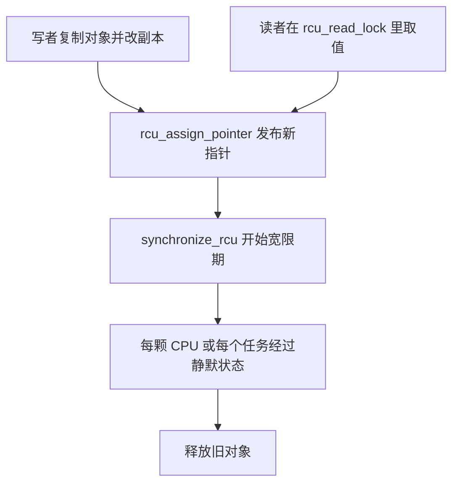

# RCU：读者不拿锁，旧对象什么时候能释放

路由表、目录项、模块链表，读的人远比改的人多。读者每次都去碰同一把锁，这把锁的缓存行会在所有 CPU 之间弹来弹去，写者一来，读者还得停。RCU 把这件事拆开：读者不拿锁，写者改的是一份副本，旧副本要等所有可能还拿着它的读者离开，才能释放。这段等待叫宽限期。Linux 从 2002 年起用它撑读多写少的内核路径。用户态的 liburcu 把同一套约定搬出了内核，静默状态得自己找。

宽限期算短了，旧内存会被还在用的读者踩到。算长了，内存放不掉，系统看起来像停住。后面两次真实的排查，一次是模型检查器抓到的“永远等不到”，一次是“等得太短，读者看见了不该同时看见的两件事”。先把机制放平，再讲这两类事故为什么长得不一样。

## 锁保护的是对象，读者要的只是一个稳定的指针

1998 年 Paul McKenney 和 John Slingwine 在并行与分布式计算会议上把这套方法写成论文，题目是用执行历史来解决并发问题。当时 McKenney 在 Sequent。论文里写，SMP 版本从 1994 年起就在 DYNIX/ptx 上生产运行，1996 年又做了 CC-NUMA 的分层版本。美国专利 5,442,758 在 1995 年 8 月发给他们两人，权利人是 Sequent。Sequent 后来被 IBM 收购。IBM 允许 GPL 程序使用这项技术。相关专利随后过期。多伦多的 Tornado 和 IBM 研究院的 K42 也独立做过很像的延迟回收。Linux 这边，Rusty Russell 卸内核模块时用过类似的“等所有 CPU 都调度过一次”，但还没有统一的 API。

他们要避开的是两类已经有的办法。垃圾回收能知道谁还指着这块内存，但读的时候得做标记，读者不再是只读的。另一种是精确记下每一个正在访问的线程，读写都要改一块共享状态，人一多，记账本身比业务贵。操作系统内核两种都不想要：没有一个可以随时停下来的垃圾回收器，也不能让每次读目录项都去抢全局计数器。

论文把一个不持有相关锁的线程叫做处于静默状态。它这时对受保护的数据结构没有“我刚才看见的还有效”这种假设。如果从某个时刻起，每个线程都至少经过一次静默状态，这段时间就是一个静默周期，后来在 Linux 里叫宽限期。宽限期结束时，任何在它开始之前做的修改，所有线程都已经看见，或者已经丢掉了旧指针。

链表是论文里的例子。节点 A 指向 B，B 指向 C。一个读者正沿着指针走。写者要改 B 里一个不能一次写完的字段。直接改 B，读者会看见写了一半的内容。写者复制出 B'，改 B'，做一次内存屏障，再把 A 的 next 指到 B'。读者要是已经拿到了 B，它仍从 B 走到 C，这条旧链还在。读者要是还没走到，它会看见 B'。没有人再能从链表头拿到 B 之后，写者等待一个静默周期，然后释放 B。

读者允许看见旧数据。论文里说，在宽限期开始之后才开始读的线程，保证看见新数据。网络连通性、传感器读数本来就会旧一会儿。路由表和缓存也接受这种“要么全是旧版本，要么全是新版本，但不是两个版本撕开的混合物”。

## Linux 把静默状态定义成调度器已经知道的事

Dipankar Sarma 在 2002 年 10 月 16 日的 Linux 2.5.43 里把 RCU 放进内核，McKenney 一直在旁边把 Sequent 上的经验译成内核能用的原语。读者侧的 API 很小。`rcu_read_lock` 和 `rcu_read_unlock` 包住一段不能睡眠的读。写者用 `rcu_assign_pointer` 发布新指针，用 `synchronize_rcu` 等宽限期，或者用 `call_rcu` 登记一个回调，宽限期过了再执行。

不可抢占的内核里，读侧临界区不能被抢占，也不能主动睡眠。于是一次上下文切换、进入用户态、或者 CPU 进了空闲循环，都说明这颗 CPU 上不可能还有人留在读侧临界区里。这些点就是静默状态。读侧在这种配置下几乎不碰共享内存，常常只是关掉抢占，甚至只是告诉编译器不要把临界区里的加载挪出去。这就是论文想要的极端：读者侧没有锁，也没有原子操作。

可以抢占之后，事情变了。读侧临界区中间 CPU 可以跑别的任务，上下文切换不再自动等于“没有读者”。可抢占 RCU 在 `task_struct` 里放一个嵌套计数。`rcu_read_lock` 加一，`rcu_read_unlock` 减一。宽限期要等的是：每个曾经在读的任务都把计数降回零，并且调度器有机会观察到这件事。读侧仍然不碰全局锁，写者付出的是更长、更复杂的等待。

早期还有 bh 和 sched 两种口味，分别用关下半部和关抢占来当读侧。调用者必须配对：读者用哪一种锁，写者就得等哪一种宽限期。配错了，宽限期会在读者还没走的时候结束。2019 年前后这些口味被收成同一套机制，`rcu_read_lock_bh` 一类名字还留着，底下不再是三套会互相放错的宽限期。

还有两个后来长出来的变体，解决的是“读者根本不会调用 `rcu_read_lock`”。SRCU 允许读侧睡眠，每个 `srcu_struct` 是一块独立的领地，A 的读者不会拖住 B 的宽限期。读侧返回一个索引，解锁时必须原样交回去，因为内部用两套计数器翻转来区分“这一代”和“上一代”。Tasks RCU 用来拆掉可能正被执行的跟踪跳板。任务没有进入读侧临界区，只要它还在内核里跑那段代码，跳板就不能回收。它把主动调度、或者已经回到用户态，当作静默状态。

## 发布指针和等待宽限期是两段不同的内存序

写者的标准顺序是四步。复制旧对象。在副本上改完。用 `rcu_assign_pointer` 把全局指针摆过去。等宽限期，再释放旧对象。

```c
struct item *old, *newp;

old = rcu_dereference(ptr);
newp = kmemdup(old, sizeof(*old), GFP_KERNEL);
newp->value = 1;
rcu_assign_pointer(ptr, newp);
synchronize_rcu();
kfree(old);
```

`rcu_assign_pointer` 是一次带释放语义的存储。它前面对 `newp` 各字段的写，必须先于指针本身被别的 CPU 看见。否则另一个 CPU 可能先看见新指针，再看见没写完的字段。`rcu_dereference` 是配对的加载。它除了不允许编译器把加载撕开或重排，还保住地址依赖：先读到指针，再用这个指针去读字段。多数架构上，这条地址依赖本身就约束了硬件顺序。Alpha 要在加载指针之后再补一条屏障，这条屏障做在它自己的 `READ_ONCE` 里。绕过这两个 API，直接对共享指针做普通读写，等于把顺序交给编译器和弱内存模型碰运气。

`synchronize_rcu` 返回时，所有在这次宽限期开始前就已经进入读侧的临界区都结束了。它不等待在发布新指针之后才开始的读者，那些读者本来就该看见新指针。所以“等宽限期”保护的是还握着旧指针的人，不是世界上所有的读。

`call_rcu` 不堵住写者。回调挂到当前 CPU 的链表上，宽限期结束后由软中断或者专门的线程调用。`kfree_rcu` 是把释放收成一批的特例。模块卸载时如果只调用 `synchronize_rcu`，读者是走了，已经排队的回调可能还没执行。卸载把回调函数所在的代码页拆掉，下一次执行回调就跳进已释放的内存。这种事故反复出现过。要等的是回调本身，接口是 `rcu_barrier`。它和宽限期不是一回事：宽限期保证没有读者，屏障保证先前登记的回调已经跑完。

CPU 一多，经典实现里那把串起所有 CPU 的锁和全局位图就成了宽限期的瓶颈。2.6.29 换成树。每颗 CPU 有自己的 `rcu_data`。若干 CPU 合成一个叶子 `rcu_node`，叶子再合成上层，直到根。每个节点用位图记下“哪些下属还没报告静默状态”。叶子集齐了就清自己在父节点上的那一位。宽限期线程沿着树往上看，不必让几百个 CPU 同时抢一把锁。回调默认在观察到静默状态的那颗 CPU 上执行。`rcu_nocbs` 可以把回调卸到别的线程，避免在低延迟的 CPU 上做释放。

一次更新里，读者、发布和宽限期的关系是：



读者如果在发布前拿到旧指针，它会一直用到自己的 `rcu_read_unlock`。这段区间必须落在宽限期里面。读者如果在发布之后才读，它拿到新指针，不阻止旧对象释放。

## 用户态没有“这颗 CPU 正在空闲”可以看

内核能把调度点当成静默状态，是因为调度器就在内核里，而且读侧临界区的边界由内核的原语划定。用户态程序没有这张底牌。线程可以一直跑、不进内核，库函数也不知道调用者什么时候算“这次读完了”。Mathieu Desnoyers 做的 liburcu 因此准备了好几套实现，对外尽量保持同样的 `rcu_read_lock`、`synchronize_rcu` 和 `call_rcu`。它是 LGPLv2.1，和 McKenney 一起维护。LTTng 用它保护跟踪状态，这样读跟踪配置的路径不必加锁。

QSBR 最接近内核里那种“读侧几乎免费”的经典 RCU。`rcu_read_lock` 可以便宜到只剩编译器屏障，但每个注册过的读者线程必须周期性地调用 `rcu_quiescent_state`，或者在很长一段不读 RCU 数据时显式 `rcu_thread_offline`。宽限期的定义变成：每个仍在线的注册线程都报告过一次静默状态。线程默认是在线的。在线期间，库把这个线程当成可能还停在读侧临界区里。于是出现一条和内核不同的死锁：线程握着一把锁去调用 `synchronize_rcu`，而这把锁又被另一个还在线的读者需要。宽限期在等那个读者，读者在等这把锁。QSBR 的文档要求，调用 `synchronize_rcu` 时自己先离线。它适合管得住全部线程的程序，不适合塞进一个任意被链接的库。

内存屏障版让读侧和写侧都执行真正的屏障，读变慢，宽限期不必等每个线程主动报到，库函数里也能用，只要应用负责 `rcu_register_thread`。bullet-proof 版连注册都可以省，读侧更贵，换来的是不容易用错。

还有一版把屏障从读侧挪走。读侧只留编译器屏障。写侧要保证其他正在跑的线程都执行过一条内存屏障，这样它们才会看见新的宽限期计数，也不会把旧的加载拖过发布点。最初的做法是给每个读者线程发信号，信号处理函数里带一条屏障。能用，但会把本来在睡觉的线程叫醒。Desnoyers 为此往内核加了 `membarrier` 系统调用。Linux 4.3 的共享命令会拖住整台机器上的调度，和“只想同步自己这个进程”比太重。4.14 的 `MEMBARRIER_CMD_PRIVATE_EXPEDITED` 只给本进程里正在跑的线程发核间中断，让它们执行屏障。没在跑的线程，下一次被调度进来时，上下文切换本身就带了屏障。liburcu 从 0.11 起在探测到这个命令时使用它，没有就退回读侧带屏障的实现。这条命令只覆盖同一进程里的线程。两个进程映射同一块共享内存、却各自做 RCU，它并不替它们互相等待。

`call_rcu` 在用户态需要一个帮助线程来跑回调。LTTng 有时宁可用会堵住的 `synchronize_rcu`，也不想为了回收再养一个线程。这是应用在“写者延迟”和“线程数量”之间做的选择，库两种都提供。

## 太短和太长，修法相反

宽限期太短，读者还握着旧对象，释放已经发生。结果是用后释放，而且和时间有关，很难复现。宽限期太长，旧对象和回调堆着不走，内核打出 RCU CPU stall。默认大约二十一秒没有静默状态就会警告，栈在警告里。常见原因是读侧临界区里做了太长的活，或者关着抢占空转，或者某颗 CPU 卡在进空闲的路径上，再也不报告静默状态。警告是症状。它说明有人没有在约定的时间里离开读侧，或者宽限期状态机不再往前走。

2008 年 3 月，McKenney 用 Promela 和 Spin 给可抢占 RCU 与 dynticks 空闲的交接建模。模型检查器找出一条当时代码会卡死的路径，补丁说明里他按顺序列了出来。CPU 0 停在 dynticks 空闲，计数器是偶数。一次中断把它加成奇数。负责宽限期的 CPU 恰好在这一刻给计数器拍了快照。中断返回，计数器再加一，回到偶数，CPU 0 继续睡下去，并且再也不进中断。判断函数看的是快照的最低位，而不是当前值的最低位。快照是奇数，当前值已经是偶数，差值只有 1，函数误以为还必须等 CPU 0 亲自应答。CPU 0 再也不醒，宽限期永远结束不了。修正是把条件里的 `snap` 换成 `curr`，让“当前已经回到偶数”通过检查。他在说明里写，野外之所以可能还没撞上，是因为总有别的中断会把那颗 CPU 叫醒。模型在“永远不再发生任何事”这种测试不会去等的前提下，把漏洞显出来了。第一版活性检查甚至没抓住它，因为检查器自己也写错了。他把宽限期进程改成死循环，发现检查器无动于衷，先修检查器，再修内核。LWN 上那篇验证文章记了这件事，最后一版模型大约吃掉 40GB 状态空间。

另一类更危险：等得不够。2017 年 Kokologiannakis 和 Sagonas 用无状态模型检查直接跑 Tree RCU 的代码，重现宽限期保证被破坏的场景。2.6.32 时代，每颗 CPU 会读全局的 `completed` 计数来判断上一个宽限期结束了没有，这段读没有和写者互斥。他们在代码里插 `BUG_ON`，证明一个 CPU 可以抄到旧的完成编号，而编号随后已经前进。接着构造出的执行是：同一次读侧临界区里，读者既能看见宽限期之前的写入，又能看见这次宽限期结束之后的写入。这就违反了 RCU 的基本约定。提交 `d09b62dfa336` 当时是当作补上同步来修的。模型检查说明，漏掉的不只是一次计数更新，而是一次过短的宽限期。论文检查了后来几个版本的不可抢占 Tree RCU，宽限期保证能保住，并且把历史上类似的错误注进代码时，工具都能在几秒内找出反例。

这两次的修法不能互换。2008 年那次是状态机在空闲 CPU 上多等，症状是回收停住，改的是判断条件。2.6.32 那次是少等，症状是读者和释放重叠，改的是谁可以在没有锁的情况下相信 `completed`。stall 警告只覆盖第一种。第二种在警告出现之前就已经把内存还回去了。

所以 RCU 的读侧看起来像没有同步，其实同步被挪到了“什么时候允许释放”。内核把这个时间点放进调度和抢占里，树用来让这个时间点在很多 CPU 上仍然算得动。用户态要么让每个线程自己报告，要么用 `membarrier` 把屏障集中到写侧。算错这个时间点的方向，决定你看到的是一次卡住的回收，还是一次静默的用后释放。

## 参考

- Paul E. McKenney、John D. Slingwine，[Read-Copy Update: Using Execution History to Solve Concurrency Problems](https://www.eecg.utoronto.ca/~amza/ece1747h/papers/rcu.pdf)，1998 年 10 月。静默状态、静默周期，以及链表上“复制、改向、等待、释放”的例子都出自这里。文中写明 DYNIX/ptx 的 SMP 版本 1994 年投入生产，CC-NUMA 版本 1996 年。
- Paul E. McKenney，[RCU implementation for Sequent CC-NUMA](http://www2.rdrop.com/~paulmck/techreports/paulmck.1998.06.20a.pdf)，1998-03-28。分层机器上怎么用每 CPU 的回调队列检测静默周期。
- McKenney 在 2022-10-16 的说明：RCU 进入 Linux 2.5.43，补丁作者是 Dipankar Sarma。内核版本日就是这一天。
- LWN，[Integrating and Validating dynticks and Preemptable RCU](https://lwn.net/Articles/279077/)，2008。Promela/Spin 抓到 dynticks 计数器奇偶位判断反了，宽限期可以永远不结束。对应补丁的说明在 [LKML](https://lkml.org/lkml/2008/3/21/347)。
- Michalis Kokologiannakis、Konstantinos Sagonas，[Stateless Model Checking of the Linux Kernel's Hierarchical Read-Copy-Update](https://doi.org/10.1145/3092282.3092287)，SPIN 2017。用无状态模型检查重现过短宽限期，并核对 `d09b62dfa336` 修住的那次 `completed` 计数竞争。
- LWN，[User-space RCU](https://lwn.net/Articles/573424/)。QSBR、内存屏障版、bullet-proof 和信号/`membarrier` 版各自把开销放在哪。
- [liburcu](https://liburcu.org/)。Desnoyers 与 McKenney 维护的用户态实现。QSBR 要求周期性地报告静默状态，在线线程默认视为还在读侧。
- LTTng，[membarrier system call performance and the future of Userspace RCU](https://lttng.org/blog/2018/01/15/membarrier-system-call-performance-and-userspace-rcu/)，2018-01-15。Linux 4.14 的 `MEMBARRIER_CMD_PRIVATE_EXPEDITED` 为什么替换掉给每个线程发信号，以及 liburcu 0.11 何时接上。
- LWN，[The RCU API, 2019 edition](https://lwn.net/Articles/777036/)。bh、sched 和普通 RCU 收成一套机制的背景。
- 内核文档 [What is RCU?](https://docs.kernel.org/RCU/whatisRCU.html) 与 `rcu_barrier` 的说明。模块卸载要等回调，而不只是等读者。
