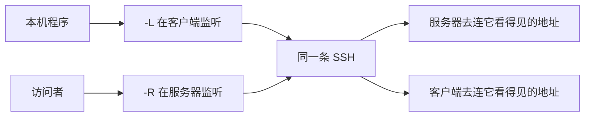

# SSH：从一次嗅探口令到端口转发

1995 年，赫尔辛基理工大学的网络上有人装了口令嗅探器。telnet 和 rlogin 把用户名和口令原样放在数据包里，同一网段上听得见的人就能拿走。Tatu Ylönen 当时在那里做研究，他后来回忆，被收走的口令里还有他自己公司的。他花了大约三个月写了一个替代品，1995 年 7 月以自由软件放出，叫做 SSH。第一件事很具体：登录时，口令不能再出现在链路上。

端口转发是后来长在同一条加密连接上的能力。`-L` 和 `-R` 都是把一条 TCP 连接塞进已经建好的 SSH 里，方向相反，用的场合也相反。下面先把这段历史走到现在，再拆这两个方向。动态转发 `-D` 放在它们旁边，因为它常常和前两个搞混。

## 自由版本停在 1.2.12

到 1995 年年底，记载里的使用者大约两万人，分布在五十个国家。求助信大约每天一百五十封。他在 12 月成立了 SSH Communications Security，把软件收成公司的产品。许可随之收紧。外人还能拿去改的最后一版，是 ssh 1.2.12。公司继续做 SSH2，外面的人跟不了那条代码。

1999 年初，Björn Grönvall 把 1.2.12 翻出来修 bug，叫做 OSSH，只讲 SSH 1.3。OpenBSD 想在 2.6 里带上 SSH，又必须是可以审计、许可不受限的代码。离发布不到两个月，他们从 OSSH 分叉。官方历史写着：初始导入是 1999 年 9 月 26 日，发布时不少文件的 RCS 版本号已经到了 1.34，有的到了 1.66。OpenSSH 1.2.2 随 OpenBSD 2.6 在 1999 年 12 月 1 日发出。当时动手的是 Aaron Campbell、Bob Beck、Markus Friedl、Niels Provos、Theo de Raadt 和 Dug Song。Friedl 随后把 SSH 1.5 和 SSH 2.0 补进同一套程序。别的操作系统用的是 portable 分支，和 OpenBSD 上的发行尽量同步。今天 Linux、macOS 和 Windows 里的 `ssh`，大多是这一支，不是 1995 年那家公司的产品。

协议本身后来写成了 RFC。2006 年 1 月的 RFC 4251 到 4254 描述的是 SSH-2：传输层、认证层、连接层，外加号码分配。SSH-1 还留过很久，因为它已经装进了太多旧设备。2001 年 CORE SDI 公开了 SSH-1 的 CRC 补偿攻击，攻击者可以在加密通道里插入数据。OpenSSH 后来把 SSH-1 默认关掉。现在还开着 SSH-1 的服务器，等于留着一个已知会让完整性失效的协议。

## 一条连接里其实是三层

传输层先做密钥交换，并用服务器的主机密钥给交换签名。客户端第一次连某台机器，会把主机公钥的指纹记进 `known_hosts`。这是“第一次见到就先相信”，不是证书体系。以后指纹变了，客户端拒绝继续，因为同一地址上的密钥不该无故更换。人在赶时间时对着警告输入 yes，这条检查就废了。OpenSSH 后来可以用自己的证书格式给主机和用户签名，由一把证书颁发者的密钥背书，省掉每台机器都去点一次 yes。那不是 X.509，也不用公钥基础设施那一整套。

认证层才验证你是谁。口令、公钥、`keyboard-interactive` 是常见的几种。公钥登录时，服务器只存放公钥，私钥留在客户端。`ssh-agent` 把解开的私钥留在本地内存里，需要签名时由代理完成，私钥不必再写进每个脚本的环境。把代理转发到远端（`-A`）等于把这个签名接口临时借给那台机器。远端若被别人控制，他不能把私钥文件拷走，但在你这连接还活着的时候，他可以拿你的代理去登录别的、信任这把钥匙的机器。转发代理适合你完全信任的跳板，不适合随便一台共享主机。

连接层在同一条加密通道里开很多信道。交互式 shell 是一条，执行单条命令是一条，SFTP 子系统是一条，端口转发也是一条。所以 SSH 不必为转发再握一次手。信道彼此独立，一条转发断了，shell 还可以在。

文件拷贝曾经是另一套习惯。早期的 `scp` 是把旧的 RCP 放进 SSH 信道，远端用 shell 去拼路径，路径里的特殊字符出过命令注入一类的问题。OpenSSH 9.0 在 2022 年把 `scp` 的默认传输改成 SFTP 协议，命令的样子没变，底下不再叫远端 shell 来拼文件名。

## -L 是我这边听，服务器去连

本地转发把监听口开在客户端。你连这个本地端口，字节穿过 SSH，由服务器向外连接你写的那个地址。地址在服务器上解析，不在你这台电脑上解析。

典型场景是数据库只听服务器自己的回环地址。安全组不放行 5432，你也不想放行。本机执行：

```bash
ssh -N -L 5432:127.0.0.1:5432 user@db.example
```

`-N` 表示不要在远端开 shell。然后本机的 `psql` 连 `127.0.0.1:5432`，就像数据库在笔记本上。实际的 TCP 连接是从 db.example 自己连向它的 `127.0.0.1:5432`。你的笔记本上没有数据库，只有一个监听口和一条 SSH。

管理界面只绑在机房内网的某台地址上，也是同一种用法：`-L 8443:10.0.0.5:443 user@bastion`。bastion 能路由到 10.0.0.5，你的笔记本不能。浏览器打开的是自己的 8443，连出去的是 bastion。

## -R 是服务器听，我这边去连

远端转发把监听口开在 SSH 服务器上。有人连服务器上的那个端口，字节穿过同一条 SSH 回到你的客户端，再由客户端去连你写的地址。

典型场景是一台机器在 NAT 后面，没有公网地址，但你想从家里连它上面的一个服务。那台机器主动连出去：

```bash
ssh -N -R 127.0.0.1:8080:127.0.0.1:80 user@home.example
```

home.example 上的 8080 被连上时，连接回到 NAT 后面这台机器的 80 端口。方向和 `-L` 相反：监听在远端，目标在近端。

默认配置下，远端监听绑在回环地址上。`GatewayPorts` 没打开时，互联网上的陌生人连不到这个 8080，只有已经登录 home.example 的人可以。这是故意的。`-R` 不是自动把服务公布到公网。若真要绑到对外地址，服务器配置和管理员都得同意，否则客户端单方面写 `0.0.0.0` 也不会生效。

两条转发可以画成：



`-L` 走上面那行，`-R` 走下面那行。两边的“看得见”不是同一张网。`-L` 里的目标地址必须是服务器能连上的。`-R` 里的目标地址必须是客户端能连上的。写反了，症状就是连接建立了，转发口却拒绝连接，或者连到了意想不到的机器。

`-D` 是第三条，动态转发。客户端在本地开一个 SOCKS 代理，每个请求自己带目标地址，服务器替你连那个地址。浏览器或支持 SOCKS 的程序把 SSH 服务器当成出口。它不像 `-L` 那样事先写死一个主机和一个端口。不支持 SOCKS 的程序不会自动走 `-D`，这和系统代理、TUN 是不同层的事。

跳板要用 `-J`，或者旧一点的 `ProxyCommand`。那是“先连堡垒，再从堡垒连内部主机”的登录路径，OpenSSH 7.3 起可以直接 `-J`。它不在本地或远端留一个给你自己用的监听口。把 `-J` 当成 `-L` 用，内部那台机器的端口并不会出现在你的笔记本上。

服务器可以用 `AllowTcpForwarding` 和 `PermitOpen` 关掉或收紧这些信道。转发是连接层的一种信道，管理员可以只要 shell、不要转发。

## 几次事故都没出在“口令打错了”

Debian 在 2006 年 9 月改 OpenSSL 包时，为了消掉 Valgrind 对未初始化内存的警告，注释掉了往随机数池里混入这块内存的一行。随机数几乎只剩下进程号。2008 年 5 月以 CVE-2008-0166 公开。在受影响的 Debian 和 Ubuntu 上生成的 SSH 主机密钥、用户密钥都得作废。DSA 密钥更挑剔：只要在这台坏机器上用它签过名，随机数可预测，私钥也能被算出来，哪怕钥匙本身是在好机器上生成的。OpenSSH 的更新带了一份弱密钥黑名单，服务器会拒绝还在用这些钥匙的登录。一行被注释的代码，废掉的是两年里生成的钥匙，不是某一台服务器的配置。

2023 年的 Terrapin（CVE-2023-48795）打在协议上。SSH 的序列号从握手的明文阶段一直数到加密阶段，中间不归零。能改字节流的中间人可以在加密开始前塞进一些消息，再在加密开始后删掉同样数量的消息，两边的序列号仍然对得上。删掉的通常是一开始那条扩展协商。结果是一些安全扩展悄悄没谈成，例如对抗按键时间推测的措施，或者把认证算法降级。ChaCha20-Poly1305 和 CBC 配合 Encrypt-then-MAC 时，这条路径走得通。补救叫做 strict key exchange：加密真正开始时把序列号归零，让“先加后删”对不上号。客户端和服务器都得支持，只升一边不够。这不是口令被猜中，是完整性检查的起点放错了地方。

2024 年 3 月的 xz 后门（CVE-2024-3094）甚至不在 SSH 的代码里。Jia Tan 这个身份经营 xz 的提交权经营了很久，在 5.6.0 和 5.6.1 的发布包里放进一段载荷，git 仓库里看不到同样的东西。部分发行版的 sshd 通过 libsystemd 加载 liblzma，后门挂在这个加载过程上，目标是让持有特定密钥的人未经正常认证就进 sshd。Andres Freund 注意到测试环境里的 sshd 在登录时吃掉异常多的 CPU，调试器里也有说不通的错误，在后门进入大多数稳定版之前把它公开出来。当时中招的主要是 Fedora Rawhide、Debian 的 testing 和 unstable，以及跟着这些仓库走的 Kali。稳定版的 Debian 和多数企业发行版没有装上 5.6.0。故事的刺点是：攻击者没有去改协议，也没有去改 OpenSSH 的仓库。他改的是 sshd 会顺便加载的压缩库，而且只改发布用的压缩包。

这三件事放在一起，比“把口令换长一点”更接近 SSH 现在的形状。主机密钥和用户密钥是身份，随机数坏了身份就批量作废。序列号是完整性的坐标，起点不对，中间人就能删掉协商。sshd 又会加载别人的库，那些库的发布流程也成了登录的边界。1995 年要藏住的是口令。现在要守住的是：你以为在跟谁说话，这条信道的开头有没有被人掐掉一段，以及进程里除了 sshd 自己还有谁的代码。

## 参考

- Tatu Ylönen 关于起源的口述，见 [SSH History with Tatu Ylonen](https://www.youtube.com/watch?v=OHBdKM7s5V4)。大学网络里的口令嗅探，以及大约三个月后在 1995 年夏天发布。
- Barrett、Silverman、Byrnes，《SSH, The Secure Shell: The Definitive Guide》第 1.5 节记载了 1995 年年底约两万用户、五十个国家、每天约一百五十封信，以及 1995 年 12 月成立 SSH Communications Security。在线文本见 [History of SSH](http://users.softlab.ntua.gr/~sivann/books/OReilly%20Bookshelf/tcpip/ssh/ch01_05.htm)。
- OpenSSH 项目自己的 [Project History](https://www.openssh.org/history.html)。1.2.12、OSSH、1999-09-26 导入、1999-12-01 随 OpenBSD 2.6 发布。
- RFC 4251 至 4254，2006 年 1 月。SSH-2 的传输、认证和连接层。
- Debian，[DSA-1571](https://www.debian.org/security/2008/dsa-1571) 与 [SSLkeys](https://wiki.debian.org/SSLkeys)。CVE-2008-0166，可预测的随机数，以及 SSH 密钥必须作废的范围。OpenSSL 还实现着浏览器和网站之间的那条协议，见[从 SSL 到 TLS 1.3：互联网如何偿还二十年的密码学技术债](../tls/)。
- [Terrapin Attack](https://terrapin-attack.com/)，CVE-2023-48795。序列号不归零时的前缀截断，以及 strict key exchange。
- Andres Freund，2024-03-29 在 oss-security 的报告，CVE-2024-3094。xz 5.6.0 与 5.6.1 的发布包里针对 sshd 的后门。
- OpenSSH 手册中的 `-L`、`-R`、`-D`、`-J`，以及 `sshd_config` 里的 `AllowTcpForwarding`、`GatewayPorts`。方向以手册为准：`-L` 的目标地址在服务器侧连接，`-R` 的目标地址在客户端侧连接。
