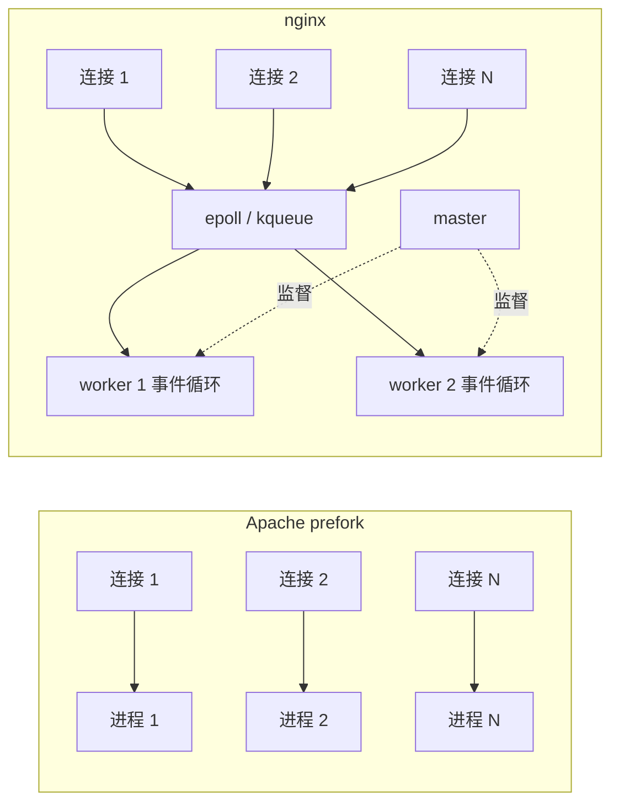
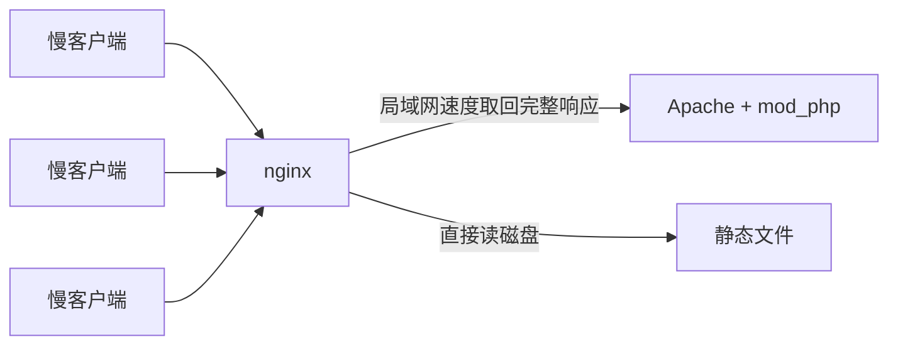

# Welcome to nginx 背后的二十年

在浏览器里敲下一个网址，最先接住这次请求的程序，很可能不是写这个网站的人写的。它多半是一个几兆大小的 C 程序，负责握手、解密、限流，把静态文件直接吐回去，再把剩下的请求转给后面真正干活的应用。新装好还没配置的时候，它会显示一行字：Welcome to nginx!

这个程序的起点很不起眼。2002 年春天，莫斯科门户网站 Rambler 的一位系统管理员，下班后开始写一个新的 Web 服务器。写程序不在他的岗位职责里。2004 年 10 月 4 日，人类第一颗人造卫星升空 47 周年那天，他把它公开发布，用的是 BSD 许可证。十五年后，这个项目背后的公司以 6.7 亿美元卖给了美国的 F5。又过了七个月，莫斯科警察带着搜查令敲开了他的家门，理由是这个软件属于他当年的雇主。2024 年，项目里写代码最多的核心开发者宣布出走，另立分叉。2026 年，一家安全公司用 AI 花了六个小时，在它的代码里找出一个藏了十八年的堆溢出。

这篇按时间顺序讲这个故事。技术细节放在它们登场的地方：先看 1990 年代的 Web 服务器为什么是“一个连接一个进程”，再看 C10K 问题怎样逼出事件驱动，然后是 nginx 怎样从反向代理长成负载均衡器、CDN 和云的门面，最后是商业化、收购、搜查、分叉，以及它今天还压着的问题。

## 1993–1999：一个连接，一个进程

最早的 Web 服务器模型非常直白。1993 年，伊利诺伊大学 NCSA 的 Rob McCool 写了 NCSA HTTPd，它是那几年最流行的服务器。1994 年年中他离开了 NCSA，项目停了下来，各地的网站管理员只好自己给它打补丁。1995 年 2 月，八个人凑在一个邮件列表上，把这些补丁合到一起。这就是 Apache（[Apache 官方的项目史](https://httpd.apache.org/ABOUT_APACHE.html)）。1995 年 12 月 1 日 Apache 1.0 发布，不到一年，它在 Netcraft 的调查里超过了 NCSA，成为互联网上第一的 Web 服务器，之后一坐就是二十多年。

Apache 1.x 的模型叫 prefork：一个父进程预先 fork 出一批子进程，每个子进程一次只处理一个连接。子进程读请求、找文件或者跑脚本、写响应，写完再去接下一个。这个模型好懂，也好写：一个请求就是一个普通的 Unix 进程，出了错只崩自己，调试的时候拿 `strace` 盯住一个进程就够了。Apache 1.0 的新架构还带来了模块化的 API 和基于内存池的分配器。后面会看到，nginx 从 Apache 那里继承了不少这类思想，只是一行代码也没抄。

问题在于，这个模型把“连接”和“进程”绑在了一起，而连接越来越多、越来越慢。

先是慢客户端。nginx 的联合创始人 Andrew Alexeev 在 [《开源应用程序架构》里讲 nginx 的那一章](https://aosabook.org/en/v2/nginx.html)算过一笔账：一个页面 100 KB，服务器生成它只要零点几秒；但对面是 80 kbps 的拨号或者 ADSL 用户，每秒只能收 10 KB，发完要 10 秒。这 10 秒里，Apache 的子进程什么都不干，就守着一个慢慢收数据的 socket。一千个这样的用户，每个进程多吃 1 MB 内存，就是 1 GB。Igor Sysoev 自己后来[在采访里](http://mindend.com/interview-with-the-creator-of-nginx/)说得更狠：挂着 mod_php 的 Apache，每个客户端要吃 10 到 20 MB 内存。一台机器能开几百个进程，就只能同时服务几百个用户，哪怕 CPU 几乎闲着。

然后是 HTTP/1.1 的长连接。为了省掉反复握手，浏览器在一个页面加载完以后还会把连接留着一会儿，同时再对同一个站点开四到六个连接。对 prefork 来说，每一个“留着备用”的连接，都是一个什么也不干的进程。

多线程是自然想到的出路。2002 年 4 月发布的 Apache 2.0 引入了可插拔的多处理模块（MPM），worker MPM 用“多进程加多线程”代替纯多进程，一个线程比一个进程便宜得多。但当时 LAMP 里的那个 P，mod_php，没法放心地跑在多线程里。PHP 的 [官方 FAQ](https://www.php.net/manual/en/faq.installation.php) 至今还留着一条“为什么不应该在生产环境里用多线程 MPM 的 Apache2”：PHP 是胶水，粘着几十个第三方库，谁也保证不了这些库都是线程安全的，想用多线程 MPM，就把 PHP 放到 FastCGI 里单独跑。于是大多数发行版和虚拟主机，继续默认 prefork。

线程也只是把账打了个折扣。一个线程一个连接，线程栈、调度、上下文切换，照样随着连接数线性增长。真正的解法，是让一个执行流同时照看成千上万个连接。

## 1999：C10K

1999 年，程序员 Dan Kegel 在自己的网站上贴了一篇长文，标题就叫 [《The C10K problem》](http://www.kegel.com/c10k.html)。开头一句是：“是时候让 Web 服务器同时处理一万个客户端了，你不觉得吗？”

他的论证全是算术。花 1200 美元，能买到 1 GHz 的 CPU、2 GB 内存和一块千兆网卡。按两万个客户端算，每个客户端分到 50 kHz 的 CPU、100 KB 内存和 50 kbps 带宽，足够每秒从磁盘读 4 KB 再发出去。1999 年，最繁忙的 FTP 站点 cdrom.com 已经在一根千兆线路上同时服务了一万个客户端。硬件已经不是瓶颈，瓶颈在软件怎么用这些硬件。

这篇文章后来成了一份不断更新的清单，罗列了几种 I/O 策略：每个线程服务多个客户端，用非阻塞 I/O 加就绪通知；用异步 I/O 加完成通知；一个线程服务一个客户端；干脆把服务器写进内核。对 Unix 来说，关键是第一种，而它卡在一个很具体的地方：老的 `select()` 和 `poll()` 每次调用都要把整张描述符列表交给内核，内核再逐个检查一遍。一万个连接里只有十个有数据，也要扫一万次。连接越多越慢。

内核这边的答案在几年内陆续到位。FreeBSD 4.1 在 2000 年带来了 [`kqueue`](https://man.freebsd.org/cgi/man.cgi?query=kqueue)，Solaris 有 `/dev/poll`，Linux 在 2002 年的 2.5.44 内核里加入了 [`epoll`](https://man7.org/linux/man-pages/man7/epoll.7.html)，2003 年底随 2.6 进入主线。它们的共同点是：进程先把关心的描述符登记一次，之后内核只返回真正发生了事件的那几个。一万个空闲连接不再有成本。

用户态这边，也早有人试过事件驱动的服务器。Jef Poskanzer 的 thttpd 只有一个进程；Rice 大学的 Pai、Druschel 和 Zwaenepoel 在 1999 年的 USENIX 上发表了 Flash 服务器；商业的 Zeus 号称最快。Kegel 的页面里还记着一段对话：1999 年 3 月，Apache 的开发者 Dean Gaudet 说，总有人问他“为什么不像 Zeus 那样用基于 select 的事件模型，那显然最快”，他的回答归结起来是：“这真的很难，回报也不明朗。”

同一年还有一件让 Linux 社区很不舒服的事。1999 年，微软资助的 Mindcraft 基准测试让 Windows NT 加 IIS 在 Web 和文件服务上压过了 Linux 加 Apache。结论有争议，但内核社区确实在那之后认真修了一批并发下的毛病，Kegel 的页面也链了这段往事。高并发的 Web 服务，第一次变成了操作系统之间面子上的较量。

问题已经提出来了，内核接口也在路上。缺的是一个能在生产环境里扛住的实现：不只会发静态文件，还要会代理、会缓存、会 SSL，配置要像 Apache 一样灵活，还不能停机升级。

## 2000–2002：Rambler 的系统管理员

Igor Sysoev 1970 年生在哈萨克斯坦的一个小城，一岁时随当军人的父亲搬到阿拉木图，在那里住到十八岁。他在 2012 年前后接受俄罗斯《黑客》杂志的采访（[英译版](http://mindend.com/interview-with-the-creator-of-nginx/)，[HackMag 的另一份英译](https://hackmag.com/devops/nginx-interview)）时说，自己第一次报考莫斯科的鲍曼技术大学没考上，回阿拉木图在苏联地质部的一个进修学院当实验员，在老式的 Iskra-226 计算机上学 BASIC。中学时在少年宫的 MSX 电脑上写第一个程序，把数字 1 和字母 l 弄混了，程序跑不起来。

他第一个被别人用起来的程序，是 1989 到 1990 年间用汇编写的杀毒软件 AV，能识别当时苏联流行的十来种病毒，Marijuana、Sophia、Vienna 之类。程序以二进制形式在全国流传，还被几家工厂装上了，有人把中了毒的软盘寄给他。1992 年前后他失去兴趣，程序也就死了。1994 年大学毕业，此前一年他已经在一家石油贸易公司当系统管理员，一干就是七年。2000 年 4 月，纳斯达克崩盘、互联网泡沫破裂的时候，他决定辞职“进入互联网”。在一家电商网站待了半年后，2000 年 11 月 13 日，他加入了 Rambler。

Rambler 当时是俄罗斯最大的门户和搜索引擎之一，流量压力正是 Kegel 描述的那种。Sysoev 的职位是系统管理员。他反复强调这一点：“写程序不在我的职责里，但我有时间，也有兴趣。”他先改了一个压缩 Apache 输出的补丁，mod_gzip 这个名字已经有人用了，他就叫它 mod_deflate。接着有人让他看看 Apache 的 mod_proxy，他看完觉得从头写比改别人的代码简单，于是在 2001 年春天写出了 mod_accel，一个带补丁的 Apache 反向代理模块。到 2005 年，它还跑在 rambler.ru、mail.rambler.ru、卡巴斯基等一批俄罗斯网站上（[mod_accel 的主页](http://sysoev.ru/mod_accel/)）。

写 mod_accel 让他钻进了 Apache 的源码，也让他看清了它的天花板。2008 年，有人在邮件列表上请他讲讲 nginx 的来历，他[回了一封很短的信](https://mailman.nginx.org/pipermail/nginx/2008-May/004816.html)：2001 年春天写完 mod_accel，“但很明显 Apache 的可扩展性很低”。他读了 Kegel 的 C10K 页面，研究了 thttpd、boa 这些现成的服务器，结论是需要一个类似的东西，但要带 SSI、代理和缓存，要有 Apache 那样灵活的配置，要能在线升级、快速轮转日志。现成的轻量服务器只能发静态文件，不会代理；而且它们都是单进程，上了双路 CPU 的机器也用不满。

还有一件让他不喜欢 Apache 的事，跟性能无关：配置。“你很容易写出一份极难维护的配置。网站在长大，你不断加功能，最后每加一行都要想：这次又会弄坏什么？”他说自己在 nginx 里刻意避开了这一点。

2001 年秋天有了念头，2002 年春天动笔。最初的计划和后来的 nginx 并不一样：他打算做成可移植的服务器，原生支持 Win32；进程模型是一个 master 进程加一个带多个线程的 worker。

## 2002–2004：engine x

名字取的是 “engine x” 的读音。据 Sysoev 2008 年那封信里的时间线，2002 年春天是最初的草稿；2003 年秋天有了能跑的代码，支持 `kqueue`、`select`、`poll` 和 `/dev/poll`，结构是一个 master 加一个 worker，线程只部分可用；2004 年春天加上了 `epoll` 和 gzip，变成一个 master 加多个 worker，已经在几个网站上跑生产流量；2004 年夏天有了 SSL 和 POP3/IMAP 代理，nginx 开始承载 www.rambler.ru 本身。

有人问他什么时候意识到 nginx 会成功。他答：2003 年秋天，拿到能跑的代码的时候，比公开发布早一年。

最早的用户并不是 Rambler。2003 年，爱沙尼亚流量最大的网站之一、交友站 Rate.ee 先用上了它，接着是俄罗斯的 mamba.ru 和提供 MP3 下载的 zvuki.ru。Sysoev 说，在那之前，这个项目“基本是学术性的”，他写得很慢，也许永远不会上生产。转折来自 Rambler 的同事 Oleg Bunin：Rambler 要上线图片服务 foto.rambler.ru，Bunin 请他把代理功能做完。他赶工补上了反向代理，2004 年初，foto.rambler.ru 跑在了 nginx 上。

2004 年 10 月 4 日，nginx 0.1.0 公开发布。那天是苏联发射斯普特尼克一号的 47 周年。这个习惯他后来一直保留着：2011 年 4 月 12 日，加加林上天五十周年那天，nginx 发布了 1.0.0（[NGINX 官方的二十年回顾](https://blog.nginx.org/blog/celebrating-20-years-of-nginx)）。

### 它换掉的是什么模型

先把故事停一下，看看 nginx 到底换了什么。

nginx 启动后是一个 master 进程和几个 worker 进程，worker 的数量通常等于 CPU 核数。master 不处理请求，只负责读配置、绑端口、拉起和监督 worker。每个 worker 是单线程的，里面跑一个事件循环：向内核的 `epoll` 或 `kqueue` 要一批“就绪”的连接，对每个连接做一小段工作，比如读到了半个请求头就先解析这半个，socket 写满了就记下写到哪儿，然后马上去处理下一个。没有哪个连接能霸占 worker，因为 worker 从不阻塞在某个连接上。

这意味着每个请求在代码里不是一段从头跑到尾的函数，而是一台状态机。解析 HTTP、和上游通信、发送文件，每一步都要能在任意位置停下，等下一次事件到来再接着走。这比 Apache 那种“一个进程顺序写下去”的代码难写得多，Dean Gaudet 说的“这真的很难”就是指这个。换来的是：一个 worker 可以同时照看成千上万个连接，空闲的长连接只占几 KB 的内存状态，不占进程也不占线程。

其余几个设计都绕着这一点展开。内存按请求和连接分成池，一个请求结束，整池一起释放，不必逐个 `free`，这是从 Apache 学来的。发文件尽量走 `sendfile()`，数据不经过用户态。配置是声明式的层层继承：`http` 里写的默认值，`server` 和 `location` 里可以覆盖。重新加载配置时，master 用新配置拉起一批新 worker，让老 worker 处理完手上的连接再退出，服务不中断。连 nginx 二进制本身都能在线替换：给 master 发一个信号，它会用新程序拉起一个新 master，新老两套进程并存，确认没问题再让老的退出。这正是 Sysoev 当初列在需求清单里的“在线升级”。



代价也很清楚，Sysoev 在 2008 年那封信里自己就列了出来：嵌入的解释器只能做非阻塞操作；读磁盘会阻塞整个 worker；想写一个同时和很多个来源、目标打交道的复杂模块，很难。这三条后来各自引出了一段故事。

## 2004–2008：俄语世界的秘密武器

最初几年，nginx 基本只在俄语世界里流传。文档是俄语的，邮件列表也是。Sysoev 从不做推广，他后来说增长全靠口碑：“nginx 就是能用”，系统管理员告诉系统管理员。

同一时期的对手是 lighttpd。它由德国人 Jan Kneschke 在 2003 年写出来，本身就是为 C10K 做的概念验证，一度比 nginx 流行得多。Sysoev 对此有一段很有名的自嘲：“对西方世界来说，俄罗斯是一个有熊、有巴拉莱卡琴、有雪的陌生国家，德国则是欧洲的一部分。当然，Jan 的英语也比我好，英文文档也更全。”他也承认 lighttpd 的功劳：正是因为 lighttpd 里没法内嵌 PHP，FastCGI 这个在 2000 年前后还显得很古怪的协议才重新活了过来，“那时候人们会说，要 FastCGI 干什么？我们有 mod_php，好用得很。”

nginx 真正的杀手级用法，是站到 Apache 前面去。

还是那个 100 KB、10 秒的例子。把 nginx 放在客户端和 Apache 中间，Apache 生成完页面，以局域网的速度一口气交给 nginx，马上就能去处理下一个请求；nginx 把响应缓冲下来，再慢慢地、几乎不占内存地喂给那个拨号用户。静态文件，比如图片、CSS、JS、MP3，干脆不经过 Apache，由 nginx 直接从磁盘发。Sysoev 描述过当年的典型场景：“我们有 Apache，前面放一个 nginx，哇，奇迹发生了。人们装上它，惊讶一番，然后去 Habr 上写文章说它有多神。”



这就是反向代理。普通代理替客户端去访问外面的世界；反向代理替服务器接待外面的客户端，后面藏着一台或一群真正的应用服务器。nginx 的反向代理从一开始就带着缓冲：它会先把上游的响应完整收下来，再按客户端的速度发出去，这正是给 Apache 这类重型后端减压的关键。Sysoev 还提到一个统计上的错觉：在这种部署里，Netcraft 这类调查看到的是 nginx 在增长、Apache 在消失，其实两个都在，只是 nginx 成了对外可见的那一个。

功能按部就班地往上长。按他那份时间线：2005 年 1 月支持 FastCGI；5 月加了 SSI，代理和 FastCGI 改用同一个 upstream 模块；11 月有了 memcached 和 map 模块；2006 年 1 月内嵌 Perl；5 月加入 `upstream` 块，可以把请求分发给一组后端；9 月支持 Solaris 的 event ports；2007 年陆续有了代理存储、打开文件缓存、`proxy_pass` 里的变量和内置 DNS 解析器。IRC 上的 #nginx 频道成了社区互助的地方，英文邮件列表也开了起来。那几年流行的缩写从 LAMP 变成了 LEMP，E 就是 engine x。

一份这一时期典型的配置大概是这样：

```nginx
upstream backend {
    server 10.0.0.11:8080;
    server 10.0.0.12:8080;
}

server {
    listen 80;
    server_name example.com;

    location /static/ {
        root /var/www;
        expires 30d;
    }

    location / {
        proxy_pass http://backend;
        proxy_set_header Host $host;
    }
}
```

`location /static/` 由 nginx 自己从磁盘发文件，其余请求交给 `upstream` 里的两台 Apache 轮流处理。这几行里已经有了后来一切的雏形：反向代理、静态加速、负载均衡。

## 2008–2011：从前台到负载均衡器

2008 年 4 月，美国的 WordPress.com 把所有负载均衡器从 Pound 换成了 nginx。Automattic 的系统主管 Barry Abrahamson [在博客里](https://barry.blog/2008/04/28/load-balancer-update/)贴了一张切换前后的 CPU 曲线，配了一句“相当惊人”。他们先在 Gravatar 上用了几个月，印象很好，才把主站搬过去。四年后他和 Andrew Alexeev 合写的[文章](https://highscalability.com/wordpresscom-serves-70000-reqsec-and-over-15-gbitsec-of-traf/)补全了细节：他们同时评估过 HAProxy 和 LVS，选 nginx 的理由包括配置清楚、能在不丢请求的前提下热重载，以及它是测试里唯一能在单台服务器上稳定扛住每秒一万个真实 WordPress 请求的软件；切换以后负载均衡器的 CPU 占用降到了原来的三分之一。到 2012 年，WordPress.com 的 nginx 层峰值是每秒七万个请求、15 Gbit/s 流量。

消息传到 nginx 的英文邮件列表时，有人高兴地说这是 nginx “在美国走向主流”的好消息。Mochi Media 的 Bob Ippolito [回了一句](https://mailman.nginx.org/pipermail/nginx/2008-April/004388.html)：我们每天用 nginx 处理的请求远不止四百万，已经用了一年多，“而且用的服务器少得多”。

这是 nginx 身份的第二次变化：从 Apache 前面的缓冲层，变成一群后端前面的调度者。负载均衡要做的事情比代理多：按轮询、权重或者 IP 哈希选后端，某台后端出错了要暂时绕开，连接要复用。Sysoev 在 2012 年的采访里坦白说，nginx 当时的一个弱点是负载均衡算法不够多，“但人们照样在用，它能用，功能我们以后会加”。

在美国，用上 nginx 的名字越来越多。NGINX 官方的回顾里列了 Dropbox、Justin.tv、Facebook、Zappos、Scribd、SlideShare、LinkedIn。2011 年 10 月的一份新闻稿说，nginx 当时承载着四千多万个域名，世界上最繁忙的一千个网站里有超过 20% 在用它（[Nginx, Inc. 的 A 轮新闻稿](https://www.globenewswire.com/news-release/2011/10/11/1147649/0/en/Open-Source-Web-Server-Leader-NGINX-Closes-U-S-3-Million-Series-A-Funding-Round.html)）。

在中国，故事走了另一条路。Sysoev 说的第三条限制，“很难写复杂的模块”，被淘宝的两拨人各自解决了一遍。一拨是章亦春（agentzh），2009 年在淘宝把他在雅虎中国时期的 OpenResty 重写成一个基于 nginx 和 LuaJIT 的发行包，让人可以用 Lua 在 nginx 的请求处理阶段里写非阻塞的业务逻辑（[OpenResty 的项目说明](https://openresty.org/en/about.html)）。另一拨是淘宝核心系统部门，在 2011 年 12 月开源了 Tengine，直接修改 nginx 核心，加入健康检查、动态模块、非缓冲上传等当时官方还没有的功能（[Tengine 的 README](https://raw.githubusercontent.com/alibaba/tengine/master/README.markdown)）。两者的路线之争延续了很多年：章亦春坚持 OpenResty 是“打包”而不是“分叉”，始终和官方 nginx 核心同步；他在 GitHub 上[直言](https://github.com/alibaba/tengine/issues/921)，Tengine 作为真正的分叉，抢在官方之前设计了一些功能，等官方用不兼容的方式实现了同样的东西，它就再也合不回主线了。

nginx 的配置语言也在这几年里攒下了第一个著名的坑。社区 wiki 上有一篇被引用了无数次的文章，标题就叫 [《If is Evil... when used in location context》](https://github.com/nginxinc/nginx-wiki/blob/836ecd605a1b9861fb608e848336bca9b8640b54/source/start/topics/depth/ifisevil.rst)：在 `location` 里写 `if`，有时会做出和你期望完全不同的事，“有时甚至会段错误”，唯一百分之百安全的只有 `return` 和 `rewrite ... last`。原因是 `if` 属于按命令式逐条执行的 rewrite 模块，而 nginx 其余的配置都是声明式的；因为用户需要，有人曾经让 `if` 里也能写别的指令，于是就成了现在的样子。文章里写着，唯一正确的修法是禁止 `if` 里出现非 rewrite 指令，但那会弄坏太多现存的配置，所以一直没做。Sysoev 当初想躲开的“配置越写越没法维护”，以另一种形式回来了。

## 2011–2013：公司

Sysoev 说，大约从 2008 年起，他就开始收到投资人的来信，两年里有十来封，都想围绕 nginx 做点什么。他全都拒了，“我不是个生意人”。可项目已经大到一个人扛不动了。给他帮忙最多的是 Maxim Dounin，从 2008 年前后开始，nginx 的大量代码由两人合写；再往后，才有专人整理文档和把俄语文档译成英文。

说服他的是 Runa Capital 和 Parallels 的创办人 Sergei Belousov。2011 年春天他下了决心，7 月，公司 Nginx, Inc. 注册成立，创始人是 Sysoev、Maxim Konovalov 和 Andrew Alexeev。Konovalov 负责让公司运转，Alexeev 做市场。10 月，公司宣布完成 300 万美元的 A 轮融资，投资方是 BV Capital、Runa Capital 和迈克尔·戴尔的 MSD Capital，总部设在旧金山，工程团队留在莫斯科。NGINX 的官方回顾说，第一个客户是 Netflix。

Sysoev 说那次《黑客》杂志的采访是他生平第一次接受采访，只因为公司成立了才答应：“那年春天另一家 IT 媒体来约，我说抱歉，我不喜欢，不想做，也不会做。”采访的后半段交给了 Konovalov，被问到怎么赚钱，他说最重要的是找准免费功能和付费功能的平衡：有些开源公司没找准，只好把一些功能关起来，要高价，结果惹恼了用户，产品也不再增长。他说他们不打算另做一个产品，而是在开源核心之上加付费功能，面向大规模部署、托管、云和 CDN。

2013 年 4 月，前 Red Hat 全球业务发展副总裁 Gus Robertson 出任 CEO。8 月 22 日，公司发布第一个商业产品 NGINX Plus，每个实例每年 1350 美元，卖点是主动健康检查、更多负载均衡算法、会话保持、运行时重新配置和监控，被定位成硬件应用交付控制器（ADC）的软件替代品（[Computerworld 的报道](https://www.computerworld.com/article/1399910/nginx-web-server-goes-commercial-with-new-release.html)）。

批评第二天就来了。开源倡导者 Simon Phipps 在 InfoWorld 上写了一篇[《Nginx 走上了离开开源的滑坡》](https://www.infoworld.com/article/2195913/nginx-takes-the-slippery-road-away-from-open-source.html)，说这标志着公司转向 open core，在自由软件社区引起了普遍的失望。Apache 基金会的老将 Jim Jagielski 的评论算是温和的：从此以后，对这家公司最重要的代码库，是那份闭源的。

这件事埋下了之后十年所有争议的伏笔。open core 的逻辑是：核心开源，吸引用户；外围收费，养活公司。可 nginx 的“核心”和“外围”之间并没有一条天然的缝。主动健康检查算核心还是外围？动态改 upstream 呢？对一个负载均衡器来说，这些恰恰是生产环境里最需要的东西。开源版的 nginx 只有被动健康检查：请求失败了，才把后端标记为不可用。想要主动探测，要么买 Plus，要么装第三方模块，要么换 HAProxy，要么用 Tengine 或 OpenResty。

## 2013–2019：CDN 与云

商业化没有拖慢 nginx 的扩张。这几年，它从“网站的前台”变成了整个互联网基础设施的零件。

CDN 天然需要一个又快又省的反向代理加缓存。Cloudflare 从成立起就把自己的边缘建在 nginx 上，还在 2012 到 2016 年间出钱支持章亦春全职开发 OpenResty。Netflix 自建的 CDN Open Connect，在全球运营商机房里放的缓存服务器上跑的是 FreeBSD 加 nginx，[它的官方页面](https://openconnect.netflix.com/en/appliances)写着选 nginx 是因为“经过验证的可扩展性和性能”。Netflix 的工程师和 Sysoev 一起给 FreeBSD 重新设计了异步的 `sendfile(2)`，NGINX 在 Sysoev 离职时的告别文章里专门提到了这件事（[Netflix 的技术博客](https://netflixtechblog.com/serving-100-gbps-from-an-open-connect-appliance-cdb51dda3b99)）。后来 Netflix 又把 TLS 加密搬进内核，好让 nginx 的 `sendfile` 流水线在加密流量下也不必把数据拷进用户态，单台服务器做到了 100、200、400 Gbit/s。

nginx 的模块生态也带来了风险。2017 年 2 月，Google Project Zero 的 Tavis Ormandy 发现，经过 Cloudflare 的一些网页里夹带着别的网站的内存片段：cookie、令牌、私信。这就是 Cloudbleed。[Cloudflare 的事故报告](https://blog.cloudflare.com/incident-report-on-memory-leak-caused-by-cloudflare-parser-bug/)说，出问题的是他们自己用 Ragel 生成的 HTML 解析器，它以 nginx 过滤模块的形式编进了 nginx。那个越界读的 bug 在老解析器里存在了多年，一直没泄漏，是因为 nginx 内部缓冲区的用法恰好挡住了它；新解析器上线后缓冲方式微妙地变了，泄漏才开始。bug 不在 nginx 里，但它说明了一件事：在一个 C 写的进程里挂上自己的 C 模块，一个指针错误就能把别人的数据发给全世界。

nginx 自己也在长。2015 年，`stream` 模块让它能代理和均衡 TCP 流量，后来又支持 UDP；同一年支持了 HTTP/2；线程池让读磁盘这类阻塞操作可以交给线程去做，Valentin Bartenev 在[博客](https://www.f5.com/company/blog/nginx/thread-pools-boost-performance-9x)里用一个测试说明，在磁盘成为瓶颈的场景下吞吐提高了九倍，这补上了 Sysoev 2008 年列出的第二条限制；njs 让配置里可以写 JavaScript。2016 年，1.9.11 支持动态加载模块，第三方模块终于不必每次都和 nginx 一起重新编译。2017 年，Sysoev 亲自主导了一个新的服务器核心 NGINX Unit，可以通过 API 动态配置，直接运行 PHP、Python、Go 应用。

容器时代，nginx 因为小、快、配置文件就是一切，成了 Docker Hub 上最常被拉取的镜像之一，也成了 Kubernetes 集群的入口。这里埋着一个延续至今的命名混乱：Kubernetes 社区在早期写了一个参考实现 ingress-nginx，NGINX 公司在 2016 年又发布了自己的 NGINX Ingress Controller。两个项目代码不同、维护者不同，名字只差一个词序。直到 2026 年，nginx.org 首页还挂着一行说明：NGINX Ingress Controller，“请勿与 Kubernetes 社区项目 ingress-nginx 混淆”。

2019 年 4 月，Netcraft 的调查显示，按网站总数计，nginx 以 27.5% 的份额第一次超过 Apache（[Netcraft 2019 年 4 月调查](https://www.netcraft.com/blog/april-2019-web-server-survey/)）。Netcraft 说，这是 1996 年以来第一次，由 Microsoft 和 Apache 以外的厂商占据这个位置。2020 年 8 月，按对外提供 Web 服务的计算机数量计，nginx 也超过了 Apache（[Netcraft 2020 年 8 月调查](https://www.netcraft.com/blog/august-2020-web-server-survey/)）。

## 2019 年 3 月：6.7 亿美元

在 nginx 做到第一的同一个月，2019 年 3 月 11 日，F5 Networks 宣布以约 6.7 亿美元收购 NGINX（[F5 的新闻稿](https://www.f5.com/company/news/press-releases/f5-acquires-nginx-to-bridge-netops-devops)）。

F5 是做硬件负载均衡器起家的，它的 BIG-IP 设备在企业机房里卖了二十年。NGINX Plus 当初的定位，正是“硬件 ADC 的软件替代品”，也就是 F5 的替代品。现在 F5 把它买了下来，新闻稿的标题叫“连接 NetOps 和 DevOps”：传统网络团队用 BIG-IP，写应用的团队用 nginx，F5 两边都要。F5 承诺保留 NGINX 品牌，CEO Gus Robertson 和创始人 Sysoev、Konovalov 留下来继续带队。交易在 5 月 8 日完成（[F5 的 8-K 文件](https://www.sec.gov/Archives/edgar/data/1048695/000119312519142363/d745009d8k.htm)）。

此前 NGINX 先后融了几轮，Meduza 统计总额超过一亿美元；按 HackMag 的说法，2018 年公司收入约 2600 万美元。一个系统管理员的业余项目，到这里算是有了一个圆满的商业结局。

故事本该在这里告一段落。

## 2019 年 12 月：搜查令

2019 年 12 月 12 日上午，武装警察同时出现在 NGINX 莫斯科办公室、Konovalov 和 Sysoev 的家里。两人被带走问了几个小时，当晚获释，手机被收走。第一个把消息发到网上的是 NGINX 的工程师 Igor Ippolitov，他在 Twitter 上贴出了搜查令的照片，随后被“客气地请求”删帖（[Meduza 的长篇报道](https://meduza.io/en/feature/2019/12/13/what-s-yours-is-ours)，[HackMag 的汇总](https://hackmag.com/devops/nginx-interview)）。

搜查令上写着，这是 12 月 4 日立案的一起刑事案件，罪名是有组织地大规模侵犯著作权。案件材料的说法是：“身份不明的人员”在不晚于 2004 年 10 月 4 日的时候，“在工作时间内、按公司管理层的指示”开发了名为 Nginx 的程序，然后“以侵犯著作权为目的”把它发布到互联网上免费传播。受害方是 Rambler Internet Holding，损失估计 5100 万卢布，约合 80 万美元。按俄罗斯刑法，这一条最高可判六年。

Rambler 的说法是：它发现自己对 nginx 的专有权利被第三方侵犯，已经把追索权转让给一家塞浦路斯公司 Lynwood Investments。Meduza 查到，Lynwood 和 Rambler 的共同所有人、亿万富翁 Alexander Mamut 有关，他曾经通过这家公司持有英国连锁书店 Waterstones。

法律上的争点在俄罗斯民法典第 1295 条：员工在职务范围内创作的作品，专有权属于雇主。Sysoev 七年前就回答过这个问题：“在 Rambler，我是系统管理员，开发是在业余时间做的，产品从第一天起就以 BSD 许可证开源。Rambler 是在核心功能已经完成以后才开始用它的，第一个用户也不是 Rambler。”2000 年代初担任 Rambler 执行董事的 Igor Ashmanov 对科技媒体说，案件材料里的版本是“胡扯”：Sysoev 从没被安排过开发 Web 服务器，Rambler 大概连一张纸都拿不出来；而且当初雇他的时候，公司专门写明他有自己的项目，保留继续开发的权利。律师们还指出，按 2004 年首次发布算，十年的追诉时效早就过了。

时间点让很多人起疑。2019 年 8 月，国有银行 Sberbank 刚刚收购了 Rambler Group 46.5% 的股份；nginx 以 6.7 亿美元卖掉才过去半年。一位接近 NGINX 早期投资人的消息人士对 Meduza 说，NGINX 融资时做过多轮尽职调查，十五年里 Rambler 从没提出过任何权利主张，“要么是新股东带来了变化，要么是 F5 的交易让 Rambler 突然看清了自己失去了什么。其实他们什么也没失去：这个产品从来不是他们的。”Habr 的创始人 Denis Kryuchkov 挖苦说，俄罗斯内务部和克里姆林宫的网站用的也是 nginx。Yandex 发表声明，标题叫“开源成就了我们”，说警方的行动发出了一个“非常糟糕的信号”。Konovalov 对 Bloomberg 说：“我们为自己的自由担心。前些年 Rambler 从没注意过我们。”

舆论压力下，事情转得很快。12 月 16 日，Sberbank 召集 Rambler 董事会开了临时会议，董事会要求管理层请执法机关停止刑事追诉（[路透社](https://www.reuters.com/article/technology/russias-rambler-drops-effort-for-criminal-case-against-nginx-web-server-idUSKBN1YK24M/)）。2020 年 5 月 18 日，内务部以“不存在犯罪事件”为由终止了案件（[国际文传电讯社](https://www.interfax.ru/russia/716244)）。

但 Lynwood 没有放手。2020 年 6 月 8 日，它在美国加州北区联邦法院起诉 F5、Sysoev、Konovalov 和 NGINX 的几家投资方，列了 26 项诉由，包括版权侵权、商标、欺诈和共谋，还在美国专利商标局对 NGINX 的商标提出了异议。地区法院两次驳回，2022 年 8 月做出不允许再修改的驳回，还判 Lynwood 赔 F5 八十多万美元律师费。Lynwood 上诉。2024 年 11 月，第九巡回上诉法院部分维持了驳回，却让其中一小块活了过来（[判决备忘录](https://cdn.ca9.uscourts.gov/datastore/memoranda/2024/11/06/22-16399.pdf)）：开源的 nginx 本身不算，法院找不到 BSD 许可证里有哪一条禁止商业使用；Sysoev 在 Rambler 期间仅仅“构思”过的东西也不算，因为想法不受版权保护；但如果 NGINX Plus 的某些代码确实是在 Rambler 任职期间“写出来”的，这部分诉求可以继续审。

案子因此回到地区法院，范围收窄到一个问题：2011 年底之前，有没有 NGINX Plus 的代码是由当时还在 Rambler 任职的人写的。Lynwood 在诉状里的说法是，Sysoev 等人在 2009 到 2011 年间“囤积”了一批没开源的代码，后来成了 NGINX Plus，还提到 2011 年给 Netflix 做的 CDN 定制模块。这些都是原告的主张。按 F5 在 SEC 文件里的[披露](https://www.sec.gov/Archives/edgar/data/1048695/000104869526000023/R15.htm)，双方在 2025 年进入了第一阶段证据开示；法院当时的排期是，如果案子挺过即决判决，2027 年 11 月开庭。写这篇文章时，我没有查到公开的裁决结果。

回头看，Sysoev 在 2012 年被问到 Rambler 的权利问题时，开口第一句是：“是的，这是个微妙的话题。你不是第一个问的，我们研究了很久。”

## 2022：告别与分裂

2022 年 1 月 18 日，NGINX 博客发了一篇文章，标题是[《Do Svidaniya, Igor, and Thank You for NGINX》](https://blog.nginx.org/blog/do-svidaniya-igor-thank-you-for-nginx)：Sysoev 决定离开 NGINX 和 F5，“多陪陪家人朋友，做点自己的项目”。文章说，他早几年就不再写日常代码，而是在幕后为 njs、Unit 这些项目定方向。NGINX 的研发此后由 Konovalov 领导。Sysoev 没有发表任何告别声明，至今也没有公开宣布新的项目。

一个月后，俄罗斯全面入侵乌克兰。2022 年，F5 结束在俄罗斯的业务，关闭了莫斯科办公室。这个办公室是 nginx 的研发心脏，大部分工程师接受了搬到美国圣何塞的安排，但不是所有人。

留下来的人分成了两条路。

一条是 Angie。2022 年 7 月 21 日，一家叫 Web Server 的公司在莫斯科注册，共同所有人是几位前 NGINX 员工：NGINX Unit 团队的前负责人 Valentin Bartenev，还有 Ivan Poluyanov、Oleg Mamontov，以及 FreeBSD 开发者出身、当年负责 nginx 文档的 Ruslan Ermilov（[Roem 引述《生意人报》](https://roem.ru/27-10-2022/294640/nginx-forknuli-v-rossii/)）。10 月，他们开源了 Angie，一个 nginx 的分叉，宣称可以“无缝替换” nginx，现有配置不用大改（[Angie 的 GitHub](https://github.com/webserver-llc/angie)）。它同时有商业版 Angie PRO，后来还进了俄罗斯的国产软件名录，并把一些原本只在 NGINX Plus 里才有的能力放进了开源版。

另一条是 Maxim Dounin。他同样出身 Rambler，是 2008 年以后 nginx 核心代码写得最多的人之一。F5 关闭莫斯科办公室后，他不再是 F5 的员工，但和 F5 达成协议，以志愿者的身份继续在 nginx 开发里担任原来的角色。接下来将近两年，他免费维护着世界上用得最多的 Web 服务器。

## 2024 年 2 月：freenginx

2024 年 2 月 13 日，F5 在博客上发了一篇[《NGINX 对开源社区的承诺》](https://www.f5.com/company/blog/nginx/meetup-recap-nginxs-commitments-to-the-open-source-community)。文章回顾了 Konovalov 在一次聚会上讲的 nginx 历史，“从项目的黑暗时代到最近的事件”，然后列了五条承诺：公开、一致、透明、公平地接受贡献；继续开源新项目；继续使用 OSI 批准的许可证；不会把已有的项目或功能拿走变成商业版；不对项目的使用施加限制。文章承认，这些项目一直“主要由 F5 的付费员工支持，社区贡献有限”，希望将来能有 F5 以外的维护者。

第二天，2月14日，nginx 发布了 1.25.4，修复了实验性 HTTP/3 模块里的两个漏洞，并分别分配了 CVE 编号：CVE-2024-24989 和 CVE-2024-24990（[nginx 安全公告](https://nginx.org/en/security_advisories.html)）。

同一天，Dounin 在 nginx-devel 邮件列表上发了一封信（[原文](https://mailman.nginx.org/pipermail/nginx-devel/2024-February/K5IC6VYO2PB7N4HRP2FUQIBIBCGP4WAU.html)）：

> 不幸的是，F5 最近一些新的非技术管理层认为，他们比我们更懂怎么运营开源项目。具体来说，他们决定干预 nginx 多年来一直使用的安全政策，无视这份政策，也无视开发者的立场。
>
> 这可以理解：项目是他们的，他们可以对它做任何事，包括出于营销动机的举动……但这违背了我们的约定。更重要的是，我再也无法控制 F5 内部对 nginx 做了哪些修改，也不再把 nginx 看作一个为公共利益而开发和维护的自由开源项目。
>
> 所以从今天起，我不再参与由 F5 运营的 nginx 开发。我将开始一个替代项目，它由开发者来运营，而不是公司实体。

新项目叫 freenginx，许可证不变。

他在后续回复里解释了导火索（[邮件](https://freenginx.org/pipermail/nginx/2024-February/000007.html)）：这个 bug 出在实验性的 HTTP/3 代码里，按照现行政策应该当作普通 bug 修掉，所有开发者，包括他自己，在安全邮件列表上都同意这一点；可几天前他得到通知，某些不具名的管理层要求照样发安全公告、出安全版本。“这次的具体做法算不上多糟，但这种做法总体上问题很大。”

F5 这边的说法出现在 Hacker News 的讨论里（[讨论串](https://news.ycombinator.com/item?id=39373327)）。一位自称 F5 员工的人说，这个漏洞在开源版和 NGINX Plus 里都有，F5 是 CVE 编号机构，按照自己的披露政策需要分配 CVE；他的座右铭是“我们不告诉客户，客户就没法对自己的网络做出知情的决定”。旁观者也指出，CVE 的规则只排除不公开的产品，公开发布的实验功能同样在范围之内。

回头看，这场争执的内容其实很小：实验功能里的一个 bug，要不要发 CVE。F5 的立场有它的道理，发 CVE 是在帮那些已经在生产环境里打开了 HTTP/3 的用户；Dounin 的立场也有道理，实验功能本来就不承诺稳定性，给它发 CVE 会稀释安全公告的意义。真正让他出走的，是后面那句“我再也无法控制”：一个项目的安全政策由谁说了算，是写代码的人，还是拥有项目的公司。F5 前一天刚承诺“公开、透明”，第二天就在没有公开讨论的情况下推翻了维护者的共识。

freenginx 活了下来。截至 2026 年，它仍在按和 nginx 同样的节奏发布 stable 和 mainline 版本（[freenginx.org](https://freenginx.org/)）。版本号基本对齐，但两边的代码已经渐行渐远。

## 2024–2026：F5 补课

freenginx 事件之后，F5 做了一连串迟来的调整，有的像补课，有的像收缩。

2024 年 9 月 6 日，nginx 的官方开发仓库从 Mercurial 搬到了 GitHub，开始接受 Pull Request，问题追踪和讨论区也搬了过去，邮件列表上的补丁只收到当年年底（[迁移公告](https://mailman.nginx.org/pipermail/nginx-announce/2024/ITL3AOQSAJANFJXMM3VOVOIGOUADWFFK.html)，[NGINX 博客](https://blog.nginx.org/blog/nginx-open-source-moves-to-github)）。博客里有一句很实在的话：“nginx 2004 年首次发布的时候，Git 还不存在。”十月，nginx 过了二十岁生日。

2025 年，NGINX Unit 先是在 4 月宣布只做关键维护、不再开发新功能，10 月 8 日仓库被归档，Docker 官方镜像也标注为“已归档、不再维护”（[Unit 的维护声明](https://github.com/nginx/unit/discussions/1605)）。这是 Sysoev 离开前亲自主导的最后一个新核心。社区随后分叉出了 FreeUnit，在 README 里把自己列进了“freenginx、MariaDB、LibreOffice”这一串“公司退场、社区接手”的名单。

同一年 8 月 12 日，nginx 发布了原生的 ACME 支持，可以在配置里直接向 Let's Encrypt 这类证书机构申请和续期证书，不再依赖 certbot（[NGINX 博客](https://blog.nginx.org/blog/native-support-for-acme-protocol)）。这个模块是用 Rust 写的。Caddy 从 2015 年起就默认自动申请 HTTPS 证书，nginx 在十年后补上了这一课；而它选的实现语言本身，也回应了下文会讲到的那个老问题。

更值得注意的是 open core 的边界开始松动。2024 年 11 月的 1.27.3 让开源版的 `upstream` 能自动重新解析后端域名，2026 年 3 月的 1.29.6 加入了会话保持 `sticky`，这两样过去都是 NGINX Plus 的卖点。2026 年 9 月 2 日发布的 1.31.5 更进一步，把 Control API 开源了：可以通过一个 REST 接口读取正在运行的配置，触发重载并立刻拿到成功或失败的 JSON 结果，而不必发信号、再去翻错误日志。NGINX 的发布博客明确写着，这个功能“从 F5 NGINX Plus 开源而来”，最早出现在 Plus 的 R37 长期支持版里（[1.31.5 的发布博客](https://blog.nginx.org/blog/nginx-1-31-5-control-api-predicate-locations-early-body-inspection-and-more)）。同一版本还加入了谓词 location、提前读取请求体和原生 JSON 解析，让 nginx 可以按请求体里的字段路由 API 流量。2013 年 Phipps 担心的滑坡，十三年后开始往回滑了一点。

另一些变化和 F5 无关，却一样冲着 nginx 的名字。2025 年 3 月，Wiz 披露了 Kubernetes 社区项目 ingress-nginx 里的一串漏洞，起名 IngressNightmare，其中最严重的 CVE-2025-1974 评分 9.8：它的准入控制器会把用户提交的 Ingress 对象拼成 nginx 配置，再调用 `nginx -t` 检查语法，攻击者可以借此注入配置，让 nginx 在“检查”阶段执行任意代码，进而读到整个集群的所有 Secret（[Wiz 的报告](https://www.wiz.io/blog/ingress-nginx-kubernetes-vulnerabilities)，[Kubernetes 的公告](https://kubernetes.io/blog/2025/03/24/ingress-nginx-cve-2025-1974/)）。当时有超过四成的 Kubernetes 管理员在用它。2025 年 11 月，Kubernetes 宣布 ingress-nginx 将于 2026 年 3 月退役（[退役公告](https://kubernetes.io/blog/2025/11/11/ingress-nginx-retirement/)）。公告里写着，这个大约一半云原生环境都依赖的项目，多年来只有一两个人在下班后和周末维护；当年“允许用 snippets 注解插入任意 nginx 指令”这种灵活性，如今成了“无法偿还的技术债”。2026 年 1 月，Kubernetes 指导委员会和安全响应委员会又发了一份联合声明，警告“你们有一半人会受影响，只剩两个月了”（[联合声明](https://kubernetes.io/blog/2026/01/29/ingress-nginx-statement/)）。

还有一些老用户走了。2022 年 9 月，Cloudflare 发文[《我们怎样造出 Pingora》](https://blog.cloudflare.com/how-we-built-pingora-the-proxy-that-connects-cloudflare-to-the-internet/)，宣布已经“长得比 nginx 大了”，用 Rust 写的 Pingora 替换了大部分 nginx。它列的理由几乎都指向 nginx 的基本架构：一个请求只能由一个 worker 处理，导致 CPU 核之间负载不均；连接池是每个 worker 各自一份，worker 越多，连接复用率越低；想做“重试时换一个源站、换一组请求头”这种事，nginx 不让；C 不是内存安全的语言。换成多线程、共享连接池的 Pingora 以后，CPU 占用降了七成，内存降了三分之二。Netcraft 从 2021 年 2 月起就把 Cloudflare 从 nginx 里单独拆出来统计；到 2026 年 7 月，nginx 在全部网站里的份额是 20.4%，Cloudflare 16% 左右，OpenResty 8%（[Netcraft 2026 年 7 月调查](https://www.netcraft.com/blog/july-2026-web-server-survey)）。nginx 仍然是第一，但门口已经不止它一家。

## 2026 年 5 月：一个藏了十八年的 bug

2012 年那次采访里，Sysoev 被问到安全问题。他说 nginx 出过漏洞，“但没有一个能让人远程拿到权限、执行第三方代码”，最多能让 worker 进程崩掉。他解释说，从客户端收到的数据基本放在堆上、用 malloc 分配，就算溢出也碰不到栈指针；再加上地址空间随机化（ASLR），就算写出了利用代码也很难奏效。一年后的 2013 年，nginx 发布了一个评级为 major 的栈溢出公告，CVE-2013-2028。

2026 年 4 月 21 日，安全公司 DepthFirst 向 nginx 报告了一批内存破坏漏洞。据他们说，这是他们的 AI 分析平台在接入 nginx 源码后，大约六小时内自主找出来的。5 月 13 日，F5 和 DepthFirst 公开了其中最严重的一个，CVE-2026-42945，DepthFirst 给它起名 NGINX Rift（[DepthFirst 的报告](https://depthfirst.com/nginx-rift)，[云安全联盟的研究简报](https://labs.cloudsecurityalliance.org/research/csa-research-note-nginx-cve-2026-42945-ai-discovery-20260517/)）。

这是 rewrite 模块里的一个堆溢出，从 2008 年的 0.6.27 起就在代码里，影响此后十八年的几乎所有版本。nginx 的脚本引擎处理 `rewrite` 时分两遍：第一遍算目标缓冲区要多大，第二遍往里拷数据。如果替换串里带问号，主引擎会被打上一个“这是查询参数”的标记，拷贝时要对捕获的内容做 URL 转义，每个 `+`、`%`、`&` 从一个字节膨胀成三个；可计算长度的那一遍用的是一个全新清零的子引擎，看不到这个标记。于是缓冲区按原始长度分配，拷贝时按转义后的长度写入，溢出的内容还是攻击者在 URL 里控制的。触发条件是一种很常见的配置写法：`rewrite` 里用了 `$1` 这样的匿名捕获，替换串里有问号，后面再跟一条 `rewrite`、`if` 或 `set`。

DepthFirst 公开的利用代码很能说明问题。它通过跨请求的堆布局，覆盖相邻内存池 `ngx_pool_t` 里的 cleanup 指针，让它指向一个伪造的清理函数，内存池销毁时就会调用 `system()`。nginx 从 Apache 那里学来的内存池，成了攻击的落点。在关闭了 ASLR 的系统上，这能做到无需认证的远程代码执行；在开着 ASLR 的系统上，结果是 worker 崩溃、被 master 重新拉起。Sysoev 2012 年押注的两道防线，“数据在堆上”和“地址随机化”，一道被绕过，一道还在。

NGINX Rift 不是孤例。打开 [nginx 的安全公告页](https://nginx.org/en/security_advisories.html)数一数：2026 年前九个月，nginx 发布了 21 条安全公告，涉及 rewrite、map、SSI、mp4、DAV、charset、HTTP/2、HTTP/3、mail 等十几个模块，不少漏洞的受影响版本一直追溯到 0.x 时代；而 2016 到 2025 这十年，一共是 23 条。这些老代码并不是今年才变差的，是找 bug 的成本突然降了下来。一个二十多年、几十万行、手工管理内存的 C 代码库，在 AI 辅助审计面前第一次被系统性地翻了一遍。

## 现在还压在上面的问题

nginx 今天仍然是互联网上最常见的 Web 服务器和反向代理。它压着的问题，有的来自架构，有的来自语言，有的来自它的归属。

第一是架构。每个 worker 单线程、互相隔离，是 nginx 当年最漂亮的设计：没有锁，没有线程安全问题，一个 worker 出事不牵连别人。可到了 Cloudflare 那种规模，这份隔离变成了成本：连接池不能共享，负载不能在核之间迁移，一个慢请求会拖住同一个 worker 上的其他请求。线程池只解决了读磁盘这一种阻塞，业务逻辑里的阻塞调用照样会卡住整个 worker。Pingora 选了多线程加工作窃取，本质上是把 Apache 当年的线程思路，用现代的异步运行时和内存安全语言重新做了一遍。

第二是配置和重载。nginx 的配置是启动时一次性解析成内存结构的，改配置就得重载，重载就要起一批新 worker、等老 worker 把手上的连接处理完。对 WebSocket、gRPC 这类长连接，老 worker 可能挂很久；配置改得频繁的容器环境里，内存里会同时堆着好几代 worker。Control API 让重载的结果可以被程序检查，但没有改变“改配置等于重载”这件事。`if` 的坑、`alias` 少写一个斜杠就能目录穿越这类陷阱，还在一代代运维的踩坑笔记里流传。

第三是语言。nginx 是纯 C 写的，第三方模块也大多是 C。Cloudbleed、NGINX Rift，以及 2026 年那一长串公告，都是同一类问题。nginx 的回应是提供 Rust 的模块 SDK，并用 Rust 写新的 ACME 模块；njs 在 2026 年 6 月的 1.0 版里弃用了自研的 JavaScript 引擎，转向 QuickJS。核心本身不会被重写，但新长出来的部分正在换材料。

第四是归属。nginx 是 BSD 许可证，这保证了没有人能把代码收回去：Rambler 的刑事案件拿不走它，F5 也拿不走它，freenginx、Angie、Tengine、OpenResty 能各自存在，都靠这一点。但许可证管不到开发流程。nginx 的维护者几乎全是 F5 的员工，安全政策、功能取舍、哪些功能开源哪些收费，最终由一家上市公司决定。F5 这两年开源了一些 Plus 功能、搬到了 GitHub，可社区贡献者在代码里的份量，还远没到它 2024 年承诺里说的“F5 以外的维护者”。

第五是碎片化。今天说“nginx”，可能指 F5 的 nginx，可能指 freenginx，可能指 Angie、Tengine、OpenResty，也可能指 Kubernetes 里那个已经退役的 ingress-nginx，或者 F5 那个还在维护的 NGINX Ingress Controller。它们的配置语法大体相同，行为和补丁节奏却各不一样。

| 名字 | 由谁维护 | 它和 nginx 的关系 |
| --- | --- | --- |
| nginx | F5 | 原始项目，2024 年起在 GitHub 开发 |
| NGINX Plus | F5 | 闭源商业版，功能正在逐步流回开源版 |
| freenginx | Maxim Dounin 等 | 2024 年因安全政策之争分叉 |
| Angie | 莫斯科的 Web Server 公司 | 2022 年由前 NGINX 工程师分叉，另有商业版 |
| Tengine | 淘宝及社区 | 2011 年开源的分叉，深度修改核心 |
| OpenResty | 章亦春及 OpenResty 公司 | nginx 加 LuaJIT 的打包，坚持不分叉 |
| ingress-nginx | Kubernetes 社区 | 基于 nginx 的 Ingress 控制器，2026 年 3 月退役 |
| Pingora | Cloudflare | 不是分叉，是用 Rust 重写的替代品 |

## 尾声：门口的位置

回头看，nginx 赢的不只是事件循环。thttpd、Flash、Zeus、lighttpd 都做过事件驱动，有的比 nginx 早好几年。nginx 真正站住的位置，是慢世界和贵后端之间的那道门：一边是千千万万个网速不一、随时掉线的客户端，一边是昂贵的、一次只能专心做一件事的应用服务器。谁站在门口，谁就负责缓冲、限速、握手、加密、分流，也就最先被看见。Sysoev 早就注意到了这一点：统计上 Apache 在消失，其实它只是退到了 nginx 身后。

这道门后来变得越来越宽。从一台 Apache 前面的缓冲层，到一群后端前面的负载均衡器，到 CDN 的边缘节点，到 Kubernetes 集群的入口。每宽一次，门口就多出一些要做的事：健康检查、动态配置、证书自动化、按请求体路由。每一件都有人想免费得到，也有公司想靠它收费。open core 的所有争论，归根到底是在争门口这些活，哪些算“核心”。

站在门口也意味着第一个挨打。互联网上最常被扫描、被模糊测试、被 AI 审计的，正是这种处在最外面、解析着不可信输入的 C 程序。Sysoev 在 2002 年写下第一行代码时，考虑的是一台双路服务器能扛多少个拨号用户；二十多年后，同一份代码里的一处长度计算错误，要由一家美国上市公司在几天内给上亿台服务器打补丁。

至于那个写下第一行代码的人，他在 2012 年说自己不喜欢改变：在第一家公司干了七年，在 Rambler 干了十年。nginx 被卖掉、被搜查、被起诉、被分叉的这些年里，他几乎没有公开说过一句话。2022 年 1 月，他离开了自己创造的项目，没有留下声明。按 Netcraft 的统计，nginx 今天还站在大约三亿个网站的门口，新装好的那些，仍然显示着那行字：Welcome to nginx!

## 参考

- Dan Kegel，[The C10K problem](http://www.kegel.com/c10k.html)，1999 年起持续更新。C10K 问题的出处，I/O 策略的分类，`select`/`poll` 的瓶颈，Flash、thttpd、Zeus，Dean Gaudet 那句“这真的很难”，以及 Mindcraft 基准测试。
- Apache HTTP Server Project，[About the Apache HTTP Server Project](https://httpd.apache.org/ABOUT_APACHE.html)。NCSA HTTPd 停滞、Apache Group 成立、1.0 发布和 1996 年成为第一的经过，以及 prefork 和内存池的来历。
- Apache 文档，[MPM event](https://httpd.apache.org/docs/2.4/mod/event.html)；PHP 手册，[Installation FAQ](https://www.php.net/manual/en/faq.installation.php)。Apache 后来怎样用事件机制处理长连接，以及 mod_php 为什么留在 prefork 上。
- FreeBSD 手册页 [kqueue(2)](https://man.freebsd.org/cgi/man.cgi?query=kqueue) 与 Linux 手册页 [epoll(7)](https://man7.org/linux/man-pages/man7/epoll.7.html)。事件通知接口的来历。
- Andrew Alexeev，[nginx](https://aosabook.org/en/v2/nginx.html)，《The Architecture of Open Source Applications》第二卷，2012。慢客户端的算术、master/worker 架构、事件循环和模块结构的权威描述。
- Igor Sysoev，[history of Nginx](https://mailman.nginx.org/pipermail/nginx/2008-May/004816.html)，nginx 邮件列表，2008-05-04。他本人写的时间线：从 mod_accel、C10K、最初的线程方案，到 2007 年的各项功能，以及三条已知的架构限制。
- 《黑客》杂志对 Igor Sysoev 的采访，约 2012 年，[Mind End 的英译](http://mindend.com/interview-with-the-creator-of-nginx/)与 [HackMag 的英译](https://hackmag.com/devops/nginx-interview)。他的经历、Rambler 时期、第一批用户、lighttpd 的“熊和巴拉莱卡”、公司成立与 Rambler 权利问题、对安全的看法。HackMag 版前面还附有 2019 年搜查事件的汇总。
- Igor Sysoev，[mod_accel](http://sysoev.ru/mod_accel/)，个人主页，2005。
- NGINX，[Celebrating 20 Years of NGINX](https://blog.nginx.org/blog/celebrating-20-years-of-nginx)，2024-10-04。官方视角的完整时间线：斯普特尼克和加加林的发布日期、第一个客户 Netflix、NGINX Plus、各产品发布时间、HTTP/3 与迁移到 GitHub。
- Barry Abrahamson，[Load Balancer Update](https://barry.blog/2008/04/28/load-balancer-update/)，2008-04-28；Abrahamson 与 Alexeev，[WordPress.com Serves 70,000 req/sec](https://highscalability.com/wordpresscom-serves-70000-reqsec-and-over-15-gbitsec-of-traf/)，2012。WordPress.com 从 Pound 迁到 nginx。
- nginx 邮件列表，[Wordpress.com switches to Nginx?](https://mailman.nginx.org/pipermail/nginx/2008-April/004388.html)，2008-04。Mochi Media 的回帖。
- [OpenResty About](https://openresty.org/en/about.html) 与 [Tengine README](https://raw.githubusercontent.com/alibaba/tengine/master/README.markdown)；章亦春在 [tengine#921](https://github.com/alibaba/tengine/issues/921) 里对“打包还是分叉”的看法。
- NGINX wiki，[If is Evil... when used in location context](https://github.com/nginxinc/nginx-wiki/blob/836ecd605a1b9861fb608e848336bca9b8640b54/source/start/topics/depth/ifisevil.rst)。
- [Open Source Web Server Leader NGINX Closes U.S. $3 Million Series A Funding Round](https://www.globenewswire.com/news-release/2011/10/11/1147649/0/en/Open-Source-Web-Server-Leader-NGINX-Closes-U-S-3-Million-Series-A-Funding-Round.html)，2011-10-11。
- Computerworld，[Nginx Web server goes commercial with new release](https://www.computerworld.com/article/1399910/nginx-web-server-goes-commercial-with-new-release.html)，2013-08-22；Simon Phipps，[Nginx takes the slippery road away from open source](https://www.infoworld.com/article/2195913/nginx-takes-the-slippery-road-away-from-open-source.html)，InfoWorld，2013-08-23。NGINX Plus 的发布和最初的批评。
- Netflix，[Open Connect Appliances](https://openconnect.netflix.com/en/appliances) 与 [Serving 100 Gbps from an Open Connect Appliance](https://netflixtechblog.com/serving-100-gbps-from-an-open-connect-appliance-cdb51dda3b99)。FreeBSD 加 nginx 的 CDN，以及新的 `sendfile(2)`。
- Cloudflare，[Incident report on memory leak caused by Cloudflare parser bug](https://blog.cloudflare.com/incident-report-on-memory-leak-caused-by-cloudflare-parser-bug/)，2017-02。Cloudbleed。
- Valentin Bartenev，[Thread Pools in NGINX Boost Performance 9x!](https://www.f5.com/company/blog/nginx/thread-pools-boost-performance-9x)，2015。
- Netcraft，[April 2019](https://www.netcraft.com/blog/april-2019-web-server-survey/)、[August 2020](https://www.netcraft.com/blog/august-2020-web-server-survey/)、[January 2023](https://www.netcraft.com/blog/january-2023-web-server-survey/)、[July 2026](https://www.netcraft.com/blog/july-2026-web-server-survey) 的 Web 服务器调查。nginx 按网站数和计算机数超过 Apache、Cloudflare 被单独统计，以及今天的份额。
- F5，[F5 Acquires NGINX](https://www.f5.com/company/news/press-releases/f5-acquires-nginx-to-bridge-netops-devops)，2019-03-11；F5 的 [8-K](https://www.sec.gov/Archives/edgar/data/1048695/000119312519142363/d745009d8k.htm)，交易于 2019-05-08 完成。
- Meduza，[What's yours is ours](https://meduza.io/en/feature/2019/12/13/what-s-yours-is-ours)，2019-12-13。搜查的经过、搜查令内容、Lynwood 与 Mamut、民法典条文、Ashmanov 的说法、Sberbank 入股的时间点。
- 路透社，[Russia's Rambler drops effort for criminal case against Nginx web server](https://www.reuters.com/article/technology/russias-rambler-drops-effort-for-criminal-case-against-nginx-web-server-idUSKBN1YK24M/)，2019-12；国际文传电讯社，[МВД подтвердило прекращение уголовного дела о правах на Nginx](https://www.interfax.ru/russia/716244)，2020-07。刑事案件的撤回与终止。
- 美国第九巡回上诉法院，[Lynwood Investments CY Ltd. v. Konovalov 判决备忘录](https://cdn.ca9.uscourts.gov/datastore/memoranda/2024/11/06/22-16399.pdf)，2024-11；F5 在 SEC 季度报告中的[诉讼披露](https://www.sec.gov/Archives/edgar/data/1048695/000104869526000023/R15.htm)。美国民事诉讼的进展。
- NGINX，[Do Svidaniya, Igor, and Thank You for NGINX](https://blog.nginx.org/blog/do-svidaniya-igor-thank-you-for-nginx)，2022-01-18。
- Roem，[Nginx форкнули в России без F5](https://roem.ru/27-10-2022/294640/nginx-forknuli-v-rossii/)，2022-10；[Angie 的 GitHub 仓库](https://github.com/webserver-llc/angie)。
- F5，[Meetup Recap: NGINX's Commitments to the Open Source Community](https://www.f5.com/company/blog/nginx/meetup-recap-nginxs-commitments-to-the-open-source-community)，2024-02-13。
- Maxim Dounin，[announcing freenginx.org](https://mailman.nginx.org/pipermail/nginx-devel/2024-February/K5IC6VYO2PB7N4HRP2FUQIBIBCGP4WAU.html)，2024-02-14，及其[后续解释](https://freenginx.org/pipermail/nginx/2024-February/000007.html)；Ars Technica，[Nginx core developer quits project in security dispute](https://arstechnica.com/information-technology/2024/02/nginx-key-developer-starts-a-freenginx-fork-after-dispute-with-parent-firm/)；[Hacker News 讨论](https://news.ycombinator.com/item?id=39373327)，含 F5 一方的说法。
- NGINX，[NGINX Open Source Moves to GitHub](https://blog.nginx.org/blog/nginx-open-source-moves-to-github)，2024-09。
- NGINX Unit，[State of Unit going forward](https://github.com/nginx/unit/discussions/1605)，2025；NGINX，[Native Support for ACME Protocol](https://blog.nginx.org/blog/native-support-for-acme-protocol)，2025-08-12。
- NGINX，[NGINX 1.31.5: Control API, predicate locations, early body inspection, and more](https://blog.nginx.org/blog/nginx-1-31-5-control-api-predicate-locations-early-body-inspection-and-more)，2026-09；nginx.org 的 [2025](https://nginx.org/2025.html) 与 [2026](https://nginx.org/2026.html) 新闻页。Plus 功能流回开源版的过程。
- Wiz，[IngressNightmare](https://www.wiz.io/blog/ingress-nginx-kubernetes-vulnerabilities)，2025-03；Kubernetes，[Ingress NGINX Retirement](https://kubernetes.io/blog/2025/11/11/ingress-nginx-retirement/)，2025-11，与[指导委员会的联合声明](https://kubernetes.io/blog/2026/01/29/ingress-nginx-statement/)，2026-01。
- Cloudflare，[How we built Pingora](https://blog.cloudflare.com/how-we-built-pingora-the-proxy-that-connects-cloudflare-to-the-internet/)，2022-09。一个大用户对 nginx 架构的批评。
- DepthFirst，[NGINX Rift](https://depthfirst.com/nginx-rift)，2026-05，及其[概念验证代码](https://github.com/DepthFirstDisclosures/Nginx-Rift/)；云安全联盟，[研究简报](https://labs.cloudsecurityalliance.org/research/csa-research-note-nginx-cve-2026-42945-ai-discovery-20260517/)。CVE-2026-42945 的成因、利用方式和 AI 发现的经过。
- nginx，[Security Advisories](https://nginx.org/en/security_advisories.html)。历年安全公告的完整列表，文中的计数都以此为准。
- [freenginx.org](https://freenginx.org/)。freenginx 的发布记录。
