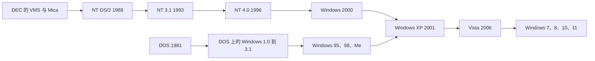

# Windows NT：微软为什么要重新发明 Windows

1993 年 5 月 3 日，星期一，上午 10 点 20 分。Dave Cutler 穿着白色锐步鞋、白裤子和一件印着“OVER THE LINE”的 T 恤，推门冲进微软 2 号楼的构建实验室（Build Lab）。每天早上这里要把两百多个程序员前一天提交的代码拼成一个能启动的系统，发给整个团队装在自己的机器上用。今天的构建还没出来。他盯着屏幕看了一会儿，一言不发地走了，几分钟后又回来，脸更红了：“你们在浪费一整个该死的上午。”两个负责构建的工程师各自从一大罐胃药里倒出一片嚼了下去（[《华尔街日报》1993 年的现场报道](https://vuink.com/post/grpu-vafvqre-d-dbet/windows/research/1993/0526-d-dhtml)）。

门边的墙上画着一个圈，标出 Cutler 有一次踢墙把脚趾踢裂的位置。就在前几天，他又一拳砸在墙上，这回正好砸在龙骨上，把手指打断了（[Showstopper! 开篇](https://www.amazon.com/Show-Stopper-Breakneck-Generation-Microsoft/dp/0029356717)）。

这个还没按时出来的程序叫 Windows NT。不到三个月后，1993 年 7 月 27 日，它交付制造。那一年它卖得很差。可今天你打开任何一台 Windows 电脑、一台 Xbox，或者 Azure 上的一台虚拟机，启动时装进内存的内核文件仍然叫 `ntoskrnl.exe`，就是这群人当年写出来的那颗内核的直系后代。

这篇按时间顺序讲这颗内核的故事：一个痛恨 Unix 的 DEC 老兵怎样带着二十个人来到雷德蒙；NT 怎样先在一块没人用的芯片上写，又在半路上从 OS/2 改成了 Windows；图形系统怎样从用户态搬进内核，十年后又大半搬了出来；游戏程序员怎样在台下喊“DOS！DOS！DOS！”；一颗为企业设计的内核怎样接住了家用电脑；以及蠕虫、蓝屏、推倒重来的 Longhorn，和至今没有吵完的那些争议。

## 第一幕：一个痛恨 Unix 的人（1971–1988）

Dave Cutler 1942 年生于密歇根，1965 年大学毕业后进了杜邦公司。他第一次接触计算机，是被派去用 IBM 7044 给客户做模拟模型，由此对操作系统怎么工作产生了兴趣。1971 年他跳槽到数字设备公司（DEC），先带队做了 PDP-11 上的实时系统 RSX-11M（[Dave Cutler](https://en.wikipedia.org/wiki/Dave_Cutler)）。

1975 年，DEC 的工程主管 Gordon Bell 担心公司的 16 位小型机卖不动了，决定推出一条 32 位的超级小型机产品线 VAX，配一个全新的操作系统。他挑中了 33 岁的 Cutler 来领这个项目，理由是“我们俩有一样的目标和好胜心……Dave 是终极的竞争者，他是真的想赢”。这个系统就是 VMS。Bell 后来称 Cutler 是“世界上最好的操作系统作者”（[微软 2016 年的 Cutler 专题](https://news.microsoft.com/features/the-engineers-engineer-computer-industry-luminaries-salute-dave-cutlers-five-decade-long-quest-for-quality/)）。

1982 年，厌倦了马萨诸塞州总部官僚气的 Cutler 告诉 Bell 自己要辞职创业。Bell 给了他一个没法拒绝的条件：“你想去哪儿就去哪儿，想带谁就带谁，想干什么就干什么。”Cutler 选了离总部三千英里外的华盛顿州贝尔维尤，离微软不远，成立了 DEC 西部实验室（DECwest）。他在那里做了 MicroVAX I，连微码都是他亲手写的。和他共事过的 Len Kawell 说：“很多人用高级语言思考，Dave 用机器的寄存器和指令思考。”

1986 年起，Cutler 在 DECwest 领导两个项目：一种叫 Prism 的 RISC 处理器，和跑在它上面的操作系统 Mica。1988 年，DEC 决定砍掉 Prism，改押另一条工作站路线。Cutler 的团队一下子没了事做（[Dave Cutler](https://en.wikipedia.org/wiki/Dave_Cutler)）。

在 G. Pascal Zachary 的《Showstopper!》里，一位跟了 Cutler 将近二十年的同事这样描述他：“Unix 就像 Cutler 一辈子的宿敌，是他的莫里亚蒂。他觉得 Unix 是一群博士组成的委员会设计出来的垃圾。从来没有一个头脑统领过整件事，看得出来。”（[Coding Horror 摘录](https://blog.codinghorror.com/showstopper/)）

### 盖茨的电话

同一时间的微软，正担心两件事。Nathan Myhrvold 给盖茨分析过：一是 RISC 处理器，在工作站上已经比同期的英特尔芯片强，而 DOS 和 BIOS 都绑死在 x86 上；二是 Unix，能多任务、能多处理器、能联网，唯一的缺点是各家厂商的版本互不兼容。盖茨认定 Unix 加 RISC 的组合会威胁微软，需要一个能在多种 CPU 上运行的“Unix 杀手”（[Windows NT 3.1](https://en.wikipedia.org/wiki/Windows_NT_3.1)）。

Bell 早在 1983 年就介绍 Cutler 和盖茨认识过。Prism 被砍后，Cutler 和几个同事本来打算自己开公司。Rob Short 回忆：“然后 Dave 接到了比尔·盖茨的电话。这把我们吓了一跳，因为那时候我们对微软评价不高。”后来他们和盖茨、鲍尔默、Myhrvold 见了一面。Short 说自己当时表示看不准硬件世界会怎么走，盖茨回答：“问题不是我们认为会发生什么，而是我们要怎样塑造这个行业。”他说从来没见过有人这么想问题。鲍尔默还专程去了 Cutler 家一趟，走后几个人面面相觑：“这是完全不一样的一种动物。”（[微软 2016 年专题](https://news.microsoft.com/features/the-engineers-engineer-computer-industry-luminaries-salute-dave-cutlers-five-decade-long-quest-for-quality/)）

Cutler 答应了，条件是可以带自己的人过来。1988 年 10 月 31 日，他到微软上班。一批 DECwest 的工程师很快跟来，后来写了 NT 输入输出系统的 Darryl Havens 回忆，他们周五向 DEC 递辞呈，下周一就在微软报到。

## 第二幕：NT OS/2，和一块没人用的芯片（1988–1990）

### 名义上，这是 OS/2 的下一版

Cutler 到微软时，微软和 IBM 正在联合开发 OS/2，一个要取代 DOS 的系统。1987 年底上市的 OS/2 1.0 用 286 的保护模式，但它是 16 位的，大量代码（包括文件系统 HPFS）是用汇编写的，只能跑在英特尔芯片上。

Cutler 的小组最初的任务是做 OS/2 3.0，内部叫 NT OS/2。2023 年 Cutler 接受前同事 Dave Plummer 长达三小时的访谈时说，他一开始就告诉微软“我不和 IBM 一起干活。他们可以评论设计什么的，但我不和他们一起干”。IBM 隔一阵派人来审查代码，意见“极其负面”，来审的人是 IBM 在奥斯汀做 AIX（IBM 自己的 Unix）的工程师（[Paul Thurrott 对访谈的整理](https://www.thurrott.com/windows/291293/dave-cutler-talks-nt-cairo-and-more)）。他们早期只能在 OS/2 上开发 NT，Cutler 的评价是：“我们迫不及待地想吃上自己的狗粮，好离开 OS/2。它太糟糕了。”

最初的二十来个人没有急着写代码，而是花了六个月写一份规格说明，把每一个接口的输入输出都定下来。这份设计手册如今收藏在史密森尼学会的美国国家历史博物馆里（[NT OS/2 Design Workbook](https://en.wikipedia.org/wiki/Windows_NT_3.1)）。Havens 说规格写得太细了，轮到他动手时，整个 I/O 系统的代码他三个星期就敲完了。1989 年 4 月，团队正式开始写代码，每周干六七天，每天两位数的小时（[微软 2016 年专题](https://news.microsoft.com/features/the-engineers-engineer-computer-industry-luminaries-salute-dave-cutlers-five-decade-long-quest-for-quality/)）。

### 故意不在 x86 上写

NT 的第一个目标平台不是英特尔 386，而是英特尔的另一块芯片 i860。那是一块 RISC 处理器，内部代号 N10，当时连实物都还没有。团队在 OS/2 1.2 上跑一个 i860 模拟器，在模拟器里写内核。后来微软自己做了一块 i860 单板，内部叫 Dazzle（[Mark Lucovsky 的幻灯片](https://osm.hpi.de/bsArch/2004-2005/Unit2/01c_w2k-hist-lucovsky.pdf)）。

为什么要自找麻烦？因为可移植性是 NT 的第一目标。人每天坐在 x86 机器前，手很容易滑进只有 x86 才有的指令、调用约定和硬件假设。先在一块自己不熟、别人也没在用的芯片上把内核跑通，这些习惯就混不进去。

1989 年 4 月，NT OS/2 的内核已经能在 i860 模拟器里运行。但团队渐渐发现 i860 并不适合做通用计算机，12 月转向 MIPS R3000，三个月就移植完了（[Paul Thurrott 转引](https://en.wikipedia.org/wiki/Windows_NT_3.1)）。i860 最终没有成为 NT 的发货平台，它留下的只有两个字母。

### NT 这两个字母

关于 NT 是什么意思，至少有三种说法。

最流行的是一个字母游戏：把 VMS 三个字母各往后挪一位，就是 WNT。这很符合 Cutler 的幽默感，可惜时间对不上，项目最早叫 NT OS/2，那时候还没有 W。

微软 1991 年的宣传片说，NT 代表“New Technology”，新技术。盖茨 1998 年在一次问答里又说，这两个字母已经不代表任何特定的意思了。

当事人的说法是第三种。最早的开发者之一 Mark Lucovsky 在幻灯片里写，名字来自 i860 的代号 N10，读作 N-Ten。写了任务管理器的 Dave Plummer 2025 年在推特上说得更直白：“Windows NT 不代表‘New Technology’，它代表 N-Ten，也就是 N10，那是 NT 开发起步时那块英特尔 i860 芯片的代号。”（[Windows NT](https://en.wikipedia.org/wiki/Windows_NT)）

### 三个目标

Cutler 给 NT 定了三个目标：可移植、可靠，以及一种他叫作“人格”（personality）的能力（[Windows NT 3.1](https://en.wikipedia.org/wiki/Windows_NT_3.1)）。

**可移植**落在写法上。内核主体用 C 写，图形和一部分网络用 C++，只有必须直接碰硬件、又对速度要求极高的一小部分用汇编，而且被收进一个单独的层，叫硬件抽象层（HAL）。换一种 CPU 或一种主板，主要改的就是这一层。连内存页的大小都不写死，由 HAL 在启动时告诉系统（[NT 4.0 内核态 GDI 白皮书](https://learn.microsoft.com/en-us/previous-versions/cc750820(v=technet.10))）。

**可靠**落在边界上，不靠程序自觉。内核态可以碰硬件、看得见所有进程的内存；用户态的每个程序有自己的虚拟地址空间，调度由内核抢占，程序不必记得让出 CPU，想霸占也霸占不了。系统里的内存、文件、设备、同步对象，一律抽象成“对象”，通过句柄访问，每个对象上都可以挂访问控制列表。开机之后要按 Ctrl+Alt+Del 再登录，这个组合键由内核直接接住，普通程序截获不了，所以恶意程序很难伪造一个假的登录框骗走密码。文件系统是新写的 NTFS，有权限、有日志、支持长文件名。

**人格**的意思是，同一颗内核外面可以挂上几套不同的应用程序接口。这个想法受了卡内基梅隆 Mach 微内核的影响：把操作系统的“接口”做成跑在用户态的服务进程，内核只提供最基本的原语。NT 最初规划了三套环境子系统：OS/2（主要的那套）、POSIX（为了进美国政府的采购清单），以及后来加进来的 Windows。

Cutler 在 2023 年的访谈里承认，这个想法有点天真：“线程调度、进程结构、分页这些东西，要让它们同时适应不同的环境，会变得很棘手。但我们就是从那里开始的。”（[Thurrott 的整理](https://www.thurrott.com/windows/291293/dave-cutler-talks-nt-cairo-and-more)）

测试也是新办法。团队判断自己没有人力写一套全面的测试用例，于是改用压力测试：每天夜里在几百台机器上把系统往死里压，第二天早上分拣失败，九点开缺陷会。Rob Short 说：“可能有一千个失败。怎么办？从第一个开始看……Dave 不怕一步一步蹚过去。”（[微软 2016 年专题](https://news.microsoft.com/features/the-engineers-engineer-computer-industry-luminaries-salute-dave-cutlers-five-decade-long-quest-for-quality/)）

## 第三幕：Windows 3.0 改写了赌注（1990–1991）

1990 年 5 月，微软发布了 DOS 上的 Windows 3.0。它终于好用了：增强模式用上了 386 的保护模式，程序能用到更多内存，界面也像样了。它卖疯了。到 1993 年夏天，Windows 3.x 三年里卖出了三千万份，每个月还在卖一百五十万份（[The Digital Antiquarian](https://www.filfre.net/2022/11/doing-windows-part-10-chicago/)）。

IBM 希望微软把精力集中在 OS/2 上，微软却看到开发者正围着 Windows 的接口写程序。1990 年 8 月，NT 团队做出了一个改变命运的决定：主接口从 OS/2 换成 Win32，也就是把 16 位的 Windows 接口加宽成 32 位。窗口、消息、GDI 这些概念都保留，已有的 Windows 程序很多只要重新编译就能跑。外壳也从 OS/2 的 Presentation Manager 换成了 Windows 3.x 的程序管理器（[Windows NT 3.1](https://en.wikipedia.org/wiki/Windows_NT_3.1)）。

这意味着整套图形子系统要重新设计。微软 2016 年的文章里，这件事被一笔带过：“团队必须把 Windows 16 位接口扩展成 32 位接口，并重新设计整个图形子系统。”（[微软 2016 年专题](https://news.microsoft.com/features/the-engineers-engineer-computer-industry-luminaries-salute-dave-cutlers-five-decade-long-quest-for-quality/)）盖茨后来在给 Cutler 申报国家技术奖的材料里强调了另一面：Windows 子系统是后加上去的，内核的设计没有因此改动。这恰好证明“人格”这个设计是成立的。

这个转向一开始没有告诉 IBM。原定在 1990 年 COMDEX 上的 NT 展示也取消了。1991 年 1 月 IBM 得知真相，合作随即破裂。此后 OS/2 2.0 及以后的版本由 IBM 独自开发，两家公司在企业桌面上正面对打。NT 里只留了一个很小的、只在 x86 上能用的 OS/2 1.x 字符程序子系统，算是那段婚姻的遗物。

### 给对手寄棺材

那几年微软和 Unix 阵营、IBM 之间的火药味很浓。Cutler 在访谈里讲过一件事：Sun 的 CEO Scott McNealy 有一次在台上牵出一条狗，让它对着一个印着微软标志的消防栓撒尿。NT 团队决定回敬。他们找来几口黑色的小纸棺材，塞进从生日贺卡里拆出来的发声模块，一打开就放《星球大战》里达斯·维达出场的“帝国进行曲”，再放进一份 NT 的零售许可证和一坨假狗屎，配上红玫瑰，分别寄给 McNealy 和 IBM 负责 OS/2 的 Lee Reiswig。

就在他们录一段内部视频介绍这些棺材的时候，刚来微软不久的高管 Jim Allchin 下楼找他们，说公司已经因为 DOS 惹上了官司，从今往后要收敛，不能再这么对待竞争对手，视频不准放，棺材也不准寄。Cutler 回答：“哎呀，那太可惜了，Jim，我们已经寄出去了。”（[Thurrott 的整理](https://www.thurrott.com/windows/291293/dave-cutler-talks-nt-cairo-and-more)）

## 第四幕：窗口画在哪里——NT 3.x 的客户端/服务器图形（1991–1995）

Win32 的接口和 16 位 Windows 长得一样，底下的实现却完全不同。这是 NT 和 Windows 3.x 最不一样的地方，也是后面一连串争论的起点。

在 Windows 3.x 里，`USER` 和 `GDI` 是所有程序共享的库，和程序跑在同一块内存里，显示驱动也在那里。一个程序可以把 GDI 的数据结构写坏，连带所有程序一起完蛋。

NT 3.x 按“人格”的思路，把窗口管理器（USER）和 GDI 都放进一个独立的用户态服务进程，叫客户端/服务器运行时子系统（Client/Server Runtime SubSystem），进程名 `CSRSS.EXE`，显示驱动也加载在这个进程里。应用程序调用的 `user32.dll` 和 `gdi32.dll` 只是薄薄一层“客户端”，真正的活要通过进程间通信发给 CSRSS 去做。应用程序写坏了自己的内存，碰不到窗口管理器；CSRSS 本身也被内核隔在另一个地址空间里。这是教科书式的微内核设计。

问题是图形调用太频繁了。画一个对话框就是几十上百次调用，每一次都跨进程往返一趟太慢。微软为此下了很多功夫（[NT 4.0 内核态 GDI 白皮书](https://learn.microsoft.com/en-us/previous-versions/cc750820(v=technet.10))）：

- 每个调用图形接口的客户端线程，在 CSRSS 里都配一个专属的服务线程，两者之间用一种叫 Fast LPC 的机制切换，切过去不引起一次正常的调度，服务线程直接用完客户线程剩下的时间片。
- 双方共享一块 64KB 的内存缓冲区，位图之类的大数据不用拷来拷去。
- 客户端可以直接只读访问服务端的一些关键数据结构，查个窗口属性不必跑一趟。
- GDI 调用先在客户端攒起来，攒够一批再一次性发过去，叫批处理（batching）。

即便如此，白皮书里给了一组数字：在一台奔腾 100 上，一次客户端到服务端的往返大约要 60 到 70 微秒，而一次普通的进内核再出来只要 4 到 5 微秒。对屏幕绘图来说，这个差距“大到用户看得出来”。

白皮书里还记下一个反直觉的现象：在 NT 3.51 上，一个单线程的图形程序在双处理器机器上跑，反而比在单处理器上略慢。因为客户线程调用 GDI 时是同步等待的，它和 CSRSS 里那个配对线程其实从不真正并行；两个线程共享大量状态，又常常被调度到不同的 CPU 上，处理器缓存得不停地来回同步。打开性能监视器能看到，两颗 CPU 各忙一半，很容易就能找到那个和忙碌的程序线程成对出现的 CSRSS 线程。

这笔账要到 NT 4.0 才会重算。

## 第五幕：1993 年的夏天，NT 3.1 交货

### 在自己正在盖的房子里住下

1991 年 10 月，NT 在 COMDEX 上第一次公开亮相，微软给选定的开发者发了 32 位开发包。《PC Magazine》称它是“操作系统的现代再发明”，同时怀疑承诺的向后兼容到正式版时能不能兑现（[Windows NT 3.1](https://en.wikipedia.org/wiki/Windows_NT_3.1)）。1992 年 3 月又推出 Win32s，让一部分 32 位程序能在 Windows 3.1 上试跑，开发者不必等 NT 的机器。1992 年 7 月的第一届 Win32 专业开发者大会上，将近五千名受邀者每人领到一份 NT 的预发布版（[The Digital Antiquarian](https://www.filfre.net/2022/11/doing-windows-part-10-chicago/)）。

在内部，Cutler 坚持一个原则：功能一过某个门槛，全组人都必须在最新的每日构建上工作，用他的话说是“吃自己的狗粮”。《Showstopper!》里形容，这就像一边住在房子里一边从头盖这栋房子。构建越早出来，大家越早发现毛病，所以构建晚了几个小时，Cutler 就会冲进构建实验室发火。负责构建的 Kyle Shannon 说：“他只冲他喜欢的人吼。”另一位构建工程师 Mitchell Duncan 常常睡在办公室，半夜还会被要构建的程序员叫醒（[斯坦福关于 NT 开发的案例](https://cs.stanford.edu/people/eroberts/cs181/projects/crunchmode/nt-story.html)）。

Zachary 书里记下了这组数字：大约 250 名程序员，560 万行代码，开发花费约 1.5 亿美元，最后一年修了三万多个缺陷（[Windows NT 3.1](https://en.wikipedia.org/wiki/Windows_NT_3.1)）。团队从 1988 年的二十来人，到五年后交货时扩张到大约 150 名工程师（微软官方数字）。

### 蓝屏为什么是蓝的

NT 内核遇到无法恢复的错误时，会把显示切回文本模式，满屏蓝底白字地打出一堆十六进制数，然后停机。这就是后来大名鼎鼎的“蓝屏死机”（BSOD）。

写这段代码的是 NT 内核工程师 John Vert，时间是 1991 年。他说选蓝底白字有两个原因：团队移植用的 MIPS 工作站，固件里的启动选项界面就是蓝底白字，出错界面跟它一致比较自然；另外他和很多同事当时用的文本编辑器 SlickEdit，默认配色也是蓝底白字。那一屏十六进制的错误码和栈转储，是 Mark Lucovsky 加上去的，客服人员偶尔会一丝不苟地让客户念出来抄进故障报告（[The Old New Thing 对 John Vert 的介绍](https://devblogs.microsoft.com/oldnewthing/20170926-00/?p=97085)）。

至于 Windows 3.1 和 95 也有蓝色的错误屏幕，Vert 认为那纯属巧合。微软的老工程师 Raymond Chen 专门澄清过这笔糊涂账：世上其实有三块不同的蓝屏。Windows 3.1 按 Ctrl+Alt+Del 弹出的那块蓝色提示，文字是鲍尔默写的，他视察时嫌原来的措辞不对，回去自己写了一版，几乎一字未改地进了产品；Windows 95 的蓝屏由 Raymond Chen 最后定稿；真正的“蓝屏死机”是 NT 的，出自 John Vert（[The Old New Thing](https://devblogs.microsoft.com/oldnewthing/20240730-00/?p=110062)，[Ctrl+Alt+Del 文字的来历](https://devblogs.microsoft.com/oldnewthing/20140902-00/?p=93)）。

### 交货，然后卖不动

1993 年 7 月 27 日，Windows NT 3.1 交付制造。版本号故意定成 3.1，挨着正在热卖的 Windows 3.1，暗示“你熟悉的那个样子”。首发只有 x86 和 MIPS 版，DEC Alpha 版 9 月跟上。工作站版 495 美元；高级服务器版对外标价 2995 美元，说是前六个月促销价 1495 美元，后来一直没涨回去。服务器按台卖，不按连接的客户端数目加价，这是冲着 Novell NetWare 的价目表来的（[Windows NT 3.1](https://en.wikipedia.org/wiki/Windows_NT_3.1)）。

它的最低配置是 25MHz 的 386、12MB 内存、75MB 硬盘，RISC 机器要 16MB。可当时大多数 PC 出厂只有 4MB 内存，而且内存很贵。推荐配置是 486 加 16MB，远高于普通人家里的机器，就这样跑起来也慢。当年 8 月《InfoWorld》的标题是：“Windows NT：一个健壮的服务器，一个糟糕的操作系统”。

更要命的是没有程序。1993 年 11 月的估计是，真正的 NT 原生程序只有大约 150 个，连办公套件都没有。用户只能跑 16 位老程序，而这些程序在 NT 上比在 Windows 3.1 上还慢。直接操作声卡、显卡的游戏，依赖 Windows 3.x 虚拟设备驱动（VxD）的程序，一概进不来。RISC 版更冷清：几乎没有人移植 32 位程序，16 位程序还得靠一个从 Insignia 公司买来的 286 模拟器，慢得可以。NT 3.1 在被 3.5 取代前大约卖了 30 万份。还有一个冷笑话：由于处理器检测代码的一个错误，NT 3.1 根本装不上奔腾 Pro 及以后的第六代处理器，微软一直没有修（[Windows NT 3.1](https://en.wikipedia.org/wiki/Windows_NT_3.1)）。

微软对外的定位本来就是“高端的那条线”。盖茨并不指望它在 1995 年前占领桌面，产品经理说它能占 Windows 销量的一到两成就符合预期。

### 16 位程序住在哪里

NT 为兼容老程序准备了好几层。DOS 程序放进“虚拟 DOS 机”，在 x86 上借助 386 的虚拟 8086 模式直接运行，每个 DOS 程序一个独立的空间。16 位 Windows 程序则再套一层“Windows on Windows”（WoW）。为了兼容 Microsoft Mail、Schedule+ 这类依赖“大家在同一块内存里”的老程序，所有 16 位 Windows 程序仍然挤在一个共享的地址空间里，仍然是协作式调度。一个 16 位程序死循环，可以把其他 16 位程序一起拖住，但拖不死内核，也拖不死旁边的 32 位进程（[Windows NT 3.1](https://en.wikipedia.org/wiki/Windows_NT_3.1)）。

这就是 NT 在兼容这件事上的基本姿态：老程序的坏习惯被关进一个笼子，笼子里照旧，笼子外不受影响。这个姿态它保持了三十年。

NT 还是第一个在内部统一用 Unicode 处理字符串的主流操作系统，文件名、窗口标题、内核对象名一律是 16 位宽字符。这在 1993 年是远见，后来却成了包袱：Unicode 很快突破了 16 位能表示的六万多个字符，NT 只好改用 UTF-16，用两个 16 位单元拼一个字符，这就是为什么今天 Windows 的 `wchar_t` 还是 16 位、而 Linux 上是 32 位。

### DEC 觉得眼熟

DEC 的工程师几乎立刻发现，NT 的内部结构似曾相识。DEC 出版社出的《VAX/VMS 内部结构与数据结构》里的很多章节，把术语换一换，就能准确地描述 NT 的内部；NT 代码树的目录结构，又能对上被取消的 Mica。据报道 DEC 准备起诉。双方最终没有闹上法庭，而是达成了和解：微软支付 6500 万到 1 亿美元（各方说法不一），帮 DEC 推销 VMS，为 DEC 的人员提供 NT 培训，并承诺继续支持 DEC 的 Alpha 处理器（[Windows NT](https://en.wikipedia.org/wiki/Windows_NT)，[Mark Russinovich, Windows NT and VMS: The Rest of the Story](http://www.itprotoday.com/windows-client/windows-nt-and-vms-rest-story)）。Alpha 因此成了 NT 早期的一等公民。

## 第六幕：两条线并排走（1994–1996）

### 企业那条线：更快、更小，和一张打了折扣的安全证书

1994 年 9 月的 NT 3.5，代号 Daytona，主题只有一个：让 3.1 变快变小。1995 年 5 月的 3.51，代号 Tukwila，加上了 PowerPC 支持（[Thurrott 的整理](https://www.thurrott.com/windows/291293/dave-cutler-talks-nt-cairo-and-more)）。NT 3.51 在服务器圈子里口碑很好，微软后来自己的白皮书都说它“击中了操作系统设计的甜点”（[NT 4.0 白皮书](https://learn.microsoft.com/en-us/previous-versions/cc750820(v=technet.10))）。

1995 年 8 月，打了第三个补丁包的 NT 3.5 拿到了美国国家安全局的 C2 安全评级，微软宣传它是第一个通过这项评估的主流图形界面操作系统（[微软知识库 137018](http://ftp.zx.net.nz/pub/archive/ftp.microsoft.com/MISC/KB/en-us/137/018.HTM)）。但这张证书有两个限定：评估的是一台不联网的单机；而且评估用的两台康柏服务器，软驱是禁用的。一家测评公司在报告里指出，只要能用软盘启动，NT 的身份认证、访问控制和审计就全都形同虚设。国安局的回答是，防软盘启动属于“物理安全”，不归操作系统管（[GCN 1995 年报道](https://www.route-fifty.com/digital-government/1995/09/c2-rating-aside-nt-isnt-secure/307772/)）。第二年，有人把 Linux 上读 NTFS 的代码移植到 DOS，做成一个叫 NTFSDOS 的小工具：用一张 DOS 启动盘引导 NT 的机器，就能无视所有权限读出硬盘上每一个字节。NT 的产品经理只能说，安全的前提是“硬件本身是安全的”，意思是把机房的门锁好（[1996 年报道](https://www.kaisernet.org/library/1996/0796/07n01001.htm)）。

### 家用那条线：大象站在灯柱上

1995 年 8 月 24 日，Windows 95 上市，史上最盛大的软件发布之一。它看起来是一个独立的操作系统，开机不再先见到 DOS 的命令行，但引导时仍然经过 MS-DOS 7，然后才切进 32 位世界。The Digital Antiquarian 的比喻很传神：Windows 3.1 是一头站在细细灯柱上的大象，Windows 95 则是一头用一只鳍优雅地立在灯柱上的蓝鲸，微软只是把底下那根柱子藏得更好了（[The Digital Antiquarian](https://www.filfre.net/2022/11/doing-windows-part-10-chicago/)）。

32 位程序在 95 上有了抢占式调度和各自的地址空间；16 位程序仍然挤在共享的、协作式的那块区域里；VxD 驱动仍然跑在最高权限。它换来的是即插即用、开始菜单、任务栏，以及厂商预装的渠道和游戏、驱动都已经在那里的整个生态。

为了让老程序在 95 上照样能跑，微软做了近乎英雄主义的努力。Joel Spolsky 讲过一个流传很广的例子：模拟城市（SimCity）有一个严重的 bug，释放一块内存后还接着用它。这在 DOS 上碰巧没事，在 Windows 上却会崩溃。Windows 团队的测试人员发现后，开发者反汇编了 SimCity，在调试器里找到问题，然后在 Windows 里加了一段特殊代码：检测到 SimCity 在运行，就让内存分配器进入一种特殊模式，释放后的内存仍然可以继续用。Raymond Chen 说：“有人指责微软在系统升级时恶意破坏程序，我听了格外愤怒。任何一个程序在 Windows 95 上跑不起来，我都当成自己的失败。”（[How Microsoft Lost the API War](https://www.joelonsoftware.com/2004/06/13/how-microsoft-lost-the-api-war/)）

### 游戏程序员喊着“DOS！DOS！DOS！”

95 发布前夕，微软的 Alex St. John 挨家拜访游戏公司，问他们下一款游戏愿不愿意做 Windows 版，得到的回答几乎全是否定的。理由很简单：在 DOS 下，游戏独占整台机器，可以直接往显存里写像素、直接拨显卡端口；在 Windows 下每画一笔都要穿过 GDI 好几层函数调用，慢得无法接受（[The Digital Antiquarian](https://www.filfre.net/2022/11/doing-windows-part-10-chicago/)）。

第一个尝试是一个叫 WinG 的库，由年轻的程序员 Chris Hecker 几乎独自写成。它让程序先在一块内存缓冲区里自由地画好一帧，再快速地整块贴到屏幕上。Hecker 知道拿什么游戏来证明它：他打电话给 id Software 的 John Carmack，要 DOOM 的源代码。Carmack 说自己没空学 WinG、也不信能移植，Hecker 说那我来做，你只要把源码给我。他用一个疯狂的周末完成了 WinDOOM，1994 年 4 月在游戏开发者大会上演示，DOOM 在 Windows 上全速运行，台下的人都惊了。

然后是 1994 年的圣诞节。迪士尼推出了基于 WinG 的《狮子王动画故事书》，结果它在康柏新出的一批电脑上频繁崩溃，因为那些机器的显卡驱动从没和 WinG 一起测试过。圣诞节早上，无数孩子拆开礼物装上游戏，然后电脑崩了，迪士尼的客服热线被愤怒的家长打爆（[DirectX](https://en.wikipedia.org/wiki/DirectX)）。

St. John 拉上 Craig Eisler 和 Eric Engstrom，另起炉灶。三个人在微软内部像一伙闯进来的土匪，拿着塑料战斧在走廊里吓唬同事，高管 Brad Silverberg 管他们叫“野兽男孩”（Beastie Boys）。项目的代号叫“曼哈顿计划”，意思是要用 PC 干掉日本的游戏机，原型的标志是一个发光的辐射符号。公关部门看到后要求立刻改掉。Eisler 耸耸肩：“曼哈顿计划改变了世界，不管是好是坏。而且我们真的很喜欢核爆。”（[The Digital Antiquarian](https://www.filfre.net/2022/11/doing-windows-part-10-chicago/)，[St. John 的访谈](https://episodiccontentmag.com/2015/11/13/alexstjohn_1/)）

St. John 后来解释过这个名字：“它之所以叫 DirectX，是因为它的设计初衷就是绕过操作系统，把 Windows 推到一边，把它从内存里赶出去，清掉所有跟游戏抢资源的垃圾，让游戏直接跑。”关闭 Windows 的图形系统，让游戏直接和显卡说话；不让 Windows 把游戏的内存换到硬盘上，好让帧率稳定；绕过消息队列拿到实时的鼠标输入，否则没法玩第一人称射击。

1995 年 4 月，St. John 包下了会场附近整个 Great America 游乐园，请所有参会者第二天去玩，顺便看个新东西叫 DirectX。他上台时，喝得半醉的观众开始有节奏地起哄：“DOS！DOS！DOS！”直到他调出一款游戏机游戏的 Windows 移植版，以每秒 83 帧运行，喊声才停下来。1995 年 9 月，DirectX 1.0 以“Windows Game SDK”的名义发布，比 Windows 95 晚了一个月，因为 95 本身不带它。St. John 管这叫“寄生式”分发：DirectX 跟着游戏光盘走，装游戏时顺便检查、顺便安装（[The Digital Antiquarian](https://www.filfre.net/2022/11/doing-windows-part-10-chicago/)）。

微软又主动提出免费替 id Software 把 DOOM 正式移植到 DirectX 上，负责这个项目的是后来创办 Valve 的 Gabe Newell。为了造势，St. John 想请盖茨出席一场万圣节主题的开发者活动，被公关拒绝了，只答应让盖茨录一段视频。到了片场，公关人员围着盖茨指手画脚，盖茨看出 St. John 的沮丧，打断他们问：“那我在这段视频里要干什么？”St. John 深吸一口气，递给他一把霰弹枪（[Kotaku](https://kotaku.com/that-time-bill-gates-starred-in-a-doom-promo-video-1776965033)）。视频里，穿着长风衣的盖茨在 DOOM 的画面里开枪。Doom95 在 1996 年 8 月发布，是第一款正式发行的 DirectX 游戏。

### NT 这边：开发者的工作站，玩家的荒地

这场革命几乎没有发生在 NT 上。NT 4.0 上的 DirectX 停在 3.0 版，此后再没更新，要到 Windows 2000 才重新跟上（[DirectX 版本表](https://en.wikipedia.org/wiki/DirectX)）。NT 不允许程序直接碰硬件，DOS 游戏在 NT 上大多跑不起来，VxD 驱动也装不进去。

可 NT 在另一片 3D 领域里是主角。在 Direct3D 出现之前，微软已经把硅图公司（SGI）的 OpenGL 加进了 NT，NT 成了专业 3D 工作站的系统。游戏程序员也喜欢在 NT 上开发，因为它不会动不动就死机。1996 年 12 月，Carmack 在他著名的 `.plan` 文件里公开表态：“Direct3D 立即模式是一个糟透了的接口。它给用它的程序员带来巨大的痛苦，却没有换来任何显著的好处……用 OpenGL 一行代码能做的事，用 D3D 要写半页。”他还抱怨微软扼杀了把 NT 上的 OpenGL 驱动模型带到 Windows 95 的计划（[Carmack 的 .plan](https://www.bluesnews.com/archives/carmack122396.html)）。这场 OpenGL 和 Direct3D 之争一直打到 2000 年代，最后 Direct3D 凭着 Windows 和 Xbox 赢下了游戏市场。

### NT 4.0：换上 95 的外衣，把图形搬进内核

1996 年，NT 4.0 发布，代号 SUR，意思是“外壳更新版”（Shell Update Release）。它最显眼的变化是换上了 Windows 95 的开始菜单、任务栏和资源管理器，企业用户终于不用再对着 3.x 时代的程序管理器了（[Thurrott 的整理](https://www.thurrott.com/windows/291293/dave-cutler-talks-nt-cairo-and-more)）。

更深的变化看不见：窗口管理器、GDI 和显示驱动，整体从用户态的 CSRSS 搬进了内核，成了一个叫 `win32k.sys` 的内核模块。CSRSS 里只剩下控制台窗口、关机和硬错误弹窗这几样。应用程序调用 GDI，现在和调用文件读写一样，直接陷入内核，不再有配对线程和共享缓冲区（[NT 4.0 内核态 GDI 白皮书](https://learn.microsoft.com/en-us/previous-versions/cc750820(v=technet.10))）。

这在当时引起了不小的争议。NT 一向以“微内核”式的模块化自豪，现在却把一大坨图形代码塞进了最高权限。微软专门发了一份白皮书辩护，论证相当有意思：

- 世上没有哪个商用操作系统是纯粹的微内核，因为太慢。NT 从一开始就把内存管理、文件系统、网络协议栈这些高性能部件放在内核态，只是保持了模块化。图形是唯一一处按“更纯粹的微内核”做的地方，而这一处恰恰是和硬件交互最频繁的。
- 白皮书反问：假设文件系统有 bug，放在用户态确实不会让整个系统崩溃，但“一个时不时崩溃的系统，和一个一直在运行却丢了全部磁盘访问的系统，实际使用中有什么区别？”图形子系统也是一样，CSRSS 挂了，系统本来就会随之停下。
- 至于有人担心这会影响多处理器扩展，白皮书指出 NT 3.51 上的图形调用本来就是同步的，从没真正并行过，那个“单线程图形程序在双 CPU 上反而更慢”的怪现象，搬进内核后反而消失了。

它说的大体不错，图形确实快了，内存也省了 256KB 到 1MB。可代价在十几年后才完全显现。`win32k.sys` 成了 Windows 内核里最庞大、最复杂的一块，又要频繁地“回调”用户态代码，成了提权漏洞的富矿。2011 年的 Black Hat 大会上，研究员 Tarjei Mandt 专门讲了一场如何利用 win32k 的用户态回调攻击内核，他披露的漏洞里仅一次补丁就修了几十个（[Mandt 的论文](https://media.blackhat.com/bh-us-11/Mandt/BH_US_11_Mandt_win32k_WP.pdf)）。后来浏览器沙箱纷纷要求禁用 win32k 的系统调用，就是这个原因。显示驱动写崩了，也能直接把整台机器带走。可靠和速度在这里做过一次交换，这笔账要到 Vista 才还。

### 任务管理器和弹球

NT 4.0 里还多了一个今天人人都用的小工具：任务管理器。它的作者 Dave Plummer 1993 年从加拿大来微软 DOS 组实习，后来转到 NT。他在家里的书房写出了第一版，本来打算当共享软件在外面卖。同事们看到了纷纷要拷贝，传到了 Cutler 那里。Cutler 很喜欢，允许他把它放进 Windows 的源码树（[Dave Plummer](https://en.wikipedia.org/wiki/Dave_Plummer)）。Plummer 最得意的是：“它大概是第一个、至少是视觉上最复杂的一个，能在所有方向上自由缩放而完全不闪烁的程序……exe 不到 100KB，从来不闪也从来不崩，这是我的追求。当然，负责 GDI32 和 User32 的人就在走廊那头，帮了大忙。”（[The Register](https://www.theregister.com/software/2020/05/26/i-wrote-task-manager-ex-microsoft-programmer-dave-plummer-spills-the-beans/1444909)）

Plummer 还把 Windows 95 附带的《太空学员弹球》移植到了 NT 上，这款游戏一直跟着 NT 走到了 XP。它的结局后面再讲。

## 第七幕：一张注册表、一个没做成的开罗、一块蓝屏（1996–1999）

### 工作站和服务器，只差一个注册表值

NT 4.0 工作站版的许可协议规定，最多只能有 10 个网络连接。当时微软正和网景（Netscape）在 Web 服务器市场上激烈竞争，网景的算盘是：客户买便宜的 NT 工作站，装上网景的服务器软件就能建网站。微软回应说，那违反许可协议，“NT 工作站和 NT 服务器是两个非常不同的产品，用于两种非常不同的用途”。

1996 年，O'Reilly 出版社的 Andrew Schulman 和系统研究者 Mark Russinovich 拆开看了看。结论是两个版本的内核是同一个文件，区别主要取决于注册表里的一个值：`ProductType` 是 `WinNT` 就是工作站，是 `ServerNT` 或 `LanmanNT` 就是服务器。在 3.51 上，任何用户用注册表编辑器把它改掉、重启，机器就成了服务器，可以装微软自家的服务器套件。到了 4.0，微软加了第二个隐藏的校验值，还专门起了两个工作线程盯着这两个键，一旦被改就立刻改回去，并弹窗警告：“不允许篡改产品类型”。两个值不一致，开机直接蓝屏（[O'Reilly 的分析](https://landley.net/history/mirror/ms/differences_nt.html)）。这件事后来成了“软件的功能差异只是价格歧视”这类争论里的经典案例。Russinovich 后来成立了 Sysinternals，写出 Process Explorer 等一批工具，2006 年被微软收购，如今是 Azure 的首席技术官。

### 开罗：一场用狗粮决出胜负的内战

NT 3.x 发布后，微软内部还有另一个更宏大的计划，代号 Cairo（开罗）。它由 1990 年从 Banyan 公司挖来的 Jim Allchin 主导，要做一个面向对象的下一代操作系统，核心是一个对象文件系统（OFS），文件不再是一串字节，而是可以查询的对象。盖茨很看好 Allchin。

Cutler 在 2023 年的访谈里讲了这场暗战。Windows 95 的界面出来后很受欢迎，NT 组想把它搬到 NT 上，Allchin 说不行，那要留给 Cairo。Cutler 说服他两边都做：Tukwila 先移植 95 的界面，Cairo 继续做更复杂的对象化界面，构建实验室优先保证 Cairo 的构建。“我不知道他为什么信了这套说法，但他信了。”结果是，“Tukwila 每天都能出构建，Cairo 永远是坏的”（[Thurrott 的整理](https://www.thurrott.com/windows/291293/dave-cutler-talks-nt-cairo-and-more)）。

Cutler 认为差别就在狗粮上。NT 组做 NTFS 时有一条铁律：文件结构你想改几次都行，但不能让人没法启动旧系统、读不了旧格式，要么就地升级，要么兼容旧的。Cairo 组没有这条纪律，也没有逼自己在自己的代码上过日子。“那些人一直承诺、一直承诺，但他们没把老化测试做好，最后错过了一个日期，于是他（Allchin）说，好吧，OFS 砍了。”Cairo 最后只有两样东西进了 NT：新的文件服务器软件，和 Kerberos 认证。“其他的全都扔在地上了。”

这不是最后一次。十年后，一个叫 WinFS 的“数据库式文件系统”会在 Longhorn 里重演同样的命运。

### “这大概就是我们还没发布 Windows 98 的原因”

1998 年 4 月 20 日，芝加哥春季 COMDEX，盖茨在台上演示即将发布的 Windows 98。助手 Chris Capossela 插上一台 USB 扫描仪，准备展示即插即用：“它会说，嘿，我看到你插了一个新设备……”屏幕瞬间变成了蓝底白字。台下掌声雷动。盖茨愣了一下说：“看来我们还有些 bug 要修。这大概就是我们还没发布 Windows 98 的原因。”（[《纽约时报》](https://archive.nytimes.com/www.nytimes.com/library/tech/98/04/circuits/articles/23geek.html)）第二天，美国司法部对微软的反垄断案就要在华盛顿开庭。

那块蓝屏是消费级那条线的，不是 NT 的。但它成了“Windows 不稳定”最深入人心的画面。

### 万圣节文件

同一年的 10 月底，一份标着“微软机密”的内部备忘录泄露给了开源倡导者 Eric Raymond。作者是微软的项目经理 Vinod Valloppillil，应 Allchin 的要求写给高管 Paul Maritz，主题是开源软件，尤其是 Linux，对微软意味着什么。Raymond 在万圣节周末给它加上批注公开发表，随后又拿到了第二份专门分析 Linux 的备忘录。文件承认开源软件“对微软构成直接的、短期的收入和平台威胁，尤其是在服务器领域”，还讨论了应对的战术。微软后来承认了文件的真实性（[Halloween documents](https://en.wikipedia.org/wiki/Halloween_documents)，[Raymond 的批注版](https://www.damtp.cam.ac.uk/user/mem2/papers/LHCE/halloween.html)）。NT 当年要打的敌人是 Unix 厂商，现在换成了一个芬兰学生起头、全世界志愿者一起写的系统。

### 可移植性的第一次退潮

NT 最引以为傲的多平台支持，在九十年代末一个接一个地消失。MIPS 和 PowerPC 停在了 NT 4.0。1999 年 8 月，收购了 DEC 的康柏宣布不再为 NT 支持 Alpha，几天后微软也取消了 Alpha 上的 Windows 2000（[Windows NT](https://en.wikipedia.org/wiki/Windows_NT)）。货架上的 NT 只剩下 x86。

Alpha 在内部还多活了一阵。当时英特尔的 64 位安腾处理器还没有实物，微软判断把 32 位 Windows 改成 64 位，大部分工作量在于 32 位到 64 位的转换，而不在具体的芯片，于是先把 Alpha 版的 32 位 Windows 改成 64 位，在真实存在的 Alpha 机器上把 64 位 Windows 跑了起来。Raymond Chen 就是在这台 64 位 Alpha 上移植那个弹球游戏的，也是在这台机器上发现了一个诡异的 bug：球会像幽灵一样穿过一切物体，从发射器出来后慢慢地穿过弹簧，从桌子底部掉出去。

弹球是外包公司多年前写的，几乎没有注释，“微软从来没有人理解这段代码是怎么工作的”，两个人调了一阵，连碰撞检测的代码在哪里都没找到。还有几百万行代码等着移植，他们当场拍板：把弹球从产品里拿掉。这就是为什么 Vista 之后再也没有这款游戏（[Why was Pinball removed from Windows Vista?](https://devblogs.microsoft.com/oldnewthing/20121218-00/?p=5803)，[后续补充](https://devblogs.microsoft.com/oldnewthing/20220106-00/?p=106122)）。另一个小插曲是，到了 XP 时代硬件快了太多，这款游戏在早期构建上会以每秒上百万帧的速度空转，吃满一整颗 CPU，于是 Plummer 给它加了一个帧率限制。

## 第八幕：两条河汇流（2000–2001）

2000 年 2 月 17 日，Windows 2000 发布，版本号是 NT 5.0，但产品名里第一次去掉了“NT”，只在包装上印着“基于 NT 技术构建”。它带来了活动目录（Active Directory）、即插即用、电源管理和 USB 支持，桌面也终于好用了。同年 9 月，消费级那条线出了最后一版 Windows Me。

两条线并排走了七年，维持两套代码、两套驱动、两套测试。让消费者迁到 NT 的障碍一直是那几样：游戏和老程序、驱动覆盖不全、内存太贵。现在内存便宜了；微软推出的 WDM 驱动模型让一部分驱动可以同时给 98 和 2000 写；DirectX 也终于在 Windows 2000 上跟上了。

2000 年 1 月，Paul Thurrott 报道，原本打算做消费级 NT 的 Neptune 项目和做 Windows 2000 企业后继的 Odyssey 项目被合并成一个，代号 Whistler，取自微软员工常去的惠斯勒滑雪场（[Windows XP](https://en.wikipedia.org/wiki/Windows_XP)）。消费级和企业级从此用同一份代码，分成家庭版和专业版。

2001 年 8 月 24 日，构建号 2600 交付制造，10 月 25 日零售，名字叫 Windows XP，内核版本 NT 5.1。微软的技术说明写得很清楚：XP 同时接替 Windows Me 和 Windows 2000，代码基于 Windows 2000（[Windows XP Technical Overview](https://learn.microsoft.com/en-us/previous-versions/windows/it-pro/windows-xp/bb457060%28v=technet.10%29)）。DOS 从此不再躺在任何一个 Windows 的启动路径上。POSIX 和 OS/2 子系统也从 XP 拿掉了，采购清单上那两格已经不值得留在产品里。

XP 的外观第一次可以“换皮肤”，默认的主题叫 Luna，蓝色的任务栏、绿色的开始按钮，控件由一个主题引擎来画。GDI 之外又多了一个 C++ 写的 GDI+，支持抗锯齿、渐变、半透明和 PNG、JPEG，XP 自带的画图、图片查看器都用它。只是它全靠 CPU 渲染，比有硬件加速的 GDI 慢一个数量级。微软有人测过，同一段文字渲染代码，GDI 每秒能画 99,000 个字形，GDI+ 只有 16,600 个（[GDI](https://en.wikipedia.org/wiki/Graphics_Device_Interface)）。

### XP 的代码是怎么来的

家用电脑第一次默认跑在有账户、有权限、有独立地址空间的内核上。这是 1988 年那次雇用的真正回报。可 Cutler 对 XP 的评价并不高。

据他在访谈里的说法，Windows 2000 的工作站版和服务器版原本在同一份代码上并行开发。2000 做完后，负责服务器的 Dave Thompson 说下一版需要三年，负责客户端的 Chris Jones 说等不了，消费者对质量的期望没有企业那么高，他的团队 18 个月就能出一版。于是代码分了家。“没过多久，消费版的代码就几乎编译不过、几乎跑不起来了。与此同时，我们在服务器分支里修掉了一大堆安全问题，这些在客户端分支里都没修。”（[Thurrott 的整理](https://www.thurrott.com/windows/291293/dave-cutler-talks-nt-cairo-and-more)）

XP 大获成功，然后，它的安全问题爆发了。

## 第九幕：蠕虫之年与“可信计算”（2001–2004）

XP 发布前后，Windows 世界经历了它最狼狈的几年。2001 年 7 月，红色代码（Code Red）蠕虫利用微软 Web 服务器 IIS 的漏洞在网上疯传；9 月的尼姆达（Nimda）更凶。很多企业开始认真考虑还要不要用 IIS（[微软安全博客的回顾](https://www.microsoft.com/en-us/security/blog/2022/01/21/celebrating-20-years-of-trustworthy-computing/)）。2003 年 8 月，冲击波（Blaster）蠕虫利用 Windows 远程过程调用服务的漏洞，不需要用户做任何操作，只要机器联网就会中招，然后倒计时重启（[Blaster](https://en.wikipedia.org/wiki/Blaster_%28computer_worm%29)）。

NT 在设计上有账户、有权限、有访问控制，可 XP 为了兼容大量假定自己“什么都能干”的老程序，默认让用户以管理员身份登录；防火墙有，但默认关着；许多服务在开箱状态下就对网络开放。内核换了，人的习惯和程序的假定还停在 DOS 时代。

2002 年 1 月 15 日下午 5 点 22 分，盖茨给全体正式员工发了一封邮件，标题是“可信计算”（Trustworthy Computing）。他写道，可信计算要像电、水和电话一样可用、可靠、安全；“过去我们靠添加新功能来让软件更吸引人……但如果客户不信任我们的软件，这些了不起的功能都没有意义。所以从现在起，当我们面临添加功能和解决安全问题之间的选择时，我们必须选择安全。”（[WIRED 刊出的备忘录全文](https://www.wired.com/2002/01/bill-gates-trustworthy-computing/)）

随后 Windows 部门停下新功能开发，全员做了几个月的安全审查。Cutler 说他的团队终于有机会看 XP 的源码了，“我们把所有东西过了一遍，有些代码，就像你用来翻粪的那种铁锹”，最差的是输入法（IME）的代码，他们前后修了大约五千个 bug（[Thurrott 的整理](https://www.thurrott.com/windows/291293/dave-cutler-talks-nt-cairo-and-more)）。成果是 2004 年 8 月的 XP SP2：一个两百多兆的大补丁，默认打开防火墙，加入了数据执行保护（DEP），重写了大量网络服务的默认设置。微软也在这期间形成了后来影响整个行业的安全开发生命周期（SDL）。

2004 年 2 月又出了一件事：一部分 Windows NT 4.0 和 Windows 2000 的源代码在网上流传。微软调查后说，这不是自己的网络被攻破，源头是一家有合法源码授权的以色列合作公司 Mainsoft，泄露的是 2000 年 7 月的 Windows 2000 SP1 代码的一小部分（[微软声明](https://news.microsoft.com/source/2004/02/12/statement-from-microsoft-regarding-illegal-posting-of-windows-2000-source-code/)，[OSnews](https://www.osnews.com/story/6005/windows-source-leak-traces-back-to-mainsoft/)）。有人写了一篇只引用注释、不引用代码的分析，发现里面满是“UGLY TERRIBLE HACK”之类的注释，还有为了兼容某个第三方程序的奇怪行为而写的特殊处理。作者的评价很中肯：写着“丑陋可怕的 hack”的代码往往是好代码，因为在坏代码里，丑陋的 hack 根本不值得注明（[kuro5hin 的分析](https://web.archive.org/web/20160909101357/http:/atdt.freeshell.org/k5/story_2004_2_15_71552_7795.html)）。

## 第十幕：Longhorn 的坍塌（2001–2006）

### 三根支柱

2001 年 5 月，XP 还没发布，微软就开始做下一版，代号 Longhorn，名字取自惠斯勒和黑梳山两座滑雪场之间的一家酒吧。它原本只是 XP 和下一个大版本 Blackcomb 之间的过渡版，却越长越大，把 Blackcomb 的很多野心都吞了进来（[Development of Windows Vista](https://en.wikipedia.org/wiki/Development_of_Windows_Vista)）。

它号称有三根支柱：Avalon，一套全新的、基于 .NET 托管代码、用 XML 描述界面、由 DirectX 渲染的图形框架；Indigo，一套新的通信框架；以及 WinFS，一个把文件系统变成关系数据库的存储层。外壳要用托管代码重写。

2004 年，Joel Spolsky 写了一篇影响很大的文章《微软是怎么输掉 API 战争的》。他把微软内部分成两派：“Raymond Chen 派”相信兼容压倒一切，不惜在系统里给 SimCity 开后门；“MSDN 杂志派”则不停地推出新的、复杂的技术，要开发者追着学。他认为后一派已经赢了：“现在我们被告知，不要再用 Win32 了，准备迎接 WinFX 吧，下一代 Windows API。全都不一样。基于 .NET 托管代码。XAML。Avalon。”而刚刚推出的 WinForms 还没普及就要被 Avalon 取代，“WinForms 完全是死胎”（[How Microsoft Lost the API War](https://www.joelonsoftware.com/2004/06/13/how-microsoft-lost-the-api-war/)）。

### “LH 是头猪”

问题是 Longhorn 做不出来。2004 年 1 月 7 日早上 8 点 38 分，Windows 开发主管 Jim Allchin 给盖茨和鲍尔默发了一封邮件，标题是“迷失了方向……”，开头就是“这是一通牢骚，抱歉”。他写道：“我认为我们的团队已经忘了没有 bug 意味着什么，韧性意味着什么，完整的场景意味着什么，安全意味着什么，性能意味着什么……我看到很多零散的功能和一些伟大的愿景，但这没有变成伟大的产品。如果我不是在微软工作，我今天就会去买一台 Mac。”在结尾，他写下了那句后来被反复引用的话：“LH 是头猪，我看不到任何解决办法。”（[WIRED 刊出的邮件原文](https://www.wired.com/2007/01/ms-execs-id-buy/)）这封邮件后来在艾奥瓦州的一场反垄断诉讼中作为证据公开。

据《华尔街日报》后来的报道，2004 年 7 月 Allchin 告诉盖茨，Longhorn 进度严重落后，不可能按时完成（[longhorn.ms](https://longhorn.ms/the-reset/)）。2004 年 8 月 27 日，微软宣布重大调整：Longhorn 几乎从头来过，改以即将发布的 Windows Server 2003 SP1 的代码为基础，只把真正要发货的功能一点点加回去；功能先组件化再进主干；构建实验室体系推倒重建；Windows 源码树里基本禁止使用 .NET 托管代码。WinFS 被推迟，后来干脆取消，和十年前的 Cairo 对象文件系统一样没能上路（[Development of Windows Vista](https://en.wikipedia.org/wiki/Development_of_Windows_Vista)）。

Cutler 在访谈里给了这段历史另一个视角。他说 Longhorn 团队当初用的是 bug 缠身的 XP 客户端代码做基础，而不是更干净、更安全的服务器代码。与此同时他正和 AMD 合作做 64 位的 x86 扩展，也就是后来的 AMD64（x64），觉得它太好了，自作主张地决定 Windows 以后就走这条路，带着团队在模拟器上做出了 64 位的工作站版和服务器版，拿到第一批真机时直接就能启动。“Longhorn 那帮人就是没法把 Longhorn 弄出构建实验室。我跟 Allchin 说，这是扯淡，你们应该把代码库换成 x64 的代码库。最后我们就是这么做的。”他私下管 Longhorn 叫“Does-it-matter-horn”（有什么要紧角）。“这就是我们今天用的代码库，一切仍然是统一的。”（[Thurrott 的整理](https://www.thurrott.com/windows/291293/dave-cutler-talks-nt-cairo-and-more)）2005 年春天，Windows XP 专业版 x64 和 Server 2003 x64 发布，Cutler 说这是他在微软“最有成就感的工作之一”（[微软 2016 年专题](https://news.microsoft.com/features/the-engineers-engineer-computer-industry-luminaries-salute-dave-cutlers-five-decade-long-quest-for-quality/)）。

## 第十一幕：Vista 把显卡驱动请出内核（2006–2008）

2006 年 11 月 8 日，Longhorn 以 Windows Vista 的名字交付制造，2007 年 1 月 30 日零售。它是 NT 4.0 以来图形架构变化最大的一次，也是 NT 4.0 那次交换的一次“还账”。

### 从“画在屏幕上”到“画在自己的纸上”

从 Windows 1.0 到 XP，屏幕只有一块。每个程序收到 `WM_PAINT` 后，通过 GDI 直接画到屏幕上属于自己窗口的那一块区域。窗口被挡住的部分就不存在了，挡住它的窗口一挪开，系统再发一次 `WM_PAINT` 让它重画。程序卡住没响应，露出来的那块就是一片白，或者留着上一个窗口拖过的残影。

Vista 引入了桌面窗口管理器（Desktop Window Manager，DWM），这是一个合成器。每个窗口不再直接画到屏幕上，而是画到一块属于自己的离屏缓冲区里，DWM 再用 GPU 把所有窗口的缓冲区像贴纸一样合成成最终画面，可以加上半透明的毛玻璃（Aero）、阴影、缩略图和切换动画。窗口挪动时，底下的窗口不用重画，因为它的内容一直完整地存在自己那张“纸”上（[GDI](https://en.wikipedia.org/wiki/Graphics_Device_Interface)）。这和 Linux 世界同期出现的合成式窗口管理器是同一个思路。

一个意外的后果是：在 Vista 上，传统的 GDI 绘图反而不再有硬件加速了，它们先在 CPU 上画进窗口的缓冲区，再交给 DWM。直到 Windows 7 的驱动模型 1.1 才把一部分 GDI 的块传送操作重新交给 GPU。

### 新的驱动模型

为了支撑 DWM，Vista 换了一套显示驱动模型，叫 WDDM。微软给出的理由首先是稳定性：“根据 Windows XP 时代收集的崩溃分析数据，显示驱动造成了多达 20% 的蓝屏。”（[Windows Vista Display Driver Model](https://learn.microsoft.com/en-us/previous-versions/dotnet/articles/aa480220(v=msdn.10))）

WDDM 把显示驱动拆成两半：一个精简的内核态驱动（KMD），只负责最底层的硬件操作；一个用户态驱动（UMD），以 DLL 的形式加载进每个使用 Direct3D 的进程，承担把高层的绘图命令翻译成 GPU 指令这种繁重而复杂的工作（[WDDM Architecture](https://learn.microsoft.com/en-us/windows-hardware/drivers/display/windows-vista-and-later-display-driver-model-architecture)）。大部分驱动代码从此回到了用户态，出了问题最多影响一个程序。操作系统自己在内核里有一个 DirectX 图形核心（`dxgkrnl.sys`），负责 GPU 的调度和显存管理，GPU 第一次像 CPU 一样被多个程序分时共享。

WDDM 还加了一个叫“超时检测与恢复”（TDR）的机制：GPU 调度器发现某个任务执行超过两秒还没完成，也抢占不下来，就判定 GPU 卡死了，调用驱动的复位函数，清掉显存里的所有分配，重置 GPU，然后恢复桌面（[TDR](https://learn.microsoft.com/en-us/windows-hardware/drivers/display/timeout-detection-and-recovery)）。用户看到的是屏幕黑一下、闪一下，右下角弹出“显示驱动程序已停止响应，并且已恢复”，而不是蓝屏。

从 NT 3.x 把显示驱动放在用户态的 CSRSS 里，到 NT 4.0 搬进内核，再到 Vista 把大半搬回用户态，绕了一个大圈。区别在于，1996 年的问题是跨进程太慢；2006 年有了 GPU，繁重的活本来就交给了硬件，CPU 这边的驱动放在用户态也不再是瓶颈。

### 转型的阵痛

Vista 发布后口碑很差。WDDM 是全新的驱动模型，显卡厂商的驱动一时跟不上。后来一场关于“Vista Capable”营销标签的集体诉讼中，法官下令公开了一批微软内部邮件和图表，其中一张列出了 2007 年某段时间 Vista 上驱动导致的崩溃来源：NVIDIA 以约 47.9 万次、占 28.81% 高居第一，其次是微软自己（17.97%）、来源不明（17.07%）、ATI（9.30%）和英特尔（8.83%）（[CRN](https://www.crn.com/news/components-peripherals/206905475/vista-capable-suit-sheds-harsh-light-on-nvidia)，[Ars Technica](https://arstechnica.com/gadgets/2008/03/vista-capable-lawsuit-paints-picture-of-buggy-nvidia-drivers/)）。有评论指出，这些统计里包含了大量 TDR 事件，也就是驱动被重置而系统并没有真正崩溃的情况（[ZDNET](https://www.zdnet.com/article/putting-perspective-on-the-30-of-vista-crashes-caused-by-nvidia-reports/)）。换句话说，一部分在 XP 上会变成蓝屏的故障，在 Vista 上变成了屏幕闪一下。

那场诉讼本身也是一个故事。为了不影响英特尔的季度业绩，微软放宽了“Vista Capable”标签的硬件门槛，让一批集成显卡跑不动 Aero 的电脑也贴上了这张标签（[Ars Technica](https://arstechnica.com/gadgets/2008/03/vista-capable-lawsuit-paints-picture-of-buggy-nvidia-drivers/)）。再加上频繁弹出的用户账户控制（UAC）提示，Vista 成了继 Me 之后又一个被嘲笑的版本。可 UAC 做的事，恰恰是 NT 从第一天就想做、XP 为了兼容没敢做的事：让人平时以普通用户的权限运行程序，需要管理员权限时再明确地问一下。

## 第十二幕：同一颗内核，一张张不同的脸（2009–2026）

### 7 和 8：一次救赎，一次豪赌

2009 年 10 月的 Windows 7 由 Steven Sinofsky 领导，是对 Vista 的一次修复：同样的内核和驱动模型，更少的打扰，更好的性能。它大获成功，很多人一直用到 2020 年支持结束。

2012 年 10 月的 Windows 8 是一次豪赌。为了应对 iPad，它拿掉了用了十七年的开始按钮，开机进入全屏的触控“开始屏幕”，传统桌面成了其中一个磁贴。同时推出的 Windows RT 跑在 ARM 芯片上，只能运行商店里的新式应用。可移植性这个 NT 的老本领，时隔十三年再次派上用场：内核主体还是那一份 C 代码，换一个硬件抽象层，重新编译。可 Windows RT 没有应用，也跑不了任何老的桌面程序。Sinofsky 在 Windows 8 上市后不到一个月离开微软；2013 年 7 月，微软为卖不动的 Surface RT 平板计提了约 9 亿美元的库存减值。Windows 8.1 又把开始按钮加了回来。

### 10：“最后一个版本”

2015 年 5 月，微软的一位开发者布道师 Jerry Nixon 在大会上随口说了一句：“因为 Windows 10 是 Windows 的最后一个版本，我们都还在做 Windows 10。”微软随后解释，这指的是“Windows 即服务”：不再每隔几年出一个大版本，而是持续推送更新（[Ars Technica](https://arstechnica.com/information-technology/2015/05/windows-10-to-be-the-last-version-of-windows-until-the-next-version/)）。这句话后来被反复拿出来嘲讽，因为 2021 年就有了 Windows 11。

Windows 10 时代最让人意外的，是 NT 那个被 XP 拿掉的“人格”设计，以一种新的面貌回来了。2014 年，新任 CEO 萨提亚·纳德拉在台上说“微软爱 Linux”，距离鲍尔默 2001 年在《芝加哥太阳时报》上说“Linux 是癌症”只过了十三年（[The Register](https://www.theregister.com/software/2022/07/13/microsoft-is-a-linux-and-open-source-company/969228)）。2016 年，Windows 10 推出了 Windows 的 Linux 子系统（WSL）：未经修改的 Linux ELF 程序，比如 `/bin/bash`，直接在 Windows 上运行。

它的实现方式是一种叫“微进程”（pico process）的东西，来自微软研究院的 Drawbridge 项目：一个几乎空白的进程，没有 Win32 的那些进程环境块。它发出的每一个系统调用，NT 内核都不自己处理，而是转交给一个注册过的内核驱动 `lxcore.sys`，由它把 Linux 的系统调用翻译成 NT 的内核调用；实在没有对应的，比如 `fork()`，就由驱动自己实现（[WSL 架构概述](https://learn.microsoft.com/en-gb/archive/blogs/wsl/windows-subsystem-for-linux-overview)）。WSL 团队在博客里写道，这和他们内部一直在讨论的一个长期方向不谋而合：“把子系统的想法带回来”（[Pico Process Overview](https://learn.microsoft.com/en-us/archive/blogs/wsl/pico-process-overview)）。1989 年 Cutler 设想的“一颗内核，多种人格”，在 POSIX 子系统被撤掉十五年后，以运行真正的 Linux 程序的方式兑现了。只是这条路最终也没有走到底：文件系统性能和兼容性问题太难啃，2019 年的 WSL 2 改成在一个轻量虚拟机里运行真正的 Linux 内核。

### 11：TPM、Recall 和一次全球大宕机

2021 年 10 月的 Windows 11 要求电脑必须有 TPM 2.0 安全芯片和较新的处理器，大量性能完全够用的老电脑被拒之门外，至今仍有很多人用 Rufus 之类的工具绕过检查（[PC Gamer](https://www.pcgamer.com/software/windows/microsoft-nixes-details-of-its-windows-11-tpm-2-0-security-bypass-though-there-are-still-other-ways-of-getting-the-latest-os-on-unsupported-hardware/)）。微软的理由是安全：Windows 11 默认启用基于虚拟化的安全（VBS），用虚拟机管理程序把一部分安全关键的代码和数据隔离到一个连 NT 内核本身都碰不到的地方。内核不再是最高的那一层了。2025 年 10 月 14 日，Windows 10 停止支持。

2024 年 5 月，微软发布了一批搭载高通骁龙 ARM 芯片的 Copilot+ PC，Windows 在 ARM 上终于有了像样的性能和兼容性。随之亮相的一个功能叫 Recall（回顾）：每隔几秒截一次屏，用 AI 建立一个可以搜索的个人时间线。前微软员工、安全研究员 Kevin Beaumont 很快发现，这些截图和文字索引存在一个普通用户权限就能读取的明文 SQLite 数据库里，恶意软件可以轻易地把用户做过的一切打包带走。舆论哗然。6 月 7 日，微软宣布 Recall 改为默认关闭、需要主动开启，必须用 Windows Hello 验证，数据库全程加密；一周后又把它从正式版撤下，转入预览通道重新测试（[The Verge](https://www.theverge.com/2024/6/7/24173499/microsoft-windows-recall-response-security-concerns)，[Ars Technica](https://arstechnica.com/gadgets/2024/06/microsoft-makes-recall-feature-off-by-default-after-security-and-privacy-backlash/)，[TechPowerUp](https://www.techpowerup.com/323610/microsoft-delays-controversial-recall-feature-for-windows-11-24h2)）。那句“当我们面临功能和安全的选择时，我们必须选择安全”，二十二年后又被人翻了出来。

2024 年 7 月 19 日，安全公司 CrowdStrike 给它的终端防护软件 Falcon 推送了一个有问题的配置更新。Falcon 的核心是一个运行在 NT 内核里的驱动，更新让它读越了界，大约 850 万台 Windows 电脑同时蓝屏，而且重启后照样蓝屏。机场的航班信息屏、银行、医院、电视台，全世界的屏幕上一片蓝色（[SC Media](https://www.scworld.com/news/how-microsoft-plans-to-improve-resiliency-1-year-after-crowdstrike-outage)）。这是 NT 那条内核边界的又一次考验：内核之外，写坏了只坏一个程序；内核之内，写坏了坏整台机器，而杀毒和终端防护软件为了看得见一切，几十年来一直住在内核里。

微软随后启动了“Windows 韧性计划”，和各家安全厂商开会，推出新的终端安全平台，让杀毒和终端防护软件可以像普通应用一样运行在用户态；2025 年 7 月起向合作厂商开放预览（[The Verge](https://www.theverge.com/news/692637/microsoft-windows-kernel-antivirus-changes)，[Windows 韧性计划电子书](https://adoption.microsoft.com/files/windows11/Windows-Resiliency-Initiative-eBook.pdf)）。同一年的夏天，微软宣布把 John Vert 1991 年定下的蓝底白字改成黑底，屏幕上显示错误代码和出问题的驱动名（[The Verge](https://www.theverge.com/news/692637/microsoft-windows-kernel-antivirus-changes)）。用了三十四年的蓝屏，从此变成了黑屏。

### Cutler 还在写代码

Cutler 1996 年不再管理整个 NT 项目，但一直领导内核开发到 2006 年。他还是个认真的赛车手，1996 到 2002 年参加大西洋方程式锦标赛（[Dave Cutler](https://en.wikipedia.org/wiki/Dave_Cutler)）。

2006 年他本来打算退休，被 Amitabh Srivastava 拉去做一个代号“红狗”（Red Dog）的项目，一个面向云的操作系统。平时不开会的 Cutler，跟着 Srivastava 把微软内部所有跑云服务的团队挨个拜访了一遍。他亲手写了这个系统的虚拟机管理程序。2008 年 10 月，它以 Windows Azure 的名字亮相，Srivastava 上台时穿着 Cutler 设计的“红狗”运动鞋（[微软 2016 年专题](https://news.microsoft.com/features/the-engineers-engineer-computer-industry-luminaries-salute-dave-cutlers-five-decade-long-quest-for-quality/)）。

2011 年，Xbox One 团队需要一个虚拟机管理程序，让游戏和应用能同时在主机上运行。想来想去，唯一能想到的人选就是 Cutler，可他是个传奇，令人生畏。负责人 Boyd Multerer 说那次见面“大概是我这辈子最可怕的一次会”：Cutler 从头到尾一言不发，一个问题都没问。几天后他表示想多了解一点。在 70 岁生日前几个月，他加入了 Xbox 团队，写了整个系统栈的最底层。团队里写内存管理器的 Jon Lange 有一天在办公室里蹦来蹦去，那是他一生中最开心的日子之一：他在 Cutler 的代码里发现了一个 bug，Cutler 说：“对，你说得对，我们得修一下。”

Cutler 自己说过一句话：“如果你不把 bug 放进去，你就不用把它们拿出来。”

## 尾声：一条来回挪动的边界

回头看 NT 的三十多年，很多争论其实都在问同一个问题：边界画在哪里。

图形子系统在 NT 3.x 里放在用户态，因为这样更干净；NT 4.0 搬进内核，因为跨进程太慢；Vista 把驱动的大半搬回用户态，因为有了 GPU，也因为显示驱动造成了五分之一的蓝屏。杀毒软件在内核里住了三十年，2024 年一次更新让全世界的机场屏幕变蓝，它们才开始往外搬。Windows 11 更进一步，在内核之上又加了一层虚拟机管理程序，内核本身也不再被完全信任。

“人格”在 1989 年是设计的核心，2001 年被 XP 当作用不上的包袱拿掉，2016 年又以 WSL 的形式回来，三年后再换成虚拟机。可移植性在 1989 年是故意先在一块没人用的芯片上写，1999 年一度只剩 x86，看起来像白花的成本，后来又撑起了 x64、安腾、ARM 和今天的 ARM64 笔记本。兼容性则始终没有退让：SimCity 的后门、16 位程序的笼子、从 16 位时代一路兼容下来的 Windows API，一层层留在代码里。

Windows 的历史经常被讲成一个外观的故事：开始菜单、任务栏、毛玻璃、磁贴。可每一次换脸底下，启动时装进内存的，仍然是 1989 年春天那二十来个人开始写的那种内核：硬件抽象层在最底下，执行体在内核态，Win32 在用户态，程序默认碰不到别人的地址空间。DOS 时代程序直接往显存里写字节的日子早已过去，今天一个像素要穿过应用、框架、Direct3D、用户态驱动、DirectX 图形内核、内核态驱动和桌面合成器，才能出现在屏幕上。当年 Cutler 在构建实验室里骂人时想要的东西，大部分都在这条路上。

## 时间线速览

| 年份 | 事件 |
| --- | --- |
| 1975 | Cutler 在 DEC 领导 VMS 项目 |
| 1985 | Windows 1.0 发布 |
| 1987 | OS/2 1.0 |
| 1988 | Prism 与 Mica 被取消；Cutler 10 月 31 日加入微软 |
| 1989 | NT OS/2 在 i860 模拟器上运行；年底转向 MIPS |
| 1990 | Windows 3.0 热卖；8 月 NT 主接口改为 Win32 |
| 1991 | IBM 与微软分手；NT 在 COMDEX 首次亮相 |
| 1992 | Windows 3.1 |
| 1993 | 7 月 27 日 Windows NT 3.1 交付 |
| 1994 | NT 3.5；WinG 与 WinDOOM；《狮子王》圣诞节崩溃 |
| 1995 | NT 3.51；NT 3.5 获 C2 评级；Windows 95；DirectX 1.0 |
| 1996 | NT 4.0 把 GDI 搬进内核；任务管理器；工作站与服务器注册表之争；Carmack 批评 Direct3D |
| 1998 | COMDEX 现场蓝屏；万圣节文件 |
| 1999 | NT 放弃 Alpha |
| 2000 | Windows 2000；Windows Me |
| 2001 | Windows XP；红色代码与尼姆达；Longhorn 立项 |
| 2002 | 可信计算备忘录 |
| 2003 | 冲击波蠕虫 |
| 2004 | Allchin 的“LH 是头猪”邮件；源码泄露；Longhorn 重置；XP SP2 |
| 2005 | x64 版 Windows 发布 |
| 2006 | Vista 交付制造，带来 WDDM 与 DWM |
| 2008 | Windows Azure 亮相，内核里是 Cutler 写的虚拟机管理程序 |
| 2009 | Windows 7 |
| 2012 | Windows 8 与 Windows RT |
| 2013 | Xbox One，Cutler 写的虚拟机管理程序 |
| 2015 | Windows 10，“最后一个版本” |
| 2016 | WSL 用微进程把“子系统”带回来 |
| 2021 | Windows 11 要求 TPM 2.0 |
| 2024 | Recall 争议；CrowdStrike 事件致 850 万台机器蓝屏 |
| 2025 | 安全软件开始迁出内核；蓝屏变黑屏；Windows 10 停止支持 |

## 延伸阅读

正文里的链接都指向原始出处，下面几份值得从头读一遍：

- G. Pascal Zachary，[Showstopper!](https://www.amazon.com/Show-Stopper-Breakneck-Generation-Microsoft/dp/0029356717)，1994。作者当年获准在 NT 团队里自由走动，是 NT 开发过程最完整的一手记录。书的开篇也以摘录形式刊登在 1993 年 5 月的[《华尔街日报》](https://vuink.com/post/grpu-vafvqre-d-dbet/windows/research/1993/0526-d-dhtml)上。
- Dave Plummer 对 Cutler 长达三小时的访谈，发布在他的 YouTube 频道 Dave's Garage；Paul Thurrott 的[文字整理](https://www.thurrott.com/windows/291293/dave-cutler-talks-nt-cairo-and-more)涵盖了 Cairo 之争、XP 代码质量和 Longhorn 换代码库的来龙去脉。
- 微软，[The engineer's engineer](https://news.microsoft.com/features/the-engineers-engineer-computer-industry-luminaries-salute-dave-cutlers-five-decade-long-quest-for-quality/)，2016。从 VMS 到 NT、Azure 和 Xbox One，同事们对 Cutler 的回忆。
- Mark Lucovsky，[Windows: A Software Engineering Odyssey](https://osm.hpi.de/bsArch/2004-2005/Unit2/01c_w2k-hist-lucovsky.pdf)。NT 早期开发者对 i860、代码规模和工程流程的回顾。
- 微软，[MS Windows NT Kernel-mode User and GDI White Paper](https://learn.microsoft.com/en-us/previous-versions/cc750820(v=technet.10))。NT 4.0 为什么把图形搬进内核，一份很少见的、官方亲自为架构决策辩护的文档。
- 微软，[Windows Vista Display Driver Model](https://learn.microsoft.com/en-us/previous-versions/dotnet/articles/aa480220(v=msdn.10))，以及 [WDDM 架构文档](https://learn.microsoft.com/en-us/windows-hardware/drivers/display/windows-vista-and-later-display-driver-model-architecture)。
- The Digital Antiquarian，[Doing Windows 系列](https://www.filfre.net/2022/11/doing-windows-part-10-chicago/)。从 Windows 1.0 讲到 Windows 95 和 DirectX，文笔极好，引用详尽。
- Joel Spolsky，[How Microsoft Lost the API War](https://www.joelonsoftware.com/2004/06/13/how-microsoft-lost-the-api-war/)，2004。
- Raymond Chen，[The Old New Thing](https://devblogs.microsoft.com/oldnewthing/)。二十多年来关于 Windows 里每一个“为什么是这样”的解释。
- Steven Sinofsky，[Hardcore Software](https://hardcoresoftware.learningbyshipping.com/)。一位当事人写的微软内部史，一直讲到他领导的 Windows 7 和 8。
- Mark Russinovich，[Windows NT and VMS: The Rest of the Story](http://www.itprotoday.com/windows-client/windows-nt-and-vms-rest-story)，1998。
- Helen Custer，《Inside Windows NT》，Microsoft Press，1993。NT 3.1 架构的官方说明，后来演变成 Russinovich 等人合著的《Windows Internals》系列。
