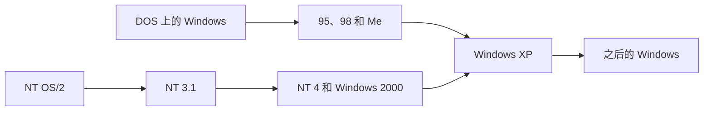

# Windows NT：微软为什么要重新发明 Windows

1988 年 10 月，Dave Cutler 从 DEC 到了微软。他在 DEC 带过 VAX/VMS，小型机上的系统，有虚拟内存，有账户，也能用多颗处理器。他接着做的 Prism 处理器和操作系统 Mica 被公司取消。比尔·盖茨要的是另一条产品线。DOS 和架在它上面的 Windows 已经占住了个人电脑，可一个程序改得了另一个程序的内存，机器上也没有真正的用户权限。企业买服务器时看的是 Unix，以及微软正和 IBM 一起做的 OS/2。

这条新线在 1993 年 7 月 27 日交付制造，名字叫 Windows NT 3.1。桌面做成和 Windows 3.1 一样，内核是新写的。家用电脑后来走了 Windows 95、98 和 Me。2001 年 10 月 25 日开卖的 Windows XP 版本号是 NT 5.1。从这一版起，货架上的 Windows 都从这颗内核长出来。

## DOS 撑不住企业要的那台机器

1981 年的 IBM PC 用微软的 DOS。DOS 是实模式：地址空间就那么一点，程序可以直接写内存，也可以直接碰端口。它适合当时的软盘和 640 KB 内存，不适合一台要同时跑很多人的服务器。1985 年 11 月的 Windows 1.0 是 DOS 上面的图形壳，窗口还不能互相盖住。后面的 Windows 2.0、3.0、3.1 把壳做厚了，程序仍从 DOS 启动，16 位的 Windows 程序挤在同一块内存里。谁拿到 CPU，要自己在取消息的时候让出来。一个程序死循环，整个桌面就停在那里。

1990 年 5 月的 Windows 3.0 卖开了。增强模式用上了 386 的保护模式，32 位的能力开始露出来，16 位程序的约定还在。驱动后来做成 VxD，跑在和内核一样的最高权限里。显示卡或声卡的驱动写错，整台机器一起走。这种结构能在 4 MB 内存的家里用，也能让游戏直接碰硬件。它给不了企业采购单上的那几项：每个用户一个账户，文件有访问控制，操作能审计，一台机器上的程序崩溃不要把旁边的程序写坏，还要能装到不只一种 CPU 上。

Nathan Myhrvold 当时给盖茨看的威胁有两样。一样是 RISC，比同时期的英特尔芯片在工作站上更强，而 DOS 和 BIOS 都绑在 x86 上。一样是 Unix，能多任务，能多处理器，能联网，缺点是每家的接口都不一样，程序要移植。盖茨要一个能在多种 CPU 上编译的系统，去工作站和服务器上跟 Unix 争。把 DOS 再补一圈补不出这个。DOS 上的程序把“我可以写任何内存、占住 CPU 直到我愿意停”当成了合同。内核若改成抢占，这批程序就不是同一批程序了。

## 名字先叫 NT OS/2

1987 年年底，微软和 IBM 的 OS/2 1.0 上市，目标就是换掉 DOS。它用 286 的保护模式，一开始几乎是字符界面。1.1 加上了 Presentation Manager。两边都想拿它做企业操作系统。OS/2 1.x 仍是 16 位的，绑在 x86 上，卖得也不及后面突然起来的 Windows。

Cutler 的组一开始做的是 OS/2 3.0，内部叫 NT OS/2。NT 这两个字母，Mark Lucovsky 和后来的开发者 Dave Plummer 都说，来自英特尔 i860 的内部名字 N10，读出来是 N-Ten。1991 年的微软片子把全称说成 New Technology。1998 年盖茨又说，这两个字母已经没有固定含义。坊间另有一种字母游戏：V、M、S 各加一，就是 W、N、T。项目早期的名字是 NT OS/2，这套游戏对不上时间。能对上的是那块芯片。

选 OS/2 的接口，是因为这是和 IBM 说好的企业接口。系统要能移植，要能对称多处理，要能过政府采购里的 POSIX，还要朝着橙皮书那种账户、权限和审计去设计。OS/2 1.x 给不了这些，内核就按新系统来写。

1990 年 5 月 Windows 3.0 的销量改变了赌注。IBM 希望微软把精力放在 OS/2 上。微软看到开发者已经围着 Windows 的接口在写程序。1990 年 8 月，NT 组把主要接口从 OS/2 改成 Win32：把 16 位 Windows 接口加宽到 32 位，消息、窗口、绘图的形状还认得。已有的 Windows 程序要改，改动常常停在重新编译。外壳也从 Presentation Manager 换成了 Windows 的程序管理器。

这件事没有马上告诉 IBM。1991 年 1 月 IBM 知道之后，合作结束。OS/2 2.0 和后来的版本由 IBM 自己做，1992 年交付，32 位，还能跑 Windows 程序，两家在企业桌面上对着卖。NT 在 x86 上留了一个很小的 OS/2 1.x 字符程序子系统，算是人格还在。图形程序的主路已经是 Win32。

## 先在一块没人用的芯片上写

Cutler 给 NT 定的三个目标，G. Pascal Zachary 的《Showstopper!》里写过：可移植、可靠，以及一种叫人格的能力，就是同一颗内核外面可以挂上不同的应用程序接口。

可移植落实在写法和芯片上。内核主体用 C。和硬件相关、又必须快的那一点用汇编，收进硬件抽象层，换一种主板或一种 CPU 时改这一层。图形和一部分网络用了 C++。开发初期故意不在 x86 上写。团队先瞄准 i860，一块 RISC，进度还落后。模拟器跑在 OS/2 1.2 上。Lucovsky 后来的幻灯片写，这台模拟器慢到以几十分钟计。微软自己做了一块 i860 单板，内部叫 Dazzle，内核、内存管理在真的芯片上跑起来过。i860 的公开机器最后没有成为 NT 的发行平台。它的用处是强迫移植：人每天用的是 x86，手会滑进 x86 才有的指令和调用。先在一块自己不熟的芯片上把内核跑通，这些习惯混不进去。

1989 年 12 月他们改到 MIPS R3000，大约三个月做完。1990 年再移到 386。1993 年 7 月交货时，x86 和 MIPS 同时有货，DEC Alpha 的版本在 9 月跟上。PowerPC 出现在 1995 年的 NT 3.51。同一种源代码，每种 CPU 一份硬件抽象层和一份编译结果。

可靠靠边界，不靠程序自觉。内核态碰硬件和所有进程的内存。用户态的程序有自己的虚拟地址空间，调度由内核抢占，程序不用记得去让出 CPU。系统里的内存、文件、设备都是对象，通过句柄访问，句柄上可以挂访问控制。开机之后要按 Ctrl+Alt+Del 再输入账户。这个组合键由内核接到，普通程序截获不了，登录窗口就不容易被仿造。文件走 NTFS，有权限，元数据有日志，也有长文件名。为了兼容，3.1 还能读 FAT 和 OS/2 的 HPFS。

人格是三套环境子系统，都在用户态，经本地过程调用找内核。Win32 是主子系统，屏幕输出归它。POSIX 子系统能跑按 POSIX.1 编译的程序，深度有限，主要是采购清单上的那一格。OS/2 字符程序只在 x86 上。DOS 程序放进虚拟 DOS 机：x86 上用虚拟 8086，RISC 上用一家叫 Insignia 的 286 模拟，所以慢，而且碰 386 特性的 DOS 程序在 RISC 上根本不行。16 位 Windows 程序再套一层 Windows on Windows。它们为了兼容，仍共用一块地址空间，仍是协作式调度。一个 16 位程序可以拖死其他 16 位程序。它拖不死内核，也拖不死旁边的 32 位进程。

这和 Windows 3.1 的差别在开机的第一下就能看出来。NT 用 NTLDR 把内核装起来，x86 上可以和 DOS、OS/2 多重引导。RISC 机器用固件里的引导，没有 DOS 这一步。命令行是新的 32 位 `CMD.EXE`，命令看起来像 DOS 5.0，底下没有 DOS 的内核。字符串在内部用 Unicode。Windows 3.1 的注册表想法被拿来当总配置库，替代散落的 INI、`AUTOEXEC.BAT` 和 `CONFIG.SYS`。

DEC 很快觉得这套东西眼熟。VAX/VMS 的内存管理、进程和调度，用 VMS 的词去读 NT 的内部结构，对得上不少。代码树里的目录和文件名，又能对上被取消的 Mica。双方没有把官司打完。公开的说法是微软补偿 DEC，数字落在六千五百万到一亿美元之间，同时帮忙把 VMS 继续卖下去，给 DEC 的人做 NT 培训，并把 NT 留在 Alpha 上。Alpha 因此成为 NT 早期的一等公民。64 位 Windows 最初也在 Alpha 上试。

## 3.1 卖不动家用机

版本号做成 3.1，挨着已经在卖的 Windows 3.1。1991 年 10 月的 COMDEX 上第一次公开展示，会场里发了 32 位开发包。1992 年 3 月又有 Win32s，让一部分 Win32 程序能在 Windows 3.1 上试跑，开发者不必等 NT 的机器。

Zachary 的书里记下这组数字：大约 250 人，560 万行代码，开发花费约 1.5 亿美元，最后一年修了三万多个缺陷。工作站标价 495 美元。高级服务器标价对外说是前六个月的促销价 1495 美元，标称价 2995 美元，后来也没涨回去。服务器按机器卖，不按客户端数目加价，这是在打 Novell NetWare 的价目表。高级服务器可以做域控制器，账户集中在一处，用户换一台电脑仍用同一个登录。

x86 的最低配置是 25 MHz 的 386、12 MB 内存、75 MB 硬盘和 VGA。RISC 要 16 MB。当时很多 PC 出厂只有 4 MB。内存很贵。推荐配置常常被说成 486 加 16 MB，已经高于普通家里的机器，跑起来还偏慢。3.5 到来之前，3.1 大约卖了 30 万份。1993 年 11 月的估计是，真正的 NT 应用程序只有大约 150 个。办公室套件还没有。人们只好跑 16 位程序，而这些程序在 NT 上比在 Windows 3.1 上更慢。直接碰声卡和显示卡的游戏、依赖 VxD 的程序，进不来。RISC 版本更冷清：32 位程序几乎没人移植，16 位程序还要靠模拟。

对外把它写成两条产品里的高端那条。盖茨在开发期间并不指望它在 1995 年之前占领桌面。产品经理对外说，它占 Windows 销量的一成到两成就符合预期。高要求的应用、网络、多处理器，走 NT。家里那台要玩游戏、要便宜内存、要现成驱动的电脑，继续走 DOS 上的 Windows。

## 两条线并排走了八年

1995 年 8 月 24 日，Windows 95 零售。它把 DOS 和 Windows 收成一个产品，引导时仍会经过 MS-DOS 7，随即进入 32 位。32 位程序按抢占调度，各自有地址空间。16 位程序还在那块共享的、协作式的子系统里，一个不让出 CPU，相关的窗口会一起卡住。VxD 仍在最高权限。换来的是即插即用、开始菜单，以及游戏和厂商驱动已经在的那个世界。PC 厂商预装的是这一版。

NT 在旁边补速度和外壳。1994 年 9 月的 3.5 代号 Daytona，重点是把 3.1 跑快。1995 年 5 月的 3.51 加上 PowerPC。1996 年 8 月 24 日的 NT 4.0 用了 Windows 95 的外壳，开始菜单和资源管理器从此长得一样。同一版把显示、打印这些原来放在用户态的部分搬进内核。3.x 里每画一次都要进出用户态，工作站上太慢。搬进内核之后，绘图少一次来回。显示驱动若写崩，就可以把整台系统带走。可靠和速度在这里交换过一次。

看起来一样，程序和驱动仍是两套。9x 的 VxD 不能装进 NT。NT 的驱动不能装进 95。DOS 游戏要的硬件访问，NT 不给。DirectX 和多媒体先在消费级线上长齐。家里的机器内存和硬盘也是按 95 来配的。企业要的是域、NTFS、权限、多处理器和不被一个应用程序写穿的内核，这些 95 没有。微软就维持两套代码、两套驱动、两套测试。

1998 年 6 月的 Windows 98、2000 年 9 月 14 日的 Windows Me，把消费级线接到头。Me 是这条线的最后一版。2000 年 2 月 17 日的 Windows 2000 是 NT 5.0，活动目录、即插即用、电源管理和 USB 都有了，桌面也能用。它仍按企业来卖。消费级预装没有跟着过去。一个原因是游戏和老程序，一个原因是驱动还没覆盖全。微软用 WDM 让一部分驱动可以同时给 Windows 98 和 Windows 2000 写，覆盖完之前，货架上就还得有两盒。

NT 这边的多 CPU 故事也在收束。MIPS 和 PowerPC 停在 NT 4。Alpha 上的 Windows 2000 做到了候选版本。1999 年 8 月，康柏不再为 NT 支持 Alpha，几天后微软也取消了自己的 Alpha 计划。可移植在货架上暂时只剩 x86。硬件抽象层和用 C 写成的内核留在代码树里。市场上一时没有第二种 CPU 值得发货。

| | 引导 | 程序之间 | 谁碰硬件 | 世纪之交它卖给谁 |
| --- | --- | --- | --- | --- |
| DOS / Windows 9x | 经 DOS 再进入保护模式 | 16 位程序共享空间，要自己让出 CPU。32 位程序分开 | 驱动可以在最高权限里直接访问设备 | 家用机、游戏、厂商预装 |
| Windows NT | 引导程序装内核，从登录开始 | 32 位进程各有地址空间，内核抢占调度 | 普通程序不碰端口。驱动按 NT 的模型写 | 服务器、域、要权限和多处理器的工作站 |

## XP 把家用机接上同一颗内核

Windows 2000 交货前后，微软内部还有两个代号。Neptune 打算做消费级的 NT，接 Me。Odyssey 打算做 2000 的企业后继。2000 年 1 月，Paul Thurrott 报道这两个项目被搁下，合成一个 Whistler，名字来自微软员工常去的惠斯勒滑雪场。消费级和企业级用同一份代码，分成家用版和专业版。

2001 年 8 月 24 日，构建号 2600 交付制造。10 月 25 日零售。家用版替换 Me，专业版替换 Windows 2000。微软自己的技术说明写，XP 接上 2000 的安全、管理和可靠，也接上 98 和 Me 的即插即用和更好用的界面。内核是 NT 5.1。DOS 不再躺在引导路径上。16 位程序还在兼容层里，包括那块共享的 16 位 Windows 空间。POSIX 和 OS/2 子系统从 XP 拿掉，采购清单上的那两格已经不值得留在产品里。

家用机第一次默认跑在有账户、有权限、有独立地址空间的内核上。默认值没有立刻变成“每个人都用普通用户登录”。XP 早期为了兼容，很多人仍以管理员运行，防火墙也要到 2004 年 8 月的 SP2 才默认打开。内核换了，人的习惯和程序的假定还要再过几年。SP2 之后，XP 在家里和企业里都站稳了，也因此活得比微软原来计划的更长。

9x 的安全更新走到头。Windows 98 和 Me 的扩展支持在 2006 年 7 月 11 日结束。再往后没有一条 DOS 引导的 Windows 还在收补丁。Me 是最后一盒这样的零售系统。

产品名字里的 NT 从 Windows 2000 就拿掉了。内核文件仍叫 `ntoskrnl`，版本字符串里仍有 NT。Vista、7、8、10、11 都是这一家的后继，构建号和内部版本一直沿着 NT 6、NT 10 往下数。x86 独占了几年之后，移植又用上了：服务器上的 x64，短暂的安腾，以及后来的 ARM。Windows 11 同时有 x64 和 ARM64。1989 年故意先在 i860 模拟器里写内核的那一层，在 Alpha 退市之后看起来像多余的成本。第二种指令集再次要发货时，要改的是硬件抽象层和编译，内核主体还是那一份 C。

DOS 上的 Windows 没有被一次删除。它的程序、驱动和销售渠道比内核值钱，所以 95 必须先存在，NT 必须先像 3.1，两条线必须并排，直到内存便宜了、驱动能共用了、消费级功能能在 NT 上重做。XP 统一的是代码。9x 让出来的是货架。今天打开的 Windows，引导之后装进来的仍是 Cutler 那组人在 1989 年开始写的那种内核：硬件抽象层在最底下，执行体在内核态，Win32 在用户态，程序默认碰不到别人的地址空间。

## 参考

- G. Pascal Zachary，[Showstopper!](https://www.amazon.com/Show-Stopper-Breakneck-Generation-Microsoft/dp/0029356717)，1994。Cutler 到微软、NT OS/2 改 Win32、三个设计目标，以及人力和代码规模。本文用的版本细节以 [Windows NT 3.1](https://en.wikipedia.org/wiki/Windows_NT_3.1) 对这本书的综述为准。
- Mark Lucovsky，[Windows: A Software Engineering Odyssey](https://osm.hpi.de/bsArch/2004-2005/Unit2/01c_w2k-hist-lucovsky.pdf)。1989 年 2 月开始写代码，i860 的名字 N10，模拟器跑在 OS/2 1.2 上。
- [Windows NT](https://en.wikipedia.org/wiki/Windows_NT)。与 VMS、Mica 的关系，DEC 的补偿，子系统从 XP 起撤掉，Alpha 在 1999 年 8 月停止。
- 各版本的交付日期见 [List of Microsoft Windows versions](https://en.wikipedia.org/wiki/List_of_Microsoft_Windows_versions)。Windows 95 为 1995-08-24，Windows 2000 为 2000-02-17，Windows Me 为 2000-09-14，Windows XP 零售为 2001-10-25。
- 微软，[Windows XP Technical Overview](https://learn.microsoft.com/en-us/previous-versions/windows/it-pro/windows-xp/bb457060%28v=technet.10%29)。XP 同时接替 Me 和 Windows 2000，代码基于 Windows 2000。
- XP 把 Neptune 和 Odyssey 收成 Whistler 的过程，见 [Windows XP](https://en.wikipedia.org/wiki/Windows_XP) 对 Paul Thurrott 2000 年 1 月报道的综述。
