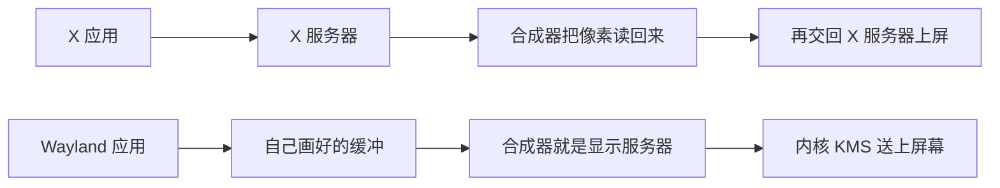

# X11 与 Wayland：Linux 桌面一场漫长的换代

2025 年 6 月的第一个星期，Linux 桌面上发生了两件方向相反的事。6 月 6 日，一位叫 Enrico Weigelt 的开发者在 X.Org 的邮件列表上宣布，自己当天早上被 freedesktop.org 的 GitLab 封了号。他认定这个托管平台“就是想杀死 X”，随即宣布分叉出一个新的 X 服务器，邮件的最后一句是“Together, we'll make X great again”（[原邮件](https://lists.x.org/archives/xorg-devel/2025-June/059396.html)）。两天后，GNOME 的 Jordan Petridis 合并了一个改动：GNOME 49 默认不再提供 X11 会话，下一个版本把它彻底删掉（[他的博客](https://blogs.gnome.org/alatiera/2025/06/08/the-x11-session-removal/)）。

一边有人要让 X 再次伟大，一边主流桌面正把它请出门。双方争的是一个 1987 年 9 月 15 日定稿的协议。它的版本号是 11，此后将近四十年没有变过。

一个协议为什么能活这么久，换掉它又为什么要吵十几年？答案散落在很多地方：六十年代实验室里的光笔，八十年代工作站厂商的混战，九十年代往显存里直接写字节的 DOS 游戏，一场关于许可证的桌面战争，一个在邮件列表上被开除的开发者，一个会转的立方体，以及一家让 Linus Torvalds 当众竖中指的显卡公司。这篇按时间顺序把它们串起来，从屏幕上第一个亮起来的点讲起。

## 在有窗口之前：先有光束，后有像素

最早的计算机图形里没有像素。1950 年代初，MIT 的 Whirlwind 计算机配了一种叫“光枪”的东西，操作员拿它对着屏幕上的符号一点，计算机就知道选中了哪个目标。这就是后来的光笔（[Light pen](https://en.wikipedia.org/wiki/Light_pen)）。Whirlwind 占了 MIT 一栋楼里约 230 平方米，它的实时显示后来进了美国的 SAGE 防空系统（[计算机历史博物馆](https://www.computerhistory.org/revolution/real-time-computing/6/123)）。SAGE 控制台用的 Charactron 显像管很有意思：电子束先穿过一块刻着 64 个字符形状的金属掩模，再打到荧光屏上，于是屏幕上直接“印”出一个字母（[SAGE 资料](https://archive.computerhistory.org/resources/access/text/2018/09/102686388-05-01-acc.pdf)）。

这类设备叫矢量显示器。计算机告诉电子束从哪一点移到哪一点，电子束像一支笔在荧光粉上划过去。屏幕本身不记得任何东西，荧光一暗就得重画一遍。

1963 年 1 月，Ivan Sutherland 在 MIT 提交了博士论文 Sketchpad。他在林肯实验室的 TX-2 上，用光笔直接在屏幕上画图，线条之间可以加约束，改一处，其余跟着动。论文里写：“除了图例，不使用任何书面语言。”（[论文重印版](https://www.cl.cam.ac.uk/techreports/UCAM-CL-TR-574.pdf)）1968 年 12 月 9 日，Douglas Engelbart 在旧金山做了后来被称为“所有演示之母”的 90 分钟现场演示：鼠标、窗口式的分屏、超链接、协同编辑。主机远在 30 英里外的门洛帕克，终端靠一台自制的 2400 波特调制解调器连过去，画面经两条微波链路传回会场，投到一块 22 英尺宽的屏幕上。演示结束时全场起立鼓掌（[NLS](https://en.wikipedia.org/wiki/NLS_%28computer_system%29)，[Engelbart 研究所](https://www.dougengelbart.org/content/view/209/)）。

像素要等内存便宜一点才出现。所谓帧缓冲，就是一块内存，每个地址对应屏幕上的一个点，显示硬件每秒几十次按行把它读出来，变成视频信号。1973 年 4 月，施乐帕洛阿尔托研究中心（PARC）的 Richard Shoup 让他的 SuperPaint 帧缓冲第一次显示出稳定的画面：640×480，每点 8 位，一共 307,200 字节，存在移位寄存器里，而不是能随机访问的内存。光是那台 8 位视频数字化器就花了一万两千多美元。拍下第一张图像那天，他两只手都占着，是用膝盖把背板上的一根鳄鱼夹线拽下来触发的采集，照片里他举着一张卡片，上面写着“能用了！（算是吧）”（[Shoup 的回忆文章](http://bitsavers.trailing-edge.com/pdf/xerox/parc/superpaint/rgshoup.com/Annals_final.pdf)）。

同一年，PARC 做出了 Alto。它的屏幕竖着放，606×808，每个点只有黑白一位。1974 年的设计说明里算过账：每条扫描线要 38 个 16 位字，填满一屏要 30,704 个字（[Alto 说明](https://www.bitsavers.org/pdf/xerox/alto/memos_1974/Alto_A_Personal_Computer_Dec74.pdf)）。整台机器的主存是 64K 字，屏幕就吃掉了将近一半。

有了一整块能随便写的位图，接下来的问题是怎么高效地往里画。Dan Ingalls 在 1974 年前后为 Smalltalk 写了 BitBlt（各处记载的日期在 1974 与 1975 之间），一个在两块位图之间搬矩形的操作：目标矩形里的每个点，变成它原来的值和源矩形对应点的某种组合（[BitBLT](https://en.wikipedia.org/wiki/BitBLT)，[CHM 的 Smalltalk 回顾](https://computerhistory.org/blog/introducing-the-smalltalk-zoo-48-years-of-smalltalk-history-at-chm/)）。画字是把字形从字体位图搬到屏幕上，移动窗口是把一块矩形搬到另一个位置，弹出菜单是先把底下那块存起来、画上菜单、关掉时再搬回去。文字和图形第一次走同一条路。Smalltalk 里重叠的窗口和弹出菜单都长在这个操作上。

“图形界面归根结底是搬像素矩形”，这个念头会在这篇故事里反复出现。

1979 年 12 月，史蒂夫·乔布斯带着苹果的人两次参观 PARC，作为交换，施乐获准在苹果上市前最后一轮私募里投资（[洛杉矶时报](https://www.latimes.com/business/story/2020-02-21/larry-tesler-dead-steve-jobs-personal-computer)）。Bill Atkinson 当时已经在写 Lisa 的图形库，看完演示后，他以为 PARC 已经解决了重叠窗口的裁剪问题：一个窗口被另一个盖住一角，重画时怎么只画露出来的那部分。回去以后他自己想办法做出来了，发明了 QuickDraw 里的“区域”（region）。很多年后他在口述历史里说，后来他问 PARC 的人你们是怎么做的，对方说：“什么？我还以为是你们做出来的。”（[CHM 口述历史](https://archive.computerhistory.org/resources/access/text/2015/12/102743021-05-01-acc.pdf)）他的结论是：“有时候一点无知是很有激励作用的。”

关于区域还有一个小插曲。Atkinson 有一次开着他的 Corvette 撞上了一辆停着的卡车，乔布斯赶到医院，他醒来的第一句话是：“别担心，我还记得区域。”（[folklore.org](https://www.folklore.org/I_Still_Remember_Regions.html)）另一次，乔布斯否掉了他飞快的画椭圆算法，要他画圆角矩形。Atkinson 觉得没必要，乔布斯拉着他出门绕街区走，指着一块圆角的禁止停车牌说：“圆角矩形到处都是！”（[Round Rects Are Everywhere](https://www.folklore.org/Round_Rects_Are_Everywhere.html)）1984 年的 Macintosh 只有 128KB 内存和一块 512×342 的屏幕，窗口可以重叠，拖动时底下的内容能正确重画，靠的就是这些区域。

### 一帧像素怎么送到屏幕上

把故事停一下，看看这件事在硬件上到底怎么发生。后面所有协议之争，最终都落在这条链的某一截上。

屏幕是一块按固定节拍刷新的像素网格。显示控制器按行把帧缓冲里的颜色读出去，经 VGA、HDMI、DisplayPort，或者笔记本内部的 eDP 送到面板。控制器的老名字叫 CRTC，阴极射线管时代留下来的，现在它管的是哪一块缓冲接到哪一台显示器、分辨率多少、刷新多快。

控制器正在读的时候，如果有人往同一块缓冲里写，画面就会从某一行撕开，上半截是旧的，下半截是新的，这叫撕裂。所以至少要两块缓冲：一块正在被扫描，一块正在被画。画完之后等到垂直消隐，也就是电子束从右下角回到左上角的那段空档，再把扫描指针切到新的那块。这一下叫翻页。人眼看到的是一整帧换掉，写到一半的状态不会出现在屏幕上。

Alto 和 Macintosh 的时代，这块内存由 CPU 自己填。后来的四十年，这条链被一截一截地拆开、挪走、重新分配：谁决定画什么，谁把像素填进缓冲，谁决定哪块缓冲在什么时刻上屏。X、VNC 和 Wayland 的差别，最后都落在这几个“谁”上。

## Unix 上的第一批窗口（1982–1984）

PARC 的东西没有直接变成 Unix 上的窗口系统。Unix 那边的人在各自的实验室里重新走了一遍。

1982 年，贝尔实验室的 Rob Pike 和 Bart Locanthi 做了一台叫 Blit 的图形终端：一块 800×1024 的黑白屏，一颗 68000 处理器，256KB 内存由屏幕和 CPU 共用，没有任何图形加速硬件。论文里特意说明，名字取自 bitblt 的第二个音节，“不是缩写”。论文还有一句话很能代表那个时代的做事方式：Blit 的一个竞争优势是，设计硬件和软件的那两个人，正是最想用它的那两个人（[Blit 论文](https://doc.cat-v.org/bell_labs/blit/blit.pdf)）。Pike 为它写的窗口程序 mpx 和 mux，后来一路演化成 Plan 9 的 8½ 和 rio（[Blit](https://en.wikipedia.org/wiki/Blit_%28computer_terminal%29)）。

同一时期，Sun 在 1982 年底到 1983 年初写出了 SunWindows，窗口树直接放在内核里，后来又在上面叠了一层 SunView（[SunView](https://en.wikipedia.org/wiki/SunView)）。卡内基梅隆大学由 IBM 资助的信息技术中心里，James Gosling 和 David Rosenthal 在 1983 年 11 月让 Andrew 窗口管理器跑了起来。它的窗口平铺、不能重叠，服务器经 TCP 用远程过程调用访问，而且服务器“不保留窗口内容的任何信息”（[CMU-ITC-023](http://reports-archive.adm.cs.cmu.edu/anon/itc/CMU-ITC-023.pdf)，[Rosenthal 1986 年的综述](http://reports-archive.adm.cs.cmu.edu/anon/itc/CMU-ITC-045.pdf)）。后来有人感叹，要是 IBM 当初肯把 Andrew 的早期版本免费给 MIT 的人用，它“很可能会演变成今天 X11 这样的标准”（[Andrew 的回顾](http://www.cs.cmu.edu/~AUIS/ftp/PAPERS/atk/Boren.CACM)）。

斯坦福的 Paul Asente 和 Brian Reid 则为 V 操作系统做了一个叫 W 的窗口系统。窗口可以跨网络，服务器里存着每个窗口的显示列表，通信是同步的：客户发一个请求，等服务器回答，再发下一个。1983 年夏天，Asente 和 Chris Kent 在 DEC 西部研究实验室把 W 移植到了跑 Unix 的 VS100 显示器上。在 V 上还凑合的同步协议，放到 Unix 的 TCP 上慢得出奇，用 Scheifler 和 Gettys 后来的话说，“打字很容易比终端窗口回显字符还快”（[Scheifler 与 Gettys 对 X 的回顾](https://ftp.zx.net.nz/rom/V5.1Br2650_D1/DOCS/ACRO_SUP/XWINSYS.PDF)）。

## 1984 年夏天：一封邮件和一个字母

MIT 当时有一个叫 Athena 的大项目，DEC、IBM 和 MIT 合作，目标是让学生在校园里任何一台工作站上都能用计算资源。Athena 正在采购大约 70 台 VS100。问题是，1984 年 DEC 和 IBM 都还没有带位图显示器的工作站产品，而卡内基梅隆的 Andrew 有许可问题，拿不过来（[XWINSYS 回顾](https://ftp.zx.net.nz/rom/V5.1Br2650_D1/DOCS/ACRO_SUP/XWINSYS.PDF)）。MIT 计算机科学实验室的 Bob Scheifler 手上有另一件急事：他在做分布式系统 Argus，需要一个能用的调试界面。Jim Gettys 是 DEC 派驻 Athena 的工程师。

1984 年 6 月 19 日，一个星期二的上午 9 点 07 分，Scheifler 给 window@athena 发了一封标题为“window system X”的邮件（[邮件全文](http://www.talisman.org/x-debut.shtml)）：

> 过去几个星期，我给 VS100 写了一个窗口系统。我从 W 里偷了相当多的代码，给它套上一个异步而不是同步的接口，然后管它叫 X。整体性能大约是 W 的两倍。……我们 LCS 已经不用 W 了，正在 X 上积极写应用。还在用 W 的人应该认真考虑换过来。这不是终极的窗口系统，但我相信它是个做实验的好起点。……现在还没有文档，有谁疯到愿意自告奋勇吗？也许我最终会抽空写。想看演示的可以到 NE43-531 来，想要代码的带一盘磁带过来。

改动的核心就是那句“异步”。客户不再发一个请求等一个回答，而是把一串请求塞进缓冲区一口气发出去，服务器照着执行，不必每步都回话。服务器也不再替客户保存显示列表，窗口被盖住又露出来，服务器发一个事件，让客户自己重画。Gettys 后来写，异步加上缓冲，比他们起步时的 W 快了大约三十倍（[1986 年的 X10R3 发布说明](https://www.tuhs.org/Usenet/comp.sources.unix/1986-February/001195.html)）。

至于名字，两人的回顾里写得很随意：“没怎么考虑名字，而且当时它和 W 的家族相似性还很强，Bob 就把它叫做 X。很久以后，名字成了一个严肃的问题，X 却已经叫开了。”1986 年的发布说明里还有一句公道话：“公平地说，要是没有 W，今天也就没有 X。事实上，‘X’这个名字，正是因为我们是从‘W’开始的。”

X 的版本号每逢不兼容的改动就加一，1985 年初已经到了第 6 版。那年夏天，MIT 决定不对 X 收许可费，只按“制作成本”提供，这个决定改变了它的命运：厂商可以免费拿去做产品。X9 在 1985 年 9 月发布，X10 相对 X9 只改了一处，修的是 IBM RT 上的一个非对齐读取问题。1986 年 1 月，DEC 宣布 VAXstation II/GPX，成为第一个商用的 X 实现（[XWINSYS 回顾](https://ftp.zx.net.nz/rom/V5.1Br2650_D1/DOCS/ACRO_SUP/XWINSYS.PDF)）。

X10 有一堆写死的限制，比如颜色深度直接进了协议格式，扩不了。1986 年 5 月开始重新设计 X11。DEC 西部软件实验室那会儿正好“在两个项目之间”，就接下了参考实现，Sun 的 Rosenthal 也在设计组里。设计几乎全靠 ARPA 网上的电子邮件完成，只开过三次为期一天的会，两人回忆说，要是把期间来往的邮件全打印出来，“会是一摞好几英尺高的纸”。Gettys 在 2000 年的一张幻灯片上还记着当年的背景：互联网拥塞崩溃，网络基本停摆，大家靠联邦快递和凌晨三点的 rdist 同步代码（[Gettys 在 USENIX 2000 的幻灯片](https://static.usenix.org/publications/library/proceedings/usenix2000/invitedtalks/gettys_html/text11.htm)）。

1987 年 9 月 15 日，Ralph Swick 在新闻组上发了一条标题带三个惊叹号的公告：“X Version 11 Released (!!!)”。他说这标志着 X“从研究社区毕业，进入产品工程与开发社区”，而且“几乎所有代码都是工作站厂商自己贡献的”（[公告原文](https://landley.net/history/mirror/unix/x11release.txt)）。

版本号从此停在 11。没有哪份文件宣布“永不再升”，但 X11 被刻意设计成“在协议和库接口两层都能扩展，而不需要不兼容的改动”，版本号又只在不兼容时才加，于是新能力都以扩展的形式挂上去，发行版从 R1 一路走到 R7，协议仍是第 11 版。X.Org 自己的 wiki 上至今有一页专门说：“这不是说有一个 X12 项目。没有。”（[X12 页面](https://www.x.org/wiki/Development/X12/)）

### 服务器在你面前，应用可能在别处

X 的用词和今天的网页是反的，第一次读很容易拧。服务器是看管显示器、键盘和鼠标的那个进程，坐在人面前。客户是应用程序，可以在同一台机器上，也可以在网络另一头。1984 年的校园里这很自然：贵的是那块屏幕，计算在机房里。学生在这台工作站上打开一个窗口，程序可能跑在另一栋楼。协议走 TCP，建窗口、画线、画字、收按键，都是请求和事件，服务器收到画线命令，就在自己掌握的帧缓冲里画出来。这就是后来反复被提起的“网络透明”。

两人为 X 定下的设计原则里，最有名的一条是“提供机制，而不是策略。尤其要把用户界面的策略放在客户手里”。另外几条也很有味道：“比从一个例子归纳更糟的，是从零个例子归纳”，“如果一个问题还没完全弄懂，最好干脆不提供解决方案”，以及“我们也尽量避免赢得一枚复杂度荣誉勋章”（[XWINSYS 回顾](https://ftp.zx.net.nz/rom/V5.1Br2650_D1/DOCS/ACRO_SUP/XWINSYS.PDF)）。

于是服务器里没有标题栏代码。窗口管理器也是一个普通客户：边框、标题栏、谁在上面，都交给它。Athena 不想由 MIT 规定桌面长什么样。twm、fvwm，后来的 KWin、Mutter，都可以换着上。客户之间怎么协商，写在 ICCCM 这份约定里，1989 年出 1.0，1994 年出 2.0，后者是 X 联盟一个工作组“两年多讨论”的产物（[ICCCM](https://www.x.org/releases/X11R7.6/doc/xorg-docs/specs/ICCCM/icccm.html)）。后来桌面环境又加了 EWMH。Gettys 在 2000 年回头看，承认把窗口管理从服务器里分出去是“一把双刃剑”，还补了一句：“我们从来没认为不该有策略！”（[幻灯片](https://static.usenix.org/publications/library/proceedings/usenix2000/invitedtalks/gettys_html/text9.htm)）

另一个当时理所当然、后来成了大麻烦的假设是信任。任何连上这台服务器的客户，默认都被当成可信的。它能列出别的窗口，能把别的窗口的像素读走，能用扩展往里注入键盘事件，也能抢走输入焦点。截图工具、自动化脚本和键盘记录器用的是同一类接口。1984 年的机房里，连上你显示器的程序多半是你自己启动的，或者是同一批学生写的。这个假设要到二十多年后才被正式清算。

直接用 Xlib 写程序也不轻松。两人承认，只用 Xlib 写一个“Hello World”大约要 150 行，用工具包则不到一打。Rosenthal 在 1988 年还专门写了篇论文，题目就叫《一个简单的 X11 客户程序，或者说，写个“Hello, World”能有多难？》，结论是只用 X 基础库写应用，“比只用系统调用写 Unix 程序还难，还没回报”（[TUHS 上的引用](https://www.tuhs.org/pipermail/tuhs/2025-March/031700.html)）。

### 另一条没走通的路：NeWS

X 并不是唯一的方案。Gosling 从卡内基梅隆去了 Sun，和 Rosenthal 一起做了 NeWS。它的服务器是一个带窗口和线程的 PostScript 解释器，客户可以把一段程序下载到服务器里执行，按钮怎么响应、菜单怎么画，都可以在显示那一头就地完成，不必来回跑网络。NeWS 1.1 的手册强调，往服务器里下载程序“不是一个后加上去的漂亮功能，而是窗口系统不可分割的一部分”（[NeWS 1.1 手册](https://bitsavers.trailing-edge.com/pdf/sun/NeWS/NeWS_1.1_Manual_198801.pdf)）。

从技术上看，NeWS 比 X 更有野心，也更优雅。1988 年 2 月的 NeWS 邮件列表上，Barry Shein 打了个比方：X 是一辆选装了所有配件的吉普瓦格尼，NeWS 则是纽约现代艺术博物馆大厅里在展台上优雅旋转的一辆德罗宁（[NeWS 旧邮件存档](https://donhopkins.com/home/catalog/lang/NeWS.html)）。另一位 Mike O'Dell 说得更狠：X 令人震惊的巴洛克式繁复，是自 System V 上市以来对 UNIX 成功的最大威胁。

但德罗宁只能看不能买。NeWS 是 Sun 的专有产品，要付许可费；X 可以按成本价拿走。Gettys 后来的评价是，NeWS“交付得太早，生下来就死了……Sun 专有”（[幻灯片](https://static.usenix.org/publications/library/proceedings/usenix2000/invitedtalks/gettys_html/text16.htm)）。开放赢过了优雅，这件事后面还会重演。

## 厂商的战争与“X-Windows 灾难”（1988–1997）

X11 一出来就成了抢手货，也就成了各家厂商博弈的场地。1987 年 6 月，九家厂商对 MIT 说，放手不管“对 X 可能是致命的”。1988 年 1 月，MIT X 联盟成立，Scheifler 任主任，后来成员超过 70 家。Gettys 的评价一针见血：“解决方案：X 联盟，但是……这导致了 X 的衰落！礼物是带着绳子的。”工具包、桌面和 3D 被划为联盟员工不能碰的领域，那是厂商们要自己卖钱的地方（[幻灯片](https://static.usenix.org/publications/library/proceedings/usenix2000/invitedtalks/gettys_html/text13.htm)）。

X 本身只给了 Xlib，也就是协议的 C 语言绑定，上面没有按钮。X Toolkit Intrinsics（Xt）提供了控件的框架，MIT 附带了一套 Athena 控件作为示例。文档写得明白：“虽然 Intrinsics 是联盟标准，但并没有标准的控件集。”（[libXaw 文档](https://x.org/releases/current/doc/libXaw/libXaw.html)）这个空缺马上被商业战争填满。

1988 年 4 月，AT&T 宣布了 Sun 设计、借用施乐授权技术的 OPEN LOOK 界面。同年 5 月，一群厂商在 DEC 位于帕洛阿尔托 Hamilton 大街 100 号的办公室聚会，成立了开放软件基金会 OSF。Ken Thompson 对 IBM 和 DEC 联手的反应是：“想想看，IBM 和 DEC 坐在一个屋里，我们做到了！”（[Peter Salus 的回顾](https://www.usenix.org/system/files/login/articles/login_apr15_17_salus.pdf)）Sun 的 Scott McNealy 则说 OSF 的意思是“Oppose Sun Forever”，永远反对 Sun（[OSF](https://en.wikipedia.org/wiki/Open_Software_Foundation)）。OSF 的工具包 Motif 在 1989 年问世，拼合了 HP 和微软的外观与 DEC 的 XUI 工具包（[Motif](https://en.wikipedia.org/wiki/Motif_%28software%29)）。

这就是“Unix 战争”里图形界面的那一段。Gettys 的总结是：Motif，“能说是又大又臃肿又慢吗”，而且你既不能指望 Motif 在，也不能指望 OPEN LOOK 在，“可以预见的结果：大多数应用都基于丑陋的 Athena 控件”（[幻灯片](https://static.usenix.org/publications/library/proceedings/usenix2000/invitedtalks/gettys_html/text17.htm)）。直到 1993 年 3 月，HP、IBM、SCO、Sun 等几家在 UniForum 上宣布共同开放软件环境 COSE，把 Motif、HP VUE 和 Sun 的一些工具拼成了通用桌面环境 CDE（[COSE 公告](http://egle.lanet.lv/ftp/sun-info/sunflash/1993/Mar/51.24-UNIX:-Common-Open-Software-Environment)）。Gettys 给这一页幻灯片的标题是“最后一战：CDE（cruddy desktop env.，破烂桌面环境）”（[幻灯片](https://static.usenix.org/publications/library/proceedings/usenix2000/invitedtalks/gettys_html/text19.htm)）。Motif 一直是商业许可，要等到 2012 年 10 月才以 LGPL 放出来（[发布邮件](https://lists.x.org/archives/xorg-devel/2012-October/034144.html)），那时已经没什么人在乎了。

在这片混战里，伯克利的 John Ousterhout 走了一条轻巧的路。他在 1988 年底开始业余做 Tk，一个用 Tcl 脚本语言驱动的工具包，1991 年 1 月公开。他后来写道：“很快就清楚了，用 Tcl 做图形界面，比用 Motif 省五到十倍的力气。”（[Tcl/Tk 历史](https://web.stanford.edu/~ouster/cgi-bin/tclHistory.php)）

X 的毛病，连它的亲友都看得很清楚。1990 年，三位 DEC 工程师（其中 Joel McCormack 正是 Xt 的设计者）发表了一篇《为什么 X 不是我们理想的窗口系统》，开头是一句化用莎士比亚的话：“我们是来赞美 X 的，不是来埋葬它的。”然后列了七大类问题，包括“无法避免的竞态条件”和“对窗口管理器支持不完整”（[论文](http://www.os.4uj.org/WhyX.pdf)）。

不那么客气的是 1994 年出版的《Unix 痛恨者手册》。Don Hopkins 写的那一章叫《X-Windows 灾难》，开篇引了 DEC 的 Marcus Ranum 一句话：“要是 X-Windows 的设计者造汽车，驾驶舱里会藏着不少于五个方向盘，每个遵循的原则都不一样，不过你可以用汽车音响换挡。实用的功能。”Hopkins 自己的开场白是：“X-Windows 是图形用户界面里的伊朗门。”书里算过，Sun 的 OPEN LOOK 时钟程序要吃掉 1.4MB 内存，“就算把 22 台 Commodore 64 的内存全献给它，也还不够告诉你现在几点”；又说“X 被设计来运行三个程序：xterm、xload 和 xclock（窗口管理器是事后才加的，看得出来）”；ICCCM 则是“一个堆满了破损协议、向后兼容噩梦、为过时的非问题准备的复杂非解决方案的有毒废料场”（[Don Hopkins 的页面](https://www.donhopkins.com/home/catalog/unix-haters/x-windows/disaster.html)，[全书 PDF](https://web.mit.edu/~simsong/www/ugh.pdf)）。

这一章的标题本身也是个玩笑。X 的人一直坚持它叫“X Window System”，不叫“X Windows”，X 的手册页至今写着，X.Org 基金会请大家用 X、X Window System、X Version 11 或 X11 这几个名字（[X(7) 手册页](https://www.x.org/releases/X11R7.7/doc/man/man7/X.7.xhtml)）。1993 年 X 联盟的发布经理还在新闻组上澄清过：“根本没有‘X Windows’或‘X Window’这种东西，尽管行业小报一再误用。”（[X Window System](https://en.wikipedia.org/wiki/X_Window_System)）《痛恨者手册》的编者在书里说明：“为了惹恼 X 的狂热者，Don 特意要求我们在他这一章的标题里保留 X 后面的连字符和 Windows 的复数。”

X 联盟在 1996 年 12 月 31 日关门，X 交给了 Open Group。1998 年 3 月发布的 X11R6.4 附了新许可，转售要交费（[Open Group 新闻稿](http://www.opengroup.org/tech/desktop/Press_Releases/x11r6.4ga.htm)）。XFree86 项目 4 月 7 日发声明，说这个许可变化“与 XFree86 的目标不相容”（[XFree86 声明](http://www.xfree86.org/pr-980407.html)）。半年后，Open Group 把许可改回了旧的自由条款（[XFree86 发布说明](https://www.xfree86.org/3.3.6/RELNOTES2.html)）。这是 X 第一次在许可证上栽跟头，不是最后一次。

## PC 与 Linux：直接往显存里写（1987–2000）

就在工作站厂商打仗的时候，另一种机器悄悄变得足够强了。

1987 年，IBM 随 PS/2 推出了 VGA，其中有一个后来被无数 DOS 游戏程序员爱上的模式 13h：320×200，256 色，每个像素正好一个字节。Michael Abrash 在他的《图形编程黑皮书》里写：“模式 13h 提供了 PC 图形史上最简单的编程模型：一块从 A000:0000 开始的线性位图，64,000 个字节，每个字节控制一个像素。”（[黑皮书第 27 章](https://www.phatcode.net/res/224/files/html/ch27/27-04.html)）程序员先用 `mov ax,13h; int 10h` 切到这个模式，然后往 `A000:(y*320+x)` 写一个颜色编号，那个点就亮了（[教程](https://people.cs.umass.edu/~verts/cs32/vga_320.html)）。这就是帧缓冲最赤裸的样子：没有协议，没有服务器，没有权限，程序直接写显存。1994 年的 VESA BIOS 扩展 2.0 又给更高分辨率带来了线性帧缓冲（[Dr. Dobb's](https://jacobfilipp.com/DrDobbs/articles/DDJ/1995/9507/9507h/9507h.htm)）。

1991 年，Linus Torvalds 发布了 Linux。几乎同时，在 Unix 的 PC 移植版上，慕尼黑工业大学的 Thomas Roell 写出了 X386，一个跑在 386 上的 X11 服务器。1991 年 2 月的发布说明写着，编译它需要“80MB 以上的空闲磁盘”，内存“4MB 似乎是绝对下限”（[Usenet 原帖](https://www.tuhs.org/Usenet/comp.unix.sysv386/1991-February/006221.html)）。X386 后来转向商业化，1992 年，David Wexelblat、David Dawes 等人从 X386 1.2E 分出了一个自由版本，起名 XFree86，是“X-three-eighty-six”的谐音双关（[XFree86](https://en.wikipedia.org/wiki/XFree86)）。

让 X 在早期 Linux 上跑起来的是 Orest Zborowski。为了移植 X，他给 Linux 写了最初的 Unix 域套接字，还有 SVR4 风格的虚拟终端接口。1994 年的《Linux Journal》这样评价：“Orest 没有走短视的路、花时间把 X 移植到 Linux，而是把 Linux 移植到了 X。”（[Linux Journal](https://www.linuxjournal.com/article/2783)）同一篇文章也提到了这种做法的代价：图形程序要直接用 `ioperm()` 打开 VGA 端口，再 `mmap()` 映射 `/dev/mem`。如果程序中途崩了，内核只能强行把终端重置回文本模式，“这会造成巨大的困惑和不快，但内核也做不了更好的事”。

当年在 Linux 上配过 X 的人，大都对 XF86Config 和 Modeline 有心理阴影。显示器能接受哪些扫描频率，要用户自己算好了，写成一行类似 `"800x600" 50 800 856 976 1040 600 637 643 666` 的数字（[内核 fbdev 文档第 6 节](https://docs.kernel.org/fb/framebuffer.html)）。文档里的警告一个比一个吓人。XFree86 HOWTO 写着：“有报告说，显示器（尤其是固定频率的显示器）因为 XF86Config 配置错误而损坏甚至烧毁。”（[HOWTO](https://web.mit.edu/linux/redhat/redhat-4.0.0/i386/doc/HTML/ldp/XFree86-HOWTO-4.html)）Eric Raymond 参与写的视频时序 HOWTO 更直白：“这么干你可能把硬件烧冒烟！”还提醒超频驱动显示器可能让它发出超过规格的辐射，“包括 X 射线”（[Video Timings HOWTO](https://tldp.org/HOWTO/XFree86-Video-Timings-HOWTO/answe.html)）。画面花掉的时候，救命的是 Ctrl-Alt-Backspace，直接杀掉 X 服务器。直到显示器能通过 EDID 报告自己的能力，XFree86 4.0 之后，大多数人才不用再手写 Modeline。

X 之外，想在 Linux 上直接画图的程序用 SVGAlib。Doom 和 Quake 的 Linux 版都支持它。问题是它要直接碰硬件，所以程序得以 root 身份运行。1998 年的 Linux Quake HOWTO 写道：“一个（糟糕的）办法是永远以 root 运行 Quake。负责任的系统管理员看到这个肮脏的建议会皱眉。”（[SVGALib](https://en.wikipedia.org/wiki/SVGALib)）1999 年的《Linux Journal》说得更直接：一个 setuid root 的程序什么都能干，包括把服务器关掉，“这才叫拒绝服务”（[Linux Journal](https://www.linuxjournal.com/article/3278)）。

显然，显卡应该由内核管起来。九十年代中期的 GGI/KGI 项目就是这么提议的：把真正编程图形硬件的那一小部分放进内核，绘图和加速仍在用户态（[Dr. Dobb's 对 KGI 的介绍](https://jacobfilipp.com/DrDobbs/articles/DDJ/1998/9807/9807d/9807d.htm)）。内核社区不买账。Alan Cox 在 1998 年 1 月反对说，它推翻了现有的鼠标键盘底层接口，换成一套“把策略放进内核空间”的东西（[LKML](https://lkml.iu.edu/9801.1/0686.html)）。1998 年 3 月，Linus 在一个叫“GGI 项目对 Linux 不满”的帖子里回复：“我觉得 X 已经够好了。”他把“GGI 应该负责图形”这种信念，和“LISP 是好的”“微内核有道理”并列，说正是这类信念造出了 GNU Emacs 和 Mach 那样的怪物，还留下一句很 Linus 的话：“‘给我看代码’能说服我，‘要是那样不就好了’对我毫无作用。”（[LKML 存档](https://marc.info/?l=linux-kernel&m=89089527200744&w=2)）

结果进内核的是一个小得多的东西：帧缓冲设备 fbdev。它来自 m68k 移植版，Amiga、Atari 和 Mac 这些机器根本没有 PC 那种文本模式，没有帧缓冲，连控制台都显示不出来（[Linux Journal](https://www.linuxjournal.com/article/3278)）。内核文档记着，这个抽象由 Martin Schaller 设计，`/dev/fb0` 是一个主设备号 29 的字符设备，你甚至可以用 `cp /dev/fb0 myfile` 给屏幕截图（[内核文档](https://docs.kernel.org/fb/framebuffer.html)）。它从 2.1.109 版内核开始进入主线。当年它对普通用户最大的吸引力，按《Linux Journal》的说法，是开机画面：“终于，每次开机都能看到一只拿着啤酒的可爱小企鹅了。”PC 上对应的 vesafb 驱动，文档里列出的第一条好处也是：“最重要的：开机 logo :-)”（[vesafb 文档](https://docs.kernel.org/fb/vesafb.html)）。

真正的模式设置和加速，仍然留在用户态的 X 服务器里。XFree86 3.3 在 1997 年带来了 XAA 加速架构，2000 年 3 月的 XFree86 4.0 把“每种显卡一个服务器程序”改成一个服务器加可加载的驱动模块。十年后，当内核终于接手模式设置时，LWN 的评论区里有位读者写：“为什么花了十年才承认这一点？（我曾经很自豪地想为 KGI 项目工作，但 1998 年的经历教会我别在任何地方提这件事……）”（[LWN 评论](https://lwn.net/Articles/269558/)）

3D 也在这个年代起步。1993 年 8 月，Brian Paul 开始写一个开源的 OpenGL 实现，SGI 要求他别用“Open”或“GL”这两个词，他说“Mesa 这个名字有一天就这么冒进了脑子”（[Mesa 历史](https://docs.mesa3d.org/history.html)）。1999 年的 Utah-GLX 项目给 XFree86 3.3 加上了 3D，John Carmack 拿《雷神之锤 III》的测试版帮他们跑 Matrox G200 的基准（[Utah-GLX FAQ](https://utah-glx.sourceforge.net/faq.html)）。Precision Insight 公司的 Jens Owen 在 1998 年的 SIGGRAPH 上招募志愿者，9 月给 XFree86 开发者列表发了直接渲染架构 DRI 的设计公告，“收到两个回复，然后就没有下文了”。可到了 1999 年夏末，“华尔街发现了 Linux”，四家大显卡厂商都来找他们写 Linux 3D 驱动（[DRI 历史](https://dri.freedesktop.org/wiki/DriHistory/)）。DRI 的内核部分叫 DRM，在 Linux 2.3.18 进了主线（[DRM](https://en.wikipedia.org/wiki/Direct_Rendering_Manager)），XFree86 4.0 起带上了 DRI。应用可以绕过 X 服务器直接驱动 GPU 画 3D，这个“绕过”后来会惹出麻烦。

### 剑桥的另一条路：只传像素的 VNC

同一段时间里，另一条远程显示的路已经先放弃了 X 那种“传绘图命令”的做法。

剑桥的 Olivetti 与 Oracle 研究实验室（ORL）先做过一个叫 Teleporting 的系统：一个正在跑的 X 程序，界面可以中途挪到另一台显示器上。实验室里日常在用，但 X 把它卡住了。显示那一头必须跑一整台 X 服务器，网络计算机和掌上设备带不动；X 的流量常常在站点边界被防火墙挡住；应用启动时来回的回合太多，高延迟链路上要等很久；另一头如果是 Windows，X 协议根本进不去。

1994 年他们做了一块叫 Videotile 的实验设备：一块液晶屏、一支笔、一条 ATM 网络。一开始干脆把远处计算机的屏幕当成视频源，整幅界面当原始视频送过来。能用，但带宽吃得很厉害。于是应用那一侧多做一点判断，只送屏幕上发生变化的区域。这个想法长成了后来的协议。1995 年 Sun 放出 Java 之后，他们用一天写出了一个 Java 观看端，类文件大约 6KB，任何能跑 Java 的浏览器都能连上自己的桌面。1998 年初，Tristan Richardson、Quentin Stafford-Fraser、Kenneth Wood 和 Andy Hopper 在 IEEE Internet Computing 上把它写成论文，名字叫 Virtual Network Computing，协议叫 RFB，远程帧缓冲（[VNC 论文](https://www.cl.cam.ac.uk/research/dtg/attarchive/pub/docs/att/tr.98.1.pdf)）。

RFB 的显示方向只有一种图元：在给定的 x、y 贴上一块像素矩形。这又回到了 BitBlt。最笨的编码是 raw，像素按行排好直接送；窗口拖动和滚动可以用 copyrect，线上只剩一个源坐标，观看端把自己已有的那一块搬到新位置。更新由观看端来要，服务器把上一次请求之后的所有变化并成一批再送。网络慢，拖动窗口时中间位置就少几帧；网络快，中间帧就密。

VNC 的用词和 X 又是反的：服务器是桌面所在的那台机器，人坐的那头是客户。客户几乎不留状态，连接随时可以断，桌面、窗口位置、光标停在哪，都留在服务器上，换一台机器打开观看端，看到的还是上次离开时的那一屏。X 做不到这一点，它的状态在人面前的服务器里，显示端一断，远处应用的窗口就没了。实验室里的人后来成立了 RealVNC，协议在 2011 年写成了 [RFC 6143](https://www.rfc-editor.org/rfc/rfc6143)。

X 把绘图命令送到远处去执行，在命令短小的年代很省：画一行字，线上只是字体、坐标和那几个字符。等工具包都改成自己画像素之后，这份节省就消失了。VNC 比这件事早了几年。

## 自由桌面：一场关于许可证的战争（1995–2000）

到九十年代中期，Linux 已经有了 X，却没有一个像样的桌面。每个程序用不同的工具包，长得各不相同。能把它们统一起来的 Motif 和 CDE 是商业软件，Linux 发行版买不起，也不想绑上。这个空档里长出了两套东西，也引出了一场持续好几年的争吵。

第一套来自挪威。1990 年夏天，Haavard Nord 和 Eirik Chambe-Eng 在做一个跨平台的超声图像程序，Nord 坐在公园长椅上对 Chambe-Eng 说：“我们需要一个面向对象的显示系统。”1991 年 Nord 开始写类库，1992 年 Chambe-Eng 想出了后来 Qt 最有名的“信号与槽”。名字的来历很随意：“选 Q 做类名前缀，是因为这个字母在 Haavard 的 Emacs 字体里很好看；加上 t 代表 toolkit，灵感来自 X 的工具包 Xt。”1994 年他们注册了公司，头两年靠两人妻子的工资养活（[The Qt Story](https://rtime.felk.cvut.cz/osp/prednasky/gui/the-qt-story/)）。公司后来叫 Trolltech，Qt 1.0 在 1996 年 9 月发布。Qt 对 X11 上的自由软件免费，但修改后的版本不许再分发，商用要另买许可（[Qt](https://en.wikipedia.org/wiki/Qt_%28software%29)）。

1996 年 10 月 14 日，德国图宾根大学的学生 Matthias Ettrich 在新闻组上发了一个帖子，标题是“新项目：Kool Desktop Environment (KDE)”，第一句是“招程序员！”（[原帖](https://kde.org/announcements/announcement/)）他列了当时一个典型 Linux 桌面上跑的东西：fvwm、rxvt、xv、用 Athena 的 ghostview、用 xforms 的 lyx、用 Motif 的 xftp、用 XView 的 textedit，每个都长得不一样。他说“X Window 系统不是 GUI……Motif 也不是 GUI”，说自己本来以为 Linux 已经很好用了，“直到我给女朋友的机器配了一次”。他推荐 Qt，说它“真是 X 编程的一场革命……是可怕的 Motif 的真正替代品 :)”，顺带损了一句 Tcl/Tk，说那是“拖慢我们所有处理器、吃光我们内存的怪物”。帖子结尾他自己也有点不好意思：“我承认这整件事听起来有点像幻想……我知道我是个梦想家……”还特意加了一句附言：“我和 Troll Tech 没有任何关系。”（他后来去了 Trolltech 工作。）KDE 1.0 在 1998 年 7 月发布（[KDE 1.0 公告](https://kde.org/announcements/1-2-3/1.0/)）。

问题在许可证。KDE 自己的代码是 GPL，底座却是一个修改版不能再分发的库。自由软件社区里很多人觉得这不对。1997 年 Debian 公开表示，Qt“不是自由软件，因此不能进入 Debian”，希望 KDE“最终改用一个自由的工具包”（[debian-announce](https://lists.debian.org/debian-announce/1997/msg00031.html)）；1998 年 10 月，Debian 干脆不再分发 KDE 的二进制包，理由是 GPL 代码链接非 GPL 兼容的库（[Debian 1998 年公告](https://chronicles.debian.org/www/News/1998/19981008)）。GNU 项目在 1997 年号召志愿者写一个自由的 Qt 替代品，叫 Harmony（[LWN 的回顾](https://lwn.net/Articles/463442/)）。

第二套来自伯克利。1995 年，Spencer Kimball 和 Peter Mattis 本该给 Fateman 教授的编译器课交一个项目，结果写了个图像处理程序，就是 GIMP。它最早用的是学校买了许可的 Motif。GIMP 的旧文档里写：“Peter 实在受够了 Motif，于是决定自己写一个。他管它们叫 gtk 和 gdk，GIMP 工具包和 GIMP 绘图包……他们从没打算把它做成通用工具包……只是‘当时觉得是个好主意’。”1997 年 2 月的 GIMP 0.99 把它重写成了面向对象的 GTK+，随后两人毕业离开，“连个招呼都没打”（[GIMP 早期历史](https://www.gimp.org/about/ancient_history.html)）。顺便一提，Linux 的企鹅吉祥物 Tux，就是 Larry Ewing 用 GIMP 0.54 画的。

1997 年夏天，墨西哥的 Miguel de Icaza 去微软面试 Solaris 版 Internet Explorer 团队的职位。他后来回忆，在微软他“了解了 ActiveX 和 COM 的真相，并立刻对它产生了兴趣”，回到墨西哥后就和 Federico Mena 开始设计一套 Unix 上的图形控件基础设施，代号 GNOME（[Miguel 的 GNOME 历史](https://web.archive.org/web/20010224061347/http:/primates.ximian.com/~miguel/gnome-history.html)）。1997 年 8 月 15 日，他在 GTK 的邮件列表上发了公告：“我们想开发一套自由而完整的用户友好应用和桌面工具，类似 CDE 和 KDE，但完全基于自由软件。”对 KDE，他写道：“不幸的是，他们选择了非自由的 Qt 工具包作为基础，这给想要再分发这些软件的人带来了法律问题。”他还算了一笔账：KDE 当时约 89,000 行代码，Qt 约 91,000 行（[公告原文](https://mail.gnome.org/archives/gtk-list/1997-August/msg00123.html)）。这份公告同时也发到了 KDE 自己的邮件列表上，“你们为什么不直接用 KDE？”这类质疑，他在公告里先替对方问了。

GNOME 1.0 在 1999 年 3 月的 LinuxWorld 上发布。Miguel 第二天在邮件里描述现场：自由软件基金会的展台上有三台跑 GNOME 的机器，还有一张台球桌、一张桌上足球和几把椅子，“所以它成了黑客休息室”（[邮件](https://lists.gnome.org/archives/gnome-list/1999-March/msg00661.html)）。

压力之下，Trolltech 一步步退让。1998 年 6 月，它和 KDE 一起成立了 KDE 自由 Qt 基金会：一旦 Trolltech 停止发布自由版 Qt，基金会有权把 Qt 以 BSD 式许可放出来，这份协议在收购和破产之后依然有效（[KDE 自由 Qt 基金会](https://kde.org/community/whatiskde/kdefreeqtfoundation/)）。1999 年的 Qt 2.0 改用自由但与 GPL 不兼容的 QPL。2000 年 9 月，Trolltech 宣布 Qt/X11 2.2 同时以 GPL 发布。Chambe-Eng 和 Ettrich 在采访里说：“我们想发出一个强烈的信号：我们从来不想控制图形界面。”LWN 的评语是：“Trolltech 认输了……这一举动将结束两年多的争议。”（[LWN 2000-09-07](https://lwn.net/2000/0907/bigpage.php3)）Harmony 随即停了。再往后，诺基亚在 2008 年收购 Trolltech，2009 年的 Qt 4.5 加上了 LGPL 选项（[诺基亚公告存档](https://web.archive.org/web/20110519121822/http:/qt.nokia.com/about/news/lgpl-license-option-added-to-qt)），许可证之争彻底落幕。

许可对齐之后，两个桌面都留了下来，GNOME 用 GTK，KDE 用 Qt，一直到今天。这一时期还有几支小队伍：Olivier Fourdan 在 1996 年底开始做 Xfce，名字原本是“XForms Common Environment”，因为 Red Hat 嫌 XForms 不自由、拒绝收录，1999 年改用 GTK 重写（[Xfce](https://en.wikipedia.org/wiki/Xfce)）；Carsten Haitzler（外号 Rasterman）在 1997 年放出了以华丽著称的 Enlightenment，它的下一代 E17 从 2000 年前后一直做到 2012 年 12 月才发布（[Enlightenment](https://en.wikipedia.org/wiki/Enlightenment_%28window_manager%29)）。

### 工具包怎么把按钮变成像素

应用作者写的是按钮和文字，屏幕要的是像素，中间这层就是工具包。它手里有一棵控件树：顶层窗口下面是布局盒子，盒子里是按钮、标签和输入框。进程里有一个主循环，堵在和显示服务器的连接上。鼠标按下，工具包按坐标从树里查出点中了谁，调用那个控件注册的回调。一块窗口被别的窗口盖住又露出来，显示服务器送来一块“脏区域”，工具包只重画那一块。

布局分两步走：先问每个控件自己想要多宽多高，再把父控件分到的矩形往下切。GTK 里这两步长期叫 size request 和 size allocate，Qt 里是 sizeHint 和布局系统调用的 setGeometry，名字不同，顺序一样。控件对象一直留在进程里，按钮的文字、能不能点、有没有焦点都存在对象上，脏了才重画，这叫保留模式。另一头是立即模式：每一帧把界面按当前状态重新描述一遍，不保留控件对象，游戏里的调试面板常用这种。桌面程序大多用保留模式，因为窗口可以几分钟都不动，没必要每帧重算整棵树。

X 在这个问题上其实摇摆过一次。W 把显示列表留在服务器里，X 的第一版改成客户说画就画，服务器执行完就忘。工具包出现后，“界面长什么样”彻底回到了应用进程里。服务器那一侧留下的，越来越只剩窗口矩形和输入焦点。

## 把画笔从服务器手里拿回来（2000–2005）

X 的核心协议会画线、画弧、画字，但这些能力停在了 1987 年。线是整数坐标，没有好用的抗锯齿，字体也是按点阵设计的。Keith Packard 在 2001 年的一篇论文里说，核心协议和字体命名规范 XLFD“都是基于点阵字体设计的”，要列出某个字号下有哪些字体，服务器甚至得“把每个字体的每个字形都光栅化一遍”（[Xft 论文](https://keithp.com/~keithp/talks/xtc2001/paper/xft.html)）。那时候 Linux 桌面上的字，出了名地丑。

Packard 是这一时期 X 的关键人物。2000 年，他设计了 Render 扩展，把 Porter-Duff 合成当作渲染模型，协议文档里致谢了 Plan 9 的 Rob Pike 和 Russ Cox，也致谢了提出“客户端管理字形、把字体处理从 X 服务器里清出去”的两个人（[Render 协议](https://keithp.com/~keithp/render/protocol.html)）。配套的 Xft 库把 FreeType 和 Render 接起来，由客户自己把字形光栅化，再作为带透明度的图像交给服务器。Packard 写道，这样一来，新字体技术的集成“可以按单个应用开发的快速节奏前进，而不必等 X 服务器新功能普及那种冰川般的速度”。字体配置从 Xft 里拆出来，成了今天所有 Linux 程序都在用的 fontconfig（[fontconfig 论文](https://keithp.com/keithp/talks/guadec2002/fontconfig.pdf)）。抗锯齿字体就是这样来到 Linux 桌面的：不是 X 服务器学会了画好看的字，而是画字这件事被搬出了服务器。

同样的迁移在图形上也在发生。2003 年，Carl Worth 和 Packard 在做一个二维矢量图形库，起初叫 Xr。改名的时候 Packard 在邮件里解释：Xr 看起来很像希腊字母 chi 和 rho，意大利语 chiaro 意为“明亮、清晰”，把它英语化一下就很接近 cairo 了，落款是“keith（显然应该避免任何在营销方面的前途规划）”（[邮件](https://lists.freedesktop.org/archives/cairo/2003-July/000184.html)）。Worth 在改名公告里补充：“和埃及这个文字诞生地的联系，对一个强调高质量打印输出的二维图形库来说似乎很合适。”（[改名公告](https://lists.freedesktop.org/archives/cairo/2003-July/000193.html)）负责排版复杂文字的 Pango，名字来自希腊语 pan（全部）加日语的“語”（go）（[Pango](https://en.wikipedia.org/wiki/Pango)）。

2005 年 8 月的 GTK+ 2.8 宣布：“GTK+ 现在使用并依赖 cairo 矢量图形库……GTK+ 控件的大部分渲染现在都由 cairo 完成。”（[发布公告](https://mail.gnome.org/archives/gtk-devel-list/2005-August/msg00062.html)）cairo 能画到一块内存图像上，也能画到 X 的 Render 扩展上，同一条路径可以输出到屏幕或打印机。Qt 那边，第 4 版的绘图框架还能把命令交给 X11，但 Qt 的文档承认 X11 提供的接口覆盖不了 QPainter 的全部能力，缺的部分得把像素拷回来用软件补；从 Qt 5 起，控件默认用软件光栅画进缓冲，再贴到窗口（[Qt 5 Graphics](https://doc.qt.io/archives/qt-5.15/topics-graphics.html)）。谷歌在 2005 年收购了另一个二维库 Skia，它后来成了 Chrome 和 Android 的图形核心（[Skia](https://en.wikipedia.org/wiki/Skia_Graphics_Engine)）。

就连 Xlib 本身也被换了芯。2001 年，Bart Massey 开始写 XCB，一个更小、更贴近协议的 C 绑定，他指出 Xlib 里“有已知的竞态条件，不改接口就无法消除”。后来的 Xlib 保留了原来的接口，底下的传输换成了 XCB（[XCB](https://en.wikipedia.org/wiki/XCB)）。

这一步做完，应用和 X 服务器之间还在说话，但说的不再是“画一个圆”，而是“这块窗口里的像素我更新了”。共享内存扩展 MIT-SHM 让本地客户把像素画在一块和服务器共享的内存里，再通知服务器贴上去；直接渲染则让客户经内核把命令交给 GPU。核心协议里那套绘图请求还在，新程序几乎不再用。远程的 X 反而变重了：一次界面刷新可能是一整块图像，外加建窗口、查字体、同步几何时来回的那些回合。协议还是 1987 年的那套，工具包已经把它当成一块可以贴图的窗口，外加一个输入源。

### 桌面在长大，也在吵架

同一时期，GNOME 在学着像一个产品。2001 年 3 月，Sun 的人机交互团队找了 12 个不写程序的人来测试 GNOME 1.2，报告提了 32 条改进建议（[可用性测试报告](https://wiki.gnome.org/attachments/Design%282f%29Studies/ut1_report.pdf)），随后有了《GNOME 人机界面指南》。GTK 维护者 Havoc Pennington 在 2002 年写了一篇很有影响的《自由软件的 UI》，其中一段后来被反复引用：“对任何程序来说，可能的选项都有无穷多个。每一个都有成本。所以一个有无穷多选项的程序是无穷糟糕的。”（[Free software UI](https://ometer.com/free-software-ui.html)）他照着这个理念写了一个窗口管理器，就是 Metacity。GNOME 2.0 在 2002 年 6 月发布。

另一家想把 Linux 桌面做成消费产品的公司是 Eazel，由初代 Macintosh 团队的 Andy Hertzfeld 创办。它在 2001 年 3 月发布了 Nautilus 文件管理器 1.0，当天就裁掉了 75 名员工中的大部分，5 月关门，理由是“高科技资本市场几乎枯竭”（[ZDNet](https://www.zdnet.com/article/easy-linux-pioneer-eazel-closes-shop/)）。公司只活了 21 个月，Nautilus 至今还是 GNOME 的默认文件管理器，几位工程师后来去苹果做了 Safari。

不是所有人都喜欢 GNOME 的方向。2003 年，Jamie Zawinski 发现自己给 GNOME 1.4 报的 bug 在 GNOME 2 出来后被批量关闭，写了一篇刻薄的短文，把这种开发模式称为“注意力缺陷少年的瀑布”（CADT）：“何不诚实一点，接受 0.8 版之后是 0.8 版，然后还是 0.8 版这个事实？”（[jwz 的 CADT](https://www.jwz.org/doc/cadt.html)）2005 年 12 月，Linus 在 GNOME 可用性邮件列表上讨论打印对话框时发火：“GNOME 这种‘用户是白痴，功能会让他们困惑’的心态是一种病。如果你认为你的用户是白痴，那只有白痴才会用它。”他建议大家去用 KDE（[邮件原文](https://mail.gnome.org/archives/usability/2005-December/msg00022.html)）。

## XFree86 的内讧（2002–2005）

X 本身此时也出了问题。九十年代以来，Linux 上的 X 实际上就是 XFree86，而 XFree86 由一个很小的核心团队掌控，外人很难参与。

2002 年底，Keith Packard 在 XFree86 4.3.0 功能冻结前几小时，未经评审提交了他的 XFIXES 扩展，核心团队收回了他的提交权限，六周后把 XFIXES 撤了出去（[XFree86](https://en.wikipedia.org/wiki/XFree86)）。2003 年 3 月 20 日，项目负责人 David Dawes 发帖宣布：“Keith Packard 一直在积极地（但私下地）寻求支持，要分叉出一个由他本人领导的 XFree86……因此，Keith Packard 不再是 XFree86 核心团队的成员。”（[引自当时的记录](https://asterisk.dynevor.org/xfree-forked.html)）第二天，Packard 回了一篇《呼吁 X 开发的开放治理》，列举开发资源有限、发布缓慢、与其他项目合作差、外人不知如何参与，写道：“社区想知道，到底是谁在管 XFree86。”八天里论坛上涌进了七百多封回复。XFree86 的回应是在网站上加了一个“如何成为 XFree86 开发者”的链接，元老之一 David Wexelblat 则说，没有理由非要搞成民主制（[LWN](https://lwn.net/Articles/26899/)）。

2003 年 12 月 30 日，XFree86 核心团队自行解散，Dawes 承认它“已经不能代表活跃、有经验、有能力的 XFree86 开发者，也不再是技术讨论发生的地方”（[LWN](https://lwn.net/Articles/64781/)）。真正压垮它的是许可证。2004 年 1 月，Dawes 宣布 XFree86 的下一个版本改用 1.1 版许可，加了一条类似旧 BSD 的“致谢条款”，要求二进制发行时注明来源（[Linux.com](https://www.linux.com/news/xfree86-license-causes-distros-rethink-plans/)）。这条款和 GPL 不兼容。Mandrake 第一个表态留在旧版本，Red Hat、Debian、Gentoo、OpenBSD 相继跟进（[Slashdot](https://yro.slashdot.org/story/04/02/18/131223/xfree86-44-list-of-rejecting-distributors-grows)）。2004 年 2 月 29 日，XFree86 4.4.0 照常发布，几乎没有发行版要它。

就在同一个月前后，X.Org 基金会以非营利组织的形式成立（[Linux.com](https://www.linux.com/news/some-xorg-and-xfree86-developers-now-working-together-single-group/)），从许可变更前的最后一版代码分叉，4 月发布了 X11R6.7。LWN 的 Jonathan Corbet 写道：“这次 X 的分叉看来是必要的；运气好的话，它会带来一个重新焕发活力的开发过程。”（[LWN](https://lwn.net/Articles/79443/)）2005 年 12 月的 X11R7.0 把庞大的代码树拆成一个个独立模块，改用 autotools 构建，公告称它是“十多年来 X Window 系统的第一个主版本”（[发布公告](https://lists.x.org/archives/xorg/2005-December/011616.html)）。XFree86 在 2008 年发布了最后一个版本，之后便沉寂了。

二十多年后，XLibre 的发起人在宣布分叉的邮件里，把自己的遭遇比作当年被 XFree86 开除的 Keith Packard。历史喜欢押韵，但这次的结局会不一样。

## 会转的立方体（2003–2008）

X.Org 接手之后，桌面最先迎来的是特效。

所谓合成，是让每个窗口先画到自己的离屏缓冲里，再由一个合成管理器把这些缓冲拼到屏幕上，拼的时候可以加阴影、透明和动画。2003 年 11 月，Packard 提交了 xcompmgr 的第一个版本，一个“示例合成管理器”，依赖他设计的 Composite、Damage 和 XFixes 三个扩展（[xcompmgr](https://gitlab.freedesktop.org/xorg/app/xcompmgr/-/blame/master/xcompmgr.c)）。Composite 把窗口重定向到离屏，Damage 告诉合成器哪块变了。2005 年，Zack Rusin 推出了新的 2D 加速架构 EXA，公告里说 XAA“远远不够现代桌面使用……我们现在就能轻松地把那些没用、但大家特别想要的透明窗口送给每个人”（[邮件](https://lists.freedesktop.org/archives/xorg/2005-June/008321.html)）。

真正引爆的是 Novell。它的 David Reveman 做了 Xgl，一个整个跑在 OpenGL 上的 X 服务器，外加一个叫 Compiz 的合成窗口管理器。2006 年 2 月的公开演示里，窗口是半透明的，拖动时会像果冻一样晃，桌面可以变成一个立方体转来转去，一夜之间传遍了网络（[Xgl](https://en.wikipedia.org/wiki/Xgl)）。可社区里很多人并不高兴，因为最后几个月的开发是在 Novell 内部关起门来做的（[LWN](https://lwn.net/Articles/165352/)）。Red Hat 的 Kristian Høgsberg 同时在做另一条路 AIGLX，在现有 X 服务器上渐进地加入 OpenGL 合成。Fedora 的 wiki 上写着：“XGL 开发的最后几个月是在闭门中进行的，然后作为一个完成品丢给了社区。不幸的是，它没有经过同行评审……”（[Fedora wiki](https://fedoraproject.org/wiki/RenderingProject/aiglx)）Reveman 在邮件列表上反驳：“我从 2004 年 11 月起就在公开开发 Xgl，只有最后几个月是闭门的……我们没有丢下一个完成品，我们丢下的是一个大幅改进的版本，仅此而已。”（[邮件](https://lists.freedesktop.org/archives/xorg/2006-February/013276.html)）

最后赢的是 AIGLX，它在 2006 年进了 X.Org 7.1，Compiz 也改到它上面跑。同年 9 月，因为 Novell 不肯合并社区的改动，一批人分叉出了 Beryl；半年后两边又和解，2007 年合并成 Compiz Fusion。Ubuntu 7.10 默认开启了 Compiz，Linux 桌面的“桌面立方体”视频在各个论坛里刷屏（[Compiz](https://en.wikipedia.org/wiki/Compiz)）。KDE 4.0 的 KWin 和 GNOME 的 Metacity 也先后加上了合成。

看起来是 GPU 的胜利，结构上却是绕路。应用把像素交给 X 服务器，合成器再从服务器读回来，用 OpenGL 画一遍，再交回服务器去显示。多一次拷贝，就多一次对不齐的机会：撕裂、闪烁、拖动窗口时的残影，都出在这几步之间。更麻烦的是，早期 DRI 的 3D 客户直接往屏幕上画，根本不理会 Composite 的重定向，一开合成，游戏和视频就出问题。Høgsberg 在 2007 年 8 月的博客里写：“在我看来，这是我们渲染栈里最大的问题之一。”（[Redirected direct rendering](https://hoegsberg.blogspot.com/2007/08/redirected-direct-rendering.html)）他为此做了 DRI2。做完之后他看清了一件事：X 服务器已经成了应用和合成器之间、合成器和硬件之间多出来的那一跳。

## 显卡交还内核（2007–2015）

要去掉那一跳，得先把显卡的控制权从 X 服务器手里拿走。

到 2000 年代中期，GPU 已经不是一块被动的帧缓冲了。CPU 不再逐像素地填，而是写命令：用户态的驱动把“贴这块纹理、画这些三角形”编成一批命令，放进 CPU 和 GPU 都能看见的队列；内核里的 DRM 驱动检查这批命令有没有越界，再提交给硬件；GPU 用 DMA 把命令取走，画进显存里的缓冲对象；显示控制器直接从这块缓冲扫描出去，像素不必再抄回系统内存。

可当时，同一块显卡同时被好几方染指。Linux 2.6.29 的更新说明列得很直白：“内核的 VGA 驱动、内核的帧缓冲驱动、内核的 DRM 驱动、用户态的 X 驱动、用户态的 DRI 驱动，还有别的用户态驱动（比如 svgalib），共享同一块硬件……这是一个非常糟糕的主意。”（[KernelNewbies：Linux 2.6.29](https://kernelnewbies.org/Linux_2_6_29)）从 X 切到文本控制台时，X 要保存模式、重置显卡、交给帧缓冲驱动，后者再从头初始化一遍，屏幕就会黑一下、闪一下。X 服务器也因此必须以 root 运行。

第一步是显存管理。Tungsten Graphics 做了一个叫 TTM 的通用内存管理器，被批评太大、太难适配真实硬件。Intel 的 Eric Anholt 和 Keith Packard 另起炉灶做了 GEM，2008 年那场争论浮出水面时，GEM“才满一个月”。Anholt 的主张是“先把一个驱动做好”，DRM 维护者 Dave Airlie 则说，提交第 n+1 个内存管理器的人“必须愿意为这个接口负责到时间尽头”（[LWN：GEM v. TTM](https://lwn.net/Articles/283793/)）。GEM 在 2008 年底进了 2.6.28，TTM 后来也为 Radeon 进了主线，对外同样提供 GEM 的接口。

第二步是模式设置。2009 年 3 月的 Linux 2.6.29 合入了内核模式设置 KMS，分辨率、显示器热插拔和翻页都收进内核，切换终端不再闪，X 服务器也终于有了不用 root 运行的可能（[KernelNewbies](https://kernelnewbies.org/Linux_2_6_29)）。应用问内核的是“我这块缓冲画完了，下一帧用它”，内核在垂直消隐时切过去。2014 年，Hans de Goede 让 Fedora 21 的 X 服务器借助 systemd-logind 拿设备文件描述符，第一次以普通用户身份运行（[Fedora 变更说明](https://fedoraproject.org/wiki/Changes/XorgWithoutRootRights)）；2018 年，他又让开机时固件点亮的画面一路保持到登录界面，中间不再切换模式，这叫无闪烁启动（[他的博客](https://hansdegoede.dreamwidth.org/19329.html)）。2015 年前后，原子模式设置接口可以正式使用，一次提交里多个显示器、多个图层的变化要么全部生效，要么全部不生效。DRM 维护者 Daniel Vetter 介绍它时写道：“像 Wayland 这样的新合成器，就是打着‘每一帧都完美’的口号诞生的。”（[LWN](https://lwn.net/Articles/653071/)）

合成器还得等 GPU 真正画完。扫描一块 GPU 写了一半的缓冲，和 CPU 直接往正在扫描的内存里写，是同一种撕裂。等待写在同步对象上：GPU 完成后信号才放开，扫描才拿这块缓冲。2013 年，Packard 用 DRI3 和 Present 两个扩展把 X 这一侧也改成了传递 dma-buf 文件描述符、在垂直消隐时呈现，他说 DRI3 是他“写过的最简单的扩展”，能让 DRI1、DRI2 的痛苦“直接消失”（[LWN](https://lwn.net/Articles/569701/)）。

X 服务器里的 2D 加速也在这些年换了好几茬，几乎可以当成一部缩微史来读：1997 年的 XAA，2005 年的 EXA，2008 年 Packard 为 GEM 世界改出来的 UXA（“UXA 只是跳过了 EXA 里在 GEM 世界不需要的部分”，[他的博客](https://keithp.com/blogs/UMA_Acceleration_Architecture/)），2012 年 Intel 的 Chris Wilson 做的 SNA（[发布公告](https://lists.x.org/archives/xorg-announce/2012-July/002004.html)）。2012 年，Daniel Stone 提交补丁删掉 XAA，提交说明写着“它已经四年多不能用了，没人哪怕接近修好它。安息吧”，评审回复依次是 Airlie 的“真的吗”、Alex Deucher 的“终于！”和“我爱这个补丁”（[邮件](https://lists.freedesktop.org/archives/xorg-devel/2012-January/028641.html)）。最后，2014 年的 X 服务器 1.16 合入了 glamor，干脆用 OpenGL 来做 2D 加速（[发布公告](https://lists.x.org/archives/xorg-announce/2014-July/002457.html)），配上一个通用的 modesetting 驱动，Anholt 说他的目标是“X 服务器里只有一个所有 KMS 驱动开发者都满意的 2D 驱动”（[邮件](https://lists.x.org/archives/xorg-devel/2014-August/043683.html)）。

绕了一大圈，X 服务器里的“驱动”最终变成了：用 OpenGL 画，用内核 KMS 显示。这时候再问一句 X 服务器本身还在干什么，就很自然了。

## Wayland：一个小小的显示服务器（2008–2013）

2008 年 9 月 30 日，Kristian Høgsberg 在自己的仓库里提交了 Wayland 的第一个版本（[Wayland](https://en.wikipedia.org/wiki/Wayland_%28protocol%29)）。他本来没打算声张。11 月 3 日，Phoronix 抢先报道了，标题是《Wayland：Linux 的一个新 X 服务器》。那时它大约只有 3,200 行 C 代码，输入支持是“昨天下午”才加上的。Høgsberg 在给 Phoronix 的邮件里说，这是“一个新的显示服务器，只实现合成桌面真正用到的那一小部分 X 功能”（[Phoronix](https://www.phoronix.com/review/xorg_wayland)）。

当天他在博客上发了一篇《过早的宣传总比没有宣传好》：“我最近的秘密项目不再是秘密了……不过他们的标题写错了，这不是一个新的 X 服务器，而是一个小小的显示服务器加合成管理器。”他也早早想好了兼容：先在 Wayland 上把 X 服务器跑在一个全屏窗口里，再做成无根模式，“因为 X 短期内是不会消失的”。评论区有人问：“会不会还有一个叫 Yutani 的项目？”（《异形》电影里那家邪恶巨头公司叫 Weyland-Yutani。）他回答：“不是，它不是以《异形》里那家邪恶巨型公司命名的 :)”（[他的博客](https://hoegsberg.blogspot.com/2008/11/premature-publicity-is-better-than-no.html)）名字其实来自马萨诸塞州的 Wayland 镇，据说这个构想是他开车经过那里时成形的；参考合成器 Weston 则来自旁边的另一个镇（[Wayland](https://en.wikipedia.org/wiki/Wayland_%28protocol%29)）。

在那篇 Phoronix 报道里，Høgsberg 还给了 Wayland 一句标语：“Wayland 的口号是‘每一帧都完美’，我的意思是，应用能足够地控制渲染，让我们永远看不到撕裂、延迟、重画或闪烁。”他还说了一句后来被反复引用的话：“到这一步，X 只是远程显示协议中的一种。”

Wayland 的核心想法很简单：所有窗口都先画到缓冲里。客户自己用 GPU 或 CPU 画完，把缓冲的句柄交给显示服务器；合成器就是显示服务器本身，拿到的是已经画好的那一版，拼好后交给内核的 KMS 翻页上屏。服务器里不再有画线、画字、存字体的代码，模式设置在内核，渲染在客户（[Wayland 架构说明](https://wayland.freedesktop.org/architecture.html)）。没有前几年挪进内核的 KMS、GEM 和缓冲共享，这个设计根本立不起来。只换一个协议名字，显示器仍然点不亮。

和 X 并排放，差别在于少了那一跳：

2010 年，Wayland 成了 freedesktop.org 的正式项目，Daniel Stone、Peter Hutterer、Pekka Paalanen 这些 X 的老开发者陆续加入。2012 年 10 月，Wayland 和 Weston 1.0 发布，Høgsberg 写道：“我们正在进入 Wayland 一个新的、激动人心又有点吓人的阶段……1.0 不意味着我们做完了。”（[发布邮件](https://lists.freedesktop.org/archives/wayland-devel/2012-October/005967.html)）Paalanen 第二天就提醒，1.0 只覆盖核心协议，按当时那个简陋的 wl_shell，谁要做一个真正的桌面环境，“也得自己设计一些协议”（[邮件](https://lore.freedesktop.org/wayland-devel/20121023102129.32755f26@gmail.com/)）。这句话的分量，要再过十年才完全显出来。

为什么这些 X 的老开发者要亲手替换自己维护了多年的东西？2013 年初，Daniel Stone 在 linux.conf.au 做了一场演讲，副标题是“为什么你在 LWN 和 Phoronix 评论区读到的一切都不对”。摘要里说，X 服务器里有“两套完全没人用的渲染模型、四套输入栈”，实现“往好了说也只能叫‘糟糕’”（[演讲视频](https://www.youtube.com/watch?v=GWQh_DmDLKQ)）。演讲的大意是：现代程序都用共享内存和 DRI2，而这两样都不能跨网络，所以 X 已经不是网络透明的了，只是“能走网络”；而远程显示恰恰是 X 表现最差的场景。他举了个例子：启动一个空白的 gedit，光是向 X 服务器查询原子名字，就要来回大约 130 次阻塞的往返。

同年 Phoronix 的长文《Wayland 的处境》由 Stone 审校，里面有几段很有画面感：“真正搞懂输入子系统是怎么拼在一起的大概有三个人……我真希望我不是其中之一。”“X 曾经有自己的打印服务器。后来有人给 glxgears 加上了 Xprint 支持，它就被扔掉了。”文章还有一句总结：“大多数 Wayland 开发者，本来就是 X11 开发者。”（[The Wayland Situation](https://www.phoronix.com/review/x_wayland_situation)，[第 3 页](https://www.phoronix.com/review/x_wayland_situation/3)）

Wayland 也改变了窗口管理器的地位。在 X 上，窗口管理器是一个可以随便换的普通客户；在 Wayland 上，边框、工作区、快捷键都属于合成器本身，GNOME 的 Mutter 和 KDE 的 KWin 各自成了 Wayland 服务器。你不能再保留 GNOME、只把窗口管理器换成一个独立的小程序。而最大化、全屏、窗口菜单这些桌面窗口的基本约定，要等 xdg-shell 在 2017 年 12 月被宣布为稳定之后，大家才有了共同的依据（[发布邮件](https://lists.freedesktop.org/archives/wayland-devel/2017-December/036037.html)）。

## 桌面的剧变与 Mir 之争（2008–2017）

Wayland 慢慢成形的这几年，Linux 桌面本身正经历一场地震。

2008 年 1 月的 KDE 4.0 带来了全新的 Plasma 桌面，也带来了大量缺失的功能和崩溃。KDE 的 Aaron Seigo 事先在博客里“直说”：“KDE 4.0.0 是我们 KDE4 的‘会吃掉你孩子’的版本，不是 KDE 3.5 的下一个版本。”（[KDE Commit-Digest](https://commit-digest.kde.org/issues/2008-01-06/)）可大多数用户根本没看到这句话，发行版照样把它推了出去。一位 Kubuntu 打包者 Timothy Pearson 用了几天 KDE 4，说自己“实在受不了那个界面，效率一落千丈，认真考虑过回到 Windows”，于是接手维护 KDE 3.5，后来改名 Trinity，一直维护到今天（[Datamation 采访](https://www.datamation.com/open-source/forking-kde-3-trinity-kdes-timothy-pearson/)）。

三年后轮到 GNOME。2011 年 4 月的 GNOME 3.0 是“九年来的第一个大版本”，用全新的 GNOME Shell 取代了传统的面板和菜单（[发布公告](https://mail.gnome.org/archives/gnome-announce-list/2011-April/msg00038.html)）。Linus 在 Google+ 上写：“能不能顺便把 GNOME 也分叉一下，支持一个 GNOME 2 的环境？我想要回我正常的界面。我还没见过哪个人喜欢 GNOME 3 这团邪恶的乱麻。”他随后宣布改用 Xfce，“我觉得它比 GNOME 2 退了一步，但比 GNOME 3 进了一大步。真的。”（[The Register](https://www.theregister.com/software/2011/08/05/linus-torvalds-dubs-gnome-3-unholy-mess/1014031)）同年 6 月，阿根廷的一位 Arch Linux 用户 Perberos 在论坛上宣布分叉 GNOME 2，以南美的马黛茶命名为 MATE，还自嘲地描述它是“一个对用户来说既不直观也不好看、使用传统桌面隐喻的桌面”（[Arch 论坛](https://bbs.archlinux.org/viewtopic.php?id=121162&p=1)）。2012 年初，Linux Mint 又分叉出了 Cinnamon，理由是“GNOME Shell 没有提供我们需要的东西，而且正走向一个我们不想跟随的方向”（[Mint 博客](https://blog.linuxmint.com/?p=1910)）。

Ubuntu 选了第三条路。2010 年，Mark Shuttleworth 推出了自家的 Unity 桌面，2011 年起成为 Ubuntu 的默认界面（[Unity](https://en.wikipedia.org/wiki/Unity_%28user_interface%29)）。2013 年 3 月，Canonical 更进一步，宣布自己写一个显示服务器 Mir，要统一手机、平板和桌面。宣布时的设计文档里写，Wayland 的输入处理“部分重现了 X 的语义，因此很可能暴露类似的问题”（[MirSpec 存档](https://web.archive.org/web/20130306104754/https:/wiki.ubuntu.com/MirSpec)）。这话是错的，文档后来改了，还加了一句感谢 Daniel Stone 和 Høgsberg 的指正。Stone 当时在 LWN 上的评论毫不客气：“这完全是错的……要是他们在任何阶段和上游谈过，我们本可以告诉他们……这只是为一个完全出于非技术理由做出的决定倒推出来的借口……接下来几年我得花时间向人们解释，他们读到的关于 Wayland 的东西完全不对。可惜。”（[LWN 评论](https://lwn.net/Articles/541124/)）

KDE 的 KWin 维护者 Martin Gräßlin 直接表态：“KWin 会支持 Mir 吗？不会！”即便有人给 Ubuntu 上的 KWin 写了 Mir 支持，他也会否决这些补丁（[War is Peace](https://blog.martin-graesslin.com/blog/2013/03/war-is-peace/)）。几天后他又写道：“Mir 是一个没人提过的问题的答案，是一个不存在的问题的解决方案。”（[KDE 博客](https://blogs.kde.org/2013/03/08/re-blog-martin-gr%C3%A4%C3%9Flin-reply-all-faces-ubuntu/)）Mir 采用 GPLv3 并要求贡献者签版权协议，这也让其他发行版敬而远之（[Mir in Kubuntu](https://blog.martin-graesslin.com/blog/2013/05/mir-in-kubuntu/)）。

四年后，Shuttleworth 认了。2017 年 4 月 5 日他写道：“我们将停止对 Unity8、手机和融合外壳的投入。Ubuntu 18.04 LTS 的默认桌面将回到 GNOME……我在两件事上都错了。在社区眼里，我们的努力被看作分裂，而不是创新。”（[Canonical 博客](https://ubuntu.com/blog/growing-ubuntu-for-cloud-and-iot-rather-than-phone-and-convergence)）Mir 团队 2017 年底的年终总结里有一句苦涩的自嘲：“去年我保证过 2017 年会发布 Mir 1.0……我们最后决定叫它‘0.28’。也许明年吧……”（[Ubuntu Discourse](https://discourse.ubuntu.com/t/mir-2017-end-of-year-review/2891)）如今的 Mir 是一套“用来构建基于 Wayland 的外壳的库”（[Mir 仓库](https://github.com/canonical/mir)），它最终也说起了 Wayland。

## NVIDIA：最难啃的骨头（2000–2024）

Wayland 的设计假定显卡驱动走内核的 DRM，客户和合成器之间用 GBM 分配、用 dma-buf 共享缓冲。Intel 和 AMD 的开源驱动都是这么工作的。NVIDIA 不是。

NVIDIA 从 2000 年秋天起就提供 Linux 驱动，但一直是闭源的二进制模块。它在 X.Org 里的开源 `nv` 驱动只能做最基本的 2D，而且代码被故意混淆过。2006 年，Matthew Garrett 在 Debian 的 bug 里写：“几乎所有对硬件的引用都是用没有文档的十六进制数完成的……唯一合理的解释是，寄存器信息被事后处理掉了，以减少信息泄露。”（[Debian bug #383465](https://bugs.debian.org/cgi-bin/bugreport.cgi?bug=383465)）

法国开发者 Stéphane Marchesin 试过给 `nv` 去混淆，NVIDIA 拒收了他的补丁。他于是在 2006 年 2 月的 FOSDEM 上宣布了一个通过逆向工程写开源驱动的项目。名字是他的 IRC 客户端起的：他输入“nv”时，法语自动替换功能建议了“nouveau”，意思是“新的”（[LWN](https://lwn.net/Articles/269558/)）。项目的工具 REnouveau 让志愿者在自己的机器上跑：先把显卡的寄存器全部导出，画点东西，再导出一次，对比差异，然后把结果寄回来（[Nouveau](https://en.wikipedia.org/wiki/Nouveau_%28software%29)）。

2012 年 6 月，Linus 在芬兰阿尔托大学的问答环节被问到 NVIDIA，他说 NVIDIA 是“我们打过交道的最糟糕的公司”，然后对着镜头竖起中指：“NVIDIA, fuck you!”（[Ars Technica](https://arstechnica.com/information-technology/2012/06/linus-torvalds-says-f-k-you-to-nvidia/)，[视频](https://www.youtube.com/watch?v=MShbP3OpASA)）

Wayland 时代，分歧落在一个具体的接口上。2016 年 3 月，NVIDIA 的工程师给 Weston 提交补丁，用一套叫 EGLStreams 的机制代替 GBM（[邮件](https://lists.freedesktop.org/archives/wayland-devel/2016-March/027547.html)）。这意味着每个合成器都得为 NVIDIA 单独维护一条路径。Daniel Vetter 回复：“我不指望你们能把这个推销给社区并合进去。”（[Phoronix](https://www.phoronix.com/news/NVIDIA-Wayland-Discussion)）Gräßlin 表示，除非 Weston 先合并，KWin 不会合（[他的博客](https://blog.martin-graesslin.com/blog/2016/09/to-eglstream-or-not/)）。NVIDIA 的 James Jones 此后几年在每届 X 开发者大会上推动一个新的“Unix 设备内存分配器”，想同时取代 GBM 和 EGLStreams，最后不了了之（[Phoronix](https://www.phoronix.com/news/XDC2016-Device-Memory-API)）。僵持期间，平铺合成器 Sway 在 NVIDIA 专有驱动上启动时，要求用户加一个参数：`--my-next-gpu-wont-be-nvidia`，“我的下一块显卡不会是 NVIDIA”（[NVIDIA 论坛](https://forums.developer.nvidia.com/t/nvidia-495-on-sway-tutorial-questions-arch-based-distros/192212/32)）。

NVIDIA 最终让步了。2021 年 10 月的 495 驱动加入了 GBM 支持，Phoronix 写道：“在推了多年 EGLStreams、又想另搞一套 API 之后，NVIDIA 的专有驱动终于采用了 GBM。”（[Phoronix](https://www.phoronix.com/news/NVIDIA-495.29.05-Linux)）2022 年 5 月，NVIDIA 把内核模块以 GPL/MIT 双许可开源，用户态部分仍闭源（[NVIDIA 博客](https://developer.nvidia.com/blog/nvidia-releases-open-source-gpu-kernel-modules/)）。最后一块拼图是同步。NVIDIA 驱动从不支持 Linux 图形栈默认的“隐式同步”，在 Wayland 上长期闪烁、花屏。2024 年 3 月，显式同步协议在评审了大约两年之后合入 wayland-protocols，NVIDIA 555 驱动随即支持。KDE 的 Xaver Hugl 当时说：“等配套的 Xwayland 和 NVIDIA 驱动更新发布，NVIDIA 在 Wayland 上的大部分问题就会消失。”（[Phoronix](https://www.phoronix.com/news/KDE-KWin-Lands-Explicit-Sync)，[GamingOnLinux](https://www.gamingonlinux.com/2024/03/explicit-sync-wayland-protocol-merged-wayland-protocols-1-34-released/)）开源社区这边，Mesa 在 2023 年合入了 NVK Vulkan 驱动（[Collabora](https://www.collabora.com/news-and-blog/news-and-events/nvk-has-landed.html)），Red Hat 在 2024 年宣布用 Rust 写新驱动 Nova，作为 Nouveau 的继任者（[LWN](https://lwn.net/Articles/966129/)）。

这段历史印证了一件事：协议设计替代不了内核没提供的缓冲共享。NVIDIA 这条路不通，Wayland 在很多人的机器上就一直“不能用”。

## 漫长的迁移（2014–2024）

### 旧程序以客户的身份留下

替换不能一刀切。2014 年，XWayland 作为 X 服务器的一个后端合入 1.16 版。它本身是一台 X 服务器，同时又是 Wayland 的一个客户：旧的 X 程序连上它，每个顶层窗口变成一块 Wayland 表面，由外面的合成器去摆位置、加阴影。Høgsberg 在补丁说明里特意提了一句：“另一个大收获是，Xwayland 不需要 setuid root。”（[邮件](https://lists.freedesktop.org/archives/xorg-devel/2014-April/041702.html)）根窗口那种铺满整个屏幕的做法用不上了，所以它是“无根”的。`ssh -X` 仍然能把远处的 X 程序带到本地，只是本地那台服务器换成了 XWayland。

替换因此发生在会话这一层：桌面换成 Wayland 合成器，X 服务器缩成这个合成器的一个客户，只服务还在说 X 协议的程序。人在同一块屏幕上分不出哪块像素来自哪条协议，直到缩放发糊、截图只截得到 X 的窗口，或者输入法只在一边生效。

### 发行版的试探

2016 年 11 月，Fedora 25 成为第一个把 GNOME 默认会话改成 Wayland 的主流发行版，遇到不支持的硬件（主要是 NVIDIA）再退回 X（[Fedora 变更说明](https://www.fedoraproject.org/wiki/Changes/WaylandByDefault)）。Ubuntu 在 17.10 跟进，却在 18.04 LTS 退回了 X，给出的三个理由很具体：屏幕共享、远程桌面，以及 GNOME Shell 崩溃后的恢复（[Canonical 博客](https://canonical.com/blog/bionic-beaver-18-04-lts-to-use-xorg-by-default)）。在 X 上，窗口管理器崩了可以重启，应用都还活着；在 Wayland 上，合成器就是显示服务器，它一崩，所有窗口一起没了。Ubuntu 直到 21.04 才再次默认 Wayland（[Ubuntu 21.04](https://canonical.com/blog/ubuntu-21-04-is-here)）。

不是只有 GNOME 和 KDE 在做合成器。Drew DeVault 在 2017 年开始写 wlroots，一个让别人能搭自己的合成器的公共库，理由是“Wayland 生态急需一个稳定而灵活的公共基础”（[他的博客](https://drewdevault.com/blog/Future-of-sway/)）。2019 年 3 月 Sway 1.0 发布时，他写道：“从我开始 sway 项目算起已经过去 1,315 天……我们不得不几乎从零重写整个 Linux 桌面。”（[Sway 1.0](https://drewdevault.com/blog/Sway-1.0-released/)）

### 全局权限被拆成一次次授权

迁移最大的阻力，来自 X 那个“所有客户都可信”的老假设。在 X 上，截图、录屏、远程协助、自动化测试、全局快捷键、键盘宏，都只是调用几个 X 请求。Wayland 的核心协议里，客户只收到自己表面的输入，问不到别人的窗口列表，也读不到别人的像素。这是设计上的安全改进，也意味着以前随手可得的每一项能力，现在都要一条新的、带授权的路。

屏幕捕获最后定在桌面门户上。2017 年，GNOME 的 Christian Schaller 发布了 PipeWire，起因之一就是 X 下的屏幕捕获“非常不安全”（[PipeWire 发布](https://blogs.gnome.org/uraeus/2017/09/19/launching-pipewire/)）。应用通过 D-Bus 找 `org.freedesktop.portal.ScreenCast`，合成器弹出选择框，人指定一块屏幕或一个窗口，门户把一路 PipeWire 视频流交回去。PipeWire 本是音频和视频的传输，这里被用来搬像素。第一次必须有人点头，自动化脚本和无人值守的远程机器因此难写。全局快捷键的门户要到 2022 年底才出现（[xdg-desktop-portal 1.16](https://github.com/flatpak/xdg-desktop-portal/releases/tag/1.16.0)），GNOME 更是到 2025 年的 GNOME 48 才支持。

中文、日文、韩文的输入法也得重写。X 上输入法可以作为一个客户插进按键流；Wayland 上按键先到合成器，再按文本输入协议交给输入法。2018 年 Purism 的开发者提出了 text-input-v3（[邮件](https://lists.freedesktop.org/archives/wayland-devel/2018-July/039131.html)），ibus 和 fcitx 都重写过这一段。这段没接上的年份里，很多中文用户的结论就是 Wayland 不能用，尽管浏览器本身早已显示得好好的。

缩放是另一个从 X “整个服务器一份 DPI”里长出来的洞。一台两倍缩放的笔记本接一台一倍的外接屏，X 的协议里没有“每块屏幕各自缩放”这个概念。Wayland 一开始就能按输出做整数倍缩放，分数倍缩放协议则到 2022 年才合入（[Phoronix](https://www.phoronix.com/news/Wayland-Protocols-1.31)），之后工具包和合成器还要各自接上。XWayland 里的旧程序仍活在 X 的单一坐标里，被放大时常常发糊。

不满的声音一直很大。2020 年，AppImage 的作者 probonopd 在 GitHub 上发了一篇《三思 Wayland：它破坏了一切！》：“Wayland 没有解决我的任何问题，却破坏了我需要的几乎一切。连最基本、最简单的东西（比如 `xkill`）都不行。”这篇 gist 的评论区后来吵了将近 1MB 的文字（[gist](https://gist.github.com/probonopd/9feb7c20257af5dd915e3a9f2d1f2277)）。

### 协议的治理之争

这些缺口能补多快，取决于 wayland-protocols 这个仓库怎么决策。2019 年它第一次有了治理文档，设了成员项目、同意与否决票，还开了一个 `ext` 命名空间（[邮件](https://lists.freedesktop.org/archives/wayland-devel/2019-November/041007.html)）。可很多协议在这里一放就是好几年。2022 年合入了让游戏关掉垂直同步的 tearing-control 协议，Phoronix 指出这和“每一帧都完美”的口号颇有讽刺意味（[Phoronix](https://www.phoronix.com/news/Wayland-Tearing-Control-Proto)）。屏幕捕获的 ext-image-copy-capture 协议在 2024 年合入，“酝酿了将近三年”（[Phoronix](https://www.phoronix.com/news/Wayland-Merges-Screen-Capture)）。

2024 年 9 月，Valve 的 Joshua Ashton 等人另起了一个 frog-protocols 仓库，公告写道：“Wayland Protocols 长期以来有个问题：新协议一放就是几个月到几年，哪怕是最基本的功能。”他在别处说得更狠，称治理模式“完全坏掉了”，拿窗口图标协议举例，说其中“95% 都是毫无用处的噪音和‘那要是……’式的抬杠”。维护者 Simon Ser 回应：“wayland-protocols 的门槛并没有那么高。”（[GamingOnLinux](https://www.gamingonlinux.com/2024/09/frog-protocols-announced-to-try-and-speed-up-wayland-protocol-development/)，[Hacker News](https://news.ycombinator.com/item?id=41637527)）年底 wayland-protocols 改了规则，加入“实验性”协议区，收紧了否决票的用法（[邮件](https://lists.freedesktop.org/archives/wayland-devel/2024-December/043920.html)）。

最能说明节奏的是色彩管理。Collabora 的 Pekka Paalanen 回顾，最早的讨论始于 2012 年，Sebastian Wick 的合并请求“开了五年零一个月，攒了 820 条评论”，终于在 2025 年 2 月合入，HDR 从此在 Linux 桌面上有了标准的路（[Collabora：12 年的色彩管理孵化](https://www.collabora.com/news-and-blog/news-and-events/12-years-of-incubating-wayland-color-management.html)）。2026 年，让应用记住并恢复窗口位置的 xdg-session-management 也在开了大约六年后合入（[Phoronix](https://www.phoronix.com/news/Wayland-Protocols-1.48)）。

### 远程：从 `ssh -X` 到 RDP

网络透明没有进 Wayland 协议，Wayland 的套接字是本地的。2019 年，Manuel Stoeckl 在谷歌编程之夏里写了 waypipe，“就像 `ssh -X ...`，只不过这里是 `waypipe ssh ...`”（[邮件](https://lists.freedesktop.org/archives/wayland-devel/2019-June/040687.html)）。它在协议外面转发，桌面并不自带。

要看整个桌面，大家回到了 VNC 的思路：让合成器把已经合成好的像素送出去。X 上的 x11vnc 能附在现有会话上把屏幕读走，用的正是“任何客户都能读别人像素”那条老规则；Wayland 把这条路堵上了，远程桌面只能由合成器自己提供，或者经门户申请。GNOME 42 的发布说明写着，新的 RDP 集成“实际上取代了之前的 VNC 支持”（[GNOME 42](https://release.gnome.org/42/)），GNOME 46 又加上了无人登录时也能远程连入（[GNOME 46](https://release.gnome.org/46/)）。KDE 在 Plasma 6.1 里做了自己的 RDP 服务 KRdp（[Plasma 6.1](https://kde.org/announcements/plasma/6/6.1.0/)）。像素协议没有变笨，变的是整块帧缓冲不再是任何进程伸手就能读到的全局变量。

## 工具包的下一代

应用这一头也在跟着变。

标题栏归谁画，是 Wayland 时代最有代表性的分歧。X 上的习惯是窗口管理器在应用窗口外面画边框和标题。GTK 3 在 2013 年加入了客户端装饰，把标题、关闭按钮和菜单画进应用自己的缓冲，在 Wayland 下默认开启，同年的 GTK 3.10 推出了可以放应用按钮的 HeaderBar（[提交记录](https://mail.gnome.org/archives/commits-list/2013-May/msg00087.html)）。GNOME 的程序从此长成一条头栏。KDE 则希望边框仍由 KWin 统一画，这样整屏窗口的外观和快捷键由窗口管理器管。Wayland 上这变成了 xdg-decoration 协议：客户和合成器协商谁来画；协商不成，就各画各的，同一个桌面上会出现两套标题栏。

GNOME 在“一致性”上走得越来越远。2017 年，GNOME Shell 删掉了传统托盘图标的支持，提交说明写着，它本来就是“一个过渡方案……是时候把这块没人爱的界面彻底去掉了”（[提交](https://mail.gnome.org/archives/commits-list/2017-August/msg02952.html)）；同年 Nautilus 删掉了桌面图标，开发者解释说这部分“超过一万行代码，因为得用 1999 年那时的技术来实现”（[博客](https://csorianognome.wordpress.com/2017/12/21/nautilus-desktop-plans/)）。2019 年，一批独立的 GNOME 应用开发者发了一封公开信《请不要给我们的应用换主题》：“不经任何测试就修改第三方应用是鲁莽的，在任何其他平台上都不可接受……你们不会对 Blender、Atom、Telegram 这么做。”（[stopthemingmy.app](https://stopthemingmy.app/)）2021 年底发布的 libadwaita 把 GNOME 的 Adwaita 风格从 GTK 里搬了出来，成为 GNOME 应用的平台库（[libadwaita 1.0](https://blogs.gnome.org/alicem/2021/12/31/libadwaita-1-0/)）。

渲染则全面转向 GPU。2020 年 12 月的 GTK 4 用上了场景图 GSK，发布公告说自 2016 年底以来加了一万八千多个提交（[GTK 4.0](https://blog.gtk.org/2020/12/16/gtk-4-0/)），到 2024 年的 GTK 4.16，Wayland 上的默认渲染器换成了 Vulkan。Qt 在 2010 年推出了声明式的 Qt Quick，2020 年的 Qt 6 又把 3D 和 Qt Quick 的渲染都建在一个叫 RHI 的抽象层上，不再只依赖 OpenGL（[Qt 6.0](https://www.qt.io/blog/qt-6.0-released)）。

更大的变化来自工具包之外。GitHub 在 2013 年为 Atom 编辑器做了 Atom Shell，2015 年改名 Electron，把 Chromium 和 Node.js 打包成桌面应用的外壳（[Electron](https://www.electronjs.org/blog/electron)）。今天 Linux 上很多人每天都开的聊天软件、编辑器和会议软件，用的都是它：浏览器引擎自己排版、自己画，再把一块表面交给合成器。对显示服务器来说，它和 GTK 一样，只是一个交缓冲的客户。谷歌的 Flutter 在 2022 年和 Canonical 合作，让 Linux 桌面支持进入稳定（[Flutter 3](https://flutter.dev/blog/introducing-flutter-3)），Ubuntu 的安装程序就是用它写的。游戏开发者的立即模式界面库 Dear ImGui 在 2014 年开源（[About the IMGUI paradigm](https://github.com/ocornut/imgui/wiki/About-the-IMGUI-paradigm)）。System76 的 COSMIC 桌面则在比较了 GTK、Flutter 和 Qt 之后，选了 Rust 写的 iced 工具包，2024 年发布了第一个 alpha（[LWN](https://lwn.net/Articles/984638/)）。另一种思路是 wxWidgets：尽量调用系统自带的控件，在 Windows 上像 Windows，在 GTK 上像 GTK。

不管哪一种，最后交给显示服务器的都是同一样东西：一块画好的像素缓冲。1973 年 Ingalls 搬的是矩形，五十年后大家搬的还是矩形，只是搬的人从 CPU 换成了 GPU，决定搬到哪的人从 X 服务器换成了合成器。

## X 的黄昏（2020–2026）

2020 年 10 月，长期担任 Xorg 发布经理的 Red Hat 工程师 Adam Jackson 写了一篇《关于放弃 X 服务器》：“X 就它本身而言运行得非常好，但它本身是有深层缺陷的。”“你只能给一头猪加这么多推力，然后就会开始怀疑自己为什么要让它飞。”被问到 Xorg 是不是被放弃了，他答：“我会说是的……我们终于可以放弃 xfree86 了。”（[他的博客](https://ajaxnwnk.blogspot.com/2020/10/on-abandoning-x-server.html)）这里的 xfree86 指的是 X 服务器里直接驱动硬件的那部分。

2021 年，XWayland 开始独立发布，Fedora 的变更说明里写着 Xorg 的上游发布“多年来一直卡在 1.20 分支上”（[Fedora](https://fedoraproject.org/wiki/Changes/XwaylandStandalone)）。同年 10 月，志愿者 Povilas Kanapickas 发布了 xorg-server 21.1，这是三年来第一个大版本，也是迄今最后一个大版本，他说如果不是一个改善 Linux 触摸板支持的项目给了资助，这个版本“根本不会发生”（[发布公告](https://lists.x.org/archives/xorg-announce/2021-October/003115.html)）。此后的 X 服务器基本只剩安全修复。X.Org 的安全公告页上，2023 到 2026 年间几乎每隔几个月就有一批 CVE，不少标注着“引入于 X11R6”，也就是潜伏了三十年（[X.Org 安全公告](https://www.x.org/Development/Security/)）。

发行版一个接一个放手。RHEL 9 在 2022 年宣布 X.org 服务器已弃用，2025 年的 RHEL 10 把它删掉了，文档特意说明“X11 协议并没有被删除”，X 程序仍经 XWayland 运行（[RHEL 10 发布说明](https://docs.redhat.com/en/documentation/red_hat_enterprise_linux/10/html/10.0_release_notes/removed-features)）。2024 年 2 月的 KDE Plasma 6 默认 Wayland，同年 4 月的 Fedora 40 KDE 版干脆不再提供 X11 会话，变更说明写着 KDE 小组“不想被放到必须为 Plasma X11 和 Xorg 做点什么的位置上”（[Fedora](https://fedoraproject.org/wiki/Changes/KDE_Plasma_6)）。2025 年 6 月，就是开头那一周，GNOME 49 默认关掉了 X11 会话，GDM 的合并请求里写：“我们从 2016 年起就默认 Wayland 会话了，是时候禁用并最终彻底去掉 X11 会话了。”（[Phoronix](https://www.phoronix.com/news/GNOME-GDM-Disable-X11-Default)）Ubuntu 25.10 随即去掉了“Ubuntu on Xorg”（[Ubuntu Discourse](https://discourse.ubuntu.com/t/ubuntu-25-10-drops-support-for-gnome-on-xorg/62538)），Fedora 43 也跟进了（[LWN](https://lwn.net/Articles/1024758/)）。2026 年春天的 GNOME 50，用 Debian 维护者的话说，“完全不支持作为 X11 会话运行：要么 Wayland，要么什么都没有”（[debian-release 邮件](https://www.mail-archive.com/debian-release@lists.debian.org/msg179778.html)）。

KDE 在 2025 年 11 月宣布，Plasma 6.8 将只支持 Wayland：“在 KDE 桌面环境跑在 X11 上将近三十年之后，未来的 KDE Plasma 6.8 将是 Wayland 独占的！”“Wayland 的过渡漫长，有时还很痛苦。”X11 会话会被支持到 2027 年初（[KDE 博客](https://blogs.kde.org/2025/11/26/going-all-in-on-a-wayland-future/)）。按 KDE 的发布计划，6.8 定在 2026 年 10 月 20 日，也就是写这篇文章的三周之后（[KDE 发布日程草案](https://www.mail-archive.com/release-team@kde.org/msg13663.html)）。

X 的支持者没有全部离场。2025 年 6 月，被封号的 Enrico Weigelt 发布了 XLibre 的第一个版本，公告指责 IBM 和 Red Hat 想“放弃这个项目，让它永远烂下去”，项目历史文件里还有“大科技公司的内鬼”“拥抱、扩展、消灭”这样的字眼（[发布公告](https://lists.x.org/archives/xorg-devel/2025-June/059400.html)，[HISTORY.md](https://github.com/X11Libre/xserver/blob/master/HISTORY.md)）。它在 2026 年 6 月庆祝了一周年。另一种更温和的做法来自 Alpine 的 Ariadne Conill：Wayback 本质上是一个“存根合成器，只提供足够的 Wayland 能力，来托管一个有根的 Xwayland”，让喜欢 X 窗口管理器的人在 Wayland 底座上继续过 X 的日子（[Phoronix](https://www.phoronix.com/news/Wayback-X11-Wayland)）。Xfce 也在写自己的 Wayland 合成器，但表示只要还有志愿者维护，就不会放弃 X11（[Wayland](https://en.wikipedia.org/wiki/Wayland_%28protocol%29)）。

KDE 那篇宣言的问答里有一条：“X11 转发还能用吗？能，Xwayland 支持它。”四十年前那条“程序在机房里跑，窗口画在你面前”的路，以兼容层的形式留了下来。

## 尾声：前提换了，协议可以停，行为不能停

1984 年，X 的前提是：显示器是共享的稀缺设备，程序在别处，连上来的客户都可信，窗口怎么摆是策略、服务器不管。这些前提后来被一个个拆掉：个人电脑让程序回到了显示器旁边，GPU 让画图回到了客户手里，合成桌面让 X 服务器变成中间商，而浏览器、聊天软件和来路不明的二进制都连着同一只套接字，让“都可信”成了笑话。

X 的回应是扩展。版本号停在 11，Render、Composite、Damage、RandR、DRI、Present 一个个长出来，应用不用重写，这是它能活四十年的原因。但每接上一个扩展，客户、窗口管理器和合成器之间就多一套要对齐的约定，而最根本的两件事，谁能看屏幕、谁在中间多拷一次，扩展改不了。Wayland 做的是在补丁已经把原结构绕开之后，把那条绕开的路写成新的中心。没有前面那些扩展和挪进内核的 KMS，它在 2008 年无处立足；没有 XWayland，它进不了已经装好的桌面；没有 VNC 这种只认像素的协议，远程桌面在工具包改成自己画之后也没有退路。

三套协议交出去的东西可以放在一起看：

| | 人坐在哪一端 | 交出去的是什么 | 断线之后 |
| --- | --- | --- | --- |
| X11 | 显示服务器这边 | 建窗口、画线、画字和输入事件；后来工具包大多改成贴整块图像 | 应用在远端的话，窗口没了，得重连 |
| VNC | 观看端是客户 | 一块块像素矩形，外加键盘和鼠标 | 桌面留在服务器上，换一台机器接着用 |
| Wayland | 合成器和屏幕在同一台机器 | 本机传递的缓冲句柄，协议本身不跨网络 | 会话在本机；远程要靠 waypipe，或由合成器把像素送进 RDP、VNC |

机制是可以换的，只要新机制接得上已经挪进内核的那一半：命令提交、缓冲对象、垂直消隐时的翻页。策略换不了这么干净。谁可以看屏幕、谁可以模拟键盘、窗口管理器还是不是一个普通客户、标题栏归应用还是归合成器，这些一旦被工具和用户当成空气，就得给每一种旧行为找一个要人点头的新接口，再让旧程序在兼容层里继续跑。X 花了四十年长成今天的样子，Wayland 用了将近二十年才把这些旧行为一条条接回来，到今天也还没接完。

今天很多人的屏幕上，三套协议还叠在一起：Wayland 合成器里跑着 XWayland，XWayland 里跑着一个 1990 年代的 X 程序，外面也许还有人用 RDP 或 VNC 看着合成好的那一帧。

## 时间线速览

| 年份 | 事件 |
| --- | --- |
| 1963 | Sutherland 的 Sketchpad |
| 1968 | Engelbart 的“所有演示之母” |
| 1973 | Shoup 的 SuperPaint 帧缓冲；施乐 Alto |
| 1974 前后 | Ingalls 发明 BitBlt |
| 1982 | 贝尔实验室的 Blit 终端 |
| 1984 | Macintosh 发布；6 月 19 日 Scheifler 宣布 X |
| 1987 | 9 月 15 日 X11 发布；IBM VGA 与模式 13h |
| 1988 | X 联盟成立；OPEN LOOK 与 OSF 之争开始 |
| 1992 | XFree86 诞生 |
| 1993 | Brian Paul 开始写 Mesa；CDE 宣布 |
| 1996 | Matthias Ettrich 宣布 KDE |
| 1997 | GTK+ 从 GIMP 分出；GNOME 宣布 |
| 1998 | VNC 论文发表；fbdev 进入内核；Linus 拒绝 GGI |
| 2000 | Qt 采用 GPL；Render 扩展与 Xft 带来抗锯齿字体 |
| 2003 | Packard 被 XFree86 开除；xcompmgr；cairo 得名 |
| 2004 | XFree86 改许可，X.Org 基金会接手 |
| 2006 | Xgl 与 AIGLX 之争，Compiz 的立方体 |
| 2008 | Høgsberg 开始写 Wayland；KDE 4.0 |
| 2009 | Linux 2.6.29 合入 KMS |
| 2011 | GNOME 3 发布，MATE 分叉 |
| 2012 | Wayland 1.0；Linus 对 NVIDIA 竖中指 |
| 2013 | Canonical 宣布 Mir |
| 2014 | XWayland 合入 X 服务器 |
| 2016 | Fedora 25 默认 Wayland；NVIDIA 推 EGLStreams |
| 2017 | Canonical 放弃 Unity8；xdg-shell 稳定 |
| 2021 | NVIDIA 支持 GBM；xorg-server 21.1，最后一个大版本 |
| 2024 | 显式同步协议合入；Plasma 6 默认 Wayland |
| 2025 | 色彩管理协议合入；RHEL 10 删除 Xorg；GNOME 49 关闭 X11 会话；XLibre 分叉 |
| 2026 | GNOME 50 只剩 Wayland；Plasma 6.8 计划于 10 月成为 Wayland 独占 |

## 延伸阅读

正文里的链接都指向原始出处，下面几份值得从头读一遍：

- Robert W. Scheifler、Jim Gettys，[X Window System 的历史与设计原则](https://ftp.zx.net.nz/rom/V5.1Br2650_D1/DOCS/ACRO_SUP/XWINSYS.PDF)。从 W 到 X11，以及“机制而非策略”的原始出处。另见两人 1986 年的论文 [The X Window System](https://www.cl.cam.ac.uk/~pr10/iui/scheifler86.pdf)。
- Jim Gettys，[USENIX 2000 特邀报告幻灯片](https://static.usenix.org/publications/library/proceedings/usenix2000/invitedtalks/gettys_html/text9.htm)。当事人对 X 联盟、工具包战争和 NeWS 的回顾，逐页翻很有意思。
- Jim Gettys 等，[The X Window System, Version 11](https://archive.decromancer.ca/bitsavers.org/pdf/dec/tech_reports/CRL-90-8.pdf)，DEC CRL-90-8。X11 的设计取舍。
- Don Hopkins，[The X-Windows Disaster](https://www.donhopkins.com/home/catalog/unix-haters/x-windows/disaster.html)。《Unix 痛恨者手册》第 7 章。
- Tristan Richardson 等，[Virtual Network Computing](https://www.cl.cam.ac.uk/research/dtg/attarchive/pub/docs/att/tr.98.1.pdf)，1998；[RFC 6143](https://www.rfc-editor.org/rfc/rfc6143)。
- Jens Owen，[DRI 历史](https://dri.freedesktop.org/wiki/DriHistory/)。Linux 3D 驱动的起步。
- Keith Packard，[Xft 论文](https://keithp.com/~keithp/talks/xtc2001/paper/xft.html)。字体为什么要搬出 X 服务器。
- LWN，[A Call For Open Governance Of X Development](https://lwn.net/Articles/26899/)，2003。XFree86 分裂前夜。
- Kristian Høgsberg，[Premature publicity is better than no publicity](https://hoegsberg.blogspot.com/2008/11/premature-publicity-is-better-than-no.html)，2008；Phoronix，[Wayland: A New X Server For Linux](https://www.phoronix.com/review/xorg_wayland)。
- Daniel Stone，[The real story behind Wayland and X](https://www.youtube.com/watch?v=GWQh_DmDLKQ)，linux.conf.au 2013；Phoronix，[The Wayland Situation](https://www.phoronix.com/review/x_wayland_situation)。
- [Wayland 架构说明](https://wayland.freedesktop.org/architecture.html)。
- Adam Jackson，[On abandoning the X server](https://ajaxnwnk.blogspot.com/2020/10/on-abandoning-x-server.html)，2020。
- Pekka Paalanen，[12 years of incubating Wayland color management](https://www.collabora.com/news-and-blog/news-and-events/12-years-of-incubating-wayland-color-management.html)，2025。一个协议为什么能磨十二年。
- KDE，[Going all-in on a Wayland future](https://blogs.kde.org/2025/11/26/going-all-in-on-a-wayland-future/)，2025。
