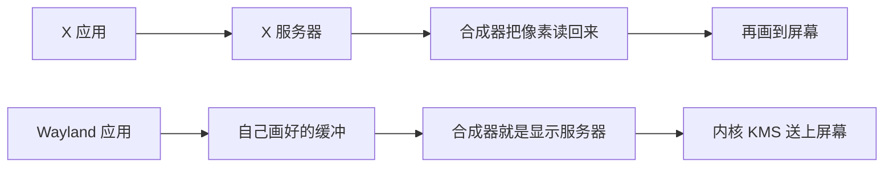

# X11 与 Wayland：协议停在 11 的四十年

X 的协议版本号从 1987 年 9 月 15 日停在 11，到现在将近四十年。Bob Scheifler 和 Jim Gettys 在 1984 年的 MIT 做它的时候，校园里是不同厂家的工作站，程序跑在机房的机器上，画面出现在学生面前的显示器上。网络透明是这个环境逼出来的：应用可以在远处跑，窗口画在本地。个人电脑、GPU 和合成桌面把前提换掉之后，协议还停在原地，窗口管理器、截图工具和远程登录都长在它上面。

2008 年 Kristian Høgsberg 开始写 Wayland，想把显示服务器收成合成器本身。同一段时间里，另一条远程显示的路已经先放弃了画线命令。剑桥奥利维蒂实验室在 1998 年发表的 VNC，线上只放一种东西：把一块像素矩形贴到指定坐标。工具包后来自己把窗口画成像素，X 把画圆、画字送到远处去执行的做法，在本地先被绕开，在网络上也就不再占便宜。

## 一帧像素怎么送到面板上

面板是一块按固定节拍刷新的像素网格。显示控制器按行把内存里的颜色读出去，经 HDMI、DisplayPort，或者笔记本内部的 eDP，送到面板。这块被按行读走的内存叫帧缓冲。控制器的老名字叫 CRTC，阴极射线管时代留下来的，现在它管的是哪一块缓冲接到哪一台显示器、分辨率多少、刷新多快。

控制器正在读的时候，如果 CPU 或 GPU 往同一块缓冲里写，画面会从某一行撕开，上半截是旧的，下半截是新的。所以至少要两块缓冲。一块正在被扫描，一块正在被画。画完之后等到垂直消隐，再把扫描指针换到新的那块。这一下叫翻页。人眼看到的是一整帧换掉，中间那帧写到一半的状态不出现在线上。

最早这些像素就在系统内存里，CPU 自己填。Linux 的 fbdev 把这块内存映射到用户态，程序当数组写。分辨率一高，CPU 逐像素填就占满了。GPU 接手之后，CPU 改写命令。用户态驱动把“贴这块纹理、画这些三角形”编成一批命令，放进双方都能看见的队列。内核的 DRM 驱动检查这批命令有没有越界，再提交给硬件。GPU 用 DMA 把命令取走，画进自己的缓冲对象。显示控制器从这块缓冲做扫描，像素不必先抄回系统内存。

用户态程序因此不再直接写显卡寄存器。模式、热插拔和翻页收进内核模式设置，也就是 KMS。应用问的是“我这块缓冲画完了，下一帧用它”，内核在垂直消隐时原子地切过去。合成器还得等 GPU 真正画完。扫一块写了一半的缓冲，和 CPU 直接往正在扫描的内存里写，是同一种撕裂。等待写在同步对象上：GPU 完成后信号才放开，扫描才拿这块缓冲。

到这里，一条链已经拆成三截。应用决定画什么。CPU 或 GPU 把像素填进缓冲。内核决定哪块缓冲在什么时刻接到哪块面板。显示协议夹在第一截和第二截之间，争的是“画什么”以什么形式交出去：一句画线命令，一块已经画好的像素，还是一个本机才能用的缓冲句柄。X、VNC 和 Wayland 的差别，后面都落在这一交上。

## 名字叫 X，是因为前面有个 W

斯坦福的 Paul Asente 和 Brian Reid 做过一个叫 W 的窗口系统，跑在 V 操作系统上。窗口可以跨网络，通信是同步的，服务器里存着显示列表。DEC 西部研究实验室把它移植到 Unix 上。Scheifler 要给 Argus 找一个能用的调试界面，Gettys 在 Project Athena。Athena 是 DEC、MIT 和 IBM 一起做的，目标是学生在任何一台工作站上都能用计算资源。卡内基梅隆的 Andrew 窗口系统许可不开放，没有现成的替代品。

他们拿 W 试了几天。层次化的窗口是对的，固定几种应用模式不够用。同步通信在 V 系统里也许还行，在 Unix 的 TCP 上慢到不能用。1983 年中，W 在 Unix 上的移植只有在 V 上速度的大约五分之一。1984 年 5 月，Scheifler 换成异步协议，服务器不再替客户保存显示列表，画什么由客户立刻说了算。这就是 X 的第 1 版。名字换成 X，是因为再叫 W 已经名不副实。Gettys 后来在网上写过：异步加上缓冲，比他们起步时的 W 快到大约三十倍。

X10 在 1985 年秋天从 MIT 放出。它有一堆写死的限制，比如颜色深度进了协议格式，扩不了。X11 从 1986 年春重新设计，夏天公开征求意见，协议先写完，实现后做。1987 年 2 月开始 alpha，5 月 beta，9 月 15 日发布。Gettys 在 DEC 的技术报告里写，当时没把握在合理时间内做出来的东西就没放进核心，比如非矩形窗口，后来才作为扩展加上。协议在测试期间改过，版本号定成 11 之后就没再升过。

工作站厂商要的是写一次客户程序，在别人的显示器上还能跑。协议若每年一版，Athena 那种多厂商校园就散了。扩展是留给以后的口子：核心不动，新能力用扩展协商。后来 Linux 上的图形几乎都走这个口子。

## 服务器在你面前，应用可能在别处

X 的用词和现在的网页相反。服务器是看管显示器、键盘和鼠标的那个进程，坐在人面前。客户是应用程序，可以在同一台机器上，也可以在网络另一头。1984 年这很自然。贵的是那块屏幕和那套输入设备，计算在别的机器上。学生在这台工作站上打开一个窗口，程序可能跑在机房里。协议走 TCP。建窗口、画线、收按键，都是请求和事件。服务器收到画线，就在自己掌握的帧缓冲里画。那时候服务器既是显示协议的终点，也是真正碰像素的那一层。

窗口管理器也是一个客户。服务器里没有标题栏代码。Athena 不想由 MIT 规定桌面长什么样，边框、标题栏、谁在上面，都交给另一个客户。客户之间怎么协商，写在 ICCCM 里，后来桌面环境又加了 EWMH。应用说“我想全屏”，窗口管理器可以同意，也可以不理。twm、fvwm、KWin、Mutter 都能换着上。一个窗口听谁的，靠的是这套约定。

任何连上这台服务器的客户，默认被当成可信的。它能列出别的窗口，能把别的窗口的像素读走，能用扩展把键盘事件注入进去，也能抢走输入焦点。截图工具、自动化脚本和键盘记录用的是同一类接口。1984 年的机房里，连上你显示器的程序多半是你自己启动的，或者是同一批学生。个人电脑上，浏览器、聊天软件和来路不明的二进制也连同一只套接字。SSH 的 X11 转发把远处的程序变成你本地服务器的客户，远处那个程序因此也能读你别的窗口。后来有过安全扩展，把客户分成不同信任级。用的人很少，因为大量现成程序假定自己什么都能看。

画图这件事，客户本来是发命令，服务器来画。个人电脑上的 CPU 和后来的 GPU 让这条路变笨。每次画一个圆都走协议，本地也要绕一圈。共享内存扩展让客户把像素画在一块和服务器共享的内存里，再通知服务器贴上去。直接渲染更进一步，客户经内核把命令交给 GPU，X 服务器只负责分配窗口和转发输入。字体也一样。服务器里的核心字体做不好抗锯齿，抗锯齿改到客户这边画，再把结果送去显示。核心协议里那套绘图请求还在，新程序几乎不用。

## 工具包把界面收成一棵树

应用作者写的是按钮和文字，屏幕要的是像素。中间这层是工具包。它手里有一棵控件树：顶层窗口下面是布局盒子，盒子里是按钮、标签和输入框。进程里有一个主循环，堵在显示连接上。鼠标按下，工具包按坐标从树里查出点中了谁，调用那个控件注册的函数。一块窗口被别的窗口盖住又露出来，显示服务器送来一块脏区域，工具包只重画那一块。布局分两步走。先问每个控件自己想要多宽多高，再把父控件分到的矩形切下去。GTK 里这两步长期叫 size request 和 size allocate，Qt 里是 sizeHint 和布局系统调用的 setGeometry。名字不同，顺序一样。

控件对象一直留在进程里，叫保留模式。按钮的文字、是否能点、焦点在不在它身上，都放在对象上，脏了才重画。另一头是立即模式：每一帧把界面按当前状态重新描述一遍，不保留控件对象。游戏里的调试面板，比如 Dear ImGui，走的是这条。桌面程序用保留模式，因为窗口可以几分钟都不动，没必要每帧把整棵树重算一遍。

X 自己也曾经在这两种做法之间换过一次。W 把显示列表留在服务器里。X1 改成客户说画就画，服务器执行完就可以忘掉命令，只留下窗口的位置、叠放和已经画上的像素。工具包后来把“界面长什么样”又拿回了应用进程。服务器侧留下的，主要是窗口矩形和输入焦点。

Xlib 只是协议的绑定，上面没有按钮。早期的控件在 X Toolkit Intrinsics 上，再配一套外观。Athena 的那套能用，看起来像教学示例。1980 年代末，商业 Unix 上真正在争的是两套外观：Sun 和 AT&T 的 Open Look，以及开放软件基金会的 Motif。Motif 赢了这场，1993 年几家 Unix 厂商把它收成公共桌面环境 CDE。许可是商业的。Linux 发行版买不起、也不想绑这套，自由的仿制品 LessTif 又一直没能把它替换干净。桌面程序要一个能免费拿去用的工具包，这个空档里长出了 GTK 和 Qt。

Qt 来自挪威的 Trolltech，Haavard Nord 和 Eirik Chambe-Eng 做的。1996 年 10 月，Matthias Ettrich 在新闻组上征集人做 KDE，选了 Qt。当时 Qt 对 X11 上的自由软件免费，商用要另外买许可，条款和 GPL 对不上。KDE 自己的代码是 GPL，底座却是别人可以收回的库。1997 年有人开始写 Harmony，想做一个自由的 Qt 替代。同一年 8 月，Miguel de Icaza 等人发起 GNOME，明确不用 Qt。

GTK 的来历更早一点，而且本来不是为桌面准备的。伯克利的 Spencer Kimball 和 Peter Mattis 写 GIMP，最早用的就是学校买了许可的 Motif。Peter 受不了 Motif，1996 年自己写了 gtk 和 gdk。GIMP 的旧文档里写，他们没打算做通用工具包，只是当时觉得该这么干。1997 年 2 月的 0.99 把这套重做成 GTK+，9 月 GTK+ 从 GIMP 里分出去，别人开始拿它写自己的程序。GNOME 用它，是因为许可已经是 LGPL，商用程序可以链接，自由软件也可以改。

2000 年 9 月，Trolltech 给 Qt 2.2 加了 GPL 这一选项，和原来的 QPL、商业许可并列。Harmony 在这之前已经散了。许可对齐之后，两个桌面都留了下来。GNOME 继续用 GTK，KDE 继续用 Qt。接下来要争的是控件画在谁的缓冲里，标题栏归谁画。

画图从 X 的绘图请求里撤出来，是这两套工具包各自做的。X 核心协议里的线是整数坐标，没有好用的抗锯齿，也没有和打印共用的一套路径。2005 年的 GTK 2.8 把绘制改到 Cairo。Cairo 能画到一块图像上，也能画到 X 的 Render 扩展上，同一条路径可以出到屏幕或打印机。控件的外观从此是 Cairo 算出来的像素，再贴进窗口。Qt 在第 4 版还能把绘图命令交给 X11。Qt 的文档写过，X11 提供的接口覆盖不了 QPainter 的全部能力，缺的部分得把像素拷回来用软件补。Qt 5 起，控件默认用软件光栅画进缓冲，再贴到窗口。OpenGL 留给 Qt Quick 那种每帧都在动的界面。

这一步做完，应用和 X 服务器之间还在说话，但说的不再是“画一个圆”。应用说的是“这块窗口里的像素我更新了”。远程的 X 也跟着变重：一次界面刷新可能是一整块图像，加上建窗口、查字体、同步几何时来回的那些回合。协议还是 1987 年的那套，工具包已经把它当成一块可以贴图的窗口，外加一个输入源。

标题栏后来又裂了一次。X 上的习惯是窗口管理器在应用窗口外面画边框和标题，应用只提供内容。GTK 3 把标题、关闭按钮和菜单画进应用自己的缓冲，叫客户端装饰。这样做，标题栏里可以放应用自己的按钮，GNOME 的很多程序长成一条头栏。KDE 希望边框仍然由 KWin 画，这样一屏窗口的外观和快捷键由窗口管理器统一管。Wayland 上这变成 xdg-decoration：客户和合成器协商这一帧的边框谁来画。协商不成，各自按自己的习惯画，同一桌面上的窗口会有两套标题栏。

wxWidgets 走了另一头。它尽量调用系统自带的控件，Windows 上像 Windows，GTK 上像 GTK。外观跟平台走，画图像素的路径也跟平台走。GTK 和 Qt 自己画控件，换到别的系统还能保持同一套布局，字体、输入法和标题栏就得每一层自己接。浏览器和 Electron 把这件事做到了网页引擎里：Chromium 自己排版、自己画，再把一块表面交给合成器。对显示服务器来说，它和 GTK 一样，是一个交缓冲的客户。

## 补丁堆了二十年，服务器变成中间商

Linux 上的实现先是 XFree86。2004 年 2 月 29 日的 4.4.0 改了许可，多了一条发行时必须致谢的条款，主要发行版不接受。X.Org 从这之前的代码分出来，成为后来的 X 服务器。Keith Packard 在这条线上做了很多后来被桌面依赖的扩展。

合成是其中一个。窗口内容先画到离屏的缓冲，再由合成器加上阴影、透明和动画，最后贴上去。Composite 扩展让合成器读到每个窗口的像素。Compiz 在 2006 年前后把这件事做成桌面效果，窗口可以晃，立方体可以转。看起来是 GPU 的胜利。结构上是绕路：应用把像素交给 X 服务器，合成器再从服务器读回来，用 OpenGL 画一次，再交回服务器去显示。多一次拷贝，就多一次对不齐的机会。撕裂、闪烁、拖动时的残影，都出在这几步之间。Høgsberg 后来说，他在 Red Hat 做 AIGLX 和 DRI2，就是在给这条绕路铺路。做完之后他看到，X 服务器已经是应用和合成器之间、合成器和硬件之间多出来的那一跳。

同一时期，显示模式的设置从 X 服务器挪进内核。KMS 让内核负责分辨率和显示器热插拔，切换虚拟终端时不必由用户态服务器去碰硬件。图形内存的管理也进了内核。Wayland 后来能把服务器写得很小，是因为这些已经不在用户态的 X 里了。没有 KMS 和内核里的缓冲共享，只换一个协议名字，显示器仍然点不亮。

多显示器、旋转、不同分辨率，靠 RandR 扩展补上。高分屏的 DPI 在 X 里长期是整个服务器一份。一台笔记本接一台普通外接屏，两块屏各要各的缩放比例，协议里没有这个概念。应用和工具包后来各写各的办法，结果是有的窗口按两倍画，有的被放大后发糊。1987 年的协议里没有这些需求。扩展把它们接上了，每接一个，客户、窗口管理器和合成器就多一套要对齐的约定。

## Wayland 把合成器写成显示服务器

Høgsberg 在 2008 年把这个实验叫做 Wayland。名字来自马萨诸塞州他开车经过的一个镇。参考合成器 Weston，来自旁边另一个镇。他对 Phoronix 的说法是：做一个显示服务器，只实现合成桌面真正用到的那一小部分。缓冲管理、输入，以及让合成器把这些缓冲拼起来。渲染在客户侧完成，模式设置在内核。服务器里不再有画线、画字、存字体。

核心想法是所有窗口都先画到缓冲里。客户画完，把缓冲的句柄交给服务器。合成器就在显示服务器里面。在 X 上，它是服务器旁边的另一个进程。标语是 “every frame is perfect”：应用能控制到每一帧，避免撕裂、滞后和重画时的闪烁。缓冲什么时候可以换，由协议里的提交和显示同步说了算。合成器拿到的是 GPU 已经画完的那一版，翻页交给内核的 KMS。

和 X 并排放，差在谁多一次拷贝：

窗口管理器不再是可以随便换上的另一个客户。边框、标题栏、工作区和快捷键属于合成器。GNOME 的 Mutter 和 KDE 的 KWin 各自成为 Wayland 服务器。你不能再像在 X 上那样，保留 GNOME、只把窗口管理器换成一个独立的小程序。xdg-shell 用了很久才从不稳定协议变成大家能依赖的桌面窗口约定。在那之前，每个合成器对最大化、全屏、窗口菜单的做法都不完全一样。应用要适配的是每一个合成器都可能略有不同的壳。

Fedora 25 在 2016 年把 GNOME 的默认会话改成 Wayland，硬件或驱动不行时再退回 X。Ubuntu 在 17.10 试过默认 Wayland，18.04 退回 X，后来又把非 NVIDIA 机器的默认会话改回 Wayland。KDE Plasma 6 把 Wayland 当作主会话。Fedora 40 的 KDE 甚至不再提供 X11 会话，X11 程序仍能跑，走的是另一条路。

NVIDIA 把这件事拖过很多年。Wayland 合成器假定用内核的 DRM，用 GBM 在客户和合成器之间分享缓冲。Intel 和 AMD 的开源驱动已经这样工作。NVIDIA 的专有驱动长期走另一套 EGLStreams，合成器得为它单写一条路径，很多合成器拒绝维护。驱动后来补上 GBM，这条特殊路径才从桌面的关键路径上拿掉。协议设计替换不了内核没提供的缓冲共享。

## 像素矩形另开了一条远程的路

X 把绘图命令送到人面前的服务器上执行。命令短的时候这很省：画一个字符串，线上只是字体、坐标和那几个字。工具包改成自己光栅化之后，这条节省消失了。远程 X 上跑一个现代 GTK 或 Qt 程序，来回的回合还在，线上运的却常常是大块图像。剑桥的实验室在这之前就碰到了另一组限制，于是干脆不传命令。

Olivetti 与 Oracle 研究实验室（ORL）在剑桥。他们先做的是 Teleporting：一个正在跑的 X 程序，界面可以中途改到另一台显示器上。实验室里日常在用。X 把这件事卡住了。显示那一头必须跑一整台 X 服务器，网络计算机和掌上设备带不动。安全模型让管理员不愿意让外面的机器连进自己的屏幕，X 的流量常常在站点边界被挡住。应用启动时回合太多，高延迟链路上要等很久。当时已经有 Low Bandwidth X 这种代理去减回合，前提还是两端都说 X。另一头的桌面是 Windows，X 协议进不去。

1994 年他们做了一块叫 Videotile 的实验设备：一块液晶屏、一支笔、一条 ATM 网络。一开始把远处的计算机屏幕当成视频源，整幅界面当原始视频送过来。能用，带宽吃得很厉害。应用那一侧再多一点判断，仍然把界面当成视频，但只送屏幕上发生变化的区域。这个想法长成了后来的协议。1995 年 Sun 放出 Java 和 HotJava 浏览器的早期版本。他们在后来的文章里写，最初的 Java 观看端用一天写成，类文件大约 6 KB。任何能跑 Java 的浏览器都可以连上自己的桌面。

1998 年 1/2 月的 IEEE Internet Computing 上，Tristan Richardson、Quentin Stafford-Fraser、Kenneth R. Wood 和 Andy Hopper 把这套系统写成文章，名字叫 Virtual Network Computing。协议叫 RFB，remote framebuffer。显示方向只有一种图元：在给定的 x、y 贴上一块像素矩形。最笨的编码是 raw，像素按行排好直接送，所有客户端和服务器都必须会。窗口拖动和滚动可以用 copyrect，线上只剩一个源坐标，观看端把自己帧缓冲里已有的那一块搬到新位置。普通桌面大片是纯色和文字，还可以用“一种背景色，加上若干小矩形”来压。一次更新由许多矩形组成，每个矩形可以挑不同的编码。更新由观看端来要。服务器把上一次请求之后的所有变化并成一批再送出。网络慢，拖动窗口时中间位置就少几个；网络快，中间帧就密。最终画面到达的速度，跟着带宽走。

用词和 X 是反的，读的时候容易拧。VNC 的服务器是像素发生变化的那一头，也就是桌面所在的机器。观看端叫客户，人坐在这一头。客户几乎不留恢复不了的状态。连接可以随时断，桌面、窗口位置、直到光标停在哪，都留在服务器上。换一台机器打开观看端，看到的是上次离开时的那一屏。X 做不到这一点：X 的状态在人面前的服务器里，应用在另一头，显示端一断，那扇窗口就没了。

ORL 先写的是 X 上的服务器。一台 Unix 上可以开好几个，每个用户一块虚拟桌面，上面再跑普通的 X 程序。这些程序以为自己连着一台 X 服务器，像素再被 RFB 送出去。Windows 上的服务器难写一些。系统里能挂钩子的地方少，他们当时的做法是把真实的那块屏幕镜像出去，一台 PC 只有一个桌面。观看端则很薄：可靠的传输，加上一块能写像素的地方。实验室给 Videotile、X、Windows 和 Java 都写了。X 服务器、X 观看端、Windows 两边的程序，当时可以放进一张软盘。

实验室里的人后来成立了 RealVNC。协议说明在 2011 年写成 RFC 6143，作者是 Richardson 和 J. Levine，记录的版本是 3.3、3.7 和 3.8。网上还有 TightVNC、TigerVNC 这些实现，各自加了更紧的压缩。1998 年那套口令校验以今天的标准看偏弱，很多人把 RFB 再套进 SSH，图的是外面那一层的加密，里面仍然是像素矩形。

VNC 能挂上 X，是因为两条路都通。一条是 Xvnc 自己当 X 服务器，应用本来就把像素交给它。另一条是 x11vnc 这种，附在已经存在的会话上，把真实屏幕读出来。第二条用的就是 X 的那条老规则：连上的客户可以读别人的像素。Wayland 把第二条堵上了。核心协议里没有“把整个屏幕交给一个随便连上的客户”。wlroots 一系的合成器自己提供了拷贝屏幕的接口，wayvnc 走的是这个。GNOME 的远程桌面更常从合成器内部把画面送出去，对外多给 RDP。门户那条路第一次还得有人点头。以前开机就听着、等人连上来的 VNC，在 Wayland 上得变成合成器的客人，或者变成一次已经批准的捕获会话。像素协议没有变笨。变了的是，整块帧缓冲不再是任何进程伸手就能读到的全局变量。

## 全局权限被拆成一次次授权

X 上“随便一个客户都能看全屏、都能注入输入”在 Wayland 的核心协议里没有对应物。客户只收到自己表面的输入。它问不到别的客户的窗口列表，也读不到别的客户的像素。截图、录屏、远程协助、自动化测试、全局快捷键，以前是调用几个 X 请求，现在每个都要一条新的、带授权的路。

屏幕捕获后来定在桌面门户上。应用通过 D-Bus 找 `org.freedesktop.portal.ScreenCast`，合成器弹出选择，人指定一块屏幕或一个窗口，门户把一段 PipeWire 视频流交回去。PipeWire 本是音频和视频的传输，这里被用来搬像素。第一次必须有人点头。会话可以用令牌恢复，不同合成器对令牌的行为并不一致。自动化脚本和没有人坐在前面的远程机器因此难写。后来 wayland-protocols 并入了更接近合成器的捕获协议，wlroots 一系用得更早。门户仍然是浏览器和会议软件最常见的那条路，因为它不绑定某一个合成器。

输入模拟和全局快捷键走类似的门户。在 X 上，辅助功能工具和宏工具用的是同一种注入。Wayland 把它们分开：辅助功能有自己的通道，随便一个二进制不能再对整个桌面发按键。中文、日文、韩文的输入法也得改。X 上输入法可以作为一个客户插进按键流。Wayland 上按键先到合成器，再按文本输入协议交给输入法。ibus 和 fcitx 都重写过这一段。这段没接上的年份里，很多人的结论是 Wayland 不能用，尽管浏览器本身已经能显示。

缩放是另一个从“整个服务器一份 DPI”里长出来的洞。Wayland 一开始能按输出做整数倍缩放，一台 2 倍的笔记本加一台 1 倍的外接屏，各自用各自的比例。XWayland 里的旧程序仍活在 X 的单一坐标里，被放大时常常发糊。分数倍缩放又等了更久，协议补上之后，工具包和合成器还要各自接上。两块不一样的屏幕接在同一台 X 服务器上时，一份全局 DPI 就不够用了。

## 旧程序以客户的身份留下

XWayland 是一台 X 服务器，它自己是 Wayland 的一个客户。旧的 X 程序连它，每个顶层窗口变成一块 Wayland 表面，由外面的合成器去摆位置、加阴影。根窗口那种铺满整个屏幕的做法用得少了，所以叫 rootless。`ssh -X` 仍然把远处的 X 客户带到本地，只是本地那台服务器是 XWayland。网络透明没有进 Wayland 协议。Wayland 的套接字是本地的。真要转发原生 Wayland 应用，得用 waypipe 这类在外面转发协议的程序。桌面并不自带它。要看整个桌面，人们还是回到 VNC 或 RDP，让合成器把已经合成好的像素送出去。

替换发生在会话这一层。桌面会话换成 Wayland 合成器，X 服务器缩小成这个合成器的一个客户，只服务还在说 X 协议的程序。新程序走 Wayland，旧程序走 XWayland，人在同一个屏幕上分不出哪一块像素来自哪条协议，直到缩放发糊、截图只能截到 X 的窗口、或者输入法只在一边生效。

兼容的代价是两套输入路径、两套窗口坐标、两套“谁可以看像素”的规则同时存在。只修 X，合成器永远在服务器外面多一次拷贝，全局权限也永远默认打开。只换协议、不留 XWayland，二十年里按 X 来写的程序会在换桌面的那天一起停。两条都做，是因为生态挂在行为上，不挂在某一个进程的名字上。

## 前提换了，协议可以停，行为不能停

1984 年的前提是：显示器是共享的稀缺设备，程序在别处，连上来的客户可信，窗口怎么摆是政策、服务器不管。这些前提分别被个人电脑、本地 GPU、不可信应用和合成桌面拆掉。绘图先被工具包的客户端光栅和直接渲染掏空，合成再把 X 服务器变成中间商。安全问题留到最后：连上套接字，就等于可以看整块屏幕。VNC 接住的是“远处的人要看已经画好的像素”。它不恢复画线命令，也故意不让观看端记住会话。Wayland 接住的是“本机上谁有资格碰这块缓冲”。它不提供校园网那种把应用窗口送到另一台机器的协议。

三套东西交出去的内容可以放在一起看。

| | 人坐在哪一端 | 交出去的是什么 | 断线之后 |
| --- | --- | --- | --- |
| X11 | 显示服务器这边 | 建窗口、画线、画字，以及输入事件。工具包后来常常改贴整块图像 | 应用在远端的话，窗口得重连。显示端不替应用保存界面 |
| VNC | 观看端是客户 | 一块块像素矩形，外加键盘和鼠标 | 桌面留在服务器上，光标停在上次的位置。换一台机器打开观看端可以接着用 |
| Wayland | 合成器和屏幕在同一台机器 | 本机传递缓冲句柄。协议本身不跨网络 | 会话在本机。远程要另加 waypipe，或由合成器把像素送进 VNC、RDP |

继续修补，是 X 实际走过的路，也是它能活到现在的原因。版本号停在 11，RandR、Composite、DRI、客户端字体从扩展里长出来，应用不用重写。重新设计，是在补丁已经把原结构绕开之后，把绕开的那条路写成新的中心。没有前面那些扩展，Wayland 在 2008 年没有内核可以依靠。没有 XWayland，新的中心进不了已经装好的桌面。没有 VNC 这种只认像素的协议，工具包改成自己画之后，远程桌面也没有一条和窗口系统无关的退路。

机制可以换，只要新机制能接上已经挪进内核的那一半：命令提交、缓冲对象、垂直消隐时的翻页。政策换不了这么干净。谁可以看屏幕、谁可以模拟键盘、窗口管理器还是不是一个普通客户、标题栏归应用还是归合成器，这些一旦被工具当成空气，就得给每一种旧行为找一个要人点头的新接口，再让旧程序在仿真里继续跑。X 的四十年是前一半。Wayland 这十几年，加上更早把像素当成视频来送的 VNC，是后一半。三套协议现在还经常叠在同一块面板上：Wayland 合成器里面跑着 XWayland，外面有人用 VNC 看着已经合成好的那一帧。

## 参考

- Robert W. Scheifler、Jim Gettys，[The X Window System](https://www.cl.cam.ac.uk/~pr10/iui/scheifler86.pdf)，1986。W 的同步协议为什么在 Unix 上太慢，以及 X 改成异步、立即模式的原因。
- Jim Gettys，1986 年 2 月在 net.sources 上的说明，见 [TUHS 存档](https://www.tuhs.org/Usenet/comp.sources.unix/1986-February/001195.html)。异步和缓冲相对 W 大约三十倍，显示列表改由客户保存。
- Jim Gettys 等，[The X Window System, Version 11](https://archive.decromancer.ca/bitsavers.org/pdf/dec/tech_reports/CRL-90-8.pdf)，DEC CRL-90-8。X11 从 1986 年春设计，1987 年秋实现可用；当时做不出的能力故意留成扩展。X11 的发布日 1987-09-15 见 [X Window System](https://en.wikipedia.org/wiki/X_Window_System) 的综述。
- XFree86 4.4.0 于 2004-02-29 发布，见 [项目更新说明](http://www.xfree86.org/4.4.0/UPDATES.html)。许可条款变化之后，发行版转向 X.Org 服务器。
- Kristian Høgsberg 对 Wayland 的早期说明，见 Phoronix，[Wayland: A New X Server For Linux](https://www.phoronix.com/review/xorg_wayland)，2008。只保留合成桌面用到的缓冲、输入和合成。
- The H Open，[Wayland - Beyond X](https://web.archive.org/web/20131206201020/http://www.h-online.com/open/features/Wayland-Beyond-X-1432046.html)。名字来自马萨诸塞的 Wayland 镇；“every frame is perfect”；X 服务器变成应用与合成器、合成器与硬件之间的中间商。
- [Wayland 架构说明](https://wayland.freedesktop.org/architecture.html)。客户侧渲染，合成器即显示服务器。
- Fedora，[WaylandByDefault](https://www.fedoraproject.org/wiki/Changes/WaylandByDefault)。Fedora 25 把 GNOME 的默认会话改为 Wayland，不可用时退回 X。
- Fedora，[KDE Plasma 6](https://fedoraproject.org/wiki/Changes/KDE_Plasma_6)。Fedora 40 的 Plasma 6 不再提供 X11 会话，X11 应用经 XWayland 运行。
- 屏幕捕获在 Wayland 上的路径：xdg-desktop-portal 的 ScreenCast，以及 PipeWire。后来并入 wayland-protocols 的捕获协议见 Phoronix，[Wayland Merges New Screen Capture Protocols](https://www.phoronix.com/news/Wayland-Merges-Screen-Capture)。
- Tristan Richardson 等，[Virtual Network Computing](https://www.cl.cam.ac.uk/research/dtg/attarchive/pub/docs/att/tr.98.1.pdf)，IEEE Internet Computing，1998 年 1/2 月。Videotile、只传变化区域、一种像素矩形图元，以及观看端可以断开再连。
- T. Richardson、J. Levine，[RFC 6143](https://www.rfc-editor.org/rfc/rfc6143)，2011。RFB 协议版本 3.3、3.7、3.8。
- GIMP，[早期历史](https://www.gimp.org/about/ancient_history.html)。Peter Mattis 因为受不了 Motif 写了 gtk/gdk；1997 年 2 月的 0.99 改成 GTK+。GTK+ 于 1997 年 9 月从 GIMP 分出，见 [GIMP 早期文档](https://docs.gimp.org/2.8/en/gimp-introduction-history-early-days.html)。
- Qt 2.2 在 2000 年 9 月加上 GPL 选项，见 [ZDNet 当时的报道](https://www.zdnet.com/article/good-news-for-kde-trolltech-adds-gpl-option-to-qt/)。在此之前 KDE 使用的 Qt 自由许可和 GPL 对不上，GNOME 选了 GTK。
- Qt 5 的绘制说明，见 [Graphics](https://doc.qt.io/archives/qt-5.15/topics-graphics.html)。控件默认走软件光栅引擎，画进缓冲再显示。
