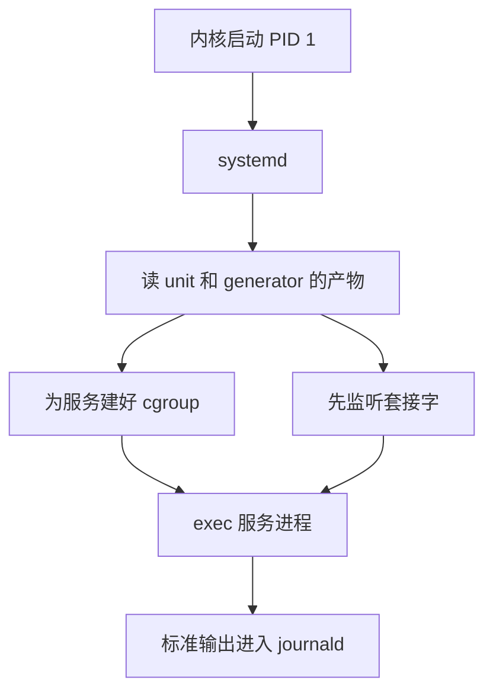

# systemd：PID 1 怎么变成了系统的中枢

Linux 内核把自己的初始化做完，会启动一个用户态进程，编号永远是 1。这个进程死掉，内核认为用户态已经没了，直接 panic。它还要收养那些父进程先退出的孤儿，不然僵尸进程没人收割。systemd 是现在 Fedora、Debian、Ubuntu、RHEL、Arch、openSUSE 用来充当这个进程的一套程序。它在 2010 年出现的时候，要修的是开机脚本既慢、又看不住自己拉起来的服务。

后来人们吵的往往是另一件事：一个本来该很小的 PID 1，为什么把日志、设备、DNS、家目录也放进了同一个项目。这篇沿这个裂缝往下看。先看 PID 1 的约束和 SysV、Upstart、launchd 各自怎么处理，再看 unit、套接字和 cgroup 这三样设计，最后看它现在还压着什么问题，以及其他启动方式为什么还活着。

## 脚本能开机，但看不住服务

SysV init 的模型很直。内核执行 `/sbin/init`，init 按运行级别去跑 `/etc/rcN.d` 里的脚本。脚本名字前面的 `S01`、`S20` 就是顺序。要并行，就得靠人把号码错开，再在脚本里轮询“对方起来了没有”。LSB 后来给脚本加了依赖头，顺序好算了一点，执行体仍是 shell。

2010 年 4 月 30 日，Red Hat 的 Lennart Poettering 在博客《Rethinking PID 1》里数过自己机器上的开机脚本：`grep` 被调用了 77 次，`awk` 92 次，`sed` 74 次，`cut` 23 次。每次都是新建进程、找动态库、做一点字符串处理、退出。他用开机后第一个用户 shell 的 PID 当尺子：那台 Linux 是 1823，对照的 Mac 是 154。这是他自己机器上的数，不是一份基准测试。方向很清楚：开机时间耗在了成百个短命进程上。

更麻烦的是脚本退出以后，服务还在不在，init 并不知道。Unix 守护进程有一套老规矩，叫双重 fork：父进程拉起子进程，子进程再 fork 一次并让中间那个退出，孙进程被 init 收养，从而脱离终端和控制脚本。Apache 停掉时，一个已经双重 fork 走的 CGI 不会跟着死，init 也说不出它曾经属于 Apache。人们用 pid 文件补这个洞。pid 文件是个数字，进程退出后这个数字可以被内核分给别人。拿它去发信号，可能打到一个无关进程上。

所以 SysV 的策略是“按顺序执行一串命令”。它没有“sshd 这个服务”这个对象，只有一次脚本运行。

## 事件会错过，套接字会留着

2006 年 Ubuntu 的 Scott James Remnant 写出了 Upstart，用事件把开机拆开。网卡出现了，发出一个事件；syslog 起来了，再发出 `syslog-started`；别的任务写着“等这个事件再启动”。主流发行版当时大多走了这条路，或者至少带着 SysV 兼容层用它。Poettering 在同一篇博客里写过，他喜欢 Upstart 的代码，但不接受这个模型。

事件是一瞬间。你要是在它发生之后才开始等，就等不到了。开机过程里硬件、磁盘、网络的到达顺序每次都可以不一样，用“谁发过什么事件”来拼接依赖，漏掉一次就变成竞态。他想要的是状态：sshd 应该处于运行中，而不是“某个启动事件已经响过”。

套接字激活走的是另一条，来自 macOS 的 launchd，再往前是 inetd。服务之间真正等待的，常常只是一个监听套接字：syslog 的 `/dev/log`，D-Bus 的那只 Unix socket，CUPS 的 `cups.sock`。与其等对方进程宣布自己准备好，不如由 PID 1 先把这些套接字建好，再把文件描述符在 `exec` 时交进去。客户端 `connect` 的时候，内核把连接放进套接字缓冲。对方还在启动，客户端只堵住这一个请求；对方崩溃了再被拉起来，套接字还在，客户端不一定能感觉到中间空过一拍。

inetd 把这件事做窄了。它多用于每个 TCP 连接 fork 一个新进程，所以留下了“慢”的名声。launchd 和后来的 systemd 用的是另一种：第一个连接到来时启动一个长期进程，后续连接仍由它接受。依赖关系因此变成次要的。两边可以一起启动，同步点缩成一次具体的 `connect`。

D-Bus 有现成的总线激活，效果类似：有人呼叫这个服务名，总线再把进程拉起来，并帮调用方把这次请求排队。文件访问也可以套同样的想法。对 `/home` 这种又大、又可能加密、开机服务却很少碰的文件系统，先挂一个 autofs，访问落到那一刻再阻塞，不必让全部服务等 fsck 结束。根分区不行，程序自己还在那上面。

这三件事，套接字、总线、autofs，都是把“等一等”交给内核里已经存在的阻塞，而不是在 shell 里轮询。

## 发行版用了四年才选边

systemd 宣布时还是实验代码。Poettering 主写，Kay Sievers（当时在 Novell，也是 udev 的维护者）一起做，Harald Hoyer 等人参与。LWN 当时记了一笔：不少人还没从 PulseAudio 的折腾里缓过来，又听说 init 要再换一次，而 Upstart 看起来刚刚要普及。

Fedora 15 在 2011 年 5 月把它做成默认，是第一个大型发行版。Arch 在 2012 年跟上。RHEL 7 在 2014 年用它替换了 Upstart。真正把选择变成社区事件的是 Debian。

2014 年 2 月，Debian 技术委员会为 Jessie 的默认 init 投票，systemd 和 Upstart 四比四。主席 Bdale Garbee 用决定票选择 systemd，范围是 Linux 架构，不包括当时的 kFreeBSD 和 Hurd。同年 11 月，开发者全体公投要不要禁止软件包绑定某一种 init。483 人投票，是 Debian 公投里参与人数最多的一次。胜出的选项来自 Charles Plessy，正文很短：项目认为现有决策程序够用，这次公投本身不必提出。Ian Jackson 随即退出技术委员会。他的担心是，一旦软件包可以依赖 systemd 才有的接口，不用 systemd 的 Debian 会慢慢装不齐。投票没有禁止这种依赖。Devuan 在这之后从 Debian 分出去，继续维护一条不把 systemd 当默认的线。

Ubuntu 自己就是 Upstart 的上游。Debian 选定之后，Ubuntu 放弃了继续分叉，15.04 起默认也是 systemd。到这时，桌面和服务器的主流安装介质已经站到同一边。Gentoo、Alpine 以及后来的 Artix、Void 没有跟。它们的默认仍是 OpenRC、runit 或 s6。

## 一个 unit 描述的是希望系统处于什么状态

systemd 不读一长串 shell，而读 unit。常见的几种：

| 类型 | 它代表的状态 |
| --- | --- |
| service | 一个进程树应该在运行，退出了怎么办 |
| socket | 一个监听套接字应该存在，有连接时可以把对应 service 拉起来 |
| timer | 某个时间点或某个间隔应该触发一次 |
| mount / automount | 一个挂载点应该出现，或者第一次访问时再挂 |
| target | 一组 unit 的集合，用来代替运行级别 |
| slice | cgroup 树上的一截，用来套资源限额 |

`multi-user.target` 大致相当于以前的多用户运行级别，`graphical.target` 再往上加图形登录。管理员看到的 `systemctl enable`，多半是在 unit 里写了 `WantedBy=multi-user.target`，启用时做一个符号链接，让这个 target 被拉起时把服务带上。

依赖分成两件不同的事，混在一起就会配错。`After=` 只规定：如果两边都要启动，谁排在后面。`Wants=` 表示尽量把对方拉起来，对方失败了自己还可以继续。`Requires=` 表示对方失败或停掉时，自己也要停。只写 `Requires=` 不写 `After=`，两边会一起被拉起，先后仍无定义。只写 `After=` 不写 `Wants=`，顺序只在对方碰巧也启动时才有意义。

服务怎么算“起来了”，由 `Type=` 决定。`simple` 认为 `exec` 成功就算运行中，适合自己不 fork、马上就能接客的程序。`forking` 是迁就旧守护进程的：父进程退出才算子进程就绪，pid 文件那套问题还在。`notify` 要求进程用 `sd_notify` 送出 `READY=1`，在此之前 systemd 认为它还在启动。`oneshot` 跑完就结束，适合建目录、跑一次迁移。新写的程序被建议停在前台，不要双重 fork。监督者要的是自己的直接子进程，而不是一个故意把自己藏起来的孙进程。

一份最小的服务文件长这样：

```
[Service]
Type=notify
ExecStart=/usr/bin/myapp
Restart=on-failure

[Install]
WantedBy=multi-user.target
```

`Restart=on-failure` 是监督：非正常退出就再拉起来。停服务时默认按整个 cgroup 杀进程，而不只杀主 PID。这就是 2010 年那篇里“CGI 双重 fork 之后停不掉 Apache”的对应物。

`/etc/fstab` 和 SysV 脚本还在。systemd 用 generator 在启动早期把它们翻译成 unit，监督仍落在 unit 上。

一次开机里，这几样东西的关系是：



## 套接字和 cgroup 各管一件内核已经会的事

套接字单元把 `ListenStream=` 或 `ListenDatagram=` 交给 systemd。对应的服务进程从环境变量 `LISTEN_FDS` 里拿到已经打开的描述符，不必自己 `bind`。服务可以在第一次连接时才启动，也可以开机就启动，但套接字始终先在。客户端阻塞在内核里，不需要 init 去广播“我好了”。

cgroup 解决的是另一件事。2010 年时 cgroup 已经在内核里，本意是给一组进程加资源限额，子进程会继承父进程的组，除非它有权限改 cgroup 文件系统，否则逃不掉。Poettering 把它用来记账：每个服务一个组，组空了就说明进程都没了，比 ptracing 每一个 fork 便宜。限额是后来叠上去的。`CPUQuota=`、`MemoryMax=` 写在 service 或 slice 上，落到的就是这棵树。用户登录后的进程在 `user.slice` 下面，系统服务在 `system.slice` 下面。容器运行时后来也用同一棵 cgroup v2 树给容器记账。两边抢的是同一种内核对象，所以在容器里再跑一套 systemd，需要把子树的写权限委托进去，否则里面的 PID 1 建不了自己的组。

日志要从服务的第一行输出就开始收。syslog 自己也是一个服务，开机最前面那段它还不在。journald 作为 systemd 的日志组件，把每条记录存成带字段的二进制日志，可以用 `journalctl -u` 按服务看，也可以看到这次启动早期、syslog 尚未就绪的输出。文本日志的传统是 `tail` 一个文件。journald 换来的是索引和结构化字段，代价是要靠专门的工具读，异常断电时文件尾可能被截断。systemd 262 在 2026 年 9 月加上了从这种被截断的活动日志里尽量找回完整条目的逻辑，说明这个问题一直留到了现在。

## 同一个仓库里后来又长出了什么

PID 1、journald 和 udev 走到一起，有人事上的原因，也有开机顺序上的原因。Sievers 维护 udev。设备出现的时机决定了磁盘、网卡什么时候能用，而并行开机把“等 udev 静下来”变成了关键路径。2012 年 udev 并进 systemd 项目之后，Gentoo 分出 eudev，以便在不用这套 init 的系统上继续管设备。eudev 后来停了，udev 的代码仍在 systemd 仓库里，别的 init 要设备管理时得另想办法，或者带上这一块。

logind 替换了 ConsoleKit，管登录会话、座位和关机权限。谁可以让机器睡眠，笔记本合盖要不要挂起，这些以前散落在桌面环境自己的守护进程里。2016 年的 systemd 230 把“用户登出后清掉他剩下的进程”改成默认行为。Poettering 的理由是，Unix 让任意用户进程在登出后继续不受约束地留下，既难管，也是安全问题。副作用立刻出现：人在 SSH 里开的 tmux、screen 会被一起杀掉。不少发行版把 `KillUserProcesses` 调回关闭。这个开关把“会话是资源边界”和“后台任务可以比登录活得更久”直接顶在一起，两边都有人要。

networkd、resolved、timesyncd、homed 是可选组件，不是每次 `exec` PID 1 都会用到。发行版可以选择用传统的网络脚本、`/etc/resolv.conf` 和独立的 NTP。一旦选用 resolved，本机会出现一个桩解析器，常见地址是 `127.0.0.53`，按网卡拆分 DNS，而很多软件仍假设 `resolv.conf` 里写的是上游服务器。homed 把用户身份和家目录捆在一起，家目录可以加密、可以挪到另一台机器再登录。262 里新建的 fscrypt 家目录默认用 v2 策略，旧的 v1 还能解锁，但没有原地升级。这些功能各自都能讲出使用场景。它们和“进程 1 必须收养孤儿”没有必然关系，只是放在了同一个上游。

nspawn 用同一套 namespace 和 cgroup 起一个系统容器，接近用 unit 把一台轻量系统拉起来。镜像仓库和跨节点调度仍是容器平台的事。262 甚至提供了把 PID 1 和执行器编成单个静态二进制的构建方式，并在二进制里放进一份后备 unit，给极小的、磁盘上还没有完整 unit 文件的环境用。项目一边往机密虚拟机、TPM 和系统更新伸，一边在补“小到几乎没有用户态”的那头。

## 现在还压在上面的问题

主流发行版已经不再争论默认 init 是谁。剩下的问题是这套默认带来的耦合，以及 PID 1 这个角色本身有多脆。

软件包越来越容易依赖 systemd 才有的接口：临时目录由 tmpfiles 创建，系统用户由 sysusers 创建，服务用 `sd_notify` 报就绪，日志直接写 journal。这些接口好用，也让“换掉 PID 1”从换一个包变成改一圈约定。Debian 2014 年那场公投担心的就是这件事。公投没有拦住，后来的发展大体符合当时反对者的预测。桌面和云镜像因此省下了大量各写各的启动脚本。

PID 1 不能随便崩。监督者、套接字和 cgroup 树都挂在这一个进程上，它一退出就是内核 panic。所以这个进程里的逻辑越普通越好，解析配置、拉起别人、自己不要做会泄漏或死循环的事。日志、DNS、家目录加密放在别的进程里，是这种约束下的正确切分。它们仍在同一仓库、同一发布节奏里，出了兼容性问题会一起进发行版。262 进入 Fedora 45 和 Debian Unstable 的速度，就是这条节奏。

cgroup v1 已经被标成过时。较新的 systemd 默认拒绝在 v1 上开机，除非内核命令行显式打开遗留支持。还守着 v1 层级的老容器运行时和老脚本，会在这里直接起不来。

容器镜像里经常根本没有 systemd。进程 1 是应用自己。这样镜像小，也避开了“容器里的 init 要写 cgroup”这件事。反过来，一个需要跑多个服务的容器若把 systemd 放进去，就要给它委托好的 cgroup 子树，还要处理 journald 把日志写到容器里而宿主机看不到的问题。两种用法都常见，文档却常常只写其中一种。

二进制日志、桩 DNS、登出杀进程，这些争议没有消失，只是从“要不要采用”变成了“默认开关放在哪”。发行版的选择往往比上游的默认更能说明一台机器的实际行为。

## 其他启动方式还在管什么

| 方式 | 现在谁在用 | 它抓住的点 |
| --- | --- | --- |
| SysV init | 还有兼容层，很少再当默认 | 按编号跑脚本，几乎没有监督 |
| Upstart | 开发在 2014 年停了 | 事件驱动，Ubuntu 用了很多年 |
| OpenRC | Alpine、Gentoo | 依赖关系写在脚本旁，体积小，不绑 Linux 专用接口 |
| runit、s6 | Void、Artix 等 | 一个目录一个服务，监督进程极小，依赖放在监督之外 |
| launchd | macOS | 套接字激活的来源，仍是苹果的 PID 1 |
| Android init | Android | 自己的 rc，不走这套 unit |
| systemd | 多数桌面和服务器发行版 | unit、套接字、cgroup、以及一仓库的配套守护进程 |

OpenRC、runit、s6 证明监督可以做得很小。runit 的每个服务一个目录，`run` 脚本停在前台，supervise 负责重启。它不建一套并行的套接字世界，也不提供日志索引。管理员用习惯了，行为好预测。缺的是“服务崩溃时整组进程一定在某个 cgroup 里”和“套接字先于进程存在”这两条内核级的约定。要补，就得在旁边再加别的程序，加到一定程度，又会遇到 systemd 已经做完的那些集成。

launchd 把套接字激活留在了苹果的系统里，没有变成通用 Unix 的 init。Android 的设备模型、权限和启动分区完全不同，init 是另一套 rc。嵌入式里 BusyBox init 仍然够用，因为服务就三四个，没有用户会话，也没有要跟着机器走的加密家目录。

systemd 赢下默认位置，不是因为别的程序写不出来，而是因为桌面发行版、服务器发行版和后来的云镜像需要同一套“进程树加资源加日志加登录”的答案，并且需要守护进程愿意改掉双重 fork。一旦 `sd_notify` 和 unit 成了上游软件的接口，再换 init 就要说服那些上游再改一次。Alpine 和 Devuan 选择不付这笔账，服务集合也因此和 Debian 不完全一样。

## 内核给机制，开机却是策略

Linux 内核长期的习惯是提供机制，把策略留在用户态。cgroup、namespace、autofs、套接字缓冲都是机制。它们不会自己决定 sshd 该不该在开机时运行，也不会在 Apache 退出时去找它的孙进程。

传统 Unix 把策略放在 shell 里，每个管理员自己拼。shell 擅长把文本接起来，不擅长代表一个会 fork 的进程树。双重 fork 正是旧策略的一部分：为了脱离终端，进程主动逃离父进程。pid 文件是用一个会回收的整数去记一个已经逃离的进程。并行开机把这些隐患从“偶尔脚本写错”变成“每次启动顺序都不同”。

systemd 的赌注是：策略应该写成希望达到的状态，并且由那个必须一直活着、又最早运行的进程去落实。它能在 `exec` 之前建好 cgroup 和套接字，是因为它就是父进程。这件事换一个普通守护进程做不到，换一套开机后再 attach 的监督也晚了，孙进程可能已经逃出了原来的进程组。

Unix 里“一个程序做一件事”说的是过滤器：输入字节，输出字节，用管道接起来。开机不是过滤器。一个服务是进程树、套接字、限额、重启策略和日志出口合在一起的状态。把监督做成一个小程序，这个批评成立的前提是，其余几件事有别的稳定接口。systemd 的做法是把这些接口一起定下来。公平的批评集中在仓库的边界：journald、resolved、homed 可以独立存在，却跟着 PID 1 的版本走，发行版一启用，用户就分不清哪些是 init 的职责。弱一些的批评是说监督本身不该存在。SysV 已经证明，没有监督的开机脚本留不住进程。

一台真实的机器比这两种口号都挤。笔记本要合盖睡眠，服务器要在第一个 SSH 连接时再拉起不常用的服务，云镜像希望进程越少越好，桌面希望登出时把用户进程清干净，而开发者希望 tmux 留下。systemd 把这些都收成 unit 和开关。开关的默认值就是政策。2016 年那个登出杀进程的默认值，比任何关于 Unix 哲学的争论都更直接地碰到了使用习惯。

所以它既是 PID 1，也是过去十五年里 Linux 用户态最重的一次政策集中。内核仍然只提供 cgroup 和套接字。谁在 `exec` 之前使用它们，谁就定义了这台机器上的服务是什么。

## 参考

- Lennart Poettering，[Rethinking PID 1](http://0pointer.de/blog/projects/systemd.html)，2010-04-30。systemd 的宣布。套接字激活、cgroup 记账、对 Upstart 事件模型的批评，以及他自己机器上的脚本调用次数，都出自这里。
- LWN，[The road forward for systemd](https://lwn.net/Articles/389149/)，2010。宣布之后，发行版为什么没有马上再换一次 init。
- LWN，[Debian decides on systemd—for now](https://lwn.net/Articles/585319/)，2014-02。技术委员会四比四，Bdale Garbee 的决定票。
- Debian，[General Resolution: init system coupling](https://www.debian.org/vote/2014/vote_003)，投票期到 2014-11-18。LWN 的[结果说明](https://lwn.net/Articles/621920/)记录了 483 票和 Plessy 那个“不必专门做这次公投”的选项。
- Ubuntu Wiki，[Systemd for Upstart Users](https://wiki.ubuntu.com/SystemdForUpstartUsers)。15.04 起默认 systemd，以及当时如何临时切回 Upstart。
- [systemd](https://systemd.io/) 与手册 [systemd.service](https://www.freedesktop.org/software/systemd/man/latest/systemd.service.html)、[systemd.socket](https://www.freedesktop.org/software/systemd/man/latest/systemd.socket.html)。`Type=`、`After=` 和套接字传递以手册为准。
- systemd 262 的发布说明见 [GitHub v262](https://github.com/systemd/systemd/releases)。2026-09-22 标记。静态 PID 1、journal 截断恢复、homed 的 fscrypt v2，以这份说明为准。cgroup v1 默认拒绝开机写在项目的 [NEWS](https://github.com/systemd/systemd/blob/main/NEWS) 里。
