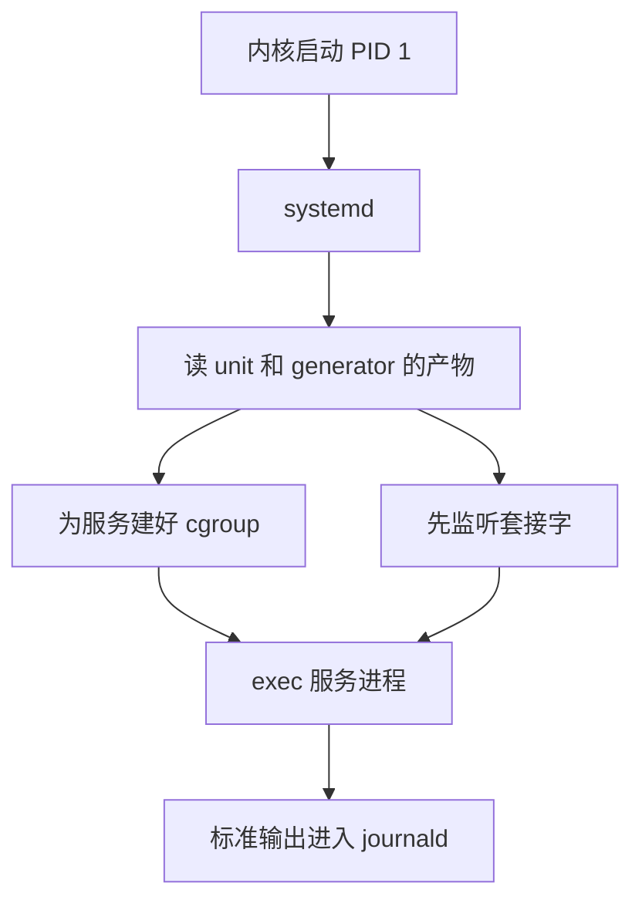

# systemd：一个开机程序，凭什么让 Linux 吵了十五年

在 Linux 系统当中 PID 为 1 的进程是一个很特别的进程，我们把它称为 init 进程，它是 linux 内核在完成 cpu、内存等等的初始化之后启动的第一个用户态进程。init 进程相当重要，作为第一个用户态进程，它需要负责拉起所有其他的用户态进程服务；同时这个进程也是整个用户空间生命周期的关键进程，一旦这个 PID = 1 的进程挂掉了，linux 内核会直接 panic，整个系统直接崩掉。今天绝大多数的 GNU/Linux 发行版上，包括 Fedora、Debian、Ubuntu、RHEL、Arch、openSUSE 等等在 init 进程的默认选择都是 systemd。

那既然这么多发行版同时选择了 systemd，那想必这一定是一个设计优雅、功能完备、测试健全、众望所归的明星项目，但事实上 systemd 自 2010 年诞生之初就一直争议不断，在内核社区、开源社区都吵的不可开交。2009 年它还是两个人在回程飞机上聊出来的想法。2014 年 Debian 为它吵到技术委员会的成员接连辞职，有人另起炉灶fork出一个发行版。它的作者收到过死亡威胁，也领过安全圈的“最差厂商回应奖”。与此同时，它从一个开机程序长成了一整套系统组件，日志、设备、登录、网络、DNS、家目录都收了进来，时至今日 systemd 所做的事情已经远远超过内核要求一个 init 进程所做的事情。

今天我们按时间顺序讲讲这个故事。旧的 init 存在什么问题？新的 systemd 又做了哪些事情？它是怎样赢下各家发行版，怎样一步步发展到现在的？

## 1983–2005：1 号进程的旧日子

故事的开始我们要从最早期 Unix 的 init 进程的设计来讲起。init 进程启动的时候操作系统内核只是完成了最基础的初始化的功能，此时整个系统还并不能很好的提供服务。

```demo
demos/init-hardware.html
```

比如说我的电脑上通过 USB 接口外接了一个鼠标，另外我还接了一块sata接口的移动硬盘，我还接了一块显示器，以及我通过网线连接了路由器。 这些设备在开机的时候还都处于不可用的状态，但还需要加载 usbhid 驱动、创建 /dev/input/mouse0 这样的设备文件，程序才能读到鼠标的移动和点击；SATA 接口上插着一块磁盘，需要先用 fsck 检查文件系统是否完好，再把它挂载到 /home 这样的目录上，用户才能读写里面的文件；网线插在 RJ45 网口上，需要把网卡 eth0 配置起来，再通过 DHCP 向路由器申请一个 IP 地址，机器才能联网；HDMI 接口连着显示器，最后还要在屏幕上启动登录终端 getty，用户才能看到 login: 提示并登录进系统。这些事情内核都不管，全都落在 init 进程身上。

Unix 的 init 从来是个不起眼的角色。今天说的 SysV init，设计来自 1983 年的 System V Unix，Linux 上那份 sysvinit 实现可以追到 1992 年（[Poettering 在 FOSDEM 2025 上的回顾](https://lwn.net/Articles/1008721/)）。模型很直：内核执行 `/sbin/init`，init 读 `/etc/inittab`，按运行级别去跑 `/etc/rcN.d` 里的脚本。脚本名字前面的 `S01`、`S20` 就是顺序。要并行，就得靠人把号码错开，再在脚本里轮询“对方起来了没有”。LSB 后来给脚本加了依赖头，顺序好算了一点，执行体仍是 shell。

这套东西能用二十多年，是因为当时的机器是静态的。服务器一年重启不了几次，硬件插进机箱就不会再变。开机慢几十秒，没人在意。

它真正的缺陷在开机以后：脚本退出了，服务还在不在，init 并不知道。Unix 守护进程有一套老规矩，叫双重 fork：父进程拉起子进程，子进程再 fork 一次并让中间那个退出，孙进程被 init 收养，从而脱离终端和控制脚本。Apache 停掉时，一个已经双重 fork 走的 CGI 不会跟着死，init 也说不出它曾经属于 Apache。人们用 pid 文件补这个洞。pid 文件只是个数字，进程退出后这个数字可以被内核分给别人，拿它去发信号，可能打到一个无关的进程上。

所以 SysV 的策略是“按顺序执行一串命令”。它没有“sshd 这个服务”这样的对象，只有一次脚本运行。

## 2005–2009：大家开始嫌开机慢

2000 年代中期，机器变了。笔记本要合盖、要连无线，U 盘、蓝牙、摄像头随时插拔，udev 接手了 `/dev` 的动态管理。设备什么时候出现、按什么顺序出现，每次开机都可能不一样。按编号排好的脚本放在这样的世界里很别扭。

各家开始各想各的办法。2005 年，苹果在 Mac OS X 10.4 Tiger 里放进了 [launchd](https://en.wikipedia.org/wiki/Launchd)，一个进程接管了 init、inetd 和 cron 的活。同年 Solaris 10 带来了 SMF，用清单描述服务和依赖，面向企业运维。Linux 这边，Canonical 的 Scott James Remnant 在 2006 年写出了 [Upstart](https://en.wikipedia.org/wiki/Upstart_%28software%29)，随 Ubuntu 6.10 发布。它用事件把开机拆开：网卡出现了，发出一个事件；syslog 起来了，再发出一个事件；别的任务写着“等这个事件再启动”。Fedora 9（2008）和后来的 RHEL 6 也用了它。有好几年，Upstart 看起来就是 Linux init 的未来。

2008 年 9 月的 Linux Plumbers Conference 上，Intel 的 Arjan van de Ven 和 Auke Kok [做了一个演示](https://lwn.net/Articles/299483/)：一台 Eee PC 上网本，从按下电源到 Fedora 桌面就绪，五秒。开机比投影仪同步画面还快，两个人只好把上网本举起来给台下看。他们的做法不是换 init，而是给每个阶段定预算：内核一秒，系统服务一秒，X 一秒，桌面两秒，超了预算就砍。Arjan 在 [LWN 评论区](https://lwn.net/Articles/299762/)补了一句挺扎心的话：Fedora 9 已经在用 Upstart，开机还是要 45 秒；并行开机能让你从 45 秒变成 43 秒，但变不成 5 秒。

这场演示把开机速度变成了一个可以量化、可以比赛的指标。也是在这个圈子里，Red Hat 的 Lennart Poettering 早先摆弄过一个自己写的 init，叫 Babykit。他那时已经因为 PulseAudio 和 Avahi 小有名气，也小有争议。Upstart 公开以后他就停了手。他后来[在一次采访里回忆](https://www.linuxvoice.com/interview-lennart-poettering/)，那时大家都觉得 Upstart 就是未来：Scott 明白 init 必须是动态的，要能对事件作出反应，而不是 SysV 那种静态的东西。

## 2009：回程航班上的 Babykit

转折发生在 2009 年的 Linux Plumbers Conference。Poettering 和 Kay Sievers 在会上看到 Upstart 并没有往前走。它的核心模型要求管理员自己把依赖翻译成一条条“某事件发生后做某事”，开发节奏慢，Canonical 还要求贡献者签版权转让协议，外面的开发者不太愿意往里投代码。回程的飞机上，两个人把一个新 init 的基本想法聊了出来（见 [LWN 对 FOSDEM 2025 演讲的报道](https://lwn.net/Articles/1008721/)和演讲[幻灯片](https://archive.fosdem.org/2025/events/attachments/fosdem-2025-6648-14-years-of-systemd/slides/238151/14_Years_cfrZhmg.pdf)）。回去以后，Poettering 翻出了 Babykit 的旧代码。

Babykit 这个名字是当时的风气。freedesktop 那一圈的守护进程流行叫某某 Kit，PolicyKit、ConsoleKit、PackageKit 都是，Poettering 说这大概是从苹果那边学来的。Babykit 的意思是进程的保姆。它后来改名 systemd，[项目的品牌页](https://brand.systemd.io/)至今留着一段一本正经的拼写说明：写作 systemd，不是 SystemD，也不是 System D，因为它是一个 system daemon，Unix 上守护进程的名字全小写，后缀一个 d。要是嫌这个解释太简单，也可以把它念作（但千万别写成）“System Five Hundred”，因为 D 是罗马数字 500，正好接在 System V 后面。法语里的 Système D，指在困境里随机应变、凑合着把事办成的本事，不是正确拼法，“虽然还挺贴切”。

两个人分属两家公司。Poettering 在 Red Hat，写了大部分代码。Sievers 当时在 Novell（SUSE 的母公司），是 udev 的维护者，熟悉设备和内核那一侧。一个 init 的两位作者来自两家互相竞争的发行版厂商，这本身就是一个信号：它不打算只做某一家的东西。

Red Hat 起初并不买账。Poettering [在 Linux Voice 的采访里](https://www.linuxvoice.com/interview-lennart-poettering/)说，管理层的态度是：我们走 Upstart，别做这个。他就在业余时间做。

## 2010 年 4 月：《Rethinking PID 1》

2010 年 4 月 30 日，Poettering 在博客上发了一篇长文[《Rethinking PID 1》](http://0pointer.de/blog/projects/systemd.html)，systemd 第一次公开亮相。这篇文章后来被引用了无数次，它的几条论证也成了之后十五年所有争论的底稿。

他先拿自己机器上的开机脚本开刀：`/etc/init.d` 里的脚本调用 `grep` 至少 77 次，`awk` 92 次，`sed` 74 次，`cut` 23 次。每次都是新建进程、找动态库、做一点字符串处理、退出。他还给了一把尺子：开机登录后打开终端，敲 `echo $$` 看第一个 shell 的 PID。他手上的 Linux 是 1823，Mac 是 154。这是他自己几台机器上的数，不是一份基准测试，但方向很清楚：开机时间耗在了成百个短命进程上。

接着是 launchd 教给他的东西：套接字激活。服务之间真正等待的，常常只是一个监听套接字，比如 syslog 的 `/dev/log`，D-Bus 的那只 Unix socket，CUPS 的 `cups.sock`。与其等对方进程宣布自己准备好了，不如由 PID 1 先把这些套接字建好，再在 `exec` 时把文件描述符交进去。客户端 `connect` 的时候，内核把连接放进套接字缓冲。对方还在启动，客户端只堵住这一个请求；对方崩溃了再被拉起来，套接字还在，客户端不一定察觉得到中间空过一拍。

这个想法 inetd 早就有，但 inetd 多用于每个 TCP 连接 fork 一个新进程，留下了“慢”的名声。launchd 用的是另一种：第一个连接到来时启动一个长期进程，后续连接仍由它接受。依赖关系因此退到次要位置，两边可以一起启动，同步点缩成一次具体的 `connect`。D-Bus 现成的总线激活效果类似：有人呼叫这个服务名，总线再把进程拉起来，并替调用方把这次请求排队。文件系统也能套用同样的想法，这是 Red Hat 的 Harald Hoyer 出的主意：对 `/home` 这种又大、又可能加密、开机服务却很少碰的文件系统，先挂一个 autofs，访问落到那一刻再阻塞，不必让所有服务等 fsck 结束。根分区不行，程序自己还在那上面。

套接字、总线、autofs，这三件事都是把“等一等”交给内核里已经存在的阻塞，而不是在 shell 里轮询。

第三块是 cgroup。2010 年时 cgroup 已经在内核里，本意是给一组进程加资源限额，最早是为容器准备的。子进程会继承父进程的组，除非有权限改 cgroup 文件系统，否则逃不掉。Poettering 把它拿来记账：每个服务一个组，组空了就说明进程都没了，比用 ptrace 盯住每一次 fork 便宜。那个双重 fork 走的 CGI，仍然待在 Apache 的组里。

最后他花了很大篇幅批评 Upstart。事件是一瞬间的，你要是在它发生之后才开始等，就等不到了。开机过程里硬件、磁盘、网络到达的顺序每次都可以不一样，用“谁发过什么事件”来拼接依赖，漏掉一次就是竞态。更根本的问题是，事件模型把依赖头脚倒置了：管理员脑子里想的是“A 需要 B”，写进 Upstart 却要变成“B 启动后启动 A”和“B 停止后停止 A”两条规则。init 不再朝着一个目标只做必要的事，而是每做完一步，就把所有可能跟在后面的事都做一遍。他想要的是状态：sshd 应该处于运行中，而不是“某个启动事件已经响过”。

文末的 FAQ 很有他的个人风格。“这是 Red Hat 的项目吗？”“不是，这是我个人的业余项目。这里的观点只代表我自己，不代表我的雇主，也不代表麦当劳叔叔。”“为什么不直接改进 Upstart，这不是 NIH（非我所创）吗？”他先答了一遍技术理由，然后补了一刀：别忘了，Upstart 里真有一个库就叫 NIH，那是 Upstart，不是 systemd。贡献者不需要签版权转让，“这一点和 Canonical/Upstart 很不一样！”还有一条当时没多少人在意：“它能跑在非 Linux 系统上吗？”“不太可能。”systemd 用了 epoll、signalfd、cgroup 这一堆 Linux 专有接口，他们也不打算合并别的平台的移植。这句话后来成了 BSD 用户和“可移植性”一派最常引用的罪状之一。

[LWN 当时记下了社区的情绪](https://lwn.net/Articles/389149/)：不少人还没从 PulseAudio 的折腾里缓过来，又听说 init 要再换一次，而 Upstart 看起来刚要普及。

## 它换掉的是什么模型

先把故事停一下，看看 systemd 拿什么代替了那一长串 shell。

它不读脚本，而读 unit。常见的几种：

| 类型 | 它代表的状态 |
| --- | --- |
| service | 一个进程树应该在运行，退出了怎么办 |
| socket | 一个监听套接字应该存在，有连接时可以把对应 service 拉起来 |
| timer | 某个时间点或某个间隔应该触发一次 |
| mount / automount | 一个挂载点应该出现，或者第一次访问时再挂 |
| target | 一组 unit 的集合，用来代替运行级别 |
| slice | cgroup 树上的一截，用来套资源限额 |

`multi-user.target` 大致相当于以前的多用户运行级别，`graphical.target` 再往上加图形登录。管理员敲的 `systemctl enable`，多半是在 unit 里写了 `WantedBy=multi-user.target`，启用时建一个符号链接，让这个 target 被拉起时把服务带上。

依赖分成两件不同的事，混在一起就会配错。`After=` 只规定：如果两边都要启动，谁排在后面。`Wants=` 表示尽量把对方拉起来，对方失败了自己还可以继续。`Requires=` 表示对方失败或停掉时，自己也要停。只写 `Requires=` 不写 `After=`，两边会一起被拉起，先后仍无定义。只写 `After=` 不写 `Wants=`，顺序只在对方碰巧也启动时才有意义。

服务怎么算“起来了”，由 `Type=` 决定。`simple` 认为 `exec` 成功就算运行中，适合自己不 fork、马上就能接客的程序。`forking` 是迁就旧守护进程的：父进程退出才算子进程就绪，pid 文件那套问题还在。`notify` 要求进程用 `sd_notify` 送出 `READY=1`，在此之前 systemd 认为它还在启动。`oneshot` 跑完就结束，适合建目录、跑一次迁移。新写的程序被建议停在前台，不要双重 fork。监督者要的是自己的直接子进程，而不是一个故意把自己藏起来的孙进程。

一份最小的服务文件长这样：

```
[Service]
Type=notify
ExecStart=/usr/bin/myapp
Restart=on-failure

[Install]
WantedBy=multi-user.target
```

`Restart=on-failure` 是监督：非正常退出就再拉起来。停服务时默认按整个 cgroup 杀进程，而不只杀主 PID，这就是《Rethinking PID 1》里那个“停掉 Apache 杀不死 CGI”的答案。

套接字单元把 `ListenStream=` 或 `ListenDatagram=` 交给 systemd。对应的服务进程从环境变量 `LISTEN_FDS` 里拿到已经打开的描述符，不必自己 `bind`。服务可以在第一次连接时才启动，也可以开机就启动，但套接字始终先在。客户端阻塞在内核里，不需要 init 去广播“我好了”。

cgroup 这边，限额是后来叠上去的。`CPUQuota=`、`MemoryMax=` 写在 service 或 slice 上，落到的就是这棵树。用户登录后的进程在 `user.slice` 下面，系统服务在 `system.slice` 下面。容器运行时后来也用同一棵 cgroup v2 树给容器记账。两边抢的是同一种内核对象，所以在容器里再跑一套 systemd，需要把子树的写权限委托进去，否则里面的 PID 1 建不了自己的组。

旧世界的东西没有一刀切掉。`/etc/fstab` 和 SysV 脚本由 generator 在启动早期翻译成 unit，监督仍落在 unit 上。这层兼容一直留了十六年。

一次开机里，这几样东西的关系是：



## 2010–2013：Fedora 先吃螃蟹

Fedora 原本打算在 14 版就把 systemd 设成默认。2010 年 9 月 14 日，Fedora 工程指导委员会 FESCo 在 IRC 上开会讨论（[会议纪要](https://www.mail-archive.com/devel@lists.fedoraproject.org/msg15211.html)，[LWN 的报道](https://lwn.net/Articles/405100/)）。测试日刚发现了一批问题，委员们担心这么核心的组件到发布日还没准备好，升级会出事。讨论了一个小时，结论是推到 Fedora 15，“给修小问题、写文档和整体打磨留出时间”。Poettering 没参加这次会，事后[在邮件列表里](https://www.mail-archive.com/devel@lists.fedoraproject.org/msg15219.html)很不高兴：阻塞发布的 bug 都关了，此前提出的问题也大都修了，结果临时冒出一套新标准。有人回帖安慰，说这只是推迟，等它在 F15 成为默认时会很扎实、很熟悉，“没人会诅咒 Lennart”。

2011 年 5 月，Fedora 15 发布，成为第一个默认使用 systemd 的大型发行版。第二年 Arch 和 openSUSE 跟上。Arch 的维护者 2012 年 8 月讨论迁移时，把不少批评，比如用 D-Bus、用 C 而不是 bash、可选的二进制日志，反过来列成了优点。10 月起，[Arch 的新安装默认 systemd](https://archlinux.org/news/systemd-is-now-the-default-on-new-installations/)。

这几年里，systemd 开始长出 init 之外的部分，每长一块，就引来一场争论。

第一块是日志。2011 年 8 月，[kernel.org 被入侵](https://lwn.net/Articles/457142/)。11 月 18 日，Poettering 和 Sievers [公布了 journal 的设计文档](https://0pointer.net/blog/projects/the-journal.html)（[LWN 的摘要](https://lwn.net/Articles/468049/)），理由之一正来自这类入侵：攻击者得手后通常会改日志掩盖痕迹，纯文本的 syslog 很难发现。journal 学 git，每条记录连同前一条的哈希一起散列，只要最新的哈希存到一个安全的地方，整条链都能验证。另一些理由更日常：syslog 的消息来源不可信，没有时区，解析全靠正则，而服务开机最早的那段输出，syslog 自己还没起来，收不到。代价是日志变成了带索引的二进制文件，设计文档里还写着一句：我们不打算把格式标准化，会按需要随时修改。LWN 主编 Jonathan Corbet [写道](https://lwn.net/Articles/468381/)，有些话题天生就是用来给 LWN 评论系统做压力测试的，现在“Lennart Poettering 的作品”也得加进这个名单。

journald 带来的是 `journalctl -u` 按服务看日志，也能看到这次启动早期、syslog 尚未就绪时的输出。文本日志的传统是 `tail` 一个文件。journald 换来的是索引和结构化字段，代价是要靠专门的工具读，异常断电时文件尾可能被截断。它默认可以把日志继续转发给 syslog，所以很多发行版在相当长的时间里两套并存。

第二块是 udev。2012 年 4 月，Sievers [在邮件列表上宣布](https://lwn.net/Articles/490413/)，udev 的源码并进 systemd 仓库。为了和 udev 的版本号对齐，systemd 直接从 44 跳到了 183，[v183 的 NEWS](https://github.com/systemd/systemd/blob/v183/NEWS) 里写着“我们在这里跳过了 139 个版本”。这件事有开机顺序上的道理：设备出现的时机决定了磁盘、网卡什么时候能用，并行开机把“等 udev 静下来”变成了关键路径。但它也意味着，不用 systemd 的发行版要么带上一块 systemd 的代码，要么另想办法。

同年秋天，udev 让 Linus Torvalds 发了一次火。一处 udev 的改动让某些驱动加载固件时卡住 30 秒。Sievers 认为问题出在内核，几个月没修，送来的补丁也没接。2012 年 10 月，Linus [在内核邮件列表里](https://lkml.org/lkml/2012/10/3/484)写下了那句后来被反复引用的“Kay, you are so full of sh*t that it's not funny”，说自从 Greg Kroah-Hartman 放手以后，udev 的维护每况愈下。他的解决办法是绕开用户态：3.7 内核自己从文件系统加载固件（[LWN 的来龙去脉](https://lwn.net/Articles/518942/)）。Sievers 对此倒没意见，说他巴不得让 udev 彻底退出“固件加载这场病态的游戏”。一个月后，Gentoo 的开发者[分叉出 eudev](https://lwn.net/Articles/525770/)，好在不用 systemd 的系统上继续管设备。

第三块把桌面环境卷了进来。logind 接替了早已没人维护的 ConsoleKit，管登录会话、座位和关机权限：谁可以让机器休眠，笔记本合盖要不要挂起，这些以前散落在各个桌面环境自己的守护进程里。GNOME 起初表态说基本功能不应依赖 systemd，可到了 GNOME 3.8，登录管理事实上只剩 logind 一条路。Gentoo 试过在 OpenRC 上适配，bug 太多，最后只好把 systemd 标成 GNOME 的依赖（GNOME 发布团队的 Olav Vitters [当时的说明](https://blogs.gnome.org/ovitters/2013/09/25/gnome-and-logindsystemd-thoughts/)）。一个 init 系统借着“桌面离不开的登录管理器”赢下发行版，这是它后来被批评“捆绑”的起点。

2013 年 1 月，Poettering 写了一篇[《The Biggest Myths》](http://0pointer.de/blog/projects/the-biggest-myths.html)，逐条回应“systemd 是单体的”“systemd 违反 Unix 哲学”之类的说法，指出它由 69 个独立的二进制组成。同一个月的 systemd 197 引入了[“可预测的网卡名”](https://systemd.io/PREDICTABLE_INTERFACE_NAMES/)：`eth0` 变成了 `enp0s3` 这样按总线位置编的名字。它解决的是多网卡机器上 `eth0` 和 `eth1` 每次开机可能对调的老问题，也让无数教程和脚本一夜过时。

## 2013–2015：Debian 的那个冬天

到 2013 年，版图大致分成三块：Red Hat 系、Arch、openSUSE 用 systemd，Ubuntu 用自家的 Upstart，Debian 还停在 sysvinit 上，要为下一版 Jessie 选默认 init。Debian 是几百个衍生发行版的上游，Ubuntu 也在其中。它怎么选，基本决定了剩下那一半 Linux 世界。

2013 年 10 月，有人给 Debian 技术委员会提了 [bug #727708](https://bugs.debian.org/727708)，请委员会决定默认 init。接下来几个月，委员会的邮件列表变成了一场公开的长篇辩论，候选有 systemd、Upstart、OpenRC，也有维持 sysvinit，委员们各自写了大量长篇分析。2014 年 2 月投票，systemd 和 Upstart 四比四。主席 Bdale Garbee [用决定票选了 systemd](https://lwn.net/Articles/585319/)，范围是 Linux 架构，不包括当时的 kFreeBSD 和 Hurd。

三天后是情人节，Mark Shuttleworth 发了一篇博客，标题叫[《Losing graciously》](https://web.archive.org/web/20140322130122/http:/www.markshuttleworth.com/archives/1316)，体面地认输。他感谢委员会认真的辩论，说连投了反对票的委员也称赞过 Upstart 的代码质量，说 Upstart 在内核剧烈变动的年代给了 Ubuntu 竞争优势，而且是 RHEL 6 的 init。但决定就是 systemd，Ubuntu 是 Debian 家族的一员，所以 Ubuntu 会跟。从 2015 年 4 月的 Ubuntu 15.04 起，默认 init 换成了 systemd。Upstart 在 2014 年之后再没发过新版本。它最后的主要栖身之地是 Google 的 ChromeOS：Remnant 在 2011 年前后[离开 Canonical 去了 Google 做 ChromeOS](http://www.linux-magazine.com/Online/News/What-is-Upstart)，那边[至今还在用 Upstart](https://www.chromium.org/chromium-os/chromiumos-design-docs/boot-design/)。

同一年，企业发行版也站了过来。RHEL 7 在 2014 年 6 月发布，用 systemd 替换了 Upstart，SUSE 的 SLES 12 在秋天跟进。Poettering 后来说，从那时起，“整个世界都开始跑在 systemd 上了”。

但 2014 年也是吵得最凶的一年。

4 月，内核开发者 Borislav Petkov 发现（[LWN 的完整梳理](https://lwn.net/Articles/593676/)），在内核命令行加上 `debug` 时，systemd 也会读到这个词，打开自己的调试输出，再撞上 systemd 里一处断言失败，日志洪水冲垮了 kmsg，机器直接起不来。他给 systemd 报了 bug。一个多小时后，Sievers 以 NOTABUG 关掉，理由是内核并不独占这个参数：“通用的词就是通用的，不归第一个用它的人所有。”bug 被反复重开、关闭，一路吵到了内核邮件列表。Steven Rostedt [提议](https://lists.openwall.net/linux-kernel/2014/04/06/133)干脆把 `debug` 从 `/proc/cmdline` 里藏起来。[Linus 说他受够了](https://www.theregister.com/software/2014/04/05/torvalds-rails-at-linux-developer-im-fcking-tired-of-your-code/1405947) Sievers 自己写的代码出问题不修、让内核去绕，宣布在他改变做法之前不再接受他的补丁。事后看，那个断言 bug 其实已经在 systemd 里修了，只是 bug 报告里没说清楚，内核这边也补上了 kmsg 的限速。LWN 的评价是，两边都表现得不理想，而科技媒体起的那些标题最糟。这件事的余波后来落到了 kdbus 身上。

同样是 4 月，有人建了 boycottsystemd.org，列出抵制它的理由。8 月，InfoWorld 的 Paul Venezia [写文章](https://www.infoworld.com/article/2181395/systemd-harbinger-of-the-linux-apocalypse.html)把 systemd 比作 Windows 的 svchost.exe。

10 月 6 日，Poettering 在 Google+ 上发了一篇长帖（原帖已随 Google+ 关闭消失，[Phoronix](https://www.phoronix.com/news/MTgwNTk) 和 [InfoWorld](https://www.infoworld.com/article/2248343/linux-developers-and-users-should-be-civil-while-disagreeing-passionately.html) 保留了摘录）。他说开源社区对外总把自己说成一个快乐的地方，只看技术，大家在会上一起喝啤酒，其实不是这样，“这是个相当病态的地方”。他列了自己的遭遇：收到仇恨邮件；有人在请愿网站上发起请愿，要他停止工作；有人在 YouTube 上传了一首满是脏话、暗示暴力的“歌”；最近还有人在募集比特币，要雇杀手对付他，“这真的发生了”。他把一部分责任算到 Linus 头上，说 Linus 的骂人风格被很多人当成榜样，“鱼从头开始烂”。他说自己和内核社区的关系几乎还没开始就结束了，多年没在 LKML 上发过言。

11 月，Debian 内部的疲惫到了顶点。Ian Jackson 发起了一次[全体开发者公投](https://www.debian.org/vote/2014/vote_003)，问要不要禁止软件包绑定某一种 init。483 人投票（[LWN 的结果说明](https://lwn.net/Articles/621920/)），是 Debian 公投里参与人数最多的一次。胜出的选项来自 Charles Plessy，正文很短：项目认为现有的决策程序够用，这次公投本身没必要。前后几周里，一串人离开了自己的位置。Joey Hess，debhelper 的作者、Debian 最早的一批开发者之一，干脆[退出了整个项目](https://joeyh.name/blog/entry/on_leaving/)，理由是项目的宪章被拿来制造对立。Tollef Fog Heen 退出了 systemd 打包团队，说他受不了那种“这一切都是某种阴谋”的持续鼓噪。技术委员会里，投 Upstart 的 Colin Watson 和投 systemd 的 Russ Allbery 先后辞职（Allbery 的[辞职信](https://lwn.net/Articles/620879/)写得很长，值得一读）。公投失败后，Ian Jackson 也退出了技术委员会。他担心的是，一旦软件包可以依赖 systemd 才有的接口，不用 systemd 的 Debian 会慢慢装不齐。投票没有禁止这种依赖。

同月底，一群自称“Veteran Unix Admins”的人[宣布分叉 Debian](https://unixdigest.com/includes/files/debian-fork-message.txt)，项目叫 Devuan，维护一条不把 systemd 当默认的线。它在 2017 年发布了第一个稳定版，一直延续到今天。

2015 年 4 月，Debian 8 Jessie 发布，默认 systemd。Poettering 后来把 Debian 和 Ubuntu 的转向称作 systemd“最复杂的一场胜利”。四年后的 2019 年 12 月，Debian 就同一个问题[又投了一次票](https://www.debian.org/vote/2019/vote_002)。七个选项从“专注于 systemd”一直排到“必须支持多种 init”，胜出的是折中的“systemd，但我们支持探索替代方案”：systemd 的 service unit 是描述服务的首选方式，想走别的路的人自己出力，项目要及时审他们的补丁。

## 2014–2020：从 init 长成一个平台

吵归吵，代码一直在长。

网络这一块，networkd 在 2014 年初进了 [systemd 209](https://github.com/systemd/systemd/blob/v209/NEWS)，随后是 timesyncd 和 resolved。它们都是可选组件，发行版可以继续用传统的网络脚本、`/etc/resolv.conf` 和独立的 NTP。一旦选用 resolved，本机会出现一个桩解析器，常见地址是 `127.0.0.53`，按网卡拆分 DNS，而很多软件仍假设 `resolv.conf` 里写的是上游服务器。2015 年，Sievers 参与写的 UEFI 引导器 gummiboot 并了进来，改名 systemd-boot。nspawn 用同一套 namespace 和 cgroup 起一个系统容器，接近用 unit 把一台轻量系统拉起来，镜像仓库和跨节点调度仍是容器平台的事。

最雄心勃勃的一件没有成。systemd 大量依赖 D-Bus，而用户态的 dbus-daemon 被认为太慢，开机早期也用不上。从 2013 年起，Sievers、Greg Kroah-Hartman、Daniel Mack、David Herrmann 等人做 kdbus，要把 D-Bus 搬进内核。2015 年 4 月，Kroah-Hartman 向 Linus 提交合并请求，想赶上 4.1（[LWN：Obstacles for kdbus](https://lwn.net/Articles/640357/)）。反对意见主要来自 Andy Lutomirski 和 Eric Biederman：kdbus 在每条消息上附带发送进程的 capability、命令行等元数据，他们认为这既泄露信息，又把一整套安全语义塞进了内核 ABI；kdbus 的开发者则认为，这正是做沙箱和权限分离需要的。双方僵持到年底，kdbus 连 Fedora Rawhide 的内核都撤了（[LWN：A mismatch of development styles](https://lwn.net/Articles/663956/)）。团队后来重新设计了一个更通用的 bus1，也没进主线。最后落地的是用户态的 [dbus-broker](https://github.com/bus1/dbus-broker)，性能问题在用户态就解决了。也有人说，kdbus 败给的不只是技术分歧，还有 Sievers 和内核社区之间积下的旧账。

项目也有了自己的社区形态。2015 年起有了 systemd.conf 大会，2017 年改名 All Systems Go!，话题扩大到整个用户态底层。它直到 2019 年才有 [logo](https://brand.systemd.io/)，是 GNOME 设计师 Tobias Bernard 画的，配色里有一种“systemd 绿”。2020 年初的 [systemd 245](https://github.com/systemd/systemd/blob/v245/NEWS) 带来了 homed，把用户身份和家目录捆在一起，家目录可以加密，可以带到另一台机器上再登录。

这些组件各自都讲得出使用场景。它们和“1 号进程必须收养孤儿”没有必然关系，只是放在了同一个上游、同一个发布节奏里。在支持者看来，Linux 终于有了一套一致的底层；在反对者看来，一个 init 吞掉了整个系统。

## 2016–2024：翻车与吵架

systemd 长到这个规模，每改一个默认值，都会撞上一大群人的习惯。

2016 年 5 月，systemd 230 把 logind 的 `KillUserProcesses` 默认值从 no 改成了 yes（[NEWS 原文](https://github.com/systemd/systemd/blob/v230/NEWS)，[Fedora 列表上的讨论](https://lwn.net/Articles/690166/)）：用户登出时，这次会话里剩下的进程一并清掉。Poettering 的理由是，Unix 默认让任意用户代码在登出后不受约束地留下来，“其实挺奇怪的”，既难管，也是安全问题。副作用立刻出现：人在 SSH 里开的 tmux、screen、nohup 任务，断开以后全没了。systemd 这边的建议是让 tmux 通过 `systemd-run --scope --user` 把自己放进单独的 scope，或者给用户开启 lingering。tmux 的维护者 Nicholas Marriott [回复说](https://github.com/tmux/tmux/issues/428)，他不打算为这件事给 tmux 加上 systemd 或 PAM 这么大的依赖。Debian 等不少发行版在打包时把默认值改回了 no。这个开关把“会话是资源边界”和“后台任务可以比登录活得更久”直接顶在了一起，两边都有人要。

2016 年 9 月 28 日，正好是十年前的今天，SSLMate 的创始人 Andrew Ayer 发了一条推文，内容只有一行（他随后写了一篇博客[《How to Crash Systemd in One Tweet》](https://www.agwa.name/blog/post/how_to_crash_systemd_in_one_tweet)）：

```
NOTIFY_SOCKET=/run/systemd/notify systemd-notify ""
```

任何普通用户执行这一行，都会让 PID 1 卡死：服务起不来也停不掉，套接字激活的服务不再接受连接，机器没法干净地重启。原因很平庸：`/run/systemd/notify` 这个套接字人人可写，PID 1 收到一条零长度的消息，断言“消息长度大于零”失败。这个 bug 从 systemd 209 起已经在那里待了两年多。Ayer 在博客里问：什么样的质量保证流程，会漏掉空字符串这种最显而易见的测试用例？这就是 [CVE-2016-7795](https://security.archlinux.org/CVE-2016-7795)（[systemd issue #4234](https://github.com/systemd/systemd/issues/4234)），补丁很快就出来了。

2017 年夏天，有人[在 GitHub 上报告](https://github.com/systemd/systemd/issues/6237)（[LWN 的梳理](https://lwn.net/Articles/727490/)）：unit 文件里写 `User=0day`，服务居然以 root 身份跑了起来。systemd 不接受数字开头的用户名，于是忽略了这一行，只在日志里留一条警告，然后按默认用户，也就是 root，启动了服务。Poettering 回复说 systemd 的行为符合预期，`0day` 本来就不是合法的用户名，打上 notabug 关掉了 issue。后来 Zbigniew Jędrzejewski-Szmek 提交了修复，非法的 `User=` 会让服务直接起不来。那年 7 月，安全圈的 Pwnie Awards [把“最差厂商回应奖”颁给了 Poettering](https://www.theregister.com/security/2017/07/28/systemd-wins-top-gong-for-lamest-vendor-in-pwnie-security-awards/1069231)，提名词挖苦说：不管是解引用空指针、越界写，还是给名字以数字开头的用户 root 权限，changelog 和提交信息里都不会出现 CVE 编号，“不过 CVE 早就不是我们的通货了”。

2019 年初，安全公司 Qualys 公布了 journald 里几处可被本地利用的内存破坏漏洞，起名叫 [System Down](https://seclists.org/fulldisclosure/2019/Jan/39)。

也有些不算事故、却人人见过的场面。关机时屏幕上那行“A stop job is running for ... (1min 30s)”成了一个梗：systemd 默认给每个服务 90 秒体面退出，超时才强杀，而这 90 秒里用户只能干等。

2024 年 6 月，systemd 256 新加了 `systemd-tmpfiles --purge`，手册上写着“删除所有由 tmpfiles.d 条目创建的文件和目录”。一位 Debian unstable 用户想清理 `/var/tmp`（[issue #33349](https://github.com/systemd/systemd/issues/33349)），照着手册跑了这条命令，看到满屏 `/home` 下的路径，赶紧按下 Ctrl-C，家目录已经被删掉了一大块。原因是 tmpfiles 早就不只管临时文件了，默认配置里有一条负责创建 `/home`。issue 里最初的回应是这属于预期行为。几天后的 256.1 改成必须在命令行上明确给出配置文件才执行（[Phoronix 的报道](https://www.phoronix.com/news/systemd-tmpfiles-purge-drama)），手册加了警告，工具的描述里也不再出现“临时”这个词。

同一版还带来了 run0。Poettering [在 Mastodon 上](https://mastodon.social/@pid_eins/112353341231792797)写了一串帖子介绍它：它其实就是老工具 systemd-run 换个名字调用，用起来像 sudo，但它不是 SUID 程序，而是请 PID 1 从一个干净的上下文 fork 出目标命令，授权交给 polkit，也没有 `/etc/sudoers` 那样的配置语言。支持者说，这把一大块提权攻击面换成了一条本来就存在的 IPC；反对者说，systemd 连 sudo 也要接管了。

## 2024 年 3 月：一扇不是它开的后门

2024 年 3 月 29 日，微软的工程师 Andres Freund [在 oss-security 邮件列表上公布](https://www.openwall.com/lists/oss-security/2024/03/29/4)：xz 压缩库的 5.6.0 和 5.6.1 被植入了后门。他是在做性能测试时注意到 SSH 登录莫名多花了半秒左右的 CPU，一路追下去才发现的。化名“Jia Tan”的攻击者花了两年多时间拿到 xz 的共同维护权，把恶意目标文件藏在测试数据里（Russ Cox 对[攻击脚本的拆解](https://research.swtch.com/xz-script)很值得一看）。

后门的目标是 sshd，可 OpenSSH 本身并不用 liblzma。链条是这样接上的：Debian、Fedora 等发行版给 sshd 打了补丁，让它通过 `sd_notify` 向 systemd 报告就绪，于是 sshd 链接了 libsystemd；libsystemd 为了压缩日志，又链接了 liblzma。后门随动态链接进入 sshd 进程，劫持了 RSA 验签函数（[LWN：How the XZ backdoor works](https://lwn.net/Articles/967192/)）。好在发现得早，受影响的只有 Fedora Rawhide、Debian unstable 这类开发分支。

systemd 不是攻击目标，也没写错什么，但它是那条链上的一环。事后 Poettering 贴出了一段 Luca Boccassi 写的示例代码，说明不链接 libsystemd 也能用几十行实现 `sd_notify`。systemd 自己把所有非必需的依赖都改成了 `dlopen()`，真正用到时才加载。到 2025 年，它硬性的运行时依赖只剩 glibc、libmount 和 libcap 三个（[FOSDEM 2025 演讲](https://lwn.net/Articles/1008721/)）。

## 2022–2026：十五年后

2022 年，Poettering 离开了工作多年的 Red Hat，[悄悄加入了微软](https://www.phoronix.com/news/Systemd-Creator-Microsoft)，和当时已在微软的内核开发者 Christian Brauner 进了同一个团队（[heise 的报道](https://www.heise.de/news/Linux-Groesse-Lennart-Poettering-wechselt-von-Red-Hat-zu-Microsoft-7165551.html)）。这在一些圈子里又成了新的谈资。

2025 年 2 月，他在 FOSDEM [做了一场主题演讲](https://lwn.net/Articles/1008721/)，纪念的不是五周年也不是十周年，而是“systemd 十四年”。他给了一组数：大约 150 个独立的二进制，69 万行代码，比 wpa_supplicant 的 46 万行多，约为 glibc 的一半；在 Fedora 上完整安装约 36 MB。核心开发者 6 人，约 60 人有提交权限，历年贡献者超过 2600 人。他承认存在范围蔓延，但说项目有一套取舍标准：要解决通用的问题而不是某一个用户的问题，要“有未来”，不为遗留技术加支持，实现要干净。他也回答了 Upstart 为什么没留下来：它要求管理员自己把事件和动作粘起来，太手工；systemd 让你写下目标，“剩下的交给计算机”。

那句“不为遗留技术加支持”很快兑现了。2025 年 9 月的 [systemd 258](https://github.com/systemd/systemd/releases/tag/v258) 删掉了 cgroup v1 的全部支持，开机总是挂 cgroup v2；运行级别的概念、`telinit`、`runlevel` 命令和 `/dev/initctl` 一并删除，内核最低要求提到 5.4。2026 年 3 月的 [systemd 260](https://github.com/systemd/systemd/releases/tag/v260) 删掉了 SysV 脚本兼容，`systemd-sysv-generator` 和 `rc-local.service` 都没了，只提供 `/etc/init.d` 脚本的软件必须补上原生 unit。从 2010 年一路兼容过来的那个 SysV 世界，到这里正式谢幕。

2026 年 1 月，Poettering 离开微软，和 Brauner、Chris Kühl 在柏林[创办了 Amutable](https://www.theregister.com/software/2026/01/29/systemd-daddy-departs-microsoft-for-linux-startup/4437009)，他任首席工程师。公司的方向是给 Linux 系统做“可以用密码学验证的完整性”：系统从一个经过验证的状态启动，并一直保持可信（公司博客 [Building New Secure Foundations](https://amutable.com/blog/building-new-secure-foundations)）。这和 systemd 这几年在 TPM、镜像化系统、`systemd-sysupdate` 上的投入是同一条线。

两个月后，systemd 又一次站上风口。2026 年 3 月 18 日合并的 [PR #40954](https://github.com/systemd/systemd/pull/40954) 给 userdb 的 JSON 用户记录加了一个 `birthDate` 字段。提交说明直接援引加州 AB 1043、科罗拉多和巴西的年龄验证法律，打算给 xdg-desktop-portal 的年龄段接口提供数据源。字段是可选的，普通用户不能自己改，只有管理员能通过 `homectl` 设置。反对者认为这是在给操作系统层面的年龄验证铺路，是又一次范围蔓延，而且法律还没生效，基础设施先建好了。社区提交了[回退的 PR](https://github.com/systemd/systemd/pull/41179)，被 Poettering 拒绝，他说这个字段是可选的，systemd“不强制任何策略”。讨论在九百多条评论之后被锁定。这个字段随 6 月的 [systemd 261](https://github.com/systemd/systemd/releases/tag/v261) 正式发布，随后冒出了十来个把它去掉的分叉。有点讽刺的是，它本来要服务的那个门户接口 PR，在 4 月就被关掉了，没有合并（这些进展 [Ageless Linux 的追踪页](https://agelesslinux.org/distros.html)记得最全，但它立场鲜明地反对这个字段）。

2026 年 9 月 22 日，[systemd 262](https://github.com/systemd/systemd/releases/tag/v262) 发布。它一边继续往机密计算、TPM 和系统更新里伸，一边在补“小到几乎没有用户态”的那一头：可以编成单个静态链接的 PID 1 二进制，里面放一份后备 unit，给极小的、磁盘上还没有完整 unit 文件的容器用。journal 的读取端开始尝试从异常关机后被截断的活动日志里救回完整的条目，2011 年二进制日志引出的老问题，到这一版还在修。homed 新建的 fscrypt 家目录默认改用 v2 策略，旧的 v1 还能解锁，但没法原地升级。这一版几天之内就进了 Fedora 45 和 Debian unstable。

## 现在还压在上面的问题

主流发行版早就不再争论默认 init 是谁。剩下的问题是这套默认带来的耦合，以及 PID 1 这个角色本身有多脆。

软件包越来越容易依赖 systemd 才有的接口：临时目录由 tmpfiles 创建，系统用户由 sysusers 创建，服务用 `sd_notify` 报就绪，日志直接写 journal。这些接口好用，也让“换掉 PID 1”从换一个包变成改一圈约定。Debian 2014 年那场公投担心的正是这件事。公投没有拦住，后来的发展大体印证了当时反对者的预测。桌面和云镜像也因此省下了大量各写各的启动脚本。xz 那一次则说明，这种耦合不只是维护负担，也是供应链上的一条路径。

PID 1 不能随便崩。监督者、套接字和 cgroup 树都挂在这一个进程上，它一退出就是内核 panic。所以这个进程里的逻辑越普通越好：解析配置，拉起别人，自己不要做会泄漏或死循环的事。2016 年那条推文暴露的，恰恰是 PID 1 对外暴露了一个人人可写的套接字，却没把输入当成不可信的。日志、DNS、家目录加密放在别的进程里，是这种约束下的正确切分。但它们仍在同一个仓库、同一个发布节奏里，出了兼容性问题会一起进发行版。

旧东西正在被成批删掉。258 起没有 cgroup v1，260 起没有 SysV 脚本。还守着 v1 层级的老容器运行时和老脚本，升级之后会直接起不来。对上游来说这是减负，对还在跑十年前软件的机器来说，这是一道必须迈过去的坎。

容器镜像里经常根本没有 systemd，1 号进程就是应用自己。这样镜像小，也避开了“容器里的 init 要写 cgroup”这件事。反过来，一个要跑多个服务的容器若把 systemd 放进去，就得给它委托好的 cgroup 子树，还要处理 journald 把日志写在容器里、宿主机看不到的问题。两种用法都常见，文档却常常只写其中一种。262 的静态单二进制 PID 1，正是想把第二种用法做得更轻。

二进制日志、桩 DNS、登出杀进程、`birthDate`，这些争议没有消失，只是从“要不要采用”变成了“默认开关放在哪”。发行版的选择往往比上游的默认值更能说明一台机器的实际行为。

## 其他启动方式还在管什么

| 方式 | 现在谁在用 | 它抓住的点 |
| --- | --- | --- |
| SysV init | Slackware、Devuan 等仍可用，systemd 260 起不再兼容其脚本 | 按编号跑脚本，几乎没有监督 |
| Upstart | 2014 年后不再更新，ChromeOS 仍在用 | 事件驱动，Ubuntu 和 RHEL 6 用了多年 |
| OpenRC | Alpine、Gentoo | 依赖关系写在脚本旁，体积小，不绑 Linux 专用接口 |
| runit、s6 | Void、Artix 等 | 一个目录一个服务，监督进程极小，依赖放在监督之外 |
| launchd | macOS | 套接字激活的来源，仍是苹果的 PID 1 |
| Android init | Android | 自己的 rc 语法，不走这套 unit |
| systemd | 多数桌面、服务器和云发行版 | unit、套接字、cgroup，以及一整个仓库的配套守护进程 |

OpenRC、runit、s6 证明了监督可以做得很小。runit 每个服务一个目录，`run` 脚本停在前台，supervise 负责重启。它不另建一套并行的套接字世界，也不提供日志索引。管理员用惯了，行为好预测。缺的是“服务崩溃时整组进程一定在某个 cgroup 里”和“套接字先于进程存在”这两条内核级的约定。要补，就得在旁边再加别的程序，加到一定程度，又会遇到 systemd 已经做完的那些集成。不用 systemd 的发行版如今多半还会借用它的零件：elogind 是从 systemd 里拆出来的 logind，eudev 在 Gentoo 放手之后由一群[独立维护者](https://github.com/eudev-project/eudev)接着维护。

launchd 把套接字激活留在了苹果的系统里，没有变成通用 Unix 的 init。Android 的设备模型、权限和启动分区完全不同，init 是另一套 rc。嵌入式里 BusyBox init 仍然够用，因为服务就三四个，没有用户会话，也没有要跟着人走的加密家目录。

systemd 赢下默认位置，不是因为别的程序写不出来，而是因为桌面发行版、服务器发行版和后来的云镜像需要同一套“进程树加资源加日志加登录”的答案，也需要守护进程愿意改掉双重 fork。一旦 `sd_notify` 和 unit 成了上游软件的接口，再换 init，就得说服那些上游再改一次。Alpine 和 Devuan 选择不付这笔账，服务集合也因此和 Debian 不完全一样。

## 尾声：内核给机制，开机却是策略

Linux 内核长期的习惯是提供机制，把策略留给用户态。cgroup、namespace、autofs、套接字缓冲都是机制。它们不会自己决定 sshd 该不该在开机时运行，也不会在 Apache 退出时去找它的孙进程。

传统 Unix 把策略写在 shell 里，每个管理员自己拼。shell 擅长把文本接起来，不擅长代表一个会 fork 的进程树。双重 fork 本身就是旧策略的一部分：为了脱离终端，进程主动逃离父进程。pid 文件是用一个会被回收的整数，去记一个已经逃走的进程。并行开机把这些隐患从“偶尔脚本写错”变成了“每次启动顺序都不同”。

systemd 押的注是：策略应该写成希望达到的状态，并且由那个必须一直活着、又最早运行的进程去落实。它能在 `exec` 之前建好 cgroup 和套接字，因为它就是父进程。这件事换一个普通守护进程做不到，换一套开机后再 attach 的监督也晚了，孙进程可能早已逃出原来的进程组。

Unix 里“一个程序只做一件事”，说的是过滤器：输入字节，输出字节，用管道接起来。开机不是过滤器。一个服务是进程树、套接字、限额、重启策略和日志出口合在一起的状态。“把监督做成一个小程序”这个批评要成立，前提是其余几件事有别的稳定接口，而 systemd 的做法是把这些接口一起定下来。公平的批评集中在仓库的边界上：journald、resolved、homed 可以独立存在，却跟着 PID 1 的版本走，发行版一启用，用户就分不清哪些是 init 的职责。弱一些的批评是说监督本身不该存在。SysV 已经证明，没有监督的开机脚本留不住进程。

FreeBSD 开发者 Benno Rice 在 2019 年 linux.conf.au 上做过一场演讲，题目叫[《systemd 的悲剧》](https://www.youtube.com/watch?v=o_AIw9bGogo)。他作为局外人翻了一遍 init 的历史，结论是 systemd 背后的想法大体是对的，“服务管理”在很多类 Unix 系统上一直是个没长大的概念，它覆盖的是整个系统的生命周期，而不只是开机那几秒。悲剧在别处：推动这场变革的人，不太擅长处理变革带来的社会层面的冲击，结果让一大批人连同这些想法一起厌恶了。回头看这十几年，被骂得最凶的往往不是 unit 或 cgroup，而是一个 NOTABUG、一个默认值、一句“行为符合预期”。

一台真实的机器比这两种口号都挤。笔记本要合盖睡眠，服务器要在第一个 SSH 连接到来时再拉起不常用的服务，云镜像希望进程越少越好，桌面希望登出时把用户进程清干净，而开发者希望 tmux 留下来。systemd 把这些都收成了 unit 和开关，而开关的默认值就是政策。2016 年那个登出杀进程的默认值，比任何关于 Unix 哲学的争论都更直接地碰到了人们的使用习惯。

所以它既是 PID 1，也是过去十五年里 Linux 用户态最重的一次政策集中。内核仍然只提供 cgroup 和套接字。谁在 `exec` 之前用上它们，谁就定义了这台机器上的服务是什么。

## 参考

- Lennart Poettering，[Rethinking PID 1](http://0pointer.de/blog/projects/systemd.html)，2010-04-30。systemd 的宣布。脚本调用次数、PID 1823 对 154、套接字激活、cgroup 记账、对 Upstart 事件模型的批评，以及文末 FAQ，都出自这里。
- LWN，[The road forward for systemd](https://lwn.net/Articles/389149/)，2010。宣布之后社区的反应，以及发行版为什么没有马上再换一次 init。
- Linux Voice，[Interview: Lennart Poettering](https://www.linuxvoice.com/interview-lennart-poettering/)。Babykit 的由来，以及 Red Hat 管理层起初让他别做 systemd。
- LWN，[14 years of systemd](https://lwn.net/Articles/1008721/)，2025-02。FOSDEM 2025 主题演讲的报道：LPC 2009 回程航班、Babykit 这个名字、代码规模与贡献者数量、依赖改用 `dlopen()`、什么东西该进 systemd。
- [systemd 品牌页](https://brand.systemd.io/)。拼写说明、“System Five Hundred”和 Système D 的玩笑，以及 2019 年 Tobias Bernard 设计的 logo。
- LWN，[LPC: Booting Linux in five seconds](https://lwn.net/Articles/299762/)，2008-09。Eee PC 五秒开机的演示，评论区里 Arjan 说 Fedora 9 用了 Upstart 仍要 45 秒。
- LWN，[Fedora defers systemd to F15](https://lwn.net/Articles/405100/)，2010-09。FESCo 的会议记录和随后的邮件讨论。
- Lennart Poettering，[Introducing the Journal](https://0pointer.net/blog/projects/the-journal.html)，2011-11-18；LWN，[That newfangled Journal thing](https://lwn.net/Articles/468381/)。journal 的设计动机和最初的争议。
- LWN，[kernel.org compromised](https://lwn.net/Articles/457142/)，2011-08-31。journal 设计文档提到的那次入侵。
- LWN，[Udev and systemd to merge](https://lwn.net/Articles/490413/)，2012-04，Sievers 的合并公告；[v183 的 NEWS](https://github.com/systemd/systemd/blob/v183/NEWS) 记录了版本号从 44 跳到 183。
- LWN，[Udev and firmware](https://lwn.net/Articles/518942/)，2012-10，以及 Linus 在 [LKML 上的原帖](https://lkml.org/lkml/2012/10/3/484)。
- LWN，[Gentoo's udev fork](https://lwn.net/Articles/525770/)，2012-11。eudev 的诞生。
- LWN，[Debian decides on systemd—for now](https://lwn.net/Articles/585319/)，2014-02。技术委员会四比四，Bdale Garbee 的决定票。
- Mark Shuttleworth，[Losing graciously](https://web.archive.org/web/20140322130122/http:/www.markshuttleworth.com/archives/1316)，2014-02-14。Ubuntu 放弃 Upstart。
- LWN，[Much ado about debugging](https://lwn.net/Articles/593676/)，2014-04。`debug` 参数之争的来龙去脉。
- Paul Venezia，[Systemd: Harbinger of the Linux apocalypse](https://www.infoworld.com/article/2181395/systemd-harbinger-of-the-linux-apocalypse.html)，InfoWorld，2014-08-18。
- Phoronix，[Lennart Poettering On The Open-Source Community: A Sick Place To Be In](https://www.phoronix.com/news/MTgwNTk)，2014-10-06。Google+ 长帖的摘录。
- Joey Hess，[on leaving](https://joeyh.name/blog/entry/on_leaving/)，2014-11；Devuan 的[分叉宣言](https://unixdigest.com/includes/files/debian-fork-message.txt)。
- Debian，[General Resolution: init system coupling](https://www.debian.org/vote/2014/vote_003)，2014-11；LWN 的[结果说明](https://lwn.net/Articles/621920/)记录了 483 票和 Plessy 的选项；Russ Allbery 的[辞职信](https://lwn.net/Articles/620879/)。
- Debian，[General Resolution: Init systems and systemd](https://www.debian.org/vote/2019/vote_002)，2019-12。“systemd，但我们支持探索替代方案”。
- LWN，[Obstacles for kdbus](https://lwn.net/Articles/640357/) 与 [A mismatch of development styles](https://lwn.net/Articles/663956/)，2015。kdbus 为什么没能进内核。
- LWN，[systemd 230 change - KillUserProcesses defaults to yes](https://lwn.net/Articles/690166/)，2016-06；tmux 的 [issue #428](https://github.com/tmux/tmux/issues/428)。
- Andrew Ayer，[How to Crash Systemd in One Tweet](https://www.agwa.name/blog/post/how_to_crash_systemd_in_one_tweet)，2016-09-28。CVE-2016-7795。
- LWN，[User=0day considered harmful in systemd](https://lwn.net/Articles/727490/)，2017-07；The Register，[Systemd wins top gong for 'lamest vendor' in Pwnie security awards](https://www.theregister.com/security/2017/07/28/systemd-wins-top-gong-for-lamest-vendor-in-pwnie-security-awards/1069231)。
- Qualys，[System Down: A systemd-journald exploit](https://seclists.org/fulldisclosure/2019/Jan/39)，2019-01-09。
- systemd [issue #33349](https://github.com/systemd/systemd/issues/33349)，2024-06。`systemd-tmpfiles --purge` 删掉家目录。
- Andres Freund，[backdoor in upstream xz/liblzma](https://www.openwall.com/lists/oss-security/2024/03/29/4)，oss-security，2024-03-29；LWN，[How the XZ backdoor works](https://lwn.net/Articles/967192/)，2024-04。sshd、libsystemd 和 liblzma 那条链。
- Phoronix，[Systemd Creator Lands At Microsoft](https://www.phoronix.com/news/Systemd-Creator-Microsoft)，2022-07。
- The Register，[Systemd daddy departs Microsoft for Linux startup](https://www.theregister.com/software/2026/01/29/systemd-daddy-departs-microsoft-for-linux-startup/4437009)，2026-01-29。Amutable 的创办。
- systemd [PR #40954](https://github.com/systemd/systemd/pull/40954)，2026-03。userdb 的 `birthDate` 字段；[Ageless Linux 的追踪页](https://agelesslinux.org/distros.html)记录了回退 PR 被拒、讨论锁定和随后的分叉。
- Benno Rice，[The Tragedy of systemd](https://www.youtube.com/watch?v=o_AIw9bGogo)，linux.conf.au 2019。一位 FreeBSD 开发者眼里的 systemd。
- systemd 的发布说明：[v258](https://github.com/systemd/systemd/releases/tag/v258)（删除 cgroup v1 与运行级别）、[v260](https://github.com/systemd/systemd/releases/tag/v260)（删除 SysV 脚本兼容）、[v261](https://github.com/systemd/systemd/releases/tag/v261)（`birthDate`）、[v262](https://github.com/systemd/systemd/releases/tag/v262)（2026-09-22，静态 PID 1、journal 截断恢复、homed 的 fscrypt v2），其余版本见项目的 [NEWS](https://github.com/systemd/systemd/blob/main/NEWS)。
- [systemd](https://systemd.io/) 与手册 [systemd.service](https://www.freedesktop.org/software/systemd/man/latest/systemd.service.html)、[systemd.socket](https://www.freedesktop.org/software/systemd/man/latest/systemd.socket.html)。`Type=`、`After=` 和套接字传递以手册为准。
