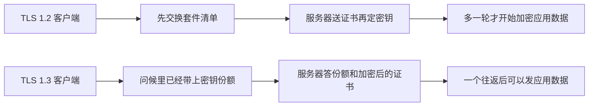

# 从 SSL 到 TLS 1.3：互联网如何偿还二十年的密码学技术债

1994 年，Netscape 要给 Navigator 里的网页加一把锁。当时的 HTTP 把口令、Cookie 和表单原样放在数据包里，同一段链路上听得见的人就能拿走。Taher Elgamal 在 1995 年到 1998 年做 Netscape 的首席科学家，后来常被称作 SSL 之父。SSL 1.0 没有公开。2.0 在 1995 年 2 月随 Navigator 1.1 发出，问题很快露出来。3.0 在 1996 年 11 月重写。1999 年 1 月，IETF 把修订版定名为 TLS 1.0。

名字换了，记录层里的版本号仍从 SSL 3.0 的 3.0 接着数，TLS 1.0 是 3.1。后面二十年，协议在纸上修了一轮又一轮，网上的旧版本删不干净。BEAST、POODLE、DROWN 各自抓住一块还留在部署里的旧设计。2018 年 8 月的 TLS 1.3 把套件和握手缩短，又发现链路上的中间设备只认识它们见过的字节。

## Netscape 要的是浏览器里的那把锁

同一年夏天，赫尔辛基的 Tatu Ylönen 在解决登录口令被嗅探的事，那条线后来叫 SSH。Netscape 面对的是另一头：浏览器和网站之间的页面。两边都要加密和完整性，接口完全不同。SSL 从第一天就绑在套接字上，上面跑 HTTP，于是有了 HTTPS。服务器拿出一张证书，客户端检查这张证书是不是签给眼前这个名字。通过之后，两边用协商出来的对称密钥保护后面的字节。

2.0 把这几步塞进一个能发货的协议里，也把几处后来拆不掉的债一起发了出去。加密和消息认证共用同一把密钥。消息认证是带秘密前缀的 MD5，长度扩展攻击用得上。握手本身没有被保护：中间人可以把客户端列出的强套件从清单里删掉，双方仍以为谈成了自己看见的那一档。连接结束也没有带认证的关闭信号，攻击者可以把末尾截掉，接收方以为数据就这么多。证书还假定一台机器一个站点。后来一台服务器上挂很多网站，2.0 对不上虚拟主机。

美国当时限制强密码出口。协议里因此留了 40 位一类的出口套件，故意做弱，好让软件能卖到国外。这些套件后来不再是法律要求，却留在实现的菜单上。谁都不想因为少支持一种套件而连不上某台旧服务器。

1996 年 11 月 18 日的 SSL 3.0 是一次重写。Paul Kocher 和 Netscape 的 Phil Karlton、Alan Freier 做的。握手结束时两边对整段对话做一次认证，删套件这种手脚会被 Finished 消息抓住。密钥交换可以走 Diffie-Hellman，不必只靠 RSA 把预主密钥加密送过去。记录层和握手层也分开了。IETF 在 2011 年才把这份 1996 年的稿子收成历史文件 RFC 6101，协议本身早就是事实上的标准。

1999 年 1 月的 RFC 2246 把下一版叫 TLS 1.0，作者是 Tim Dierks 和 Christopher Allen。RFC 写明，和 SSL 3.0 的差别不算戏剧性，但大到两边不能直接互通，不过 TLS 实现可以退回 SSL 3.0。Dierks 后来解释过这次改名：对外它应当是 IETF 自己的协议。版本号仍写作 3.1。从字节上看，TLS 是 SSL 的下一小版。

## 2.0 和 3.0 各自留下什么

SSL 2.0 的问题是结构性的，补丁补不圆，所以后来的版本是重写。它在公开网上又活了很多年，因为旧客户端只会说 2.0，服务器为了“还能连上”就继续答。IETF 在 2011 年 3 月的 RFC 6176 里禁止 TLS 实现再协商 SSL 2.0。从 1995 年发货到这份禁止，过了十六年。禁止写在标准里，不等于每台邮件服务器和每台旧设备都关掉了。2016 年的 DROWN 用的就是还开着的那些口。

SSL 3.0 修好了握手被篡改的那一刀，CBC 和填充还留着。分组密码用 CBC，下一块的初始化向量直接拿上一块密文来当。填充怎么填、填充算不算进 MAC，3.0 的规定很松。这两处在纸上可以争论很久。等到浏览器仍把 3.0 当作失败后的退路，它们就变成能偷 Cookie 的攻击。SSL 3.0 的正式淘汰是 2015 年 6 月的 RFC 7568，紧挨着 POODLE。RC4 是 3.0 里唯一的流密码，用来躲开 CBC，它自己后来也被实用攻击打弱，不能当退路。

TLS 1.1 在 2006 年 4 月的 RFC 4346 里已经规定：CBC 要用显式的初始化向量，不要再链上一块密文。出口套件到这一版也不再允许。TLS 1.2 在 2008 年 8 月的 RFC 5246 里允许 SHA-256，并允许 AES-GCM 这种把加密和认证做在一起的 AEAD。密码学上的替换物，在 BEAST 出现之前就印在 RFC 里。浏览器和服务器仍大量停在 TLS 1.0，因为升版本会碰到不认识新版本号的服务器。

## 三次攻击各拆掉一块旧设计

2011 年 5 月，Thai Duong 和 Juliano Rizzo 发表 BEAST。名字是 Browser Exploit Against SSL/TLS。目标是 SSL 3.0 和 TLS 1.0 在 CBC 下的链式初始化向量。中间人可以让浏览器发出他选定的明文边界，再根据密文猜下一块明文。他们演示的是把 HTTPS 请求里的 Cookie 解出来。浏览器会替页面发出请求，攻击才能把明文边界塞进那些请求里。TLS 1.1 的显式向量能躲开它。当时浏览器还不能把最低版本抬到 1.1，否则一批网站会连不上。临时办法是把记录拆开，让攻击者控制不了明文和分组边界的对齐。协议债先用实现里的绕路垫上。

2014 年 10 月，Bodo Möller、Thai Duong 和 Krzysztof Kotowicz 发表 POODLE，CVE-2014-3566。Padding Oracle On Downgraded Legacy Encryption。SSL 3.0 的 CBC 填充不在 MAC 的保护里，攻击者可以改填充、看服务器是否接受，一次试出一个字节。只停在 SSL 3.0 上的连接当时已经不多。浏览器却有另一段逻辑：连 TLS 1.2 失败，就退到 1.1，再退到 1.0，再退到 SSL 3.0。这段逻辑是为了应付版本不宽容的服务器。有的服务器看到自己不认识的高版本号，不按协议退回到自己会的版本，而是直接断开。浏览器若坚持只试一次，用户会看到网站打不开。于是失败就重试，一次比一次旧。

中间人制造一次失败，就能把两边都会的新版本压到 SSL 3.0，然后用 POODLE 读 Cookie。握手里本来有认证过的版本协商，退路却绕开了它：重试是一次新连接，服务器看到的是客户端“自己”提出的旧版本。Möller 和 Adam Langley 在攻击公开前提出了 TLS_FALLBACK_SCSV。客户端如果是因为失败才退回去的，就在问候里放一个标记。服务器若发现自己其实会更高的版本，就拒绝这次连接。标记要两边都升级才有用。浏览器更直接的动作是关掉 SSL 3.0。Cloudflare 当时的记录是，关掉之后对普通网站影响很小，因为 3.0 已经不是关键路径。2017 年年底，SSL Pulse 上仍有一成以上的站点开着它。

2016 年，Nimrod Aviram 等人在 USENIX Security 上发表 DROWN。Decrypting RSA with Obsolete and Weakened eNcryption。现代浏览器并不去连 SSL 2.0。只要同一把 RSA 私钥还在另一处答 SSL 2.0，比如同一张证书用在邮件端口上，攻击者就可以把那边当成填充预言机，去解 TLS 1.2 用 RSA 传送密钥的握手。论文给出的一般情形是：观察大约 1000 次 TLS 握手，再发起大约 4 万次 SSL 2.0 连接，在亚马逊 EC2 上花约 440 美元、不到 8 小时，解开一次 2048 位 RSA 的 TLS 握手。全网扫描里，约 33% 的 HTTPS 服务器、约 22% 带浏览器信任证书的服务器，因为密钥复用而处于这种协议级风险中。另一条路利用 OpenSSL 从 1998 年留到 2015 年初的一个实现错误，有一台未修补的 SSL 2.0 服务器当预言机时，单颗 CPU 大约一分钟能解开。他们扫到约 26% 的 HTTPS 服务器落在这条上。

DROWN 说明的事情很具体。你在网站上关掉的协议，如果私钥还在别的端口上说，就没有关掉。RSA 密钥传输把“服务器长期私钥”和“这一次会话的秘密”绑在一起。私钥漏了，或者私钥还肯参加一个有漏洞的旧协议，录下来的握手就能被解开。前向保密要的是另一次临时的 Diffie-Hellman，长期密钥只负责签名，不负责拆开预主密钥。

| 攻击 | 公开时间 | 抓住的旧设计 |
| --- | --- | --- |
| BEAST | 2011 年 5 月 | SSL 3.0 和 TLS 1.0 的 CBC，用上一块密文当下一块的初始化向量 |
| POODLE | 2014 年 10 月 | SSL 3.0 的填充不进 MAC，加上浏览器失败后自动退回旧版本 |
| DROWN | 2016 年 | 同一把 RSA 私钥仍在某处答 SSL 2.0，用来解现代 TLS 的 RSA 密钥传输 |

## 旧套件删不掉，是因为失败会自动退回去

套件是一张两边取交集的菜单。客户端列出自己会的，服务器选一个自己也会的。菜单上多留一种弱套件，旧客户还能连。少留一种，只剩那种套件的客户就断。1990 年代的出口套件、CBC 加 HMAC、静态 RSA，都是这样留着的。FREAK 和 Logjam 在 2015 年让人看见，出口级的 RSA 和 Diffie-Hellman 仍能被协商出来，中间人把强套件降到那一档就能攻击。弱选项只要还出现在问候里，就还是攻击面。

版本号也一样。协议设计者以为：客户端报一个更高的版本，服务器不认识就回答自己的最高版本。一批服务器的实现是：看见不认识的版本号就断开。浏览器为了网页还能开，学会了失败后换低版本重试。这就是 POODLE 利用的降级舞。一旦重试存在，攻击者和坏服务器在客户端看来是同一种失败。

删掉一种旧版本，不会在全球同一天生效。PCI 在 2018 年 6 月 30 日之前要求从 TLS 1.0 迁走。2018 年 10 月，Apple、Google、Microsoft 和 Mozilla 一起宣布，2020 年 3 月在浏览器里弃用 TLS 1.0 和 1.1。正式写进标准是 2021 年 3 月的 RFC 8996。从 TLS 1.0 的 1999 年到浏览器默认关掉，大约二十年。这二十年里，纸上的 1.1 和 1.2 已经存在。拖住的是支付终端、旧安卓、企业代理，以及“升级浏览器不能让网站打不开”这条产品约束。

服务器侧的删除也要配对。只关浏览器、不关服务器，旧客户端仍把弱协议留下来给 DROWN 这种跨协议攻击用。只关服务器、不关降级重试，中间人仍能把新客户端按到旧服务器还开着的那一档。SCSV 那种标记是给重试装的报警器。最终起作用的是主要客户端拒绝再发起旧版本，旧版本才从日常流量里消失。

## 1.3 把套件和握手一起缩短

TLS 1.3 由 Eric Rescorla 编辑，2018 年 8 月成为 RFC 8446。工作组把前面几轮攻击对应的结构从菜单里拿掉。

静态 RSA 密钥传输没有了。临时的 Diffie-Hellman 是仅有的密钥交换，长期密钥用来签名。录下来的流量不会因为以后服务器私钥泄露而被整段解开。CBC 加独立 MAC 没有了，只留下 AEAD：AES-GCM、ChaCha20-Poly1305、AES-CCM。压缩没有了，因为压缩再加密会漏长度，CRIME 已经演示过用这个偷 Cookie。重协商没有了。重协商在 2009 年前后出过把攻击者的流量拼进合法握手的问题，修补是 RFC 5746，1.3 选择不再保留这个状态机。

套件的名字也拆开了。TLS 1.2 的套件把密钥交换、对称算法和 MAC 捆成一个标识，比如用 RSA 传密钥、用 AES-CBC、用 SHA。组合一多，弱的那几格就混在强的里面。1.3 的套件只表示 AEAD 和握手用的哈希，例如 `TLS_AES_128_GCM_SHA256`。密钥交换改到扩展里单独谈：客户端在第一条消息里就放上自己的密钥份额。服务器答自己的一份。少了一整轮“先选算法、再传密钥”的来回，握手可以在一个往返里完成。

第一条消息之后，服务器的证书和后面的握手都是加密的。被动窃听者看不到证书里的站点名从这条握手里明文出现。0-RTT 允许客户端在第一次往返完成之前就带上应用数据，恢复会话时能更快。这部分数据能被重放。协议把风险写在早期数据上，由应用自己决定什么请求可以放进这扇窗。

## 中间盒子只认识它见过的字节

1.3 在密码学上更短，在网上更难发出去。Nick Sullivan 在 2017 年 12 月写过 Cloudflare 的经历：服务器侧已经默认开了 1.3，主流浏览器还不能默认开。挡住的是中间盒，企业代理、杀毒、运营商设备，它们夹在浏览器和网站之间，按自己见过的 TLS 1.2 去解析握手。

版本协商再次撞上不宽容。草稿里客户端如果直接报 TLS 1.3 的版本字节，一批服务器和中间盒会直接断开，不会按协议退到 1.2。David Benjamin 的改法写进了后来的标准：记录层和问候里的旧版本字段固定写成 TLS 1.2 的 `0x0303`，真正的版本放进 `supported_versions` 扩展。会 1.3 的服务器认得这个扩展。只会 1.2 的服务器忽略不认识的扩展，仍按 1.2 回答。这是把“报一个更高的版本号”从明文的老字段里挪走。老字段继续说一个中间盒认得的数字。

只改版本号不够。1.3 删掉的 ChangeCipherSpec、空的会话标识和压缩字段，对中间盒却是“这是不是 TLS”的特征。Facebook 的 Kyle Nekritz 提出让 1.3 在线上看起来像一次 TLS 1.2 的会话恢复。RFC 8446 附录 D.4 把它写成中间盒兼容模式：客户端放一个非空的会话标识，双方各发一条没有密码学作用的 ChangeCipherSpec。对端按 1.3 必须忽略这条旧消息。中间盒看见自己认得的序列，就把连接放过去。

扩展编号也会化石化。Cloudflare 转述过 David Benjamin 的发现：RSA 的 BSAFE 库把扩展号 40 用作一个实验功能，TLS 1.3 的密钥共享也用了 40。还在跑这个库的打印机就会拒绝 1.3 的问候。GREASE 是浏览器侧的对策，平时就在问候里插入它并不使用的假扩展号，让对未知扩展不宽容的服务器在真扩展上线之前就暴露出来。

兼容模式没有把 1.3 变回 1.2。密钥交换仍是临时 Diffie-Hellman，证书仍在加密之后，套件仍只有 AEAD。多出来的是几段给旧设备看的外壳。外壳能穿过去的前提是：中间盒只检查形状，不把“我看见的每一个字段”都当成必须按 1.2 语义理解的合同。一旦有人把假的 ChangeCipherSpec 当真，这条兼容又会变成新的债。标准因此要求 1.3 的实现收到它就忽略。

部署现实就压在这两层上。密码学要删掉静态 RSA、链式 CBC 和失败后的降级重试，否则 BEAST、POODLE、DROWN 的结构还在菜单里。全球的握手还要经过不升级的代理和打印机。1.3 的做法是把新语义放进扩展和加密后的握手，把旧字节留在外壳上。债没有在 2018 年 8 月一次性还清。TLS 1.2 仍要留给还不会 1.3 的客户端。还清的方式仍和关掉 SSL 3.0 时一样：主要实现拒绝再提供有问题的选项，旧选项才从交集里消失。

## 参考

- [Transport Layer Security](https://en.wikipedia.org/wiki/Transport_Layer_Security)。SSL 1.0 未公开，2.0 为 1995 年 2 月，Elgamal 与 SSL 3.0 的作者，以及各版本的淘汰时间。
- Tim Dierks、Christopher Allen，[RFC 2246](https://www.rfc-editor.org/rfc/rfc2246)，1999 年 1 月。TLS 1.0 与 SSL 3.0 不能直接互通，版本号写作 3.1。
- Paul Kocher 等，[RFC 6101](https://www.rfc-editor.org/rfc/rfc6101)，2011 年 8 月。作为历史文件收录 1996 年 11 月 18 日的 SSL 3.0。
- [RFC 6176](https://www.rfc-editor.org/rfc/rfc6176)，2011 年 3 月。禁止再协商 SSL 2.0。[RFC 7568](https://www.rfc-editor.org/rfc/rfc7568)，2015 年 6 月。淘汰 SSL 3.0。[RFC 8996](https://www.rfc-editor.org/rfc/rfc8996)，2021 年 3 月。淘汰 TLS 1.0 和 1.1。
- Thai Duong、Juliano Rizzo，[Here Come The Ninjas](https://hpc-notes.soton.ac.uk/talks/bullrun/Beast.pdf)，2011 年 5 月。BEAST，针对 SSL 3.0 和 TLS 1.0 的 CBC。
- Bodo Möller、Thai Duong、Krzysztof Kotowicz，[This POODLE Bites](https://www.bmoeller.de/pdf/ssl-poodle.pdf)，2014 年。CVE-2014-3566，以及失败后降级再连。
- Nimrod Aviram 等，[DROWN: Breaking TLS Using SSLv2](https://www.usenix.org/conference/usenixsecurity16/technical-sessions/presentation/aviram)，USENIX Security 2016。密钥复用、33% 与 22% 的扫描结果，以及约 440 美元的一般攻击成本。
- Eric Rescorla，[RFC 8446](https://www.rfc-editor.org/rfc/rfc8446)，2018 年 8 月。TLS 1.3。附录 D.4 是中间盒兼容模式，`legacy_version` 固定为 TLS 1.2。
- Nick Sullivan，[Why TLS 1.3 isn't in browsers yet](https://blog.cloudflare.com/why-tls-1-3-isnt-in-browsers-yet/)，Cloudflare，2017 年 12 月 26 日。版本不宽容、降级舞，以及让 1.3 在线上看起来像 1.2。
