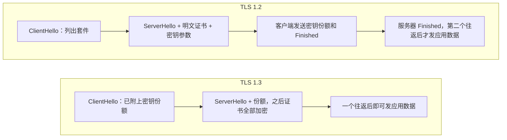

# 从 SSL 到 TLS 1.3：互联网如何偿还二十年的密码学技术债

2016 年 9 月底，IETF 的 TLS 工作组邮件列表上来了一封不寻常的信。写信的人叫 Andrew Kennedy，在美国金融服务圆桌会议的技术政策部门 BITS 工作，他说自己代表美国前 150 家金融机构里的大约 100 家。信的主题是“业界对 TLS 1.3 的担忧”：新协议准备删掉 RSA 密钥交换，而银行内部大量依赖“带外解密”，也就是把服务器私钥交给监控设备，被动地解开内网里所有的 TLS 流量，用来做入侵检测、防数据泄露，以及监督受监管员工的通讯。他请求工作组推迟定稿（[原邮件](https://mailarchive.ietf.org/arch/msg/tls/KQIyNhPk8K6jOoe2ScdPZ8E08RE)）。

伦敦大学皇家霍洛威学院的密码学家 Kenny Paterson 回得很短（[存档](https://tlseminar.github.io/tls-13/)）：

> 我对你这个请求的看法是：不。
>
> 理由：我们在努力建设一个更安全的互联网。
>
> 顺便说一句，你来得有点晚。打个比方，派对已经到了清空烟灰缸、到处找还没喝完的啤酒罐的阶段。准确地说，我们已经到了第 15 版草稿，RSA 密钥传输大约十几版之前就从规范里消失了。我知道银行业一向起步慢，但这次也太离谱了。

这封回信很快在圈子里传开。它不光是一次拒绝：Paterson 自己就是过去十年里好几次攻破 TLS 的人之一，他说“不”的时候，背后压着二十多年的教训。把一个协议里的旧东西删掉为什么这么难，TLS 1.3 又为什么非删不可，要从 1994 年一个浏览器想给网页加一把锁讲起。

## 在有锁之前：明文的 Web（1993–1994）

1993 年，伊利诺伊大学的 NCSA 发布了 Mosaic 浏览器，Web 第一次对普通人变得好用。第二年 4 月，Mosaic 的作者之一 Marc Andreessen 和 SGI 的创始人 Jim Clark 在山景城成立了一家公司，很快改名叫 Netscape。

那时的 HTTP 是纯明文。口令、Cookie、表单内容原样放在 TCP 包里，同一段链路上任何一台能抓包的机器都看得见。如果要让人在网上填信用卡号，这件事必须先解决。

最早动手的并不是 Netscape。1994 年 6 月，硅谷一家叫 EIT 的公司的 Eric Rescorla 和 Allan Schiffman 为商业联盟 CommerceNet 写出了 S-HTTP 的第一版，12 月发成 IETF 草稿（[S-HTTP 草稿](https://datatracker.ietf.org/doc/html/draft-ietf-wts-shttp-01.txt)）。S-HTTP 的思路是在 HTTP 这一层给每条消息签名、加密，像给每封信单独封口。Netscape 选了另一条路：不管上面跑的是什么协议，直接在套接字这一层把整条连接包起来。这就是 Secure Sockets Layer，“安全套接字层”。

两条路打了一阵，套接字那条赢了，原因很朴素：它对上层透明，HTTP 几乎不用改，后来 SMTP、IMAP、FTP 也都能套上。S-HTTP 直到 1999 年才以“实验性”的身份发成 RFC 2660，那时已经没人用了。很多年后，当年写 S-HTTP 的 Rescorla 成了 TLS 1.3 的编辑，这是后话。

## 十分钟就被破掉的 SSL 1.0

Netscape 内部先做出了 SSL 1.0，主要设计者是 Kipp Hickman。它从没发布过。Phillip Hallam-Baker 是最早一批做 Web 安全的人，他后来在密码学邮件列表上回忆（[原帖](https://www.mail-archive.com/cryptography@metzdowd.com/msg13141.html)）：

> SSL 的真实历史是：SSL 1.0 烂到 Andreessen 在 MIT 的那次会上介绍它的时候，我和 Alan Schiffman 十分钟就把它破了。

后来整理的资料里提到的问题有两个（[aware7 的回顾](https://aware7.com/the-history-of-ssl-tls-part-2-tls-certificates-2/)）：记录没有序列号，攻击者可以把截下来的包反复重放，接收方分辨不出来；完整性校验和 RC4 流密码的组合有缺陷，攻击者能改动密文里特定位置的明文而不被发现。

Hallam-Baker 那段回忆里还有几句更刻薄的话：SSL 2.0 好了一点，但做它的人没有一个受过正规的安全训练；他还告诉过 Netscape 他们的随机数生成器设计有问题，对方答应修，结果没修。最后这一句，一年后会以一种很难看的方式应验。

## SSL 2.0 和 40 位的出口版（1995）

1995 年初，SSL 2.0 随 Netscape Navigator 1.1 发了出去。4 月，Hickman 把规范写成了一份 IETF 草稿，署名里还有 Netscape 刚请来的首席科学家 Taher Elgamal（[draft-hickman-netscape-ssl-00](https://datatracker.ietf.org/doc/html/draft-hickman-netscape-ssl-00.txt)）。Elgamal 是 ElGamal 加密和签名算法的发明者，后来常被称作“SSL 之父”。

SSL 2.0 的骨架今天仍然认得出来：服务器出示一张证书，客户端检查它是不是签给眼前这个名字的；双方协商出一把对称密钥，保护后面所有字节。但它也把一串后来拆不掉的问题一起发了出去（IETF 后来在 [RFC 6176](https://www.rfc-editor.org/rfc/rfc6176) 里列过其中几条）：

- 消息认证用的是 MD5，而且认证和加密用同一把密钥，出口版把加密削弱到 40 位，认证也跟着变弱。
- 握手本身没有被保护。中间人可以把客户端列出的强密码套件从清单里删掉，双方都以为自己谈成了对方能接受的最好一档。
- 连接结束时没有带认证的关闭信号。攻击者截掉末尾的包，接收方会以为数据就这么多。
- 一个 IP 只能对应一张证书，没法在一台服务器上用不同证书托管多个 HTTPS 网站。

还有一个问题不在协议里，在华盛顿。当时美国把强密码当作军需品管制出口。Netscape 想把浏览器卖到国外，就得做一个“国际版”：RC4 的密钥只有 40 位是保密的，其余部分明文发送。政府的算盘是，40 位对情报机构来说轻而易举，对业余爱好者来说足够结实。

1995 年 7 月 17 日，密码朋克邮件列表上的 Hal Finney 发了一个挑战：他用国际版 Netscape 做了一次加密的会话，把截获的数据公开，看谁能解出来。列表上马上有人组织分布式破解，但正赶上暑假，协调了两个星期还没开跑。法国 INRIA 的研究员 Damien Doligez 等得不耐烦了，数了数自己能用的机器，发现 15 天之内一定能扫完整个密钥空间，于是自己动手。他在 INRIA、巴黎综合理工和巴黎高师调动了大约 120 台工作站和几台并行机，扫到一半多一点的时候，第 8 天，找到了密钥 `7e f0 96 1f a6`。8 月 15 日他发了公告，最后一段写（[原公告](https://pauillac.inria.fr/~doligez/ssl/announce-rev.html)）：

> 很多人都能拿到我用的这么多算力。可出口版 SSL 本来应该弱到政府能轻易破解，同时又强到能挡住业余爱好者。它在第二点上失败了。别把你的信用卡号交给这个协议。

同一天，另一组人 David Byers 和 Eric Young 也宣布破解了同一个密钥。Doligez 在后来的“虚拟记者会”里说，他们其实比他早两个小时找到答案，只是他们当时在“测试”程序，从密钥空间的另一头扫起，几乎扫到最后才碰上（[Doligez 的问答](http://pauillac.inria.fr/%7Edoligez/ssl/press-conf.html)）。

## 秒表、进程号和第一个漏洞赏金（1995 年秋）

40 位密钥被暴力破解，Netscape 还能推给出口法规。一个月后的事情就推不掉了。

伯克利的两个博士生 Ian Goldberg 和 David Wagner 手工反编译了 Netscape 的程序，想看看它的会话密钥是怎么生成的。结果让人哭笑不得：随机数生成器的种子只来自三样东西，当前时间、进程号和父进程号，然后过一遍 MD5（[他们在 Dr. Dobb's 上的文章](https://people.eecs.berkeley.edu/~daw/papers/ddj-netscape.html)）。

在同一台 Unix 机器上有账号的攻击者，用 `ps` 就能看到进程号；抓包工具会记下每个包的时间戳，秒数也就知道了。剩下的只有微秒，一百万种可能。他们在一台 HP 712/80 上试完所有可能只要大约 25 秒。没有账号的攻击者也不难：父进程号经常就是 1，进程号可以从 sendmail 退信的 Message-ID 里推出来。国内版号称的 128 位安全，实际剩下不到 47 位的不确定性。更要命的是，这个缺陷对 40 位的国际版和 128 位的国内版同样有效。

文章结尾有一段话颇为刺耳：RSA 公司的 Jim Bidzos 说，他在 Netscape 首次发布前主动提出帮忙审查安全设计，被拒绝了；“这回是他们来求我们审了”。

Netscape 很快发了补丁。1995 年 10 月 10 日，它又做了一件当时没人做过的事：宣布“Bugs Bounty”计划，谁在 Navigator 2.0 测试版里找到重大安全漏洞，奖 1000 美元，小一点的漏洞奖 T 恤和咖啡杯（[《时代》周刊的报道](https://time.com/archive/6728064/bugs-bounty/)）。这被公认为软件行业的第一个漏洞赏金。年底颁出的两个 1000 美元大奖，一个给了发现 JavaScript 能偷浏览历史的 Scott Weston，另一个给了斯坦福刚毕业的 Paul Kocher，他发现测量私钥运算花了多长时间，就能把 RSA 和 Diffie-Hellman 的密钥推出来（[TBTF 1995-12-15](https://tbtf.com/archive/1995-12-15.html)）。这就是后来的计时攻击，Kocher 在 1996 年的 CRYPTO 上正式发表（[论文](https://link.springer.com/content/pdf/10.1007/3-540-68697-5_9.pdf)）。

## 浏览器战争里的协议战争：PCT 与 SSL 3.0（1995–1996）

1995 年 9 月 27 日，微软挑了一个很会选的时间点：Netscape 的安全丑闻正热，它和 Visa 联合发布了一套支付标准，同时公开了自己的传输层协议 PCT，Private Communication Technology（[1996 年的电子商务竞争综述](https://reagle.org/joseph/1996/commerce/compete/final.html)）。PCT 的草稿署名是 Josh Benaloh、Butler Lampson、Daniel Simon、Terence Spies 和 Bennet Yee（[draft-benaloh-pct-00](https://www.ietf.org/archive/id/draft-benaloh-pct-00.txt)）。它的记录格式和 SSL 兼容，只把版本号的最高位置 1，服务器看一眼就知道对面说的是哪种协议。草稿开头直接列出它修好的 SSL 缺陷：认证密钥和加密密钥分开，出口版的认证不必跟着变弱；握手里加了一个校验字段，确认明文协商过程没被篡改。草稿里还顺手点了 Netscape 正在做的 SSL 3 一句：它也有类似的机制，但为了完全兼容 SSL 2，攻击者只要改版本号就能让这个机制失效。

Netscape 不愿意让微软拿走标准的主导权，决定自己重写一版。Elgamal 找来 Kocher，加上 Netscape 自己的工程师 Alan Freier 和 Phil Karlton，从头设计 SSL 3.0。Kocher 后来回忆，他当时就意识到密码学知识和法律限制都会发生难以预料的变化，所以最看重的是让协议可以演进：算法做成可以替换的“密码套件”，版本号留出协商的余地（[Kocher 的回忆](https://www.paulkocher.com/technicalProjects.html)）。回头看，他说需要的演进比他预想的还多。

1996 年 11 月 18 日定稿的 SSL 3.0，把 2.0 的几处硬伤补上了：握手结束时双方对整段对话做一次认证，删套件的手脚会被 Finished 消息抓住；密钥交换可以走 Diffie-Hellman，不必只靠 RSA 把预主密钥加密送过去；消息认证改成了带密钥的哈希构造；记录层和握手层彻底分开。这份文档在 IETF 那边一直没有正式身份，直到 2011 年才作为历史文件收成 [RFC 6101](https://www.rfc-editor.org/rfc/rfc6101)，而那时它早已是事实标准十五年了。

但 3.0 也留下了两处后来要命的设计。一处是 CBC 模式：每条记录的初始化向量直接拿上一条记录的最后一块密文，攻击者能提前知道。另一处是填充：CBC 需要把明文补齐到分组长度，3.0 对填充内容几乎不做规定，填充也不在消息认证的保护范围里。这两处在纸面上可以争论很久，真正的攻击要等十几年。

## 改名 TLS：一场讨价还价（1996–1999）

业界不想看到协议分裂成两个。Tim Dierks 当时在一家叫 Consensus Development 的小公司，受 Netscape 委托写了 SSL 3.0 的参考实现。他后来在博客里讲了当年的内幕（[Security Standards and Name Changes in the Browser Wars](https://tim.dierks.org/2014/05/security-standards-and-name-changes-in.html)）：他和同事 Christopher Allen 牵头，把 Netscape 和微软的代表请到一起开会，在场的还有当时“还没出名”的 Bruce Schneier，微软那边是 Barbara Fox。会上谈成的条件是：两家都支持由 IETF 接手，在公开的流程里标准化。

交换的代价也谈好了：

> 作为讨价还价的一部分，我们得对 SSL 3.0 做一些修改，免得看起来 IETF 只是给 Netscape 的协议盖个章；我们还得给协议改个名字，理由一样。TLS 1.0 就这么诞生了，它其实是 SSL 3.1。当然，现在回头看，这整件事显得挺傻的。

1999 年 1 月，Dierks 和 Allen 署名的 [RFC 2246](https://www.rfc-editor.org/rfc/rfc2246) 发布，协议名叫 Transport Layer Security。RFC 里写得很老实：TLS 1.0 和 SSL 3.0 的差别“并不戏剧性”，但大到两边不能直接互通。握手里的版本号写作 `3.1`，从字节上看，TLS 就是 SSL 的下一小版。这个编号习惯一直延续下去：TLS 1.1 是 `3.2`，TLS 1.2 是 `3.3`。名字改了，线上的数字没改，这件事二十年后还会回来找麻烦。

一年后的 2000 年 1 月，克林顿政府大幅放宽加密出口管制，零售软件经过一次性审查后可以带任意长度的密钥出口（[美国商务部公告](https://irp.fas.org/news/2000/01/000113-crypto-bxa.htm)）。Netscape 当月就给海外用户推出了 128 位版本（[《纽约时报》](https://www.nytimes.com/2000/01/31/business/worldbusiness/IHT-us-removes-an-encryption-barrier.html)）。法律上，出口级密码从此没有存在的理由。可它们已经写进了成千上万台服务器的配置菜单，没人去删。

## 补丁而不是拆除（1998–2008）

1998 年，贝尔实验室的 Daniel Bleichenbacher 在 CRYPTO 上发表了一种攻击：SSL 用 RSA 传递预主密钥时，用的是 PKCS#1 v1.5 填充。如果服务器在解密后对“填充格式正确”和“格式错误”给出不同的反应，攻击者就可以把它当成一个“预言机”，发送大约一百万条精心构造的密文，一点点逼近明文，最终解出一次会话的预主密钥（[论文](https://archiv.infsec.ethz.ch/education/fs08/secsem/bleichenbacher98.pdf)）。这种攻击后来被叫作“百万消息攻击”。

TLS 的设计者面临一个选择：拆掉 RSA 密钥传输，还是保留它、加对策。他们选了后者。TLS 1.0 要求服务器在填充错误时不要报错，而是随机生成一个假的预主密钥，让握手在后面自然失败，这样攻击者看不出区别。此后每发现一种新的变体，规范里的对策就更复杂一层。到 TLS 1.2 的时候，这一节已经复杂到很少有实现能完全做对。这个选择的代价要到 2017 年才彻底显现。

2002 年，Serge Vaudenay 在 EUROCRYPT 上发表了针对 CBC 填充的“填充预言机”攻击（[论文](https://www.iacr.org/archive/eurocrypt2002/23320530/cbc02_e02d.pdf)）。同一时期，OpenSSL 的开发者 Bodo Möller 写了一份备忘录，指出 SSL 3.0 和 TLS 1.0 里可预测的 CBC 初始化向量是个隐患（[tls-cbc.txt](https://www.openssl.org/~bodo/tls-cbc.txt)），Gregory Bard 随后发了两篇论文论证它可以被利用。

修复很快写进了标准。2006 年 4 月的 TLS 1.1（[RFC 4346](https://www.rfc-editor.org/rfc/rfc4346)）要求每条记录使用显式的随机初始化向量，并且禁止协商出口套件。2008 年 8 月的 TLS 1.2（[RFC 5246](https://www.rfc-editor.org/rfc/rfc5246)），署名是 Dierks 和 Rescorla，允许使用 SHA-256，并引入 AES-GCM 这种把加密和认证做在一起的 AEAD 模式。从密码学上说，后面十年里大部分攻击的解药，2008 年就已经印在 RFC 里了。

另一个在这段时间加进来的东西，后来在完全不同的故事里成了主角。2003 年的 [RFC 3546](https://www.rfc-editor.org/rfc/rfc3546) 定义了 SNI 扩展：客户端在握手的第一条消息里用明文写上自己要访问的域名，这样一台服务器就能按名字挑选对应的证书，解决了 SSL 2.0 起就有的虚拟主机问题。这个明文的域名，后来成了全世界审查设备和企业防火墙最爱读的字段。

纸上的新版本有了，线上却几乎没人用。原因是一个后来被反复提起的词：版本不宽容。协议的设计是，客户端报一个自己支持的最高版本，服务器如果不认识，就回一个自己会的最高版本。可相当一批服务器的实现是：看见不认识的版本号就直接断开连接。浏览器厂商面对的产品约束是“升级浏览器不能让网站打不开”，于是学会了“降级舞”：TLS 1.2 握手失败，就用 1.1 重试，再失败退到 1.0，最后退到 SSL 3.0。这段逻辑让用户无感，也让任何能制造一次连接失败的中间人，都能把两端按回最老的那个版本。

## 攻击变成了演示（2009–2013）

2009 年 8 月，一家叫 PhoneFactor 的小公司的工程师 Marsh Ray 发现了 TLS 重协商里的一个洞：TLS 允许在一条已加密的连接里重新握手，但新握手和旧握手之间没有密码学上的绑定。中间人可以先和服务器建立一条连接，发一段自己的请求，然后把受害者的握手“嫁接”上去，服务器会把攻击者的前缀和受害者的请求当成同一个人发的。Ray 和同事 Steve Dispensa 没有声张，而是悄悄联系了 IETF 和各大厂商，组成一个叫“Project Mogul”的小组商量修法。11 月 4 日，SAP 的 Martin Rex 独立发现了同一个问题，并直接发到了 IETF 的公开邮件列表上，秘密行动只好提前公开（[LWN 的报道](https://lwn.net/Articles/362234/)，[PhoneFactor 的论文](http://ww1.prweb.com/prfiles/2009/11/05/104435/RenegotiatingTLS.pdf)）。修补方案在 2010 年 2 月成为 [RFC 5746](https://www.rfc-editor.org/rfc/rfc5746)。

2011 年 9 月 23 日，布宜诺斯艾利斯的 Ekoparty 安全会议上，越南研究员 Thai Duong 和阿根廷研究员 Juliano Rizzo 演示了一个叫 BEAST 的工具，全称是 Browser Exploit Against SSL/TLS（[论文](https://hpc-notes.soton.ac.uk/talks/bullrun/Beast.pdf)）。观众等了一个小时，演示开始：他们用一个 Java 小程序让 Firefox 反复向 PayPal 发请求，控制明文在分组里的对齐位置，再利用 TLS 1.0 可预测的初始化向量逐字节猜测，不到三分钟就拿到了完整的 PayPal 会话 Cookie（[卡巴斯基的现场记录](https://securelist.com/the-ssl-sky-is-falling/31376/)）。

Google 的 Adam Langley 当天写了一篇博客泼冷水：Duong 和 Rizzo 并没有发现 TLS 的新缺陷，他们只是给一个有将近十年历史的老问题做出了具体的攻击演示（[Chrome and the BEAST](https://www.imperialviolet.org/2011/09/23/chromeandbeast.html)）。解药 TLS 1.1 早就有了，可浏览器不敢把最低版本抬到 1.1，否则一批网站会打不开。OpenSSL 早年有过一个对策，在每条记录前插一条空记录打乱初始化向量，结果一些有 bug 的实现处理不了空记录，只好关掉。Chrome 和 Firefox 最后采用了“1/n−1 拆分”：把每条记录的第一个字节单独拆成一条记录发出去，让攻击者无法控制分组对齐。协议的债，先用实现里的绕路垫上。

当时另一个流行的对策是干脆不用 CBC，改用 RC4 流密码。Google 自己的服务器很早就优先选 RC4。这条退路很快也被堵死。2012 年，Duong 和 Rizzo 又在 Ekoparty 上演示了 CRIME：TLS 层的压缩会让密文长度随明文内容变化，攻击者反复猜测 Cookie 的内容，看哪次压缩得更短，就能把 Cookie 一个字符一个字符地试出来。2013 年 2 月，皇家霍洛威学院的 Nadhem AlFardan 和 Kenny Paterson 发表了 Lucky Thirteen：即使按照 RFC 的建议仔细处理 CBC 填充，MAC 校验花的时间仍然会随填充长度有细微差别，名字里的“13”来自 TLS 计算 MAC 时带上的 13 字节头部（[Lucky 13](https://isg.rhul.ac.uk/tls/Lucky13.html)）。一个月后，同一个团队和 Daniel Bernstein 等人一起发表了 RC4 密钥流的统计偏差，给出了在足够多的连接里恢复明文的实用攻击（[RC4 in TLS](https://www.isg.rhul.ac.uk/tls/)）。

到 2013 年春天，一个 TLS 1.0 的部署者会发现自己两头落空：CBC 套件有 BEAST 和 Lucky 13，RC4 有统计偏差，真正干净的 AES-GCM 只存在于 TLS 1.2 里，而大部分客户端还不支持 1.2。RC4 最终在 2015 年 2 月被 [RFC 7465](https://www.rfc-editor.org/rfc/rfc7465) 禁止。

### 另一半信任：证书颁发机构

加密再强，如果证书是假的，也只是和攻击者安全地通话。TLS 把“对面是谁”这件事外包给了几百家证书颁发机构（CA），浏览器信任其中任何一家签出的任何域名的证书。

2011 年 3 月，一个自称“ComodoHacker”的伊朗黑客入侵了 Comodo 的一家代理商，签出了 Google、Yahoo、Skype 等网站的假证书。同年夏天，同一个人攻破了荷兰的 CA DigiNotar。7 月 10 日，一张 `*.google.com` 的通配符假证书被签了出来。8 月底，一位伊朗的 Gmail 用户在 Google 的论坛上发帖，说 Chrome 对他访问的 Google 给出了证书警告。Chrome 里内置了 Google 自己域名的证书“钉扎”，假证书再合法，公钥对不上也会报警。事后安全公司 Fox-IT 的调查显示，DigiNotar 一共被签出了 531 张假证书；从它的在线证书状态服务器日志看，大约 30 万个不同的 IP 用这张假证书访问过 Google，其中超过 99% 来自伊朗（[Fox-IT 中期报告](https://www.sec.gov/Archives/edgar/data/1044777/000119312511241796/dex992.htm)，[BBC](https://www.bbc.com/news/technology-14802673)）。几周之内，各大浏览器把 DigiNotar 整个移出信任列表，这家公司 9 月申请破产。

这次事件催生了 Google 的 Ben Laurie、Adam Langley 和 Emilia Käsper 设计的证书透明度（Certificate Transparency），2013 年 6 月发布为 [RFC 6962](https://www.rfc-editor.org/rfc/rfc6962)：每张证书都必须记进公开的、只能追加的日志，任何人都能查到某个域名被签出过哪些证书。几年后正是这套日志暴露了赛门铁克旗下 CA 的一连串违规签发。2017 年 9 月 Google 宣布分阶段停止信任赛门铁克的证书，Chrome 70 在 2018 年 10 月完成最后一步（[Google 安全博客](https://security.googleblog.com/2017/09/chromes-plan-to-distrust-symantec.html)）。一度是全球最大 CA 的赛门铁克，把证书业务卖给了 DigiCert。

## 斯诺登、goto fail 和心脏出血（2013–2014）

2013 年 9 月 5 日，《卫报》《纽约时报》和 ProPublica 根据斯诺登泄露的文件，同时披露了 NSA 一个叫 BULLRUN 的项目：它的目标是破解或绕过互联网上广泛使用的加密，手段包括影响标准、在商业产品里植入弱点（[《卫报》](https://www.theguardian.com/world/2013/sep/05/nsa-gchq-encryption-codes-security)）。文件里暗示的一个对象，是 NIST 标准里一个叫 Dual_EC_DRBG 的随机数生成器，密码学界从 2007 年起就怀疑它有后门。12 月 20 日，路透社报道，NSA 曾付给 RSA 公司 1000 万美元，让 Dual_EC 成为它的 BSAFE 加密库的默认随机数生成器（[路透社](https://www.reuters.com/article/world/exclusive-secret-contract-tied-nsa-and-security-industry-pioneer-idUSBRE9BJ1C5/)）。RSA 的回应被媒体形容为“不否认的否认”。

第二年，一组学者专门研究了 Dual_EC 在 TLS 实现里到底有多好利用（[On the Practical Exploitability of Dual EC in TLS Implementations](https://dualec.github.io/)）。他们发现，TLS 握手里公开的随机数本来不够长，攻击者要多花不少算力；但 BSAFE 里实现了一个非标准的 TLS 扩展，叫 Extended Random，它让服务器在握手里多吐出一段随机字节，能把攻击加速到最多 65000 倍。这份扩展草稿是 2008 年应美国国防部的要求写的。它在 BSAFE 里用的扩展编号是 40。记住这个数字。

IETF 的反应是在 2014 年 5 月发布 [RFC 7258](https://www.rfc-editor.org/rfc/rfc7258)，标题只有一句话：“大规模监控是一种攻击”。此后所有 IETF 协议的设计，都要把大规模被动监听当作威胁模型的一部分。这份文件是后来 TLS 1.3 拒绝银行请求的底气之一。

与此同时，TLS 的实现一个接一个出事。

2014 年 2 月 21 日，苹果发布了一个安全更新，修的是 iOS 和 OS X 里 TLS 库的一个漏洞。Adam Langley 第二天在博客上把出问题的代码贴了出来（[Apple's SSL/TLS bug](https://www.imperialviolet.org/2014/02/22/applebug.html)），整个行业都看呆了：

```c
if ((err = SSLHashSHA1.update(&hashCtx, &serverRandom)) != 0)
    goto fail;
if ((err = SSLHashSHA1.update(&hashCtx, &signedParams)) != 0)
    goto fail;
    goto fail;
if ((err = SSLHashSHA1.final(&hashCtx, &hashOut)) != 0)
    goto fail;
```

多复制了一行 `goto fail`。第二行不属于任何 `if`，无条件跳到函数末尾，而此时 `err` 的值是 0，表示“成功”。结果是服务器对密钥交换参数的签名从来不会被真正检查，攻击者拿着一张合法证书、用随便什么私钥签名，客户端都照单全收。这个漏洞后来就叫“goto fail”。一个月后，GnuTLS 被发现有一个同样性质的证书校验错误。

4 月 7 日，更大的一个来了。Google 的 Neel Mehta 和芬兰安全公司 Codenomicon 几乎同时独立发现了 OpenSSL 的一个漏洞。OpenSSL 发布安全公告的同一天，Codenomicon 上线了一个网站，给这个漏洞起了名字，还配了一个滴血的心形标志：Heartbleed（[heartbleed.com](https://heartbleed.com/)）。漏洞在 OpenSSL 对 TLS 心跳扩展的实现里：对方发来一个心跳请求，声明“我的载荷有 N 字节，请原样返回”，OpenSSL 没有检查 N 是否等于实际收到的长度，就从内存里拷 N 字节发回去。每次最多能多读出 64KB 的服务器内存，里面可能有别人的 Cookie、口令，甚至服务器的私钥，而且不留任何日志痕迹。xkcd 当周就画了一幅漫画，把原理讲得连小孩都懂（[xkcd 1354](https://xkcd.com/1354/)）。Netcraft 估计，当时约 17.5% 使用受信任证书的 HTTPS 站点开着心跳扩展，大约 50 万张证书面临私钥泄露的风险（[Netcraft](https://www.netcraft.com/blog/half-a-million-widely-trusted-websites-vulnerable-to-heartbleed-bug)）。

漏洞的来历很快被翻了出来。提交这段代码的是德国明斯特应用技术大学的 Robin Seggelmann，他同时也是心跳扩展 RFC 的作者之一；代码由 OpenSSL 核心开发者 Stephen Henson 审阅后合入，提交时间是 2011 年 12 月 31 日，跨年夜的午夜前（[提交记录](https://github.com/openssl/openssl/commit/bd6941cfaa31ee8a3f8661cb98227a5cbcc0f9f3)）。Seggelmann 对《卫报》说，这只是一个疏忽，和日期无关，代码写了好几周，碰巧在新年前提交而已（[《卫报》](http://www.theguardian.com/technology/2014/apr/11/heartbleed-developer-error-regrets-oversight)）。

真正让人震惊的是 OpenSSL 的处境。OpenSSL 基金会的 Steve Marquess 在漏洞公开几天后写了一篇长文（[Of Money, Responsibility, and Pride](http://veridicalsystems.com/blog/of-money-responsibility-and-pride/)）：这个支撑着互联网大半加密流量的项目，每年收到的直接捐款大约只有 2000 美元；全职投入的只有 Stephen Henson 一个人，他的收入还不到 Marquess 自己做普通咨询的五分之一。“应该至少有半打全职成员，而不是一个”，他写道，“我说的就是你们，财富 1000 强公司……你们知道自己是谁。”媒体给这件事起了个标题：“互联网是由两个叫 Steve 的人保护的”。

后果来得很快。4 月底，Linux 基金会牵头成立了核心基础设施计划，由各大公司出钱资助 OpenSSL 这类关键开源项目。OpenBSD 的 Theo de Raadt 带人把 OpenSSL 分叉出来，4 月 22 日宣布名字叫 LibreSSL，第一周就删掉了九万行 C 代码，包括对 VMS、经典 Mac OS、OS/2 和 16 位 Windows 的支持（[ZDNet](https://web.archive.org/web/20140421235922/http:/www.zdnet.com/openbsd-forks-prunes-fixes-openssl-7000028613/)）。6 月 20 日，Google 宣布了自己的分叉 BoringSSL，由 Adam Langley 负责，明确表示不保证 API 稳定、不打算取代 OpenSSL，只是为了统一 Google 内部堆积多年的补丁（[The Hacker News](https://thehackernews.com/2014/06/google-unveils-boringssl-another-flavor.html)）。BoringSSL 后来成了 Chrome 和 Android 的 TLS 实现，也是 TLS 1.3 很多兼容性实验的试验场。

## POODLE：降级舞跳到了头（2014 年秋）

2014 年 10 月 14 日，Google 的 Bodo Möller、Thai Duong 和 Krzysztof Kotowicz 发表了 POODLE，全称 Padding Oracle On Downgraded Legacy Encryption（[This POODLE Bites](https://www.bmoeller.de/pdf/ssl-poodle.pdf)，CVE-2014-3566）。它攻击的是 SSL 3.0：3.0 的 CBC 填充不在 MAC 保护之内，内容几乎可以随便写，攻击者改动最后一块、看服务器接受还是拒绝，平均 256 次请求就能解出一个字节的 Cookie。

2014 年还只会说 SSL 3.0 的客户端和服务器已经很少了。POODLE 真正利用的是前面说的降级舞：中间人故意让 TLS 握手失败几次，浏览器就会一路退到 SSL 3.0，然后攻击开始。握手里其实有经过认证的版本协商，但退路绕开了它，因为每次重试都是一条全新的连接，服务器看到的是客户端“自己”提出的旧版本。

Möller 和 Langley 在攻击公开前就准备了一个对策，叫 `TLS_FALLBACK_SCSV`：客户端如果是因为失败才降级重试的，就在问候里放一个特殊的标记；服务器如果发现自己其实支持更高的版本，就拒绝这次连接（后来成为 [RFC 7507](https://www.rfc-editor.org/rfc/rfc7507)，Langley 的解释见 [POODLE attacks on SSLv3](https://www.imperialviolet.org/2014/10/14/poodle.html)）。但标记要两端都升级才有用。浏览器更干脆的做法是直接关掉 SSL 3.0，影响出乎意料地小。IETF 在 2015 年 6 月的 [RFC 7568](https://www.rfc-editor.org/rfc/rfc7568) 里正式宣布 SSL 3.0 退役。尽管如此，到 2017 年年底，SSL Pulse 统计的站点里仍有超过一成开着它（[Cloudflare](https://blog.cloudflare.com/why-tls-1-3-isnt-in-browsers-yet/)）。

## 出口密码的回旋镖（2015–2016）

1990 年代为了出口而故意做弱的密码套件，法律上 2000 年就没用了，却一直留在服务器的菜单里。2015 年，它们一个接一个被翻了出来。

2015 年 3 月，INRIA、微软研究院和 IMDEA 的一个团队发表了 FREAK。他们本来在用形式化方法测试各种 TLS 实现的状态机，发现 OpenSSL 和苹果的客户端有一个 bug：即使自己没有请求出口套件，只要服务器发来一个 512 位的出口级 RSA 临时密钥，它们也会接受。中间人只要在问候里把套件换成出口版，再把那个 512 位密钥分解掉，就能冒充服务器。更糟的是，Apache 的 mod_ssl 默认在启动时只生成一个出口 RSA 密钥，之后一直复用，攻击者有好几个小时甚至几天去分解它。宾夕法尼亚大学的 Nadia Heninger 在亚马逊云上跑数域筛法，分解一个这样的密钥大约 7.5 小时、花 104 美元。受影响的网站里有 nsa.gov、whitehouse.gov、irs.gov，还有 FBI 的线索举报网站。Johns Hopkins 的 Matthew Green 给他的博客文章起了个标题：“分解 NSA，图个乐子”（[Attack of the week: FREAK](https://blog.cryptographyengineering.com/2015/03/03/attack-of-week-freak-or-factoring-nsa/)）。

两个月后是 Logjam，这次是出口级的 Diffie-Hellman（[weakdh.org](https://weakdh.org/)）。中间人可以把连接降级到 512 位的 DHE_EXPORT，当时前一百万个网站里有 8.4% 受影响。论文还算了一笔更让人不安的账：数域筛法最耗时的一步只取决于那个素数本身，而数百万台服务器共用少数几个标准素数。一个有国家级资源的对手，只要花一次大价钱把最常用的那个 1024 位素数“预计算”掉，就能被动解密前一百万个 HTTPS 网站里约 18% 的连接；再破一个，就能拿下 66% 的 VPN 服务器。作者们认为，斯诺登文件里 NSA 对 VPN 的能力，和这个推测吻合。

2016 年 3 月的 DROWN 把 SSL 2.0 也拖了回来（[DROWN](https://www.usenix.org/conference/usenixsecurity16/technical-sessions/presentation/aviram)）。现代浏览器早就不说 SSL 2.0 了，但只要同一把 RSA 私钥还在某个地方响应 SSL 2.0，比如同一张证书用在一台老邮件服务器上，攻击者就能把那边当成 Bleichenbacher 式的预言机，去解开现代 TLS 1.2 里用 RSA 传送密钥的握手。一般情形下，观察大约 1000 次 TLS 握手、发起大约 4 万次 SSL 2.0 连接，在亚马逊云上花约 440 美元、不到 8 小时，就能解开一次 2048 位 RSA 的握手。全网扫描显示，约 33% 的 HTTPS 服务器因为密钥复用而处于风险中。如果对方还跑着 OpenSSL 里一个从 1998 年留到 2015 年初的实现错误，单颗 CPU 一分钟左右就够了。

同一年的 SWEET32 又证明，64 位分组的老算法 3DES 和 Blowfish，在一条足够长的连接里会因为生日悖论而出现分组碰撞，泄露明文（[sweet32.info](https://sweet32.info/)）。2014 年的“三次握手”攻击则利用会话恢复和重协商的组合，让两条本该独立的连接共享同一个主密钥，修补方案是 [RFC 7627](https://www.rfc-editor.org/rfc/rfc7627) 的扩展主密钥。

| 攻击 | 公开时间 | 抓住的旧设计 |
| --- | --- | --- |
| Bleichenbacher | 1998 年 | RSA 密钥传输的 PKCS#1 v1.5 填充，服务器对格式错误的反应不同 |
| 重协商注入 | 2009 年 11 月 | 重新握手和原握手之间没有绑定 |
| BEAST | 2011 年 9 月 | SSL 3.0 和 TLS 1.0 的 CBC 用上一块密文当初始化向量 |
| CRIME | 2012 年 9 月 | TLS 层压缩让密文长度随明文变化 |
| Lucky 13 | 2013 年 2 月 | CBC 先认证后加密，MAC 校验时间随填充变化 |
| RC4 偏差 | 2013 年 3 月 | RC4 密钥流的统计偏差 |
| POODLE | 2014 年 10 月 | SSL 3.0 填充不受 MAC 保护，加上浏览器失败后自动降级 |
| FREAK | 2015 年 3 月 | 512 位出口 RSA，加上客户端的状态机错误 |
| Logjam | 2015 年 5 月 | 512 位出口 DH，以及大量服务器共用少数几个素数 |
| DROWN | 2016 年 3 月 | 同一把 RSA 私钥仍在某处响应 SSL 2.0 |
| ROBOT | 2017 年 12 月 | Bleichenbacher 的对策太复杂，很多实现没做对 |

## 所有人都用上 HTTPS（2015–2018）

漏洞一个比一个吓人的这几年，HTTPS 本身却在迅速普及。一个重要原因是证书变免费了。

2014 年，Mozilla、EFF、密歇根大学、思科和 Akamai 等发起了 Let's Encrypt，目标是做一个免费、自动化的 CA。2015 年 9 月 14 日它签出了第一张证书（[Let's Encrypt](https://letsencrypt.org/2015/09/14/our-first-cert)），12 月 3 日进入公开测试（[Entering Public Beta](https://letsencrypt.org/2015/12/03/entering-public-beta.html)）。EFF 在庆祝文章里写，建一个 CA 要花几十万美元，要做大量安全工作和成堆的文书，还要开“多到不合情理的清晨电话会”（[EFF](https://www.eff.org/deeplinks/2015/09/one-small-certificate-web-one-giant-certificate-authority-web-encryption)）。

据 Mozilla 统计，2015 年年底只有约 40% 的网页加载走 HTTPS（[Mozilla 博客](https://blog.mozilla.org/en/uncategorized/mozilla-supported-lets-encrypt-goes-out-of-beta/)）。浏览器随后开始施压：2018 年 7 月发布的 Chrome 68 把所有 HTTP 页面标成“不安全”（[Chromium](https://www.chromium.org/Home/chromium-security/marking-http-as-non-secure/)）。到 2020 年年底，Let's Encrypt 已经为两亿多个网站签发证书，全球 HTTPS 页面加载的比例升到了 84%（[Linux 基金会](https://www.linuxfoundation.org/resources/case-studies/lets-encrypt)）。

HTTPS 从“电商和银行才用的东西”变成了所有网站的默认，对 TLS 的每一处缺陷的容忍度也跟着降到了零。

## TLS 1.3：先分析，后标准（2014–2018）

TLS 1.3 的工作在 2014 年启动，编辑是 Eric Rescorla，那个 1994 年写 S-HTTP 的人。工作组这次换了一种做法：一边写草稿，一边邀请学术界用形式化工具和密码学证明去分析每一版，发现问题就改，而不是等协议部署了再挨打。2016 年 NIST 一次研讨会上的报告把前几版草稿的改动和攻击一一对上了号：删掉压缩，对应 CRIME；加入会话哈希，对应三次握手攻击；删掉重协商；删掉先 MAC 后加密的 CBC 构造，对应 Lucky 13；删掉 SHA-1 和 MD5 签名，对应 SLOTH（[NIST 报告](https://csrc.nist.rip/groups/ST/ssr2016/documents/presentation-mon-vanderMerwe.pdf)）。密钥派生和握手的设计大量借鉴了 Hugo Krawczyk 和 Hoeteck Wee 的 OPTLS 协议。2016 年 2 月，工作组和研究者专门开了一个叫“TLS Ready or Not?”的研讨会。牛津的 Cas Cremers 等人用 Tamarin 证明器分析第 10 版草稿时，在新加的握手后认证机制里发现了一个攻击，第 11 版就修掉了（[TLSeminar](https://tlseminar.github.io/tls-13/)）。

最后删掉的东西列出来，几乎就是前二十年的攻击清单：

- 静态 RSA 密钥交换没有了，只留临时的（椭圆曲线）Diffie-Hellman。服务器的长期私钥只用来签名，不再用来解开会话密钥。即使私钥以后泄露，录下来的流量也解不开。Bleichenbacher 和 DROWN 这一族攻击从协议里彻底消失。
- CBC 加独立 MAC 没有了，RC4 没有了，只剩 AEAD：AES-GCM、ChaCha20-Poly1305、AES-CCM。
- 压缩、重协商、自定义 DH 群、出口套件，全部删除。
- 套件的含义拆开了。TLS 1.2 的套件把密钥交换、对称算法和 MAC 捆成一个名字，比如 `TLS_ECDHE_RSA_WITH_AES_128_CBC_SHA`，组合一多，弱的那几格就混在强的中间。1.3 的套件只表示 AEAD 和哈希，比如 `TLS_AES_128_GCM_SHA256`，密钥交换和签名算法放到扩展里单独谈。

握手也变短了。客户端在第一条消息里就猜好服务器会用哪种曲线，直接附上自己的密钥份额；服务器回应自己的份额后，双方立刻就能算出密钥，之后的一切，包括服务器证书，都是加密的。完整握手从两个往返减到一个。



恢复会话时，1.3 还允许客户端在第一条消息里就带上应用数据，也就是 0-RTT。这是整个协议里争议最大的一项：0-RTT 的数据可以被攻击者录下来重放，协议只能把风险交给应用自己判断，哪些请求可以放进这扇窗。Paterson 在 2017 年的 PKC 会议上公开表示要为 0-RTT 出问题“接受下注”；负责这份草稿的 IETF 安全领域主管在最后审议时也说，自己对保留 0-RTT “并不特别满意”，但尊重工作组的共识（[最后审议的讨论](https://mailarchive.ietf.org/arch/msg/ietf/FWb1A8muf5SVZ3diOE-nL9PBgPg/)）。

### 叫 1.3，还是叫 TLS 4

改动这么大，还叫“1.3”是不是太谦虚了？2016 年 11 月，在首尔开的 IETF 97 上，工作组主席 Sean Turner 专门主持了一场讨论，选项是保留 TLS 1.3、改叫 TLS 2.0、TLS 2 或者 TLS 4（[讨论帖](https://mailarchive.ietf.org/arch/msg/tls/xtODp8aAREA5Y20MOuAtE41COpc/)）。支持改名的人说，大版本号能让管理层更重视升级；反对的人担心 TLS 2.0 会和 SSL 2.0 混淆。主张 TLS 4 的理由是它比 SSL 3 大，一眼就能看出新旧。有人回帖说，叫 TLS 4 只会让大家永远回答“TLS 3 去哪了”这个问题（[Dave Garrett 的回复](https://mailarchive.ietf.org/arch/msg/tls/-ex9Fwq87Vd7z6zkMgRmkihaMUA/)）。Tony Arcieri 提了一个折中：这一版叫 1.3，下一版直接跳到 TLS 4。12 月，主席们宣布粗略共识：维持 TLS 1.3（[结论](https://mailarchive.ietf.org/arch/msg/tls/EFBmfmeqZUVsA3Io0uvgJBb4yig/)）。

### 银行的请求

回到开头那封信。Kennedy 的请求被拒后，事情并没有结束。2017 年，Matthew Green、Russ Housley 等人提交了一份草稿，提出一个“折中”：服务器在 1.3 里不再每次生成新的 Diffie-Hellman 私钥，而是固定用一把，并把它交给内网的监控设备（[draft-green-tls-static-dh-in-tls13](https://datatracker.ietf.org/doc/html/draft-green-tls-static-dh-in-tls13-01)）。客户端不用改，看起来和正常的 1.3 一模一样，只是前向保密悄悄没了。工作组讨论之后，没有接纳这份草稿。

一年后的 2017 年 12 月，Hanno Böck、Juraj Somorovsky 和 Craig Young 发表了 ROBOT，“Bleichenbacher 预言机威胁的回归”（[robotattack.org](https://robotattack.org/)）。他们发现，1998 年的那个攻击只要稍加变形，仍然能打穿大量 HTTPS 服务器：F5、思科、Citrix 等至少七家厂商的产品中招，Alexa 前 100 名的网站里有 27 个存在受影响的子域名，包括 Facebook 和 PayPal。为了证明，他们用 Facebook 的私钥签了一条消息：“We hacked Facebook with a Bleichenbacher Oracle”。他们的解释很直白：当年设计者决定保留有问题的 RSA 加密模式、加对策，后来对策不完整，又加更复杂的对策，TLS 1.2 规范里这一节已经复杂到没人能写对。他们的建议是：关掉所有 `TLS_RSA` 开头的套件。

这正是 TLS 1.3 已经做了的事。

## 中间盒：生锈的关节（2016–2018）

密码学上，TLS 1.3 更短更干净。可它在真实网络上发不出去。

最初的设计很自然：TLS 1.3 的版本号是 `3.4`，客户端在问候里写上它。到 2016 年中，草稿已经迭代了 15 版，浏览器也已经去掉了不安全的降级重试。大家以为经过 POODLE 的教训，服务器应该都学会了正确处理版本协商。Hanno Böck、Google 的 David Benjamin 和 SSL Labs 的扫描结果泼了一盆冷水：看见 `3.4` 就直接断开的服务器超过 3%。历史在重演（[Cloudflare](https://blog.cloudflare.com/why-tls-1-3-isnt-in-browsers-yet/)）。

David Benjamin 提出的改法进了第 16 版草稿：老的版本字段永远写 TLS 1.2 的 `0x0303`，真正的版本放进一个新的 `supported_versions` 扩展。认识 1.3 的服务器读扩展，只会 1.2 的服务器忽略不认识的扩展，照常按 1.2 回答。

服务器这头解决了，路上的设备又出了问题。2017 年 2 月，Chrome 56 和 Firefox 开始对一部分用户试开 TLS 1.3。马里兰州蒙哥马利县公立学区的一位管理员在 Chromium 的 bug 跟踪系统上报告，学区管理的五万台 Chromebook 里将近三分之一升级后卡在登录界面和“网络不可用”之间反复闪烁，还有部分 Windows 电脑也连不上网（[The Register](https://www.theregister.com/security/2017/02/27/google-chrome-56s-crypto-tweak-borked-thousands-of-computers-using-blue-coat-security/1377432)）。罪魁是学区用来过滤学生上网内容的 Blue Coat 代理，它看到 1.3 的握手不是退回 1.2，而是直接挂断。David Benjamin 说，Blue Coat 几个月前就被告知了 TLS 1.3 的计划，只是没有按说明测试。Google 暂停了推送，通过远程配置在 Chrome 56 上关掉了 1.3（[TechTarget](https://www.techtarget.com/cybersecurity/news/450413934/Chrome-backs-out-of-TLS-13-support-after-proxy-issues)）。

更系统的测量结果同样难看。用第 18 版草稿测，Firefox 连 Cloudflare 时 TLS 1.2 的成功率是 97.8%，1.3 是 96.1%；Chrome 连 Gmail 时，1.2 是 98.3%，1.3 只有 92.3%。企业代理、杀毒软件、运营商设备，都按它们见过的 TLS 1.2 的样子去解析握手。TLS 1.3 删掉的 ChangeCipherSpec 消息、会话 ID 和压缩字段，在密码学上毫无作用，在这些设备眼里却是“这是 TLS”的特征。Cloudflare 的 Nick Sullivan 在总结文章里写了一句后来常被引用的话：在一个有众多实现者的复杂生态里，不用的关节会锈死。

Facebook 的 Kyle Nekritz 提出了最后的解法：让 1.3 在线上看起来像一次 TLS 1.2 的会话恢复。客户端放一个随机的非空会话 ID，双方各发一条毫无意义的 ChangeCipherSpec 消息，对端按 1.3 的规则直接忽略它。BoringSSL 团队和 Facebook 分别做了几个月的实验，最后收敛到同一套改动。在 Chrome 上，1.2 的成功率是 98.6%，改过的 1.3 是 98.8%，终于持平。这套“中间盒兼容模式”进了第 22 版草稿，后来写进 RFC 8446 的附录 D.4。

另一个对策是 Benjamin 的 GREASE（后来成为 [RFC 8701](https://www.rfc-editor.org/rfc/rfc8701)）。既然关节不动就会锈，那就让它一直动：浏览器在每次握手里随机塞进一些没有意义的套件号、扩展号和版本号，逼着服务器和中间盒平时就正确处理“不认识的值”，而不是等到真正的新功能上线才暴露问题。Sullivan 把它比作互联网的 WD-40 防锈油。

但 GREASE 也有照不到的地方。2017 年 12 月，Benjamin 发现有一批打印机拒绝 TLS 1.3 的握手，原因不是它们不认识未知扩展，而是它们认识一个特定的扩展号：40。TLS 1.3 把 40 号分配给了密钥份额扩展，而这些打印机跑着 RSA 的 BSAFE 库，库里的 40 号正是那个和 NSA 后门传闻连在一起的 Extended Random（[Cloudflare](https://blog.cloudflare.com/why-tls-1-3-isnt-in-browsers-yet/)，Matthew Green 的 [The strange story of “Extended Random”](https://blog.cryptographyengineering.com/2017/12/19/the-strange-story-of-extended-random/)）。四年前斯诺登文件里那个隐约的阴影，以一个扩展编号的形式，挡在了新协议的门口。

2018 年 3 月，第 28 版草稿获得批准；8 月，TLS 1.3 发布为 [RFC 8446](https://www.rfc-editor.org/rfc/rfc8446)，编辑是 Eric Rescorla。从第一版草稿算起，走了四年。

## 标准之后：还没删干净的，和最后一块明文（2018–2026）

TLS 1.3 发布两个月后，欧洲电信标准协会 ETSI 发布了一份叫 eTLS 的规范，“企业 TLS”：它就是被 IETF 拒绝的那份静态 Diffie-Hellman 方案，由 BITS 转到 ETSI 推动的（[EFF](https://www.eff.org/deeplinks/2019/02/ets-isnt-tls-and-you-shouldnt-use-it)）。IETF 的安全领域主管正式致函反对它借用 TLS 的名字，ETSI 随后把它改名为 ETS，Enterprise Transport Security（[ETSI 的回函](https://datatracker.ietf.org/liaison/1624/)）。有人专门给它登记了一个 CVE 编号，CVE-2019-9191，描述只有一句：这个协议不提供逐会话的前向保密（[NVD](https://nvd.nist.gov/vuln/detail/CVE-2019-9191)）。EFF 的文章标题是“ETS 不是 TLS，你也不该用它”，文中建议把缩写读作“Extra Terrible Security”，“格外糟糕的安全”。

旧版本的清理仍然缓慢。2018 年 10 月，苹果、Google、微软和 Mozilla 罕见地同时宣布，2020 年上半年在浏览器里停用 TLS 1.0 和 1.1（[Mozilla](https://blog.mozilla.org/security/2018/10/15/removing-old-versions-of-tls/)）。正式写进标准的 [RFC 8996](https://www.rfc-editor.org/rfc/rfc8996) 要等到 2021 年 3 月。从 TLS 1.0 发布算起，二十二年。同年 5 月，QUIC 成为标准，它直接把 TLS 1.3 的握手嵌进了自己的传输层（[RFC 9001](https://www.rfc-editor.org/rfc/rfc9001)），HTTP/3 就跑在上面。

TLS 1.3 加密了证书，但 ClientHello 里的 SNI 仍然是明文，这是最后一块能直接读出“你要去哪个网站”的字段。Cloudflare、Mozilla 等在 2018 年推出了加密 SNI（ESNI）的草案实现。2020 年 7 月 29 日，中国的防火长城开始屏蔽带 ESNI 扩展的 TLS 连接：只要 ClientHello 里出现 `0xffce` 这个扩展号，就丢弃客户端发往服务器的包，所有端口都一样，之后两三分钟里同一个“源 IP、目的 IP、目的端口”组合的连接全部被封（[GFW Report](https://gfw.report/blog/gfw_esni_blocking/en/)）。ESNI 后来演进成加密整个 ClientHello 的 ECH，Encrypted Client Hello。2024 年秋 Cloudflare 开始为免费用户默认启用 ECH，11 月 5 日俄罗斯就开始封锁：检测到 ClientHello 同时带着 ECH 扩展和 Cloudflare 统一使用的外层名字 `cloudflare-ech.com`，就直接丢包（[net4people](https://github.com/net4people/bbs/issues/417)）。ECH 在 2026 年 3 月正式发布为 [RFC 9849](https://www.rfc-editor.org/rfc/rfc9849)。它能把你要访问的网站藏进同一个 CDN 背后的一大群网站里，却藏不住“你在用 ECH”这件事本身。

## 后量子：又一次撑大的问候（2024–）

最新一轮升级是为了一个还不存在的对手。量子计算机如果有一天造出来，能用 Shor 算法破解今天所有的 Diffie-Hellman 和椭圆曲线。“先存下来，以后再解”的攻击意味着，今天录下来的流量，十几年后也许就能被解开。

2024 年 4 月，Chrome 124 在桌面端默认启用了 X25519 和 Kyber768 的混合密钥交换，同年 11 月的 Chrome 131 换成了 NIST 最终标准化的 ML-KEM（[Chrome 平台状态](https://chromestatus.com/feature/5257822742249472)）。混合的意思是两种算法一起用，只要有一种没被攻破，连接就是安全的。代价是 ClientHello 大了一千多字节，第一次超过了一个以太网包的大小。

熟悉的剧情再次上演。有的服务器默认一次 `read()` 就能读到完整的 ClientHello，读不全就断开；有的防火墙在包乱序时处理不了跨包的握手；Fortinet 的流模式深度检测在 Chrome 131 上直接报 `ERR_SSL_PROTOCOL_ERROR`（[Fortinet 社区](https://community.fortinet.com/support-forum-92/err-ssl-protocol-error-on-the-newest-chrome-131-189048)）。Chrome 团队干脆做了一个网站，域名就叫 tldr.fail，意思是“ClientHello 太长了，没读完”，专门解释这个 bug 并提供测试脚本（[tldr.fail](https://tldr.fail/)）。企业可以通过策略临时关掉后量子密钥交换，但 Chrome 已经宣布这个开关会被移除。

这一次，浏览器没有退。据 Cloudflare 统计，2025 年初它看到的人类发起的 HTTPS 流量里，使用后量子密钥交换的约占 29%；9 月苹果在 iOS 26 里默认开启之后，年底升到了 52%（[Cloudflare Radar 2025 年度回顾](https://blog.cloudflare.com/radar-2025-year-in-review/)）。

## 尾声：债是怎么还的

回头看这三十年，同样的剧本反复出现。

新的攻击几乎从来不是全新的发现。BEAST 利用的问题 2002 年就有人写过备忘录，Lucky 13 是 Vaudenay 2002 年攻击的变种，ROBOT 是 Bleichenbacher 1998 年攻击的回归，DROWN 和 FREAK 利用的是法律上 2000 年就该消失的出口密码。解药也往往早就有了：显式初始化向量 2006 年进了 TLS 1.1，AEAD 2008 年进了 TLS 1.2。拖住一切的是部署：版本不宽容的服务器、自动降级的浏览器、不升级的企业代理、跑着十年前加密库的打印机，以及“升级不能让网站打不开”这条产品约束。

债也不是在哪一天还清的。它是一项一项还的：主要的客户端拒绝再提供某个有问题的选项，这个选项才从两端能力的交集里消失。关掉 SSL 3.0 是这样，禁用 RC4 是这样，停用 TLS 1.0 也是这样。TLS 1.3 的办法是把能删的一次删光，把新语义放进扩展和加密后的握手里，只在外面留一层给旧设备看的壳，再用 GREASE 让剩下的关节保持活动。

1994 年，SSL 1.0 在 MIT 的会议上十分钟就被破掉了。2016 年，一封银行的来信请求保留一个能被动解密的后门，得到的回答是“不”。这中间的二十二年，就是互联网为最初那几个仓促决定付的利息。

## 时间线速览

| 年份 | 事件 |
| --- | --- |
| 1994 | Netscape 成立；S-HTTP 第一版；SSL 1.0 在内部被破，从未发布 |
| 1995 | SSL 2.0 随 Navigator 1.1 发布；40 位出口版 8 天被破；Goldberg 和 Wagner 破解 Netscape 随机数；微软发布 PCT；Netscape 推出第一个漏洞赏金 |
| 1996 | SSL 3.0（Freier、Karlton、Kocher）；Kocher 发表计时攻击；IETF 成立 TLS 工作组 |
| 1998 | Bleichenbacher 的百万消息攻击 |
| 1999 | TLS 1.0（RFC 2246），线上版本号 3.1 |
| 2000 | 美国放宽加密出口管制 |
| 2003 | SNI 扩展（RFC 3546） |
| 2006 | TLS 1.1（RFC 4346），显式初始化向量 |
| 2008 | TLS 1.2（RFC 5246），AEAD 和 SHA-256 |
| 2009 | 重协商攻击，Project Mogul |
| 2011 | Comodo 和 DigiNotar 被入侵；BEAST |
| 2012 | CRIME |
| 2013 | Lucky 13；RC4 偏差；斯诺登披露 BULLRUN；RSA 与 Dual_EC 的 1000 万美元；证书透明度（RFC 6962） |
| 2014 | goto fail；Heartbleed；LibreSSL 和 BoringSSL；POODLE；RFC 7258“大规模监控是一种攻击”；TLS 1.3 工作启动 |
| 2015 | FREAK；Logjam；禁用 RC4（RFC 7465）；SSL 3.0 退役（RFC 7568）；Let's Encrypt 签出第一张证书 |
| 2016 | DROWN；SWEET32；银行来信；TLS 1.3 命名之争 |
| 2017 | Chrome 56 的 TLS 1.3 被 Blue Coat 挡住；中间盒兼容模式；BSAFE 打印机；ROBOT；Google 宣布不再信任赛门铁克 |
| 2018 | TLS 1.3（RFC 8446）；Chrome 68 把 HTTP 标为不安全；ETSI 发布 eTLS；四大浏览器宣布停用 TLS 1.0/1.1 |
| 2020 | 防火长城封锁 ESNI |
| 2021 | TLS 1.0/1.1 正式淘汰（RFC 8996）；QUIC 使用 TLS 1.3（RFC 9001） |
| 2024 | Chrome 默认启用后量子混合密钥交换；Cloudflare 启用 ECH，俄罗斯随即封锁 |
| 2025 | Cloudflare 看到的人类流量过半使用后量子密钥交换 |
| 2026 | ECH 成为 RFC 9849 |

## 延伸阅读

正文里的链接都指向原始出处，下面几份值得从头读一遍：

- Tim Dierks，[Security Standards and Name Changes in the Browser Wars](https://tim.dierks.org/2014/05/security-standards-and-name-changes-in.html)，2014。TLS 为什么叫 TLS，当事人讲的。
- Ian Goldberg、David Wagner，[Randomness and the Netscape Browser](https://people.eecs.berkeley.edu/~daw/papers/ddj-netscape.html)，Dr. Dobb's，1996 年 1 月。
- Damien Doligez，[SSL challenge virtual press conference](http://pauillac.inria.fr/%7Edoligez/ssl/press-conf.html)，1995。40 位出口版被破的前前后后。
- Paul Kocher，[Technical Projects](https://www.paulkocher.com/technicalProjects.html)，以及明尼苏达大学查尔斯·巴贝奇研究所的 [Kocher 口述历史](https://conservancy.umn.edu/items/7eeba437-c835-4a4d-a422-c0bc6e203c36)。
- Adam Langley 的博客 [ImperialViolet](https://www.imperialviolet.org/)。BEAST、goto fail、POODLE 等事件，几乎每一次都有他当天写的第一手解释。
- Matthew Green 的博客 [A Few Thoughts on Cryptographic Engineering](https://blog.cryptographyengineering.com/)。FREAK、Dual_EC、Extended Random 的来龙去脉。
- Steve Marquess，[Of Money, Responsibility, and Pride](http://veridicalsystems.com/blog/of-money-responsibility-and-pride/)，2014。Heartbleed 之后 OpenSSL 的处境。
- Nick Sullivan，[Why TLS 1.3 isn't in browsers yet](https://blog.cloudflare.com/why-tls-1-3-isnt-in-browsers-yet/)，Cloudflare，2017 年 12 月。版本不宽容、中间盒和 GREASE。
- Eric Rescorla，[RFC 8446](https://www.rfc-editor.org/rfc/rfc8446)，2018。附录 D 讲向后兼容和中间盒兼容模式。
- David Adrian 等，[Imperfect Forward Secrecy: How Diffie-Hellman Fails in Practice](https://weakdh.org/)，CCS 2015。
- Nimrod Aviram 等，[DROWN: Breaking TLS Using SSLv2](https://usenix.org/conference/usenixsecurity16/technical-sessions/presentation/aviram)，USENIX Security 2016。
- Hanno Böck 等，[ROBOT](https://robotattack.org/)，2017。页面最后的问答很有意思。
- EFF，[ETS Isn't TLS and You Shouldn't Use It](https://www.eff.org/deeplinks/2019/02/ets-isnt-tls-and-you-shouldnt-use-it)，2019。银行那条线后来怎么样了。
- GFW Report，[Exposing and Circumventing China's Censorship of ESNI](https://gfw.report/blog/gfw_esni_blocking/en/)，2020。
