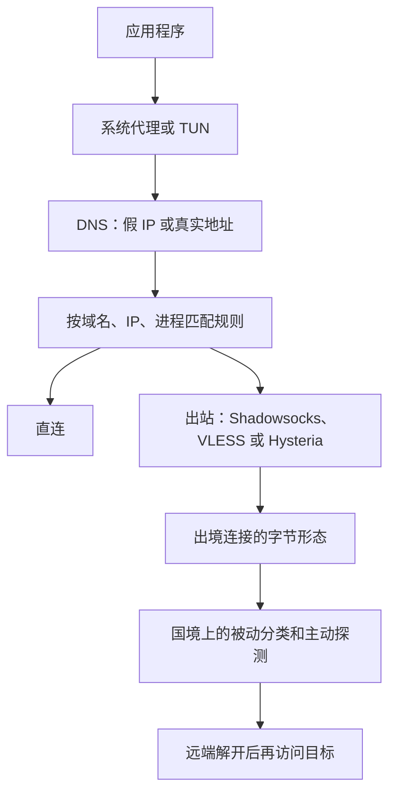

# 代理、TUN 与防火长城：流量为什么越来越像普通 TLS

人们口头说的 VPN，常常是三件不同的事叠在一起。系统代理只改那些愿意读代理设置的程序，浏览器走了，很多命令行和游戏并不走。TUN 是一块虚拟网卡，操作系统把 IP 包送进来，用户态程序再决定往哪转发。OpenVPN、WireGuard 才是把整份 IP 包封装进另一条连接的隧道。Shadowsocks、VMess、Trojan 大多不做这件事。它们更像加密过的 SOCKS：本地拿到一个目标地址，远端替你去连，再把字节搬回来。防火长城盯的是国境链路上这条连接长什么样，不是你的电脑里有没有一块叫 tun0 的网卡。

这篇沿这条缝往下看。先分清代理、隧道和 TUN。再看防火墙公开论文里实际用过的手段：注入 DNS、注入 RST、按首包的随机程度挑连接、再伪装成客户端去探服务器。然后是协议自己的几次转向。2012 年的 Shadowsocks 把流量做成谁也认不出的随机字节。2021 年的测量说明，随机字节本身变成了特征。后来的 Trojan、VLESS 加 TLS、REALITY，都在回答同一个问题：主动连上来的人，应该看见一个网站，而不是一个代理的报错。

在一些国家，未经许可提供或使用穿越审查的通道会碰到法律。下面写的是协议设计和已经发表的测量，不是一份搭建说明。

## 系统代理搬的是连接，TUN 搬的是 IP 包

SOCKS5 和 HTTP CONNECT 是最老的一层。应用程序先连本地代理，说清要去的主机和端口，代理再向外连。加密不是协议的一部分。谁愿意把流量交给它，谁就走得了。不读环境变量、不读系统设置的程序，一个字节都不会进来。

TUN 工作在更下面。内核看到的是一张网卡，写进去的是 IP 包，不是“请连接到某主机的 443 端口”。程序照常做 DNS、照常 `connect`，路由把包送到这块网卡。TAP 更低一层，搬的是以太网帧，虚拟机常用，代理客户端很少用。Clash、sing-box 的 TUN 模式要管理员权限，因为它得改路由。换来的是 UDP、不听话的程序和系统更新都能进同一套规则。

这里有一个 DNS 的坎。应用先把域名解析成 IP，再拿 IP 去连。等包到了 TUN，域名已经丢了，规则若想按域名分流，就只剩 IP。Clash 的 fake-ip 把这件事倒过来：它自己当 DNS，给域名回一个保留地址段里的假 IP，应用连这个假 IP，客户端再查回原来的域名，规则仍然能看见域名。另一种做法是让 DNS 回真实地址，再从 TLS 握手里的 SNI 或 HTTP 的 Host 把域名嗅回来。假 IP 依赖客户端掌控 DNS。嗅探依赖流量里还留着明文的名字。

WireGuard 和 OpenVPN 用 TUN 时，封装的是 IP 包本身。远端解开之后，那些包像是从另一张网卡出去的，应用不需要知道代理的存在。代价是隧道协议有自己的握手。WireGuard 的握手格式固定、消息长度固定，设计目标是又小又好验证，不是让审查者认不出来。它在 2016 年公开，2020 年并进 Linux 5.6。国境上的设备若按这个握手的形状丢包，不需要看里面的 IP。

所以“开一个 VPN”可以指：只给浏览器设 SOCKS；或者建一块 TUN，再把包送进 Shadowsocks；或者建一块 TUN，再送进 WireGuard。三种的失败方式不一样。第一种漏掉不守规矩的程序。第二种的特征在代理协议上。第三种的特征往往在隧道握手上。

## 国境上的设备不必当路由器，也能把连接拆掉

防火长城不是一台机器。2011 年 Xu、Mao 和 Halderman 的测量认为，多数过滤设备在边境自治系统，省级网络里也有卡点。两家主要运营商的放法不一样：一家把设备铺进省网，一家集中在骨干。它坐在流量经过的路径旁边，能看见出境的包，也能把伪造的包注回这条路径。它不一定是唯一的下一跳。所以有时你会先连上，过一小会儿连接被拆掉：真服务器的响应和注入的拆连包在赛跑。

DNS 是最早被写清楚的一种。被点名的域名，伪造的应答会抢在权威服务器前面到达，源地址还伪装成那个权威服务器。客户端若接受先到的答案，就会去连一个错误的 IP。2012 年《The Collateral Damage of Internet Censorship by DNS Injection》记录了这种注入的附带伤害：查询即使不是从中国发起，只要路径穿过注入点，也可能收到假答案。加密 DNS 把查询藏进 TLS 或 HTTPS 之后，这条明文匹配就看不见了。名字若仍出现在 TLS 握手里，防火墙改去看握手。

TCP 载荷里的关键词会触发注入的 RST。连接两端若相信这个 RST，连接就断了。审查设备不必把后续包都丢掉。2012 年 Winter 和 Lindskog 写 Tor 如何被墙时，已经记录了另一手：光看特征还不够，防火墙会自己扮演客户端，去连它怀疑的服务器。服务器若答得像一座桥，地址就进封锁名单。主动探测从那时起就不是 Shadowsocks 专有的遭遇。

SNI 是后来的抓手。TLS 1.2 的 ClientHello 里，服务器名是明文。防火墙不用解密，就能按域名把“去这个站”的连接拆掉，同时放过别的 HTTPS。加密 SNI、再后来的 Encrypted Client Hello，想把这个名字藏进握手。测量里，这类握手本身也可以被单独拿出来重置。名字藏起来之后，审查者还剩下 IP 段、握手的指纹，以及“这串字节像不像已知协议”。

## 随机字节曾经是伪装，后来变成特征

2012 年 4 月 20 日，clowwindy 放出 Shadowsocks。本地是一个 SOCKS5，出去的连接用对称加密裹住目标地址和数据，UDP 也能搬。它比 OpenVPN 小，比 SSH 隧道少一层别人已经写进特征库的横幅。协议故意没有清晰的明文头。链路上看到的是高熵字节。

2015 年 8 月 22 日，作者在 GitHub 上写道：两天前警察来过，要求停止开发；当天又要求把代码从 GitHub 删掉。仓库的 README 换成 “Removed according to regulations.” 8 月 25 日，靠 Google App Engine 做前端的 GoAgent 也被作者删掉。协议本身是公开的，libev、Go、后来的 Rust 实现接了下去。作者没有在运营一条给别人用的服务，删掉的是代码仓库。这件事说明当时的压力落在写协议的人身上，而不只是落在卖 VPN 的公司身上。

Shadowsocks 的弱点也来自“看起来像随机数”。IMC 2020 的测量（Alice 等人，GFW Report）写的是 2019 年 5 月之后的阻断：防火墙先看每条连接第一个数据包的长度和熵，挑出可疑连接，再从大量地址向那台服务器发出探测。探测有重放以前的连接的，也有不同长度的随机字节。服务器若按某种实现的漏洞答了，猜测就被确认。探测是分阶段的，地址很多，但行为像集中调度。论文还提到，政治敏感时段，人为把封锁加重。Shadowsocks 当时挡不住这种“先猜再问”的流程。它和 Tor 的 obfs4 不是同一类：obfs4 把主动探测算进威胁模型，Shadowsocks 早期没有。

ShadowsocksR 是社区的一条分叉，给协议加上混淆插件，想打乱特征、应付探测。主线实现没有把它收进去。额外的握手也带来过安全上的批评，这条分支后来停了。它是“在随机字节外面再套一层伪装”的尝试，不是后来那条“干脆做一次真的 TLS”的路。

2021 年 11 月，被动检测跨过了主动探测。Wu 等人在 USENIX Security 2023 的论文，和 Geneva 项目 2021 年 11 月 14 日的现场记录，说的是同一套系统：防火墙不再先去问服务器，而是实时丢掉“看起来完全加密”的流量。受影响的包括 Shadowsocks、不套 TLS 的 VMess，以及 Obfs4。它并不正面定义什么叫完全加密，而是用粗规则放过不像的流量：已知协议的指纹、置位比例、可打印字符的数量和位置。剩下的就阻断。论文估计，若把这套规则铺开，大约会误伤 0.6% 的普通流量。测量看到它主要用在通往一些常见 VPS 网段的连接上，用来控制误伤。主动探测并没有因此下线。服务器即使不再回答探测，只要字节还像随机数，这条连接仍然可以被掐掉。

这就是 2012 年到 2021 年的转折。把内容加密到认不出协议，曾经能躲开按关键字和按 SSH 横幅的匹配。等审查者改成“不像 TLS、不像 HTTP、不像 SSH 的，就当可疑”，认不出协议变成了阳性特征。

## V2Ray 把一条连接拆成协议和运输两层

V2Ray 在 2015 年前后出现，核心是 VMess。它不是又一版更长的密钥。它把认证、加密、路由和运输拆开。UUID 用来认人，时间戳用来挡重放。早期的 `alterId` 会派生出一批备用身份，后来成为负担，AEAD 落地之后退出了主流。运输层可以是裸 TCP，也可以是 WebSocket、HTTP/2、gRPC，或者基于 UDP 的 mKCP。同一份 VMess 载荷，外面可以长得像一条 WebSocket，也可以只是一串随机字节。2021 年被被动阻断打中的，主要是后面这种。

VMess 自己带加密。套在 TLS 里面时，等于加密了两次。VLESS 把这层拿掉，加密交给外面的 TLS，头部更短，状态更少。2020 年 11 月，XTLS 因为许可分歧被 v2ray-core 移出，RPRX 等人以 V2Ray 为底做了 Xray。随后的客户端多数跟着 Xray 走，VLESS 成了这条线上的默认协议。v2ray-core 仍在，它是平台：入站可以是 SOCKS 或 VMess，出站可以是另一种协议，中间做路由。人们说“用 V2Ray”，有时指这个核心，有时只是指 VMess 这一种协议。

Trojan 大约出现在 2018 年，路子更窄。它就是一次正常的 TLS。口令对了，后面的字节才是代理。口令不对，服务器按普通网站把请求处理掉。主动探测的人没有口令，看到的是网页，不是“协议错误”或一段随机应答。这和 Shadowsocks 对着探测回了不该回的字节，正好相反。

REALITY 是 Xray 在这条路上再走的一步。客户端做 TLS，证书却是另一个真实站点的。双方用预先共享的材料确认自己连的是自己的服务器，而不是那个被借了证书的站点。服务器认不出的握手，原样转给那个真实站点。探测者、以及握到一半就离开的审查设备，拿到的是真实站点的响应。部署者不必单独申请一张会被按域名拉黑的证书。借来的是证书和握手的外观，业务流量并不真正发生在那个站点上。

Hysteria2、TUIC 改的是另一层。它们跑在 QUIC 上，外形接近 HTTP/3。Hysteria 的拥塞控制不按 TCP 那套“看见丢包就退让”来，因为注入的丢包会被损失回避算法当成拥塞，速度会被压到不能用。按配置速率发送，能在有损链路上保住吞吐，也会挤占别的流量。这是对“用丢包来限速”的回应，不是对“随机字节被识别”的回应。两条线经常被装进同一个客户端，解决的不是同一个检测器。

## Clash 决定的是走哪边，不是字节怎么加密

Clash 是 Dreamacro 写的客户端，不是一种新的加密。YAML 里写规则、代理组和出站。一条连接进来，先匹配域名、IP、进程，再选直连、拒绝或某个节点。节点上的协议可以是 Shadowsocks、VMess、Trojan，后来的分支再加上 VLESS 和 Hysteria。规则组可以做手动选择、按延迟挑选、失败再换。对使用者来说，协议的差异被收成节点列表里的一行。

2023 年末原仓库归档，闭源的 Premium 内核也停了。Mihomo（Clash.Meta）把规则引擎接下去，新协议加在这条分支上。sing-box 是另一边的统一核心，入站、出站和 TUN 由同一份配置描述，不把“客户端”和“协议核心”分成 Clash 加 v2ray-core 两个进程。

本地的结构通常是这样：

规则引擎不改变 `wire` 那一跳长什么样。选了一台仍在发随机字节的 Shadowsocks，Clash 的界面一样正常，链路上仍是 2021 年那类检测器要看的东西。选了套在 TLS 里的 VLESS，或者会把未知握手转走的 REALITY，检测器看到的是另一类字节。客户端的分流、订阅和 TUN，解决的是“哪些程序进隧道”。协议解决的是“隧道在国境上像什么”。

## 现在还能对上的，是检测器还在找什么

把公开发表的检测和协议的回答并排放：

| 链路上的形态 | 检测器已经做过的事 | 协议侧的回答 |
| --- | --- | --- |
| 明文 DNS、明文 SNI、SSH 或 VPN 握手 | 按名字注入假答案，按关键字或握手形状注入 RST | 把名字和握手放进别人认得出、又不想误伤的协议里 |
| 高熵、无协议头的字节 | 2019 年起按首包长度和熵挑出来再主动探测；2021 年 11 月起对部分路径直接被动阻断 | 不再把“完全随机”当伪装 |
| 真的 TLS，但口令错了会露出代理行为 | 主动连接，看服务器答的是网页还是一段异常 | Trojan：答非所问就当普通网站 |
| 自签或单独申请的证书 | 按证书里的域名或 IP 段拉黑 | REALITY：外观用别人的证书，认不出的握手转给那个站点 |
| 固定格式的 UDP 握手 | 按握手识别，不必解密 | WireGuard 不躲这个；QUIC 系改去靠近 HTTP/3 |

没有一种形态是终点。被动规则会改，主动探测会换载荷，VPS 网段可以被整段限速，TLS 指纹也可以从“是不是 TLS”细到“像不像某一种浏览器的 ClientHello”。naiveproxy 这类实现走浏览器自己的 TLS 栈，就是在躲最后这一档：密码学上同样是 TLS，字节排列仍可能不像 Chrome。论文里的 0.6% 误伤说明审查者也受约束。规则若把正常 HTTPS 一起打掉，代价会立刻变成自己的网上业务。协议这些年的演化，都是贴着这道约束走的：要躲在审查者不愿意大面积误伤的那一类流量里面，并且在有人假装客户端连上来时，表现得和那一类流量的服务器一样。

## 参考

- Xu、Mao、Halderman，[Internet Censorship in China: Where Does the Filtering Occur?](https://jhalderm.com/pub/papers/china-pam11.pdf)，PAM 2011。多数过滤在边境自治系统，省级网络里也有卡点，两家主要运营商的布放方式不同。
- Anonymous，[The Collateral Damage of Internet Censorship by DNS Injection](https://doi.org/10.1145/2317307.2317311)，ACM CCR 2012。DNS 注入的假应答，以及路径只是穿过注入点时的附带伤害。
- Winter、Lindskog，[How the Great Firewall of China is Blocking Tor](https://www.usenix.org/conference/foci12/workshop-program/presentation/winter)，FOCI 2012。按特征挑连接，再主动扮演客户端去确认。
- Shadowsocks 的发布日见 [Wikipedia 条目](https://en.wikipedia.org/wiki/Shadowsocks)（2012-04-20）。2015-08-22 作者删库的说明，同一条目引用了当天的 GitHub 文字；仓库 README 变为 “Removed according to regulations.”
- Alice、Bob、Carol、Beznazwy、Houmansadr，[How China Detects and Blocks Shadowsocks](https://gfw.report/publications/imc20/data/paper/shadowsocks.pdf)，IMC 2020。首包长度和熵，加上分阶段的主动探测。项目页在 [gfw.report](https://gfw.report/blog/gfw_shadowsocks/en/)。
- Wu、Sippe、Sivakumar、Burg、Anderson、Wang、Bock、Houmansadr、Levin、Wustrow，[How the Great Firewall of China Detects and Blocks Fully Encrypted Traffic](https://www.usenix.org/conference/usenixsecurity23/presentation/wu-mingshi)，USENIX Security 2023。2021 年 11 月起的被动阻断，以及大约 0.6% 的误伤估计。现场记录见 Geneva 项目 [2021-11-14 的说明](https://geneva.cs.umd.edu/posts/fully-encrypted-traffic/en/)。
- [V2Ray](https://en.wikipedia.org/wiki/V2Ray) 与 [Xray-core](https://github.com/XTLS/Xray-core)。2020 年 11 月因 XTLS 的许可分歧分叉；VLESS 把加密交给外层 TLS。
- [Clash](https://github.com/Dreamacro/clash) 原仓库已归档。后续规则引擎在 [mihomo](https://github.com/MetaCubeX/mihomo)。
- WireGuard 于 2020 年并入 Linux 5.6。协议白皮书在 [wireguard.com/papers](https://www.wireguard.com/papers/wireguard.pdf)。握手格式固定，不是为躲避协议识别设计的。
