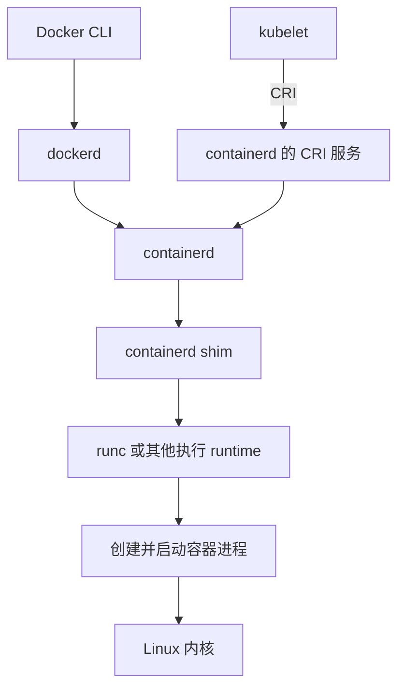

# 容器运行时：从 Docker 到 containerd、gVisor 与 Kata

我们平时启动容器，可能只需要一条 `docker run`。但真正往下看，很快就会遇到一串名字：containerd、runc、CRI-O、OCI、shim、gVisor、Kata……它们看起来都和“运行容器”有关，实际负责的事情却不一样。

理解这些技术，可以围绕一个问题展开：**一个镜像里的程序，是怎样变成宿主机上正在运行、受到隔离和限制的进程的？**

本文先把这条链路讲清楚，再讨论更强的隔离、启动优化和实际选型。主要范围是 Linux 容器；Windows 容器有不同的底层实现，不能直接套用本文的内核机制。资料查阅日期为 2026 年 9 月 25 日，参考资料统一列在文末，正文也保留对应链接。

## 1. 容器里到底装了什么

先区分三个概念。

**镜像（image）**是应用的交付材料，通常包含程序、依赖库、文件系统内容，以及启动命令、环境变量等配置。**容器（container）**是根据镜像和运行参数创建的实例。**容器运行时（container runtime）**负责让这个实例运行起来，并管理相关执行状态。

例如，同一个 Python 镜像可以启动三个容器。它们使用相同的初始文件内容，却可以有不同的进程、网络配置和可写数据。删除容器时，没有放进持久化存储的数据也可能随之消失。[Docker 概念说明](https://docs.docker.com/get-started/docker-overview/)

普通 Linux 容器的应用进程仍由宿主机内核调度。镜像里的 Ubuntu、Alpine，主要提供各自的用户态环境，并不意味着启动了一套独立内核。所以，容器里的发行版可以和宿主机不同，但应用依赖的系统调用仍要由底下的内核支持。

传统虚拟机会再运行一套客户机内核。后面会讲到的 Kata，也利用了这层边界。这意味着“使用容器镜像”和“共享宿主机内核”并不是必须绑定的两件事。[Kata 虚拟化设计](https://github.com/kata-containers/kata-containers/blob/main/docs/design/virtualization.md)

## 2. Linux 如何让进程拥有自己的“小环境”

容器没有依靠某一个神奇的系统调用完成全部工作，而是组合了多种内核能力。

### Namespace：控制看见什么

Namespace 为进程提供隔离的系统资源视图。几个常见类型如下。

| 类型 | 隔离的主要内容 | 直观效果 |
| --- | --- | --- |
| PID | 进程 ID 空间 | 容器里看到的 PID 和宿主机不同 |
| Mount | 挂载点视图 | 容器可以拥有自己的根目录和挂载布局 |
| Network | 网络设备、路由、端口等 | 不同容器环境可以各自监听同一个端口 |
| UTS | 主机名等 | 容器可以有自己的 hostname |
| IPC | 部分进程间通信资源 | 隔离 System V IPC、POSIX 消息队列等 |
| User | 用户和组 ID 映射 | 容器内的 root 可以映射成宿主机普通用户 |

这些边界可以按需共享。使用 host 网络的容器，就不会得到一个独立的网络 namespace。理解容器隔离时，要看实际配置，不能只看“是不是容器”。[Linux namespaces 手册](https://man7.org/linux/man-pages/man7/namespaces.7.html)

### Cgroups：控制能用多少

Namespace 解决资源视图，cgroups 则把进程组织成组，对 CPU、内存、进程数量等资源进行限制和统计。[Linux cgroups 手册](https://man7.org/linux/man-pages/man7/cgroups.7.html)

以 cgroup v2 为例，`cpu.max` 可以限制一段时间内的 CPU 配额，`memory.max` 设置内存硬限制，`pids.max` 限制任务数量。CPU 配额耗尽通常意味着被节流；内存无法在限制内回收时，可能触发该 cgroup 内的 OOM 处理。两者的表现不同，不能统一理解成“超过限制就退出”。[内核 cgroup v2 文档](https://www.kernel.org/doc/html/latest/admin-guide/cgroup-v2.html)

还有一个常见误解：给容器设置相当于一个 CPU 的配额，不等于独占一个物理核心。配额约束的是运行时间；CPU 绑定和独占分配属于另外的配置问题。

### Capabilities、seccomp 和访问控制：控制能做什么

Linux capabilities 把传统 root 权限拆成若干能力，例如某些网络管理操作需要 `CAP_NET_ADMIN`。容器可以只保留应用真正需要的能力。[Capabilities 手册](https://www.man7.org/linux/man-pages/man7/capabilities.7.html)

seccomp 可以限制进程允许发起的系统调用。AppArmor、SELinux 等机制还可以进一步约束资源访问。这些机制共同缩小应用的权限范围，但普通容器仍然共享宿主机内核。尤其是特权模式、敏感宿主目录挂载、运行时管理 socket 暴露，会明显改变隔离效果。[Docker seccomp 文档](https://docs.docker.com/engine/security/seccomp/)、[Docker 安全文档](https://docs.docker.com/engine/security/)

## 3. 镜像如何变成程序看到的文件系统

镜像并不是简单的“一个压缩包”。OCI 镜像用 manifest 关联配置与多个文件系统层；配置记录启动参数等元数据，层记录文件内容的变化。[OCI image manifest](https://github.com/opencontainers/image-spec/blob/main/manifest.md)、[OCI image config](https://specs.opencontainers.org/image-spec/config/)

镜像下载后，还需要被整理成进程能够访问的根文件系统。常见做法是把只读镜像内容和容器自己的可写层组合起来。OverlayFS 就能提供这种合并视图：读取没有修改的文件时使用下层内容，修改下层文件通常涉及 copy-up，把文件复制到上层后再修改。

因此，“只修改了一个大文件里的几个字节”，也可能产生比预期更大的存储开销。数据库等持久化数据通常应放在合适的 volume 或其他持久化存储中，而不是依赖容器可写层。[Docker OverlayFS 说明](https://docs.docker.com/engine/storage/drivers/overlayfs-driver/)

在 containerd 中，负责准备这些文件系统视图的组件叫 **snapshotter**。它与负责执行进程的 runtime 是两个不同扩展点：更换 snapshotter 主要改变存储准备方式，更换执行 runtime 则可能改变隔离方式。[containerd Runtime v2 文档](https://github.com/containerd/containerd/blob/main/docs/runtime-v2.md)

## 4. 为什么 containerd 和 runc 都叫运行时

因为“运行时”在不同语境中覆盖的范围不同。为了方便理解，可以把它们分成两个层次；这是一种工程上的分类，并不是 OCI 对所有项目的正式命名。

| 层次 | 常见项目 | 主要职责 |
| --- | --- | --- |
| 高层管理 | containerd、CRI-O | 镜像、容器生命周期，以及与上层系统对接 |
| 底层执行 | runc、crun | 按运行配置创建隔离环境，启动和控制进程 |
| 开发与管理入口 | Docker、Podman、nerdctl | 提供人更容易使用的命令和工作流 |

### runc 与 crun

`runc` 是按照 OCI Runtime Specification 在 Linux 上创建和运行容器的工具。它接收已经准备好的文件系统和配置，再落实 namespace、资源与权限等设置。你可以直接使用它，但通常还得自己准备上游材料。[runc 项目](https://github.com/opencontainers/runc)

`crun` 是另一个 OCI runtime，使用 C 实现，强调较小的占用和执行效率。两者属于同一层次的可选实现。不过，不能只根据实现语言就断言某个业务一定更快；镜像拉取、存储和应用初始化可能才是主要耗时。[crun 项目](https://github.com/containers/crun)

### containerd 与 shim

在常见的 Linux runc 路径中，containerd 管理镜像和执行任务，通过 shim 调用底层 runtime。shim 作为独立进程维持任务生命周期相关服务，使管理守护进程和容器进程不必完全绑定。

下面画的是调用关系，并不是应用运行时每一次系统调用的经过路径：



shim 与容器的数量关系由实现和分组方式决定，不能固定理解为“一容器一 shim”。同样，容器运行期间不一定有一个长期存活的 `runc` 进程；runc 可以在完成创建或启动操作后退出。[containerd Runtime v2](https://containerd.io/docs/2.3/runtime-v2/)

### Docker、Podman 和 nerdctl

Docker 提供 CLI、API，以及镜像、网络、卷等管理体验；它和 containerd 并不处在完全相同的产品层次。Podman 则采用无需中央常驻管理 daemon 的使用模式，同样依赖 OCI runtime 创建容器，并支持普通用户运行。所谓 daemonless，也不代表容器完全不需要监控或辅助进程。[Docker 架构](https://docs.docker.com/get-started/docker-overview/)、[Podman 文档](https://docs.podman.io/en/latest/)

如果直接使用 containerd，又希望拥有接近 Docker 的命令体验，可以了解 nerdctl。它是 containerd 的客户端，不是新的底层隔离机制。[nerdctl 项目](https://github.com/containerd/nerdctl)

## 5. OCI、CRI、CNI，三个接口各管一段

### OCI：让镜像和执行工具能够配合

OCI 定义了三类核心规范：Image Specification 描述镜像结构，Distribution Specification 描述内容分发协议，Runtime Specification 描述运行配置及生命周期。[OCI 官方介绍](https://opencontainers.org/)

底层 OCI runtime 接收的典型输入是一个 bundle：其中有 `config.json`，以及配置引用的根文件系统。它和注册表里存放的镜像不是同一种形态，中间需要拉取、解包和准备。[OCI bundle 规范](https://github.com/opencontainers/runtime-spec/blob/main/bundle.md)

可以把它理解成：镜像规范负责把材料装好，分发规范负责运输，运行规范负责告诉执行工具如何使用这些材料。

### CRI：让 kubelet 能管理节点上的容器

CRI 是 Kubernetes 的 Container Runtime Interface。kubelet 作为客户端，通过 gRPC 请求 runtime 服务管理 Pod sandbox 和容器，并通过 image 服务管理镜像。containerd 的 CRI 实现和 CRI-O 都可以承担这层工作；runc 单独并不能直接充当 kubelet 的 CRI 服务。[Kubernetes CRI 文档](https://kubernetes.io/docs/concepts/containers/cri/)

CRI-O 专注于 Kubernetes 的 CRI 需求，结合镜像、存储、OCI runtime 和容器监控等组件完成节点上的执行工作。因此，比较 containerd 和 CRI-O 是合理的；把 CRI-O 和 runc 当成完全对应的替代品，就混淆了层次。[CRI-O 项目](https://github.com/cri-o/cri-o)

### CNI：让容器环境连上网络

CNI 是网络配置接口。网络插件可以为容器环境配置接口、地址和路由，并负责相应的清理。它不负责启动业务进程，也不等同于 CRI。[CNI 项目](https://github.com/containernetworking/cni)

所以，可以记住这条简单的关系：**kubelet 通过 CRI 提出运行请求，CRI 实现协调执行和网络准备，OCI runtime 落实进程执行，CNI 插件落实网络配置。** 具体组织方式取决于实现。

## 6. 一个 Pod 是怎样启动的

以使用 containerd 的普通 Linux Kubernetes 节点为例，忽略重试和并行细节后，可以分成几个阶段。

1. **kubelet 收到分配给本节点的 Pod。** 它根据 Pod 配置协调卷、凭据、资源和容器状态。
2. **准备 Pod sandbox。** CRI 实现建立容器组的执行环境，并协调网络配置。
3. **准备业务镜像和根文件系统。** 拉取缺少的内容，创建所需的文件系统快照。
4. **创建并启动容器。** 管理层准备运行配置，通过 shim 和底层 runtime 启动应用。
5. **持续观察状态。** 应用退出后，运行时报告结果；kubelet 根据 Pod 的重启策略等配置继续处理。

这是一条帮助理解的流程，不是所有实现严格遵守的串行时序。[CRI 文档](https://kubernetes.io/docs/concepts/containers/cri/)、[containerd Runtime v2](https://github.com/containerd/containerd/blob/main/docs/runtime-v2.md)

Pod 内的容器共享网络环境，能通过 `localhost` 通信，也可以通过显式配置的卷共享文件。**它们默认不会共享 PID namespace**；共享进程空间需要相应配置。因此，“同一个 Pod 的所有 namespace 都一样”并不准确。[Kubernetes Pods 文档](https://kubernetes.io/docs/concepts/workloads/pods/)

普通 Linux 实现中经常能看到 `pause` 容器，用来支撑 sandbox 的共享 namespace 生命周期。不过，sandbox 是一个抽象概念，其他运行时也可以用虚拟机等方式承载它，不必总是套用 pause 容器的实现模型。

另外，Kubernetes 1.24 移除的是内置 dockershim，改变了与 Docker Engine 对接的方式，并没有让 Docker 构建的标准镜像失效。需要保留 Docker Engine 作为节点执行后端时，可以了解外部适配器 cri-dockerd。[Dockershim 移除 FAQ](https://kubernetes.io/blog/2022/02/17/dockershim-faq/)

## 7. 更强的隔离：gVisor、Kata 与 Firecracker

普通容器适合大量可信应用。如果平台允许不同租户上传代码，或者要执行来源不确定的构建任务、Agent 生成的程序，就需要更认真地考虑内核边界。

### gVisor：在应用和宿主内核之间加入应用内核

gVisor 的 Sentry 在用户态实现 Linux 风格的系统接口，接住应用的系统调用，而不是把应用请求原样转交给宿主内核。它提供名为 `runsc` 的 OCI runtime，可以接入容器工具链。

这种方式减少了应用直接触达宿主内核的机会，但需要考虑接口兼容性，以及频繁系统调用带来的额外开销。它也不能简单理解为“配置更严格的 seccomp”。[gVisor 架构介绍](https://gvisor.dev/docs/)

### Kata：让容器运行在轻量虚拟机里

Kata 把容器工作负载放进轻量虚拟机，通过客户机内核执行应用，并利用硬件虚拟化提供额外隔离。对于 Kubernetes，常见隔离单元是 Pod：同一个 Pod 的多个容器可以位于同一个 VM 中。

它需要管理 shim、虚拟机、客户机内核和 guest agent 等部分，也需要满足宿主机的虚拟化条件。在云主机中部署时，尤其要确认是否支持所需的嵌套虚拟化。[Kata 架构](https://katacontainers.io/software/)、[Kata 虚拟化设计](https://github.com/kata-containers/kata-containers/blob/main/docs/design/virtualization.md)

### Firecracker：负责 microVM 的底层组件

Firecracker 是基于 KVM 的虚拟机监控器（VMM），通过精简设备模型创建和运行 microVM。它可以被容器系统集成，但本身不直接等于 containerd 或 CRI-O，也不会仅凭一个镜像名完成所有镜像和 Pod 管理工作。[Firecracker 项目](https://github.com/firecracker-microvm/firecracker)

所以，这几个项目不全是同层竞争关系。Kata 可以使用不同 VMM；Firecracker 可以作为其中的底层组件。选择时应看整条实现链，而不是只选一个名字。

| 方案 | 主要隔离方式 | 评估时要重点关注 |
| --- | --- | --- |
| runc / crun 普通容器 | 宿主内核提供 namespace、权限等边界 | 权限配置、共享内核风险、节点维护 |
| gVisor / runsc | 用户态应用内核 | 系统接口兼容性、系统调用与 I/O 开销 |
| Kata | 客户机内核与硬件虚拟化 | 虚拟化支持、内存占用、设备与存储接入 |
| 基于 Firecracker 的平台 | microVM 边界，外围系统补齐容器管理 | 镜像转换、网络、生命周期和平台集成 |

这个表用于区分工程取舍，不是性能排行榜。不同工作负载的结果可能差别很大。

## 8. 另外几项值得了解的技术

### Rootless：降低宿主机上的权限

Rootless 让容器管理进程和容器在非 root 身份下工作，通常会用到 user namespace。它和“在容器里设置一个普通用户”不同：后者不代表外面的管理 daemon 也没有 root 权限。

Rootless 可以减少权限暴露，但不会创造一套独立内核。网络、低端口绑定和资源限制等能力也要结合内核及运行时条件检查。[Docker Rootless 文档](https://docs.docker.com/engine/security/rootless/)

### 延迟拉取：先取启动所需的数据

镜像很大时，启动慢可能主要慢在下载和解包。stargz-snapshotter 等方案支持按需读取镜像内容，使应用不必等待所有内容都下载完成。

代价是部分开销会移动到运行期间的首次文件访问。因此，评估时不能只看“进程启动时间”，还要看“应用首次完成请求的时间”，以及网络波动时的表现。[stargz-snapshotter 项目](https://github.com/containerd/stargz-snapshotter)

### Checkpoint / Restore：保存的不只是文件

CRIU 可以冻结运行中的应用，将其状态保存下来，并在满足条件时恢复。它与镜像快照不同：文件系统快照通常不包含进程内存和执行状态。

恢复会受到内核、设备、网络连接及外部资源等条件影响。不能把它理解成任意程序都能跨机器“存档读档”。对于预热和快速恢复场景，它值得研究，但需要使用真实应用验证。[CRIU 项目](https://criu.org/Main_Page)

### Wasm：复用管理链路，改变执行对象

runwasi 让 containerd 可以管理 Wasm/WASI 工作负载。这里执行的是适配相应运行环境的模块，不能直接推断任意 Linux 镜像都能无需修改地运行。

它展示了容器生态的一个方向：镜像分发、调度和管理接口可以复用，而底层执行单元可以变化。[runwasi 项目](https://github.com/containerd/runwasi)

## 9. 动手观察一次：隔离和限制分别在哪里

下面的示例面向已安装 Docker Engine 的 Linux 测试机，使用 Bash。它会下载一个 Alpine 镜像并创建测试容器；示例用于观察原理，本文未在目标 Linux 环境实跑。若通过 Docker Desktop 操作，宿主 PID 指的是 Docker 所在 Linux 环境中的 PID，不能直接拿去查询 Windows 或 macOS 的 `/proc`。

```bash
# 使用明确的测试名称；如果已存在同名容器，请换一个名称。
docker run -d --name runtime-demo \
  --memory 128m --cpus 0.5 --pids-limit 64 \
  --cap-drop ALL --security-opt no-new-privileges=true \
  alpine:3.22 sleep 600

# 观察容器里看到的进程、内核信息和 cgroup 归属。
docker exec runtime-demo sh -c 'ps; uname -r; cat /proc/self/cgroup'

# 在原生 Linux Docker 宿主机上观察对应进程的 namespace。
container_pid=$(docker inspect --format '{{.State.Pid}}' runtime-demo)
sudo ls -l "/proc/$container_pid/ns"

# 查看用量；这里观察到的用量不等于配置上限。
docker stats --no-stream runtime-demo

# 只清理本例创建的容器。
docker rm -f runtime-demo
```

这里有几个值得留意的现象：容器里的 `sleep` 通常是 PID 1，在宿主机却有另一个 PID；容器里的内核版本来自底下运行它的 Linux 内核；`--cpus 0.5` 表达 CPU 时间配额，不是绑定半个核心。如果启用了 cgroup namespace，容器内显示的 cgroup 路径也可能经过虚拟化，不一定能直接对应宿主机的完整路径。[Docker 运行参数](https://docs.docker.com/engine/containers/run/)、[运行时指标](https://docs.docker.com/engine/containers/runmetrics/)

上面的镜像标签是实验示例，不是版本推荐。需要长期可复现时，应记录实际拉取到的镜像 digest 和运行环境版本。

## 10. Kubernetes 中如何使用不同运行时

Kubernetes 的 RuntimeClass 可以让不同 Pod 选择节点上预先配置好的 runtime handler。例如，某些工作负载使用普通容器，另一些使用 Kata。

```yaml
apiVersion: node.k8s.io/v1
kind: RuntimeClass
metadata:
  name: isolated
handler: kata
```

然后在 Pod 的 `spec` 中设置：

```yaml
runtimeClassName: isolated
```

其中 `kata` 只是示例 handler 名，必须与节点 CRI 实现里的配置一致。**创建 RuntimeClass 不会自动安装 Kata。** 只有部分节点支持该 handler 时，还要配置合适的调度约束；必要时通过 Pod overhead 描述额外资源开销。[RuntimeClass 文档](https://kubernetes.io/docs/concepts/containers/runtime-class/)

配置还要注意版本差异，例如 containerd 1.x 和 2.x 的 CRI 插件配置路径存在变化。kubelet 与运行时的 cgroup driver 也需要正确配合，不能直接复制一段旧教程就假定适用。[Kubernetes 容器运行时配置](https://kubernetes.io/docs/setup/production-environment/container-runtimes/)

## 11. 遇到问题，沿着启动链路找

“容器起不来”只是一个结果，可以按阶段缩小范围。

| 现象 | 优先检查 |
| --- | --- |
| 拉取镜像失败 | 镜像名、注册表认证、网络、限流与磁盘空间 |
| 创建 sandbox 失败 | CRI 服务、网络插件、sandbox 镜像及节点配置 |
| 创建任务或 OCI runtime 失败 | runtime 路径、挂载、权限、cgroup 与安全策略 |
| 进程启动后很快退出 | 启动命令、应用日志、依赖、退出码和 OOM 信息 |
| 运行中延迟异常 | CPU 节流、内存压力、文件 I/O、网络和首次按需读取 |

在 Kubernetes 节点上，优先使用 `crictl` 从 CRI 视角观察状态。以下查询要求它已经配置正确的运行时 endpoint，并具有必要权限：

```bash
sudo crictl info
sudo crictl pods
sudo crictl ps -a
sudo crictl images
# 获得实际容器 ID 后，再查询日志和详细状态：
# sudo crictl logs <container-id>
# sudo crictl inspect <container-id>
```

`crictl` 面向 CRI，`ctr` 面向 containerd 的底层管理接口，`nerdctl` 提供更接近 Docker 的体验。用 `ctr` 或 nerdctl 查询时，还要留意 containerd namespace；Kubernetes 工作负载通常位于 `k8s.io` 中。这个 namespace 是 containerd 的对象分类机制，与 Linux 内核 namespace 不是一回事。[crictl 调试文档](https://kubernetes.io/docs/tasks/debug/debug-cluster/crictl/)、[nerdctl 文档](https://github.com/containerd/nerdctl)

## 12. 实际选型，从工作负载出发

结合前面的架构，可以形成几条判断思路。这些是工程建议，不是项目官方给出的统一排名。

**开发和单机使用，先考虑工作流。** 团队已经熟悉 Docker、Compose，就评估它们能否满足需要；重视普通用户运行和 daemonless 使用方式，可以了解 Podman；已有 containerd 环境，可以尝试 nerdctl。

**Kubernetes 节点，先考虑平台支持和运维经验。** containerd 与 CRI-O 都值得评估。发行版集成、版本兼容、升级维护、日志和监控能力，往往比一个简单启动测试更影响长期使用。

**多租户或不可信代码，先定义隔离边界。** gVisor 与 Kata 提供不同的加强隔离方式，应结合系统调用、设备、文件系统和虚拟化条件选择。如果需要用 Firecracker 构建平台，还必须把镜像、网络、存储和生命周期管理一起算进成本。

性能评估也应拆开：分别测镜像未缓存和已缓存时的就绪时间、空闲内存、并发启动、真实 I/O、异常退出后的回收，以及业务尾延迟。不要拿某个项目的 microVM 启动数字，直接当作完整服务的启动时间。

最后回到最初那条 `docker run`：镜像提供文件和默认配置，管理层安排镜像与生命周期，执行层落实进程隔离，内核或虚拟机提供真正的执行边界。看懂各层负责什么，再遇到一个新的“容器运行时”，就能判断它改变的是哪一部分，以及这个改变是否真的解决了自己的问题。

## 参考文章与官方资料

以下以项目官方文档、规范和 Linux 手册为主，查阅日期均为 **2026-09-25**。部分链接指向持续更新的 `main` 或 `latest` 文档；实际部署请切换到所用版本。想先建立整体认识，可以先读第 1、2、10、13、21、22 项，再按兴趣深入。

- [深入理解container--容器运行时](https://zhuanlan.zhihu.com/p/102171749)
- [K8s、CRI与container](https://mp.weixin.qq.com/s?__biz=MzA3MDM1NjE0NA==&mid=2247483704&idx=1&sn=82c128cf35a94403875402f1534857ca&chksm=9f3f5ce7a848d5f1685692b42c042778cf6857d5f49f83a16e41759738508bd279e58e332a0d&scene=21#wechat_redirect)
- [浅谈 Containerd、 Docker 和 CRI-O 三种容器运行时工作原理](https://blog.csdn.net/easylife206/article/details/135447413)

### 基础概念与 Linux 机制

1. [Docker：What is Docker?](https://docs.docker.com/get-started/docker-overview/) —— 镜像、容器与 Docker 架构。
2. [Linux namespaces(7)](https://man7.org/linux/man-pages/man7/namespaces.7.html) —— 各类 namespace 的隔离对象。
3. [Linux cgroups(7)](https://man7.org/linux/man-pages/man7/cgroups.7.html) —— 资源分组与限制的基础概念。
4. [Linux Kernel：Control Group v2](https://www.kernel.org/doc/html/latest/admin-guide/cgroup-v2.html) —— CPU、内存和 PID 等控制器细节。
5. [Linux capabilities(7)](https://www.man7.org/linux/man-pages/man7/capabilities.7.html) —— root 权限如何拆分。
6. [Docker：Seccomp security profiles](https://docs.docker.com/engine/security/seccomp/) —— 系统调用限制。
7. [Docker Engine security](https://docs.docker.com/engine/security/) —— daemon 权限、挂载与安全边界。
8. [Docker：OverlayFS storage driver](https://docs.docker.com/engine/storage/drivers/overlayfs-driver/) —— 分层文件系统与 copy-up；注意文中存储驱动和 snapshotter 的版本说明。

### 规范与运行时架构

9. [Open Container Initiative](https://opencontainers.org/) —— OCI 三类规范的入口。
10. [OCI Runtime Specification：Filesystem Bundle](https://github.com/opencontainers/runtime-spec/blob/main/bundle.md) —— runtime 实际接收的文件系统与配置。
11. [OCI Image Manifest](https://github.com/opencontainers/image-spec/blob/main/manifest.md)、[Image Configuration](https://specs.opencontainers.org/image-spec/config/) —— 镜像层与启动配置。
12. [OCI Distribution Specification](https://github.com/opencontainers/distribution-spec/blob/main/spec.md) —— 注册表内容分发协议。
13. [containerd：Runtime v2](https://github.com/containerd/containerd/blob/main/docs/runtime-v2.md) —— shim、执行引擎与生命周期；另见[版本化文档](https://containerd.io/docs/2.3/runtime-v2/)。
14. [runc](https://github.com/opencontainers/runc)、[crun](https://github.com/containers/crun) —— 两种 OCI 执行实现。
15. [CRI-O](https://github.com/cri-o/cri-o) —— 面向 Kubernetes 的 CRI 实现。
16. [Podman 文档](https://docs.podman.io/en/latest/)、[nerdctl](https://github.com/containerd/nerdctl) —— 容器管理工具的不同使用方式。

### Kubernetes 集成

17. [Kubernetes：Container Runtime Interface](https://kubernetes.io/docs/concepts/containers/cri/)、[Container Runtimes](https://kubernetes.io/docs/setup/production-environment/container-runtimes/) —— 接口与节点配置。
18. [Kubernetes：Pods](https://kubernetes.io/docs/concepts/workloads/pods/)、[RuntimeClass](https://kubernetes.io/docs/concepts/containers/runtime-class/) —— 容器组与运行时选择。
19. [Kubernetes：Dockershim Removal FAQ](https://kubernetes.io/blog/2022/02/17/dockershim-faq/) —— Docker Engine 接入方式的历史变化。
20. [CNI 项目](https://github.com/containernetworking/cni)、[使用 crictl 调试节点](https://kubernetes.io/docs/tasks/debug/debug-cluster/crictl/) —— 网络接口与运行状态排查。

### 加强隔离与扩展技术

21. [gVisor：What is gVisor?](https://gvisor.dev/docs/) —— Sentry、runsc 和兼容性取舍。
22. [Kata：软件架构](https://katacontainers.io/software/)、[虚拟化设计](https://github.com/kata-containers/kata-containers/blob/main/docs/design/virtualization.md) —— shim、guest agent、客户机内核与 VMM。
23. [Firecracker](https://github.com/firecracker-microvm/firecracker) —— microVM、KVM 与精简设备模型。
24. [Docker：Rootless mode](https://docs.docker.com/engine/security/rootless/) —— 普通用户运行与 user namespace。
25. [stargz-snapshotter](https://github.com/containerd/stargz-snapshotter) —— 镜像延迟拉取。
26. [CRIU](https://criu.org/Main_Page) —— 进程 checkpoint / restore。
27. [containerd runwasi](https://github.com/containerd/runwasi) —— Wasm/WASI 工作负载接入。
28. [Docker：Running containers](https://docs.docker.com/engine/containers/run/)、[Runtime metrics](https://docs.docker.com/engine/containers/runmetrics/) —— 实验参数、PID、cgroup 与资源用量观察。
