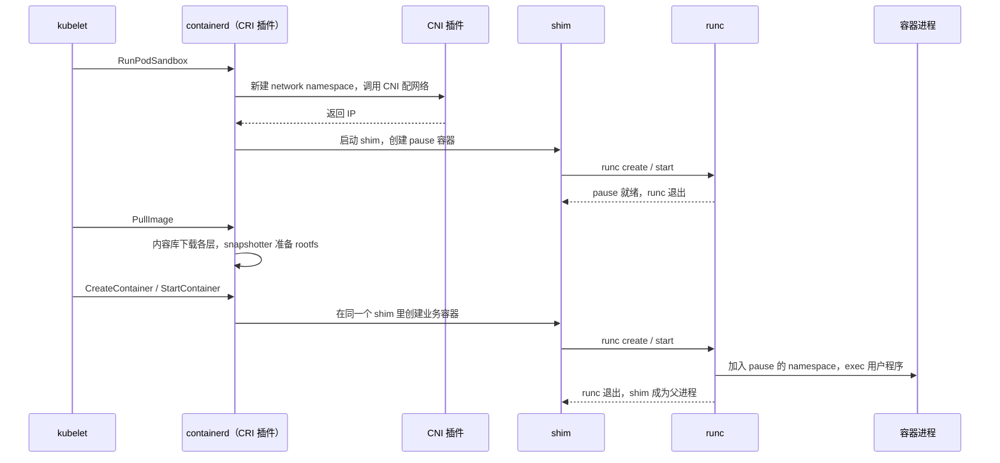

# 容器运行时：一条 docker run 背后的分层

敲下 `docker run nginx`，一秒后 nginx 就跑起来了。这一秒里，至少有五个程序依次经手：Docker 命令行、dockerd、containerd、shim 和 runc。换到 Kubernetes 节点上，名单又会变成 kubelet、containerd 或 CRI-O、shim、runc，以及负责网络的 CNI 插件。

这些程序里有好几个都自称“容器运行时”。名字相同，负责的却不是同一件事。这篇文章从最底下的 Linux 内核开始，一层一层往上搭：先说清楚容器到底是什么，再看镜像怎样变成进程，谁负责照看这个进程，谁负责管理镜像和生命周期，Kubernetes 又是怎样通过一套接口把这一切接进来的。最后看这条链上哪些环节可以替换，以及换掉之后会发生什么变化。

读完以后，再遇到一个新的“运行时”，你能马上判断它替换的是哪一层。本文只讲 Linux 容器。Docker 和容器技术的发展历史另有一篇：[Docker 与容器：从 chroot 到 Kubernetes，一只鲸鱼怎样改写了软件交付](../Docker%20与容器：从%20chroot%20到%20Kubernetes，一只鲸鱼怎样改写了软件交付/)。

## 容器是一个被圈起来的普通进程

先纠正一个常见的直觉：容器不是一台小虚拟机。它就是宿主机上的一个普通进程，由宿主机内核直接调度。容器里执行 `uname -r`，打印出来的是宿主机的内核版本。镜像里的 Ubuntu 或 Alpine，提供的只是用户态的文件和库，并没有自带内核。

这个进程之所以“像”一台独立的机器，是因为内核给它加了几道限制。每道限制管一个方面，彼此独立。

**namespace 决定进程能看见什么。** 每种 namespace 隔离一类全局资源：

| namespace | 隔离的东西 | 容器里的效果 |
| --- | --- | --- |
| mount | 挂载表 | 有自己的根文件系统 |
| PID | 进程号 | 自己是 1 号进程，看不到宿主机的其他进程 |
| network | 网卡、IP、路由、端口 | 有自己的 `eth0` 和端口空间 |
| UTS | 主机名 | 可以有自己的 hostname |
| IPC | 共享内存、信号量 | 不和外面共享 IPC 对象 |
| user | uid 和 gid | 容器里的 root 可以映射成宿主机上的普通用户 |
| cgroup | cgroup 树的视图 | 只看得到自己那一段 cgroup |
| time | 部分时钟 | 可以有自己的启动时间偏移 |

**cgroup 决定进程能用多少。** 它把进程编成组，限制和统计这一组的 CPU、内存、IO 和进程数。现在的主流是 cgroup v2，所有控制器都挂在一棵统一的树上。比如 `cpu.max` 是一个时间窗口内的 CPU 配额，用完了进程会被节流，但不会被杀掉；`memory.max` 是内存硬上限，内存回收不回来时，这个组里的进程会被 OOM 杀掉。“限制 1 个 CPU”指的是配额相当于一颗 CPU 的时间，不等于把进程绑在某一颗物理核上。Kubernetes 从 1.35 起已经弃用 cgroup v1，kubelet 默认拒绝在 v1 节点上启动，所以按旧教程里的 v1 路径去配置，很可能配错。

**capability、seccomp 和 LSM 决定进程能做什么。** Linux 把 root 的权力拆成几十项 capability，容器默认只保留其中一小部分，比如去掉了加载内核模块、修改系统时间的能力。seccomp 按系统调用号过滤，直接拒绝容器用不到的危险调用。AppArmor 和 SELinux 这类 LSM 再从文件和对象的层面补一道访问控制。

需要注意，Linux 并没有一个叫“创建容器”的系统调用。所谓创建容器，就是把上面这些机制按顺序套到一个新进程上。套哪几道也是可选的：`docker run --network host` 启动的容器不创建新的 network namespace，直接和宿主机共用网络，端口也会冲突。一个容器隔离得怎么样，取决于这次启动的具体配置，不取决于“它是个容器”这个名头。

user namespace 值得单独说一句。没有它，容器里的 root 在宿主机看来就是真正的 uid 0，一旦越过其他防线，就是宿主机的 root。有了它，容器里的 root 在宿主机上只是一个没有特权的普通 uid。这项能力在内核里早就有了，但配套的文件属主映射（idmap mount）等工作成熟得比较晚。Kubernetes 直到 1.36 才把 Pod 级的 user namespace 推到 GA，在 Pod 上设置 `hostUsers: false` 即可开启。

## 镜像：一叠只读的层，加一份配置

进程需要一个根文件系统，这就是镜像的作用。今天的镜像格式由 OCI（Open Container Initiative）规范定义，结构其实很简单：

- **层（layer）**：一个 tar 包，记录相对下一层的文件变化。删除文件用一个特殊的 whiteout 标记来表示。
- **配置（config）**：一个 JSON 文件，写着入口命令、环境变量、工作目录、默认用户，以及各层的顺序。
- **清单（manifest）**：列出这个镜像用到的配置和每一层。
- **索引（index）**：可选，把同一个镜像的多个平台版本（amd64、arm64 等）组织在一起，拉取时按本机平台挑选。

以上每个对象都用内容的 sha256 摘要来寻址。镜像名和 tag 只是指向某个摘要的指针，摘要本身才是镜像的真正身份。同一层被一百个镜像引用，在仓库和本地都只存一份。

镜像仓库怎样上传和下载这些对象，由 OCI 分发规范定义，本质上是一组 HTTP 接口。1.1 版给清单加了 `subject` 字段和 referrers 接口，签名、SBOM、漏洞扫描报告可以作为独立的制品“挂”在某个镜像上，不必改动镜像本身。从此仓库存的也不只是可运行的镜像：Kubernetes 1.36 GA 的镜像卷（image volume）可以把一个 OCI 制品，比如模型权重或配置文件包，以只读方式直接挂进 Pod。

运行时，这些只读层通过 overlayfs 叠成一棵目录树，最上面再加一层可写层。读文件时，从上往下找到第一个存在的副本；修改一个下层已有的文件时，先把整个文件复制到可写层再改，这叫 copy-up。所以修改一个大文件里的几个字节，也可能多占一整份文件的空间。数据库这类频繁写入的数据应该放在卷里，不要放在可写层里。

镜像到这里还不能直接运行。真正交给底层运行时的是一个 **bundle**：一个目录，里面有一份 `config.json` 和一个已经准备好的根文件系统。`config.json` 已经把镜像配置和用户参数（挂载、资源限制、namespace 选择等）合成了一份完整的启动说明。从镜像到 bundle 的这段路，也就是拉取、解包、叠层和生成配置，是上层组件的工作，不归下面要讲的 runc 管。

## 底层运行时：runc 把 bundle 变成进程

OCI 运行时规范定义了底层运行时的职责：拿到一个 bundle，按 `config.json` 创建容器；此外只需要支持几个操作：查询状态、启动、发信号、删除。runc 是这份规范的参考实现，也是目前最常用的实现。

`runc create` 大致按这个顺序干活：

1. 用带 `CLONE_NEWPID`、`CLONE_NEWNET` 等标志的 clone 创建子进程，让它落进新的 namespace。
2. 在 cgroup 树里建一个组，把子进程放进去，写入资源限制。
3. 挂载 `/proc`、`/dev` 等文件系统，用 `pivot_root` 把根目录切换到 bundle 的 rootfs。
4. 屏蔽 `/proc/kcore` 这类敏感路径，把部分路径设为只读。
5. 丢掉不需要的 capability，装上 seccomp 过滤器，设置 LSM 标签。
6. 停下来等待。`runc start` 到来时，才 exec 用户程序。

create 和 start 分成两步，是为了让上层有机会在进程真正运行之前，先把网络之类的准备工作做完。

用户程序 exec 起来以后，runc 自己就退出了。所以在宿主机上找不到一个一直叫 runc 的进程，并不代表容器没用 runc。之后用户进程的每一次系统调用都直接进入宿主机内核，不再经过任何运行时。这是普通容器性能几乎没有损耗的原因，也是它的安全边界所在：所有容器共享同一个内核。

runc 不是唯一的实现。crun 用 C 写成，二进制更小，启动更快，CRI-O 从 1.31 起默认使用它；youki 用 Rust 实现。它们读同一份 bundle，上层可以随意替换。不过实际启动一个服务时，拉镜像、解包和应用自身初始化花的时间，通常远多于 runc 和 crun 之间的差距，不要指望换个底层运行时就让业务明显变快。

这一层也是安全漏洞的高发区。原因很直接：runc 在创建容器时拥有很高的权限，而它操作的根文件系统可能完全由攻击者控制。CVE-2019-5736 里，容器进程通过 `/proc/self/exe` 覆盖了宿主机上的 runc 二进制。2025 年 11 月公开的 CVE-2025-31133 等三个漏洞，利用挂载过程中的竞争条件，把 `/dev/null` 或 `/dev/console` 换成符号链接，诱导 runc 把 `/proc/sys/kernel/core_pattern` 这类文件以可写方式挂进容器，最终逃逸。这几个漏洞都说明，共享内核的容器，隔离强度取决于运行时在每一个路径和挂载细节上都没有出错。

## shim：容器进程的监护人

runc 退出了，容器进程总得有个父进程。总得有人收它的退出码，握住它的标准输入输出，在它退出时通知上层。这个角色就是 shim。

直接让 containerd 当父进程不行吗？可以，但代价是 containerd 一重启，所有容器的输入输出管道就断了，容器也可能跟着没了。早期的 Docker 正是这样：所有容器都挂在一个守护进程下面，升级一次 Docker，等于把机器上的所有服务都重启一遍。把父进程的职责拆给一个独立的小进程之后，containerd 可以随时重启或升级，shim 和容器照常运行；containerd 回来后，再通过 shim 的 socket 把状态接上。

以 containerd 为例，shim 是一个单独的可执行文件，比如 `containerd-shim-runc-v2`。containerd 通过 ttrpc 和它通信。ttrpc 是去掉了 HTTP/2 的精简版 gRPC，目的是让每个 shim 占的内存尽量少。shim 收到创建请求后，再去调用 runc。

一个 shim 管几个容器，由 shim 自己决定。`containerd-shim-runc-v2` 会按 Pod 分组，同一个 Pod 里的所有容器共用一个 shim。CRI-O 那边对应的角色叫 conmon，默认每个容器一个；也可以换成按 Pod 管理的 conmon-rs。

shim 还有一个更重要的作用：它是 containerd 接入不同执行方式的插口。containerd 只和 shim 说话，不关心 shim 背后是 runc、gVisor 还是一台虚拟机。运行时名称和二进制之间有固定的命名规则：`io.containerd.runc.v2` 对应 `containerd-shim-runc-v2`，`io.containerd.runsc.v1` 对应 gVisor 的 `containerd-shim-runsc-v1`，`io.containerd.kata.v2` 对应 Kata 的 `containerd-shim-kata-v2`。后面讲到的强隔离方案，都是从这个插口接进来的。

## 高层运行时：containerd 管镜像和生命周期

runc 只认 bundle，shim 只照看进程。从“一个镜像名”到“一个 bundle”，以及容器从创建到删除的整个生命周期，由高层运行时负责。containerd 是其中最常见的一个。它的内部由几个职责清楚的部件组成：

- **内容库（content store）**：按摘要存放拉下来的原始数据，也就是清单、配置和层的 tar 包。
- **快照器（snapshotter）**：把层解包，准备成可以挂载的根文件系统。默认是 overlayfs，也可以换成别的实现。
- **元数据库**：用 bbolt 记录镜像、容器、租约等对象，以及它们之间的引用关系，垃圾回收也靠它。
- **容器与任务**：在 containerd 里，“容器”只是一份元数据，写着用哪个镜像、什么配置；“任务”才是真正在运行的进程。创建容器不会启动任何东西，启动任务时才会拉起 shim。
- **命名空间**：containerd 给自己的对象分组用的，和内核 namespace 无关。Docker 创建的对象在 `moby` 下，Kubernetes 的在 `k8s.io` 下，所以用 `ctr` 默认看不到 Kubernetes 的容器，要加上 `-n k8s.io`。

containerd 2.0 之后又稳定了几个值得了解的部件：

- **Transfer 服务**：把拉取、推送、导入、导出统一成“从某个源传到某个目的地”，并支持在拉取时调用镜像校验插件做策略检查。
- **Sandbox API**：把“一组共享资源、同生共死的容器”变成一等对象。过去 Pod 的概念散落在 CRI 插件里，pause 容器是写死的实现；现在沙箱由可替换的控制器管理，虚拟机型的运行时可以用自己的方式实现一个 Pod。
- **NRI（Node Resource Interface）**：默认开启。插件可以在容器创建前拦截并修改它的配置，作用类似 Kubernetes 的 mutating webhook，常用来做 CPU 绑核、NUMA 亲和之类的精细资源调整。GPU 等设备则通过 CDI（Container Device Interface）用统一的描述文件注入容器。

Docker 今天就建在 containerd 上。dockerd 负责面向用户的那部分：Docker API、网络（端口映射、bridge）、卷、日志驱动，以及通过 BuildKit 构建镜像。容器的实际创建和运行交给 containerd。过去 Docker 还保留着自己的一套镜像存储（overlay2 等 graph driver），和 containerd 各存一份；从 Docker Engine 29 起，新安装默认改用 containerd 的镜像存储，两边终于合成一份。

## CRI：Kubernetes 和运行时之间的合同

到这里讲的都是单机上的事。Kubernetes 的视角不同：调度器决定一个 Pod 放在哪个节点，节点上的 kubelet 负责把它跑起来。kubelet 需要的不是“运行一个容器”，而是另一组动作：先为 Pod 建一个沙箱，再在沙箱里依次创建业务容器，沙箱销毁时整组一起回收。

CRI（Container Runtime Interface）就是 kubelet 和运行时之间约定的 gRPC 接口，分成两个服务：

- **RuntimeService**：`RunPodSandbox`、`CreateContainer`、`StartContainer`、`StopPodSandbox`、`ExecSync` 等，管理沙箱和容器。
- **ImageService**：`PullImage`、`ListImages`、`RemoveImage`，管理镜像。

kubelet 是客户端，只和一个 Unix socket 说话，比如 `/run/containerd/containerd.sock` 或 `/var/run/crio/crio.sock`。socket 另一头是谁，它不关心。

这套接口是从一次硬编码演变过来的。早期 kubelet 直接调用 Docker API，每想支持一种新运行时，就得修改 kubelet 的代码。CRI 把这层抽象出来以后，Docker 自己并不实现 CRI，于是 kubelet 里内置了一个叫 dockershim 的翻译层。与此同时，containerd 把 CRI 做成了内置插件，kubelet 可以直接连 containerd，不必再绕道 dockerd。Kubernetes 1.24 删除了 dockershim。当时常被误读为“Kubernetes 不支持 Docker 了”，其实被删掉的只是 kubelet 里迁就 Docker 引擎的那段代码。Docker 构建的镜像符合 OCI 规范，在 containerd 和 CRI-O 上照常运行。确实想让节点继续用 Docker 引擎的，可以装 cri-dockerd，把同样的翻译放在 kubelet 外面。

CRI 的另一个主流实现是 CRI-O。它的定位很窄：只实现 Kubernetes 需要的那部分，不提供面向开发者的命令行和构建功能。镜像和存储用的是 containers/image 与 containers/storage 两个库（Podman 也用这两个库），进程监护交给 conmon，底层默认调用 crun。OpenShift 的节点用的就是它。

**Pod 沙箱**在普通 Linux 节点上通常以一个 pause 容器为锚点。它几乎什么都不做，只是一直活着，让 Pod 共享的 network、IPC 等 namespace 有一个稳定的持有者。业务容器创建时加入这些已经存在的 namespace，所以某个容器重启，Pod 的 IP 和网卡也不会变。

**网络不归运行时管**。创建沙箱时，运行时会调用 CNI 插件，由插件为这个 network namespace 配置网卡、IP 地址和路由，再把结果交回来。CNI 不负责启动进程，CRI 也不负责路由表里的下一跳，分工很清楚。

## 把整条链串起来：一个 Pod 是怎么启动的

以 containerd 节点为例，一个单容器 Pod 的启动过程如下。实际执行中会有并行和重试，这张图只为理清谁在什么时候负责什么：

把每一步落到组件上：

1. kubelet 通过 CRI 请求创建沙箱。containerd 先新建一个 network namespace，调用 CNI 插件配好网卡、地址和路由。
2. containerd 拉起 shim，由 runc 创建 pause 容器。pause 加入这个 network namespace，并建立 Pod 共享的 IPC 等 namespace。
3. kubelet 请求拉取镜像。containerd 把各层下载到内容库，由 snapshotter 叠出 rootfs。
4. kubelet 请求创建并启动业务容器。containerd 生成 `config.json`，与 rootfs 组成 bundle，交给同一个 shim。
5. runc 让新进程加入 pause 的 namespace，放进 cgroup，换根、降权、装 seccomp，然后 exec 用户程序，自己退出。
6. 此后，shim 是容器进程的父进程，containerd 通过 shim 查询状态、执行 exec、停止容器。用户程序的系统调用直接进入宿主机内核。

`docker run` 只在上半段不同：没有 kubelet 和 CRI，而是 Docker 命令行调用 dockerd 的 API，dockerd 自己准备网络和卷，再通过 gRPC 调用 containerd。从 shim 往下，两条路完全一样。

## 各组件分工一览

| 组件 | 在哪里运行 | 负责什么 | 不负责什么 |
| --- | --- | --- | --- |
| Docker CLI、dockerd | 开发机、部分服务器 | 面向人的 API、构建、默认网络和卷 | 不直接创建 namespace |
| Podman | 开发机、服务器 | 无常驻守护进程的 Docker 替代品，天然支持 rootless | 不对 kubelet 提供 CRI |
| kubelet | 每个 Kubernetes 节点 | 按 Pod 定义调用 CRI | 不直接接触镜像层和 namespace |
| containerd、CRI-O | 节点上的常驻进程 | 镜像、快照、容器生命周期，对 kubelet 提供 CRI | 不决定 Pod 调度到哪里 |
| shim、conmon | 每个 Pod 或每个容器一个 | 做容器的父进程，握住标准 IO，上报退出状态 | 不创建 namespace |
| runc、crun、youki | 只在创建时短暂运行 | 把 OCI bundle 变成受限进程 | 不拉镜像，不长期驻留 |
| gVisor、Kata | 替换 runc 所在的执行层 | 用用户态内核或虚拟机隔离系统调用 | 不替换 kubelet 和 containerd |
| CNI 插件 | 沙箱创建和销毁时 | 网卡、IP 地址、路由 | 不启动进程 |

排查问题时，也要知道命令行工具各自连的是哪一层。`crictl` 走 CRI，看到的和 kubelet 看到的一致，排查 Kubernetes 节点首选它。`ctr` 是 containerd 自带的调试工具，直接调用 containerd 的原生接口。`nerdctl` 也是 containerd 的命令行，用法和 Docker 几乎一样。`docker` 只能看到 dockerd 管理的容器，看不到 kubelet 通过 CRI 创建的那些。

## 换掉执行层：gVisor 与 Kata

普通 runc 容器适合运行你信任的代码，隔离主要是为了分资源、分视图。如果要运行用户上传的程序、不可信的构建脚本，或者 AI Agent 生成的命令，所有容器共享的那一个宿主机内核就成了最大的攻击面：内核里任何一个可被利用的漏洞，都可能让容器里的代码拿到整台机器。

解决思路是让容器的系统调用不再直接进入宿主机内核。借助前面说的 shim 插口，可以把 runc 所在的执行层整个换掉，上面的镜像格式、containerd 和 kubelet 都不用变。

**gVisor** 在应用和宿主机内核之间放了一个用 Go 写的用户态内核，叫 Sentry。它从头实现了 Linux 的系统调用接口、内存管理、文件系统和网络栈。应用发出的系统调用由 Sentry 处理，不会原样转发给宿主机内核；Sentry 自己只使用一小组受 seccomp 严格限制的宿主机系统调用。拦截系统调用的机制叫 platform，默认的 systrap 利用 seccomp 的陷入功能，不需要硬件虚拟化，所以也能在普通云主机里运行。文件访问由一个权限稍高的 Gofer 进程协助完成，现在默认的 directfs 模式下，Gofer 把文件描述符交给 Sentry，Sentry 直接用这些描述符读写，省去了来回通信的开销。gVisor 的 OCI 运行时叫 `runsc`。代价是系统调用密集的程序会变慢，Sentry 没有实现的内核特性，应用就用不了。

**Kata Containers** 给每个 Pod 配一台轻量虚拟机。同一个 Pod 里的容器共享这台虚拟机的内核，不同 Pod 之间隔着硬件虚拟化的边界。`containerd-shim-kata-v2` 负责拉起虚拟机，虚拟机里运行一个 kata-agent，通过 vsock 接收 shim 的指令，在客户机内部创建容器。VMM 可以选 QEMU、Cloud Hypervisor、Firecracker 或 Dragonball。宿主机需要支持 KVM，在云主机上运行还要开启嵌套虚拟化。额外开销主要是每台虚拟机的客户机内核和内存，启动也比 runc 慢一些。

Firecracker 本身只是一个 VMM：一个进程管一台 microVM，设备模型精简到极致。它不认识镜像，也不提供 CRI，需要 Kata 或其他编排层把它放在执行层的最底部。

| 执行层 | 系统调用由谁处理 | 适合运行什么 | 主要代价 |
| --- | --- | --- | --- |
| runc、crun | 宿主机内核 | 自己的、受信任的服务 | 共享内核，隔离最弱 |
| gVisor | 用户态的 Sentry | 不可信但系统调用不太刁钻的程序 | 系统调用开销，兼容性缺口 |
| Kata + VMM | 虚拟机里的客户机内核 | 不可信代码，多租户 | 内存开销，启动更慢，依赖 KVM |

在 Kubernetes 里，通过 RuntimeClass 选择执行层。RuntimeClass 对象里的 `handler` 名称，必须和节点上 containerd 或 CRI-O 配置里的运行时名称一致。RuntimeClass 只负责“选择”，不负责“安装”：如果只有部分节点装了 Kata，还要通过 RuntimeClass 的调度约束把 Pod 限定在这些节点上，否则 Pod 会落到没有对应运行时的机器上，然后启动失败。

## 换掉存储层：snapshotter 与懒加载

执行层之外，另一个常被替换的是 containerd 的 snapshotter。它决定镜像层在磁盘上怎样叠成 rootfs，以及文件内容什么时候到位。

默认的 overlayfs snapshotter 要求启动前把所有层下载、解压完毕。镜像动辄几个 GB，这一步往往是冷启动最慢的环节。懒加载类的 snapshotter 换了一种做法：先把文件目录结构准备好，让容器立刻启动，进程第一次读到某个文件时，再去仓库按需拉取对应的数据块。

- **stargz**：需要把镜像转换成 eStargz 格式，可以按构建时的访问记录预取“很可能用到”的文件。
- **SOCI**：不修改原镜像，额外生成一份索引，和镜像一起放进仓库。
- **Nydus**：使用自己的 RAFS 格式，按数据块去重，可以配合 Dragonfly 做 P2P 分发，也支持内核里的 EROFS。

懒加载并没有消除等待，而是把它从“启动前等所有层”挪到了“运行中第一次访问文件时”。启动时实际只读几个文件的服务收益最大；启动时要读遍整个镜像的服务，收益有限。

换 snapshotter 和换执行层互不干扰：前者改变的是文件怎么到位，后者改变的是系统调用由谁处理。两者可以同时替换。

## 结语：遇到新的运行时，先问它替换了哪一层

把全文收成一条线：内核用 namespace、cgroup、capability 和 seccomp 把一个普通进程圈起来；OCI 规范约定了镜像的格式和 bundle 的形状；runc 把 bundle 变成受限的进程，然后退出；shim 留下来照看这个进程；containerd 或 CRI-O 负责镜像、快照和生命周期；kubelet 通过 CRI 调用它们，CNI 负责网络；Docker 和 Podman 则是给人用的那一层外壳。

每一层之间都有明确的接口：OCI bundle、shim API、CRI、CNI。正是这些接口让每一层都可以单独替换。所以下次看到一个新的“容器运行时”，先问它替换了哪一层：

- 替换 runc 的（crun、runsc、Kata），改变的是系统调用由谁处理，也就是隔离的强度。
- 替换 snapshotter 的（stargz、SOCI、Nydus），改变的是镜像层怎样挂载、文件何时下载。
- 替换 containerd 的（CRI-O），改变的是谁在节点上对 kubelet 提供 CRI。
- 替换 Docker 的（Podman、nerdctl），改变的是开发者手里的命令行和守护进程模型。

这几层可以同时替换，但它们从来不是同一个程序。

## 参考

- Linux man pages：[namespaces(7)](https://man7.org/linux/man-pages/man7/namespaces.7.html)、[cgroups(7)](https://man7.org/linux/man-pages/man7/cgroups.7.html)、[capabilities(7)](https://man7.org/linux/man-pages/man7/capabilities.7.html)、[seccomp(2)](https://man7.org/linux/man-pages/man2/seccomp.2.html)。
- Linux 内核文档，[Control Group v2](https://www.kernel.org/doc/html/latest/admin-guide/cgroup-v2.html)。`cpu.max`、`memory.max` 等接口的准确含义。
- Kubernetes，[About cgroup v2](https://kubernetes.io/docs/concepts/architecture/cgroups/)。1.35 起弃用 cgroup v1。
- Kubernetes，[User Namespaces](https://kubernetes.io/docs/concepts/workloads/pods/user-namespaces/)、[v1.36: User Namespaces are finally GA](https://kubernetes.io/blog/2026/04/23/kubernetes-v1-36-userns-ga/)。
- OCI，[Image Spec](https://github.com/opencontainers/image-spec)、[Distribution Spec](https://github.com/opencontainers/distribution-spec)、[Runtime Spec](https://github.com/opencontainers/runtime-spec)，以及 [v1.1 发布说明](https://opencontainers.org/posts/blog/2024-03-13-image-and-distribution-1-1/)。
- OCI Runtime Spec，[Filesystem Bundle](https://github.com/opencontainers/runtime-spec/blob/main/bundle.md)。底层运行时实际读取的内容。
- Kubernetes，[Use an Image Volume With a Pod](https://kubernetes.io/docs/tasks/configure-pod-container/image-volumes/)。
- [runc](https://github.com/opencontainers/runc)、[crun](https://github.com/containers/crun)、[youki](https://github.com/youki-dev/youki)。
- [CVE-2019-5736](https://nvd.nist.gov/vuln/detail/CVE-2019-5736)；oss-security，[runc container breakouts via procfs writes](https://openwall.com/lists/oss-security/2025/11/05/3)（CVE-2025-31133、CVE-2025-52565、CVE-2025-52881）。
- containerd，[Runtime v2](https://github.com/containerd/containerd/blob/main/docs/runtime-v2.md)。shim 的接口、命名规则和按 Pod 分组。
- containerd，[containerd 2.0](https://containerd.io/docs/main/containerd-2.0/)、[Sandbox API](https://containerd.io/docs/main/sandbox-api/)、[Transfer Service](https://containerd.io/docs/main/transfer/)、[NRI](https://github.com/containerd/nri)。
- Docker，[containerd image store](https://docs.docker.com/engine/storage/containerd/)、[Docker Engine v29](https://www.docker.com/blog/docker-engine-version-29/)。
- Kubernetes，[Container Runtime Interface](https://kubernetes.io/docs/concepts/architecture/cri/)、[Dockershim 的来龙去脉](https://kubernetes.io/blog/2022/05/03/dockershim-historical-context/)、[Runtime Class](https://kubernetes.io/docs/concepts/containers/runtime-class/)。
- [CRI-O](https://github.com/cri-o/cri-o)、[conmon](https://github.com/containers/conmon)、[conmon-rs](https://github.com/containers/conmon-rs)。
- [CNI](https://github.com/containernetworking/cni)。
- gVisor，[Introduction to gVisor security](https://gvisor.dev/docs/architecture_guide/intro/)、[Platform Guide](https://gvisor.dev/docs/architecture_guide/platforms/)、[Directfs](https://gvisor.dev/blog/2023/06/27/directfs/)。
- [Kata Containers](https://github.com/kata-containers/kata-containers)、[Firecracker](https://github.com/firecracker-microvm/firecracker)。
- 懒加载：[stargz-snapshotter](https://github.com/containerd/stargz-snapshotter)、[SOCI snapshotter](https://github.com/awslabs/soci-snapshotter)、[nydus-snapshotter](https://github.com/containerd/nydus-snapshotter)。
