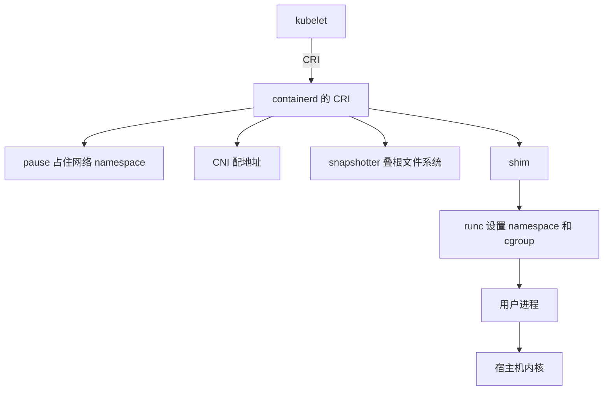

# 容器运行时：从 Docker 到 containerd、gVisor 与 Kata

今天敲 `docker run`，进程还是宿主机内核在调度。这条命令能成立，是因为 Linux 用了十几年把“一个进程能看见什么、能用多少、能做什么”拆成了几组互不相关的机制。Docker 在 2013 年把它们包成一个人能用的东西。包得太成功，Kubernetes 起来之后，这个东西又被拆开：镜像怎么存、进程怎么启动、节点怎么接调度，变成不同的程序。

名字因此叠了三层。containerd、runc、CRI-O、shim、gVisor、Kata 都叫运行时，指的不是同一段代码。这篇沿一条线看：内核先提供了哪些零件，Docker 怎样把零件变成产品，Kubernetes 为什么不能继续把 Docker 焊在 kubelet 里，以及现在一次启动到底经过谁。范围是 Linux。Windows 容器的内核机制是另一套。

仓库和说明在后面的参考里。[Docker 1.11 的拆分说明](https://www.docker.com/blog/docker-engine-1-11-runc/)、[Kubernetes 引入 CRI 的文章](https://kubernetes.io/blog/2016/12/container-runtime-interface-cri-in-kubernetes/) 和 [去掉 dockershim 的回顾](https://kubernetes.io/blog/2022/05/03/dockershim-historical-context/) 是这条线上的三篇原始记录。

## 内核先有了笼子，还没有“容器”这个产品

Unix 很早就有 chroot：把进程的根目录换到一棵子树，它就看不见树外面的文件。这只挡路径，不挡进程号、网络和 root 权限。2000 年 FreeBSD 的 jail 把这件事做得更完整，一台机器上可以跑多个互相看不见的用户态环境。Linux 没有一次给出等价物，而是分了十几年，每次往上加一种 namespace。

挂载 namespace 在 2002 年就进了内核，进程可以有自己的挂载表。主机名、IPC、进程号、网络，随后几年一个一个加上。用户 namespace 最晚，Linux 3.8，2013 年 2 月，把容器里的 root 映射成宿主机上的普通 uid。Docker 公开演示几乎就在同一个春天。功能在，默认配置却长期不敢开：用户 namespace 的漏洞和缺角够多，rootless 要到多年以后才变成 Docker 和 Podman 的一种正式跑法。

资源限制是另一条线。Google 在自己的机器上要把上万个任务塞进同一台 Linux，不能让一个任务把内存吃光。2006 年前后 Paul Menage 等人做了 process containers。2007 年改名 control groups，因为 container 这个词已经在指别的东西。cgroup 把进程编成组，限制和统计 CPU、内存、进程数。它不改变进程看见的世界，只决定这个组能用多少。

所以普通容器没有一个叫“创建容器”的系统调用。runc 做的是把几件旧事按顺序办完：用 clone 带上 `CLONE_NEWPID`、`CLONE_NEWNET` 这类标志，让新进程落进新的 namespace；把进程写进一个 cgroup；`pivot_root` 换根；丢掉不需要的 capability；装上 seccomp 过滤系统调用；最后 exec 用户的程序。程序起来之后，调度它的仍是宿主机内核。镜像里的 Ubuntu 或 Alpine 只是用户态的文件和库。容器里 `uname -r` 打出来的，是底下那台 Linux 的版本。

cgroup v2 把这些限制收进一棵统一的树。`cpu.max` 是一段时间里的 CPU 配额，耗尽了就节流，进程还在。`memory.max` 是硬顶，收不回来就可能在这个 cgroup 里 OOM。配额等于一个 CPU，并不等于钉死在某颗物理核上。Kubernetes 到 1.25 才把 cgroup v2 标成稳定，很多旧教程仍按 v1 的路径写，照抄会配错。

namespace 还可以选择不建。`--network host` 的容器就和宿主机共用网络 namespace，端口会撞车。隔离看的是这次启动的配置，不是“它是个容器”这五个字。

## Docker 把这些零件收成一条命令

2013 年春天，dotCloud 的 Solomon Hykes 在 PyCon 上演示了一个工具。dotCloud 本来做 PaaS，要在同一台机器上替很多客户起服务。Hykes 给观众看的不是内核标志，是 `docker run`：拉一个镜像，进去就是一个能跑命令的环境。那次演示之后，公司后来的名字、融资和产品都转到了这个工具上。PaaS 没做成那一年最重要的事，把 PaaS 底下那一层做成了。

当时 Linux 上已经有 LXC。Docker 的第一版执行就委托给它。2014 年 3 月的 Docker 0.9 换了默认执行器，改用自己写的 libcontainer，LXC 变成可选项。原因很具体：LXC 是一套容器工具，Docker 要的是一个库，能在 Go 里精确控制 namespace、cgroup 和挂载，并且在不同发行版上行为一致。libcontainer 就是后来的 runc。

镜像的形状也是这时定下来的。一层层只读的文件系统变更，加上一份配置：入口命令、环境变量、暴露的端口。注册表用 HTTP 按内容摘要存这些层。本地再用联合挂载叠起来，最上面加一层可写的。OverlayFS 的读穿透到下面没改过的层；改一个已有文件，通常先把整个文件复制到上层再改，所以“改了几个字节”可能多占一份文件的空间。数据库不该放在这层可写层里。

2014 年 CoreOS 推出 rkt，并推了另一套应用规范 appc。两边都说自己在做容器，镜像和运行参数对不上。2015 年 6 月，Docker、CoreOS、Google、红帽等把格式交出来，成立 Open Container Initiative。Docker 捐出的运行时规范实现就是 runc，镜像格式也进了 OCI。CoreOS 后来被红帽收购，rkt 停了。留下来的是三份规范：镜像长什么样，注册表怎么传，运行时拿到目录之后怎么把进程拉起来。

OCI 运行时拿到的不是注册表里的镜像，是一个 bundle：一个 `config.json`，加上它指向的根文件系统。中间的拉取、解包、叠层，不归 runc。

## 一个进程包办一切，升级时容器会一起死

Docker 早期是一个守护进程。它拉镜像、管网络、建容器、还握住容器的标准输入输出。守护进程一重启，这些管子断了，容器跟着没。用户抱怨的就是这个：升级引擎，等于把上面的服务重启一遍。

2015 年 12 月 Docker 拆出 containerd，一个专门管 runc 的守护进程。2016 年 4 月 13 日的 Engine 1.11 把这套做成默认。官方那篇说明写得很直：引擎现在建在 containerd 和 runc 上，引擎重启时容器可以继续跑。做到这一点的是 shim。容器旁边有一个小进程，握住标准输入输出，负责收割退出的子进程。runc 这条路上通常一个容器一个 shim；Kata 这类会按 Pod 收成一个，因为整组容器在同一台虚拟机里。containerd 或 dockerd 挂了，shim 还在，容器的 PID 1 还在。管理进程再起来，通过 shim 把状态接回去。

runc 自己通常不长驻。它把 namespace 和 cgroup 设完、exec 掉用户程序之后就可以退出。活着的是用户进程和 shim。所以在宿主机上找不到一个一直叫 runc 的进程，并不表示容器没在用 runc。

这次拆分还有一层用意。执行器换成别人写的，只要它按同一份 OCI 规范读 bundle，Docker 引擎不用改。gVisor 的 `runsc`、Kata 的运行时，后来都是从这道缝里插进去的。

2019 年 2 月的 runc 漏洞 CVE-2019-5736 说明这道缝为什么危险。容器里的 root 可以打开 `/proc/self/exe`。在 runc 还没 exec 完的窗口里，这个路径指向宿主机上的 runc 二进制。容器里把它覆盖掉，下一次宿主机上任何人跑 runc，跑的就是被换过的程序。修补是让 runc 先把自己复制到内存文件再执行，使 `/proc/self/exe` 不再指向磁盘上的那个二进制。共享内核的容器里，运行时进程和容器进程如果还能互相写到对方的文件，隔离就从内核退回到“路径碰巧没指错”。

## Kubernetes 要的是节点上的接口，不是 Docker 的 API

Kubernetes 在 2014 年公开，2015 年 7 月发 1.0，并作为 CNCF 的起始项目。它继承的是 Google Borg 那类用法：调度器决定一个 Pod 落在哪台机器，节点上的 kubelet 负责把它跑起来。Pod 是一组容器，共享网络，可以用卷共享文件。进程空间默认不共享，要另开配置。

早期 kubelet 直接调用 Docker。Docker 的 API 是给人用的：镜像名、端口映射、容器名。Kubernetes 要的是另一组动作：先建一个 Pod 沙箱，再在沙箱里起业务容器，沙箱死了整组一起收。每接一种新运行时，就要改 kubelet 的代码。2016 年 12 月，Kubernetes 1.5 把这层收成 CRI，一套 gRPC。kubelet 当客户端。运行时服务管 Pod 沙箱和容器，镜像服务管拉镜像和列镜像。当时是 alpha，默认仍走老路径。内置了一个 dockershim，替 Docker 把 CRI 翻译成 Docker API，因为 Docker 引擎自己不说 CRI。

同时期红帽做了 CRI-O，只实现 Kubernetes 要的那一截：镜像、存储、一个 OCI 运行时、监控。它不打算成为第二个 Docker。rkt 有过 rktlet，基于虚拟机的 frakti 也接过 CRI。rkt 那条线后来停了。

containerd 在 1.1 里自己带了 CRI 插件。kubelet 可以连 containerd 的 socket，不必再绕 dockerd。节点上少一个守护进程，也少一层翻译。

dockershim 留在 kubelet 树里很多年。Kubernetes 1.20 宣布要删，社区理解成“Kubernetes 不用 Docker 了”。镜像其实无关。Docker 打出来的镜像只要符合 OCI，containerd 和 CRI-O 都能跑。删掉的是 kubelet 里那段专门迁就 Docker 引擎的代码。维护者在事后的回顾里承认，当时没把“引擎”和“镜像”说清楚。1.24 在 2022 年 5 月拿掉 dockershim。还想用 Docker 引擎当节点运行时的，用外部的 cri-dockerd，那是 Docker 和 Mirantis 把同一段代码接在进程外面继续维护。

Pod 沙箱在普通 Linux 上常常是一个 pause 容器。它几乎不做事，只占住网络 namespace 和 IPC。业务容器来了又走，IP 和网卡还挂在 pause 上。CNI 插件在沙箱创建时被调用，配地址和路由，把结果交回 kubelet。CNI 不负责 exec 用户的程序。CRI 不负责路由表里的下一跳。

所以一次 Pod 启动，在 containerd 节点上是这几段，中间有并行和重试，顺序用来认人：

kubelet 通过 CRI 提出请求。containerd 准备镜像层和沙箱。CNI 配网络。shim 握住这组进程的生命周期。runc 在启动那一刻把内核机制落到进程上，然后退出。用户进程的系统调用直接进宿主机内核，不再经过 runc。

## 现在每个组件管哪一段

| 组件 | 活在哪 | 管什么 | 不管什么 |
| --- | --- | --- | --- |
| Docker CLI、dockerd | 开发机、部分服务器 | 人用的 API、Compose、默认网络和卷 | 不自己实现 namespace |
| containerd | 节点或 Docker 底下 | 内容存储、元数据、快照、任务；对 Kubernetes 说 CRI | 不决定 Pod 调度到哪 |
| CRI-O | 主要是 OpenShift 一类节点 | 同一层的 CRI，范围收在 Kubernetes 要的动作里 | 不是 runc 的替代品 |
| shim | 每个容器或每个 Pod 一个，看实现 | 标准 IO、退出状态、让管理进程能重启 | 不创建 namespace |
| runc、crun | 启动时跑一下 | 读 OCI bundle，clone、cgroup、换根、seccomp、exec | 不拉镜像，不长期陪着容器 |
| runsc、Kata | 换掉上面那层执行 | 系统调用进 Sentry，或进一台轻量虚拟机 | 不替换 kubelet |
| CNI 插件 | 沙箱创建和销毁时 | 网卡、地址、路由 | 不启动业务进程 |

Docker 今天的引擎默认仍是 containerd 加 runc。人看到的是 2013 年那条命令，底下已经是 2016 年拆开的那套。Podman 把常驻的中心守护进程拿掉，容器仍由 OCI 运行时创建，rootless 走用户 namespace。它适合不想在开发机上放一个 root 守护进程的人。nerdctl 是 containerd 的命令行，接口接近 Docker。

containerd 内部还有一道容易和 runc 混在一起的切分。镜像层放在按摘要寻址的内容库里。snapshotter 把这些层准备成进程能挂的根文件系统，overlayfs 是最常见的一种。换 snapshotter，变的是磁盘上怎么叠、能不能按需拉某几个文件。换执行运行时，变的是进程隔在哪。stargz 一类延迟拉取改的是前一件：进程可以先起来，第一次读到还没下载的文件再去注册表要。慢从“启动前等完全部层”挪到“运行中第一次碰那个文件”。

crun 用 C 实现同一份 OCI 运行时规范，二进制更小。Podman 和一部分 CRI-O 默认用它。启动时间里，拉镜像、解包和应用自己的初始化经常比 runc 和 crun 的差别大。不要用实现语言推断业务会快多少。

`ctr`、`crictl`、`nerdctl` 看的是不同的口。`crictl` 走 CRI，和 kubelet 看到的接近。`ctr` 走 containerd 自己的管理接口，Kubernetes 的容器在名为 `k8s.io` 的 containerd namespace 里。这个 namespace 是 containerd 给对象分的桶，和内核的 namespace 无关。

## 更强的隔离换的是执行那一层

普通 runc 容器适合信任这份代码、只是想把它和别的进程隔开资源的情况。平台跑用户上传的程序、不可信的构建、或者模型写出来的命令时，共享的那份宿主机内核就是攻击面。runc 那个 CVE 是同一件事的早期版本：边界一旦漏到宿主机上的文件，容器里的 root 就不只是容器里的 root。

gVisor 在应用和宿主机内核之间放了一个用户态的 Sentry。应用的系统调用先到 Sentry，由它实现一套 Linux 接口，再决定哪些可以反映到宿主机。OCI 运行时叫 `runsc`，可以挂到 Docker 或 containerd 上，换运行时不用换镜像格式。代价是系统调用多的程序会慢，而且 Sentry 没实现的接口会直接失败。seccomp 只是按调用号拒绝。Sentry 是在用户态把系统调用的表面重新实现了一遍。

Kata 把 Pod 放进一台轻量虚拟机。同一个 Pod 的容器共享这台虚拟机里的内核，和别的 Pod 不共享。shim 负责拉起虚拟机，客户机里有一个 agent 接命令。VMM 可以是 QEMU，也可以是 Cloud Hypervisor 或 Firecracker。宿主机要有 KVM。云主机上还要确认嵌套虚拟化开了没有。多出来的内存是这台虚拟机的内核和页表，不是 runc 那几兆。

Firecracker 自己是 VMM：一个进程一台 microVM，设备很少。它不拉镜像，也不说 CRI。Kata 或其他编排可以把它嵌在执行层的最底下。前面几篇沙箱文章里的 AgentENV、OpenSandbox 的 FastSandbox 走的是这条。CubeSandbox 的监视器是另一套 RustVMM，不是这个仓库，但分层方式同类：上面仍要有人管镜像和生命周期。

| 执行层 | 系统调用进哪 | 适合放什么 |
| --- | --- | --- |
| runc、crun | 宿主机内核 | 自己的服务，隔离主要是资源和视图 |
| gVisor | Sentry | 少碰冷门系统调用、又不愿为每个 Pod 付一台虚拟机 |
| Kata 加一种 VMM | 客户机内核 | 不信任的代码，能接受虚拟化的内存和启动成本 |

Kubernetes 用 RuntimeClass 选节点上已经装好的 handler。对象本身不会把 Kata 或 gVisor 装上去。handler 的名字必须和节点配置一致。只有一部分节点有这个 handler 时，调度也要跟着约束，否则 Pod 会落到没有这套二进制的机器上。

## 主线就这一条

内核用 namespace、cgroup、capability 和 seccomp 提供了笼子，没有提供产品。Docker 把笼子、镜像和注册表收成 `docker run`，并且在 2016 年承认一个守护进程不该握住所有容器的标准 IO。Kubernetes 把节点要的动作收成 CRI，把 Docker 引擎挪出 kubelet。今天开发机上多半仍是 Docker 或 Podman，集群节点上多半是 containerd 或 CRI-O，底下多半是 runc 或 crun。不信任的代码再把执行层换成 gVisor 或一台 microVM。

看到一个新的“容器运行时”，先问它替掉的是哪一段。替掉 runc 的，变的是系统调用进谁。替掉 snapshotter 的，变的是层怎么挂、文件何时下载。替掉 containerd 的，变的是谁对 kubelet 说 CRI。三件事可以同时换，但它们不是同一个程序。

## 参考

- Docker，[Engine 1.11：第一次建在 containerd 和 runc 上](https://www.docker.com/blog/docker-engine-1-11-runc/)，2016-04-13。引擎重启时容器继续跑，靠的是把执行拆出去。
- [Open Container Initiative](https://opencontainers.org/)。2015 年 6 月成立。镜像、分发、运行时三份规范。
- [OCI Runtime：bundle](https://github.com/opencontainers/runtime-spec/blob/main/bundle.md)。runc 真正读到的 `config.json` 和根文件系统。
- [runc](https://github.com/opencontainers/runc)、[crun](https://github.com/containers/crun)。
- [containerd Runtime v2](https://github.com/containerd/containerd/blob/main/docs/runtime-v2.md)。shim 和执行引擎的分界。
- Kubernetes，[CRI 介绍](https://kubernetes.io/blog/2016/12/container-runtime-interface-cri-in-kubernetes/)，2016-12。1.5 的 alpha 接口，以及当时内置的 Docker shim。
- Kubernetes，[dockershim 的来龙去脉](https://kubernetes.io/blog/2022/05/03/dockershim-historical-context/)，2022-05-03。1.24 删掉的是什么，镜像为什么还能跑。
- [CRI-O](https://github.com/cri-o/cri-o)。只做 Kubernetes 节点要的那一截。
- Linux man pages，[namespaces(7)](https://man7.org/linux/man-pages/man7/namespaces.7.html)、[cgroups(7)](https://man7.org/linux/man-pages/man7/cgroups.7.html)、[capabilities(7)](https://www.man7.org/linux/man-pages/man7/capabilities.7.html)。
- [cgroup v2](https://www.kernel.org/doc/html/latest/admin-guide/cgroup-v2.html)。`cpu.max` 和 `memory.max` 的差别。
- [CVE-2019-5736](https://nvd.nist.gov/vuln/detail/CVE-2019-5736)。容器覆盖宿主机 runc 二进制的那次漏洞。
- [gVisor](https://gvisor.dev/docs/)、[Kata](https://katacontainers.io/software/)、[Firecracker](https://github.com/firecracker-microvm/firecracker)。换执行层时的三种边界。
- [CNI](https://github.com/containernetworking/cni)。沙箱的网络，不是进程的 exec。
