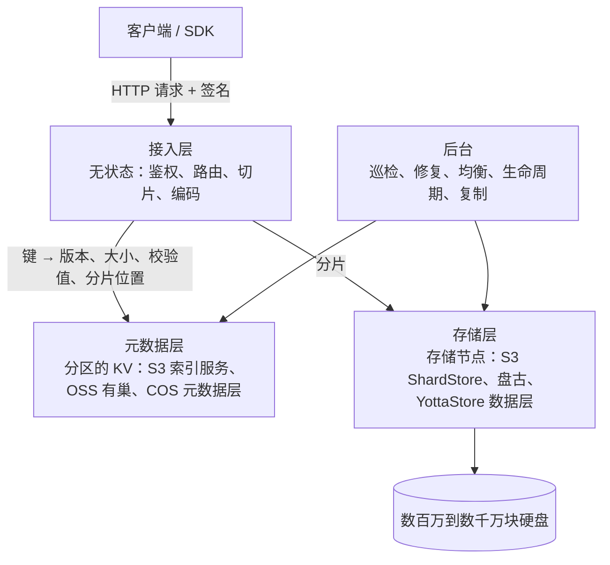

# 对象存储：S3、COS 与 OSS

2006 年 3 月 14 日，亚马逊发了一篇不长的新闻稿，宣布推出 Amazon S3。稿子里的功能清单只有四条：写入、读取、删除 1 字节到 5 GB 的对象，对象个数不限；每个对象用开发者自己起的键来存取；对象可以设成私有或公开；接口是 REST 和 SOAP。价格是每 GB 每月 15 美分（[新闻稿](https://press.aboutamazon.com/2006/3/amazon-web-services-launches)）。按 AWS 在二十周年时的回顾，那时整个 S3 大约只有 1 PB 容量，约 400 台存储节点，装在三个数据中心的 15 个机架里，总带宽 15 Gbps（[Twenty years of Amazon S3](https://aws.amazon.com/blogs/aws/twenty-years-of-amazon-s3-and-building-whats-next/)）。

二十年后，S3 存着超过 500 万亿个对象、数百 EB 数据，每秒处理超过 2 亿个请求；单个对象的上限从 5 GB 涨到 50 TB，价格降到每 GB 两美分出头。还有一件事不太引人注意：2006 年写的调用代码，今天仍然能跑。接口几乎没动，下面处理请求的代码却已经全部重写过，数据也跟着换了好几代硬盘和存储系统。

腾讯云的 [COS](https://cloud.tencent.com/document/product/436/6222)、阿里云的 [OSS](https://help.aliyun.com/zh/oss/user-guide/what-is-oss)，以及 Ceph、MinIO 这些开源系统，对外都是同一种形状：桶、键、HTTP。这篇文章想讲清楚这个形状下面有什么：一个对象存储由哪些组件拼成，每个组件管哪一段，它们为什么长成今天这样。

整篇文章只有一条主线：**把“名字”和“字节”分开管，再把字节摊到尽可能多的盘上。** 前半句决定了对象存储的组件怎么切，后半句决定了每个组件要解决什么难题。后面讲到的元数据服务、纠删码、强一致、冷热分层，都是在回答这两句话带出来的问题。

## 三种存储，三种约定

先看对象存储和它的两个邻居有什么不同。

块存储给你一块“盘”。它只认编号：第几号块，写进去 4 KB。这些块拼成了什么文件，它不知道也不关心。数据库、虚拟机的系统盘都跑在块存储上，因为它们需要在任意位置改几个字节，而且默认这块盘只挂在一台机器上。

文件存储在块上面加了一层目录树，并向你承诺很多事：路径可以一层层进入，文件可以在中间随机改写，改名是原子的，多个进程可以加锁。这些承诺都要靠元数据来兑现：每个文件有 inode，每个目录有目录项，改名要同时动两个目录，加锁要有人记住锁在谁手里。在一台机器上，这些都很便宜；放到几千台机器、几千亿个文件上，它们就成了最难扩展的部分。

对象存储把这些承诺砍掉了一大半。一个对象由三样东西组成：一段数据；描述它的元数据，比如大小、类型、校验值和用户自定义的标签；以及它在桶里唯一的键。对象只能整个上传、整个下载，或者按字节范围读其中一段，不能打开之后跳到中间改 4 个字节。要改内容，就上传一个同名的新对象，把旧的盖掉。

键可以写成 `photos/2026/a.jpg`，控制台也会按 `/` 画出文件夹，但这只是显示效果。桶里其实是平的，`/` 只是键里一个普通字符。“列目录”其实是“列出所有以 `photos/2026/` 开头的键”，而且分页返回。把 `a/b` 改名成 `c/b`，实际是先复制一份到新键，再删掉旧键，中间别人可能同时看见两份。

砍掉这些承诺，换来的是扩展性。没有目录树，创建对象时就不用锁住父目录；没有随机写，一个对象写完就不再变，缓存、复制、校验都简单得多；没有挂载，任何能发 HTTP 请求的程序都能直接用。所以对象存储适合放图片、视频、日志、备份、安装包、模型权重和数据湖里的列式文件，不适合给 MySQL 当数据盘。

## 一个想法的来路

“把名字和字节分开管”并不是 S3 发明的。

### 会自己管对象的硬盘

1990 年代中期，卡内基梅隆大学的 Garth Gibson 带着并行数据实验室研究一个问题：在分布式文件系统里，所有数据都要先经过文件服务器，再转给客户端，服务器成了瓶颈。他们提出了 NASD（Network-Attached Secure Disks，网络直连安全磁盘）：硬盘不再只认块号，而是对外提供长度可变的“对象”；读写这类高频操作由客户端直接找硬盘，建目录、改名这类名字空间操作才去找文件管理器。文件管理器发给客户端一张带密码学签名的“凭证”，硬盘验过凭证就放行（[A Case for Network-Attached Secure Disks](https://pdl.cmu.edu/PDL-FTP/NASD/TR96-142.pdf)）。

对象存储的骨架在这里已经能看到了：数据路径和元数据路径分开，数据直接在客户端和存储设备之间流动，权限用可以验证的签名来表达。后来 S3 的请求签名和预签名链接，和这张凭证是同一个思路。

NASD 后来进了行业标准。存储网络工业协会（SNIA）和负责 SCSI 标准的 T10 委员会接手这项工作，2005 年 1 月，第一版对象存储设备（OSD）标准获批，编号 ANSI/INCITS 400-2004（[Panasas 在 MSST 2006 的报告](https://msstconference.org/MSST-history/2006/Presentations/panasas.dnagle.pdf)）。Gibson 创办的 Panasas，以及超算领域常用的 Lustre，都采用了这套思想。不过，“对象硬盘”作为一种硬件接口并没有普及开。活下来的是想法，不是接口：对象这层抽象最后被做进了软件，跑在一堆普通硬盘和服务器上。

### 一个主节点管名字，一群节点管数据

2003 年，Google 发表了 [GFS 论文](https://research.google/pubs/the-google-file-system/)。GFS 把文件切成 64 MB 的块，每块默认存三份，放在一群数据服务器上；整个集群只有一个 master，记着“哪个文件由哪些块组成、每块在哪几台机器上”。客户端先问 master 拿到位置，再直接找数据服务器读写。名字和字节分开管的思路，在这里变成了一个能跑在数千台机器上的系统。

GFS 对外仍然是文件系统，只是为了能扩展，放松了很多 POSIX 的承诺。三年后的 S3 走得更远：干脆不假装自己是文件系统。

### S3：把这套东西搬到公网上

S3 的新闻稿里列了一串设计原则：去中心化、异步、自治、每个组件自己负责自己的一致性、把故障当成常态、节点对称、尽量简单。其中一句写得很直白：系统要把规模当成优势，加节点应该让可用性、速度、吞吐和容量都变好，而不是变差。另一句是：S3 刻意只提供最小的功能集。

最小功能集，就是上一节说的那几刀：不要目录树、不要随机写、不要锁、不要挂载。砍掉这些，名字和字节才能真正拆开，各自独立地扩展。

### 开源世界的两种做法

同一年，加州大学圣克鲁兹分校的 Sage Weil 在 OSDI 上发表了 Ceph。Ceph 的底座叫 RADOS，是由许多对象存储守护进程（OSD）组成的对象库。它最有名的是 CRUSH 算法：对象先哈希到某个“放置组”，放置组再由 CRUSH 按集群拓扑算出应该放在哪几个 OSD 上。任何一方只要拿着一张很小的集群图，就能自己算出任何对象在哪，不需要查一张巨大的位置表（[Ceph, OSDI 2006](https://www.usenix.org/legacy/event/osdi06/tech/full_papers/weil/weil_html/index.html)）。2009 年，Ceph 加上了 radosgw，对外提供兼容 S3 和 Swift 的接口（[Ceph Turns 10](https://www.redhat.com/en/blog/ceph-turns-10-look-back)）。

2010 年，Rackspace 把自家 Cloud Files 的代码开源，成为 OpenStack 的对象存储 Swift。Swift 用一个叫“环”（ring）的结构把对象名映射到设备：对名字做 MD5，落到某个分区，每个分区默认在不同的故障域里放三份。环由运维工具离线生成，再分发给所有节点（[Swift 架构文档](https://docs.openstack.org/swift/latest/overview_architecture.html)）。

Ceph 和 Swift 代表“算出来”的路线：对象的位置由哈希和拓扑算出来，不用存。S3、GFS 以及后面会讲到的 OSS、COS 走的是“记下来”的路线：由一个可以水平扩展的元数据服务，记住每个对象的每一片在哪。前者省掉了一个大服务，但扩容时要搬哪些数据由算法决定；后者要多维护一个服务，换来放置上的灵活，想放哪就放哪。

### Haystack：文件系统的元数据是小对象的敌人

2010 年，Facebook 在 OSDI 上发表了 Haystack，讲他们怎么存照片。当时 Facebook 已经存了 2600 亿张图片、超过 20 PB，每周新增 10 亿张，高峰时每秒要送出一百多万张（[Haystack, OSDI 2010](https://www.usenix.org/conference/osdi10/finding-needle-haystack-facebooks-photo-storage)）。

最初，他们把每张照片存成 NAS 上的一个文件，通过 NFS 读取。问题出在元数据上：一个目录里放几千个文件时，读一张照片常常要十次以上磁盘操作；把目录缩小到几百个文件之后，仍然要三次：一次读目录，一次读 inode，第三次才读到照片本身。三分之二的磁盘操作都花在“找”上，而不是“读”上。

Haystack 的做法是把成千上万张照片顺序追加进一个大文件，每张照片叫一根 needle（针），每台存储机在内存里维护一张小索引：照片 ID 对应大文件里的偏移和长度。这样读一张照片最多只要一次磁盘操作。

这篇论文把对象存储的一个核心判断说得很清楚：对象又小又多时，如果一个对象存成一个文件，文件系统的元数据开销会压垮磁盘。所以对象存储的底层几乎都不这么做，而是把许多对象或对象的分片打包进大块的连续区域，自己维护索引。后面讲到的 S3 ShardStore、盘古的追加写设计、YottaStore 直接操作块设备的单机引擎，都是这个思路。

到 2010 年前后，这些系统已经收敛到同一个形状：一层接请求，一层管名字，一层管字节，还有一群后台进程在修修补补。

## 硬盘：一切设计的起点

讲组件之前，还得先认识这些组件要对付的对手。对象存储的绝大部分字节放在机械硬盘上，而机械硬盘有一个几十年没改掉的毛病。

S3 的副总裁、杰出工程师 Andy Warfield 在 2023 年的文章里算过一笔账：从 1956 年 IBM 的 RAMAC 到当时最大的 26 TB 硬盘，容量涨了约 720 万倍，每字节价格降了约 60 亿倍，随机寻道却只快了约 150 倍。原因是磁头要摆动、盘片要旋转，机械动作快不了多少。一块硬盘拼命做随机读写，大约每秒 120 次。S3 上线的 2006 年差不多就是这个数，再早十年也差不多。行业路线图指向 200 TB 的硬盘，到那时，如果把随机访问平摊到盘上的全部数据，每 2 TB 数据每秒只能分到 1 次 I/O（[Building and operating a pretty big storage system called S3](https://www.allthingsdistributed.com/2023/07/building-and-operating-a-pretty-big-storage-system.html)）。

S3 的工程师在 re:Invent 2024 上把一次随机读拆开来算：等盘片转到位置，平均约 4 毫秒；磁头平均要移动半个盘面，又是约 4 毫秒；再读出半兆字节的分片，约 2 毫秒。加起来大约 10 毫秒（[Dive deep on Amazon S3](https://www.youtube.com/watch?v=NXehLy7IiPM)）。

硬盘还会读错。Warfield 打过一个比方：把磁头放大成一架 747，它以每小时 75 英里的速度掠过草地，离草尖只有两张纸厚；每根草是一个比特，它每绕地球两万五千圈才会漏数一根。换算下来是 10^15 分之一的误码率。听起来极小，但在 S3 的规模下，这根草“漏得挺频繁”，必须算进设计里。

这几个数字，解释了对象存储的大部分设计：

- 容量便宜、I/O 贵，所以要尽量用大盘，同时让每块盘上的请求尽量少、尽量均匀；
- 顺序写远比随机写便宜，所以单机存储层几乎都采用追加写；
- 硬盘一定会坏、会读错，所以数据必须冗余，而且要不停地检查和修复；
- 单块硬盘很慢，所以一个大请求想快，只能同时动用很多块盘。

Warfield 把单块盘上的请求密度叫作“热度”（heat）。几块盘太热，请求就在那里排队；这种排队还会被上层放大：元数据查找要等它，纠删码凑齐分片也要等它，最后变成少数特别慢的请求，也就是尾延迟。

下面这些组件，都可以看成是在和这块每秒只能随机读写 120 次的硬盘周旋。

## 一次 PUT 穿过的四层

Warfield 描述 S3 最高一层的结构时，只画了四个方框：面向 HTTP 的前端机群、负责命名空间的索引服务、装满硬盘的存储机群，以及做复制、分层这类“数据服务”的后台机群。每个方框背后都是一个团队和一个机群，展开之后是几百个通过接口协作的微服务。

阿里云 OSS 公开的模块几乎一一对应：协议接入层和前端机负责收请求、做鉴权；自研的分布式 KV “有巢”存对象的元数据；飞天的分布式存储系统“盘古”存数据；分布式一致性服务“女娲”负责选主和协调（[OSS 可用性 SLA 技术揭秘](https://developer.aliyun.com/article/766513)）。腾讯云 COS 的底层引擎 YottaStore 分为接入层、元数据缓存层、元数据存储层和数据存储层，另外还有空间分配、校验修复、数据均衡、健康管理、集群管理五个子系统（[YottaStore 介绍](https://cloud.tencent.com/developer/article/2029420)）。

名字各不相同，切法却是一样的：

下面跟着一次上传，逐层看每个组件在做什么。

### 接入层：谁的请求都接，什么状态都不留

请求的第一站是 DNS。S3 现在推荐把桶名放进域名，比如 `https://my-bucket.s3.us-west-2.amazonaws.com/photos/a.jpg`，这叫“虚拟主机风格”。早年常见的是“路径风格”，桶名放在路径里：`https://s3.amazonaws.com/my-bucket/photos/a.jpg`。路径风格的问题是所有桶共用一个域名，DNS 没法按桶把流量引到不同的地方。2019 年，AWS 宣布要废弃路径风格，客户反对后改成：2020 年 9 月 30 日之前建的桶继续支持，之后的新桶必须用虚拟主机风格；后来连这个期限也推迟了（[Path Deprecation Plan](https://aws.amazon.com/blogs/aws/amazon-s3-path-deprecation-plan-the-rest-of-the-story/)）。COS 的域名形如 `桶名-APPID.cos.地域.myqcloud.com`，OSS 形如 `桶名.oss-地域.aliyuncs.com`，都是把桶名放进域名。

DNS 返回的是一组前端机的 IP。S3 故意让不同的客户，甚至同一个客户的不同次解析，拿到不同的一组 IP，这样一个流量特别大的客户不会和别人挤在同一批前端机上。前端机是无状态的：桶不绑定到特定的服务器，任何一台前端都能服务任何一个桶。这让 SDK 可以放心重试：一次请求失败了或者特别慢，就换个 IP 再发。S3 的 SDK 底层库还会在请求慢到超过 P95 时主动取消、换一台重发。换一台，很可能落到完全不同的前端机和磁盘上，第二次往往更快。这个做法把尾部的慢请求压下去了一大截（[re:Invent 2024](https://www.youtube.com/watch?v=NXehLy7IiPM)）。

请求到了前端机，先要验明身份。S3 现在用的是签名 V4（[SigV4](https://docs.aws.amazon.com/AmazonS3/latest/API/sig-v4-authenticating-requests.html)）：客户端用自己的密钥，对请求方法、路径、关键头部、时间和作用范围算出一个 HMAC 签名，附在请求里；服务端用同一把密钥再算一遍，对得上才放行。密钥本身从不在网络上传输。预签名链接就是把这个签名提前算好，设一个过期时间，交给浏览器或者另一台机器；在有效期内，拿着链接的人可以做、也只能做签名里写明的那一个操作。COS 和 OSS 的签名细节不同，思路一样。这和 NASD 那张“管理者签发、硬盘验证”的凭证是同一个想法。

鉴权之后，接入层还有一件重活：把对象切成分片，算好冗余，发给存储层。腾讯的 YottaStore 特别强调，它的纠删码就在接入层在线完成，数据一进来就编码，直接写到存储节点。这一点放到讲纠删码时再展开。

### 元数据层：一张“名字到位置”的表

元数据层记录每个键的当前状态：有没有这个对象，当前是哪个版本，多大，校验值是多少，数据分片在哪些存储节点上。亚马逊 CTO Werner Vogels 描述过它的角色：这个子系统在 GET、PUT、DELETE 的必经之路上，LIST 和 HEAD 则完全由它来回答（[Diving Deep on S3 Consistency](https://www.allthingsdistributed.com/2021/04/s3-strong-consistency.html)）。

对象存储能“无限扩展”，很大程度上是因为元数据层能切分。它本质上是一个按键排序、按范围分区的分布式 KV：一段连续的键归一个分区管，分区太热或太大，就再切开，分到更多机器上。

这一点直接体现在 S3 的性能规则里。按 S3 的文档，每个“已分区的前缀”每秒至少能承受 3500 次写类请求（PUT/COPY/POST/DELETE）和 5500 次读类请求（GET/HEAD），前缀的个数不限。某个前缀突然变热，S3 会自动把它切开；切分完成之前，客户端可能暂时收到 503 Slow Down（[S3 性能优化](https://docs.aws.amazon.com/AmazonS3/latest/userguide/optimizing-performance.html)）。

这条规则背后还有一段演进。早年 S3 的官方建议是在键的开头加一段随机字符，比如用哈希值当前缀，让请求均匀落到不同分区；按日期顺序命名的键，会让新写入全挤在同一个分区的末尾。2018 年 7 月，S3 提高了每个前缀的请求能力，同时撤销了“随机化前缀”的建议，说按逻辑或顺序命名不再影响性能（[2018 年公告](https://aws.amazon.com/about-aws/whats-new/2018/07/amazon-s3-announces-increased-request-rate-performance/)）。按范围分区的规则没变，变的是切分更快、更自动，用户不必再为了迁就分区去扭曲自己的命名。

OSS 的有巢 KV 同样是分区的：每个分区组由几个副本组成，副本之间用一致性协议选出一个主节点对外服务，主节点故障或者网络分区时，能快速选出新的主节点接管（[OSS 全栈高可用技术体系解析](https://developer.aliyun.com/article/765215)）。YottaStore 则在元数据存储层前面专门加了一层缓存，免得高频请求直接打到存元数据的节点上。

元数据层还承担“提交”的角色。大文件走分片上传：先申请一个上传 ID，然后并行上传最多一万个分片，哪片失败就重传哪片，最后发一个“完成”请求。那些分片早就躺在存储层里了，“完成”这一下，其实是在元数据层做一次提交：告诉索引，这些片按这个顺序组成这个键。提交之前，这个对象对外不可见；没提交的分片照样占空间、照样计费，所以生命周期规则里要记得清理未完成的分片上传。

### 存储层：把字节摊到尽可能多的盘上

存储层拿到分片以后，要决定放在哪些盘上。这是和硬盘周旋最直接的地方。

S3 的第一条原则是：同一个桶的数据要散到尽可能多的盘上，每个客户的数据只占每块盘很小的一部分。一个对象的分片可能分布在几十块盘上，不同的对象又故意放在不同的几组盘上。这种做法叫“洗牌分片”（shuffle sharding）。好处有两个。一是隔离：单个客户再怎么集中访问，也很难压垮某一块盘。二是爆发力：Warfield 举的例子是一个做基因组分析的客户，同时用几千个 Lambda 函数并行读数据，这一波突发可以由超过一百万块盘一起接住。他说 S3 有数以万计的客户，桶里的数据分布在超过一百万块盘上。

这背后是一个统计事实：单个工作负载非常“尖”，平时几乎不动，偶尔突然爆发；但成千上万个互不相关的负载叠在一起，总需求就变得平滑、可以预测。规模大到一定程度，任何单个负载都几乎左右不了整体的峰值。小系统很难预测一份数据以后会不会变热；S3 不需要预测，因为它足够大，可以靠负载之间“不相关”来摊平。

具体到放置算法，S3 用的是一个经典技巧：“两次随机选择”（power of two random choices）。完全随机地挑盘，各块盘的用量会慢慢变得不均；每次都查遍所有盘再挑最空的，代价又太高。折中的办法是随机挑两块，放到其中更空的那块上。只看两块盘这么一点信息，效果就已经非常接近全局最优（[re:Invent 2024](https://www.youtube.com/watch?v=NXehLy7IiPM)）。

分片到了某块盘所在的存储节点，就轮到单机存储引擎上场。S3 在每个存储节点上跑的是自己写的 ShardStore。2021 年的 SOSP 论文和 Warfield 的文章描述了它的样子：它是一个键值存储，键是分片的标识；索引用 LSM 树，分片的正文放在树外的连续区域里，以减少写放大；磁盘上的区域按顺序追加，把写入从随机变成顺序；崩溃一致性采用 soft updates 的思路，一次写所依赖的写都落盘之后，才把它发往磁盘，而不必每次写都走一遍完整的预写日志（[Using Lightweight Formal Methods to Validate a Key-Value Storage Node in Amazon S3](https://dl.acm.org/doi/10.1145/3477132.3483540)）。

ShardStore 是用 Rust 从头重写的。团队在同一个代码仓库里放了一份同样用 Rust 写的“可执行规格”：去掉真实磁盘的所有细节，只保留逻辑，体积大约是实现的 1%。每次提交代码，都用基于性质的测试自动生成大量操作序列，检查真实实现和规格的行为是否一致。Warfield 说，对着一块每秒只能做 120 次 I/O 的硬盘，根本做不到这个量级的测试。二十周年的回顾里补充说，过去八年，S3 请求路径上对性能要求高的代码一直在逐步改写成 Rust，数据搬运和磁盘存储这两块已经改完。

国内两家的单机层走的是相近的路。盘古的 FAST 2023 论文写到，盘古 1.0（2009 到 2015 年）建在 Linux 的 Ext4 和内核 TCP 之上，那时客户最关心的是能存多少，而不是多快；为了用好 SSD 和 RDMA，盘古 2.0 设计了统一的、只追加的持久化层和“自包含”的块布局，让一次写不必分别写数据和元数据两次，数据节点也改成在用户态运行，绕过内核的文件系统和网络栈（[More Than Capacity, FAST 2023](https://www.usenix.org/system/files/fast23-li-qiang_more.pdf)）。YottaStore 用的也是自研的、直接操作块设备的单机引擎。三家不约而同地抛开了通用文件系统，Haystack 当年指出的那个问题，今天仍然成立。

### 后台：一群永远不下班的修补匠

用户收到“上传成功”，这个对象的故事才刚开始。后台机群不在任何请求的返回路径上，却决定了数据能不能存上二十年。

最重要的是巡检和修复。S3 有一组审计服务持续检查整个机群里的每一个字节，一旦发现退化的迹象，就触发修复：某块盘坏了，或者某个分片读出来校验不对，就用剩下的分片把它算回来，写到别的盘上。二十周年的文章写道，11 个 9 的持久性目标，反映的是冗余存几份、负责“重新复制”的机群有多大。盘坏得快不可怕，只要修得比坏得快。

其次是均衡。放置时的判断会过时：数据会变冷，新机架会上线。S3 会持续把数据挪来挪去，重新平衡各个机架、各块盘的热度。新机架刚上线时是空的，如果新写入全落在上面，这批新盘就会变成热点；所以 S3 会先往新机架搬进一批已有的冷数据，腾出老盘上的空间，让新来的热数据仍然落在尽可能多的盘上（[re:Invent 2024](https://www.youtube.com/watch?v=NXehLy7IiPM)）。

再次是生命周期和各种数据服务：到期的对象要删，没完成的分片上传要清理，长期没人访问的对象要转到更便宜的存储类型，跨区域复制要把数据异步拷到另一个区域。

YottaStore 的设计者把这件事说得更直白：一个集群想扩展到百万节点，就不能有一个什么都管的 Master。他们把传统 Master 的职能拆成空间分配、校验修复、数据均衡、健康管理、集群管理几个子系统，各自独立扩展。S3 那个“后台机群”的方框展开之后，也是一堆各管一摊的服务。

## 冗余：从三副本到纠删码

存储层还要回答一个问题：每份数据存几份，怎么存。这是对象存储里演进脉络最清楚的一条线。

先分清两个常被混用的词。持久性说的是数据会不会丢；可用性说的是此刻的请求能不能得到响应。一个机房断电，数据没丢但暂时读不到，这是可用性问题；三块盘同时坏掉而且来不及修，才是持久性问题。

### 三副本：简单，读得快，但是贵

最直观的办法是多存几份。GFS 默认三副本，Swift 默认三副本，Ceph 早期也以副本为主。副本的好处是简单，读的时候还能挑最不忙的那一份，在和硬盘热度的较量里这是很大的优势。缺点是贵：三副本就是三倍的盘。

Facebook 的 Haystack 更贵。它把每张照片存三份：两份在同一个数据中心的不同机架上，第三份在另一个数据中心；而每台机器内部还用了硬件 RAID-6，本身就有 1.2 倍的开销。算下来，有效复制因子是 3 × 1.2 = 3.6，存 1 字节照片要占 3.6 字节的盘（[f4, OSDI 2014](https://www.usenix.org/conference/osdi14/technical-sessions/presentation/muralidhar)）。

### 纠删码：用计算换空间

纠删码的思路是：把数据切成 k 份，再用数学方法算出 m 份校验块；这 k+m 份里，任意 k 份都能还原出原始数据。最常用的是 Reed-Solomon 码。

S3 的工程师在 re:Invent 2024 上举过一个例子：把一个 1 MB 的对象切成 5 个分片，再算出 4 个校验分片，一共 9 片，任意 5 片就能拼回整个对象。一个区域通常有三个可用区，每个可用区放 3 片；即使整整一个可用区不可用，也还剩 6 片，够用。这套方案能容忍任意 4 块盘同时丢失，开销只有 1.8 倍；如果用副本达到同样的容错能力，得存 5 份。这只是演讲里的示意，S3 没有公布实际用的 k 和 m，而且它同时使用副本和纠删码，按数据的特点来选。

纠删码的代价在读和修上。用副本时，读一份就够；用纠删码时，如果存数据分片的某块盘很忙，读请求就得等它，或者绕道去读校验块再把数据算回来。修复更贵：比如用 RS(12,4) 编码时丢了一块，要读另外 12 块才能把它算回来，网络和磁盘的流量是副本方案的很多倍。

### 纠删码的演进：从冷数据开始，一路推向热数据

业界使用纠删码，是从最冷、最不怕慢的数据开始的。

Facebook 在 HDFS 上做过 HDFS-RAID：新写入的数据先存三副本；一天后改成 XOR 编码，有效复制因子降到 2.2；一个月后把小文件压实成大文件，再改成 RS(10,4)，降到 1.4（[Saving capacity with HDFS RAID](https://engineering.fb.com/2014/06/05/core-infra/saving-capacity-with-hdfs-raid/)）。

2012 年，微软在 USENIX ATC 上发表了 Windows Azure Storage 的纠删码论文。他们发现，真正要紧的是修复成本：多数时候只是一块盘暂时离线，为了读它上面那一块数据，就要去读另外 12 块，太贵了。于是他们设计了局部重建码（LRC）：12 个数据块分成两组，每组 6 个，各配一个局部校验块，再加 2 个全局校验块，记作 LRC(12,2,2)。开销仍然是 16/12，约 1.33 倍，但坏了一块只需要读同组的 6 块就能修好，修复代价减半，持久性还高于三副本。论文里另一个细节也很说明问题：数据刚写入、还在追加的时候，先存三副本；攒到大约 3 GB 封口之后，再由后台慢慢转成纠删码，转完删掉副本（[Erasure Coding in Windows Azure Storage](https://www.usenix.org/conference/atc12/erasure-coding-windows-azure-storage)）。同一份材料还提到，Google 的第二代文件系统 Colossus 用的是 RS(6,3)。

2014 年，Facebook 发表了 f4。他们观察到，照片的访问热度和它的年龄高度相关：刚发的照片很热，几个月后就很少有人看了。于是存储被分成两套：Haystack 存热数据，f4 存“温”数据。一个 Haystack 卷写满、变冷之后，整体搬进 f4，用 RS(10,4) 编码，块分散在不同机架上，本地开销 1.4 倍；为了扛住整个数据中心的故障，再把两个数据中心里对应的块做一次 XOR，结果存在第三个数据中心。最终，有效复制因子从 3.6 降到了 2.1。论文发表时，f4 已经存了超过 65 PB 的逻辑数据，省下了超过 53 PB 的盘（[f4, OSDI 2014](https://www.usenix.org/conference/osdi14/technical-sessions/presentation/muralidhar)）。

这几套系统有一个共同点：纠删码是“离线”做的。数据先以副本形式写进来，过一段时间再由后台转码。这样写入路径简单，但要多付一段时间的副本成本，还得多维护一套转码流程。

腾讯的 YottaStore 走的是下一步：在线纠删码。数据在接入层直接编码，编码后的分片直接写进存储节点，中间没有副本缓冲层，也不需要为“副本转纠删码”维护二级索引。他们还指出了离线方案的另一个麻烦：编码块里的对象被删除后会留下空洞，要等空洞多到一定程度，再把整块重写一遍才能回收，回收不及时，还白白耗费大量 I/O；而流式的在线编码配合自研的单机引擎，可以近乎实时地回收删除后的空间（[YottaStore 介绍](https://cloud.tencent.com/developer/article/2029420)）。

从三副本，到先存副本、后台转码，再到数据一进来就编码，这条线的方向很清楚：冗余的开销越压越低，为此付出的复杂度越来越多地被藏进系统内部，用户完全看不到。

### 冗余要散到不同的故障域

分片还得散开。放在同一块盘、同一台机器、同一个机架乃至同一个机房里，一次故障就能把数据和校验一起打掉。

S3 标准存储把数据放在一个区域内至少三个可用区。COS 的多 AZ 存储写得很具体：数据切块，按纠删码生成校验块，再打散到同城三个数据中心的不同机架上，某个机房整体不可用时，其余机房仍能读写（[COS 多 AZ](https://cloud.tencent.com/document/product/436/40548)）。OSS 分为本地冗余（一个可用区内）和同城冗余（跨同城多个可用区）两种（[OSS 存储类型](https://help.aliyun.com/zh/oss/user-guide/overview-53/)）。

各家的设计指标都用一串 9 来写：S3 标准存储是 11 个 9 的持久性、99.99% 的可用性；OSS 是 12 个 9 的持久性、99.995% 的可用性；COS 多 AZ 写的是 12 个 9 的设计可靠性、99.995% 的设计可用性。这些是设计目标，不是对每一份数据的实测，而且取决于修复有多快、运营有多稳。

数字之外还有人。S3 有一道叫“持久性评审”的流程：任何可能影响持久性的改动，都要先写清楚改了什么、可能以哪些方式丢数据、用什么机制挡住。Warfield 说，这道人工流程不在 11 个 9 的统计模型里，但同样重要。

## 一致性：从“最终”到“强”

冗余解决了数据会不会丢，还剩一个问题：写进去之后，什么时候能读到？

### 早年的 S3：大多数时候对，偶尔不对

早期 S3 的一致性规则很绕。在大多数区域，新建一个对象后马上读，能读到，这叫写后读一致；但覆盖一个已有对象，或者删除一个对象之后，别的请求在一段时间内仍可能读到旧内容，或者读到已经删掉的对象，这叫最终一致；列举对象时，也可能暂时漏掉刚写入的键。美国东部那个最老的区域更特殊，连新建对象都只保证最终一致，直到 2015 年 8 月才和其他区域对齐。

原因出在元数据层。Vogels 在 2021 年的文章里解释：S3 的元数据子系统前面有一层为高可用设计的缓存，即使缓存依赖的基础设施出了问题，请求也要能成功。代价是在极少数情况下，写入走了缓存的一部分，读取却查了另一部分，于是读到了旧值（[Diving Deep on S3 Consistency](https://www.allthingsdistributed.com/2021/04/s3-strong-consistency.html)）。

在 2006 年，这对存网站图片和备份的客户不算问题。可 S3 后来成了数据湖的底座，大量程序在上面跑分析和训练：一个任务刚写完一批文件，下一个任务马上去列举和读取，如果读到旧的或者漏掉新的，结果就错了。用户只好自己补一层：Netflix 开源了 s3mper，用 DynamoDB 另记一份“应该存在哪些对象”，以此发现不一致；Hadoop 社区做了 S3Guard，思路相同。

### 2020 年：给元数据缓存加一个“见证者”

2020 年 12 月，S3 宣布所有请求默认强一致，包括覆盖、删除和列举，不额外收费，也不牺牲性能和可用性（[S3 强一致公告](https://aws.amazon.com/blogs/aws/amazon-s3-update-strong-read-after-write-consistency/)）。

最简单的办法是绕过缓存、直接读持久层，但那样会损失性能。S3 的做法借鉴了 CPU 的缓存一致性协议。他们先在持久层里加了新的复制逻辑，能推断出每个对象上各次操作的先后顺序；再在元数据子系统里加了一个新组件，Vogels 称之为“见证者”（witness）：对象每发生一次变化，都会通知它；它只在内存里记很少的状态。读取时，缓存先问见证者，自己手里的值有没有过时：没过时就直接返回，过时了就作废，去持久层重新读。因为见证者状态很少、只在内存里，某台机器挂了可以很快换掉，不用等漫长的状态迁移。

难的是证明它是对的。并发写同一个对象、开着版本控制、版本栈很深、GET/LIST/PUT/DELETE 同时在飞，各种交错组合数不胜数；在 S3 的规模下，十亿分之一的事每天都要发生好几次。团队用了集成测试、对缓存一致性算法的演绎证明、对设计的模型检查，还把模型检查扩展到了可以运行的代码上。Vogels 说，这些验证工作的量比实现本身还大。二十周年的文章补了一句：现在每次有人往索引子系统提交代码，都会有自动证明来检查一致性有没有退化。

国内两家的表述不完全一样。OSS 的产品文档明确写了原子性和强一致：上传成功后对象立即可读，删除成功后对象立即不存在，也不会读到写了一半的对象（[什么是 OSS](https://help.aliyun.com/zh/oss/user-guide/what-is-oss)）。COS 的常见问题里写的是“设计保障数据最终一致性”（[COS 一般性问题](https://cloud.tencent.com/document/product/436/30748)），上传成功后能不能立刻读到、覆盖和列举什么时候可见，要以具体的接口说明为准，不能直接套用 S3 的承诺。

### 2024 年：对象存储也能“比较并交换”了

强一致只保证读到最新的值，还防不住两个写入者互相覆盖。两个程序同时往同一个键写，后到的会悄无声息地盖掉先到的。

2024 年 8 月，S3 支持了条件写：上传时带上 `If-None-Match: *`，如果这个键已经存在，服务端就返回 412，拒绝写入。同年 11 月又加上了 `If-Match`：带上你之前读到的那个版本的 ETag，只有对象在这期间没被别人改过，写入才会成功（[条件写公告](https://aws.amazon.com/about-aws/whats-new/2024/11/amazon-s3-functionality-conditional-writes/)）。这就是分布式系统里常说的“比较并交换”（compare-and-swap）。COS 的 `x-cos-forbid-overwrite` 和 OSS 的 `x-oss-forbid-overwrite` 提供的是“禁止覆盖”，相当于其中的前一半。

这件事的意义在于：很多分布式程序需要一个“谁先提交谁赢”的原子操作，以前只能在对象存储旁边再放一个数据库或锁服务来做。有了条件写，对象存储自己就能当这个裁判。后面会看到，这正是它变成数据底座之前缺的最后一块。

## 冷热：存储类型是怎么长出来的

f4 的那个观察，即数据的热度和它的年龄相关，在整个行业都成立。大部分数据写进去以后，很快就没人看了，但又不能删。给这些数据付和热数据一样的钱不划算，于是存储类型一档一档地长了出来。

S3 的时间线大致如下：

| 年份 | 存储类型 | 取舍 |
| --- | --- | --- |
| 2006 | 标准 | 唯一的一档 |
| 2012 | Glacier | 每 GB 每月 1 美分，取回要等几个小时 |
| 2015 | 标准-低频访问 | 存储更便宜，按取回量另外收费 |
| 2018 | 单可用区-低频、智能分层 | 前者放弃跨可用区冗余；后者按访问情况自动在冷热层之间移动 |
| 2019 | Glacier 深度归档 | 更便宜，取回更慢 |
| 2023 | Express One Zone | 反方向：单可用区、专用硬件、个位数毫秒延迟 |

每往冷的方向走一档，存储单价降一点，同时多出一些限制：取回要收费，有最短存储时长，小对象按最小计费单位算，归档类还要先“解冻”才能读。这些限制对应的是底层真实的成本：更冷的数据可能用更高比例的纠删码、更密的盘，甚至磁带，读一次的代价更高。2012 年的 Glacier 公告写得很明白：S3 为快速取回而优化，Glacier 不是，“我们不是白叫它冰川的”（[Glacier 公告](https://aws.amazon.com/blogs/aws/amazon-glacier-offsite-archival-storage-for-one-penny-per-gb-per-month/)）。

COS 和 OSS 也有同样的阶梯。COS 有标准、低频、智能分层、归档、深度归档（[COS 存储类型](https://cloud.tencent.com/document/product/436/33417)）；OSS 有标准、低频、归档、冷归档、深度冷归档，其中冷归档只提供本地冗余（[OSS 存储类型](https://help.aliyun.com/zh/oss/user-guide/overview-53/)）。腾讯在 QCon 北京 2025 上介绍过他们的冷数据引擎 Berg，称它是国内首个支持纠删码的磁带存储引擎（[QCon 北京 2025](https://qcon.infoq.cn/2025/beijing/presentation/6380)）。

每个对象什么时候变冷，靠人手动决定太累了。所以从 2011 年起有了生命周期规则，例如上传 30 天后转低频，90 天后转归档，一年后删除。2018 年的智能分层更进一步，由系统根据访问记录自动挪动。按 AWS 的说法，客户用智能分层累计省下了超过 60 亿美元。

2023 年的 Express One Zone 是一个有意思的反例，它往“更热”的方向走。数据只放在一个可用区，用专用硬件，号称比标准存储快最多 10 倍，延迟稳定在个位数毫秒，而且用的是一种新的“目录桶”，有真正的层级命名空间（[Express One Zone](https://aws.amazon.com/blogs/aws/new-amazon-s3-express-one-zone-high-performance-storage-class/)）。它放弃了跨可用区的冗余和平面命名空间，换来低延迟。这说明对象存储砍掉的那几刀并不是教条：只要用户愿意付出别的代价，砍掉的东西也可以一样一样地加回来。

## 从“网盘”到数据底座

S3 刚推出时，人们把它当成互联网上的一块大硬盘，用来存图片和备份。二十年后，它越来越像整个数据栈的最底层。

这件事是从数据湖开始的。Hadoop、Spark 这些计算框架原本读写 HDFS，后来越来越多地直接读写对象存储：存储和计算分开以后，存储可以按量付费、无限扩展，计算可以随用随开。Vogels 在 2021 年说，已经有数以万计的客户在 S3 上跑数据湖。前面讲的强一致，很大程度上就是被这类负载逼出来的。

但对象存储的平面命名空间和整对象写入，并不适合直接拿来当数据库的表。于是出现了 Apache Iceberg、Delta Lake 这类“表格式”：数据仍然是对象存储里一堆不可变的列式文件，另外用一组元数据文件记录“这张表当前由哪些文件组成”。更新一张表，就是写出新的数据文件和新的元数据文件，再原子地把“当前版本”的指针切过去。这个原子切换需要的正是比较并交换。以前它只能靠外部的目录服务来做，现在对象存储的条件写就能承担。

S3 也顺着这条路往上长。2024 年底推出 S3 Tables，一种专门存 Iceberg 表的“表桶”，由 S3 自己做压实和快照清理（[S3 Tables](https://aws.amazon.com/about-aws/whats-new/2024/12/amazon-s3-tables-apache-iceberg-tables-analytics-workloads/)）；2025 年初推出 S3 Metadata，把桶里对象的元数据自动整理成可以查询的表，不用再递归列举一个巨大的桶；2025 年 12 月，S3 Vectors 正式可用，单个索引能存 20 亿个向量，用于检索增强生成和语义搜索（[S3 Vectors](https://aws.amazon.com/about-aws/whats-new/2025/12/amazon-s3-vectors-generally-available/)）。

最有意思的是文件系统的回归。2023 年，AWS 推出开源客户端 Mountpoint for S3，把本地的文件读写翻译成 S3 请求，主要面向读多写少的大规模训练。2026 年 4 月又推出了 S3 Files，让一个桶可以通过 NFS 挂载成共享的文件系统，支持创建、读取和改写文件；它底下用 EFS 缓存活跃数据，延迟约 1 毫秒，提供 NFS 的“关闭后再打开可见”一致性，改动再同步回桶里（[S3 Files](https://aws.amazon.com/blogs/aws/launching-s3-files-making-s3-buckets-accessible-as-file-systems/)）。

2006 年，S3 靠砍掉文件系统的承诺换来了扩展性；二十年后，文件系统又被加了回来，只是位置变了：它不再是底座，而是架在对象存储上面的一层可选的视图。底座仍然是那个只认键、整对象写入、名字和字节分开管的系统。

## S3 的接口成了事实标准

S3 的 API 从来没有经过任何标准组织，却成了整个行业的参照。腾讯云 COS、阿里云 OSS 都提供 S3 兼容接口，Ceph 的 RGW 和各家可以私有化部署的对象存储也都实现了它。结果是，为 S3 写的工具和代码，常常换个地址就能用在别的系统上。

开源实现里，MinIO 曾经是最常见的选择：一个用 Go 写的单一可执行文件，几分钟就能跑起一个兼容 S3 的服务，很多项目拿它做本地开发和私有部署的默认存储。2025 年，它的社区版接连收缩：5 月，管理控制台的大部分功能从社区版里移除；下半年，社区版不再发布预编译的二进制和 Docker 镜像，只提供源码；12 月，README 宣布项目进入维护模式，不再接受新功能，只按个案考虑关键的安全修复（[minio/minio#21714](https://github.com/minio/minio/issues/21714)）。依赖它的项目开始评估 Ceph RGW、Garage、SeaweedFS、RustFS 等替代方案。

这种“兼容”是按惯例的兼容，不是按标准的兼容。各家在细节上差异不少，最容易踩坑的有几处：

- ETag 不一定是 MD5。普通上传时，它通常就是内容的 MD5；分片上传完成后，S3 的 ETag 是把各分片的 MD5 拼起来再算一次 MD5，末尾带上分片数，形如 `-3`，和在本地对整个文件算出的 MD5 对不上。要校验整个对象，应该用上传时指定的校验算法；COS 还会在响应里返回 CRC64，供下载端核对。
- 各种上限不同。从 2025 年 12 月起，S3 单个对象最大 50 TB，一次普通上传最大 5 GB，分片最多一万个（[S3 50 TB](https://aws.amazon.com/about-aws/whats-new/2025/12/amazon-s3-maximum-object-size-50-tb/)）；COS 和 OSS 的具体数值不同，规律一样：简单上传有上限，更大的对象走分片上传。
- 扩展功能不通用。OSS 和 COS 提供追加上传，可以不断往对象末尾追加日志；S3 只有 Express One Zone 的目录桶在 2024 年支持了追加。条件写、版本控制、生命周期规则的细节，各家也有出入。
- 一致性承诺不同，前面已经讲过。

## 结语

回到开头那句话：把“名字”和“字节”分开管，再把字节摊到尽可能多的盘上。

前半句决定了组件怎么切。接入层无状态，只负责验明身份、切好分片；元数据层是一张可以不断切分的“名字到位置”的表，一致性和提交都发生在这里；存储层只管把分片可靠地写进盘里；后台负责在盘坏、数据变冷、机架增减的过程中，让这一切持续成立。这种切法从 1990 年代的 NASD 就有了，GFS、Ceph、Haystack、S3、OSS、COS 各有各的实现，形状却几乎一样。

后半句决定了每个组件的难题。一块硬盘每秒只能随机读写大约 120 次，几十年来几乎没变。所以数据要摊到数百万块盘上，靠规模让负载互不相关；冗余从三副本演进到离线纠删码，再到在线纠删码，成本一点点压下来；单机引擎放弃通用文件系统，改成追加写；修复要比损坏更快。

接口这一侧，二十年来 PUT 和 GET 几乎没变，变的是它背后能兑现的承诺：从最终一致到强一致，从只能覆盖到可以比较并交换，从一档存储到一整条冷热阶梯，从存文件到存表和向量，甚至重新挂载成文件系统。对象存储没有取代块存储和文件系统，它成了整个数据栈里最便宜、也最可靠的那一层底座。

## 参考

**起源与前史**

- 亚马逊，[Amazon Web Services Launches](https://press.aboutamazon.com/2006/3/amazon-web-services-launches)，2006-03-14。S3 的首发功能、设计要求和设计原则。
- 亚马逊，[Twenty years of Amazon S3 and building what's next](https://aws.amazon.com/blogs/aws/twenty-years-of-amazon-s3-and-building-whats-next/)，2026-03。首发时的规模、今天的规模、审计修复服务与 Rust 改写。
- Gibson 等，[A Case for Network-Attached Secure Disks](https://pdl.cmu.edu/PDL-FTP/NASD/TR96-142.pdf)，CMU 技术报告，1996。
- Nagle、Welch，[Cluster Storage Systems](https://msstconference.org/MSST-history/2006/Presentations/panasas.dnagle.pdf)，MSST 2006。NASD 到 T10 OSD 标准的历程。
- Ghemawat 等，[The Google File System](https://research.google/pubs/the-google-file-system/)，SOSP 2003。
- Weil 等，[Ceph: A Scalable, High-Performance Distributed File System](https://www.usenix.org/legacy/event/osdi06/tech/full_papers/weil/weil_html/index.html)，OSDI 2006。RADOS 与 CRUSH。
- Red Hat，[Ceph Turns 10: A Look Back](https://www.redhat.com/en/blog/ceph-turns-10-look-back)。radosgw 的由来。
- OpenStack，[Swift Architectural Overview](https://docs.openstack.org/swift/latest/overview_architecture.html)。环的结构。
- Beaver 等，[Finding a Needle in Haystack: Facebook's Photo Storage](https://www.usenix.org/conference/osdi10/finding-needle-haystack-facebooks-photo-storage)，OSDI 2010。

**S3 的内部**

- Andy Warfield，[Building and operating a pretty big storage system called S3](https://www.allthingsdistributed.com/2023/07/building-and-operating-a-pretty-big-storage-system.html)，2023-07。四层结构、硬盘物理、热度管理、纠删码、ShardStore 与持久性评审。
- Seth Markle、James Bornholt，[Dive deep on Amazon S3](https://www.youtube.com/watch?v=NXehLy7IiPM)，re:Invent 2024。洗牌分片、两次随机选择、5+4 纠删码示意、新机架上线时的数据均衡。
- Bornholt 等，[Using Lightweight Formal Methods to Validate a Key-Value Storage Node in Amazon S3](https://dl.acm.org/doi/10.1145/3477132.3483540)，SOSP 2021。
- Werner Vogels，[Diving Deep on S3 Consistency](https://www.allthingsdistributed.com/2021/04/s3-strong-consistency.html)，2021-04。元数据缓存、见证者与形式化验证。
- 亚马逊，[Amazon S3 Update – Strong Read-After-Write Consistency](https://aws.amazon.com/blogs/aws/amazon-s3-update-strong-read-after-write-consistency/)，2020-12。
- 亚马逊，[Amazon S3 Announces Increased Request Rate Performance](https://aws.amazon.com/about-aws/whats-new/2018/07/amazon-s3-announces-increased-request-rate-performance/)，2018-07；[Best practices design patterns: optimizing Amazon S3 performance](https://docs.aws.amazon.com/AmazonS3/latest/userguide/optimizing-performance.html)。
- 亚马逊，[Amazon S3 Path Deprecation Plan – The Rest of the Story](https://aws.amazon.com/blogs/aws/amazon-s3-path-deprecation-plan-the-rest-of-the-story/)，2019-05，2020-09 更新。
- 亚马逊，[Signature Version 4](https://docs.aws.amazon.com/AmazonS3/latest/API/sig-v4-authenticating-requests.html)。

**冗余与纠删码**

- Huang 等，[Erasure Coding in Windows Azure Storage](https://www.usenix.org/conference/atc12/erasure-coding-windows-azure-storage)，USENIX ATC 2012。LRC(12,2,2)。
- Facebook，[Saving capacity with HDFS RAID](https://engineering.fb.com/2014/06/05/core-infra/saving-capacity-with-hdfs-raid/)，2014。
- Muralidhar 等，[f4: Facebook's Warm BLOB Storage System](https://www.usenix.org/conference/osdi14/technical-sessions/presentation/muralidhar)，OSDI 2014。

**COS 与 OSS**

- 腾讯云，[专有云 TCE COS 新一代存储引擎 YottaStore 介绍](https://cloud.tencent.com/developer/article/2029420)。分层架构、五个子系统、在线纠删码。
- QCon 北京 2025，[腾讯超大规模云原生对象存储引擎架构与实践](https://qcon.infoq.cn/2025/beijing/presentation/6380)。YottaStore 与磁带引擎 Berg。
- 腾讯云，[COS 产品概述](https://cloud.tencent.com/document/product/436/6222)、[多 AZ 特性概述](https://cloud.tencent.com/document/product/436/40548)、[存储类型概述](https://cloud.tencent.com/document/product/436/33417)、[一般性问题](https://cloud.tencent.com/document/product/436/30748)。
- 阿里云，[提升 10 倍！阿里云对象存储 OSS 可用性 SLA 技术揭秘](https://developer.aliyun.com/article/766513)；[阿里云 OSS 从物理到软件的全栈高可用技术体系解析](https://developer.aliyun.com/article/765215)。女娲、盘古、有巢的分工。
- Li 等，[More Than Capacity: Performance-oriented Evolution of Pangu in Alibaba](https://www.usenix.org/system/files/fast23-li-qiang_more.pdf)，USENIX FAST 2023。
- 阿里云，[什么是 OSS](https://help.aliyun.com/zh/oss/user-guide/what-is-oss)、[存储类型概述](https://help.aliyun.com/zh/oss/user-guide/overview-53/)。

**接口的演进**

- 亚马逊，[Amazon Glacier: Archival Storage for One Penny Per GB Per Month](https://aws.amazon.com/blogs/aws/amazon-glacier-offsite-archival-storage-for-one-penny-per-gb-per-month/)，2012-08。
- 亚马逊，[Amazon S3 now supports conditional writes](https://aws.amazon.com/about-aws/whats-new/2024/08/amazon-s3-conditional-writes/)，2024-08；[Amazon S3 adds new functionality for conditional writes](https://aws.amazon.com/about-aws/whats-new/2024/11/amazon-s3-functionality-conditional-writes/)，2024-11。
- 亚马逊，[Announcing the new Amazon S3 Express One Zone](https://aws.amazon.com/blogs/aws/new-amazon-s3-express-one-zone-high-performance-storage-class/)，2023-11。
- 亚马逊，[Announcing Amazon S3 Tables](https://aws.amazon.com/about-aws/whats-new/2024/12/amazon-s3-tables-apache-iceberg-tables-analytics-workloads/)，2024-12。
- 亚马逊，[Amazon S3 Vectors is now generally available](https://aws.amazon.com/about-aws/whats-new/2025/12/amazon-s3-vectors-generally-available/)，2025-12。
- 亚马逊，[Amazon S3 increases the maximum object size to 50 TB](https://aws.amazon.com/about-aws/whats-new/2025/12/amazon-s3-maximum-object-size-50-tb/)，2025-12。
- 亚马逊，[Launching S3 Files, making S3 buckets accessible as file systems](https://aws.amazon.com/blogs/aws/launching-s3-files-making-s3-buckets-accessible-as-file-systems/)，2026-04。
- MinIO，[Maintenance Mode（minio/minio#21714）](https://github.com/minio/minio/issues/21714)，2025-12。
