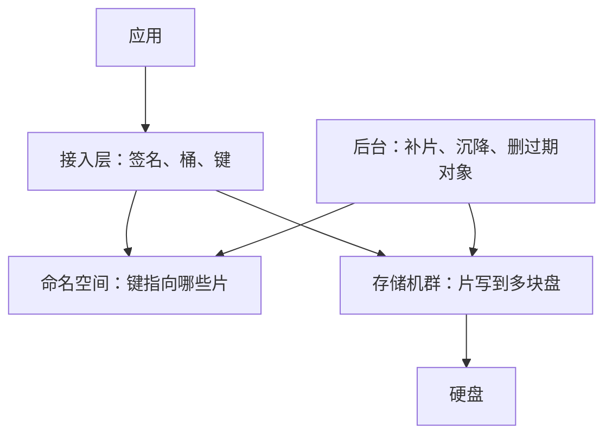

# 对象存储：S3、COS 与 OSS

对象存储把数据放进桶里，用键来找，用 HTTP 上传和下载。S3 从 2006 年 3 月 14 日就这么对外。容量靠加机器涨，一块盘坏了靠副本或纠删码把对象算回来，应用不用把目录树挂在某一台服务器上。COS 和 OSS 对外是同一类接口。内部公开得最细的是 S3：前端、命名空间、硬盘机群、后台修复，最靠近磁盘的一层叫 ShardStore。

三家产品是亚马逊的 [Amazon S3](https://docs.aws.amazon.com/AmazonS3/latest/userguide/Welcome.html)、腾讯云的 [对象存储 COS](https://cloud.tencent.com/document/product/436/6222)、阿里云的 [对象存储 OSS](https://help.aliyun.com/zh/oss/user-guide/what-is-oss)。持久性和可用性数字都是各家自己的设计指标，不是对每一份数据的测量。纠删码的 k 和 m，三家都没有当成固定产品参数公布。

## 应用看到的是键，不是盘

块存储给一台机器一块盘。文件系统再在这块盘上维护目录和“哪个字节在哪个块”。数据库和虚拟机系统盘需要改任意偏移，也假设这块盘一直挂在这台机器上。

对象是三样东西放在一起：一段对外不可分割的数据、描述它的元数据，以及桶里唯一的键。应用不打开文件描述符，也不 seek 到中间改 4 个字节。上传整个对象，或按名字整个下载。要改内容，就上传一个同名新对象盖掉旧的。开了版本控制时，旧内容还会留下。

键可以写成 `photos/2026/a.jpg`。控制台按 `/` 显示成文件夹。桶里面是平的，没有“进入目录要先锁住父目录”。列目录是按前缀列出键，而且分页。把 `a/b` 改成 `c/b`，实际是复制到新键再删旧键，中间别人可能看见两份，也可能只看见一份。这个接口适合图片、日志、备份、数据包和模型权重，不适合拿来当 MySQL 的数据盘。

沙箱里的快照经常落在这层上，正是因为快照是一整份文件，不是客户机里的随机写。AgentENV 可以把提交后的快照放到 S3 兼容的仓库。CubeSandbox 0.7 的跨机暂停把内存和文件系统落到对象存储，默认用内置 MinIO。客户机当时在写的那块盘，仍然是 virtio 块设备或 XFS 卷。对象存储接的是拍完之后的制品，不是虚拟机的系统盘。

DSec 的容器读镜像，走的是另一类系统。文件数据在 3FS 上，格式是 EROFS，按需读。3FS 对外更接近大规模文件系统，强项是大块顺序读，弱项是小块随机读。对象存储的 GET 可以带范围，一次拿回一个分片或一层文件。它不提供“把桶挂成目录、在里面改一个页”的语义。OverlayBD 向仓库要一个字节范围，用的就是这种 GET，不是 POSIX 随机写。

## 一次 PUT 要等索引和冗余都落稳

三家对外都是 REST。常见动作是 PUT、GET、HEAD、DELETE，以及按前缀列出键。大文件走分片上传：先申请一次上传，并行传很多片，最后提交完成请求，服务端再把这些片组成一个对象。某一片失败就重传那一片。S3 公开的限制是单个对象最大 5 TB，一次普通 PUT 最大 5 GB，分片除最后一片外至少 5 MB，一片数最多 10000。COS 和 OSS 的上限不完全相同，形状一样：简单上传有顶，更大的对象走分片。

接入层先确认身份和权限。S3 用 [Signature Version 4](https://docs.aws.amazon.com/AmazonS3/latest/API/sig-v4-authenticating-requests.html)。COS 和 OSS 也在请求里带上时间、作用范围和签名，服务端用同一把密钥重算。预签名链接把这个签名提前算好、设一个过期时间，交给浏览器或另一台机器，窗口期内不用长期密钥。

数据不会只写在收到请求的那一台机器上。命名空间记下这个键当前对应哪些片、校验值是什么、版本是哪一个。片写到足够多的地方、索引也记下映射之后，才向客户端返回成功。OSS 把这件事写进产品语义：PUT 成功时对象已经立即可读，冗余已经写完，不会返回一个只写了一半的对象。删除成功之后，这个对象立即不存在。

索引要回答的问题小：桶里有没有这个键，数据在哪些节点。数据面要回答的问题大：把那几兆或几吉字节放进磁盘。列前缀主要打在索引上，下载大对象主要打在存数据的节点上。容量和文件个数可以分开加机器，靠的是这个切分。

完成分片上传的那一下，是一次索引上的提交。片已经在数据面里，完成请求告诉命名空间：这些片按这个顺序组成这个键。完成请求没发出去，片仍占空间，也会计费。生命周期规则要包含清理未完成的分片，不能只给正式对象写过期时间。

后台不在这条返回成功的路径上。磁盘坏了就把缺的片补到新盘，长期不访问的对象迁到更冷的类型，到期的对象和没完成的分片被删掉。用户看到的成功，只表示这一次写入的冗余已经落稳。

## 硬盘几乎不增加随机能力，放置就成了设计

Andy Warfield 在 2023 年的文章里把 S3 最高层写成四块：面对 HTTP 的前端机群、负责命名空间的服务、装满硬盘的存储机群，以及做复制和分层的后台机群。这四块下面还有几百个用接口协作的服务。图和组织结构长在一起：每一块有自己的团队和机群。他把这个规模写成容易误导，因为每一个框自己又是一堆服务。

硬盘决定了这些服务怎么摆数据。从 1956 年的 RAMAC 到文章发表时最大的 26 TB 盘，容量涨了约 720 万倍，随机寻道只快了约 150 倍，因为磁头和盘片是机械的。随机读写顶在大约每秒 120 次。这个数在 S3 上线的 2006 年就已经差不多，再早十年也差不多。产业路线图指向约 200 TB 的盘。若把随机访问平摊到盘上的全部字节，那就是大约每 2 TB 才允许 1 次 I/O 每秒。S3 还没有 200 TB 的盘，文章写他们打算用。

Warfield 把单块盘上的请求密度叫 heat。放得不均匀，少数盘排队，延迟穿过元数据查找和纠删码要凑齐的那些读，变成尾延迟。写入时还不知道以后谁会读，所以放置不能靠预测单个对象的热度。S3 靠的是把不同对象放到不同的盘组上，让一个桶里的数据占每块盘的比例很小。文章里的数字是：有数以万计的客户，桶铺在数百万块盘上；一次突发，例如几千个 Lambda 同时读基因组数据，可以由超过一百万块盘一起接。单个负载的峰值盖不住全集群的峰值，是因为负载够多、彼此错开。副本和纠删码除了防丢，也让读可以躲开正在忙的那块盘。

盘还会自己读错。文章里把磁头比喻成贴着草地飞的飞机之后，给出约 10^15 次里错 1 次的量级，并写明 S3 要把这种漏读算进设计。持久性不是“盘不会错”，是错了以后系统还能把对象算回来，并且修复流量不要把旁边的盘打满。

## 副本省的是读，纠删码省的是盘

持久性说的是数据会不会丢。可用性说的是这一刻请求能不能得到响应。

多副本最好懂。同一份数据在不同机器上放两三份，坏一份就读另一份。读可以挑不忙的那份。空间要乘以副本数，三副本大约是 3 倍容量。Warfield 写 S3 会用副本，但不会给所有数据都付这份容量。

纠删码用计算换空间。对象分成 k 个数据片，再算出 m 个校验片。k+m 片里只要还有任意 k 片，就能把对象读出来。算法这一类里有 Reed-Solomon。具体的 k 和 m 没有作为固定产品参数公布。冷数据和大对象更倾向纠删码，因为容量是主要成本。读的时候要凑够 k 片，所以一块盘变热，会拖住依赖它的那些对象。这就是 heat 会放大成尾延迟的原因。

片还要散开。放在同一块盘、同一个机架或同一个机房，一次故障会同时打掉数据和校验。S3 标准存储把数据放在一个区域内至少三个可用区。COS 的多 AZ 写得更具体：数据切成块，按纠删码生成校验块，再打散到同城三个数据中心的不同机架；某个机房整体不可用时，其余机房仍能读写。OSS 把冗余分成同城冗余（ZRS）和本地冗余（LRS）。同城冗余跨同城多个机房，本地冗余在同一个可用区内做。OSS 的产品说明还写到，冗余可以在两个存储设施同时损坏时仍不丢数据。冷归档的文档写明只提供本地冗余。

设计指标用一串 9 来写，持久性和可用性要分开。S3 标准存储类的设计持久性是 11 个 9（99.999999999%），设计可用性是 99.99%。只放在一个可用区的存储类，两档都会低一些。OSS 对外是 12 个 9 的数据持久性，以及 99.995% 的数据可用性。COS 多 AZ 写的是 12 个 9 的设计可靠性，以及 99.995% 的设计可用性。这些依赖他们自己的冗余、修复速度和运营。

## 成功之后的读，三家写成的句子不一样

早期 S3 对新键的上传是写完就能读，对覆盖和删除则是最终一致：刚覆盖完，另一个请求仍可能读到旧内容。2020 年 12 月，S3 改成对上传和删除都提供强一致，包括覆盖、删除和列出对象，不另收费。收到成功响应之后，随后的读和列举会看到这次写入。

OSS 把两件事分开写。原子性：操作要么成功要么失败，不存在写了一半、读出来也是一半的对象。强一致：收到 PUT 成功之后立即可读，收到删除成功之后对象立即不存在。COS 的简单上传成功时返回 200。请求带了 Content-MD5 而服务端算出来的值不一致，就拒绝这次上传。下载还可以用响应头里的 CRC64 再对一遍。COS 公开文档里写得更明确的是上传成功和校验和。读后写的适用范围，要以当前接口说明为准，不要直接套 S3 或 OSS 的那句。

没开版本控制时，覆盖同一个键就是用新对象替换旧对象。三家都提供了禁止覆盖的请求头，例如 S3 的条件写、COS 的 `x-cos-forbid-overwrite`、OSS 的禁止覆盖头。开了版本控制之后，同名上传变成新版本，删除往往是放一个删除标记，旧版本还在，直到按版本号真正删掉。版本控制用来对付误删和误覆盖，不用来在一个对象中间改几个字节。

OSS 和 COS 另外提供追加上传，往一个对象末尾加日志。这是少见的、不必整对象覆盖的接口。追加对象和普通对象的语义不要混用。S3 的标准模型里没有这条“只加尾巴”的写。

## S3 靠近磁盘的那一层

ShardStore 是 S3 在每个存储节点上重写过的键值层，不是用户调用的 API。2021 年的 SOSP 论文描述它：节点保存的是客户对象的片，键是片的标识。耐久性靠片在多个节点上的冗余，所以单个节点内部不再为同一片做多副本。索引是 LSM 树。片的正文放在树外面的连续区域里，减少写放大。磁盘上的区域按顺序追加。崩溃一致性用 soft updates：只有依赖已经落盘的写入才会继续往磁盘送，不必给每一次写都走完整的预写日志。论文强调，节点自己的崩溃一致性主要不是为了再堆一层 11 个 9，而是为了避免一块盘坏掉之后，修复流量把另外几十个节点打满。

Warfield 的文章补了工程上的围栏。这一层用 Rust 重写。旁边有一份同样用 Rust 写的可执行规格，丢掉真实磁盘的细节，体积大约是实现的 1%。每次提交用基于性质的测试看实现和规格是否一致。他写这样做的直接原因是：对着一块只有大约 120 IOPS 的硬盘，做不到这种量级的测试。AWS 说这套检查在上线前拦住过崩溃一致性和并发上的问题。

组织上也有一道不在公式里的检查。改动如果会影响持久性，要做 durability review：写下这次改动、可能怎么丢数据、用什么机制挡住。Warfield 把 11 个 9 和这道人工复查并列。数字是冗余和修复算出来的目标，复查是让改代码的人先把丢数据的方式列出来。

## COS 和 OSS 公开到哪一层

COS 和 OSS 没有像那篇文章一样公开四套机群。能确认的是同一套对象模型，加上冗余、存储类型和域名。

COS 的访问域名通常是 `桶名-APPID.cos.地域.myqcloud.com`，权限走 CAM。存储类型按访问频率和取回速度分开，包括标准、低频、智能分层、归档和深度归档，其中一部分有对应的多 AZ。标准类型可以直接读。归档和深度归档要先恢复，恢复要时间，也要取回费用。智能分层在标准层和低频层之间移动，官方说明里这种移动不收取数据取回费。

OSS 的容器叫存储空间，键在空间内唯一。域名常见 `桶名.oss-地域.aliyuncs.com`，权限走 RAM。存储类型包括标准、低频、归档、冷归档和深度冷归档。低频及更冷的类型通常有最小计量（例如 64 KB）和最短存储时间。很小的对象放进低频，账单仍可能按这些下限计算。归档需要解冻后再读，也有归档直读。

阿里云公开过底层分布式存储盘古的演进，论文是 FAST 2023 的 *More Than Capacity*。盘古给云上的块存储和其他存储产品当底座。OSS 的产品文档没有把一次 PUT 展开成盘古的模块名单，它规定的是用户能依赖的结果：成功即完整、成功即可读、冗余已经写好。社区文章里的进程名，不能当成官方架构图。

有几处校验很容易看错。简单上传时，ETag 常常是内容的 MD5。分片上传完成后，S3 的 ETag 是各片 MD5 再做一次 MD5，并带上片数，末尾形如 `-3`。拿它和本地对整个文件算出的 MD5 比，会对不上。要校验整对象，用上传时指定的校验算法，或自己的自定义元数据。COS 在响应里提供 CRC64，下载端可以再算一遍。

存储类型改的是访问成本和延迟，键还是那个键。把还在频繁读的数据放到低频或归档，取回费用会吃掉存储费省下的部分。权限至少分三层：桶策略或 RAM、CAM、IAM 决定谁能调 API；对象的访问控制决定单个对象；预签名链接把某一次上传或下载临时交出去。公开读桶、长期密钥写进前端、预签名链接有效期设成几个月，和冗余无关，但更常见。

## 三家对着看

| 设计轴 | S3 | COS | OSS |
| --- | --- | --- | --- |
| 公开到哪一层 | 四套机群，加上 ShardStore 的论文 | 产品语义、多 AZ 的纠删码打散 | 产品语义。盘古是底层存储的论文，不是 OSS 的接口说明 |
| 标准一类的设计指标 | 持久性 11 个 9，可用性 99.99% | 多 AZ：设计可靠性 12 个 9，设计可用性 99.995% | 持久性 12 个 9，可用性 99.995% |
| 成功之后的读 | 2020 年 12 月起，上传、覆盖、删除、列举都是强一致 | 文档明确的是上传成功和校验和 | 原子，并且 PUT 或删除成功之后立即可见 |
| 冗余怎么写给用户 | 区域内至少三个可用区。副本和纠删码都用，k、m 不公布 | 多 AZ 把数据和校验打到同城三个机房的不同机架 | 同城冗余或本地冗余。冷归档只有本地冗余 |
| 少见的写 | 分片完成是一次提交 | 另有追加上传 | 另有追加上传 |
| 和沙箱的关系 | 快照、层文件可以放进来，当制品仓库 | 同上，S3 兼容接口能对上 | 同上 |

对象存储把“整份对象可靠地放进去、按名字拿出来”做成了 HTTP。它不替代虚拟机的磁盘，也不替代文件系统的随机改写。S3 公开的那部分说明了一件产品文档里不会写的事：盘的随机能力几乎不涨，所以片要摊到很多盘上，读要能躲开热盘，单盘软件要避免一块盘坏掉之后把修复打满邻居。COS 和 OSS 把同一套结果写进了持久性数字、多机房放置，以及“成功就能读到完整对象”。k 和 m 仍在各自的实现里，不在这三份对外说明里。

## 参考

- 亚马逊，[Amazon S3 是什么](https://docs.aws.amazon.com/AmazonS3/latest/userguide/Welcome.html)。
- 亚马逊，[强读后写一致性](https://aws.amazon.com/blogs/aws/amazon-s3-update-strong-read-after-write-consistency/)，2020-12。
- Andy Warfield，[Building and operating a pretty big storage system called S3](https://www.allthingsdistributed.com/2023/07/building-and-operating-a-pretty-big-storage-system.html)，2023-07。四套机群、约 120 IOPS、heat、纠删码和 ShardStore 的规格测试。
- Bornholt 等，[Using Lightweight Formal Methods to Validate a Key-Value Storage Node in Amazon S3](https://dl.acm.org/doi/10.1145/3477132.3483540)，SOSP 2021。片存储、LSM、soft updates。
- 亚马逊，[分片上传](https://docs.aws.amazon.com/AmazonS3/latest/userguide/mpuoverview.html)。
- 腾讯云，[COS 产品概述](https://cloud.tencent.com/document/product/436/6222)。
- 腾讯云，[多 AZ](https://cloud.tencent.com/document/product/436/40548)。同城三个数据中心上的纠删码，以及 12 个 9。
- 腾讯云，[存储类型](https://cloud.tencent.com/document/product/436/33417)。
- 腾讯云，[MD5 校验](https://cloud.tencent.com/document/product/436/32467)。
- 阿里云，[什么是 OSS](https://help.aliyun.com/zh/oss/user-guide/what-is-oss)。12 个 9、原子性和强一致。
- 阿里云，[存储类型](https://help.aliyun.com/zh/oss/user-guide/overview-53/)。同城冗余、本地冗余，冷归档只有本地冗余。
- 阿里云，[分片上传](https://help.aliyun.com/zh/oss/user-guide/multipart-upload)。
- Li 等，[More Than Capacity: Performance-oriented Evolution of Pangu in Alibaba](https://www.usenix.org/conference/fast23/presentation/li-qiang)，USENIX FAST 2023。
