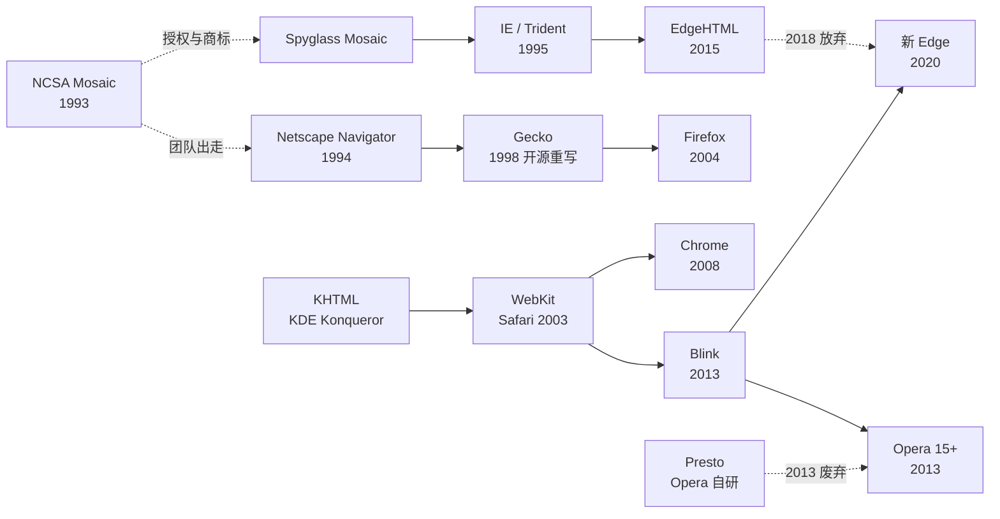

# 浏览器为什么都假装自己是 Mozilla

打开 Chrome 的开发者工具，在控制台里敲 `navigator.userAgent`，你会看到类似这样一行字：

```text
Mozilla/5.0 (Windows NT 10.0; Win64; x64) AppleWebKit/537.36 (KHTML, like Gecko) Chrome/140.0.0.0 Safari/537.36
```

这是浏览器每次发请求时都会附上的“自我介绍”，HTTP 里叫 User-Agent，简称 UA。按照 HTTP 规范的本意，它应该老老实实写上“我是谁、什么版本”（[User-Agent header](https://en.wikipedia.org/wiki/User-Agent_header)）。

可这一行里一共出现了六个名字：Mozilla、AppleWebKit、KHTML、Gecko、Chrome、Safari。其中只有 `Chrome/140` 是真话。`Mozilla` 是一家 1990 年代浏览器公司的内部代号，那家公司 2008 年就不存在了；`AppleWebKit/537.36` 是苹果的渲染引擎，Chrome 在 2013 年就离开了它，这个版本号从此被冻结；`KHTML` 是 KDE 桌面上一个几乎没人用过的浏览器引擎；`like Gecko` 的意思是“我像 Firefox 的引擎”，但它不是；`Safari/537.36` 更是连苹果自己都不会这样写。

微软的 Edge 更进一步，它在这一整串谎言的末尾，再加一个 `Edg/140.0.0.0`。注意，不是 `Edge`，少了一个字母 e。为什么要故意拼错自己的名字？这个问题要到文章最后才能回答。

2008 年，犹他州立大学 WebAIM 的 Aaron Andersen 用仿《圣经·创世记》的笔调写了一篇短文，把这件事讲成了一个“谁生了谁、谁又冒充了谁”的家谱故事，结尾是这样一句话：“于是 Chrome 用着 WebKit，假装自己是 Safari，WebKit 假装自己是 KHTML，KHTML 假装自己是 Gecko，所有的浏览器都假装自己是 Mozilla……用户代理字符串一团糟，几乎毫无用处，每个人都在假装成别人，混乱遍地。”（[History of the browser user-agent string](https://webaim.org/blog/user-agent-string-history/)）

这篇文章想把这份家谱背后的历史完整地讲一遍。它其实就是一部浏览器战争史：一个大学生在实验室里给网页加上了图片；一家以“Mosaic 杀手”为代号的公司创造了互联网历史上最轰动的 IPO；一份叫“互联网浪潮”的备忘录让世界上最大的软件公司掉头；一个十英尺高的字母 e 在午夜被扔到对手的草坪上；一场差点把微软拆成两半的反垄断官司；一个垂死的公司把源代码扔向互联网，希望它能“从灰烬中重生”；一个统治了五年、却让整整一代前端工程师痛苦不堪的 IE6；一群志愿者凑钱在《纽约时报》上买下两个整版；一本提前两天被邮局寄出的漫画；以及最终，微软放弃自己的引擎，改用对手的代码。

UA 字符串里每一个多余的单词，都是这段历史留下的一道疤。

## 序章：一个人的浏览器（1990–1992）

世界上第一个网页浏览器叫 WorldWideWeb，1990 年由 CERN 的 Tim Berners-Lee 在一台 NeXT 电脑上写成。它其实是一个“浏览器兼编辑器”：你可以一边看网页一边改网页，选中一段文字，按 Command-L 就能把它链接到另一个页面。Berners-Lee 后来回忆，NeXT 上现成的工具太好用了，“别的平台要花一年的事，我在 NeXT 上几个月就做完了”。第一版的日期被他俏皮地标成了 901225，也就是 1990 年圣诞节，“但我圣诞节那天可没在工作”。为了避免程序名和那个抽象的信息空间混淆，它后来改名叫 Nexus（[The WorldWideWeb browser](https://www.w3.org/People/Berners-Lee/WorldWideWeb.html)）。

这个浏览器有一个今天看来很奇怪的限制：图片不能和文字排在一起，只能在单独的窗口里打开。而且它只能跑在昂贵的 NeXT 工作站上。

接下来两年里，陆续出现了一批浏览器：给普通终端用的行模式浏览器（Line Mode Browser）、芬兰学生写的 Erwise、伯克利学生写的 ViolaWWW、给 Mac 用的 MacWWW，它们大多基于 CERN 的 libwww 库，功能上都只是“HTML 查看器”，多媒体内容要交给外部程序打开（[Browser wars](https://en.wikipedia.org/wiki/Browser_wars)）。1992 年 11 月，全世界一共只有 26 个网站（[NCSA Mosaic](https://en.wikipedia.org/wiki/Mosaic_(web_browser))）。

那时候没有人需要“假装”成谁。网站少到每一个都有人专门盯着，服务器也不会去看来访的是什么浏览器。

## 第一幕：一个标签（1993–1994）

### IMG

1991 年，美国通过了《高性能计算法案》，给伊利诺伊大学厄巴纳-香槟分校的国家超级计算应用中心（NCSA）带来了一笔新经费。NCSA 的 David Thompson 试用了 ViolaWWW，把它演示给软件组看。组里一个叫 Marc Andreessen 的本科生兼职程序员，和全职员工 Eric Bina 一起，决定给 X Window 写一个更好的浏览器，叫 xmosaic（[NCSA Mosaic](https://en.wikipedia.org/wiki/Mosaic_(web_browser))）。

1993 年 2 月 25 日晚上 9 点，Andreessen 给 www-talk 邮件列表发了一封信，标题是“提议一个新标签：IMG”：

> 我想提议一个新的、可选的 HTML 标签：IMG。必需参数是 SRC="url"。它指定一个位图文件，浏览器应当尝试通过网络把它拉过来，当作图像嵌入到标签所在的文本位置……这是 X Mosaic 需要的功能，我们已经实现了，至少内部会用上。（[proposed new tag: IMG](http://1997.webhistory.org/www.lists/www-talk.1993q1/0182.html)）

邮件里还有一句很能说明那个年代风格的话：“如果浏览器不认识某种图片格式，它想怎么处理都行。”注意这里的顺序：先实现，已经在用了，再来邮件列表上“提议”。这几乎就是此后十年浏览器厂商对待标准的标准姿势。

Mosaic 并不是第一个图形浏览器，但它是第一个把图片和文字排在同一个页面里的浏览器，也是第一个由一支全职团队开发、普通人也能轻松安装的浏览器。1993 年 4 月发布 1.0 版，9 月推出 Windows 和 Mac 版本，11 月的 2.0 版加入了表单，网页第一次可以把数据提交回服务器。到 1994 年年中，每个月的下载量已经有五万次。《连线》杂志在 1994 年 10 月写道，Mosaic“正在成为全世界的标准界面”；以太网的发明者 Bob Metcalfe 的总结更刻薄：在 Web 的第一代，有几个人注意到 Web 可能比 Gopher 好；到了 Mosaic 这一代，几百万人突然发现 Web 可能比性还好（[NCSA Mosaic](https://en.wikipedia.org/wiki/Mosaic_(web_browser))）。

Mosaic 发给服务器的自我介绍非常朴素：`NCSA_Mosaic/2.0 (Windows 3.1)`。名字，斜杠，版本号，括号里是平台。这是 UA 字符串最后一次诚实（[Andersen](https://webaim.org/blog/user-agent-string-history/)）。

### 军火商

大学很快意识到 Mosaic 值钱。NCSA 把 Mosaic 的名字和技术授权给了一批公司，其中最重要的是 Spyglass，一家同样从伊利诺伊大学孵化出来的小公司。Spyglass 的浏览器项目负责人 Eric Sink 后来回忆，他们虽然买了授权，却一行 NCSA 的代码都没用，Windows、Mac、Unix 三个版本全是从头写的。他们的商业模式是做“浏览器战争的军火商”：不卖给最终用户，而是把内核授权给别的公司，由对方打包进自己的产品。最后有超过 120 家公司买了 Spyglass Mosaic，它出现在书附带的光盘里、操作系统里、ATM 机里、机顶盒里（[Eric Sink, Memoirs From the Browser Wars](https://ericsink.com/Browser_Wars.html)）。

其中一家客户，是微软。

## 第二幕：Mosaic 杀手（1994–1995）

### 哥斯拉

1994 年初，Andreessen 从伊利诺伊大学毕业，去了加州。在那里他遇到了刚从自己创办的硅谷图形公司（SGI）离开的 Jim Clark。两人最初讨论的其实不是浏览器，而是给任天堂 64 做一个在线游戏网络，Andreessen 后来说：“如果任天堂早一年出货，我们大概就去做那个了，而不是 Netscape。”（[Netscape](https://en.wikipedia.org/wiki/Netscape)）

1994 年 4 月 4 日，Clark 出钱，两人在山景城成立了 Mosaic Communications Corporation。Clark 飞到厄巴纳，把 NCSA 浏览器团队的核心成员挖走了。Eric Sink 记得，NCSA 团队里有几个人没被邀请参加那次“特别会议”，气得不行，“香槟-厄巴纳是个很小的镇子”（[Eric Sink](https://ericsink.com/Browser_Wars.html)）。

新公司的浏览器内部代号叫 Mozilla，意思是“Mosaic Killer”，Mosaic 杀手，同时也让人联想到那只踩平城市的哥斯拉（Godzilla）。公司的美术员工 Dave Titus 画了一只绿色的、像哥斯拉一样的卡通蜥蜴当吉祥物，放在公司网站最显眼的位置（[Netscape](https://en.wikipedia.org/wiki/Netscape)）。

1994 年 10 月 13 日，第一个预览版 Mosaic Netscape 0.9 发布，四个月之内就拿下了四分之三的浏览器市场。伊利诺伊大学对这家公司用“Mosaic”这个名字很不满，而 Spyglass 手里握着 Mosaic 商标的合法授权。Eric Sink 的描述是：“一些发脾气，加上大量律师工作之后”，公司在 1994 年 11 月改名叫 Netscape Communications，浏览器改叫 Netscape Navigator（[Netscape](https://en.wikipedia.org/wiki/Netscape)，[Eric Sink](https://ericsink.com/Browser_Wars.html)）。

公开的名字改了，但代号留在了一个没什么人会注意的地方：UA 字符串。Netscape 发给服务器的自我介绍是 `Mozilla/1.0 (Win3.1)`（[Andersen](https://webaim.org/blog/user-agent-string-history/)）。

### 一个浏览器定义了 Web

Netscape 一开始就比 Mosaic 好用得多。最直观的改进是“边下载边显示”：以前的浏览器要等页面上所有图片都下载完才显示，拨号上网的用户常常要对着空白页面等上好几分钟；Netscape 可以让你在几秒钟内就开始读文字（[Netscape Navigator](https://en.wikipedia.org/wiki/Netscape_Navigator)）。

接下来一两年里，Netscape 几乎以每个版本一项的速度，发明了今天 Web 的大部分基础设施：Lou Montulli 发明了 Cookie；公司设计了 SSL，也就是后来的 TLS；2.0 版加入了框架（frames）和一门新的脚本语言（[Netscape](https://en.wikipedia.org/wiki/Netscape)）。

那门脚本语言是 Brendan Eich 在 1995 年 5 月用大约十天写出的原型，最早叫 Mocha，后来叫 LiveScript，最后为了蹭 Sun 公司 Java 的热度改名叫 JavaScript（[JavaScript](https://en.wikipedia.org/wiki/JavaScript)）。Eich 后来在博客里澄清，他被 Netscape 招进来时，得到的承诺是“在浏览器里做 Scheme”，但上层管理的指示是这门语言“必须看起来像 Java”，这就排除了 Perl、Python、Tcl 和 Scheme。他说自己并不骄傲，但很高兴选了 Scheme 式的一等函数和 Self 式的原型作为核心；至于从 Java 那里继承来的东西，比如 Date 对象的千年虫问题、`string` 和 `String` 的区分，“是不幸的”（[Brendan Eich, Popularity](https://brendaneich.com/2008/04/popularity/)）。

Netscape 也发明了一些不那么光彩的东西，比如 `<blink>` 标签，让文字一闪一闪（[Blink element](https://en.wikipedia.org/wiki/Blink_element)）。批评者说 Netscape 更热衷于绕过标准委员会、用自己的“事实标准”把 Web 掰向自己，而不是修好自己的 bug（[Netscape Navigator](https://en.wikipedia.org/wiki/Netscape_Navigator)）。

在 Netscape 1.1 里，如果你在地址栏输入 `about:mozilla`，会看到一段黑底白字、模仿《启示录》口吻的“经文”：

> 那兽必在复仇的滚滚烟云中降临。不信者的房屋必被夷平，他们必被焚烧至地。他们的标签必闪烁，直到末日。——《Mozilla 之书》12:10

“兽”就是 Mozilla 自己，“不信者”是那些不守规矩的网页作者，12:10 指的是 Netscape Navigator 1.0 发布的日子。“标签必闪烁”说的是早期 Netscape 在查看源代码时会让写错的标签一闪一闪。这本并不存在的《Mozilla 之书》后来会随着 Netscape 的命运续写新的章节（[The Book of Mozilla](https://en.wikipedia.org/wiki/The_Book_of_Mozilla)）。

### 嗅探的诞生

问题出在框架上。Netscape 2.0 支持框架，Mosaic 不支持。网站管理员想用框架做花哨的页面，又不想让 Mosaic 用户看到一片乱码，于是他们开始在服务器端检查 UA 字符串：以 `Mozilla` 开头的，发带框架的版本；其他的，发简陋版本（[Andersen](https://webaim.org/blog/user-agent-string-history/)）。

这就是“UA 嗅探”（user agent sniffing）。它的逻辑在当时看起来完全合理，而且只需要一行正则表达式。没有人意识到，这一行代码会让此后三十年的每一个浏览器都背上一个不属于自己的名字。

### IPO

1995 年 8 月 9 日，成立仅十六个月、还没有盈利的 Netscape 上市。发行价原定 14 美元，最后一刻翻倍到 28 美元；开盘后一度冲到 75 美元，当天收于 58.25 美元，市值 29 亿美元。“Netscape 时刻”后来成了一个专有名词，指一次宣告新产业诞生的高调 IPO。二十四岁的 Andreessen 光着脚登上了《时代》周刊封面，互联网泡沫由此开始（[Netscape](https://en.wikipedia.org/wiki/Netscape)）。

那段时间，Andreessen 常说一句话：有了浏览器，Windows 就只会剩下“一堆没调试好的设备驱动程序”（a poorly debugged set of device drivers）。意思是，将来应用都会跑在浏览器里，操作系统是什么已经不重要了。多年以后他在《连线》的访谈里坦白，这句话其实是以太网发明者 Bob Metcalfe 说的，“我只是转发了一下”（[Wired, 2012](https://www.wired.com/2012/04/ff-andreessen/)）。

但在 1995 年，这句话是从 Netscape 的明星创始人嘴里说出来的，而它的听众里，有一个人比任何人都在意。

## 第三幕：互联网浪潮（1995）

### 备忘录

1995 年 5 月 26 日，比尔·盖茨给微软的高管们发了一份备忘录，标题叫《互联网浪潮》（The Internet Tidal Wave）：

> 我对互联网重要性的看法经历了几个阶段，一次比一次提高。现在，我把互联网放在最高的重要级别……互联网是自 1981 年 IBM PC 问世以来最重要的单一发展，它甚至比图形用户界面的出现更重要。（[Wired 全文](https://www.wired.com/2010/05/0526bill-gates-internet-memo/)）

盖茨在备忘录里说，他花了十个小时上网冲浪，没看到一个 Word 文档、一个 AVI 文件，也没看到任何一种微软的文件格式。然后他点名了一个“在互联网上出生”的新对手：

> Netscape 的浏览器占据主导地位，份额 70%，这让他们能决定哪些网络扩展会流行。他们在推行一种多平台策略，把关键的 API 转移到客户端，从而把底层操作系统商品化。

“把底层操作系统商品化”，这正是 Andreessen 那句“设备驱动程序”的意思。对一家靠 Windows 吃饭的公司来说，这是生死问题。盖茨的对策写得很清楚：要把浏览器预装进 Windows 95，“目标是让 OEM 厂商出货时预装我们的浏览器”；要把帮助系统换成浏览器的格式，“并利用我们独有的扩展，让人们多一个使用我们浏览器的理由”。备忘录的最后一段有一句后来被反复引用的话：

> 我们进入这个新时代时，会先拥抱（embrace）互联网，再扩展（extend）它。

这句话后来在反垄断案里被补上了第三个动词，成了批评微软时最常用的一个短语：拥抱、扩展、消灭（embrace, extend, extinguish）。

### 买来的浏览器

微软当时并没有自己的浏览器。它先是想收购 BookLink 的浏览器，被美国在线（AOL）抢了先；1995 年 1 月，它和 Spyglass 签了授权协议（[Spyglass, Inc.](https://en.wikipedia.org/wiki/Spyglass,_Inc.)）。Eric Sink 被派到雷德蒙德，作为 Spyglass 的技术联络人帮微软把浏览器集成进代号“芝加哥”的 Windows 95。他回忆，第一天晚上十一点半他回酒店，“我是最早下班的人之一”（[Eric Sink](https://ericsink.com/Browser_Wars.html)）。

1995 年 8 月 24 日，Windows 95 上市，Internet Explorer 1.0 作为 Plus! 附加包的一部分同时发布（[Browser wars](https://en.wikipedia.org/wiki/Browser_wars)）。据 Sink 说，IE 2.0 基本上就是改动不大的 Spyglass Mosaic，IE 3.0 大幅升级但仍以 Spyglass 的代码为主，到 IE 4.0 才接近重写，“但我们的代码还残留着，从某些只属于我们排版引擎的古怪 bug 就能看出来”。IE 的“关于”对话框里一直写着“基于 NCSA Mosaic”，直到 2006 年的 IE7 才删掉（[NCSA Mosaic](https://en.wikipedia.org/wiki/Mosaic_(web_browser))）。

Spyglass 的授权费本来要按销量分成。可微软把 IE 免费送给所有人，于是每个季度只付合同规定的最低金额。Spyglass 不满，双方 1997 年达成新协议，微软付了 800 万美元（[Spyglass, Inc.](https://en.wikipedia.org/wiki/Spyglass,_Inc.)）。更致命的打击来自市场。Spyglass 准备召开第二届 OEM 客户大会时，客户们说不来了，因为微软正在痛打他们。Sink 写道：“我们把浏览器技术卖给了 120 家公司，其中一家屠杀了另外 119 家。”

在 IE 4.0 的开发期间，微软新来的项目经理 Scott Isaacs 在 HTML 标准会议上跟 Sink 聊了一次。Isaacs 说，IE 团队现在有一千多人。“我惊呆了。那是 Spyglass 浏览器团队的 50 倍，几乎相当于整个 Netscape 公司的人数。那一天我就可以写下浏览器的全部后续历史，不可能有别的结局。”（[Eric Sink](https://ericsink.com/Browser_Wars.html)）

### 第一个谎言

IE 刚出来时面临一个现实问题：它也支持框架，但它的名字不是 Mozilla，所以那些嗅探 UA 的网站不给它发带框架的页面。等网站管理员一个个去认识 IE、修改代码？微软等不及。

于是 IE 宣布自己“与 Mozilla 兼容”，UA 写成了这样：

```text
Mozilla/1.22 (compatible; MSIE 2.0; Windows 95)
```

开头是 `Mozilla`，括号里用 `compatible` 小声补充一句“其实我是 MSIE 2.0”。那些只看开头的嗅探代码被骗过去了，IE 拿到了框架。Andersen 的描述是：“微软上下都很高兴，但网站管理员们糊涂了。”（[Andersen](https://webaim.org/blog/user-agent-string-history/)）到 IE3，格式变成 `Mozilla/2.0 (compatible; MSIE 3.02; Windows 95)`，真正的浏览器名和版本被埋在了字符串中间（[Nicholas Zakas, History of the user-agent string](https://humanwhocodes.com/blog/2010/01/12/history-of-the-user-agent-string/)）。

这是浏览器第一次冒充另一个浏览器。它开了一个无法回头的先例：在嗅探代码面前，诚实会受到惩罚。

## 第四幕：第一次浏览器大战（1996–1998）

### 草坪上的 e

1996 年的 IE3 已经基本追上了 Netscape：它有了脚本（微软自己实现了一份 JavaScript 的兼容版，叫 JScript），还率先在商业浏览器里支持了 CSS（[Browser wars](https://en.wikipedia.org/wiki/Browser_wars)）。

此后两年，两家公司以几个月一版的速度互相追赶，每一版都塞进新的私有标签和私有特性：Netscape 有 `<blink>` 和 `<layer>`，IE 有 `<marquee>` 和 `<iframe>`；Netscape 4 有自己的一套 DOM，IE4 有另一套完全不同的 DOM。网页设计师们开始在页面角落贴上“用 Netscape 浏览效果最佳”或者“用 Internet Explorer 浏览效果最佳”的小徽章，意思是“我只在这一个浏览器里测过”。一批主张 Web 标准的人发起了反向运动，做了一个长得很像的徽章，写着“任何浏览器均可浏览”（Viewable with Any Browser）（[Browser wars](https://en.wikipedia.org/wiki/Browser_wars)）。

1997 年 9 月 30 日深夜，微软在旧金山为 IE4 的发布办了一场上千人的派对，比尔·盖茨也在场，舞台上立着一个十英尺高的蓝色字母 e。第二天凌晨一点半左右，有人把这个 e 运到了 Netscape 位于山景城的总部，放在前门的草坪上，附了一张卡片：“来自 IE 团队”。

微软大概以为 Netscape 的人要到早上才会发现，等他们找来设备搬走，媒体已经拍够了照片。可他们忘了，Netscape 的工程师半夜还在上班。一位 Netscape 员工在 rec.humor.funny 新闻组上讲述了接下来发生的事：值夜班的人发现了这个 e，没有浪费力气搬走它，而是招呼同事把它推倒，在朝街的那一面喷上“Netscape Now”，然后把公司那只七英尺高的 Mozilla 哥斯拉塑像扛过来，立在倒下的 e 上面，竖着大拇指咧着嘴笑。据路透社报道，哥斯拉手里还举着一块牌子：“Netscape 72，微软 18”，那是当时的市场份额（[Mozilla stomps IE](http://home.snafu.de/tilman/mozilla/stomps.html)）。

Netscape 的发言人对记者说：“诉诸兄弟会式的把戏来吸引注意，实在很幼稚。我们正在赢得这场战斗。这是你会期待从一家初创公司看到的事，而不是世界上最大的软件公司。”

她说错了一半。Netscape 赢得了那天早上，但没有赢得战斗。

### 切断空气

微软手里有一样 Netscape 永远没有的东西：Windows。每一台新电脑出厂时就装好了 IE，桌面上就有它的图标。那个年代，大多数买电脑的人以前从来没用过浏览器，他们没有任何可以比较的对象，也没有理由去换一个（[Browser wars](https://en.wikipedia.org/wiki/Browser_wars)）。

微软还利用 Windows 的 OEM 授权合同，让电脑厂商和网络服务商预装 IE、而不是 Netscape。1997 年 8 月，微软向陷入困境的苹果投资 1.5 亿美元，条件之一是苹果要把 IE 设为新版 Mac OS 的默认浏览器（[Netscape Navigator](https://en.wikipedia.org/wiki/Netscape_Navigator)）。IE 对所有人免费，包括企业；而 Netscape 长期只对个人和教育用户免费，企业要付费，直到 1998 年 1 月才彻底免费。一家几乎所有收入都来自一个产品的小公司，面对一家可以用 Windows 的利润无限补贴浏览器的巨头，财务上毫无抵抗力。

后来在反垄断庭审中，英特尔副总裁 Steven McGeady 作证说，1995 年微软高管 Paul Maritz 曾对他说，微软打算免费送出一个 Netscape 旗舰产品的克隆，以此“切断 Netscape 的空气供应”（cut off Netscape's air supply）（[United States v. Microsoft Corp.](https://en.wikipedia.org/wiki/United_States_v._Microsoft_Corp.)）。微软的律师说这份证词不可信。

Netscape 也在自己的失误里越陷越深。3.0 金版加入了邮件、新闻组、网页编辑器，4.0 干脆改名叫 Communicator，把 Navigator 变成了套件里的一个组件，名字变了，用户糊涂了，软件越来越大、越来越容易崩溃。Communicator 4 的 CSS 支持尤其糟糕：Netscape 本来押注自己的“JavaScript 样式表”（JSSS），开发末期发现 CSS 要赢，就匆忙写了一个转换器，把 CSS 翻译成 JSSS 再执行，所以在 Netscape 4 里关掉 JavaScript，CSS 也就跟着失效了。窗口一缩放，页面要整个重新下载一遍（[Netscape Navigator](https://en.wikipedia.org/wiki/Netscape_Navigator)）。

1997 年底，Netscape 第一次出现季度亏损；1998 年 1 月，第一轮裁员（[Netscape](https://en.wikipedia.org/wiki/Netscape)）。

## 第五幕：法庭（1998–2004）

1998 年 5 月 18 日，美国司法部联合二十个州和哥伦比亚特区起诉微软，指控它利用 Windows 的垄断地位非法捆绑 IE，打压 Netscape。案子的核心问题是：IE 到底是一个独立的产品，还是 Windows 的一个“功能”？微软坚持是后者，理由是两者已经融为一体、不可分割，而且用户免费得到了浏览器（[United States v. Microsoft Corp.](https://en.wikipedia.org/wiki/United_States_v._Microsoft_Corp.)）。

庭审出了好几个名场面。盖茨在录像作证中和律师争论“竞争”“关心”“询问”甚至“我们”这些词的定义，一遍遍说“我不记得”，节选在法庭上播放时，连法官都笑了出来。微软提交了一段录像，演示从 Windows 里删掉 IE 会导致系统变慢、出错，号称是在一台电脑上连续拍摄的；政府律师发现画面里的桌面图标莫名其妙地消失又出现，微软副总裁 Jim Allchin 最后承认是手下“截错了屏”，重拍后放弃了“删掉 IE 会让 Windows 变慢”的说法。另一段演示 AOL 用户安装 Netscape 有多简单的录像，被政府方用自己拍的录像证明剪掉了一大段繁琐的步骤，微软副总裁 Brad Chase 当庭承认那段录像是造假的。法官问微软能不能提供一个不带 IE 的 Windows，微软的回答是，可以给电脑厂商两个选择：一个过时的 Windows，或者一个不能正常工作的 Windows。

1999 年 11 月，法官 Thomas Penfield Jackson 发布事实认定，认为微软拥有垄断地位，并采取行动打压了苹果、Java、Netscape、Lotus、RealNetworks、Linux 等一系列威胁。2000 年 4 月 3 日，他裁定微软违反《谢尔曼反托拉斯法》；6 月 7 日，下令把微软拆分成两家公司，一家做操作系统，一家做其他软件。

微软上诉。2001 年 6 月 28 日，哥伦比亚特区巡回上诉法院推翻了拆分令，部分原因是 Jackson 在审理期间私下接受媒体采访，违反了法官行为准则。上诉法院没有推翻事实认定，但把案子发回重审。几个月后，小布什政府的司法部宣布不再寻求拆分微软；2001 年 11 月双方和解，微软同意向第三方公开部分 API、接受三人监督小组检查，但不需要修改任何代码，也没有被禁止将来继续捆绑软件。一位专栏作家的评论是：“现在微软唯一的死法，就是自杀。”

这场官司的判决，对 Netscape 来说太晚了（[Netscape Navigator](https://en.wikipedia.org/wiki/Netscape_Navigator)）。

## 第六幕：逃生舱（1998–2003）

### 把源代码扔出去

1998 年 1 月 22 日，第一轮裁员两周后，Netscape 宣布了一个疯狂的决定：公开浏览器的源代码，交给一个开源社区来开发（[Netscape](https://en.wikipedia.org/wiki/Netscape)）。

Netscape 的第 20 号员工、程序员 Jamie Zawinski（大家叫他 jwz）后来回忆，这个消息对他来说是黑暗中的一座灯塔：“这家公司又在做大胆的事了……也许是绝望之举，但仍然是一个有趣而意外的决定。它疯狂到可能真的会成功。”当天晚上他就注册了 mozilla.org 这个域名，设计了组织结构，写了网站的第一版（[jwz, nomo zilla](https://www.jwz.org/gruntle/nomo.html)）。

1998 年 3 月 31 日，源代码正式公开。jwz 给《Mozilla 之书》写了新的一节：

> 那兽必成为群（legion）。它的数目必增加千千万万倍。百万键盘的喧嚣如同大风暴，必覆盖全地，玛门（Mammon）的追随者必战栗。——《Mozilla 之书》3:31（红字版）

3:31 就是开源的那一天。“群”出自《马可福音》里那句“我名叫群，因为我们多的缘故”，指全世界成千上万的开源程序员；玛门是《圣经》里象征财富与贪婪的偶像，这里指的是谁，不言自明（[The Book of Mozilla](https://en.wikipedia.org/wiki/The_Book_of_Mozilla)）。

1998 年 11 月 24 日，AOL 宣布以 42 亿美元的股票收购 Netscape，交易完成时价值涨到了 100 亿美元（[Netscape](https://en.wikipedia.org/wiki/Netscape)）。

### 重写

开源之后的 Mozilla 项目遇到的第一个问题是，老代码太难改了。Netscape 4 的代码基础已经很陈旧，1998 年底，项目决定放弃旧的排版引擎，换成一个全新写的引擎，这就是后来的 Gecko。紧接着，整个用户界面也要为新引擎重写（[Netscape Navigator](https://en.wikipedia.org/wiki/Netscape_Navigator)）。

1999 年 3 月 31 日，开源一周年，jwz 辞职了。他写了一篇题为《nomo zilla》的辞职信兼事后分析，至今仍是开源史上最常被引用的文章之一：

> 我们在 1994 年和 1995 年改变了世界。当你在杂货袋上、广告牌上、卡车侧面、电影片尾字幕里看到网址时，那是我们，是我们做到的。我们把互联网交到了普通人手里……但我们从 1996 年到 1999 年做的事，只是顺着当年掀起的浪头滑行。

他说，开源一年后，参与 Mozilla 的大约有一百个 Netscape 全职开发者，外部的兼职贡献者只有三十来个，项目实际上仍然完全属于 Netscape；而切换到新引擎“几乎等于把浏览器完全重写，把我们往回扔了六到十个月”，一年了，连一个 beta 都没发出来。他最担心的是，人们会把 Mozilla 的失败当成开源本身的失败：

> 开源确实有用，但它绝对不是万灵药。如果这里有什么警示，那就是：你不能拿一个垂死的项目，撒上一点“开源”的仙尘，就指望一切神奇地好起来。软件很难。（[jwz, nomo zilla](https://www.jwz.org/gruntle/nomo.html)）

2000 年 4 月，Netscape 6.0 的第一个公开测试版终于出来了。版本号直接跳过了 5.0，离上一个大版本 4.0 已经快三年。软件工程师 Joel Spolsky 写了一篇同样出名的文章《你绝对不该做的事》，第一句就是这个事实，然后说 Netscape 犯了“任何软件公司可能犯下的最严重的战略错误：他们决定从头重写代码”。他写道，老代码里那些看起来莫名其妙的丑陋函数，每一根“小毛刺”都是一个在真实世界里花了几周才发现的 bug 修复，“当你扔掉代码从头开始，你就扔掉了所有这些知识……你把两三年的时间作为礼物送给了竞争对手”（[Joel Spolsky, Things You Should Never Do, Part I](https://www.joelonsoftware.com/2000/04/06/things-you-should-never-do-part-i/)）。

这场争论至今没有定论。Netscape 6 在 2000 年底发布，又慢又不稳定，没有挽回任何用户。但 Joel 没有看到的是，那次重写产出的 Gecko 引擎，会在四年后成为 Firefox 的心脏。

2003 年 7 月 15 日，AOL 关闭了 Netscape 浏览器部门，裁掉或调走了所有员工。同一天，Mozilla 基金会作为独立的非营利组织成立，AOL 给了一笔启动资金，大部分成员是前 Netscape 员工（[Netscape](https://en.wikipedia.org/wiki/Netscape)）。《Mozilla 之书》又多了一节：

> 于是那兽终于倒下，不信者欢欣鼓舞。然而并非一切尽失，因为从灰烬中升起了一只大鸟。那鸟俯视不信者，向他们降下火与雷。——《Mozilla 之书》7:15

火与雷，Fire 和 Thunder，指的是 Mozilla 当时刚刚开始主推的两个产品：Firebird 浏览器（后来的 Firefox）和 Thunderbird 邮件客户端（[The Book of Mozilla](https://en.wikipedia.org/wiki/The_Book_of_Mozilla)）。

### 第一个有资格叫 Mozilla 的浏览器

重写之后的 Mozilla 浏览器，UA 变成了 `Mozilla/5.0 (Windows; U; Windows NT 5.0; en-US; rv:1.1) Gecko/20020826`。Andersen 的“创世记”里写道：“于是 Netscape 死了，微软一片欢腾。但 Netscape 以 Mozilla 之名重生，Mozilla 造了 Gecko……Gecko 是好的。”（[Andersen](https://webaim.org/blog/user-agent-string-history/)）

讽刺的是，在所有以 `Mozilla` 开头的 UA 里，只有 Netscape 和它的后代是真的 Mozilla。其余的，全都是冒充者。

## 第七幕：IE6 的漫长统治（2001–2006）

### 没有对手的五年

2001 年 8 月 24 日，IE6 发布，随后跟着 Windows XP 装进了几乎每一台新电脑。2002 到 2003 年，IE6 一个版本就占了接近 90% 的市场，所有版本的 IE 加起来高达 95%（[Internet Explorer 6](https://en.wikipedia.org/wiki/Internet_Explorer_6)）。

然后，微软基本上停止了浏览器开发。2003 年 5 月，IE 的项目经理在一次在线问答中宣布，IE 将不再作为独立产品发布，IE6 SP1 就是最后一个独立版本，以后的改进只会随新版 Windows 一起提供（[Internet Explorer 6](https://en.wikipedia.org/wiki/Internet_Explorer_6)）。下一个版本 IE7 要到 2006 年 10 月才出来，距离 IE6 已经五年多。在互联网的时间尺度上，五年是一个地质年代。

### 标准模式与怪异模式

公平地说，IE 在它最好的年代并不是一个坏浏览器。2000 年发布的 Mac 版 IE5 是第一个完整支持 CSS1 的主流浏览器（[Quirks mode](https://en.wikipedia.org/wiki/Quirks_mode)）。IE 团队还发明了一个延续至今的妥协方案：根据页面开头的 DOCTYPE 声明决定怎么渲染。写了完整 DOCTYPE 的新页面，按标准渲染，叫“标准模式”；没写的老页面，按旧版 IE 的错误行为渲染，叫“怪异模式”（quirks mode）。

最著名的一个“怪异”是 IE 的盒模型：CSS 规范说元素的 `width` 只包括内容，IE5 却把内边距和边框也算了进去。当时 IE 太流行，大量网页是照着 IE 的算法写的，改过来就会让它们全部错位。于是从 IE6 开始，两种算法并存，按 DOCTYPE 切换。今天你在任何浏览器里执行 `document.compatMode`，看到的 `CSS1Compat` 或 `BackCompat`，就是这个妥协的遗迹（[Quirks mode](https://en.wikipedia.org/wiki/Quirks_mode)）。

IE 也发明了一些后来改变 Web 的东西。1998 年，微软 Exchange 团队的 Alex Hopmann 为了让网页版 Outlook（Outlook Web Access）能在后台和服务器交换数据，写了一个叫 XMLHTTP 的组件。那时 IE5 离最后一个 beta 只有几周，他发现 IE 自带 MSXML 库，就找 XML 团队的负责人谈妥，把组件塞进了这个库里。Hopmann 后来说，这就是它名字里有“XML”的真正原因：“这东西主要是关于 HTTP 的，和 XML 没什么特别的关系，只不过那是把它发出去最简单的借口，所以我得把 XML 塞进名字里（再说 XML 当时正火，这也是不错的营销）。”（[Alex Hopmann, The Story of XMLHTTP](https://www.alexhopmann.com/page/the-story-of-xmlhttp)）Mozilla 后来照着微软的接口实现了 `XMLHttpRequest`，Safari、Opera 跟进，它成了事实标准，2005 年被命名为 Ajax，Gmail 和 Google Maps 都建立在它之上。W3C 的第一份规范草案要到 2006 年才发布（[High Performance Browser Networking](https://hpbn.co/xmlhttprequest/)）。今天前端常用的 `innerHTML`，也是 IE 的发明，在其他浏览器全部照抄之后，大约十五年后才被写进 HTML5 标准（[Internet Explorer](https://en.wikipedia.org/wiki/Internet_Explorer)）。

问题在于，这些发明之后，IE 停下了。Web 在往前走，IE6 留在了 2001 年：不支持 PNG 的透明通道、CSS 的 bug 多到有人专门建网站收集、JavaScript 引擎慢、没有标签页、没有弹窗拦截。前端工程师们发明了一整套叫“CSS hack”的黑魔法，比如在属性名前面加一个下划线 `_width`，只有 IE6 会读，别的浏览器会忽略。一个网页在 Firefox 里调好只需要一小时，在 IE6 里调好可能要一整天。

### 最不安全的软件

更糟的是安全。IE 和 Windows 深度集成，支持一种叫 ActiveX 的技术，网页可以直接调用本地的 COM 组件，权限和当前登录用户一样。2004 年 6 月，攻击者利用 IE 的两个未公开漏洞，只要用户打开一个网页，就能在电脑上装上后门和键盘记录器，受感染的网站里包括几家金融网站。美国计算机应急响应小组（US-CERT）在 2004 年 7 月发布的漏洞报告里，列出的七条应对措施的最后一条，是换一个浏览器。安全专家 Bruce Schneier、《华尔街日报》专栏作家 Walt Mossberg 都公开建议读者别再用 IE。《PC World》后来把 IE6 称为“地球上最不安全的软件”（[Internet Explorer 6](https://en.wikipedia.org/wiki/Internet_Explorer_6)）。

在东亚，IE6 和 ActiveX 的统治持续得格外久。韩国 1999 年通过法律，要求网上银行和政府网站用政府认证的数字证书来代替签名，而这些证书要通过只能在 IE 上运行的 ActiveX 插件来使用。结果韩国人网购、报税、办银行业务都离不开 IE。法律上的强制要求直到 2020 年修法才取消，而到 2022 年 IE 退役时，仍有一些政府和银行网站只能用 IE 打开（[The New York Times, 2022](https://www.nytimes.com/2022/07/08/business/korea-internet-explorer.html)）。在中国，直到 2012 年 8 月，IE6 仍然是第二常用的浏览器，占 22.41%，仅次于国产的 360 安全浏览器（[Internet Explorer 6](https://en.wikipedia.org/wiki/Internet_Explorer_6)）。很多在国内做过前端的人，大概都还记得“兼容 IE6”这四个字的分量。

### 瑞典厨师

在那个年代，嗅探 UA 已经不只是为了“给高级浏览器发高级页面”，也可以用来给对手使绊子。

2003 年 2 月，挪威的 Opera 公司发现，微软的 MSN 门户网站给 Opera 7 发送的样式表和给 IE、Netscape 发的都不一样，里面有这样一行：

```css
ul { margin: -2px 0px 0px -30px; }
```

负 30 像素的左边距，会把列表挤出容器，让页面看起来像是 Opera 渲染出了错（[Anders Jacobsen's blog](http://www.jacobsen.no/anders/blog/archives/2003/02/07/msncom_plays_dirty_with_opera.html)）。而早在 2001 年 10 月，MSN 就曾直接把 Opera 用户挡在门外。

Opera 的回应是在 2003 年 2 月 14 日情人节这天，发布了一个特别版的 Opera 7，叫“Bork 版”。这个版本只在一个网站上表现得和正常版不同：打开 MSN，页面上所有文字都会变成《大青蛙布偶秀》里那位瑞典厨师的胡言乱语，“Bork, bork, bork!”Opera 的产品经理在新闻稿里说：“Hergee berger snooger bork。这是个玩笑。不过我们想说明一个重要的问题……Web 的成功取决于软件和网站开发者都能守规矩，超越企业之间的竞争。”（[Opera Newsroom](https://press.opera.com/2003/02/14/opera-releases-bork-edition/)）

Opera 自己的 UA 策略也很有代表性。它是那个年代唯一一个 UA 不以 `Mozilla` 开头的主流浏览器，但为了不被嗅探代码拒之门外，它在菜单里加了一个选项，让用户自己选择要冒充谁：冒充 IE6 就发 `Mozilla/4.0 (compatible; MSIE 6.0; Windows NT 5.1; en) Opera 9.51`，冒充 Firefox 就发另一串，不冒充才发 `Opera/9.51`。Andersen 写道：“Opera 说，我们当然应该让用户自己决定，我们的浏览器该冒充哪一个。”（[Andersen](https://webaim.org/blog/user-agent-string-history/)）

## 第八幕：火狐（2002–2010）

### 凤凰、火鸟、火狐

2002 年，Mozilla 1.0 终于发布了，但它继承了 Netscape Communicator 的全部包袱：浏览器、邮件、新闻组、IRC 聊天、网页编辑器，全塞在一个套件里。Mozilla 自己的官方历史写道：“这个版本有很多改进，但没多少人用。到 2002 年，超过 90% 的互联网用户在用 IE。”（[History of the Mozilla Project](https://www.mozilla.org/en-US/about/history/details/)）

几个开发者对这种臃肿很不满，其中包括 Dave Hyatt 和当时还是个十几岁高中生的 Blake Ross。他们从 Mozilla 套件里分出一个实验分支，只保留浏览器，砍掉其他一切。2002 年 9 月，第一个公开测试版发布，名字叫 Phoenix，凤凰，寓意从被微软杀死的 Netscape 的灰烬里重生（[Firefox version history](https://en.wikipedia.org/wiki/Firefox_version_history)）。

这个名字很快撞上了 BIOS 厂商 Phoenix Technologies 的商标，改名 Firebird；然后又和同名的开源数据库项目起了冲突。2004 年 2 月 9 日，它第三次改名，叫 Firefox，火狐，指的是小熊猫。为了保证不会有第四次，Mozilla 基金会提前一年就开始注册商标，结果发现英国已经有一家公司把“Firefox”注册成了软件商标，0.8 版又为此推迟了几个月。

### 两个整版

2004 年 11 月 9 日，Firefox 1.0 发布。它有标签页、弹窗拦截、内置搜索栏、扩展插件系统，而且不会因为打开一个网页就被装上木马。不到一年，下载量超过了一亿次（[History of the Mozilla Project](https://www.mozilla.org/en-US/about/history/details/)）。

发布之前，志愿者运营的推广网站 Spread Firefox 发起了一次众筹：大家捐钱，在《纽约时报》上给 Firefox 登一个整版广告，捐款人的名字会印在广告上。结果捐款多到原计划的一个整版变成了两个。2004 年 12 月 16 日，广告见报。第一页是 Firefox 的标志，叠在大约一万个捐款人的名字上面，标语是：“你受够了你的浏览器吗？你并不孤单。我们想让你知道，还有另一个选择。”广告推迟了几周才登出，原因是要把这么多名字塞进一个版面，技术上很难（[Mozilla Press Center](https://blog.mozilla.org/press/2004/12/mozilla-foundation-places-two-page-advocacy-ad-in-the-new-york-times/)，[CNET](https://www.cnet.com/tech/services-and-software/new-york-times-runs-firefox-ad/)）。

Firefox 的 UA 是这样的：`Mozilla/5.0 (Windows; U; Windows NT 5.1; sv-SE; rv:1.7.5) Gecko/20041108 Firefox/1.0`。Andersen 写道：“Firefox 非常好。”然后，因为 Gecko 好，而 IE 不好，嗅探又一次复活了：好的网页代码被发给 Gecko，其他浏览器拿不到（[Andersen](https://webaim.org/blog/user-agent-string-history/)）。这个新的嗅探目标，马上会催生下一代冒充者。

### 蛋糕

Firefox 让微软重新组建了 IE 团队。2006 年 10 月 18 日，IE7 发布，带来了标签页、搜索栏、钓鱼网站过滤和完整的 PNG 支持，“这些都是 Opera 和 Firefox 用户早就熟悉的功能”（[Browser wars](https://en.wikipedia.org/wiki/Browser_wars)）。六天后，Firefox 2 发布。

Firefox 2 发布那天，Mozilla 的办公室收到了一个蛋糕，是 IE 团队从雷德蒙德送来的，上面写着“恭喜发布”（Congratulations on shipping）。当时很多人开玩笑说蛋糕有毒，也有人建议 Mozilla 回送一个蛋糕，附上配方，毕竟 Mozilla 是开源的。此后这成了一个传统：Firefox 3、Firefox 4 发布时，蛋糕都准时送到，落款“爱你们的 IE 团队”；到 2011 年 Firefox 改为每六周发一个大版本之后，Firefox 5 收到的蛋糕明显小了一圈（[Network World](https://www.networkworld.com/article/752348/software-microsoft-sends-traditional-cake-to-firefox-team.html)，[TechSpot](https://www.techspot.com/news/44361-microsoft-sends-mozilla-a-smaller-cake-for-firefox-5-release.html)）。

2010 年，Firefox 的全球份额达到大约 24% 的峰值；同年 10 月，StatCounter 的统计显示 IE 的份额第一次跌破 50%（[Browser wars](https://en.wikipedia.org/wiki/Browser_wars)）。

Firefox 成功背后有一个长期的尴尬：钱从哪里来。答案是搜索引擎。Firefox 把 Google 设为默认搜索引擎，Google 按搜索广告收入给 Mozilla 分成。从 2005 年起的绝大多数年份里，Mozilla 的收入有八到九成来自 Google（[Mozilla Corporation](https://en.wikipedia.org/wiki/Mozilla_Corporation)）。这个安排当时看起来皆大欢喜，谁也没想到，几年后 Google 会做一个自己的浏览器。

## 第九幕：标准的“政变”（2004–2019）

### 被否决的提案

浏览器厂商和标准组织之间的关系，在 2004 年到了一个转折点。

当时的 W3C 认为 HTML 已经过时，未来属于 XML。它主推 XHTML 2.0：语法严格，一个标签没闭合，整个页面就拒绝显示；而且不向后兼容，旧网页没法平滑过渡。浏览器厂商却看到了另一个现实：Web 正在从文档变成应用，开发者需要的是表单、画布、音视频、离线存储、更好的 DOM，而且必须兼容那几十亿个已经存在、写得乱七八糟的网页。

2004 年 6 月，在 W3C 关于 Web 应用和复合文档的研讨会上，Opera 和 Mozilla 联合提交了一份立场文件，主张在现有 HTML 的基础上向后兼容地演进，被与会的 W3C 成员投票否决。两天后，2004 年 6 月 4 日，Opera 的 Ian Hickson 宣布成立一个新的邮件列表：WHATWG，Web 超文本应用技术工作组，创始成员是苹果、Mozilla 和 Opera（[WHATWG](https://en.wikipedia.org/wiki/WHATWG)）。

WHATWG 做出来的东西，后来叫 HTML5。2007 年，W3C 新成立的 HTML 工作组投票决定以 WHATWG 的草案为起点；2009 年，W3C 停止了 XHTML 2 的工作（[WHATWG](https://en.wikipedia.org/wiki/WHATWG)）。此后 W3C 和 WHATWG 各自维护一份 HTML 规范，一度分叉，直到 2019 年 5 月双方签署备忘录，W3C 承认由 WHATWG 独家发布 HTML 和 DOM 标准。当时的科技媒体标题是：浏览器厂商赢得了与 W3C 的战争。

这件事至今有两种读法。一种是：真正写代码的人从坐而论道的委员会手里夺回了 Web。另一种是：Web 标准从此由几家浏览器公司说了算，WHATWG 的指导委员会成员是苹果、Google、微软和 Mozilla。在 2004 年，这四家里有三家是弱者；到 2019 年，其中一家已经成了最大的强者。

### 笑脸测试

2005 年 3 月，Opera 的首席技术官、CSS 的发明者之一 Håkon Wium Lie 在 CNET 上发表文章，公开向微软下战书：他要做一个测试页面，逼 IE7 支持 Web 标准。2005 年 4 月 13 日，由 Ian Hickson 编写、Web 标准项目（WaSP）发布的 Acid2 上线了。如果浏览器正确实现了 HTML、CSS 2.1、PNG 和 data URI，页面上会显示一张黄色笑脸；实现得不对，笑脸就会五官错位。发布时，所有浏览器都失败得一塌糊涂（[Acid2](https://en.wikipedia.org/wiki/Acid2)）。

IE 平台架构师 Chris Wilson 回应说，通过 Acid2 不是 IE7 的优先事项，这个测试更像是一份“愿望清单”。2005 年 10 月 31 日，Safari 2.0.2 成了第一个正式通过 Acid2 的浏览器；Opera、Konqueror、Firefox 相继跟上。IE8 在 2007 年底宣布内部版本通过测试，2009 年 3 月正式发布，至此所有主流桌面浏览器都能画出那张笑脸。三年后的续作 Acid3 考的是 JavaScript 和 DOM，IE8 只得了 20 分（满分 100）。

第一个通过 Acid2 的，是苹果的浏览器。这就要从一个很少有人用过的 Linux 浏览器说起。

## 第十幕：苹果的叉子（2001–2007）

### 像 Gecko 一样

KDE 是 Linux 上的一个桌面环境，它自带一个浏览器兼文件管理器叫 Konqueror，渲染引擎叫 KHTML，JavaScript 引擎叫 KJS。KDE 的开发者们认为 KHTML 和 Gecko 一样好，可它不是 Gecko，所以那些嗅探 Gecko 的网站不给它发好的页面。于是 Konqueror 也开始冒充：

```text
Mozilla/5.0 (compatible; Konqueror/3.2; FreeBSD) (KHTML, like Gecko)
```

“KHTML，像 Gecko 一样”。Andersen 写道：“于是更加混乱了。”（[Andersen](https://webaim.org/blog/user-agent-string-history/)）

### 呱

2003 年 1 月 7 日，史蒂夫·乔布斯在 Macworld 大会上发布了苹果自己的浏览器 Safari。同一天，Safari 的工程经理 Don Melton 给 KDE 的开发者邮件列表发了一封信：

> 我是 Safari 的工程经理，Safari 是苹果电脑公司新的网页浏览器，建立在 KHTML 和 KJS 之上。我写这封信是为了感谢你们做出了这么棒的开源项目……开发 Safari 的首要目标是做 Mac OS X 上最快的浏览器。一年多前我们评估各种技术时，KHTML 和 KJS 脱颖而出。它们不仅是一个优秀的、现代的、符合标准的浏览器的基础，而且代码不到 14 万行。你们代码的体量和易于开发的特点，让它比其他开源项目更适合我们。（[Don Melton, Greetings from the Safari team at Apple Computer](https://marc.info/?l=kfm-devel&m=104197092318639&q=mbox)）

“其他开源项目”，指的主要就是 Gecko。那时的 Gecko 以庞大复杂著称，Mozilla 自己的开发者都在抱怨。

Melton 解释说，因为 KHTML 依赖 KDE 和 Qt 的其他组件，苹果写了一个适配层来替代它们，叫 KWQ，“读作 quack”，呱。KHTML 加上 KWQ 被封装成了一个叫 WebCore 的框架，后来连同 JavaScriptCore 一起，统称 WebKit。一位 KDE 开发者在邮件列表上回复：“我爱死他们了！！这是我从来没想到的事，简直太震撼了，苹果和 KDE 合作，值得开个派对 ;-)”

Safari 的 UA 继承了 KHTML 的伪装，又多加了一层：

```text
Mozilla/5.0 (Macintosh; U; PPC Mac OS X; de-de) AppleWebKit/85.7 (KHTML, like Gecko) Safari/85.5
```

Andersen 的评语只有四个字：“更糟了。”（[Andersen](https://webaim.org/blog/user-agent-string-history/)）

### 苦涩的失败

派对没有开成。苹果遵守了 LGPL 许可证，确实公开了修改后的代码，但它是以大块代码“倾倒”的方式公开的，没有逐个补丁的说明，而且大量修改依赖 Mac OS X 专有的接口。2005 年 4 月，KDE 开发者 Zack Rusin 在博客上说，KHTML 大概永远也合并不了 WebCore 的改动。另一位开发者写了一篇博文，标题就叫《名为“Safari 与 KHTML”的苦涩失败》。一位 KHTML 开发者举了个例子：他从 WebCore“移植”了 CSS 的 `white-space: pre` 功能，WebCore 那边的补丁只有一行代码，他却要合并三四个被这行代码弄坏的其他改动、自己写几百行代码、花几周时间追查边界情况的回归，结果大家都以为他只是“合并了一个苹果的补丁”（[KDE Blogs](https://blogs.kde.org/2005/04/30/safari-and-khtml-again/)）。Rusin 对 CNET 说：“他们需要我们的时候就用我们，等他们学够了，就没有理由再给我们发补丁了。”（[CNET 存档](https://web.archive.org/web/20090707214349/http:/news.cnet.com/Open-source-divorce-for-Apples-Safari/2100-1032_3-5703819.html)）

舆论压力之下，苹果在 2005 年 6 月把整个 WebKit 开源，建立了公开的代码仓库和 bug 跟踪系统。用这个开源版本编译的 Safari，当场通过了 Acid2（[Acid2](https://en.wikipedia.org/wiki/Acid2)）。

两年后，2007 年 1 月，iPhone 发布，内置的移动版 Safari 让 WebKit 一夜之间成了移动 Web 的标准引擎。后来的 Android 自带浏览器也基于 WebKit，它的 UA 里同样写着 `Safari`，理由和当年一样：让网站以为它是 iPhone，好拿到移动版页面（[User-Agent header](https://en.wikipedia.org/wiki/User-Agent_header)）。

## 第十一幕：Chrome（2008–2013）

### 提前寄出的漫画

2008 年 9 月 1 日，一批科技博主和记者在信箱里收到了一本 38 页的漫画书，封面上写着“Google Chrome”。作者是写过《理解漫画》的漫画家 Scott McCloud，他采访了大约 20 位参与项目的工程师，把他们讲的东西画成了漫画：为什么每个标签页要用一个独立的进程、为什么需要一个全新的 JavaScript 虚拟机、垃圾回收是怎么回事（[Scott McCloud, The Google Chrome Comic](https://www.scottmccloud.com/googlechrome/)）。

问题是，这本漫画原定在发布当天才寄出，结果 Google 的收发室提前两天就把它寄出去了。于是在一天多的时间里，全世界对这个新浏览器唯一能看到的东西，就是一本漫画。Google 只好当天下午在官方博客上发文，开头自嘲：“在 Google，我们有句话叫‘早发布，快迭代’。这个方法本来只适用于我们的工程师，但显然也适用于我们的收发室！”（[Google 官方博客](https://googleblog.blogspot.com/2008/09/fresh-take-on-browser.html)）

2008 年 9 月 2 日，Chrome beta 版发布。它的设计理念在那篇博客里说得很清楚：Web 已经从简单的文本页面变成了复杂的交互式应用，“我们需要的不只是一个浏览器，而是一个运行网页和应用的现代平台”。每个标签页跑在一个隔离的沙箱进程里，一个标签页崩溃不会拖垮整个浏览器；新写的 V8 引擎把 JavaScript 的速度提高了一个数量级。博客里还写道：“我们使用了苹果 WebKit 和 Mozilla Firefox 的组件。”

Chrome 用的是 WebKit，和 Safari 一样，它想要那些为 Safari 写的页面，所以它假装自己是 Safari：

```text
Mozilla/5.0 (Windows; U; Windows NT 5.1; en-US) AppleWebKit/525.13 (KHTML, like Gecko) Chrome/0.2.149.27 Safari/525.13
```

Andersen 的“创世记”就写到这里为止。那篇文章的发布日期是 2008 年 9 月 3 日，Chrome 发布的第二天（[Andersen](https://webaim.org/blog/user-agent-string-history/)）。

### 六周一个版本

Chrome 带来的另一个变化是发布节奏。它每隔几周就自动静默更新一次，用户甚至不知道自己的版本号。2011 年，Firefox 也改成了六周一个大版本，从 Firefox 5 一路数到今天的一百多；2012 年，苹果停止了 Windows 版 Safari 的开发（[Browser wars](https://en.wikipedia.org/wiki/Browser_wars)）。

快速的版本号增长让 UA 嗅探又暴露了一个新问题。2009 年，Opera 成了第一个版本号达到两位数的浏览器，结果发现大量嗅探脚本只读版本号的第一个字符，把 `Opera/10.00` 识别成了 Opera 1，然后判定为“不支持的老浏览器”。Opera 权衡了几个月，决定把 UA 开头永久冻结在 `Opera/9.80`，真实版本号挪到末尾，写成 `Version/10.00`。Opera 的开发者把这叫作“一个类似千年虫的版本号问题”（[Dev.Opera, Changes in Opera's user agent string format](https://maqentaer.github.io/devopera-static-backup/http/dev.opera.com/articles/view/opera-ua-string-changes/index.html)）。

2012 年 5 月，StatCounter 的数据显示 Chrome 第一次超过 IE，成为全球使用最多的浏览器（[Browser wars](https://en.wikipedia.org/wiki/Browser_wars)）。

2013 年，Opera 放弃了自己维护了十几年的 Presto 引擎，改用 Chromium。它的新 UA 也以 `Mozilla/5.0` 开头，而且为了避开那些专门针对旧 Opera 的嗅探规则，连 `Opera` 这个词都不敢写了，改用缩写 `OPR`（[User-Agent header](https://en.wikipedia.org/wiki/User-Agent_header)）。那个曾经唯一不冒充 Mozilla 的主流浏览器，最终连自己的名字都藏了起来。

2017 年 5 月，前 Mozilla 首席技术官 Andreas Gal 发表博文，标题只有两个词：Chrome won，Chrome 赢了（[Andreas Gal, Chrome won](https://andreasgal.com/2017/05/25/chrome-won/)）。

## 第十二幕：Blink（2013）

2013 年 4 月 3 日，Google 宣布从 WebKit 分叉出一个新的渲染引擎，叫 Blink。Chromium 博客上的解释是：Chromium 的多进程架构和其他 WebKit 浏览器不同，在同一个代码库里同时支持多种架构，让两个项目都越来越复杂，“拖慢了大家创新的步伐”。分叉之后，他们预计可以立刻删掉 7 套构建系统、7000 多个文件、450 多万行代码。博文里还有一句意味深长的话：“我们相信，拥有多个渲染引擎，就像拥有多个浏览器一样，会促进创新，长期来看有益于整个开放 Web 生态的健康。”（[Chromium Blog](https://blog.chromium.org/2013/04/blink-rendering-engine-for-chromium.html)）

这个名字恰好和 Netscape 当年那个让文字闪烁的 `<blink>` 标签撞了，而 WebKit 和 Chrome 从来就没有支持过那个标签。

从这一天起，Chrome 就不再使用 WebKit 了。但它的 UA 里至今写着 `AppleWebKit/537.36`，这个数字从 2013 年起再也没有变过。WebKit 当年从 KHTML 分叉，Blink 又从 WebKit 分叉，每一次分叉，UA 里都会留下上一代的名字，像一层层沉积岩。



## 第十三幕：Edge 的投降（2015–2022）

### 最后一次自救

2013 年发布的 IE11，已经是一个相当合格的现代浏览器。可它面临的最大问题不是技术，而是名声：网上有无数针对“IE”的嗅探代码，一看到 `MSIE` 就给你发 IE6 时代的兼容页面、塞进各种 CSS hack。于是微软做了一件二十年前自己逼 Netscape 以外所有浏览器做过的事：隐藏自己的名字。IE11 的 UA 删掉了 `compatible` 和 `MSIE`，末尾加上了 `like Gecko`：

```text
Mozilla/5.0 (Windows NT 6.3; Trident/7.0; rv:11.0) like Gecko
```

微软的官方文档写得很直白：这些改动是为了“防止 IE11 被（错误地）识别为更早的版本”（[Microsoft Learn](https://learn.microsoft.com/en-us/previous-versions/windows/internet-explorer/ie-developer/dev-guides/bg182625(v=vs.85))）。那个曾经逼着所有人写“兼容 IE”的浏览器，最后要假装自己不是 IE 才能正常上网。

2015 年，微软随 Windows 10 推出了全新的浏览器 Edge，使用从 IE 的 Trident 分叉并大幅清理过的 EdgeHTML 引擎，彻底抛弃了 ActiveX 和旧的文档模式。它的 UA 干脆直接照抄了 Chrome，只在最后加了一个自己的名字：

```text
Mozilla/5.0 (Windows NT 10.0; Win64; x64) AppleWebKit/537.36 (KHTML, like Gecko) Chrome/42.0.2311.135 Safari/537.36 Edge/12.10240
```

（[Microsoft Learn](https://learn.microsoft.com/en-us/previous-versions/windows/desktop/legacy/dn904497(v=vs.85))）有网友在 Super User 上续写了 Andersen 的“创世记”：“Edge 假装自己是 Chrome，Chrome 假装自己是 Safari，Safari 假装自己是 Mozilla。Edge 用着 EdgeHTML 却不说出来，Chrome 用着 Blink 却不说出来，却假装用着 WebKit……混乱在 Web 的地面上愈发泛滥。”W3C 的一次讨论里，有人把 `navigator.userAgent` 描述为“一个不断膨胀的谎言包”（[Super User](https://superuser.com/questions/1174028/microsoft-edge-user-agent-string)）。

Edge 没能扭转局面。它的更新和 Windows 10 的大版本绑在一起，一年只能发两次新功能，而 Google 的网站每周都在变。

### 一个空的 div

2018 年 12 月 6 日，微软 Windows 部门的副总裁 Joe Belfiore 在官方博客上宣布：Edge 桌面版将改用 Chromium 开源项目，“为我们的客户带来更好的网页兼容性，也为所有 Web 开发者减少 Web 的碎片化”，微软将成为 Chromium 的重要贡献者（[Windows Experience Blog](https://blogs.windows.com/windowsexperience/2018/12/06/microsoft-edge-making-the-web-better-through-more-open-source-collaboration/)）。

同一天，Mozilla 的 CEO Chris Beard 发表了一篇题为《再见，EdgeHTML》的文章：

> 微软正式放弃了一个独立的、共享的互联网平台。通过采用 Chromium，微软把更多的在线生活的控制权交给了 Google……如果像 Chromium 这样的产品拥有足够大的市场份额，Web 开发者和企业就更容易决定不去操心自己的服务和网站能否在 Chromium 之外的浏览器上运行。在 Firefox 发布之前的 2000 年代初，微软垄断浏览器的时候，发生的正是这种事。而它可能再次发生。（[Mozilla Blog, Goodbye, EdgeHTML](https://blog.mozilla.org/en/mozilla/goodbye-edge/)）

几天后，一位自称刚在 Edge 团队实习过的工程师 Joshua Bakita 在 Hacker News 上发帖，说微软放弃 EdgeHTML 的原因之一，是“Google 不断修改自己的网站，让其他浏览器出问题，我们跟不上”。他举了一个例子：YouTube 在视频上方加了一个隐藏的空 div，导致 Edge 的硬件加速快速路径失效；在那之前，Edge 看视频的续航明显比 Chrome 长，而这个 div 一出现，Chrome 就开始宣传自己看视频更省电。他补充说，自己并不确定 YouTube 是故意的，“但我的很多同事非常确信，他们是亲自调查过的人。而且我们请求 YouTube 去掉那个空 div 时，他们拒绝了，也没有解释”（[Hacker News](https://news.ycombinator.com/item?id=18697824)）。YouTube 对 The Verge 回应说，那只是一个 bug，发现后已经修复，“YouTube 不会添加旨在破坏其他浏览器优化的代码”（[The Verge](https://www.theverge.com/2018/12/19/18148736/google-youtube-microsoft-edge-intern-claims)）。

真相如何，外人无从得知。但这个故事的结构很眼熟：二十年前，MSN 给 Opera 发一份多了负 30 像素边距的样式表；二十年后，轮到微软觉得自己成了那个被区别对待的浏览器。

### 少了一个字母

2020 年 1 月 15 日，基于 Chromium 的新 Edge 正式发布（[Browser wars](https://en.wikipedia.org/wiki/Browser_wars)）。它的 UA 是标准的 Chrome 格式，末尾加上 `Edg/版本号`。

为什么是 `Edg` 而不是 `Edge`？微软的开发者文档给出了答案：为了避免被当成旧的 EdgeHTML 版 Edge。那几年里，网站们已经积累了一堆针对 `Edge/` 的特殊处理，如果新 Edge 还叫 `Edge`，就会被错误地套上那些为旧引擎写的兼容补丁（[Microsoft Learn, Detecting Microsoft Edge from your website](https://learn.microsoft.com/en-us/microsoft-edge/web-platform/user-agent-guidance)）。微软甚至在新 Edge 里维护了一张按网站覆盖 UA 的名单，在地址栏输入 `edge://compat/useragent` 就能看到，对某些嗅探逻辑实在改不过来的网站，Edge 会发送另一个 UA。

从 1995 年到 2020 年，微软的浏览器一共改过四次“身份”：先冒充 Netscape，再隐藏 MSIE，再冒充 Chrome，最后连自己的名字都要拼错一个字母，只为了躲开针对自己上一代产品的嗅探代码。

2022 年 6 月 15 日，微软终止了对 IE11 桌面应用的支持（[Internet Explorer](https://en.wikipedia.org/wiki/Internet_Explorer)）。韩国软件工程师郑基永（Jung Ki-young）花了一个月、43 万韩元（约 330 美元），定制了一块墓碑，上面刻着 IE 的 e 字标志、生卒日期，和一句英文墓志铭：“他是一个下载其他浏览器的好工具。”（He was a good tool to download other browsers.）墓碑立在他哥哥在庆州开的一家咖啡馆的屋顶上，照片在网上疯传。他对路透社说：“它曾经很让人头疼，但我会说这是一种爱恨交织的关系，因为 Explorer 曾经统治过一个时代……我为它的离去感到遗憾，但不会想念它。所以它的退休，对我来说是寿终正寝。”（[Reuters](https://www.reuters.com/lifestyle/oddly-enough/internet-explorer-gravestone-goes-viral-south-korea-2022-06-17/)）

## 尾声：谎言的尽头

### 冻结

到了 2020 年，UA 字符串已经几乎无法用来判断浏览器的能力，反而成了一个隐私问题：操作系统版本、CPU 架构、设备型号、浏览器的完整版本号，这些信息组合起来足以帮助广告商给用户做“浏览器指纹”。早在 2010 年，电子前哨基金会（EFF）就测算过，光是浏览器版本信息，平均就携带 10.5 比特的可识别信息（[User-Agent header](https://en.wikipedia.org/wiki/User-Agent_header)）。

2020 年，Google 宣布冻结 Chrome 的 UA。计划分几个阶段推进：先把次版本号全部改成 `0.0.0`，再把桌面平台统一写死成 `Windows NT 10.0; Win64; x64` 或 `Macintosh; Intel Mac OS X 10_15_7`，不管你实际用的是 Windows 11 还是最新版 macOS；Android 手机的型号统一写成一个字母 `K`。到 2023 年上半年的 Chrome 113，冻结全部完成。真正需要这些信息的网站，要改用一套叫 User-Agent Client Hints 的新机制，按需向浏览器申请（[Chromium, User-Agent Reduction](https://www.chromium.org/updates/ua-reduction/)）。

冻结后的 Chrome UA 格式是这样的：

```text
Mozilla/5.0 (<平台>) AppleWebKit/537.36 (KHTML, like Gecko) Chrome/<主版本号>.0.0.0 Safari/537.36
```

在这个“精简”后的格式里，唯一会变的只剩下 Chrome 的主版本号。`Mozilla/5.0`、`AppleWebKit/537.36`、`KHTML, like Gecko`、`Safari/537.36`，这些谎言都被保留了下来，而且被正式写进了规范文档。因为删掉它们，会弄坏太多还在嗅探它们的网站。

### 一个圆

Firefox 在 2023 年遇到的一个 bug，几乎是这段历史的完美注脚。Firefox 110 的开发版 UA 里写着 `rv:110.0`，结果一批网站把它误判成了 IE11。原因是 IE11 的 UA 里写的是 `rv:11.0`，这些网站的嗅探代码只检查字符串里有没有 `rv:11`。于是从 Firefox 110 开始，Mozilla 把 UA 里的 `rv:` 字段临时冻结在 `109.0`，一直冻到 Firefox 120，才确认不会再撞上这个问题（[User-Agent header](https://en.wikipedia.org/wiki/User-Agent_header)）。

世界上唯一一个有资格叫 Mozilla 的浏览器，因为长得太像当年那个逼它的祖先破产的对手，不得不在自己的名片上撒谎。

### 今天

2026 年 8 月，StatCounter 统计的全球浏览器份额是：Chrome 69.39%，Safari 15.83%，Edge 5.36%，Firefox 2.98%，三星浏览器 2.01%，Opera 1.94%（[StatCounter](https://gs.statcounter.com/browser-market-share)）。这张表上，Chrome、Edge、三星浏览器、Opera 都跑在 Blink 上；Safari 跑在 WebKit 上，而苹果长期要求 iPhone 上的所有浏览器都必须使用 WebKit，不管它的图标长什么样，直到 2024 年才因为欧盟《数字市场法》在欧盟境内松口。只有不到 3% 的用户，在用一个既不来自 Google、也不来自苹果的引擎上网。

那个引擎的主人 Mozilla，2024 年总收入 6.8 亿美元，其中约 86% 来自 Google，买的是 Firefox 里的默认搜索引擎位置（[Mozilla Corporation](https://en.wikipedia.org/wiki/Mozilla_Corporation)）。Google 的最大竞争对手靠 Google 的钱活着。

2020 年，美国司法部起诉 Google 垄断搜索市场，2024 年 8 月法院判定 Google 确实构成非法垄断。司法部要求的救济措施之一，是强制 Google 出售 Chrome。2025 年 9 月 2 日，法官 Amit Mehta 驳回了这一要求：“Google 不需要剥离 Chrome……原告寻求强制剥离这些关键资产，是要求过度了。”但他禁止 Google 签订排他性的搜索分发协议，并要求它和竞争对手共享部分搜索数据，而且允许 Google 继续向 Mozilla、苹果等合作伙伴付钱，理由之一是切断这笔钱会给它们带来“毁灭性”的下游伤害（[CNBC](https://www.cnbc.com/2025/09/02/google-antitrust-search-ruling.html)，[United States v. Google LLC](https://en.wikipedia.org/wiki/United_States_v._Google_LLC_(2020))）。双方都已上诉，到本文写作时仍未结束。

这个判决和二十五年前 Jackson 法官那份拆分微软的判决放在一起，读起来很有意思。一个是法院下令拆分、上诉后被推翻；一个是法院从一开始就拒绝拆分。一个关于浏览器被捆绑进操作系统；一个关于浏览器本身成了操作系统之外最重要的平台，也就是 Andreessen 在 1995 年转述 Metcalfe 的那个预言：应用都在浏览器里，操作系统只是一堆设备驱动程序。预言成真了，只是赢家不是 Netscape。

### Mozilla/5.0

回到开头那一行字。

`Mozilla/5.0`：1994 年，一群从伊利诺伊大学出走的年轻人给他们的浏览器起了个代号叫“Mosaic 杀手”，他们没想到这个代号会成为此后每一个浏览器都必须背诵的咒语。当初的嗅探代码写的是“如果以 Mozilla 开头，就发框架”；三十年后，框架早已被 HTML 标准废弃，Mosaic 早已没有一个用户，Netscape 公司早已不存在，这个词却还出现在全世界每一秒钟发出的几十亿个 HTTP 请求里。

`AppleWebKit/537.36 (KHTML, like Gecko)`：一个 Linux 桌面项目的引擎，为了拿到好的网页，假装自己像 Firefox 的引擎；苹果拿走了它，又加上自己的名字；Google 拿走了苹果的，又在 2013 年离开，却把那个版本号永远留在了原地。

`Chrome/140.0.0.0`：唯一的真话，而且小数点后面三个零也是假的。

`Safari/537.36`：一个 2008 年的新浏览器，为了让网站以为它是苹果的浏览器。

Web 是一个几乎从不删除任何东西的系统。一个 1996 年写下的嗅探规则，可能至今还跑在某台没人维护的服务器上；一个浏览器只要让一小部分老网站出错，用户就会觉得是浏览器坏了，而不是网站。于是每一个新来者都只能在前人的谎言后面再加一个自己的名字，而不能删掉任何一个。UA 字符串就这样变成了一块化石，每一层都封存着一次浏览器战争：Netscape 和 Mosaic，IE 和 Netscape，KHTML 和 Gecko，Chrome 和 Safari，新 Edge 和旧 Edge。

如果你今天去翻 Firefox，在地址栏输入 `about:mozilla`，还能看到那本并不存在的《Mozilla 之书》的最新一节。1995 年那一节里的“兽”，是一只要踩平 Mosaic 的哥斯拉；而今天所有浏览器发出的第一个单词，仍然是它的名字。

## 时间线速览

| 年份 | 事件 |
| --- | --- |
| 1990 | Tim Berners-Lee 在 NeXT 上写出第一个浏览器 WorldWideWeb |
| 1992 | 全世界只有 26 个网站 |
| 1993 | Andreessen 提议 IMG 标签；NCSA Mosaic 1.0 发布 |
| 1994 | Mosaic Communications 成立，后改名 Netscape；Navigator 1.0 发布，UA 为 `Mozilla/1.0` |
| 1995 | 微软授权 Spyglass Mosaic；盖茨发出《互联网浪潮》备忘录；Netscape IPO；IE 1.0 随 Windows 95 Plus! 发布；Eich 写出 JavaScript 原型 |
| 1996 | Netscape 2 支持框架，UA 嗅探开始流行；IE2/IE3 自称“Mozilla compatible” |
| 1997 | IE4 发布派对，巨型 e 被放上 Netscape 草坪；微软投资苹果，IE 成为 Mac 默认浏览器 |
| 1998 | 美国司法部起诉微软；Netscape 宣布开源，mozilla.org 成立；AOL 宣布收购 Netscape；Mozilla 决定改用新引擎 Gecko |
| 1999 | jwz 辞职；XMLHTTP 随 IE5 发布；法院发布事实认定 |
| 2000 | 法院下令拆分微软；Netscape 6 跳过 5.0 发布 |
| 2001 | 上诉法院推翻拆分令，双方和解；IE6 随 Windows XP 发布 |
| 2002 | Mozilla 1.0 发布；Phoenix（后来的 Firefox）首个测试版 |
| 2003 | 苹果发布基于 KHTML 的 Safari；MSN 给 Opera 发错误样式表，Opera 推出 Bork 版；AOL 关闭 Netscape 部门，Mozilla 基金会成立 |
| 2004 | WHATWG 成立；Firefox 1.0 发布；《纽约时报》两个整版广告 |
| 2005 | Acid2 发布；WebKit 完全开源；Safari 成为第一个通过 Acid2 的浏览器 |
| 2006 | IE7 发布；IE 团队给 Mozilla 送去第一个蛋糕 |
| 2007 | iPhone 发布，移动 Safari 让 WebKit 成为移动 Web 标准 |
| 2008 | Chrome 漫画被提前寄出，Chrome 发布；Netscape 浏览器停止支持 |
| 2009 | Opera 10 为躲避嗅探 bug 把 UA 冻结在 `Opera/9.80`；IE8 通过 Acid2 |
| 2010 | Firefox 份额达到约 24% 的峰值；IE 份额首次跌破 50% |
| 2012 | Chrome 首次超过 IE 成为全球第一 |
| 2013 | Google 从 WebKit 分叉出 Blink；Opera 改用 Chromium；IE11 从 UA 中删去 `MSIE` |
| 2015 | Edge 发布，UA 直接模仿 Chrome |
| 2017 | 前 Mozilla CTO 宣布“Chrome 赢了” |
| 2018 | 微软宣布 Edge 改用 Chromium；Mozilla 发表《再见，EdgeHTML》；YouTube 空 div 风波 |
| 2019 | W3C 承认 WHATWG 独家发布 HTML 和 DOM 标准 |
| 2020 | 基于 Chromium 的新 Edge 发布，UA 使用 `Edg`；韩国修法取消强制数字证书 |
| 2022 | IE11 退役；韩国工程师为 IE 立墓碑 |
| 2023 | Chrome 113 完成 UA 冻结；Firefox 因被误认成 IE11 冻结 `rv:109.0` |
| 2025 | 法院裁定 Google 无需出售 Chrome |
| 2026 | Chrome 全球份额约 69%，Firefox 不到 3% |

## 延伸阅读

正文里的链接都指向原始出处，下面几份值得从头读一遍：

- Aaron Andersen，[History of the browser user-agent string](https://webaim.org/blog/user-agent-string-history/)，2008。本文标题问题的“标准答案”，用仿《创世记》的笔法写成，十分钟就能读完。Nicholas Zakas 的 [History of the user-agent string](https://humanwhocodes.com/blog/2010/01/12/history-of-the-user-agent-string/) 是一份更严谨的技术版本，逐个版本列出了 UA 格式的变化。
- Eric Sink，[Memoirs From the Browser Wars](https://ericsink.com/Browser_Wars.html)，2003。Spyglass 浏览器负责人的亲历回忆，短，但每一段都是一手材料，“120 家客户，一家屠杀了另外 119 家”出自这里。
- Bill Gates，[The Internet Tidal Wave](https://www.wired.com/2010/05/0526bill-gates-internet-memo/)，1995。读原文能看到微软当时对 Netscape、对 Web、对自家产品的真实判断。
- Jamie Zawinski，[nomo zilla](https://www.jwz.org/gruntle/nomo.html)，1999。Netscape 早期员工对公司衰落和 Mozilla 开源第一年的反思，开源史上最坦诚的文字之一。可以和 Joel Spolsky 的 [Things You Should Never Do, Part I](https://www.joelonsoftware.com/2000/04/06/things-you-should-never-do-part-i/) 对照着读，两人对同一件事的判断截然不同。
- Don Melton，[Greetings from the Safari team at Apple Computer](https://marc.info/?l=kfm-devel&m=104197092318639&q=mbox)，2003。WebKit 诞生的那封邮件；两年后 KDE 开发者的[不满](https://blogs.kde.org/2005/04/30/safari-and-khtml-again/)可以作为续篇。
- Scott McCloud，[The Google Chrome Comic](https://www.scottmccloud.com/googlechrome/)，2008。用漫画讲多进程浏览器架构，至今仍是很好的入门材料。
- Chromium Blog，[Blink: A rendering engine for the Chromium project](https://blog.chromium.org/2013/04/blink-rendering-engine-for-chromium.html)，2013；Windows Experience Blog，[Microsoft Edge: Making the web better through more open source collaboration](https://blogs.windows.com/windowsexperience/2018/12/06/microsoft-edge-making-the-web-better-through-more-open-source-collaboration/)，2018；以及 Mozilla 的回应 [Goodbye, EdgeHTML](https://blog.mozilla.org/en/mozilla/goodbye-edge/)。三篇连起来读，就是浏览器引擎走向单一化的全过程。
- Chromium，[User-Agent Reduction](https://www.chromium.org/updates/ua-reduction/)。UA 冻结的官方说明，里面列出了每个阶段 UA 字符串的具体样子。
- 维基百科的 [Browser wars](https://en.wikipedia.org/wiki/Browser_wars) 和 [United States v. Microsoft Corp.](https://en.wikipedia.org/wiki/United_States_v._Microsoft_Corp.) 词条，是梳理时间线和庭审细节的好起点；[The Book of Mozilla](https://en.wikipedia.org/wiki/The_Book_of_Mozilla) 词条收录了《Mozilla 之书》的全部章节和注解。
